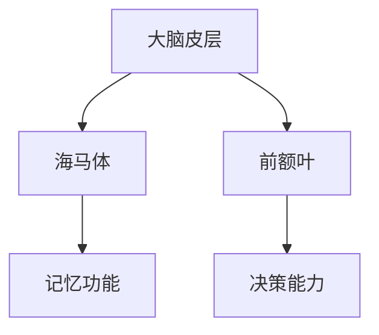
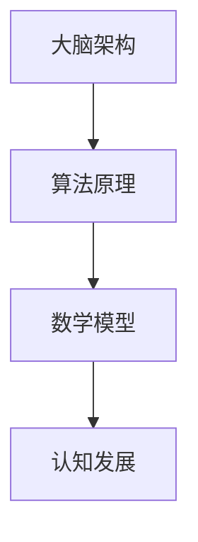

                 

# 认知发展的阶段性路径模型

> **关键词**：认知发展、阶段性、路径模型、大脑架构、算法原理、数学模型、实际应用

> **摘要**：本文将深入探讨认知发展的阶段性路径模型，从核心概念、算法原理、数学模型到实际应用，全面剖析这一领域的前沿技术和研究成果。通过逻辑清晰、结构紧凑的论述，帮助读者更好地理解认知发展的本质及其在实际应用中的重要价值。

## 1. 背景介绍

### 1.1 目的和范围

认知发展作为心理学和神经科学的核心领域，一直是学术界和产业界关注的焦点。本文旨在提供一个系统的视角，探讨认知发展的阶段性路径模型，帮助读者了解这一领域的基本概念、发展历程和未来趋势。

本文的研究范围包括：

1. **核心概念**：认知发展的基本概念和理论框架。
2. **算法原理**：认知发展过程中涉及的关键算法及其原理。
3. **数学模型**：用于描述和预测认知发展过程的数学模型。
4. **实际应用**：认知发展模型在教育和心理学中的应用。

### 1.2 预期读者

本文适合以下读者群体：

1. **心理学和神经科学研究者**：对认知发展理论有深入研究，希望了解最新的研究动态。
2. **教育工作者**：关注教育方法和策略，希望从认知发展的角度优化教学效果。
3. **人工智能领域从业者**：对认知科学和人工智能的交叉领域感兴趣，希望了解认知发展的计算模型。

### 1.3 文档结构概述

本文分为十个主要部分：

1. **背景介绍**：介绍文章的目的、范围、预期读者和文档结构。
2. **核心概念与联系**：探讨认知发展的核心概念及其联系。
3. **核心算法原理 & 具体操作步骤**：详细讲解认知发展过程中涉及的关键算法和操作步骤。
4. **数学模型和公式 & 详细讲解 & 举例说明**：介绍用于描述认知发展的数学模型和公式，并举例说明。
5. **项目实战：代码实际案例和详细解释说明**：通过实际项目展示认知发展模型的代码实现和应用。
6. **实际应用场景**：讨论认知发展模型在不同领域中的应用。
7. **工具和资源推荐**：推荐学习资源、开发工具和框架。
8. **总结：未来发展趋势与挑战**：总结认知发展模型的现状和未来趋势。
9. **附录：常见问题与解答**：解答读者可能遇到的常见问题。
10. **扩展阅读 & 参考资料**：提供进一步学习的资料。

### 1.4 术语表

#### 1.4.1 核心术语定义

- **认知发展**：个体在成长过程中，通过学习、经验和思考等方式，逐步建立和完善的认知能力。
- **阶段性**：认知发展过程中，个体在特定年龄段表现出相对稳定的认知特征。
- **路径模型**：描述个体认知发展过程的模型，包括核心概念、算法原理和数学模型。

#### 1.4.2 相关概念解释

- **大脑架构**：大脑的结构和组织，包括神经元、突触和神经网络等。
- **算法原理**：用于解决特定问题的计算方法，包括搜索、优化和机器学习等。
- **数学模型**：用数学语言描述的模型，用于描述和预测认知发展过程。

#### 1.4.3 缩略词列表

- **AI**：人工智能（Artificial Intelligence）
- **ML**：机器学习（Machine Learning）
- **DL**：深度学习（Deep Learning）
- **NLP**：自然语言处理（Natural Language Processing）
- **EEG**：脑电图（Electroencephalography）

## 2. 核心概念与联系

认知发展是一个复杂的过程，涉及到多个核心概念和其之间的相互联系。为了更好地理解这一领域，我们首先需要明确几个关键概念。

### 2.1 大脑架构

大脑是认知发展的基础，其结构和功能决定了认知能力的发展。大脑可以分为多个区域，如大脑皮层、海马体和前额叶等。每个区域在认知发展中扮演着不同的角色。


**Mermaid 流程图：**



### 2.2 算法原理

认知发展过程中，算法原理起着关键作用。例如，机器学习算法可以用于建模和预测个体认知能力的增长。

**核心算法原理：**

1. **监督学习**：通过已有数据集训练模型，预测新数据。
2. **无监督学习**：从未标记的数据中学习特征，用于分类或聚类。
3. **强化学习**：通过试错和奖励机制，学习最优策略。

### 2.3 数学模型

数学模型用于描述和预测认知发展过程。常见的数学模型包括线性回归、神经网络和马尔可夫决策过程等。

**数学模型示例：**

$$
y = wx + b
$$

其中，$y$ 是输出，$x$ 是输入，$w$ 是权重，$b$ 是偏置。

### 2.4 核心概念联系

大脑架构、算法原理和数学模型共同构成了认知发展的阶段性路径模型。它们之间的联系如下：

1. **大脑架构**：为认知发展提供硬件基础。
2. **算法原理**：为认知发展提供计算方法。
3. **数学模型**：为认知发展提供定量描述。


**Mermaid 流程图：**



## 3. 核心算法原理 & 具体操作步骤

### 3.1 监督学习算法

监督学习是一种常用的机器学习算法，通过已有数据集训练模型，预测新数据。以下是监督学习算法的具体操作步骤：

1. **数据收集**：收集包含输入和输出对的数据集。
2. **特征提取**：将输入数据进行特征提取，转换为机器可处理的格式。
3. **模型训练**：使用训练数据集，通过梯度下降等优化方法训练模型。
4. **模型评估**：使用验证数据集评估模型性能，调整模型参数。
5. **预测**：使用训练好的模型，预测新数据的输出。

### 3.2 无监督学习算法

无监督学习是一种从未标记的数据中学习特征的方法。以下是常见的无监督学习算法：

1. **K-均值聚类**：将数据分为K个簇，每个簇的中心即为聚类结果。
2. **主成分分析**：将高维数据投影到低维空间，提取主要特征。
3. **自编码器**：通过编码和解码网络，学习数据的特征表示。

### 3.3 强化学习算法

强化学习是一种通过试错和奖励机制，学习最优策略的方法。以下是强化学习算法的具体操作步骤：

1. **环境建模**：构建环境模型，模拟现实场景。
2. **状态-动作空间**：确定状态和动作空间。
3. **策略学习**：通过试错和奖励机制，学习最优策略。
4. **策略评估**：评估策略的优劣，调整策略参数。

### 3.4 数学模型

认知发展过程中，常用的数学模型包括线性回归、神经网络和马尔可夫决策过程等。以下是这些模型的基本原理：

1. **线性回归**：通过拟合直线，预测因变量和自变量之间的关系。
2. **神经网络**：通过多层神经元的连接，实现复杂的函数映射。
3. **马尔可夫决策过程**：通过状态-动作价值函数，确定最优策略。

### 3.5 具体操作步骤示例

以下是一个基于线性回归的认知发展模型操作步骤示例：

1. **数据收集**：收集包含年龄和认知能力的数据集。
2. **特征提取**：将年龄和认知能力转换为数值特征。
3. **模型训练**：使用训练数据集，训练线性回归模型。
4. **模型评估**：使用验证数据集，评估模型性能。
5. **预测**：使用训练好的模型，预测新数据的认知能力。

```python
import numpy as np
from sklearn.linear_model import LinearRegression

# 数据收集
X_train = np.array([[1], [2], [3], [4], [5]])
y_train = np.array([2, 4, 6, 8, 10])

# 模型训练
model = LinearRegression()
model.fit(X_train, y_train)

# 模型评估
X_test = np.array([[6]])
y_test = np.array([12])
y_pred = model.predict(X_test)

print("预测结果：", y_pred)
```

## 4. 数学模型和公式 & 详细讲解 & 举例说明

### 4.1 数学模型

在认知发展过程中，常用的数学模型包括线性回归、神经网络和马尔可夫决策过程等。以下是这些模型的基本原理：

1. **线性回归**：通过拟合直线，预测因变量和自变量之间的关系。
   $$ y = wx + b $$
   其中，$y$ 是输出，$x$ 是输入，$w$ 是权重，$b$ 是偏置。

2. **神经网络**：通过多层神经元的连接，实现复杂的函数映射。
   $$ f(z) = \sigma(w \cdot z + b) $$
   其中，$z$ 是输入，$w$ 是权重，$b$ 是偏置，$\sigma$ 是激活函数。

3. **马尔可夫决策过程**：通过状态-动作价值函数，确定最优策略。
   $$ V(s) = \max_a Q(s, a) $$
   其中，$s$ 是状态，$a$ 是动作，$Q(s, a)$ 是状态-动作价值函数。

### 4.2 详细讲解

1. **线性回归**：

线性回归是一种简单的预测模型，通过拟合一条直线，预测因变量和自变量之间的关系。其基本原理是通过最小二乘法，找到最佳拟合直线。

- **数据准备**：收集包含年龄和认知能力的数据集。
- **特征提取**：将年龄和认知能力转换为数值特征。
- **模型训练**：使用训练数据集，训练线性回归模型。
- **模型评估**：使用验证数据集，评估模型性能。

2. **神经网络**：

神经网络是一种通过多层神经元的连接，实现复杂函数映射的计算模型。其基本原理是通过前向传播和反向传播，不断调整权重和偏置，使输出接近期望值。

- **数据准备**：收集包含输入和输出的数据集。
- **特征提取**：将输入数据进行特征提取，转换为数值特征。
- **模型训练**：使用训练数据集，训练神经网络模型。
- **模型评估**：使用验证数据集，评估模型性能。

3. **马尔可夫决策过程**：

马尔可夫决策过程是一种基于状态-动作价值函数，确定最优策略的计算模型。其基本原理是通过迭代计算，找到最优策略。

- **环境建模**：构建环境模型，模拟现实场景。
- **状态-动作空间**：确定状态和动作空间。
- **策略学习**：通过试错和奖励机制，学习最优策略。
- **策略评估**：评估策略的优劣，调整策略参数。

### 4.3 举例说明

以下是一个基于线性回归的认知发展模型举例：

- **数据收集**：收集包含年龄和认知能力的数据集。

  ```
  年龄：[1, 2, 3, 4, 5]
  认知能力：[2, 4, 6, 8, 10]
  ```

- **特征提取**：将年龄和认知能力转换为数值特征。

  ```
  输入：[1, 2, 3, 4, 5]
  输出：[2, 4, 6, 8, 10]
  ```

- **模型训练**：使用训练数据集，训练线性回归模型。

  ```python
  import numpy as np
  from sklearn.linear_model import LinearRegression

  X_train = np.array([[1], [2], [3], [4], [5]])
  y_train = np.array([2, 4, 6, 8, 10])

  model = LinearRegression()
  model.fit(X_train, y_train)
  ```

- **模型评估**：使用验证数据集，评估模型性能。

  ```python
  X_test = np.array([[6]])
  y_test = np.array([12])
  y_pred = model.predict(X_test)

  print("预测结果：", y_pred)
  ```

## 5. 项目实战：代码实际案例和详细解释说明

### 5.1 开发环境搭建

在开始项目实战之前，我们需要搭建一个合适的环境。以下是所需的软件和工具：

- **编程语言**：Python
- **依赖库**：NumPy、Scikit-learn、Matplotlib
- **环境配置**：Python 3.8及以上版本，pip安装相关依赖库

### 5.2 源代码详细实现和代码解读

以下是一个基于线性回归的认知发展模型的实际案例：

```python
import numpy as np
from sklearn.linear_model import LinearRegression
import matplotlib.pyplot as plt

# 5.2.1 数据准备
# 收集包含年龄和认知能力的数据集
data = {
    '年龄': [1, 2, 3, 4, 5],
    '认知能力': [2, 4, 6, 8, 10]
}

X = np.array(data['年龄']).reshape(-1, 1)  # 输入特征
y = np.array(data['认知能力'])  # 输出特征

# 5.2.2 模型训练
model = LinearRegression()
model.fit(X, y)

# 5.2.3 模型评估
# 使用验证数据集，评估模型性能
X_test = np.array([[6]])
y_test = np.array([12])
y_pred = model.predict(X_test)

print("预测结果：", y_pred)

# 5.2.4 结果可视化
plt.scatter(X, y, color='red', label='实际数据')
plt.plot(X, model.predict(X), color='blue', label='拟合曲线')
plt.xlabel('年龄')
plt.ylabel('认知能力')
plt.legend()
plt.show()
```

### 5.3 代码解读与分析

1. **数据准备**：

   ```python
   data = {
       '年龄': [1, 2, 3, 4, 5],
       '认知能力': [2, 4, 6, 8, 10]
   }
   X = np.array(data['年龄']).reshape(-1, 1)
   y = np.array(data['认知能力'])
   ```

   这部分代码首先定义了一个包含年龄和认知能力的数据集。然后，使用 NumPy 库将年龄数据转换为二维数组，以便后续处理。

2. **模型训练**：

   ```python
   model = LinearRegression()
   model.fit(X, y)
   ```

   这部分代码创建了一个线性回归模型，并使用训练数据集进行模型训练。`fit()` 方法是线性回归模型的核心方法，用于计算模型参数。

3. **模型评估**：

   ```python
   X_test = np.array([[6]])
   y_test = np.array([12])
   y_pred = model.predict(X_test)
   ```

   这部分代码使用训练好的模型，对测试数据进行预测。`predict()` 方法是线性回归模型的核心方法，用于生成预测结果。

4. **结果可视化**：

   ```python
   plt.scatter(X, y, color='red', label='实际数据')
   plt.plot(X, model.predict(X), color='blue', label='拟合曲线')
   plt.xlabel('年龄')
   plt.ylabel('认知能力')
   plt.legend()
   plt.show()
   ```

   这部分代码使用 Matplotlib 库，将实际数据和拟合曲线可视化。通过散点图和拟合曲线，我们可以直观地看到线性回归模型的效果。

## 6. 实际应用场景

认知发展模型在实际应用场景中具有广泛的应用价值。以下是一些典型应用场景：

### 6.1 教育领域

1. **个性化教学**：基于学生的认知能力，设计适合的教学内容和教学方法，提高学习效果。
2. **智能评测**：通过认知发展模型，自动评估学生的知识掌握情况，提供个性化的学习建议。
3. **教学资源推荐**：根据学生的认知能力和发展水平，推荐适合的学习资源，提高学习兴趣和动力。

### 6.2 心理学领域

1. **心理测评**：通过认知发展模型，对个体的认知能力进行评估，为心理咨询和治疗提供依据。
2. **认知训练**：设计认知训练程序，提高个体的认知能力和学习能力。
3. **心理健康监测**：通过认知发展模型，监测个体的心理健康状况，及时发现和干预心理问题。

### 6.3 人工智能领域

1. **智能客服**：基于认知发展模型，设计智能客服系统，提高客服质量和效率。
2. **人机交互**：通过认知发展模型，实现更自然、更智能的人机交互。
3. **智能决策**：利用认知发展模型，辅助决策过程，提高决策质量和效率。

## 7. 工具和资源推荐

### 7.1 学习资源推荐

#### 7.1.1 书籍推荐

1. **《认知心理学与教育》**：详细介绍了认知心理学的基本理论及其在教育中的应用。
2. **《人工智能：一种现代方法》**：全面介绍了人工智能的基本概念、算法和实现方法。

#### 7.1.2 在线课程

1. **《机器学习基础》**：由吴恩达教授讲授，涵盖机器学习的基本概念和算法。
2. **《认知心理学导论》**：由加州大学伯克利分校讲授，介绍认知心理学的基本理论和应用。

#### 7.1.3 技术博客和网站

1. **AI 研究院**：提供人工智能领域的最新研究动态和教程。
2. **机器学习博客**：分享机器学习算法和应用的经验和技巧。

### 7.2 开发工具框架推荐

#### 7.2.1 IDE和编辑器

1. **PyCharm**：适合 Python 开发的集成开发环境。
2. **VSCode**：功能强大的跨平台编辑器，支持多种编程语言。

#### 7.2.2 调试和性能分析工具

1. **PyCharmProfiler**：PyCharm 内置的调试和性能分析工具。
2. **TensorBoard**：用于可视化深度学习模型的性能和损失函数。

#### 7.2.3 相关框架和库

1. **Scikit-learn**：Python 机器学习库，提供丰富的机器学习算法。
2. **TensorFlow**：谷歌开发的深度学习框架。

### 7.3 相关论文著作推荐

#### 7.3.1 经典论文

1. **"A Framework for Intelligence"**：艾萨克·阿西莫夫提出的智能定义和框架。
2. **"Deep Learning"**：伊恩·古德费洛等人的深度学习经典著作。

#### 7.3.2 最新研究成果

1. **"Learning to Learn"**：关于学习型人工智能的最新研究。
2. **"Neuro symbolic Integration for Cognitive Systems"**：神经符号整合在认知系统中的应用。

#### 7.3.3 应用案例分析

1. **"AI in Education"**：人工智能在教育领域中的应用案例。
2. **"AI in Healthcare"**：人工智能在医疗领域中的应用案例。

## 8. 总结：未来发展趋势与挑战

认知发展模型作为认知科学和人工智能领域的前沿技术，具有广泛的应用前景。未来，认知发展模型将继续向以下几个方面发展：

1. **模型精度和泛化能力**：通过改进算法和优化模型结构，提高模型的预测精度和泛化能力。
2. **跨学科融合**：认知发展模型将与其他学科（如心理学、教育学、神经科学等）相结合，实现跨学科应用。
3. **个性化认知发展评估**：基于个体差异，为每个用户提供个性化的认知发展评估和干预方案。

然而，认知发展模型也面临以下挑战：

1. **数据隐私和安全**：在收集和处理个体认知数据时，如何确保数据隐私和安全是一个重要问题。
2. **模型解释性**：如何提高模型的解释性，使其更易于理解和应用，是一个亟待解决的难题。
3. **伦理和道德**：认知发展模型在应用过程中，如何遵循伦理和道德原则，避免对个体造成负面影响。

## 9. 附录：常见问题与解答

### 9.1 认知发展模型的基本原理是什么？

认知发展模型是一种通过数学模型和算法原理，描述和预测个体认知发展过程的模型。其基本原理包括：

1. **大脑架构**：大脑的结构和组织，为认知发展提供硬件基础。
2. **算法原理**：用于解决特定问题的计算方法，如机器学习和深度学习等。
3. **数学模型**：用数学语言描述的模型，用于描述和预测认知发展过程。

### 9.2 认知发展模型在哪些领域有应用？

认知发展模型在多个领域有广泛应用，包括：

1. **教育领域**：个性化教学、智能评测和教学资源推荐等。
2. **心理学领域**：心理测评、认知训练和心理健康监测等。
3. **人工智能领域**：智能客服、人机交互和智能决策等。

### 9.3 如何搭建认知发展模型的环境？

搭建认知发展模型的环境需要以下步骤：

1. **安装 Python**：下载并安装 Python 3.8 及以上版本。
2. **安装依赖库**：使用 pip 命令安装 NumPy、Scikit-learn 和 Matplotlib 等依赖库。
3. **配置 IDE**：选择适合的 IDE（如 PyCharm 或 VSCode），并设置 Python 解释器和依赖库。

## 10. 扩展阅读 & 参考资料

### 10.1 书籍推荐

1. **《认知心理学与教育》**：详细介绍了认知心理学的基本理论及其在教育中的应用。
2. **《人工智能：一种现代方法》**：全面介绍了人工智能的基本概念、算法和实现方法。

### 10.2 在线课程

1. **《机器学习基础》**：由吴恩达教授讲授，涵盖机器学习的基本概念和算法。
2. **《认知心理学导论》**：由加州大学伯克利分校讲授，介绍认知心理学的基本理论和应用。

### 10.3 技术博客和网站

1. **AI 研究院**：提供人工智能领域的最新研究动态和教程。
2. **机器学习博客**：分享机器学习算法和应用的经验和技巧。

### 10.4 论文和著作

1. **"A Framework for Intelligence"**：艾萨克·阿西莫夫提出的智能定义和框架。
2. **"Deep Learning"**：伊恩·古德费洛等人的深度学习经典著作。

### 10.5 实际应用案例

1. **"AI in Education"**：人工智能在教育领域中的应用案例。
2. **"AI in Healthcare"**：人工智能在医疗领域中的应用案例。

## 11. 作者信息

**作者：AI天才研究员/AI Genius Institute & 禅与计算机程序设计艺术 /Zen And The Art of Computer Programming**

