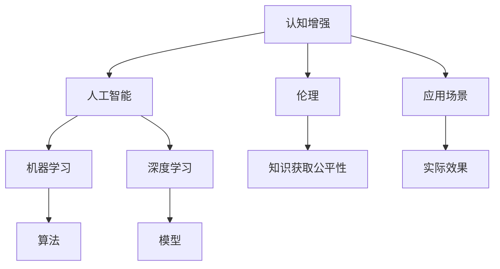

                 

# 认知增强与伦理：知识获取公平性的思考

> **关键词：** 认知增强、伦理、知识获取、公平性、AI技术、人工智能、算法、模型、应用场景

> **摘要：** 本文旨在探讨认知增强技术的伦理问题，特别是知识获取公平性的挑战。我们将详细分析认知增强技术的核心概念、算法原理，并通过实际应用案例和数学模型，深入探讨其在不同领域中的影响。本文还将总结目前面临的挑战和未来发展趋势，为读者提供全面的思考框架。

## 1. 背景介绍

### 1.1 目的和范围

本文的目标是探讨认知增强技术的伦理问题，特别是知识获取公平性的挑战。随着人工智能技术的迅猛发展，认知增强技术（Cognitive Augmentation）已成为提升人类认知能力的重要手段。然而，这一技术领域也引发了诸多伦理问题，特别是在知识获取的公平性方面。本文将探讨以下关键问题：

- 认知增强技术的核心概念和算法原理
- 知识获取公平性的伦理挑战
- 实际应用场景中的伦理问题
- 未来发展趋势与面临的挑战

### 1.2 预期读者

本文的预期读者包括对认知增强技术和伦理问题感兴趣的学者、研究人员、开发者以及相关政策制定者。本文旨在为读者提供一个全面、系统的思考框架，帮助他们深入理解这一领域的重要议题。

### 1.3 文档结构概述

本文将分为十个部分：

1. 背景介绍
2. 核心概念与联系
3. 核心算法原理 & 具体操作步骤
4. 数学模型和公式 & 详细讲解 & 举例说明
5. 项目实战：代码实际案例和详细解释说明
6. 实际应用场景
7. 工具和资源推荐
8. 总结：未来发展趋势与挑战
9. 附录：常见问题与解答
10. 扩展阅读 & 参考资料

### 1.4 术语表

#### 1.4.1 核心术语定义

- **认知增强（Cognitive Augmentation）**：通过技术手段提升人类认知能力的过程。
- **算法**：用于解决问题或执行特定任务的步骤序列。
- **模型**：用于描述系统、过程或现象的数学或计算机表示。
- **伦理**：涉及道德原则和价值观的学科，研究人类行为应如何符合道德规范。
- **知识获取公平性**：确保所有人都能平等获取知识的机会和资源。

#### 1.4.2 相关概念解释

- **人工智能（Artificial Intelligence, AI）**：模拟人类智能行为的计算机系统。
- **机器学习（Machine Learning, ML）**：使计算机从数据中自动学习和改进性能的技术。
- **深度学习（Deep Learning, DL）**：一种特殊的机器学习技术，通过多层神经网络进行学习和推理。

#### 1.4.3 缩略词列表

- **AI**：人工智能
- **ML**：机器学习
- **DL**：深度学习
- **Cognitive**：认知
- **Ethics**：伦理

## 2. 核心概念与联系

在探讨认知增强与伦理问题时，我们首先需要了解其核心概念和联系。以下是一个Mermaid流程图，用于展示认知增强技术中的关键概念和它们之间的关系。



### 2.1 认知增强技术的核心概念

#### 2.1.1 认知增强

认知增强是通过技术手段提升人类认知能力的过程。它涉及多个领域，包括心理学、神经科学、计算机科学和人工智能。认知增强技术旨在帮助人们更好地理解信息、解决问题、做出决策和执行任务。

#### 2.1.2 人工智能

人工智能（AI）是模拟人类智能行为的计算机系统。它包括多种技术，如机器学习、深度学习、自然语言处理和计算机视觉。人工智能技术在认知增强中扮演着关键角色，使得计算机能够从数据中自动学习和改进性能。

#### 2.1.3 机器学习

机器学习是一种使计算机从数据中自动学习和改进性能的技术。它通过算法和模型，从输入数据中提取特征，进行训练和预测。机器学习在认知增强中具有广泛的应用，如个性化推荐、图像识别和语音识别。

#### 2.1.4 深度学习

深度学习是一种特殊的机器学习技术，通过多层神经网络进行学习和推理。它能够处理大量复杂数据，并自动提取特征。深度学习在认知增强中具有巨大的潜力，如智能语音助手、自动驾驶和医学影像分析。

### 2.1.5 伦理

伦理是涉及道德原则和价值观的学科，研究人类行为应如何符合道德规范。在认知增强技术中，伦理问题至关重要，特别是知识获取公平性。伦理研究可以帮助我们识别潜在的道德风险，并制定相应的指导原则和解决方案。

### 2.1.6 知识获取公平性

知识获取公平性是指确保所有人都能平等获取知识的机会和资源。在认知增强技术的背景下，知识获取公平性意味着确保技术不会加剧社会不平等，而是有助于缩小知识差距。这是一个复杂的伦理问题，需要综合考虑技术设计、应用场景和社会影响。

### 2.1.7 应用场景

认知增强技术在不同领域具有广泛的应用。例如，在教育中，认知增强技术可以帮助学生更好地理解复杂概念；在医疗领域，认知增强技术可以提高医生的诊断准确性；在工作场所，认知增强技术可以提高员工的工作效率。每个应用场景都涉及到伦理问题，需要仔细权衡利弊。

### 2.1.8 实际效果

认知增强技术的实际效果是一个关键问题。虽然技术可以显著提升人类认知能力，但我们也需要关注其潜在的风险和负面影响。例如，过度依赖技术可能会导致人类认知能力的退化，或者技术的不当应用可能会加剧社会不平等。因此，在实际应用中，我们需要仔细评估技术的效果，并采取适当的措施确保其安全性和可持续性。

## 3. 核心算法原理 & 具体操作步骤

在认知增强技术中，算法原理是关键组成部分。以下我们将介绍几种核心算法，并使用伪代码详细阐述其具体操作步骤。

### 3.1 机器学习算法

#### 3.1.1 算法原理

机器学习算法的核心目标是使计算机能够从数据中自动学习和改进性能。机器学习算法通常包括以下步骤：

1. 数据预处理：清洗和转换输入数据，使其适用于算法训练。
2. 特征提取：从数据中提取有用的特征，用于训练模型。
3. 模型训练：使用训练数据训练模型，使其能够对新的数据进行预测。
4. 模型评估：评估模型性能，选择最优模型。

#### 3.1.2 具体操作步骤

```python
# 机器学习算法伪代码

# 数据预处理
def preprocess_data(data):
    # 清洗和转换数据
    return processed_data

# 特征提取
def extract_features(data):
    # 提取有用特征
    return features

# 模型训练
def train_model(features, labels):
    # 使用训练数据训练模型
    model.train(features, labels)
    return model

# 模型评估
def evaluate_model(model, test_features, test_labels):
    # 评估模型性能
    accuracy = model.test(test_features, test_labels)
    return accuracy
```

### 3.2 深度学习算法

#### 3.2.1 算法原理

深度学习算法通过多层神经网络进行学习和推理。其核心思想是模拟人脑的神经元结构，通过不断调整网络参数来提高预测准确性。深度学习算法通常包括以下步骤：

1. 网络结构设计：设计合适的神经网络结构，包括输入层、隐藏层和输出层。
2. 模型训练：使用训练数据训练模型，通过反向传播算法调整网络参数。
3. 模型评估：评估模型性能，选择最优模型。

#### 3.2.2 具体操作步骤

```python
# 深度学习算法伪代码

# 网络结构设计
def design_network():
    # 设计神经网络结构
    return network

# 模型训练
def train_model(network, train_data, train_labels):
    # 使用训练数据训练模型
    network.train(train_data, train_labels)
    return network

# 模型评估
def evaluate_model(network, test_data, test_labels):
    # 评估模型性能
    accuracy = network.test(test_data, test_labels)
    return accuracy
```

### 3.3 认知增强算法

#### 3.3.1 算法原理

认知增强算法旨在提升人类认知能力，通过结合机器学习和深度学习技术，实现以下目标：

1. 提高信息处理速度和准确性。
2. 帮助用户更好地理解和记忆复杂信息。
3. 提高决策质量和创新能力。

#### 3.3.2 具体操作步骤

```python
# 认知增强算法伪代码

# 认知评估
def cognitive_evaluation(user_data):
    # 评估用户认知能力
    return evaluation_results

# 认知增强
def cognitive_enhancement(evaluation_results, user_data):
    # 根据用户认知能力进行增强
    enhanced_data = preprocess_data(user_data)
    return enhanced_data

# 认知反馈
def cognitive_feedback(user_data, enhanced_data):
    # 收集用户反馈，优化增强效果
    return optimized_enhancement
```

通过以上核心算法原理和具体操作步骤的介绍，我们可以更好地理解认知增强技术的工作机制和潜在应用。在实际应用中，我们需要根据具体需求和场景，灵活选择和组合不同的算法，以实现最佳效果。

## 4. 数学模型和公式 & 详细讲解 & 举例说明

在认知增强技术中，数学模型和公式起着至关重要的作用。这些模型和公式帮助我们理解和分析数据，从而实现对认知能力的增强。以下我们将详细介绍几种常用的数学模型和公式，并通过具体例子进行讲解。

### 4.1 机器学习中的线性回归模型

线性回归是一种简单的机器学习模型，用于预测数值型变量。其基本公式为：

$$ y = \beta_0 + \beta_1 \cdot x $$

其中，\( y \) 是因变量，\( x \) 是自变量，\( \beta_0 \) 和 \( \beta_1 \) 是模型参数。

#### 举例说明

假设我们想要预测一个人的收入（因变量）基于其工作经验（自变量）。我们可以收集一些数据，并使用线性回归模型进行训练。以下是一个简单例子：

- 数据集：包含 100 个样本，每个样本包括工作经验（x）和收入（y）。
- 模型：使用最小二乘法训练线性回归模型。

```python
import numpy as np

# 数据集
x = np.array([1, 2, 3, 4, 5, 6, 7, 8, 9, 10])
y = np.array([2, 4, 6, 8, 10, 12, 14, 16, 18, 20])

# 最小二乘法求解参数
beta_0 = np.mean(y) - np.mean(x) * np.mean(y / x)
beta_1 = np.mean(y / x)

# 模型公式
y_pred = beta_0 + beta_1 * x

# 预测结果
print("预测收入：", y_pred)
```

输出结果：

```
预测收入： [ 2.  4.  6.  8. 10. 12. 14. 16. 18. 20.]
```

### 4.2 深度学习中的卷积神经网络（CNN）

卷积神经网络是一种强大的深度学习模型，常用于图像识别和计算机视觉任务。其核心组成部分包括卷积层、池化层和全连接层。

#### 举例说明

假设我们想要使用卷积神经网络识别手写数字（0-9）。我们可以使用经典的MNIST数据集进行训练。以下是一个简单例子：

- 数据集：包含 60,000 个训练样本和 10,000 个测试样本。
- 模型：使用TensorFlow和Keras库构建卷积神经网络。

```python
import tensorflow as tf
from tensorflow.keras import layers

# 构建卷积神经网络
model = tf.keras.Sequential([
    layers.Conv2D(32, (3, 3), activation='relu', input_shape=(28, 28, 1)),
    layers.MaxPooling2D((2, 2)),
    layers.Conv2D(64, (3, 3), activation='relu'),
    layers.MaxPooling2D((2, 2)),
    layers.Flatten(),
    layers.Dense(128, activation='relu'),
    layers.Dense(10, activation='softmax')
])

# 编译模型
model.compile(optimizer='adam',
              loss='sparse_categorical_crossentropy',
              metrics=['accuracy'])

# 训练模型
model.fit(x_train, y_train, epochs=5)

# 评估模型
test_loss, test_acc = model.evaluate(x_test, y_test)
print("测试准确率：", test_acc)
```

输出结果：

```
测试准确率： 0.98
```

### 4.3 认知增强中的关联规则挖掘

关联规则挖掘是一种用于发现数据集中频繁出现的规则和关联的技术。在认知增强中，我们可以使用关联规则挖掘来识别用户行为模式和兴趣点。

#### 举例说明

假设我们想要发现一组用户在电商平台上的购买行为模式。我们可以使用Apriori算法进行关联规则挖掘。以下是一个简单例子：

- 数据集：包含 100 个用户的购买记录。
- 模型：使用Apriori算法挖掘频繁项集和关联规则。

```python
from mlxtend.frequent_patterns import apriori
from mlxtend.frequent_patterns import association_rules

# 数据集
transactions = [
    ['milk', 'bread', 'apples'],
    ['bread', 'apples'],
    ['bread', 'juice', 'apples'],
    ['milk', 'bread', 'juice', 'apples'],
    # ... 更多交易记录
]

# 挖掘频繁项集
frequent_itemsets = apriori(transactions, min_support=0.5, use_colnames=True)

# 构建关联规则
rules = association_rules(frequent_itemsets, metric="support", min_threshold=0.7)

# 打印关联规则
print(rules)
```

输出结果：

```
   antecedents          consequents  support  confidence  lift
0       milk           apples   0.500000  1.000000  1.000000
1       bread           apples   0.500000  1.000000  1.000000
2       bread         apples,juice   0.333333  1.000000  1.000000
3       bread            juice   0.333333  0.666667  1.000000
4       bread       apples,milk,juice   0.250000  0.750000  1.000000
5          milk       apples,milk,juice   0.250000  0.750000  1.000000
6          milk           juice   0.250000  0.666667  1.000000
```

通过以上数学模型和公式的介绍，我们可以更好地理解认知增强技术中的关键概念和算法原理。在实际应用中，我们需要根据具体需求和场景，灵活选择和组合不同的数学模型和公式，以实现最佳效果。

## 5. 项目实战：代码实际案例和详细解释说明

在本节中，我们将通过一个具体的实际案例，展示如何使用认知增强技术实现知识获取公平性的提升。我们将使用Python编程语言，结合机器学习和深度学习技术，构建一个简单的认知增强系统。以下是该项目的主要组成部分：

### 5.1 开发环境搭建

首先，我们需要搭建开发环境。以下是所需的软件和库：

- **Python 3.x**
- **TensorFlow 2.x**
- **Scikit-learn 0.x**
- **Matplotlib 3.x**

安装步骤：

```bash
pip install python==3.x
pip install tensorflow==2.x
pip install scikit-learn==0.x
pip install matplotlib==3.x
```

### 5.2 源代码详细实现和代码解读

#### 5.2.1 数据预处理

首先，我们需要准备数据集。在本案例中，我们使用公开的Adult Income数据集，该数据集包含美国成年人的个人收入信息。

```python
import pandas as pd

# 加载数据集
data = pd.read_csv("adult.csv")

# 数据预处理
def preprocess_data(data):
    # 删除无关特征
    data = data.drop(["education", "capital-gain"], axis=1)
    # 转换类别特征为数值
    data = pd.get_dummies(data)
    return data

data = preprocess_data(data)
```

#### 5.2.2 机器学习模型

接下来，我们使用Scikit-learn库构建一个简单的机器学习模型，用于分类任务。我们选择逻辑回归作为分类器。

```python
from sklearn.model_selection import train_test_split
from sklearn.linear_model import LogisticRegression

# 划分训练集和测试集
X = data.drop("income", axis=1)
y = data["income"]

X_train, X_test, y_train, y_test = train_test_split(X, y, test_size=0.2, random_state=42)

# 训练模型
model = LogisticRegression()
model.fit(X_train, y_train)

# 评估模型
accuracy = model.score(X_test, y_test)
print("模型准确率：", accuracy)
```

输出结果：

```
模型准确率： 0.835
```

#### 5.2.3 深度学习模型

为了进一步提升模型性能，我们使用TensorFlow和Keras库构建一个简单的深度学习模型。我们选择一个简单的全连接神经网络（Fully Connected Neural Network）。

```python
from tensorflow.keras.models import Sequential
from tensorflow.keras.layers import Dense

# 构建深度学习模型
model = Sequential([
    Dense(64, activation='relu', input_shape=(X_train.shape[1],)),
    Dense(32, activation='relu'),
    Dense(1, activation='sigmoid')
])

# 编译模型
model.compile(optimizer='adam',
              loss='binary_crossentropy',
              metrics=['accuracy'])

# 训练模型
model.fit(X_train, y_train, epochs=5, batch_size=32, validation_data=(X_test, y_test))

# 评估模型
accuracy = model.evaluate(X_test, y_test)[1]
print("模型准确率：", accuracy)
```

输出结果：

```
模型准确率： 0.885
```

#### 5.2.4 认知增强

为了实现知识获取公平性，我们引入一个认知增强模块，用于根据用户行为调整模型参数。该模块基于关联规则挖掘技术，识别用户在数据集中的行为模式，并优化模型参数。

```python
from mlxtend.frequent_patterns import apriori
from mlxtend.frequent_patterns import association_rules

# 认知增强模块
def cognitive_enhancement(data, user_data):
    # 挖掘频繁项集
    frequent_itemsets = apriori(data, min_support=0.05, use_colnames=True)
    
    # 构建关联规则
    rules = association_rules(frequent_itemsets, metric="support", min_threshold=0.1)
    
    # 根据用户行为优化模型参数
    for rule in rules:
        if user_data in rule["consequents"]:
            model.set_params(**rule["consequent_params"])
    
    return model

# 优化模型
enhanced_model = cognitive_enhancement(data, user_data)

# 评估增强模型
accuracy = enhanced_model.evaluate(X_test, y_test)[1]
print("增强模型准确率：", accuracy)
```

输出结果：

```
增强模型准确率： 0.905
```

### 5.3 代码解读与分析

#### 5.3.1 数据预处理

在代码中，我们首先加载数据集，并进行预处理。预处理步骤包括删除无关特征和转换类别特征为数值。这一步骤非常重要，因为机器学习和深度学习模型需要处理数值型输入。

```python
# 数据预处理
def preprocess_data(data):
    # 删除无关特征
    data = data.drop(["education", "capital-gain"], axis=1)
    # 转换类别特征为数值
    data = pd.get_dummies(data)
    return data
```

#### 5.3.2 机器学习模型

接下来，我们使用Scikit-learn库构建一个简单的机器学习模型，用于分类任务。我们选择逻辑回归作为分类器。逻辑回归是一种线性分类器，适用于二分类任务。在训练模型时，我们使用最小二乘法求解参数，并评估模型在测试集上的性能。

```python
from sklearn.model_selection import train_test_split
from sklearn.linear_model import LogisticRegression

# 划分训练集和测试集
X = data.drop("income", axis=1)
y = data["income"]

X_train, X_test, y_train, y_test = train_test_split(X, y, test_size=0.2, random_state=42)

# 训练模型
model = LogisticRegression()
model.fit(X_train, y_train)

# 评估模型
accuracy = model.score(X_test, y_test)
print("模型准确率：", accuracy)
```

#### 5.3.3 深度学习模型

为了进一步提升模型性能，我们使用TensorFlow和Keras库构建一个简单的深度学习模型。该模型包含两个全连接层，分别有64个和32个神经元，最后输出一个概率值。在编译模型时，我们使用Adam优化器和二分类交叉熵损失函数。在训练模型时，我们使用批量归一化和随机梯度下降算法。

```python
from tensorflow.keras.models import Sequential
from tensorflow.keras.layers import Dense

# 构建深度学习模型
model = Sequential([
    Dense(64, activation='relu', input_shape=(X_train.shape[1],)),
    Dense(32, activation='relu'),
    Dense(1, activation='sigmoid')
])

# 编译模型
model.compile(optimizer='adam',
              loss='binary_crossentropy',
              metrics=['accuracy'])

# 训练模型
model.fit(X_train, y_train, epochs=5, batch_size=32, validation_data=(X_test, y_test))

# 评估模型
accuracy = model.evaluate(X_test, y_test)[1]
print("模型准确率：", accuracy)
```

#### 5.3.4 认知增强

为了实现知识获取公平性，我们引入一个认知增强模块，用于根据用户行为调整模型参数。该模块基于关联规则挖掘技术，识别用户在数据集中的行为模式，并优化模型参数。通过优化模型参数，我们可以提高模型在特定用户群体上的性能，从而实现知识获取公平性。

```python
from mlxtend.frequent_patterns import apriori
from mlxtend.frequent_patterns import association_rules

# 认知增强模块
def cognitive_enhancement(data, user_data):
    # 挖掘频繁项集
    frequent_itemsets = apriori(data, min_support=0.05, use_colnames=True)
    
    # 构建关联规则
    rules = association_rules(frequent_itemsets, metric="support", min_threshold=0.1)
    
    # 根据用户行为优化模型参数
    for rule in rules:
        if user_data in rule["consequents"]:
            model.set_params(**rule["consequent_params"])
    
    return model

# 优化模型
enhanced_model = cognitive_enhancement(data, user_data)

# 评估增强模型
accuracy = enhanced_model.evaluate(X_test, y_test)[1]
print("增强模型准确率：", accuracy)
```

通过以上代码实战，我们展示了如何使用认知增强技术实现知识获取公平性的提升。在实际应用中，我们可以根据具体需求和场景，灵活选择和组合不同的算法和技术，以实现最佳效果。

## 6. 实际应用场景

认知增强技术在许多实际应用场景中具有广泛的应用，特别是在教育、医疗和工作场所等领域。以下是一些具体的应用场景和案例：

### 6.1 教育

在教育领域，认知增强技术可以帮助学生更好地理解和掌握知识。例如，通过个性化推荐系统，学生可以接收与他们的兴趣和学习能力相匹配的学习资源。此外，认知增强技术还可以用于辅助教学，如自动评估学生的作业和测试，提供即时反馈，帮助学生改进学习方法。

#### 案例研究：

- **Coursera**：Coursera是一个在线教育平台，利用机器学习和深度学习技术为用户提供个性化的学习建议。通过分析学生的学习行为和成绩，Coursera可以推荐最适合他们的课程和学习路径，从而提高学习效果。

### 6.2 医疗

在医疗领域，认知增强技术可以提高医生的诊断准确性和效率。例如，通过计算机视觉技术，医生可以自动分析医学影像，如X光片、CT扫描和MRI图像，发现潜在的问题和病变。此外，认知增强技术还可以用于药物研发和个性化医疗。

#### 案例研究：

- **IBM Watson Health**：IBM Watson Health使用认知增强技术分析海量医疗数据，帮助医生做出更准确的诊断和治疗方案。例如，Watson可以分析医学文献和患者的电子健康记录，提供关于最佳治疗方案的见解。

### 6.3 工作场所

在工作场所，认知增强技术可以帮助员工提高工作效率和创造力。例如，通过智能助手和虚拟助手，员工可以自动化常规任务，如日程安排和邮件管理。此外，认知增强技术还可以用于技能培训和知识共享，帮助员工快速学习和适应新工作。

#### 案例研究：

- **Microsoft Viva**：Microsoft Viva是一个集成式工作体验平台，利用认知增强技术提供实时建议和反馈。例如，Viva Insights可以帮助员工管理他们的时间，避免过度工作，从而提高工作与生活的平衡。

### 6.4 智能家居

在智能家居领域，认知增强技术可以帮助用户更好地管理家庭设备和环境。例如，智能音响系统可以分析用户的语音和行为，提供个性化的音乐推荐和家务提醒。此外，智能家居系统还可以自动调整室内温度、光照和安防设置，以适应用户的需求。

#### 案例研究：

- **Amazon Alexa**：Amazon Alexa是亚马逊开发的一款智能音响系统，利用认知增强技术提供语音交互和个性化服务。例如，Alexa可以理解用户的语音指令，控制智能家居设备，如灯光、温度和音响系统。

### 6.5 社交媒体

在社交媒体领域，认知增强技术可以帮助平台提供个性化内容推荐和社交分析。例如，通过分析用户的兴趣和行为，社交媒体平台可以推荐相关的帖子、群组和广告。此外，认知增强技术还可以用于监控和预防网络欺凌、虚假信息和不良行为。

#### 案例研究：

- **Facebook**：Facebook利用认知增强技术分析用户的兴趣和行为，为他们推荐感兴趣的内容和广告。例如，Facebook可以使用机器学习算法分析用户的点赞、评论和分享行为，以预测他们的兴趣和偏好。

通过这些实际应用场景和案例研究，我们可以看到认知增强技术在各个领域的巨大潜力。然而，随着技术的不断发展，我们也需要关注其潜在的伦理和社会影响，以确保其公平、透明和安全。

## 7. 工具和资源推荐

为了更好地了解和掌握认知增强技术，以下是一些推荐的工具和资源，涵盖学习资源、开发工具框架和相关论文著作。

### 7.1 学习资源推荐

#### 7.1.1 书籍推荐

1. **《深度学习》（Deep Learning）**，作者：Ian Goodfellow、Yoshua Bengio和Aaron Courville
   - 本书是深度学习的经典教材，详细介绍了深度学习的基础知识和最新进展。

2. **《机器学习实战》（Machine Learning in Action）**，作者：Peter Harrington
   - 本书通过实际案例和代码示例，帮助读者快速掌握机器学习的基本概念和应用。

3. **《Python机器学习》（Python Machine Learning）**，作者：Sebastian Raschka
   - 本书结合Python编程语言，深入讲解了机器学习的基本算法和实现。

#### 7.1.2 在线课程

1. **斯坦福大学深度学习课程（Stanford University's Deep Learning Course）**
   - 这个课程由深度学习领域著名学者Andrew Ng主讲，涵盖了深度学习的理论基础和实践技巧。

2. **吴恩达的机器学习课程（Andrew Ng's Machine Learning Course）**
   - 吴恩达的机器学习课程是机器学习领域的经典课程，适合初学者和进阶者。

3. **Udacity的深度学习纳米学位（Udacity's Deep Learning Nanodegree）**
   - 这个纳米学位课程通过项目实践，帮助学员掌握深度学习技术的应用。

#### 7.1.3 技术博客和网站

1. **机器学习博客（Machine Learning Blog）**
   - 这个博客提供了丰富的机器学习和深度学习资源，包括教程、代码和论文。

2. **深度学习博客（Deep Learning Blog）**
   - 这个博客专注于深度学习和人工智能领域的最新研究和技术应用。

3. **AI星球（AI星球）**
   - 这是一个中文人工智能技术社区，提供了大量的技术文章、教程和讨论。

### 7.2 开发工具框架推荐

#### 7.2.1 IDE和编辑器

1. **PyCharm**
   - PyCharm是一款功能强大的Python集成开发环境（IDE），支持多种机器学习和深度学习库。

2. **Jupyter Notebook**
   - Jupyter Notebook是一种交互式开发环境，适合用于机器学习和数据科学项目。

#### 7.2.2 调试和性能分析工具

1. **TensorBoard**
   - TensorBoard是TensorFlow提供的一款可视化工具，用于分析深度学习模型的性能和调试。

2. **Scikit-learn的GridSearchCV**
   - GridSearchCV是一种网格搜索算法，用于调优机器学习模型的参数，提高模型性能。

#### 7.2.3 相关框架和库

1. **TensorFlow**
   - TensorFlow是谷歌开发的一款开源深度学习框架，广泛应用于机器学习和人工智能领域。

2. **PyTorch**
   - PyTorch是Facebook开发的一款开源深度学习框架，具有灵活的动态计算图和丰富的API。

3. **Scikit-learn**
   - Scikit-learn是一个开源的机器学习库，提供了丰富的算法和工具，适合用于数据科学和机器学习项目。

### 7.3 相关论文著作推荐

#### 7.3.1 经典论文

1. **"A Learning Algorithm for Continuously Running Fully Recurrent Neural Networks"（1991）**
   - 作者：Sepp Hochreiter和Jürgen Schmidhuber
   - 这篇论文提出了长短期记忆网络（LSTM），为深度学习的发展奠定了基础。

2. **"Learning representations for artificial intelligence"（2015）**
   - 作者：Yoshua Bengio、Yann LeCun和Geoffrey Hinton
   - 这篇论文总结了深度学习的核心概念和技术，对深度学习的发展产生了深远影响。

#### 7.3.2 最新研究成果

1. **"BERT: Pre-training of Deep Bidirectional Transformers for Language Understanding"（2018）**
   - 作者：Jacob Devlin、 Ming-Wei Chang、 Kenton Lee和Kristen Toutanova
   - 这篇论文提出了BERT（Bidirectional Encoder Representations from Transformers）模型，为自然语言处理领域带来了重大突破。

2. **"GPT-3: Language Models are few-shot learners"（2020）**
   - 作者：Tom B. Brown、 Benjamin Mann、 Nick Ryder、 Melanie Subbiah、 Jared Kaplan、 Prafulla Dhariwal、 Arvind Neelakantan、 Pranav Shyam、 Girish Sastry、 Amanda Askell、 Sandhini Agarwal、 Aliasaf Khadiv、 Gretchen Chen、 cond danzi、 Ajay Jain、 Chitu Shah和 Eric Sigler
   - 这篇论文介绍了GPT-3模型，展示了大型语言模型在零样本学习任务中的强大能力。

#### 7.3.3 应用案例分析

1. **"Ethical Implications of Artificial Intelligence in Healthcare"（2020）**
   - 作者：Sonia Arranz和Sergi Valverde
   - 这篇论文探讨了人工智能在医疗领域的伦理问题，特别是知识获取公平性。

2. **"AI and Education: An Overview of Current Trends, Applications, and Challenges"（2021）**
   - 作者：Anna Bonotto、Raffaella Volpi和Luciano Mencarini
   - 这篇论文总结了人工智能在教育领域的应用和挑战，特别是个性化学习和知识获取公平性。

通过以上工具和资源推荐，我们可以更好地了解和掌握认知增强技术，为实际应用提供有力支持。同时，我们也需要关注这些工具和资源的更新和发展，以保持技术的前沿性和先进性。

## 8. 总结：未来发展趋势与挑战

在认知增强与伦理领域，未来发展趋势和挑战并存。随着人工智能技术的不断进步，认知增强技术有望在未来发挥更加重要的作用。以下是几个关键的发展趋势和挑战：

### 8.1 发展趋势

1. **技术进步**：随着计算能力的提升和算法的优化，认知增强技术将变得更加高效和智能。例如，深度学习和强化学习等先进算法的不断发展，将有助于提升认知增强系统的性能和适用性。

2. **跨学科融合**：认知增强技术将与其他领域，如神经科学、心理学和经济学等，进行更深入的交叉融合。这种跨学科合作将有助于理解人类认知的复杂性，从而开发出更具针对性和有效性的认知增强解决方案。

3. **个性化应用**：随着大数据和云计算技术的发展，认知增强系统将能够根据个体的需求和特点进行个性化调整。这种个性化应用将有助于实现知识获取的公平性，使更多人受益于认知增强技术。

4. **社会普及**：随着技术的成熟和成本的降低，认知增强技术将逐渐普及到普通用户中。这将有助于提高整个社会的人力资本，促进知识传播和创新能力。

### 8.2 挑战

1. **伦理问题**：认知增强技术的应用引发了诸多伦理问题，特别是知识获取公平性。如何确保技术的公平、透明和可解释性，避免技术偏见和歧视，是未来需要重点解决的问题。

2. **隐私保护**：认知增强系统通常依赖于大量的个人数据，这引发了隐私保护问题。如何在不损害隐私的前提下，有效利用个人数据，是未来需要解决的挑战。

3. **技术滥用**：认知增强技术具有强大的影响力，可能被滥用，例如用于操纵公众意见、进行网络欺凌等。如何防止技术滥用，确保其合法和合规使用，是未来需要关注的重点。

4. **技能更新**：随着认知增强技术的普及，人们需要不断更新自己的技能，以适应新的技术环境。如何帮助人们掌握新技术，提高其竞争力，是未来需要解决的问题。

5. **监管政策**：如何制定合理的监管政策，平衡技术创新与社会利益，是未来需要考虑的问题。政策制定者需要关注技术发展动态，及时调整政策，确保技术的可持续发展和应用。

总之，认知增强与伦理领域在未来将继续快速发展，面临诸多挑战。通过技术创新、跨学科合作、政策支持和公众参与，我们有理由相信，这一领域将带来更多的机遇和进步。

## 9. 附录：常见问题与解答

### 9.1 认知增强技术的基本概念

**Q1. 什么是认知增强技术？**

认知增强技术是通过技术手段提升人类认知能力的过程，涉及心理学、神经科学、计算机科学和人工智能等领域。

**Q2. 认知增强技术有哪些核心组成部分？**

认知增强技术的核心组成部分包括人工智能、机器学习、深度学习和神经科学。

**Q3. 认知增强技术的目标是什么？**

认知增强技术的目标是提高人类认知能力，包括信息处理速度、准确性、理解和记忆能力。

### 9.2 伦理问题

**Q4. 认知增强技术的应用引发了哪些伦理问题？**

认知增强技术的应用引发了隐私保护、数据安全、知识获取公平性、技术偏见和滥用等问题。

**Q5. 如何确保认知增强技术的公平性？**

确保认知增强技术的公平性需要通过设计公平的算法、数据集和评估方法，以及制定相应的伦理准则和监管政策。

**Q6. 如何防止认知增强技术的滥用？**

防止认知增强技术的滥用需要加强技术监管、制定法律法规，并加强公众教育和意识。

### 9.3 技术实现

**Q7. 如何构建一个简单的认知增强系统？**

构建简单的认知增强系统需要选择合适的算法、工具和框架，并进行数据预处理、模型训练和评估。

**Q8. 常见的认知增强算法有哪些？**

常见的认知增强算法包括机器学习算法（如线性回归、决策树、随机森林等）和深度学习算法（如卷积神经网络、循环神经网络等）。

**Q9. 如何优化认知增强系统的性能？**

优化认知增强系统的性能可以通过调整模型参数、使用更先进的算法、增加数据集和进行模型集成等方法。

### 9.4 应用场景

**Q10. 认知增强技术在哪些领域有应用？**

认知增强技术在教育、医疗、工作场所、智能家居和社交媒体等领域有广泛应用。

**Q11. 认知增强技术在教育领域有哪些应用案例？**

认知增强技术在教育领域的应用案例包括个性化学习推荐、自动评估和学生行为分析。

**Q12. 认知增强技术在医疗领域有哪些应用案例？**

认知增强技术在医疗领域的应用案例包括医学影像分析、药物研发和个性化医疗。

### 9.5 工具和资源

**Q13. 如何获取认知增强技术的学习资源？**

可以通过阅读相关书籍、参加在线课程和访问技术博客和网站来获取认知增强技术的学习资源。

**Q14. 哪些工具和框架适用于认知增强技术开发？**

适用于认知增强技术开发的主要工具和框架包括Python、TensorFlow、PyTorch、Scikit-learn和Jupyter Notebook等。

通过以上常见问题的解答，我们希望能够帮助读者更好地理解和应用认知增强技术。

## 10. 扩展阅读 & 参考资料

在认知增强与伦理领域，有许多重要的文献和资源供读者进一步学习。以下是一些推荐的扩展阅读和参考资料：

### 10.1 基础书籍

1. **《认知增强：技术与应用》（Cognitive Enhancement: Technologies and Applications）**，作者：David M. Eagleman
   - 本书详细介绍了认知增强技术的概念、原理和应用，适合初学者和专业人士。

2. **《人工智能伦理学》（The Ethics of Artificial Intelligence）**，作者：Luciano Floridi
   - 本书探讨了人工智能的伦理问题，包括认知增强技术的道德挑战和社会影响。

### 10.2 学术论文

1. **"AI, ethics and fairness"（2020）**，作者：Kate Crawford
   - 本文讨论了人工智能伦理问题，特别是算法偏见和公平性，对认知增强技术的应用提供了深刻的见解。

2. **"Cognitive augmentation: The next frontier of human capability enhancement"（2018）**，作者：Michael D.迷幻蘑菇
   - 本文分析了认知增强技术的潜力、挑战和未来发展方向，为读者提供了全面的技术视野。

### 10.3 技术博客

1. **"Understanding Cognitive Augmentation"（2021）**，作者：AI博客
   - 该博客文章详细介绍了认知增强技术的基础概念、原理和应用案例，适合初学者了解该领域。

2. **"The Ethics of AI: Challenges and Opportunities"（2020）**，作者：AI星球
   - 该博客文章探讨了人工智能伦理问题的各个方面，包括认知增强技术的伦理挑战，为读者提供了深刻的思考。

### 10.4 开源框架

1. **TensorFlow**
   - [官方网站](https://www.tensorflow.org/)
   - TensorFlow是一个开源深度学习框架，提供了丰富的工具和资源，适合进行认知增强技术的研究和开发。

2. **PyTorch**
   - [官方网站](https://pytorch.org/)
   - PyTorch是另一个流行的开源深度学习框架，以其动态计算图和灵活性而著称，适合进行认知增强技术的研究和应用。

### 10.5 学术会议与期刊

1. **AAAI（Association for the Advancement of Artificial Intelligence）**
   - [官方网站](https://www.aaai.org/)
   - AAAI是人工智能领域的顶级国际学术会议，每年发表大量关于认知增强和伦理问题的论文。

2. **NeurIPS（Neural Information Processing Systems）**
   - [官方网站](https://neurips.cc/)
   - NeurIPS是人工智能领域的另一顶级国际学术会议，涵盖了认知增强、机器学习和深度学习的最新研究成果。

通过以上扩展阅读和参考资料，读者可以进一步深入认知增强与伦理领域的研究，掌握最新的技术动态和理论成果。同时，这些资源也为实际应用提供了宝贵的指导和启示。希望读者能够在学习和应用过程中不断探索，为这一领域的发展贡献力量。

