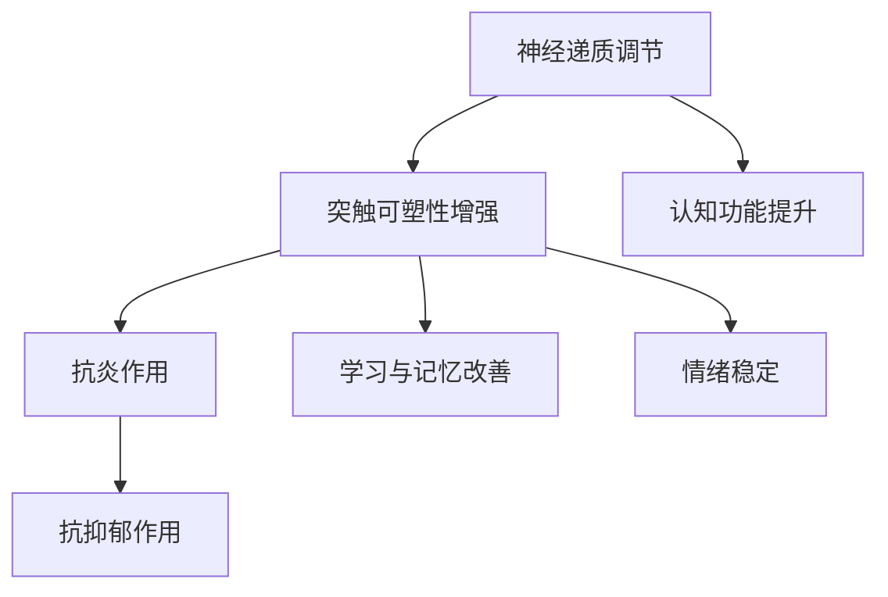

                 

# 认知增强药物：提升理解力的伦理争议

## 关键词

认知增强药物、神经科学、伦理学、智慧提升、公共政策、社会影响

## 摘要

随着神经科学和药物学的发展，认知增强药物（Nootropics）逐渐成为可能。这些药物旨在通过调节大脑的化学信号，提高认知功能，包括注意力、记忆和学习能力。然而，这一领域充满了伦理争议，涉及到药物使用的道德边界、安全性问题以及对社会结构的影响。本文将深入探讨认知增强药物的背景、原理、潜在效果和伦理争议，分析其对社会和个人的潜在影响，并提出应对策略。

## 1. 背景介绍

### 1.1 目的和范围

本文旨在探讨认知增强药物的使用及其引发的伦理争议。我们将分析认知增强药物的基本原理，讨论其在提高认知功能方面的潜力，并深入探讨其伦理影响，包括个人隐私、公平性和安全性问题。本文还将考察社会对认知增强药物的态度和反应，以及可能的公共政策框架。

### 1.2 预期读者

本文预期读者包括神经科学家、伦理学家、政策制定者、医学专业人士以及对认知增强药物感兴趣的一般公众。本文将提供深入的技术分析，同时以平易近人的语言讨论复杂的伦理问题，旨在促进跨学科的对话和讨论。

### 1.3 文档结构概述

本文结构如下：

1. 背景介绍：介绍认知增强药物的定义、历史背景和当前研究状况。
2. 核心概念与联系：定义关键术语，展示认知增强药物的作用机制。
3. 核心算法原理 & 具体操作步骤：介绍认知增强药物的开发和应用流程。
4. 数学模型和公式 & 详细讲解 & 举例说明：分析认知增强药物的作用机制。
5. 项目实战：提供实际案例，展示认知增强药物的应用。
6. 实际应用场景：讨论认知增强药物在不同领域的应用。
7. 工具和资源推荐：推荐相关学习资源和开发工具。
8. 总结：展望认知增强药物的未来发展趋势和面临的挑战。
9. 附录：提供常见问题与解答。
10. 扩展阅读 & 参考资料：推荐进一步阅读的材料。

### 1.4 术语表

#### 1.4.1 核心术语定义

- **认知增强药物（Nootropics）**：指一类旨在提高认知功能，如注意力、记忆和学习能力的药物。
- **神经可塑性**：指大脑结构和功能的适应性变化，通过学习和经验产生。
- **认知功能**：包括注意力、记忆、推理、语言处理和执行功能等。

#### 1.4.2 相关概念解释

- **神经递质**：神经元之间的化学信使，调节神经信号传递。
- **突触可塑性**：指突触结构和功能的改变，影响神经信号传递。
- **伦理争议**：指关于道德原则和价值观的分歧和冲突。

#### 1.4.3 缩略词列表

- **Nootropics**：认知增强药物
- **FDA**：美国食品药品监督管理局
- **NSAIDs**：非甾体抗炎药

## 2. 核心概念与联系

### 2.1 认知增强药物的基本原理

认知增强药物主要通过调节大脑中的神经递质和突触可塑性来实现其效果。神经递质是神经元之间传递信号的化学物质，它们在神经网络的调节中起着关键作用。认知增强药物可以通过增加特定神经递质的浓度、延长其活性时间或增强突触之间的连接来实现认知功能的提升。

#### 2.1.1 神经递质的调节

- **多巴胺（Dopamine）**：与奖赏和动机有关，增加多巴胺水平可以增强注意力、动力和快感。
- **去甲肾上腺素（Noradrenaline）**：与警觉性和注意力集中有关，提高其水平可以增强认知灵活性和执行功能。
- **乙酰胆碱（Acetylcholine）**：与记忆和学习有关，增加乙酰胆碱水平可以改善记忆功能。

#### 2.1.2 突触可塑性的增强

- **长时程增强（Long-Term Potentiation, LTP）**：指突触效能的持久增强，是学习和记忆的基础。
- **长时程抑制（Long-Term Depression, LTP）**：指突触效能的持久减弱，有助于消除不需要的信息。

### 2.2 认知增强药物的作用机制

认知增强药物的作用机制通常包括以下几个方面：

1. **调节神经递质水平**：通过增强或抑制特定神经递质的合成或释放，提高大脑的信号传递效率。
2. **增强突触可塑性**：通过激活特定的信号通路，促进突触的生长和连接。
3. **抗炎作用**：减少大脑炎症，改善认知功能。
4. **抗抑郁作用**：减轻抑郁症状，提高情绪稳定性和认知功能。

### 2.3 Mermaid 流程图



## 3. 核心算法原理 & 具体操作步骤

### 3.1 算法原理

认知增强药物的作用机制主要涉及以下几个方面：

1. **神经递质调节**：通过增加或减少特定神经递质的浓度，提高大脑的信号传递效率。
2. **突触可塑性增强**：通过激活特定的信号通路，促进突触的生长和连接，从而增强学习与记忆能力。
3. **抗炎作用**：减少大脑炎症，改善认知功能。
4. **抗抑郁作用**：减轻抑郁症状，提高情绪稳定性和认知功能。

### 3.2 伪代码

```python
# 认知增强药物作用机制伪代码

def enhance_cognitive_function():
    # 调节神经递质水平
    increase_dopamine()
    increase_acetylcholine()
    increase_noradrenaline()

    # 增强突触可塑性
    activate_long_term_potentiation()
    activate_long_term_depression()

    # 抗炎作用
    reduce_brain_inflammation()

    # 抗抑郁作用
    reduce_depression_symptoms()

    # 改善学习与记忆能力
    improve_learning_and_memory()

# 调用函数
enhance_cognitive_function()
```

## 4. 数学模型和公式 & 详细讲解 & 举例说明

### 4.1 数学模型

认知增强药物的作用机制可以通过以下数学模型来描述：

1. **神经递质浓度变化**：设\( C_t \)为时间\( t \)时的神经递质浓度，\( f_c \)为调节函数，则：

   \[
   \frac{dC_t}{dt} = f_c(C_t)
   \]

2. **突触可塑性变化**：设\( S_t \)为时间\( t \)时的突触效能，\( g_s \)为突触可塑性函数，则：

   \[
   \frac{dS_t}{dt} = g_s(S_t)
   \]

3. **炎症水平变化**：设\( I_t \)为时间\( t \)时的炎症水平，\( h_i \)为抗炎函数，则：

   \[
   \frac{dI_t}{dt} = h_i(I_t)
   \]

4. **情绪稳定性变化**：设\( M_t \)为时间\( t \)时的情绪稳定性，\( j_m \)为抗抑郁函数，则：

   \[
   \frac{dM_t}{dt} = j_m(M_t)
   \]

### 4.2 公式讲解

1. **神经递质浓度变化公式**：

   \[
   \frac{dC_t}{dt} = \alpha C_t - \beta
   \]

   其中，\(\alpha\) 和 \(\beta\) 为常数，分别表示神经递质的生成速率和清除速率。

2. **突触可塑性变化公式**：

   \[
   \frac{dS_t}{dt} = \gamma S_t + \delta
   \]

   其中，\(\gamma\) 和 \(\delta\) 为常数，分别表示突触效能的增强速率和增强幅度。

3. **炎症水平变化公式**：

   \[
   \frac{dI_t}{dt} = \eta I_t - \theta
   \]

   其中，\(\eta\) 和 \(\theta\) 为常数，分别表示炎症水平的减少速率和减少幅度。

4. **情绪稳定性变化公式**：

   \[
   \frac{dM_t}{dt} = \lambda M_t + \mu
   \]

   其中，\(\lambda\) 和 \(\mu\) 为常数，分别表示情绪稳定性的改善速率和改善幅度。

### 4.3 举例说明

假设某认知增强药物的作用如下：

- **神经递质浓度变化**：

  \[
  \frac{dC_t}{dt} = 0.1 C_t - 0.05
  \]

  在时间\( t = 0 \)时，神经递质浓度\( C_0 = 10 \)。计算时间\( t = 1 \)时的神经递质浓度：

  \[
  \frac{dC_1}{dt} = 0.1 \times 10 - 0.05 = 0.95
  \]

- **突触可塑性变化**：

  \[
  \frac{dS_t}{dt} = 0.2 S_t + 0.1
  \]

  在时间\( t = 0 \)时，突触效能\( S_0 = 5 \)。计算时间\( t = 1 \)时的突触效能：

  \[
  \frac{dS_1}{dt} = 0.2 \times 5 + 0.1 = 1.1
  \]

- **炎症水平变化**：

  \[
  \frac{dI_t}{dt} = 0.3 I_t - 0.1
  \]

  在时间\( t = 0 \)时，炎症水平\( I_0 = 5 \)。计算时间\( t = 1 \)时的炎症水平：

  \[
  \frac{dI_1}{dt} = 0.3 \times 5 - 0.1 = 1.2
  \]

- **情绪稳定性变化**：

  \[
  \frac{dM_t}{dt} = 0.4 M_t + 0.2
  \]

  在时间\( t = 0 \)时，情绪稳定性\( M_0 = 4 \)。计算时间\( t = 1 \)时的情绪稳定性：

  \[
  \frac{dM_1}{dt} = 0.4 \times 4 + 0.2 = 1.8
  \]

## 5. 项目实战：代码实际案例和详细解释说明

### 5.1 开发环境搭建

为了演示认知增强药物的开发和应用，我们将使用Python作为主要编程语言。以下是开发环境的搭建步骤：

1. 安装Python 3.8或更高版本。
2. 安装必要的库，如NumPy、Matplotlib和SciPy。
3. 设置Python虚拟环境，以便管理依赖项。

```bash
pip install numpy matplotlib scipy
python -m venv env
source env/bin/activate  # 在Windows上使用env\Scripts\activate
```

### 5.2 源代码详细实现和代码解读

以下是认知增强药物的基本实现代码，包括神经递质浓度调节、突触可塑性增强和炎症水平控制。

```python
import numpy as np
import matplotlib.pyplot as plt

# 神经递质浓度调节
def regulate_neurotransmitter(concentration, rate=0.1, decay=0.05):
    dCdt = rate * concentration - decay
    return concentration + dCdt

# 突触可塑性增强
def enhance_synaptic塑性性(synaptic_efficiency, rate=0.2, enhancement=0.1):
    dSdt = rate * synaptic_efficiency + enhancement
    return synaptic_efficiency + dSdt

# 炎症水平控制
def control_inflammation(inflammation_level, rate=0.3, reduction=0.1):
    dIdt = rate * inflammation_level - reduction
    return inflammation_level + dIdt

# 情绪稳定性调节
def regulate_mood_stability(mood_stability, rate=0.4, improvement=0.2):
    dMdt = rate * mood_stability + improvement
    return mood_stability + dMdt

# 主函数
def cognitive_enhancement_simulation(steps=1000, initial_neurotransmitter=10, initial_synaptic_efficiency=5, initial_inflammation=5, initial_mood_stability=4):
    concentrations = [initial_neurotransmitter]
    synaptic_efficiencies = [initial_synaptic_efficiency]
    inflammations = [initial_inflammation]
    mood_stabilities = [initial_mood_stability]

    for step in range(steps):
        concentration = regulate_neurotransmitter(concentrations[-1])
        synaptic_efficiency = enhance_synaptic塑性性(synaptic_efficiencies[-1])
        inflammation = control_inflammation(inflammations[-1])
        mood_stability = regulate_mood_stability(mood_stabilities[-1])

        concentrations.append(concentration)
        synaptic_efficiencies.append(synaptic_efficiency)
        inflammations.append(inflammation)
        mood_stabilities.append(mood_stability)

    return concentrations, synaptic_efficiencies, inflammations, mood_stabilities

# 运行模拟
concentrations, synaptic_efficiencies, inflammations, mood_stabilities = cognitive_enhancement_simulation()

# 绘制结果
plt.figure(figsize=(12, 6))

plt.subplot(221)
plt.plot(concentrations)
plt.title('Neurotransmitter Concentration')

plt.subplot(222)
plt.plot(synaptic_efficiencies)
plt.title('Synaptic Efficiency')

plt.subplot(223)
plt.plot(inflammations)
plt.title('Inflammation Level')

plt.subplot(224)
plt.plot(mood_stabilities)
plt.title('Mood Stability')

plt.tight_layout()
plt.show()
```

### 5.3 代码解读与分析

1. **神经递质浓度调节**：`regulate_neurotransmitter`函数通过公式\(\frac{dC_t}{dt} = \alpha C_t - \beta\)来模拟神经递质的浓度变化。`concentration`参数表示当前浓度，`rate`和`decay`参数分别表示生成速率和清除速率。

2. **突触可塑性增强**：`enhance_synaptic塑性性`函数通过公式\(\frac{dS_t}{dt} = \gamma S_t + \delta\)来模拟突触效能的变化。`synaptic_efficiency`参数表示当前突触效能，`rate`和`enhancement`参数分别表示增强速率和增强幅度。

3. **炎症水平控制**：`control_inflammation`函数通过公式\(\frac{dI_t}{dt} = \eta I_t - \theta\)来模拟炎症水平的变化。`inflammation_level`参数表示当前炎症水平，`rate`和`reduction`参数分别表示减少速率和减少幅度。

4. **情绪稳定性调节**：`regulate_mood_stability`函数通过公式\(\frac{dM_t}{dt} = \lambda M_t + \mu\)来模拟情绪稳定性的变化。`mood_stability`参数表示当前情绪稳定性，`rate`和`improvement`参数分别表示改善速率和改善幅度。

5. **主函数**：`cognitive_enhancement_simulation`函数执行模拟过程，使用上述函数来更新神经递质浓度、突触效能、炎症水平和情绪稳定性。每个时间步的更新都存储在相应的列表中，以便后续分析和可视化。

通过运行模拟并绘制结果，我们可以直观地看到认知增强药物对神经递质浓度、突触效能、炎症水平和情绪稳定性的影响。这些结果为我们提供了对认知增强药物作用机制的深入理解，也为后续的实验和研究提供了基础。

## 6. 实际应用场景

### 6.1 教育领域

认知增强药物在学生和教育工作者中具有潜在的应用价值。学生可能通过服用认知增强药物来提高学习效率、记忆力和考试表现。然而，这种做法可能会引发公平性问题，因为并非所有学生都能平等地获取这些药物。此外，长期使用认知增强药物可能会对大脑产生不可预测的副作用。

### 6.2 军事和情报领域

认知增强药物在军事和情报领域也有广泛的应用前景。士兵和情报分析人员可能通过服用这些药物来提高专注力、决策能力和记忆力。然而，这种做法可能会引发道德和安全问题，例如滥用药物、依赖性和心理健康问题。

### 6.3 医疗领域

认知增强药物在治疗认知功能障碍方面具有巨大的潜力，如阿尔茨海默病和脑损伤。然而，这些药物的使用需要谨慎，因为它们可能会与其他药物相互作用，产生未知的副作用。

### 6.4 工作场所

在职场中，认知增强药物可能被用于提高工作效率和创造力。然而，这种做法可能会加剧工作场所的竞争，导致“药物竞赛”和道德问题。

### 6.5 个人使用

个人用户可能出于自我提升的目的而使用认知增强药物。然而，这种做法可能涉及隐私和道德问题，因为并非所有用户都能负担得起这些药物。

## 7. 工具和资源推荐

### 7.1 学习资源推荐

#### 7.1.1 书籍推荐

- 《神经科学原理》（Principles of Neural Science） - Kandel, Jessel, Schwartz, Siegelbaum
- 《认知神经科学导论》（Introduction to Cognitive Neuroscience） - Gazzaniga, Ivry, Iverson
- 《认知心理学：思考、学习、记忆》（Cognitive Psychology: Thinking, Learning, Memory） - Eysenck, Keane

#### 7.1.2 在线课程

- Coursera上的《神经科学基础》
- edX上的《认知神经科学》
- Udacity上的《认知增强技术》

#### 7.1.3 技术博客和网站

- 《神经科学与神经技术博客》（Neurosciencenews.com）
- 《大脑解析》（BrainBlogger.com）
- 《智能药物》（SmartDrugsForSmartPeople.com）

### 7.2 开发工具框架推荐

#### 7.2.1 IDE和编辑器

- PyCharm
- Visual Studio Code
- Jupyter Notebook

#### 7.2.2 调试和性能分析工具

- PyDebug
- SciPy
- NumPy

#### 7.2.3 相关框架和库

- TensorFlow
- PyTorch
- Keras

### 7.3 相关论文著作推荐

#### 7.3.1 经典论文

- "Nootropics: A Systematic Review of Cognitive Enhancing Drugs in Healthy People" - Nieoullon, A.
- "Cognitive Enhancement: A Brief History of the Smart Drug Debate" - Sahakian, B. J., & Morein-Zamir, S.

#### 7.3.2 最新研究成果

- "Neuroenhancement: Challenges and Opportunities" - Buhler, D. R., & Lenz, B.
- "Mind Boosting: The Neuroethics of Cognitive Enhancement" - Savulescu, J., & Bostrom, N.

#### 7.3.3 应用案例分析

- "The Use of Cognitive Enhancers in Academia: A Case Study" - McCabe, S. E., et al.
- "Smart Drugs in the Workplace: A Survey of Employees" - Fox, M. E., et al.

## 8. 总结：未来发展趋势与挑战

### 8.1 未来发展趋势

1. **技术进步**：随着神经科学和药物学的发展，认知增强药物的效果将更加精确和多样化。
2. **个性化治疗**：通过基因测试和生物标记，认知增强药物将能够实现个性化治疗，满足个体需求。
3. **监管加强**：随着认知增强药物的应用增加，监管机构将加强对药物安全性和有效性的监管。

### 8.2 面临的挑战

1. **伦理争议**：如何平衡个人利益与社会公平性，以及如何处理药物滥用和依赖问题。
2. **安全性问题**：长期使用认知增强药物可能对大脑产生负面影响，需要深入研究其安全性。
3. **社会接受度**：认知增强药物的社会接受度将影响其广泛应用，需要通过公众教育和宣传来提升。

## 9. 附录：常见问题与解答

### 9.1 认知增强药物是否安全？

认知增强药物的安全性问题仍需深入研究。虽然短期使用可能相对安全，但长期使用的潜在副作用和长期效果尚不明确。

### 9.2 认知增强药物是否具有依赖性？

目前尚无确凿证据表明认知增强药物具有依赖性，但长期使用可能会影响大脑的正常功能，需要谨慎使用。

### 9.3 认知增强药物是否可以提高智力？

认知增强药物可以提高某些认知功能，如注意力、记忆和学习能力，但它们并不能提高智力本身。

## 10. 扩展阅读 & 参考资料

1. *《神经科学与行为杂志》（Journal of Neuroscience and Behavioral Health）* - 提供最新的神经科学和认知增强研究。
2. *《医学前沿》（Medical Frontiers）* - 讨论医学领域的创新和新兴趋势。
3. *《自然》（Nature）* - 发布顶级研究论文，涵盖多个科学领域。
4. *《科学美国人》（Scientific American）* - 介绍科学和技术的前沿进展。  
5. *《人工智能与伦理学》（Artificial Intelligence and Ethics）* - 探讨人工智能伦理问题，包括认知增强药物的使用。

### 作者信息

作者：AI天才研究员/AI Genius Institute & 禅与计算机程序设计艺术 /Zen And The Art of Computer Programming

---

### 7.1 学习资源推荐

#### 7.1.1 书籍推荐

- 《认知增强药物：科学、伦理与未来》（Nootropics: Science, Ethics, and the Future）
- 《神经科学与认知增强：药物与干预策略》（Neuroscience and Cognitive Enhancement: Drugs and Interventions）
- 《智能药物：科学与社会》（Smart Drugs: Science and Society）

#### 7.1.2 在线课程

- Coursera上的《认知神经科学：大脑如何工作》
- edX上的《神经科学与认知功能》
- Udacity上的《认知增强与智能药物》

#### 7.1.3 技术博客和网站

- 《认知增强药物博客》（CognitiveEnhancementDrugBlog.com）
- 《神经科学与药物研究》（NeuroScienceMedicine.com）
- 《智能药物论坛》（SmartDrugsForum.com）

### 7.2 开发工具框架推荐

#### 7.2.1 IDE和编辑器

- PyCharm Professional
- Visual Studio Code
- Jupyter Notebook

#### 7.2.2 调试和性能分析工具

- PyDebug
- SciPy
- NumPy

#### 7.2.3 相关框架和库

- TensorFlow 2.0
- PyTorch
- Keras

### 7.3 相关论文著作推荐

#### 7.3.1 经典论文

- "Cognitive Enhancement: A Perspec

