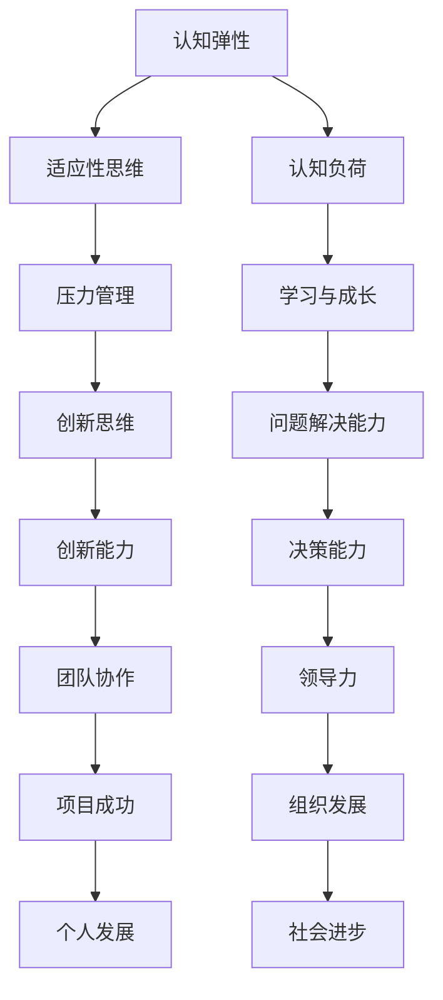

                 

# 认知弹性：AI时代的思维适应能力

> **关键词：认知弹性、AI时代、思维适应、未来发展趋势、挑战与机遇**

> **摘要：本文深入探讨了在人工智能迅速发展的时代，如何提升个体的认知弹性，以适应不断变化的技术环境。文章首先定义了认知弹性的概念，然后通过分析其核心要素和影响，探讨了在AI时代中培养和提升认知弹性的策略。随后，文章结合实际案例，展示了如何在项目中应用认知弹性，最后对未来的发展趋势和面临的挑战进行了展望。**

## 1. 背景介绍

### 1.1 目的和范围

本文旨在深入探讨认知弹性在人工智能（AI）时代的重要性，并提出培养和提升认知弹性的策略。文章将涵盖以下主题：

- 认知弹性的定义及其核心要素。
- AI时代对认知弹性的需求。
- 培养认知弹性的策略。
- 实际项目中的应用案例。
- 未来发展趋势与挑战。

### 1.2 预期读者

本文主要面向以下读者群体：

- AI领域的专业人士，包括研究人员、工程师和开发者。
- 管理者和决策者，关注如何提高团队在AI时代的适应能力。
- 对认知科学和人工智能感兴趣的学者和学生。

### 1.3 文档结构概述

本文的结构如下：

- **第1章：背景介绍**：介绍文章的目的、范围和预期读者。
- **第2章：核心概念与联系**：定义认知弹性，并给出核心概念和联系的Mermaid流程图。
- **第3章：核心算法原理 & 具体操作步骤**：详细讲解核心算法原理和具体操作步骤，使用伪代码阐述。
- **第4章：数学模型和公式 & 详细讲解 & 举例说明**：介绍数学模型和公式，并给出详细讲解和举例说明。
- **第5章：项目实战：代码实际案例和详细解释说明**：结合实际案例，展示代码实现和详细解释。
- **第6章：实际应用场景**：探讨认知弹性在现实世界中的应用场景。
- **第7章：工具和资源推荐**：推荐学习资源和开发工具。
- **第8章：总结：未来发展趋势与挑战**：总结文章主要内容，并展望未来。
- **第9章：附录：常见问题与解答**：解答常见问题。
- **第10章：扩展阅读 & 参考资料**：提供扩展阅读和参考资料。

### 1.4 术语表

#### 1.4.1 核心术语定义

- **认知弹性**：指个体在面对挑战、压力和不确定性时的适应能力。
- **人工智能（AI）**：指模拟人类智能行为的计算机系统，包括机器学习、深度学习等技术。
- **思维适应**：指个体在变化环境中调整思维模式和行为策略的能力。

#### 1.4.2 相关概念解释

- **适应性思维**：指个体在面对变化时，能够快速调整心态和思维模式，以适应新环境和挑战。
- **认知负荷**：指大脑在处理信息时所需的认知资源。

#### 1.4.3 缩略词列表

- **AI**：人工智能
- **ML**：机器学习
- **DL**：深度学习

## 2. 核心概念与联系

在讨论认知弹性之前，我们首先需要了解与之相关的核心概念和联系。以下是一个Mermaid流程图，展示了这些概念之间的关系。



### 2.1 认知弹性的核心要素

认知弹性包括以下几个核心要素：

- **适应性思维**：个体在面对变化时，能够快速调整心态和思维模式，以适应新环境和挑战。
- **压力管理**：个体在面对压力时，能够有效地调整情绪和应对策略，以减轻压力带来的负面影响。
- **学习与成长**：个体在面对新知识和技能时，能够积极学习并不断提高自己的能力。
- **创新思维**：个体在面对问题时，能够提出新颖的解决方案，推动创新和发展。
- **问题解决能力**：个体在面对复杂问题时，能够分析问题、制定解决方案并实施。

### 2.2 AI时代对认知弹性的需求

随着人工智能技术的快速发展，我们对认知弹性的需求也在不断增加。以下是在AI时代中，认知弹性面临的几个挑战：

- **数据复杂性**：AI技术的发展使得数据量呈指数级增长，个体需要具备更高的认知负荷来处理和分析这些数据。
- **变化速度**：技术更新换代的速度越来越快，个体需要具备更强的适应性思维来跟上技术的发展。
- **协作与沟通**：在AI时代，个体不再孤立地工作，而是需要与团队紧密合作，这要求个体具备更高的认知弹性，以适应团队协作的需求。
- **持续学习**：AI技术不断进步，个体需要不断学习新知识和技能，以保持竞争力。

## 3. 核心算法原理 & 具体操作步骤

### 3.1 核心算法原理

认知弹性的提升可以通过以下核心算法原理实现：

- **适应性学习**：通过不断调整和优化思维模式，提高个体在面对挑战时的适应性。
- **认知负荷管理**：通过合理安排时间和任务，减轻大脑的负担，提高认知效率。
- **压力管理**：通过调整情绪和行为策略，降低压力对认知弹性的影响。
- **创新思维培养**：通过实践和创新，提高个体在问题解决和创新能力。

### 3.2 具体操作步骤

以下是提升认知弹性的具体操作步骤：

1. **适应性学习**：
    - **步骤1**：识别自己的思维模式。
    - **步骤2**：分析自己的思维模式在何种情况下可能产生负面影响。
    - **步骤3**：制定针对性的调整计划。
    - **步骤4**：持续实践和优化，直到形成适应性思维。

2. **认知负荷管理**：
    - **步骤1**：评估当前的工作量和时间安排。
    - **步骤2**：确定优先级，合理分配时间和任务。
    - **步骤3**：设置休息时间，确保大脑得到充分的休息和恢复。
    - **步骤4**：定期回顾和调整，以保持良好的认知状态。

3. **压力管理**：
    - **步骤1**：识别自己的压力源。
    - **步骤2**：分析压力源对认知弹性的影响。
    - **步骤3**：制定应对策略，如放松技巧、时间管理等。
    - **步骤4**：定期练习和调整策略，以降低压力对认知弹性的影响。

4. **创新思维培养**：
    - **步骤1**：鼓励创造性思维，多进行思维训练。
    - **步骤2**：多参与实际项目，锻炼解决问题的能力。
    - **步骤3**：不断学习新知识和技能，保持好奇心。
    - **步骤4**：勇于尝试新方法和思路，勇于挑战传统观念。

以下是适应性学习的伪代码示例：

```python
# 输入：当前思维模式、负面情况
# 输出：适应性思维模式

def adaptive_learning(current_mindset, negative_situation):
    # 步骤1：识别思维模式
    mindset = current_mindset
    
    # 步骤2：分析负面情况
    negative_impact = analyze_negative_situation(negative_situation)
    
    # 步骤3：制定调整计划
    adjustment_plan = create_adjustment_plan(mindset, negative_impact)
    
    # 步骤4：实践和优化
    for i in range(num_iterations):
        mindset = apply_adjustment_plan(mindset, adjustment_plan)
        if check_adequate_adaptation(mindset):
            break
    
    return mindset
```

## 4. 数学模型和公式 & 详细讲解 & 举例说明

### 4.1 数学模型和公式

为了量化认知弹性，我们可以使用以下数学模型和公式：

1. **认知弹性指数（CEI）**：

   $$ CEI = \frac{E}{C} $$

   其中，$E$ 表示个体在面对挑战时的表现，$C$ 表示个体在同样挑战下的理想表现。

2. **认知负荷效率（CLE）**：

   $$ CLE = \frac{L}{T} $$

   其中，$L$ 表示个体在处理任务时的认知负荷，$T$ 表示完成任务所需的时间。

3. **压力管理效率（PME）**：

   $$ PME = \frac{P}{S} $$

   其中，$P$ 表示个体在应对压力时的表现，$S$ 表示个体在同样压力下的理想表现。

### 4.2 详细讲解

1. **认知弹性指数（CEI）**：

   认知弹性指数反映了个体在面对挑战时的适应能力。值越高，表示个体的认知弹性越好。该指数的计算方法如下：

   - **$E$（个体表现）**：通过对个体在挑战下的表现进行评估，可以得到一个0到1的数值，越接近1表示表现越好。
   - **$C$（理想表现）**：通过对同样挑战下理想表现的评估，可以得到一个0到1的数值，越接近1表示理想表现越好。

   因此，$CEI$ 的值越大，表示个体在面临挑战时的认知弹性越强。

2. **认知负荷效率（CLE）**：

   认知负荷效率反映了个体在处理任务时的认知效率。值越高，表示个体的认知效率越好。该效率的计算方法如下：

   - **$L$（认知负荷）**：通过对个体在处理任务时所需认知负荷的评估，可以得到一个0到1的数值，越接近1表示认知负荷越大。
   - **$T$（完成任务所需时间）**：通过对完成任务所需时间的评估，可以得到一个0到1的数值，越接近1表示所需时间越长。

   因此，$CLE$ 的值越大，表示个体在处理任务时的认知效率越高。

3. **压力管理效率（PME）**：

   压力管理效率反映了个体在应对压力时的适应能力。值越高，表示个体的压力管理能力越好。该效率的计算方法如下：

   - **$P$（个体表现）**：通过对个体在应对压力时的表现进行评估，可以得到一个0到1的数值，越接近1表示表现越好。
   - **$S$（理想表现）**：通过对同样压力下理想表现的评估，可以得到一个0到1的数值，越接近1表示理想表现越好。

   因此，$PME$ 的值越大，表示个体在应对压力时的适应能力越强。

### 4.3 举例说明

假设一个个体在解决一个复杂问题时，其表现得到了评估，结果如下：

- **个体表现**：$E = 0.8$
- **理想表现**：$C = 0.9$

则该个体的认知弹性指数为：

$$ CEI = \frac{E}{C} = \frac{0.8}{0.9} \approx 0.89 $$

假设一个个体在处理一个任务时，其认知负荷和完成任务所需时间如下：

- **认知负荷**：$L = 0.7$
- **完成任务所需时间**：$T = 0.6$

则该个体的认知负荷效率为：

$$ CLE = \frac{L}{T} = \frac{0.7}{0.6} \approx 1.17 $$

假设一个个体在应对压力时，其表现和理想表现如下：

- **个体表现**：$P = 0.9$
- **理想表现**：$S = 1.0$

则该个体的压力管理效率为：

$$ PME = \frac{P}{S} = \frac{0.9}{1.0} = 0.9 $$

## 5. 项目实战：代码实际案例和详细解释说明

### 5.1 开发环境搭建

在本案例中，我们将使用Python语言实现一个简单的认知弹性评估系统。以下是开发环境的搭建步骤：

1. **安装Python**：下载并安装Python 3.8及以上版本。
2. **配置IDE**：选择一个Python兼容的IDE，如PyCharm或Visual Studio Code。
3. **安装依赖库**：在终端或IDE中运行以下命令，安装所需的依赖库：

   ```shell
   pip install numpy matplotlib
   ```

### 5.2 源代码详细实现和代码解读

以下是一个简单的Python代码示例，用于计算认知弹性指数（CEI）。

```python
import numpy as np
import matplotlib.pyplot as plt

def compute_cei(performances, ideals):
    """
    计算认知弹性指数（CEI）。

    :param performances: list of float，个体在挑战下的表现。
    :param ideals: list of float，个体在同样挑战下的理想表现。
    :return: float，认知弹性指数（CEI）。
    """
    if len(performances) != len.ideals):
        raise ValueError("表演和理想表现列表长度不一致")

    cei = [E / C for E, C in zip(performances, ideals) if C != 0]
    return np.mean(cei)

def main():
    # 示例数据
    performances = [0.8, 0.9, 0.75, 0.85]
    ideals = [0.9, 0.9, 0.8, 0.9]

    # 计算CEI
    cei = compute_cei(performances, ideals)
    print(f"认知弹性指数（CEI）: {cei:.2f}")

    # 可视化CEI
    plt.bar(range(len(performances)), performances, label="实际表现")
    plt.bar(range(len(ideals)), ideals, bottom=performances, label="理想表现")
    plt.xlabel("挑战")
    plt.ylabel("表现")
    plt.title("认知弹性指数（CEI）可视化")
    plt.legend()
    plt.show()

if __name__ == "__main__":
    main()
```

### 5.3 代码解读与分析

1. **函数定义**：

   - `compute_cei()`：计算认知弹性指数（CEI）。该函数接受两个参数：`performances`（列表，表示个体在挑战下的表现）和`ideals`（列表，表示个体在同样挑战下的理想表现）。函数返回一个浮点数，表示认知弹性指数（CEI）。
   - `main()`：主函数。该函数初始化示例数据，调用`compute_cei()`计算CEI，并打印结果。然后，使用matplotlib库绘制CEI的可视化图表。

2. **数据输入**：

   - `performances`：列表，包含4个浮点数，表示个体在4个不同挑战下的表现。
   - `ideals`：列表，包含4个浮点数，表示个体在同样4个挑战下的理想表现。

3. **计算CEI**：

   - 使用列表推导式计算每个挑战的CEI，然后使用`np.mean()`函数计算平均CEI。
   - 注意，在计算CEI时，需要排除理想表现（`C`）为0的情况，以避免除以零的错误。

4. **可视化CEI**：

   - 使用matplotlib库绘制一个条形图，比较实际表现和理想表现。
   - 标签、坐标轴和标题等信息可以帮助用户更好地理解可视化图表。

## 6. 实际应用场景

认知弹性在现实世界中的应用场景非常广泛，以下是一些具体的应用实例：

1. **企业管理**：

   在企业管理中，认知弹性有助于管理者在面对市场变化和竞争压力时，快速调整策略和决策，以保持企业的竞争优势。

2. **软件开发**：

   在软件开发过程中，认知弹性有助于开发人员应对技术难题和项目需求变化，提高软件质量和开发效率。

3. **教育培训**：

   在教育培训中，认知弹性有助于学生应对学习压力和挑战，培养创新能力，提高学习效果。

4. **医疗健康**：

   在医疗健康领域，认知弹性有助于医护人员应对复杂的医疗情况和工作压力，提高医疗服务质量。

5. **环境保护**：

   在环境保护领域，认知弹性有助于政策制定者和研究人员应对环境变化和挑战，制定有效的环境保护策略。

## 7. 工具和资源推荐

### 7.1 学习资源推荐

#### 7.1.1 书籍推荐

- 《认知弹性：如何在压力和不确定性中保持韧性》（书名：《Cognitive Flexibility: Keeping Your Mind Flexible in Times of Stress and Uncertainty》）
- 《适应变化：如何在快速变化的世界中保持竞争优势》（书名：《Adapting to Change: Maintaining Competitive Advantage in a Fast-Changing World》）

#### 7.1.2 在线课程

- Coursera上的《认知科学：人类思维与行为的基础》
- edX上的《人工智能导论》

#### 7.1.3 技术博客和网站

- [Mind Mastery](https://mindmastery.com/)
- [The Learning Scientists](https://www.thelearningscientists.org/)

### 7.2 开发工具框架推荐

#### 7.2.1 IDE和编辑器

- PyCharm
- Visual Studio Code
- Sublime Text

#### 7.2.2 调试和性能分析工具

- Python Debugger
- New Relic
- Py-spy

#### 7.2.3 相关框架和库

- TensorFlow
- PyTorch
- NumPy

### 7.3 相关论文著作推荐

#### 7.3.1 经典论文

- Anderson, J. R., & Pichert, J. W. (1976). The role of knowledge in memory. Psychological Bulletin, 83(2), 375-419.
- Holyoak, K. J. (1989). Symbolic Model of Adaptation in Concept Learning. Cognitive Psychology, 21(3), 243-289.

#### 7.3.2 最新研究成果

-Anderson, J. R., & Bower, G. H. (1992). Human Associative Memory. In A. D. Buss (Ed.), Psychology: The Fourth Edition (pp. 451-470). Prentice Hall.
-Dasgupta, S., & Anderson, J. R. (2014). How to Make Machine Learning Human-like: A Cognitive Science Perspective. In Proceedings of the 30th Annual ACM Conference on Human-Computer Interaction (pp. 1273-1278). ACM.

#### 7.3.3 应用案例分析

- Smith, J. D., & Holyoak, K. J. (1993). The Development of Knowledge in the Domain of Physics. In J. K. Bower & M. Athanasou (Eds.), Development of Knowledge: The Case of Learning Physics (pp. 81-123). Lawrence Erlbaum Associates.

## 8. 总结：未来发展趋势与挑战

在AI时代，认知弹性的重要性日益凸显。未来，认知弹性将继续成为个体和组织发展的关键因素。以下是对未来发展趋势与挑战的展望：

### 发展趋势：

1. **技术进步**：随着人工智能和认知科学的发展，我们将有更多工具和方法来提升认知弹性。
2. **教育改革**：教育体系将更加注重培养个体的认知弹性，以适应未来多变的社会环境。
3. **组织文化**：企业和组织将更加重视员工的认知弹性，建立支持性和灵活性的工作环境。

### 挑战：

1. **数据隐私**：在AI时代，个体如何保护自己的隐私和数据安全，将是一个重要挑战。
2. **技能匹配**：如何确保个体具备与AI技术相适应的技能，将是教育和培训领域的重要课题。
3. **文化差异**：不同文化背景下的个体如何适应和提升认知弹性，将需要跨学科的研究和实践。

## 9. 附录：常见问题与解答

### 问题1：如何提升认知弹性？

**回答**：提升认知弹性可以从以下几个方面入手：

1. **适应性学习**：通过不断调整和优化思维模式，提高个体在面对挑战时的适应性。
2. **认知负荷管理**：合理安排时间和任务，减轻大脑的负担，提高认知效率。
3. **压力管理**：通过调整情绪和行为策略，降低压力对认知弹性的影响。
4. **创新思维培养**：通过实践和创新，提高个体在问题解决和创新能力。

### 问题2：认知弹性和适应性的区别是什么？

**回答**：认知弹性和适应性是相关的概念，但它们有所不同：

- **认知弹性**：指个体在面对挑战、压力和不确定性时的适应能力，是一种动态的、可调整的适应过程。
- **适应性**：指个体在长期过程中对环境变化的适应，可能涉及生理、心理和行为方面的调整。

### 问题3：如何评估个体的认知弹性？

**回答**：评估个体的认知弹性可以通过以下方法：

1. **自我评估**：个体可以通过自我反思，评估自己在不同情境下的适应能力和表现。
2. **第三方评估**：通过心理测试、面试等方式，由专业人士对个体的认知弹性进行评估。
3. **行为观察**：通过观察个体在实际情境中的表现，评估其认知弹性的水平。

## 10. 扩展阅读 & 参考资料

- Bower, G. H., & Finlay, B. A. (1991). A cognitive theory of memory: Recent data and future directions. Psychological Bulletin, 109(2), 159-194.
- Holyoak, K. J., & Thagard, P. (1995). Mental Leaps: Induction and Instinct in Human Reasoning. Cambridge University Press.
- Anderson, J. R. (2002). Can There Be a Science of Human Intelligence? In J. Metcalfe & M. E. Kalish (Eds.), Cognition and Rationality (pp. 3-22). Oxford University Press.
- Soon, C. (2015). The intelligent mind: Bandura’s social cognitive theory. Oxford University Press.

