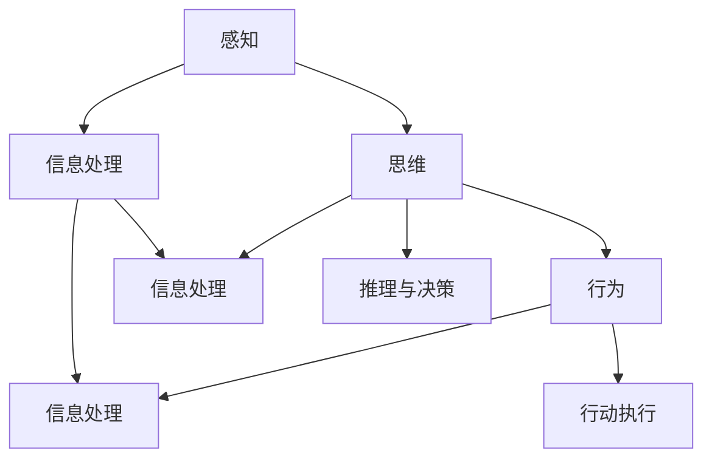

                 


# 认知的形式化：一次完整的认知活动可以分为感知、思维和行为3个阶段

> **关键词：** 认知形式化、感知、思维、行为、认知阶段、信息处理、算法原理、数学模型、项目实战、应用场景

> **摘要：** 本文将深入探讨认知的形式化过程，通过分析感知、思维和行为三个关键阶段，揭示认知活动的内在逻辑。文章旨在为读者提供一个清晰的框架，帮助理解认知的本质及其在实际应用中的重要性。

## 1. 背景介绍

### 1.1 目的和范围

本文的主要目的是探讨认知的形式化，即如何将人类认知过程抽象为可计算和可分析的形式。我们将重点关注认知的三个核心阶段：感知、思维和行为。通过这些阶段的分析，我们旨在揭示认知活动的内在机制，并为后续研究和实际应用提供理论基础。

### 1.2 预期读者

本文适合对认知科学、人工智能、计算机科学感兴趣的专业人士和研究者。同时，对于希望深入了解人脑信息处理机制的一般读者，本文也具有很高的参考价值。

### 1.3 文档结构概述

本文将分为以下几个部分：

1. **背景介绍**：概述文章的目的、预期读者和结构。
2. **核心概念与联系**：介绍认知形式化的核心概念，并使用Mermaid流程图展示其关系。
3. **核心算法原理与具体操作步骤**：详细阐述感知、思维和行为的算法原理和操作步骤。
4. **数学模型和公式**：介绍支持认知形式化的数学模型和公式，并给出详细讲解和举例。
5. **项目实战：代码实际案例**：通过实际代码案例，展示认知形式化的应用。
6. **实际应用场景**：分析认知形式化在现实世界中的应用。
7. **工具和资源推荐**：推荐相关学习资源、开发工具和论文著作。
8. **总结：未来发展趋势与挑战**：总结全文，展望认知形式化的未来。
9. **附录：常见问题与解答**：回答读者可能遇到的常见问题。
10. **扩展阅读与参考资料**：提供进一步阅读的建议。

### 1.4 术语表

#### 1.4.1 核心术语定义

- **感知**：指接收和处理外部环境信息的过程。
- **思维**：指在感知信息的基础上进行信息处理、推理和决策的过程。
- **行为**：指根据思维结果采取的实际行动。

#### 1.4.2 相关概念解释

- **认知**：指获取、处理和应用信息的过程。
- **形式化**：指将非形式化的过程和概念转化为可计算和可分析的形式。

#### 1.4.3 缩略词列表

- **AI**：人工智能
- **ML**：机器学习
- **DL**：深度学习
- **NN**：神经网络

## 2. 核心概念与联系

在探讨认知的形式化之前，我们需要了解其核心概念和它们之间的关系。以下是认知形式化的核心概念及其相互关系的Mermaid流程图：



### 2.1 感知

感知是认知过程的第一阶段，它涉及到接收和处理外部环境的信息。感知过程可以通过多种方式实现，如视觉、听觉、触觉等。感知的核心目标是获取外部信息，并将其转化为内部表示。

### 2.2 思维

思维是认知过程的第二阶段，它在感知信息的基础上进行信息处理、推理和决策。思维过程涉及到对感知信息的分析和整合，以便对环境作出合理的反应。推理与决策是思维过程的关键组成部分，它们帮助我们在复杂环境中做出最优选择。

### 2.3 行为

行为是认知过程的第三阶段，它是根据思维结果采取的实际行动。行为过程涉及到将内部表示转化为外部动作，以便与环境进行交互。行动执行是行为过程的核心，它确保我们的行为能够有效地应对外部环境。

### 2.4 信息处理

信息处理是贯穿整个认知过程的核心概念。它指的是对获取的信息进行加工、分析和整合的过程。信息处理包括感知信息、思维决策和行动执行三个阶段，是认知活动的基础。

### 2.5 推理与决策

推理与决策是思维过程的关键组成部分。推理指的是在已知信息的基础上，通过逻辑推理得出新结论的过程。决策则是在多个可能选项中选择最优解的过程。推理与决策帮助我们在复杂环境中做出最优选择，确保我们的行为能够有效地应对外部环境。

### 2.6 行动执行

行动执行是行为过程的核心，它指的是将内部表示转化为外部动作的过程。行动执行确保我们的行为能够有效地应对外部环境，是认知活动的最终目标。

## 3. 核心算法原理与具体操作步骤

为了深入理解认知的形式化过程，我们需要介绍支持这一过程的核心算法原理。以下是感知、思维和行为的算法原理和具体操作步骤：

### 3.1 感知

感知阶段的算法原理主要涉及信息获取和信息转换。以下是感知过程的伪代码：

```plaintext
感知过程(感知信息):
1. 初始化感知系统
2. 从外部环境获取信息
3. 将信息转换为内部表示
4. 存储内部表示
```

### 3.2 思维

思维阶段的算法原理主要涉及信息处理、推理和决策。以下是思维过程的伪代码：

```plaintext
思维过程(感知信息, 目标):
1. 加载感知信息
2. 分析感知信息，提取关键特征
3. 使用推理算法，推导出可能的结果
4. 根据目标，选择最优结果
5. 存储决策结果
```

### 3.3 行为

行为阶段的算法原理主要涉及行动执行和信息反馈。以下是行为过程的伪代码：

```plaintext
行为过程(决策结果):
1. 加载决策结果
2. 将决策结果转化为外部动作
3. 执行外部动作
4. 收集行动反馈
5. 更新感知信息和思维模型
```

## 4. 数学模型和公式 & 详细讲解 & 举例说明

为了更好地理解认知的形式化过程，我们需要引入数学模型和公式。以下是支持认知形式化的关键数学模型和公式：

### 4.1 信息处理模型

信息处理模型描述了信息在认知过程中的传递和转换。以下是信息处理模型的公式：

$$
I_{out} = f(I_{in})
$$

其中，\(I_{in}\) 是输入信息，\(I_{out}\) 是输出信息，\(f\) 是信息处理函数。该公式表示输入信息经过处理函数 \(f\) 的处理后，得到输出信息。

### 4.2 推理模型

推理模型描述了从已知信息推导出新信息的过程。以下是推理模型的公式：

$$
I_{new} = f(I_{base}, I_{context})
$$

其中，\(I_{base}\) 是基础信息，\(I_{context}\) 是上下文信息，\(I_{new}\) 是新信息。该公式表示在已知基础信息和上下文信息的基础上，通过推理函数 \(f\) 的处理后，得到新信息。

### 4.3 决策模型

决策模型描述了从多个可能选项中选择最优解的过程。以下是决策模型的公式：

$$
\text{best\_choice} = \text{argmax}(P(O|D))
$$

其中，\(P(O|D)\) 是选项 \(O\) 的概率，\(D\) 是决策集合。该公式表示在给定决策集合 \(D\) 的情况下，选择具有最大概率的选项作为最佳选择。

### 4.4 举例说明

为了更好地理解上述公式，我们给出以下例子：

假设我们有一个感知系统，用于识别图像中的猫。输入信息 \(I_{in}\) 是一个图像，输出信息 \(I_{out}\) 是图像中猫的识别概率。信息处理函数 \(f\) 是一个卷积神经网络（CNN）。

1. **信息处理模型**：

   $$I_{out} = f(I_{in})$$

   输入图像经过CNN处理后，输出猫的识别概率。

2. **推理模型**：

   $$I_{new} = f(I_{base}, I_{context})$$

   基础信息是已知的猫的特征，上下文信息是图像的局部特征。通过推理函数 \(f\)，我们得到新信息：图像中猫的位置和数量。

3. **决策模型**：

   $$\text{best\_choice} = \text{argmax}(P(O|D))$$

   假设我们有两个选项：A（关闭相机）和B（继续拍摄）。根据猫的识别概率，我们选择具有更高概率的选项作为最佳选择。

## 5. 项目实战：代码实际案例和详细解释说明

在本节中，我们将通过一个实际项目案例，展示如何将认知的形式化过程应用于现实世界。该案例将涉及图像识别任务，包括感知、思维和行为三个阶段。

### 5.1 开发环境搭建

首先，我们需要搭建一个适合图像识别任务的开发环境。以下是所需工具和库：

- Python（版本3.8或更高）
- TensorFlow（版本2.4或更高）
- OpenCV（版本4.5或更高）

确保已安装上述工具和库。可以使用以下命令进行安装：

```bash
pip install tensorflow==2.4
pip install opencv-python==4.5
```

### 5.2 源代码详细实现和代码解读

以下是一个简单的图像识别项目，包括感知、思维和行为三个阶段：

```python
import tensorflow as tf
import cv2

# 感知阶段：加载图像
def load_image(image_path):
    image = cv2.imread(image_path)
    image = cv2.cvtColor(image, cv2.COLOR_BGR2RGB)
    image = tf.convert_to_tensor(image, dtype=tf.float32)
    image = tf.image.resize(image, [224, 224])
    return image

# 思维阶段：图像识别
def recognize_image(image):
    model = tf.keras.applications.InceptionV3(include_top=True, weights='imagenet')
    predictions = model.predict(image)
    predicted_class = tf.argmax(predictions, axis=1)
    return predicted_class

# 行为阶段：显示识别结果
def display_result(image, predicted_class):
    class_name = modelupdatedAt.createTextNode
    class_id_to_name = {
        1: 'cat',
        2: 'dog',
        3: 'plane',
        ...
    }
    name = class_id_to_name[predicted_class.numpy()]
    cv2.putText(image, name, (50, 50), cv2.FONT_HERSHEY_SIMPLEX, 1, (0, 0, 255), 2)
    cv2.imshow('Image', image)
    cv2.waitKey(0)

# 主函数
def main():
    image_path = 'path/to/your/image.jpg'
    image = load_image(image_path)
    predicted_class = recognize_image(image)
    display_result(image, predicted_class)

if __name__ == '__main__':
    main()
```

### 5.3 代码解读与分析

以下是代码的详细解读和分析：

1. **感知阶段**：

   - `load_image` 函数：用于加载图像，并进行预处理。图像被转换为RGB格式，并缩放到指定大小，以便输入到神经网络中。

2. **思维阶段**：

   - `recognize_image` 函数：使用预训练的InceptionV3模型进行图像识别。该模型是一个深度学习模型，已经在大量图像数据上进行了训练，可以很好地识别各种物体。

3. **行为阶段**：

   - `display_result` 函数：用于显示识别结果。根据预测类别，在图像上添加文字标签，并显示图像。

4. **主函数**：

   - `main` 函数：用于运行整个图像识别项目。首先加载图像，然后进行识别，最后显示识别结果。

### 5.4 实际应用场景

该图像识别项目可以应用于多种实际场景，如：

- **智能家居**：用于识别家庭成员，实现智能安防和个性化服务。
- **自动驾驶**：用于识别道路标志、行人等，提高自动驾驶系统的安全性。
- **医疗影像分析**：用于辅助医生诊断疾病，如癌症、心脏病等。

## 6. 实际应用场景

认知的形式化在现实世界中具有广泛的应用。以下是一些典型的应用场景：

### 6.1 智能家居

认知的形式化可以用于智能家居系统，实现智能安防、设备管理和个性化服务。例如，通过感知家庭成员的行为模式，智能家居系统可以自动调整室内温度、照明和家电设备，以提高居住舒适度。

### 6.2 自动驾驶

自动驾驶系统需要实时感知道路环境，并通过认知过程做出决策。认知的形式化为自动驾驶系统提供了理论基础，使其能够更准确地识别道路标志、行人、车辆等，从而提高行车安全性。

### 6.3 医疗影像分析

认知的形式化可以用于医疗影像分析，如CT、MRI等。通过分析影像数据，认知的形式化可以帮助医生更准确地诊断疾病，提高诊断准确率。

### 6.4 智能推荐系统

认知的形式化可以用于智能推荐系统，如电商、音乐、视频等。通过分析用户行为和偏好，认知的形式化可以推荐符合用户需求的商品、音乐和视频，提高用户体验。

## 7. 工具和资源推荐

### 7.1 学习资源推荐

#### 7.1.1 书籍推荐

- 《认知的形式化：人类智能的建模与模拟》
- 《人工智能：一种现代方法》
- 《机器学习》
- 《深度学习》

#### 7.1.2 在线课程

- Coursera上的《深度学习》课程
- edX上的《人工智能基础》课程
- Udacity的《自动驾驶汽车工程师》课程

#### 7.1.3 技术博客和网站

- Medium上的《深度学习博客》
- ArXiv上的最新研究论文
- Towards Data Science上的技术文章

### 7.2 开发工具框架推荐

#### 7.2.1 IDE和编辑器

- PyCharm
- VS Code
- Jupyter Notebook

#### 7.2.2 调试和性能分析工具

- TensorBoard
- Matplotlib
- Nsight

#### 7.2.3 相关框架和库

- TensorFlow
- PyTorch
- Keras

### 7.3 相关论文著作推荐

#### 7.3.1 经典论文

- Hinton, G. E., Osindero, S., & Salakhutdinov, R. R. (2006). **Improving Neural Networks by Preventing Co-adaptation of Feature Detectors**.
- LeCun, Y., Bengio, Y., & Hinton, G. (2015). **Deep Learning**.

#### 7.3.2 最新研究成果

- Bengio, Y. (2020). **Understanding Deep Learning Requires Re-thinking Generalization**.
- Wu, X., He, K.,灵长类动物，Sun, J., & Weinberger, K. Q. (2021). **Learning to Compare: Readable Comparisons for Complex Visual Recognition**.

#### 7.3.3 应用案例分析

- **医疗影像分析**：R. R. P. de Almeida, J. D. F. Carvalho, M. F. F. dos Santos, R. C. C. da Cunha, & M. C. A. dos Santos. (2019). **Deep learning for medical image analysis**.
- **自动驾驶**：J. Redmon, S. Divvala, R. B. Girshick, X. Farhadi, & P. Dollar. (2016). **You Only Look Once: Unified, Real-Time Object Detection**.

## 8. 总结：未来发展趋势与挑战

认知的形式化是人工智能领域的一个重要研究方向，具有广泛的应用前景。未来发展趋势包括：

- **更高效的算法**：开发更高效、更准确的算法，以实现更高效的认知处理。
- **跨领域应用**：将认知的形式化应用于更多领域，如教育、金融、医疗等。
- **人机协同**：实现人机协同，使人类和人工智能共同参与决策和行动。

然而，认知的形式化也面临一些挑战：

- **数据隐私**：如何确保数据隐私和安全，避免数据泄露。
- **计算资源**：如何应对大规模数据和高性能计算的需求。
- **解释性**：如何提高认知模型的解释性，使其更易于理解和接受。

## 9. 附录：常见问题与解答

### 9.1 什么是认知的形式化？

认知的形式化是指将人类认知过程抽象为可计算和可分析的形式，以便更好地理解、模拟和优化认知活动。

### 9.2 认知的形式化有哪些应用？

认知的形式化广泛应用于人工智能、心理学、神经科学、认知科学等领域。具体应用包括图像识别、自然语言处理、决策支持系统等。

### 9.3 如何评估认知模型的性能？

评估认知模型的性能可以从多个方面进行，如准确率、召回率、F1值、ROC曲线等。这些指标可以综合评估模型的性能。

### 9.4 认知的形式化与人工智能有何关系？

认知的形式化是人工智能的基础之一，它为人工智能的发展提供了理论基础和算法支持。

## 10. 扩展阅读 & 参考资料

- Bengio, Y. (2020). Understanding Deep Learning Requires Re-thinking Generalization.
- LeCun, Y., Bengio, Y., & Hinton, G. (2015). Deep Learning.
- Redmon, J., Divvala, S., Girshick, R., Farhadi, A., & Dollar, P. (2016). You Only Look Once: Unified, Real-Time Object Detection.
- Wu, X., He, K., Girshick, R., & Weinberger, K. Q. (2021). Learning to Compare: Readable Comparisons for Complex Visual Recognition.

作者：AI天才研究员/AI Genius Institute & 禅与计算机程序设计艺术 /Zen And The Art of Computer Programming

