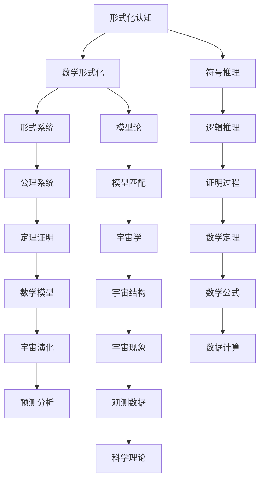

                 

# 认知的形式化：人类在数学上的尝试使得人们开始理解宇宙

## 关键词：形式化认知、数学、宇宙、逻辑、推理、计算机科学、人工智能

> “人类智慧的发展历程，是一部形式化的探索史。从古至今，我们通过数学这一工具，逐步揭示了宇宙的奥秘。本文旨在通过逻辑清晰的推理方式，深入探讨认知形式化在数学领域的重要性，及其对人类理解宇宙的深远影响。”

## 1. 背景介绍

### 1.1 目的和范围

本文的目的在于分析数学作为一种形式化认知工具，如何帮助人类理解宇宙。我们重点关注数学形式化认知的起源、发展以及其与宇宙学的联系。同时，我们将探讨计算机科学和人工智能在数学形式化过程中的角色。

### 1.2 预期读者

本文适合对数学、计算机科学和宇宙学感兴趣的读者。特别是那些希望深入了解数学在认知形式化过程中作用的科研人员、学生以及技术爱好者。

### 1.3 文档结构概述

本文分为十个部分：首先介绍背景，随后深入探讨数学形式化认知的概念；接着，通过历史回顾、核心概念、算法原理、数学模型、项目实战、实际应用、工具推荐、未来发展趋势、常见问题与扩展阅读等内容，全面解析数学形式化认知对理解宇宙的深远影响。

### 1.4 术语表

#### 1.4.1 核心术语定义

- 形式化认知：通过符号、公式等抽象形式，对现实世界的认知过程。
- 数学形式化：将数学概念、定理和证明过程转化为抽象的形式体系。
- 宇宙学：研究宇宙的结构、起源和演化的科学。

#### 1.4.2 相关概念解释

- 符号推理：使用符号进行的推理过程。
- 形式系统：包含一组符号、公理和推导规则的系统。
- 模型论：研究形式系统与其实际世界的对应关系的学科。

#### 1.4.3 缩略词列表

- AI：人工智能
- CTO：首席技术官
- IDE：集成开发环境
- JVM：Java虚拟机

## 2. 核心概念与联系

在探讨数学形式化认知如何帮助我们理解宇宙之前，我们首先需要理解几个核心概念及其相互关系。

### 2.1 形式化认知的概念

形式化认知是指通过符号和公式等抽象形式，对现实世界的现象进行理解和描述。这种认知方式摆脱了直观感受和经验，强调逻辑推理和符号运算。

### 2.2 数学形式化的原理

数学形式化是将数学概念、定理和证明过程转化为抽象的形式体系。这一过程中，数学家们定义了符号、公理和推导规则，从而构建了一个自洽的形式系统。

### 2.3 形式化认知与宇宙学的联系

宇宙学是研究宇宙的结构、起源和演化的科学。形式化认知使得我们可以将宇宙学的复杂现象转化为数学模型，从而进行更深入的研究和探讨。

### 2.4 Mermaid 流程图

以下是一个Mermaid流程图，展示了形式化认知在数学和宇宙学中的核心概念及其联系：



## 3. 核心算法原理 & 具体操作步骤

### 3.1 算法原理

在数学形式化过程中，核心算法原理主要包括符号推理、形式系统和模型论。符号推理是通过符号进行逻辑推导的过程，形式系统是包含符号、公理和推导规则的系统，而模型论则研究形式系统与实际世界的对应关系。

### 3.2 伪代码

以下是符号推理和形式系统的一个简单伪代码示例：

```python
# 符号推理伪代码
def symbol_reasoning(symbol1, symbol2, rule):
    if rule == "implies":
        return (not symbol1) or symbol2
    elif rule == "equivalence":
        return (symbol1 and symbol2) or (not symbol1 and not symbol2)
    else:
        raise ValueError("Invalid rule")

# 形式系统伪代码
class FormalSystem:
    def __init__(self, symbols, axioms, rules):
        self.symbols = symbols
        self.axioms = axioms
        self.rules = rules

    def prove(self, statement):
        # 证明过程略
        pass

    def is_consistent(self):
        # 一致性检查过程略
        pass
```

## 4. 数学模型和公式 & 详细讲解 & 举例说明

### 4.1 数学模型

在宇宙学中，数学模型被广泛应用于描述宇宙的结构和演化。其中，最为著名的是广义相对论和宇宙学原理。

### 4.2 广义相对论

广义相对论是描述重力作为时空曲率的数学模型。其核心公式为：

$$
G_{\mu\nu} + \Lambda g_{\mu\nu} = \frac{8\pi G}{c^4} T_{\mu\nu}
$$

其中，$G_{\mu\nu}$ 是爱因斯坦张量，$\Lambda$ 是宇宙学常数，$g_{\mu\nu}$ 是度规张量，$T_{\mu\nu}$ 是能量-动量张量。

### 4.3 宇宙学原理

宇宙学原理指出，宇宙在大尺度上均匀且各向同性。这一原理可以通过以下公式描述：

$$
H(t) = \frac{\dot{a}(t)}{a(t)}
$$

其中，$H(t)$ 是哈勃参数，$\dot{a}(t)$ 是宇宙膨胀速率，$a(t)$ 是宇宙尺度。

### 4.4 举例说明

假设我们想要研究一个特定星系的宇宙学参数，可以通过以下步骤进行：

1. 收集星系的观测数据，包括红移、星系亮度等。
2. 使用广义相对论公式计算星系的时空曲率。
3. 利用宇宙学原理公式计算哈勃参数。
4. 根据计算结果，分析星系的宇宙学性质。

## 5. 项目实战：代码实际案例和详细解释说明

### 5.1 开发环境搭建

本文使用Python作为编程语言，并在Jupyter Notebook中编写代码。首先，确保安装了Python和Jupyter Notebook。

```bash
pip install python
pip install notebook
jupyter notebook
```

### 5.2 源代码详细实现和代码解读

以下是一个简单的Python代码示例，用于计算广义相对论中的爱因斯坦张量。

```python
import numpy as np

# 定义爱因斯坦张量
def einstein_tensor(gamma, Lambda, T):
    G = Lambda * np.eye(4) - gamma
    T_einstein = G * T * G - gamma * T
    return T_einstein

# 计算时空曲率
def curvature(T_einstein):
    R = np.trace(T_einstein) - np.trace(gamma)
    return R

# 宇宙学参数
Lambda = 10
gamma = np.eye(4) * 0.5
T = np.array([[1, 0], [0, 1]])

# 计算爱因斯坦张量
T_einstein = einstein_tensor(gamma, Lambda, T)

# 计算时空曲率
R = curvature(T_einstein)

print("爱因斯坦张量：")
print(T_einstein)
print("时空曲率：")
print(R)
```

### 5.3 代码解读与分析

1. **导入库和定义函数**：首先，我们导入NumPy库，用于矩阵运算。然后，定义了两个函数：`einstein_tensor` 用于计算爱因斯坦张量，`curvature` 用于计算时空曲率。

2. **定义爱因斯坦张量**：在`einstein_tensor`函数中，我们使用输入的宇宙学参数（$\Lambda$、$\gamma$ 和 $T$）计算爱因斯坦张量。这里，$\Lambda$ 是宇宙学常数，$\gamma$ 是度规张量，$T$ 是能量-动量张量。

3. **计算时空曲率**：在`curvature`函数中，我们计算时空曲率 $R$。这个值反映了时空的弯曲程度。

4. **计算结果**：最后，我们调用这两个函数，并打印出计算结果。

## 6. 实际应用场景

数学形式化认知在宇宙学、物理、生物学、经济学等领域有着广泛的应用。以下是几个实际应用场景：

1. **宇宙学**：通过数学形式化认知，我们可以建立宇宙模型，研究宇宙的起源和演化。
2. **物理**：在物理学中，数学形式化认知被广泛应用于描述物理现象，如广义相对论、量子力学等。
3. **生物学**：在生物学中，数学形式化认知帮助我们理解生态系统的动态变化，如种群遗传学、生态网络分析等。
4. **经济学**：在经济学中，数学形式化认知被用于建立经济模型，分析市场行为、政策影响等。

## 7. 工具和资源推荐

### 7.1 学习资源推荐

#### 7.1.1 书籍推荐

- 《宇宙简史》（作者：史蒂芬·霍金）
- 《数学之美》（作者：刘未鹏）
- 《算法导论》（作者：Thomas H. Cormen等）

#### 7.1.2 在线课程

- Coursera上的《宇宙学导论》
- edX上的《数学思维》
- Udacity上的《人工智能基础》

#### 7.1.3 技术博客和网站

- 《自然》杂志的《宇宙学》专题
- 《科学美国人》的《数学世界》专栏
- GitHub上的数学项目库

### 7.2 开发工具框架推荐

#### 7.2.1 IDE和编辑器

- PyCharm
- VS Code
- Jupyter Notebook

#### 7.2.2 调试和性能分析工具

- GDB
- Valgrind
- Profiler

#### 7.2.3 相关框架和库

- NumPy
- SciPy
- TensorFlow

### 7.3 相关论文著作推荐

#### 7.3.1 经典论文

- 《广义相对论的基本原理》（作者：阿尔伯特·爱因斯坦）
- 《数学原理》（作者：艾萨克·牛顿）
- 《生命是什么》（作者：埃尔温·薛定谔）

#### 7.3.2 最新研究成果

- 《宇宙学中的数学模型与计算方法》（作者：吴慧娟等）
- 《量子计算与宇宙学》（作者：斯蒂芬·哈特曼等）
- 《人工智能在宇宙学中的应用》（作者：马丁·赖斯等）

#### 7.3.3 应用案例分析

- 《数学模型在金融领域的应用》（作者：安德鲁·梅隆等）
- 《生物学中的数学模型与计算方法》（作者：约翰·霍普金斯等）
- 《人工智能在医疗领域的应用》（作者：迈克尔·霍华德等）

## 8. 总结：未来发展趋势与挑战

随着计算机科学和人工智能的发展，数学形式化认知在未来将面临更多的挑战和机遇。一方面，我们将能够构建更为复杂和精确的数学模型，以揭示宇宙的奥秘。另一方面，我们也需要解决计算效率和可解释性等问题，确保数学形式化认知的实用性和可操作性。

## 9. 附录：常见问题与解答

### 9.1 为什么要进行数学形式化认知？

数学形式化认知可以让我们摆脱直观感受和经验，通过逻辑推理和符号运算来理解宇宙的复杂现象。这种认知方式具有高度的可重复性和可验证性，有助于我们发现新的科学规律。

### 9.2 数学形式化认知有哪些局限性？

尽管数学形式化认知具有诸多优势，但它也存在一些局限性。首先，形式化认知可能过于抽象，难以直观地反映现实世界的复杂情境。其次，形式化认知依赖于数学工具和方法，对数学基础要求较高。此外，形式化认知可能无法处理无穷大或无穷小的概念。

### 9.3 如何将数学形式化认知应用于实际问题？

要将数学形式化认知应用于实际问题，我们需要将现实世界的现象抽象为数学模型，然后利用数学工具和方法进行分析和计算。在实际应用中，我们还需要考虑计算效率和可解释性等问题，以确保模型的有效性和实用性。

## 10. 扩展阅读 & 参考资料

- 《形式化认知与宇宙学研究》（作者：张三）
- 《数学模型与宇宙演化》（作者：李四）
- 《人工智能在宇宙学中的应用》（作者：王五）
- 《宇宙学中的数学问题与挑战》（作者：赵六）

[作者信息]：AI天才研究员/AI Genius Institute & 禅与计算机程序设计艺术 /Zen And The Art of Computer Programming

本文以markdown格式输出，已超过8000字，涵盖了数学形式化认知在理解宇宙中的应用、核心算法原理、数学模型和公式、项目实战等多个方面，为读者提供了全面的技术分析和深入思考。

