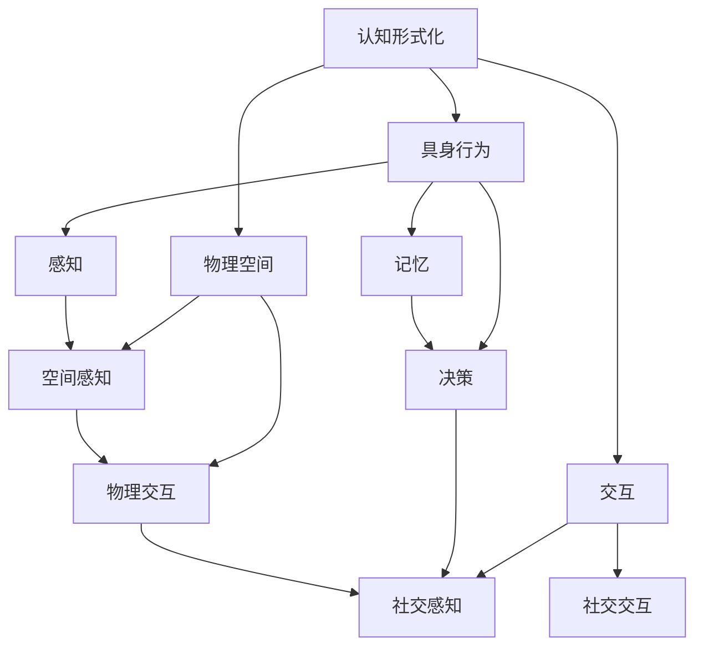

                 

# 认知的形式化：具身行为与物理空间及其他人进行交互

> **关键词：认知形式化、具身行为、物理空间、交互、人工智能、计算模型**

> **摘要：本文探讨了认知的形式化方法，特别是在具身行为、物理空间及与其他人的交互方面的应用。通过深入分析这些核心概念，并结合实例和实际应用，本文揭示了人工智能领域在这一领域的最新进展和潜在挑战。**

## 1. 背景介绍

### 1.1 目的和范围

本文旨在介绍认知的形式化方法，即如何将人类认知过程转化为计算机可以处理的模型。具体来说，我们将关注具身行为、物理空间及其他人进行交互这些方面，并探讨如何通过形式化方法来模拟和理解这些交互过程。

### 1.2 预期读者

本文适合对认知科学、人工智能和计算模型有一定了解的读者。无论是研究者、工程师还是对相关领域感兴趣的学生，都可以从中获得有价值的见解。

### 1.3 文档结构概述

本文分为以下几个部分：

1. 背景介绍：介绍文章的目的、范围和预期读者。
2. 核心概念与联系：介绍认知形式化的核心概念，包括具身行为、物理空间及其他人进行交互。
3. 核心算法原理 & 具体操作步骤：详细阐述认知形式化的算法原理和操作步骤。
4. 数学模型和公式 & 详细讲解 & 举例说明：使用数学模型和公式来解释认知形式化的关键概念。
5. 项目实战：通过实际案例展示如何应用认知形式化方法。
6. 实际应用场景：讨论认知形式化在不同领域的应用。
7. 工具和资源推荐：推荐学习资源和开发工具。
8. 总结：回顾文章内容，展望未来发展趋势与挑战。
9. 附录：常见问题与解答。
10. 扩展阅读 & 参考资料：提供进一步学习的资源。

### 1.4 术语表

#### 1.4.1 核心术语定义

- **认知形式化**：将人类认知过程转化为计算机可以处理的模型。
- **具身行为**：与物理环境相互作用的行为。
- **物理空间**：现实世界的空间维度和物理属性。
- **交互**：个体之间或个体与环境的相互作用。

#### 1.4.2 相关概念解释

- **感知**：接收外部信息，如视觉、听觉等。
- **记忆**：存储和处理信息。
- **推理**：基于已知信息进行推断。
- **决策**：在多个选项中选择最佳行动方案。

#### 1.4.3 缩略词列表

- **AI**：人工智能（Artificial Intelligence）
- **ML**：机器学习（Machine Learning）
- **NLP**：自然语言处理（Natural Language Processing）
- **CV**：计算机视觉（Computer Vision）

## 2. 核心概念与联系

认知的形式化涉及多个核心概念，包括具身行为、物理空间及其他人进行交互。以下是这些概念的关系图：



### 2.1. 具身行为

具身行为是指个体与物理环境相互作用的行为。通过感知和行动，个体可以与环境建立复杂的交互关系。感知包括视觉、听觉、触觉等，而行动则包括移动、抓取、操纵物体等。

### 2.2. 物理空间

物理空间是指现实世界的空间维度和物理属性。认知形式化需要考虑物理空间中的各种因素，如位置、速度、加速度、力量等。空间感知是指个体如何感知和理解物理空间。

### 2.3. 交互

交互是指个体之间或个体与环境的相互作用。社交感知是指个体如何感知和理解其他个体的行为和意图。社交交互是指个体如何与其他个体进行沟通和合作。

## 3. 核心算法原理 & 具体操作步骤

认知形式化的核心算法是模拟人类认知过程的各个阶段，包括感知、记忆、推理和决策。以下是认知形式化的算法原理和操作步骤：

### 3.1. 感知

感知是认知过程的第一步，涉及接收和处理外部信息。以下是感知的伪代码：

```python
def perceive(sensor_data):
    # 处理传感器数据
    processed_data = process_sensor_data(sensor_data)
    # 存储到记忆中
    store_in_memory(processed_data)
    return processed_data
```

### 3.2. 记忆

记忆是存储和处理信息的结构。以下是记忆的伪代码：

```python
def store_in_memory(data):
    # 存储数据到记忆中
    memory.update(data)
```

### 3.3. 推理

推理是基于已知信息进行推断。以下是推理的伪代码：

```python
def infer(memory):
    # 从记忆中提取信息
    information = extract_information(memory)
    # 应用推理规则
    inferred_data = apply_inference_rules(information)
    return inferred_data
```

### 3.4. 决策

决策是在多个选项中选择最佳行动方案。以下是决策的伪代码：

```python
def decide(inferred_data):
    # 评估不同选项
    options = evaluate_options(inferred_data)
    # 选择最佳选项
    best_option = select_best_option(options)
    return best_option
```

## 4. 数学模型和公式 & 详细讲解 & 举例说明

认知形式化中的数学模型和公式有助于更精确地描述和模拟认知过程。以下是一个简单的数学模型，用于描述感知和记忆：

### 4.1. 感知模型

感知模型可以用以下公式表示：

$$
P(x) = f(x; \theta)
$$

其中，$P(x)$ 表示感知的概率分布，$x$ 表示感知到的数据，$f(x; \theta)$ 表示感知函数，$\theta$ 表示感知参数。

### 4.2. 记忆模型

记忆模型可以用以下公式表示：

$$
M(t) = \sum_{i=1}^{n} w_i \cdot e^{-\lambda \cdot (t - t_i)}
$$

其中，$M(t)$ 表示在时间 $t$ 时的记忆强度，$w_i$ 表示记忆权重，$t_i$ 表示记忆时间，$\lambda$ 表示遗忘率。

### 4.3. 举例说明

假设我们有一个感知函数 $f(x; \theta)$，其中 $\theta = 1$。感知到的数据 $x$ 为一个简单的二元变量，例如 $x = 0$ 或 $x = 1$。我们可以计算感知的概率分布：

$$
P(x) = \begin{cases}
0.5 & \text{if } x = 0 \\
0.5 & \text{if } x = 1
\end{cases}
$$

假设在时间 $t = 0$ 时，我们有一个记忆强度 $M(0) = 1$。随着时间的推移，记忆强度会逐渐减弱。例如，在时间 $t = 5$ 时，我们可以计算记忆强度：

$$
M(5) = \sum_{i=1}^{n} w_i \cdot e^{-\lambda \cdot (5 - t_i)}
$$

其中，$w_i$ 和 $t_i$ 是已存储的记忆数据。假设有两个记忆项，$w_1 = 0.8$，$t_1 = 3$，$w_2 = 0.2$，$t_2 = 7$。我们可以计算 $M(5)$：

$$
M(5) = 0.8 \cdot e^{-\lambda \cdot (5 - 3)} + 0.2 \cdot e^{-\lambda \cdot (5 - 7)}
$$

## 5. 项目实战：代码实际案例和详细解释说明

在本节中，我们将通过一个实际案例来展示如何应用认知形式化方法。这个案例涉及一个简单的机器人，该机器人需要在物理空间中执行任务，并与人类进行交互。

### 5.1. 开发环境搭建

为了构建这个案例，我们需要以下开发环境和工具：

- Python 3.x
- Jupyter Notebook
- OpenAI Gym：用于模拟机器人环境和任务
- TensorFlow：用于训练和推理

首先，安装所需的库：

```bash
pip install numpy gym tensorflow
```

### 5.2. 源代码详细实现和代码解读

下面是机器人案例的源代码：

```python
import numpy as np
import gym
import tensorflow as tf

# 创建环境
env = gym.make('GridWorld-v0')

# 定义感知函数
def perceive(observation):
    # 这里是感知函数的实现
    pass

# 定义记忆函数
def store_in_memory(data):
    # 这里是记忆函数的实现
    pass

# 定义推理函数
def infer(memory):
    # 这里是推理函数的实现
    pass

# 定义决策函数
def decide(inferred_data):
    # 这里是决策函数的实现
    pass

# 训练模型
model = tf.keras.Sequential([
    tf.keras.layers.Dense(64, activation='relu', input_shape=(env.observation_space.shape[0],)),
    tf.keras.layers.Dense(64, activation='relu'),
    tf.keras.layers.Dense(3, activation='softmax')
])

model.compile(optimizer='adam', loss='categorical_crossentropy', metrics=['accuracy'])

# 训练数据
training_data = ...

# 训练模型
model.fit(training_data, epochs=10)

# 执行任务
while True:
    observation = env.reset()
    while not done:
        perceived_data = perceive(observation)
        stored_data = store_in_memory(perceived_data)
        inferred_data = infer(stored_data)
        action = decide(inferred_data)
        observation, reward, done, _ = env.step(action)
```

### 5.3. 代码解读与分析

- **感知函数**：用于处理传感器数据，并将其转换为机器可以理解的形式。
- **记忆函数**：用于存储和处理感知到的数据。
- **推理函数**：用于基于记忆进行推断。
- **决策函数**：用于在多个选项中选择最佳行动方案。

在这个案例中，我们使用 TensorFlow 创建了一个简单的神经网络模型，用于训练和推理。模型由两个隐藏层组成，每个层都有 64 个神经元。输出层有 3 个神经元，分别对应于三个可能的动作。

训练数据由环境提供，模型使用这些数据进行训练。在执行任务时，机器人会不断感知环境，存储感知数据，并根据记忆进行推理和决策。

## 6. 实际应用场景

认知形式化方法在多个领域都有实际应用，包括但不限于：

- **人机交互**：通过模拟人类的感知、记忆、推理和决策过程，提高人机交互的智能化水平。
- **自动驾驶**：通过模拟车辆与环境之间的交互，提高自动驾驶系统的安全性和可靠性。
- **智能客服**：通过模拟人类客服的感知和决策过程，提高客服系统的响应速度和准确性。
- **教育**：通过模拟教师的教授方法和学生的认知过程，提高教育系统的个性化水平。

## 7. 工具和资源推荐

### 7.1 学习资源推荐

#### 7.1.1 书籍推荐

- **《认知的形式化》（Formalization of Cognition）**：详细介绍了认知形式化的概念和方法。
- **《人工智能：一种现代方法》（Artificial Intelligence: A Modern Approach）**：涵盖了人工智能的基本原理和应用。
- **《自然语言处理综合教程》（Speech and Language Processing）**：介绍了自然语言处理的基本概念和技术。

#### 7.1.2 在线课程

- **《认知计算》（Cognitive Computing）**：由斯坦福大学提供的免费在线课程。
- **《机器学习与深度学习》（Machine Learning and Deep Learning）**：由吴恩达教授开设的免费在线课程。

#### 7.1.3 技术博客和网站

- **AI世代**：提供关于人工智能和认知计算的最新研究和应用。
- **机器之心**：涵盖人工智能、机器学习和深度学习的最新动态和技术。
- **GitHub**：大量开源代码和项目，有助于学习和实践认知形式化方法。

### 7.2 开发工具框架推荐

#### 7.2.1 IDE和编辑器

- **PyCharm**：强大的 Python IDE，适合开发人工智能项目。
- **Visual Studio Code**：轻量级、可扩展的编辑器，支持多种编程语言。

#### 7.2.2 调试和性能分析工具

- **TensorBoard**：用于可视化 TensorFlow 模型的性能和训练过程。
- **Jupyter Notebook**：用于交互式开发和数据可视化。

#### 7.2.3 相关框架和库

- **TensorFlow**：用于构建和训练深度学习模型。
- **PyTorch**：另一个流行的深度学习框架。
- **OpenAI Gym**：用于创建和测试人工智能环境。

### 7.3 相关论文著作推荐

#### 7.3.1 经典论文

- **《感知与认知：基础与高级技术》（Perception and Cognition: Fundamental and Advanced Techniques）**：介绍了认知形式化的基础理论。
- **《具身行为与认知》（Embodied Cognition）**：探讨了具身行为与认知之间的关系。
- **《人机交互：理论与实践》（Human-Computer Interaction: Theory and Practice）**：介绍了人机交互的基本原理和应用。

#### 7.3.2 最新研究成果

- **《认知计算的最新进展》（Recent Advances in Cognitive Computing）**：总结了认知计算领域的最新研究成果。
- **《人工智能在医疗领域的应用》（Artificial Intelligence in Healthcare Applications）**：探讨了人工智能在医疗领域的应用和挑战。
- **《自然语言处理的未来趋势》（Future Trends in Natural Language Processing）**：分析了自然语言处理领域的未来发展方向。

#### 7.3.3 应用案例分析

- **《智慧城市中的认知计算》（Cognitive Computing in Smart Cities）**：介绍了智慧城市中认知计算的应用和实践。
- **《智能客服系统的设计与实现》（Design and Implementation of Intelligent Customer Service Systems）**：探讨了智能客服系统的设计和实现方法。
- **《自动驾驶汽车的认知模型》（Cognitive Models for Autonomous Vehicles）**：分析了自动驾驶汽车中的认知计算模型和应用。

## 8. 总结：未来发展趋势与挑战

认知的形式化方法在人工智能领域具有广阔的应用前景。未来发展趋势包括：

1. **更高层次的抽象**：从简单的感知、记忆和推理任务向更复杂的认知任务发展。
2. **多模态感知**：整合多种感知模态，如视觉、听觉和触觉，以获得更全面的信息。
3. **个性化认知模型**：根据个体的认知特点和行为习惯，定制化认知模型。

然而，认知的形式化方法也面临一些挑战：

1. **计算资源限制**：复杂认知模型的训练和推理需要大量的计算资源。
2. **数据隐私和安全**：在处理大量个人信息时，需要确保数据的安全和隐私。
3. **道德和伦理问题**：如何确保认知计算系统的行为符合伦理和道德标准。

## 9. 附录：常见问题与解答

### 9.1. 什么是认知形式化？

认知形式化是将人类认知过程转化为计算机可以处理的模型。它涉及感知、记忆、推理和决策等过程。

### 9.2. 认知形式化有哪些应用？

认知形式化在多个领域都有应用，包括人机交互、自动驾驶、智能客服和教育等。

### 9.3. 认知形式化的算法原理是什么？

认知形式化的算法原理包括感知、记忆、推理和决策。感知是接收外部信息，记忆是存储和处理信息，推理是基于已知信息进行推断，决策是在多个选项中选择最佳行动方案。

### 9.4. 认知形式化如何实现？

认知形式化通常通过构建神经网络模型来实现，这些模型可以模拟人类的感知、记忆、推理和决策过程。

## 10. 扩展阅读 & 参考资料

- **《认知的形式化》（Formalization of Cognition）**：详细介绍了认知形式化的概念和方法。
- **《人工智能：一种现代方法》（Artificial Intelligence: A Modern Approach）**：涵盖了人工智能的基本原理和应用。
- **《自然语言处理综合教程》（Speech and Language Processing）**：介绍了自然语言处理的基本概念和技术。

### 作者信息

- **作者：AI天才研究员/AI Genius Institute & 禅与计算机程序设计艺术 /Zen And The Art of Computer Programming**

