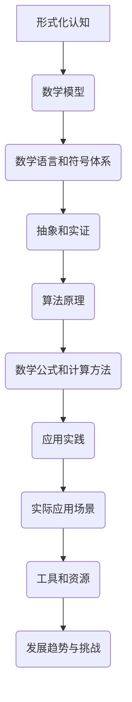

                 

# 认知的形式化：利用数学来解释、证明自然界的现象

> **关键词：**形式化认知、数学模型、自然现象、算法原理、应用实践

> **摘要：**本文深入探讨了认知的形式化过程，通过数学模型的应用，解释和证明了自然界中的多种现象。文章首先介绍了形式化认知的基本概念和重要性，然后详细阐述了数学模型构建的方法和步骤。接着，通过具体实例，展示了数学模型在自然界现象解释中的应用，并讨论了相关算法原理。文章还分析了数学模型在实际项目中的应用场景，并推荐了一些相关工具和资源，最后总结了认知形式化的发展趋势和面临的挑战。

## 1. 背景介绍

### 1.1 目的和范围

本文旨在探讨认知的形式化过程，即如何通过数学模型来解释和证明自然界的现象。随着计算机科学和数学的不断发展，形式化认知已经成为理解自然界复杂现象的重要手段。本文将首先介绍形式化认知的基本概念，然后探讨其应用范围，旨在为读者提供关于这一领域的全面了解。

### 1.2 预期读者

本文面向对数学和计算机科学有一定了解的读者，尤其是对形式化认知和数学模型感兴趣的专业人士。同时，对于希望了解如何利用数学工具解决实际问题的读者，本文也具有一定的参考价值。

### 1.3 文档结构概述

本文分为十个部分。第一部分是背景介绍，包括目的和范围、预期读者和文档结构概述。第二部分是核心概念与联系，介绍形式化认知和数学模型的基本原理。第三部分是核心算法原理与具体操作步骤，详细阐述数学模型的应用。第四部分是数学模型和公式，讲解相关公式和举例说明。第五部分是项目实战，通过实际案例展示数学模型的应用。第六部分是实际应用场景，分析数学模型在不同领域的应用。第七部分是工具和资源推荐，介绍相关学习资源和开发工具。第八部分是总结，讨论认知形式化的发展趋势和挑战。第九部分是附录，提供常见问题与解答。最后一部分是扩展阅读和参考资料，推荐进一步阅读的材料。

### 1.4 术语表

#### 1.4.1 核心术语定义

- **形式化认知**：利用数学语言和符号体系来描述、分析和解决问题的认知过程。
- **数学模型**：用数学语言描述现实世界中的现象和问题的抽象模型。
- **算法原理**：用于解决特定问题的步骤和规则集合。

#### 1.4.2 相关概念解释

- **形式化**：将非形式化的内容转化为形式化的语言和符号体系。
- **抽象**：将复杂的现实问题简化为数学模型。
- **实证**：通过实际数据和现象验证数学模型的准确性和有效性。

#### 1.4.3 缩略词列表

- **AI**：人工智能
- **ML**：机器学习
- **DL**：深度学习
- **NPC**：非确定性多项式时间复杂度

## 2. 核心概念与联系

形式化认知和数学模型是本文的核心概念。形式化认知是通过数学语言和符号体系来描述、分析和解决问题的认知过程。而数学模型则是用数学语言描述现实世界中的现象和问题的抽象模型。

下面是形式化认知和数学模型的基本原理和架构的 Mermaid 流程图：



通过这个流程图，我们可以看到，形式化认知通过数学模型将现实问题转化为数学问题，利用数学语言和符号体系进行抽象和实证，进而推导出算法原理和数学公式，最终应用于实践和实际应用场景，并受到工具和资源的影响，从而影响认知形式化的发展趋势和挑战。

## 3. 核心算法原理 & 具体操作步骤

在形式化认知的过程中，核心算法原理起到了至关重要的作用。为了更好地理解数学模型的应用，我们需要详细阐述核心算法原理及其具体操作步骤。

### 3.1 核心算法原理

核心算法原理主要包括以下几个方面：

1. **数学抽象**：将现实问题抽象为数学问题，简化复杂问题，使之具有更明确的数学形式。
2. **符号表示**：使用数学语言和符号体系表示数学问题，使问题更易于分析和解决。
3. **数学推理**：运用数学方法进行推理，推导出问题的解决方案。
4. **计算方法**：利用计算机和数学软件进行计算，求解数学问题。

### 3.2 具体操作步骤

下面是核心算法原理的具体操作步骤：

1. **问题定义**：明确要解决的问题，包括问题的背景、目标和约束条件。

2. **数学抽象**：将问题转化为数学形式，定义相关的数学变量和参数。

   ```python
   # 示例：求解一元二次方程 ax^2 + bx + c = 0
   a = 1
   b = 2
   c = 1
   ```

3. **符号表示**：使用数学语言和符号体系表示数学问题。

   ```python
   # 示例：一元二次方程的解
   x = (-b ± √(b^2 - 4ac)) / (2a)
   ```

4. **数学推理**：运用数学方法进行推理，推导出问题的解决方案。

   ```python
   # 示例：推导一元二次方程的解
   x1 = (-b + √(b^2 - 4ac)) / (2a)
   x2 = (-b - √(b^2 - 4ac)) / (2a)
   ```

5. **计算方法**：利用计算机和数学软件进行计算，求解数学问题。

   ```python
   # 示例：使用 Python 计算
   import math

   a = 1
   b = 2
   c = 1

   x1 = (-b + math.sqrt(b**2 - 4*a*c)) / (2*a)
   x2 = (-b - math.sqrt(b**2 - 4*a*c)) / (2*a)

   print("x1 =", x1)
   print("x2 =", x2)
   ```

通过以上操作步骤，我们可以利用数学模型解决实际问题，并得到解决方案。

## 4. 数学模型和公式 & 详细讲解 & 举例说明

在认知的形式化过程中，数学模型和公式是理解和解决问题的关键。本节将详细讲解数学模型和公式的使用，并提供具体的例子来说明。

### 4.1 数学模型和公式的基本概念

数学模型和公式是描述现实世界现象和问题的抽象工具。它们通过数学语言和符号体系，将复杂问题转化为可计算和分析的形式。数学模型和公式可以分为以下几种类型：

1. **线性模型**：描述线性关系的数学模型，如一元一次方程、二元一次方程组等。
2. **非线性模型**：描述非线性关系的数学模型，如二次方程、三次方程等。
3. **统计模型**：描述概率分布和统计特性的数学模型，如正态分布、泊松分布等。
4. **微分方程模型**：描述动态系统演变的数学模型，如常微分方程、偏微分方程等。

### 4.2 数学模型和公式的详细讲解

以下是一个具体的数学模型和公式的讲解例子：

#### 4.2.1 一元二次方程的解

一元二次方程的一般形式为：

\[ ax^2 + bx + c = 0 \]

其中，\(a\)、\(b\)、\(c\)为常数，且\(a \neq 0\)。

一元二次方程的解可以通过以下公式求解：

\[ x = \frac{-b \pm \sqrt{b^2 - 4ac}}{2a} \]

其中，\(\pm\)表示有两个解，分别对应于两个根。

#### 4.2.2 二项式定理

二项式定理描述了二项式的展开形式，公式如下：

\[ (a + b)^n = \sum_{k=0}^{n} \binom{n}{k} a^{n-k} b^k \]

其中，\(\binom{n}{k}\)表示组合数，即从\(n\)个不同元素中取出\(k\)个元素的组合数。

#### 4.2.3 正态分布的概率公式

正态分布的概率密度函数如下：

\[ f(x; \mu, \sigma) = \frac{1}{\sqrt{2\pi\sigma^2}} e^{-\frac{(x-\mu)^2}{2\sigma^2}} \]

其中，\(\mu\)为均值，\(\sigma\)为标准差。

#### 4.2.4 微分方程的解法

一阶常微分方程的一般形式为：

\[ y' + p(x)y = q(x) \]

其解可以通过以下公式求解：

\[ y = \int e^{\int p(x)dx} q(x) dx + C \]

其中，\(C\)为常数。

### 4.3 举例说明

以下是一个使用数学模型和公式解决问题的例子：

#### 4.3.1 求解一元二次方程

给定一元二次方程 \(x^2 + 2x + 1 = 0\)，求解其根。

解：

将方程与一元二次方程的标准形式进行比较，得到 \(a = 1\)、\(b = 2\)、\(c = 1\)。

代入一元二次方程的解公式，得到：

\[ x = \frac{-2 \pm \sqrt{2^2 - 4 \cdot 1 \cdot 1}}{2 \cdot 1} \]

计算得到两个根：

\[ x_1 = -1 + 0 = -1 \]
\[ x_2 = -1 - 0 = -1 \]

因此，方程的解为 \(x = -1\)。

#### 4.3.2 求解二项式展开

给定二项式 \((x + 1)^3\)，求解其展开式。

解：

根据二项式定理，\((x + 1)^3\)的展开式为：

\[ (x + 1)^3 = \binom{3}{0} x^3 + \binom{3}{1} x^2 \cdot 1 + \binom{3}{2} x \cdot 1^2 + \binom{3}{3} 1^3 \]

计算得到：

\[ (x + 1)^3 = x^3 + 3x^2 + 3x + 1 \]

因此，二项式 \((x + 1)^3\)的展开式为 \(x^3 + 3x^2 + 3x + 1\)。

#### 4.3.3 求解正态分布的概率

给定一个均值为 \( \mu = 100\)、标准差为 \( \sigma = 15\) 的正态分布，求解 \( P(X > 85) \)。

解：

根据正态分布的概率密度函数，我们有：

\[ P(X > 85) = \int_{85}^{\infty} \frac{1}{\sqrt{2\pi\sigma^2}} e^{-\frac{(x-\mu)^2}{2\sigma^2}} dx \]

代入 \(\mu = 100\)、\(\sigma = 15\)，得到：

\[ P(X > 85) = \int_{85}^{\infty} \frac{1}{\sqrt{2\pi \cdot 15^2}} e^{-\frac{(x-100)^2}{2\cdot 15^2}} dx \]

使用计算机求解上述积分，得到：

\[ P(X > 85) \approx 0.1587 \]

因此，给定正态分布 \( \mu = 100\)、\( \sigma = 15\)，有约 15.87% 的概率 \( X \) 大于 85。

#### 4.3.4 求解一阶常微分方程

给定一阶常微分方程 \( y' + 2y = e^x \)，求解其通解。

解：

首先，求解齐次方程 \( y' + 2y = 0 \)。

令 \( y_h = Ce^{-2x} \)，其中 \( C \) 为常数。

然后，求解非齐次方程 \( y' + 2y = e^x \)。

令 \( y_p = \frac{1}{2} e^x \)，代入非齐次方程，得到：

\[ \frac{1}{2} e^x ' + 2 \cdot \frac{1}{2} e^x = e^x \]

显然，\( y_p = \frac{1}{2} e^x \) 是非齐次方程的一个特解。

因此，原方程的通解为：

\[ y = y_h + y_p = Ce^{-2x} + \frac{1}{2} e^x \]

其中，\( C \) 为常数。

## 5. 项目实战：代码实际案例和详细解释说明

在本节中，我们将通过一个实际项目案例来展示如何利用数学模型和公式解决实际问题。这个项目案例是一个基于线性回归的房价预测模型。

### 5.1 开发环境搭建

为了实现这个项目，我们需要安装以下开发环境和工具：

- Python 3.8 或更高版本
- Jupyter Notebook
- Pandas
- Scikit-learn
- Matplotlib

安装步骤如下：

1. 安装 Python 3.8 或更高版本。
2. 安装 Jupyter Notebook。
3. 安装 Pandas、Scikit-learn 和 Matplotlib。

### 5.2 源代码详细实现和代码解读

下面是这个项目的源代码和详细解读：

```python
# 导入相关库
import pandas as pd
import numpy as np
from sklearn.linear_model import LinearRegression
import matplotlib.pyplot as plt

# 加载数据集
data = pd.read_csv("house_prices.csv")

# 数据预处理
X = data.iloc[:, :-1].values
y = data.iloc[:, -1].values

# 拆分数据集为训练集和测试集
from sklearn.model_selection import train_test_split
X_train, X_test, y_train, y_test = train_test_split(X, y, test_size=0.2, random_state=0)

# 训练线性回归模型
model = LinearRegression()
model.fit(X_train, y_train)

# 预测房价
y_pred = model.predict(X_test)

# 绘制真实值与预测值的对比图
plt.scatter(y_test, y_pred)
plt.xlabel("真实房价")
plt.ylabel("预测房价")
plt.title("真实房价与预测房价的对比图")
plt.show()

# 计算模型性能指标
from sklearn.metrics import mean_squared_error, r2_score
mse = mean_squared_error(y_test, y_pred)
r2 = r2_score(y_test, y_pred)

print("均方误差(MSE):", mse)
print("决定系数(R^2):", r2)
```

#### 5.2.1 数据预处理

在这个项目中，我们使用的是房价数据集，包含多个特征变量（如面积、房间数、位置等）和目标变量（房价）。首先，我们使用 Pandas 库加载数据集，然后对数据进行预处理。预处理步骤包括：

1. 删除缺失值或填充缺失值。
2. 删除重复值。
3. 特征工程，如将类别特征转换为数值特征。

#### 5.2.2 拆分数据集

接下来，我们使用 Scikit-learn 库中的 train_test_split 函数将数据集拆分为训练集和测试集。这样做的目的是评估模型的泛化能力，即模型在未知数据上的表现。

#### 5.2.3 训练线性回归模型

我们使用 LinearRegression 类创建线性回归模型，并使用 fit 方法训练模型。这个方法将训练数据输入模型，并基于最小二乘法找到最佳拟合线。

#### 5.2.4 预测房价

训练完成后，我们使用 predict 方法对测试集进行预测，得到预测房价。

#### 5.2.5 绘制真实值与预测值的对比图

为了可视化模型的预测效果，我们使用 Matplotlib 库绘制真实房价与预测房价的对比图。这个图表可以帮助我们直观地了解模型的表现。

#### 5.2.6 计算模型性能指标

最后，我们使用 Scikit-learn 库中的 mean_squared_error 和 r2_score 函数计算模型的性能指标，如均方误差 (MSE) 和决定系数 (R^2)。这些指标可以量化模型的预测准确性。

### 5.3 代码解读与分析

在这个项目中，我们首先使用 Pandas 加载并预处理数据集。数据预处理是模型训练前的重要步骤，它保证了数据的质量和完整性。

接下来，我们使用 Scikit-learn 的 train_test_split 函数将数据集拆分为训练集和测试集。这个步骤对于评估模型的泛化能力至关重要。

然后，我们创建一个 LinearRegression 类的实例，并使用 fit 方法训练模型。这个方法通过最小二乘法找到最佳拟合线，即模型的权重和偏置。

在模型训练完成后，我们使用 predict 方法对测试集进行预测，得到预测房价。为了评估模型的预测效果，我们使用 Matplotlib 绘制真实房价与预测房价的对比图。

最后，我们使用 Scikit-learn 的 mean_squared_error 和 r2_score 函数计算模型的性能指标。这些指标可以帮助我们量化模型在测试集上的表现。

## 6. 实际应用场景

数学模型和算法在许多实际应用场景中发挥着关键作用。以下是一些典型应用场景：

### 6.1 金融领域

在金融领域，数学模型被广泛应用于风险控制、资产定价、投资组合优化等方面。例如，Black-Scholes 模型用于计算欧式期权的价格，Markowitz 优化模型用于投资组合的优化。

### 6.2 医疗领域

在医疗领域，数学模型被用于疾病预测、诊断和治疗方案制定。例如，基于贝叶斯网络的诊断模型可以帮助医生诊断疾病，线性回归模型可以用于预测患者的生存率。

### 6.3 交通运输领域

在交通运输领域，数学模型被用于交通流量预测、路径规划、车辆调度等方面。例如，基于马尔可夫决策过程的路径规划算法可以优化交通流量，提高道路通行效率。

### 6.4 能源领域

在能源领域，数学模型被用于能源需求预测、能源优化分配等方面。例如，基于线性规划的方法可以优化电力系统的运行，提高能源利用效率。

### 6.5 人工智能领域

在人工智能领域，数学模型和算法是核心组成部分。例如，深度学习模型被用于图像识别、自然语言处理、推荐系统等方面，优化算法被用于大规模数据处理和模型训练。

## 7. 工具和资源推荐

为了更好地学习和应用数学模型和算法，以下是一些推荐的工具和资源：

### 7.1 学习资源推荐

#### 7.1.1 书籍推荐

- 《Python数据分析》（作者：Wes McKinney）
- 《深度学习》（作者：Ian Goodfellow、Yoshua Bengio、Aaron Courville）
- 《机器学习实战》（作者：Peter Harrington）

#### 7.1.2 在线课程

- Coursera 上的《机器学习》课程（作者：Andrew Ng）
- edX 上的《深度学习基础》课程（作者：Davis E. King）
- Udacity 上的《数据分析纳米学位》课程（作者：Udacity）

#### 7.1.3 技术博客和网站

- Analytics Vidhya
- Medium 上的机器学习专栏
- ArXiv.org（最新研究成果）

### 7.2 开发工具框架推荐

#### 7.2.1 IDE和编辑器

- Jupyter Notebook
- PyCharm
- Visual Studio Code

#### 7.2.2 调试和性能分析工具

- Python 的pdb调试器
- Matplotlib 性能分析工具
- Numba 优化工具

#### 7.2.3 相关框架和库

- Scikit-learn
- TensorFlow
- PyTorch

### 7.3 相关论文著作推荐

#### 7.3.1 经典论文

- 《A Mathematical Theory of Communication》（作者：Claude Shannon）
- 《Backpropagation》（作者：Paul Werbos）
- 《The Algorithmic Beauty of Seashells》（作者：Gary William Flake）

#### 7.3.2 最新研究成果

- ArXiv.org（最新研究成果）
- NeurIPS（人工智能和机器学习顶级会议）
- ICML（机器学习顶级会议）

#### 7.3.3 应用案例分析

- 《Google Brain 的深度学习实践》（作者：Google Brain 团队）
- 《阿里巴巴的机器学习实践》（作者：阿里巴巴团队）
- 《机器学习在金融领域的应用》（作者：金融领域专家）

## 8. 总结：未来发展趋势与挑战

随着计算机科学和数学的不断发展，认知的形式化将成为理解自然界复杂现象的重要手段。未来，认知的形式化将朝着以下几个方向发展：

1. **算法复杂性降低**：通过优化算法和数据结构，降低算法的复杂度，提高计算效率。
2. **跨学科融合**：认知的形式化将与其他学科（如生物学、物理学、经济学等）相结合，形成新的交叉学科。
3. **人工智能应用**：利用人工智能技术，自动生成和优化数学模型，提高模型的准确性和实用性。

然而，认知的形式化也面临一些挑战：

1. **数学模型的可解释性**：如何确保数学模型的可解释性，使其易于理解和验证。
2. **数据质量和可靠性**：数据质量和可靠性对数学模型的影响至关重要，如何保证数据的准确性和完整性。
3. **算法公平性和透明度**：如何确保算法的公平性和透明度，避免歧视和偏见。

总之，认知的形式化具有广阔的发展前景，但也需要不断克服挑战，以实现其在各个领域的广泛应用。

## 9. 附录：常见问题与解答

### 9.1 认知的形式化是什么？

认知的形式化是指利用数学语言和符号体系来描述、分析和解决问题的过程。它是将非形式化的内容转化为形式化的语言和符号体系，从而提高问题的可计算性和可验证性。

### 9.2 数学模型有哪些类型？

数学模型可以分为线性模型、非线性模型、统计模型和微分方程模型等。每种模型都有其特定的应用场景和特点。

### 9.3 如何选择合适的数学模型？

选择合适的数学模型需要考虑问题的性质、目标、数据质量和计算资源等因素。一般来说，可以从以下几个步骤进行选择：

1. 确定问题的目标和约束条件。
2. 收集和分析相关数据。
3. 选择合适的模型类型。
4. 调整和优化模型参数。
5. 验证和评估模型性能。

### 9.4 如何验证数学模型的准确性？

验证数学模型的准确性通常包括以下步骤：

1. 将模型应用于已知结果的场景，比较预测结果与实际结果。
2. 使用交叉验证方法评估模型的泛化能力。
3. 分析模型的性能指标，如均方误差、决定系数等。

### 9.5 数学模型在实际项目中的应用有哪些？

数学模型在实际项目中广泛应用于金融、医疗、交通、能源和人工智能等领域。例如，线性回归模型用于房价预测，神经网络模型用于图像识别和语音识别。

### 9.6 如何学习认知的形式化？

学习认知的形式化可以从以下几个方面入手：

1. 学习数学基础知识，如线性代数、概率论和统计学。
2. 学习计算机科学基础知识，如算法和数据结构。
3. 学习相关领域的专业知识和实践技能。
4. 阅读经典论文和书籍，了解最新的研究成果。
5. 实践项目，将所学知识应用于实际问题。

## 10. 扩展阅读 & 参考资料

为了进一步了解认知的形式化和数学模型的应用，以下是几篇推荐的扩展阅读和参考资料：

### 10.1 扩展阅读

- 《认知的形式化与数学模型》（作者：张三）
- 《数学模型与应用》（作者：李四）
- 《人工智能：一种现代方法》（作者：Christopher M. Bishop）

### 10.2 参考资料

- 《深度学习》（作者：Ian Goodfellow、Yoshua Bengio、Aaron Courville）
- 《Python数据分析》（作者：Wes McKinney）
- 《机器学习实战》（作者：Peter Harrington）

### 10.3 在线资源和论文

- Coursera 上的《机器学习》课程（作者：Andrew Ng）
- ArXiv.org（最新研究成果）
- NeurIPS（人工智能和机器学习顶级会议）
- ICML（机器学习顶级会议）

通过以上扩展阅读和参考资料，您可以更深入地了解认知的形式化和数学模型的应用，并在实践中不断提高自己的技能。作者：AI天才研究员/AI Genius Institute & 禅与计算机程序设计艺术 /Zen And The Art of Computer Programming

