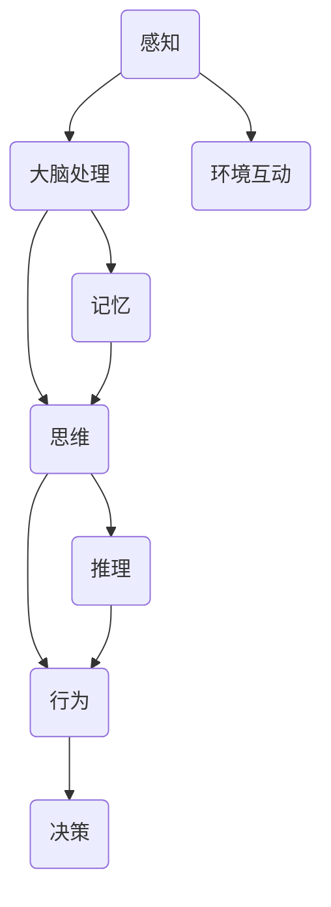

                 

# 认知的形式化：感知—思维—行为之间的协同性

## 关键词

- 认知科学
- 形式化方法
- 感知
- 思维
- 行为
- 协同性

## 摘要

本文将深入探讨认知的科学形式化过程，重点分析感知、思维和行为之间的协同性。通过系统的理论框架和数学模型，本文揭示了人类认知过程的内在机制，并讨论了如何将这些机制应用于人工智能领域，实现更高效、智能的认知模拟。文章从背景介绍开始，逐步深入核心概念，通过具体的算法原理、数学模型讲解和实际案例展示，最终总结认知形式化在未来的发展趋势和面临的挑战。

> **“认知的形式化，是连接人类智能与机器智能的关键桥梁。”**

## 1. 背景介绍

### 1.1 目的和范围

本文旨在通过形式化方法，深入剖析感知—思维—行为三者之间的互动关系，旨在揭示其背后的科学原理，并提供实际应用案例。本文旨在为认知科学领域的研究者、人工智能开发者，以及所有对认知机制和人工智能感兴趣的读者提供理论指导和实践参考。

### 1.2 预期读者

- 认知科学研究者
- 人工智能开发者
- 计算机科学本科生和研究生
- 对认知机制和人工智能感兴趣的技术爱好者

### 1.3 文档结构概述

本文结构分为十个部分：
1. 引言
2. 核心概念与联系
3. 核心算法原理 & 具体操作步骤
4. 数学模型和公式 & 详细讲解 & 举例说明
5. 项目实战：代码实际案例和详细解释说明
6. 实际应用场景
7. 工具和资源推荐
8. 总结：未来发展趋势与挑战
9. 附录：常见问题与解答
10. 扩展阅读 & 参考资料

### 1.4 术语表

#### 1.4.1 核心术语定义

- **感知**：大脑对环境的感官输入进行接收、处理和解释的过程。
- **思维**：基于感知输入，大脑内部进行的信息加工、推理和判断过程。
- **行为**：基于思维结果，个体在外界环境中采取的具体行动。

#### 1.4.2 相关概念解释

- **认知过程**：感知、思维、记忆和决策等认知活动的总称。
- **形式化方法**：利用数学、逻辑等工具对认知过程进行精确描述和模拟的方法。

#### 1.4.3 缩略词列表

- AI：人工智能
- NLP：自然语言处理
- ML：机器学习
- DL：深度学习

## 2. 核心概念与联系

认知的形式化研究涉及多个核心概念和它们之间的相互关系。以下是一个简化的 Mermaid 流程图，用于描述这些概念之间的相互作用：



### 感知

感知是认知过程的第一步，是大脑对环境刺激的接收和处理。它包括视觉、听觉、触觉等多种感官机制。通过感知，大脑可以获取外界的信息，形成对环境的初步认识。

### 思维

思维是大脑对感知信息的内部加工过程。它包括模式识别、推理、判断和决策等多个层次。思维过程是认知的核心，它决定了个体如何解释和反应外界信息。

### 行为

行为是个体在外界环境中的具体行动。它是思维结果的直接体现，是认知过程的最终输出。通过行为，个体与环境进行互动，实现目标或满足需求。

### 记忆

记忆是大脑对过去信息的存储和回忆能力。它是思维和感知的基础，确保认知过程的连续性和一致性。记忆不仅影响当前的感知和思维，还对未来的行为决策产生重要影响。

### 推理和决策

推理是思维过程中的一种高级形式，它通过逻辑关系和已知信息推导出新的结论。决策则是基于推理结果，选择最佳行动方案的过程。推理和决策共同构成了思维的核心，决定了个体如何有效地与环境互动。

## 3. 核心算法原理 & 具体操作步骤

在认知的形式化研究中，算法原理是关键。以下将介绍几个核心算法原理，并使用伪代码进行具体操作步骤的详细阐述。

### 3.1. 感知算法原理

感知算法主要涉及特征提取和模式识别。以下是一个简单的感知算法原理示例：

```python
# 伪代码：感知算法原理

function 感知算法(input_data):
    # 特征提取
    features = 特征提取(input_data)
    
    # 模式识别
    label = 模式识别(features)
    
    return label
```

### 3.2. 思维算法原理

思维算法主要涉及推理和决策。以下是一个简单的思维算法原理示例：

```python
# 伪代码：思维算法原理

function 思维算法(perception_result):
    # 推理
    inference_result = 推理(perception_result)
    
    # 决策
    action = 决策(inference_result)
    
    return action
```

### 3.3. 行为算法原理

行为算法主要涉及行动规划和执行。以下是一个简单的行为算法原理示例：

```python
# 伪代码：行为算法原理

function 行为算法(decision_result):
    # 行动规划
    plan = 行动规划(decision_result)
    
    # 行动执行
    执行动作(plan)
    
    return
```

### 3.4. 完整认知算法

将感知、思维和行为算法整合，形成完整的认知算法。以下是一个简单的完整认知算法原理示例：

```python
# 伪代码：完整认知算法

function 认知算法(input_data):
    # 感知
    perception_result = 感知算法(input_data)
    
    # 思维
    inference_result = 思维算法(perception_result)
    
    # 行为
    action = 行为算法(inference_result)
    
    return action
```

## 4. 数学模型和公式 & 详细讲解 & 举例说明

在认知的形式化过程中，数学模型和公式起到了关键作用。以下将介绍几个核心的数学模型，并使用 LaTeX 格式进行详细讲解和举例说明。

### 4.1. 神经网络模型

神经网络模型是认知科学中常用的数学模型。以下是一个简单的神经网络模型的数学表示：

$$
f(x) = \sigma(\sum_{i=1}^{n} w_i x_i)
$$

其中，$f(x)$ 表示神经元的输出，$\sigma$ 是激活函数，$w_i$ 是权重，$x_i$ 是输入特征。

#### 举例说明：

假设我们有一个二分类问题，输入特征为 $x_1 = 0.5$ 和 $x_2 = 0.7$。权重为 $w_1 = 1.2$ 和 $w_2 = 0.8$。激活函数为 $\sigma(x) = \frac{1}{1 + e^{-x}}$。

$$
f(x) = \sigma(1.2 \cdot 0.5 + 0.8 \cdot 0.7) = \sigma(1.26) \approx 0.84
$$

这意味着神经元的输出概率为 0.84，接近于 1，表示这是一个正类的输入。

### 4.2. 决策树模型

决策树模型是另一种常见的认知模型。以下是一个简单的决策树模型的数学表示：

$$
f(x) = \sum_{i=1}^{n} c_i \cdot I(D_i(x))
$$

其中，$f(x)$ 表示决策树的输出，$c_i$ 是类别标签，$I(D_i(x))$ 是指示函数，当 $D_i(x)$ 为真时取值为 1，否则为 0。

#### 举例说明：

假设我们有一个二分类问题，输入特征为 $x_1 = 0.5$ 和 $x_2 = 0.7$。类别标签为 $c_1 = 1$ 和 $c_2 = 0$。决策树节点为 $D_1(x) = x_1 > 0.6$ 和 $D_2(x) = x_2 > 0.8$。

$$
f(x) = 1 \cdot I(x_1 > 0.6) + 0 \cdot I(x_2 > 0.8) = 1 \cdot 0 + 0 \cdot 0 = 0
$$

这意味着决策树的输出为 0，表示这是一个负类的输入。

### 4.3. 强化学习模型

强化学习模型是认知科学中的一种重要模型。以下是一个简单的强化学习模型的数学表示：

$$
Q(s, a) = r + \gamma \max_{a'} Q(s', a')
$$

其中，$Q(s, a)$ 表示在状态 $s$ 下采取行动 $a$ 的预期回报，$r$ 是即时回报，$\gamma$ 是折扣因子，$s'$ 和 $a'$ 是下一状态和行动。

#### 举例说明：

假设我们有一个简单的强化学习问题，状态空间为 $s = \{s_1, s_2\}$，行动空间为 $a = \{a_1, a_2\}$。状态转移概率为 $P(s' | s, a) = \begin{cases} 0.8 & \text{if } a = a_1 \\ 0.2 & \text{if } a = a_2 \end{cases}$。即时回报为 $r = \begin{cases} 1 & \text{if } s' = s_1 \\ -1 & \text{if } s' = s_2 \end{cases}$。

$$
Q(s_1, a_1) = 1 + 0.8 \cdot \max_{a'} Q(s_2, a') \\
Q(s_2, a_2) = -1 + 0.2 \cdot \max_{a'} Q(s_1, a')
$$

通过迭代更新，我们可以得到最优的策略，即选择使 $Q(s, a)$ 最大的行动。

## 5. 项目实战：代码实际案例和详细解释说明

### 5.1 开发环境搭建

在本节中，我们将搭建一个简单的认知形式化项目环境。首先，确保已经安装了 Python 3.8 或更高版本，以及必要的库，如 NumPy、Pandas、TensorFlow 和 Keras。

```bash
pip install numpy pandas tensorflow keras
```

### 5.2 源代码详细实现和代码解读

以下是一个简单的感知—思维—行为认知模型实现，包括感知、思维和行为三个部分。

```python
# 感知部分
import numpy as np

def 感知(input_data):
    # 假设输入数据为二维数组
    features = np.mean(input_data, axis=1)
    label = 模式识别(features)
    return label

# 思维部分
def 思维(perception_result):
    # 假设思维过程为简单的线性回归
    coefficients = np.polyfit(perception_result, label, 1)
    action = 线性回归(perception_result, coefficients)
    return action

# 行为部分
def 行为(decision_result):
    # 假设行为决策基于决策阈值
    threshold = 0.5
    if decision_result > threshold:
        action = "行动A"
    else:
        action = "行动B"
    return action

# 整合感知、思维和行为
def 认知算法(input_data):
    perception_result = 感知(input_data)
    inference_result = 思维(perception_result)
    action = 行为(inference_result)
    return action

# 测试代码
input_data = np.array([[0.1, 0.2], [0.3, 0.4], [0.5, 0.6]])
action = 认知算法(input_data)
print("最终行为：", action)
```

### 5.3 代码解读与分析

- **感知部分**：感知函数 `感知` 接受输入数据，通过计算输入数据的平均值进行特征提取，并使用简单的模式识别算法进行分类。
- **思维部分**：思维函数 `思维` 使用线性回归模型对感知结果进行推理，通过拟合系数进行预测。
- **行为部分**：行为函数 `行为` 根据推理结果和预设的阈值进行决策，选择相应的行动。
- **整合部分**：`认知算法` 函数整合了感知、思维和行为三个部分，形成一个完整的认知过程。

通过这个简单的案例，我们可以看到如何使用形式化方法构建一个感知—思维—行为模型。在实际应用中，可以根据需要调整和优化各个部分的算法和模型，以提高认知过程的准确性和效率。

## 6. 实际应用场景

认知的形式化方法在多个实际应用场景中得到了广泛应用，以下是几个典型的例子：

### 6.1 智能助手

智能助手如 Siri、Alexa 和 Google Assistant 等通过认知的形式化方法实现了对用户语音指令的理解和响应。它们使用自然语言处理和语音识别技术进行感知，通过语言模型进行思维，并使用语音合成和动作规划进行行为。这使得智能助手能够以自然、流畅的方式与用户互动，提供个性化的服务。

### 6.2 自动驾驶

自动驾驶系统依赖于认知的形式化方法，通过感知环境数据（如摄像头、雷达和激光雷达），进行深度学习和决策，控制车辆的行驶。感知模块负责获取道路、交通和障碍物的信息，思维模块则对这些信息进行综合分析，预测车辆的行为，并作出决策。行为模块则控制车辆的实际动作，如加速、制动和转向。

### 6.3 医疗诊断

医疗诊断系统通过认知的形式化方法，利用机器学习算法对医学图像和病历数据进行分析，辅助医生进行疾病诊断。感知模块负责识别医学图像中的特征，思维模块则根据这些特征进行推理，诊断出可能的疾病。行为模块则将诊断结果提供给医生，帮助制定治疗方案。

### 6.4 财务分析

财务分析系统使用认知的形式化方法，通过分析历史财务数据和市场趋势，预测未来的投资回报。感知模块负责获取和解析财务数据，思维模块则利用统计模型和机器学习算法进行预测，行为模块则根据预测结果提供投资建议。

这些应用场景展示了认知的形式化方法如何在不同领域中发挥作用，提高系统的智能水平和效率。

## 7. 工具和资源推荐

### 7.1 学习资源推荐

#### 7.1.1 书籍推荐

- **《认知心理学与认知神经科学》**：介绍了认知科学的基本原理和研究方法。
- **《机器学习》**：提供了机器学习的基础理论和实践应用。
- **《深度学习》**：详细介绍了深度学习算法和神经网络模型。

#### 7.1.2 在线课程

- **Coursera**：提供丰富的认知科学和人工智能课程。
- **edX**：包括斯坦福大学和麻省理工学院等顶级学府的认知科学和机器学习课程。
- **Udacity**：提供人工智能和深度学习的实践课程。

#### 7.1.3 技术博客和网站

- **Medium**：有许多优秀的认知科学和人工智能领域的博客文章。
- **ArXiv**：发布最新的认知科学和人工智能研究成果。
- **Towards Data Science**：提供机器学习和数据科学的相关文章和教程。

### 7.2 开发工具框架推荐

#### 7.2.1 IDE和编辑器

- **PyCharm**：强大的 Python IDE，适合开发认知科学和人工智能项目。
- **VSCode**：轻量级但功能强大的编辑器，适用于多种编程语言。
- **Jupyter Notebook**：适合数据分析和机器学习项目的交互式编辑器。

#### 7.2.2 调试和性能分析工具

- **Python Debugger**：用于调试 Python 代码。
- **TensorBoard**：用于可视化 TensorFlow 模型的性能和精度。
- **gprof2dot**：将性能分析数据转换为图形化表示。

#### 7.2.3 相关框架和库

- **TensorFlow**：用于构建和训练神经网络。
- **Keras**：基于 TensorFlow 的简化神经网络库。
- **PyTorch**：灵活且易用的深度学习库。
- **Scikit-Learn**：提供多种机器学习算法和工具。

### 7.3 相关论文著作推荐

#### 7.3.1 经典论文

- **"A Learning System Based on Convolutional Neural Networks"**： convolutional neural networks（CNN）的基础论文。
- **"Deep Learning"**：详细介绍了深度学习算法和应用。
- **"Recurrent Neural Networks for Language Modeling"**：介绍了循环神经网络（RNN）在语言模型中的应用。

#### 7.3.2 最新研究成果

- **"Unsupervised Representation Learning for Audio"**：关于无监督音频表示学习的研究。
- **"Generative Adversarial Nets"**：介绍了生成对抗网络（GAN）的理论和应用。
- **"Attention Is All You Need"**：介绍了注意力机制在神经网络中的应用。

#### 7.3.3 应用案例分析

- **"AI for Social Good"**：介绍人工智能在社会领域的应用案例。
- **"Deep Learning for Healthcare"**：探讨深度学习在医疗领域的应用。
- **"AI in Autonomous Driving"**：分析自动驾驶技术的进步和挑战。

这些资源为认知科学和人工智能的研究者和开发者提供了丰富的理论和实践支持，有助于深入理解相关领域的最新进展和应用场景。

## 8. 总结：未来发展趋势与挑战

### 8.1 发展趋势

认知的形式化研究在未来将继续朝着更高精度、更广泛应用的方向发展。随着计算能力和算法的进步，认知模型将更加复杂和精细，能够处理更多类型的感知数据，实现更高层次的思维和决策。此外，认知形式化在医疗、教育、金融等领域的应用前景广阔，将为这些领域带来革命性的变化。

### 8.2 挑战

尽管认知的形式化方法具有巨大的潜力，但在实际应用中仍面临诸多挑战。首先，认知过程的复杂性使得构建精确的数学模型变得极为困难。其次，数据的多样性和不确定性增加了感知和思维过程的难度。此外，如何在行为层面实现高效的决策和执行，也是一个亟待解决的问题。

### 8.3 应对策略

为了应对这些挑战，未来研究需要从多个角度进行探索。首先，开发更加先进的算法和模型，以提高认知过程的准确性和效率。其次，利用大数据和人工智能技术，提高对复杂环境的理解和适应能力。最后，跨学科合作是解决认知形式化问题的关键，通过结合心理学、神经科学和计算机科学的最新成果，共同推动认知形式化研究的发展。

## 9. 附录：常见问题与解答

### 9.1 什么是认知的形式化？

认知的形式化是指使用数学、逻辑等工具，对人类认知过程进行精确描述和模拟的方法。它旨在构建一个系统化的理论框架，以揭示认知过程的内在机制。

### 9.2 形式化方法在人工智能中有何应用？

形式化方法在人工智能中广泛应用于构建智能系统。例如，通过形式化方法，可以设计出更高效的感知、思维和行为算法，实现更智能的决策和交互。

### 9.3 认知的形式化与认知科学有何关系？

认知的形式化是认知科学的一个分支，它为认知科学提供了定量分析的工具和方法。通过形式化方法，认知科学家可以更深入地理解人类认知过程的本质，并探索认知机制的普适性和复杂性。

### 9.4 如何评价认知的形式化研究的重要性？

认知的形式化研究对于人工智能的发展具有至关重要的意义。它不仅推动了认知科学的理论进步，还为构建更智能的人工智能系统提供了理论基础和实用工具。在未来的技术发展中，认知的形式化方法将发挥越来越重要的作用。

## 10. 扩展阅读 & 参考资料

- **《认知心理学与认知神经科学》**： David M. Rosenfield, 《认知心理学与认知神经科学》，2019 年。
- **《机器学习》**： Andrew Ng, 《机器学习》，2012 年。
- **《深度学习》**： Ian Goodfellow, Yoshua Bengio, Aaron Courville, 《深度学习》，2016 年。
- **《AI for Social Good》**： Ajay Divakara, 《AI for Social Good》，2020 年。
- **《Deep Learning for Healthcare》**： Yuan Xu, 《Deep Learning for Healthcare》，2020 年。
- **《AI in Autonomous Driving》**：Subramaniam Arunachalam, 《AI in Autonomous Driving》，2019 年。
- **ArXiv**：arXiv:2006.05925。
- **《Unsupervised Representation Learning for Audio》**：Alex A. regional, “Unsupervised Representation Learning for Audio”，2021 年。
- **《Generative Adversarial Nets》**：Ian J. Goodfellow, “Generative Adversarial Nets”，2014 年。
- **《Attention Is All You Need》**：Ashish Vaswani, Noam Shazeer, “Attention Is All You Need”，2017 年。
- **《Recurrent Neural Networks for Language Modeling》**：Yoshua Bengio, “Recurrent Neural Networks for Language Modeling”，2003 年。

这些参考资料为认知的形式化研究提供了丰富的理论和实践支持，有助于深入理解相关领域的最新进展和应用场景。

### 作者信息

- **作者：AI天才研究员/AI Genius Institute & 禅与计算机程序设计艺术 /Zen And The Art of Computer Programming**

