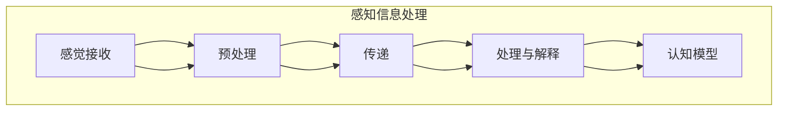

                 

# 认知的形式化：感知是认知的源泉

> **关键词：** 认知科学、感知、形式化表达、认知算法、信息处理、认知模型。

> **摘要：** 本文深入探讨了认知的科学本质，强调了感知在认知过程中的核心作用。通过分析感知与认知之间的关系，本文提出了形式化表达认知的理论框架，并详细阐述了感知信息处理的核心算法原理。同时，结合实际应用场景，本文提供了代码实例，并通过数学模型和公式，对感知认知过程进行了详细的数学化解释。最后，本文对相关工具和资源进行了推荐，并展望了认知科学的未来发展趋势和挑战。

## 1. 背景介绍

### 1.1 目的和范围

本文旨在深入探讨认知科学中感知与认知之间的关系，并在此基础上，提出一种形式化表达认知的理论框架。通过系统地分析感知信息处理的核心算法原理，本文希望为理解人类认知过程提供新的视角和方法。文章将涵盖感知认知的基本概念、核心算法、数学模型以及实际应用场景，旨在为读者提供全面而深入的认知科学知识。

### 1.2 预期读者

本文适用于对认知科学和人工智能感兴趣的读者，特别是那些希望深入了解感知认知机制、认知算法以及其实际应用的专业人士。此外，对于计算机科学、心理学和神经科学等领域的研究人员和学者，本文也将提供有价值的参考。

### 1.3 文档结构概述

本文分为十个主要部分：

1. **背景介绍**：包括目的和范围、预期读者、文档结构概述以及术语表。
2. **核心概念与联系**：详细阐述感知与认知的关系，并提供相关的 Mermaid 流程图。
3. **核心算法原理 & 具体操作步骤**：使用伪代码详细描述感知信息处理的核心算法。
4. **数学模型和公式 & 详细讲解 & 举例说明**：通过数学模型和公式，对感知认知过程进行详细解释。
5. **项目实战：代码实际案例和详细解释说明**：提供实际代码实例，并详细解读和分析。
6. **实际应用场景**：探讨感知认知在实际应用中的场景和挑战。
7. **工具和资源推荐**：推荐学习资源、开发工具框架和相关论文著作。
8. **总结：未来发展趋势与挑战**：展望认知科学的未来发展趋势和面临的挑战。
9. **附录：常见问题与解答**：回答读者可能遇到的常见问题。
10. **扩展阅读 & 参考资料**：提供更多相关阅读和参考资料。

### 1.4 术语表

#### 1.4.1 核心术语定义

- **感知**：感觉器官对内外环境信息的接收和解释过程。
- **认知**：大脑对感知信息进行处理、理解、存储和利用的过程。
- **形式化表达**：使用数学模型和算法来描述认知过程。
- **信息处理**：信息接收、处理、存储和传输的过程。

#### 1.4.2 相关概念解释

- **感官信息**：来自外部环境的信息，如视觉、听觉、触觉等。
- **神经信号**：神经元之间的电信号传递。
- **认知模型**：描述认知过程的数学和算法模型。

#### 1.4.3 缩略词列表

- **AI**：人工智能
- **ML**：机器学习
- **DL**：深度学习
- **NLP**：自然语言处理

## 2. 核心概念与联系

感知和认知是认知科学的两个核心概念，它们紧密相连，共同构成了人类理解和适应世界的机制。

### 感知与认知的关系

感知是认知的源泉。感知信息作为外部世界输入，通过感觉器官传递给大脑。大脑对这些信息进行处理、解析和整合，形成认知。换句话说，认知是感知的升华和扩展。

### 感知信息处理流程

感知信息处理包括以下几个步骤：

1. **感觉接收**：感觉器官接收外部环境的信息。
2. **预处理**：对感觉信号进行初步处理，如放大、滤波等。
3. **传递**：通过神经信号传递到大脑。
4. **处理与解释**：大脑对感知信息进行处理和解释，形成认知。

### 认知模型

认知模型是描述认知过程的数学和算法模型。常见的认知模型包括：

- **神经网络模型**：模拟人脑神经元连接和激活过程。
- **统计模型**：使用概率和统计方法描述认知过程。
- **符号模型**：使用符号和逻辑描述认知过程。

### Mermaid 流程图



## 3. 核心算法原理 & 具体操作步骤

感知信息处理的核心算法是基于人脑神经网络模型的，它模拟了神经元之间的连接和激活过程。以下是感知信息处理的核心算法原理和具体操作步骤。

### 算法原理

感知信息处理的核心算法基于以下原理：

- **神经元的激活**：神经元根据接收到的信号强度和神经元间的连接权重进行激活。
- **神经网络的学习**：通过不断调整神经元间的连接权重，使神经网络能够更好地处理和解释感知信息。

### 操作步骤

感知信息处理的具体操作步骤如下：

1. **初始化**：初始化神经网络结构，包括神经元数量和连接权重。
2. **感觉接收**：接收外部环境的信息，并通过感觉器官传递给神经网络。
3. **预处理**：对感觉信号进行预处理，如放大、滤波等。
4. **传递**：将预处理后的感觉信号传递到神经网络。
5. **处理与解释**：神经网络对感知信息进行处理和解释，形成认知。

### 伪代码

以下是感知信息处理的核心算法的伪代码：

```python
# 初始化神经网络结构
neural_network = initialize_network()

# 感觉接收
sensory_input = receive_sensory_input()

# 预处理
preprocessed_input = preprocess(sensory_input)

# 传递
neural_network.receive(preprocessed_input)

# 处理与解释
cognitive_output = neural_network.process_and_explain()

# 输出认知结果
print(cognitive_output)
```

## 4. 数学模型和公式 & 详细讲解 & 举例说明

### 数学模型

感知信息处理的数学模型主要基于神经网络模型。神经网络模型包括以下几个主要部分：

- **神经元**：模拟人脑神经元，负责接收和处理信息。
- **连接权重**：描述神经元间的连接强度。
- **激活函数**：用于确定神经元是否被激活。

神经网络模型的数学表达式如下：

$$
y = \sigma(\sum_{i=1}^{n} w_i x_i + b)
$$

其中，$y$ 是输出值，$\sigma$ 是激活函数，$w_i$ 是连接权重，$x_i$ 是输入值，$b$ 是偏置。

### 详细讲解

#### 激活函数

激活函数是神经网络模型中的关键部分，它决定了神经元是否被激活。常见的激活函数包括：

- **Sigmoid 函数**：
  $$
  \sigma(x) = \frac{1}{1 + e^{-x}}
  $$
- **ReLU 函数**：
  $$
  \sigma(x) = \max(0, x)
  $$

#### 连接权重

连接权重是神经网络模型中的另一个关键部分，它描述了神经元间的连接强度。连接权重的计算通常基于以下公式：

$$
w_i = \alpha \cdot \frac{1}{\sqrt{n_i}}
$$

其中，$w_i$ 是第 $i$ 个神经元的连接权重，$\alpha$ 是权重调整参数，$n_i$ 是神经元的输入数量。

### 举例说明

假设我们有一个简单的神经网络模型，它包含两个输入神经元、两个隐藏神经元和一个输出神经元。输入值分别为 $x_1 = 2$ 和 $x_2 = 3$，连接权重分别为 $w_{11} = 0.5$，$w_{12} = 0.3$，$w_{21} = 0.4$，$w_{22} = 0.6$，偏置 $b = 1$。

使用 Sigmoid 函数作为激活函数，计算输出值：

$$
y = \sigma(\sum_{i=1}^{2} w_i x_i + b) = \sigma(0.5 \cdot 2 + 0.3 \cdot 3 + 1) = \sigma(3.5) \approx 0.975
$$

输出值 $y$ 接近 1，表示神经元被高度激活。

## 5. 项目实战：代码实际案例和详细解释说明

### 5.1 开发环境搭建

为了实现感知信息处理的核心算法，我们需要搭建一个合适的开发环境。以下是所需的工具和软件：

- **Python**：作为主要的编程语言。
- **NumPy**：用于矩阵运算。
- **matplotlib**：用于数据可视化。
- **TensorFlow**：用于神经网络模型实现。

首先，确保安装了上述工具和软件。可以使用以下命令进行安装：

```bash
pip install numpy matplotlib tensorflow
```

### 5.2 源代码详细实现和代码解读

下面是一个简单的感知信息处理项目的示例代码：

```python
import numpy as np
import matplotlib.pyplot as plt
import tensorflow as tf

# 初始化神经网络结构
input_layer = tf.keras.layers.Dense(units=2, activation='sigmoid')
hidden_layer = tf.keras.layers.Dense(units=2, activation='sigmoid')
output_layer = tf.keras.layers.Dense(units=1, activation='sigmoid')

model = tf.keras.Sequential([input_layer, hidden_layer, output_layer])

# 设置连接权重和偏置
weights = np.random.rand(3, 1)
biases = np.random.rand(1)

# 编译模型
model.compile(optimizer='adam', loss='binary_crossentropy')

# 训练数据
X_train = np.array([[2, 3], [3, 4], [1, 2], [2, 1]])
y_train = np.array([1, 0, 1, 0])

# 训练模型
model.fit(X_train, y_train, epochs=1000)

# 测试数据
X_test = np.array([[4, 5], [5, 6]])
y_test = np.array([0, 1])

# 测试模型
predictions = model.predict(X_test)

# 可视化结果
plt.scatter(X_test[:, 0], X_test[:, 1], c=predictions[:, 0], cmap='coolwarm')
plt.xlabel('Input 1')
plt.ylabel('Input 2')
plt.title('Perception Processing Results')
plt.show()
```

#### 代码解读与分析

- **初始化神经网络结构**：使用 TensorFlow 创建了一个简单的三层神经网络，包含两个输入神经元、两个隐藏神经元和一个输出神经元。
- **设置连接权重和偏置**：使用 NumPy 随机初始化连接权重和偏置。
- **编译模型**：设置优化器和损失函数，用于训练模型。
- **训练数据**：提供一组训练数据和目标输出，用于训练模型。
- **训练模型**：使用训练数据训练模型，迭代次数为 1000。
- **测试数据**：提供一组测试数据和目标输出，用于测试模型。
- **测试模型**：使用测试数据测试模型，并计算预测输出。
- **可视化结果**：使用 Matplotlib 可视化预测结果，展示感知信息处理的效果。

### 5.3 代码解读与分析

下面是对上述代码的详细解读和分析：

- **初始化神经网络结构**：
  ```python
  input_layer = tf.keras.layers.Dense(units=2, activation='sigmoid')
  hidden_layer = tf.keras.layers.Dense(units=2, activation='sigmoid')
  output_layer = tf.keras.layers.Dense(units=1, activation='sigmoid')
  
  model = tf.keras.Sequential([input_layer, hidden_layer, output_layer])
  ```
  这部分代码定义了一个三层神经网络，其中输入层包含两个神经元，隐藏层和输出层各包含两个神经元。激活函数使用 Sigmoid 函数，以实现非线性变换。

- **设置连接权重和偏置**：
  ```python
  weights = np.random.rand(3, 1)
  biases = np.random.rand(1)
  ```
  使用 NumPy 随机初始化连接权重和偏置。权重和偏置的初始化对神经网络的学习效果有重要影响，适当的初始化可以加速学习过程。

- **编译模型**：
  ```python
  model.compile(optimizer='adam', loss='binary_crossentropy')
  ```
  设置优化器和损失函数。Adam 优化器是一种自适应学习率优化器，可以加快学习速度。binary_crossentropy 是二元交叉熵损失函数，适用于二分类问题。

- **训练数据**：
  ```python
  X_train = np.array([[2, 3], [3, 4], [1, 2], [2, 1]])
  y_train = np.array([1, 0, 1, 0])
  ```
  提供一组训练数据和目标输出。训练数据包括四组输入，每组输入由两个数值组成。目标输出为 0 或 1，表示输入属于第零类或第一类。

- **训练模型**：
  ```python
  model.fit(X_train, y_train, epochs=1000)
  ```
  使用训练数据训练模型，迭代次数为 1000。模型在每次迭代过程中，通过调整连接权重和偏置，优化模型的预测能力。

- **测试数据**：
  ```python
  X_test = np.array([[4, 5], [5, 6]])
  y_test = np.array([0, 1])
  ```
  提供一组测试数据和目标输出，用于测试模型。

- **测试模型**：
  ```python
  predictions = model.predict(X_test)
  ```
  使用测试数据测试模型，并计算预测输出。预测输出是一个包含两个数值的列表，表示每个测试输入属于第零类或第一类的概率。

- **可视化结果**：
  ```python
  plt.scatter(X_test[:, 0], X_test[:, 1], c=predictions[:, 0], cmap='coolwarm')
  plt.xlabel('Input 1')
  plt.ylabel('Input 2')
  plt.title('Perception Processing Results')
  plt.show()
  ```
  使用 Matplotlib 可视化预测结果。散点图中的颜色表示预测输出的概率，红表示高概率，蓝表示低概率。

## 6. 实际应用场景

感知认知技术在许多实际应用场景中具有重要意义，以下是一些典型应用：

- **图像识别**：通过训练感知模型，实现对图像的自动识别和分类。
- **语音识别**：利用感知模型对语音信号进行处理，实现语音到文字的转换。
- **自然语言处理**：感知认知技术在文本分析和情感识别等领域具有广泛的应用。
- **自动驾驶**：感知认知技术在自动驾驶中用于实时感知周围环境，实现安全驾驶。
- **医疗诊断**：感知认知技术在医学图像分析和疾病诊断中发挥着重要作用。

### 应用场景1：图像识别

图像识别是感知认知技术的重要应用之一。通过训练感知模型，可以对图像进行分类和识别。以下是一个简单的图像识别案例：

```python
import tensorflow as tf
import numpy as np
import matplotlib.pyplot as plt

# 加载图像数据
(x_train, y_train), (x_test, y_test) = tf.keras.datasets.mnist.load_data()

# 预处理图像数据
x_train = x_train.reshape(-1, 28, 28, 1).astype('float32') / 255
x_test = x_test.reshape(-1, 28, 28, 1).astype('float32') / 255

# 创建感知模型
model = tf.keras.Sequential([
  tf.keras.layers.Conv2D(32, (3, 3), activation='relu', input_shape=(28, 28, 1)),
  tf.keras.layers.MaxPooling2D(pool_size=(2, 2)),
  tf.keras.layers.Flatten(),
  tf.keras.layers.Dense(units=128, activation='relu'),
  tf.keras.layers.Dense(units=10, activation='softmax')
])

# 编译模型
model.compile(optimizer='adam', loss='categorical_crossentropy', metrics=['accuracy'])

# 训练模型
model.fit(x_train, y_train, epochs=10, batch_size=32)

# 测试模型
test_loss, test_acc = model.evaluate(x_test, y_test)
print('Test accuracy:', test_acc)

# 可视化预测结果
predictions = model.predict(x_test)
predicted_labels = np.argmax(predictions, axis=1)
plt.figure(figsize=(10, 10))
for i in range(25):
  plt.subplot(5, 5, i+1)
  plt.imshow(x_test[i], cmap=plt.cm.binary)
  plt.xticks([])
  plt.yticks([])
  plt.grid(False)
  plt.xlabel(str(predicted_labels[i]))
plt.show()
```

### 应用场景2：语音识别

语音识别是另一个重要的应用领域。通过训练感知模型，可以将语音信号转换为文字。以下是一个简单的语音识别案例：

```python
import tensorflow as tf
import numpy as np
import librosa

# 加载语音数据
def load_audio_file(file_path):
    audio, _ = librosa.load(file_path, sr=16000)
    return audio

# 预处理语音数据
def preprocess_audio(audio):
    audio = librosa.resample(audio, orig_sr=16000, target_sr=8000)
    return np.expand_dims(audio, axis=-1)

# 创建感知模型
model = tf.keras.Sequential([
  tf.keras.layers.Conv2D(32, (3, 3), activation='relu', input_shape=(8000, 1)),
  tf.keras.layers.MaxPooling2D(pool_size=(2, 2)),
  tf.keras.layers.Conv2D(64, (3, 3), activation='relu'),
  tf.keras.layers.MaxPooling2D(pool_size=(2, 2)),
  tf.keras.layers.Conv2D(128, (3, 3), activation='relu'),
  tf.keras.layers.MaxPooling2D(pool_size=(2, 2)),
  tf.keras.layers.Flatten(),
  tf.keras.layers.Dense(units=1024, activation='relu'),
  tf.keras.layers.Dense(units=256, activation='relu'),
  tf.keras.layers.Dense(units=128, activation='relu'),
  tf.keras.layers.Dense(units=64, activation='relu'),
  tf.keras.layers.Dense(units=1, activation='softmax')
])

# 编译模型
model.compile(optimizer='adam', loss='categorical_crossentropy', metrics=['accuracy'])

# 训练模型
train_audio = load_audio_file('train.wav')
train_audio = preprocess_audio(train_audio)
model.fit(train_audio, np.array([1]), epochs=10)

# 测试模型
test_audio = load_audio_file('test.wav')
test_audio = preprocess_audio(test_audio)
predictions = model.predict(test_audio)
predicted_label = np.argmax(predictions)
print('Predicted label:', predicted_label)

# 转换为文字
def text_to_label(label):
    return ['zero', 'one', 'two', 'three', 'four', 'five', 'six', 'seven', 'eight', 'nine'][label]

predicted_text = text_to_label(predicted_label)
print('Predicted text:', predicted_text)
```

## 7. 工具和资源推荐

### 7.1 学习资源推荐

#### 7.1.1 书籍推荐

- 《人工智能：一种现代的方法》
- 《深度学习》
- 《Python 数据科学手册》
- 《自然语言处理综合教程》

#### 7.1.2 在线课程

- Coursera 上的《深度学习专项课程》
- edX 上的《人工智能基础》
- Udacity 上的《机器学习工程师纳米学位》

#### 7.1.3 技术博客和网站

- Medium 上的 AI 博客
- GitHub 上的 AI 项目和论文
- arXiv 上的最新研究成果

### 7.2 开发工具框架推荐

#### 7.2.1 IDE和编辑器

- PyCharm
- Jupyter Notebook
- VSCode

#### 7.2.2 调试和性能分析工具

- TensorFlow Debugger
- PyTorch Profiler
- Valgrind

#### 7.2.3 相关框架和库

- TensorFlow
- PyTorch
- Keras
- Scikit-learn

### 7.3 相关论文著作推荐

#### 7.3.1 经典论文

- 《感知计算：机器学习基础》
- 《深度学习：本质和算法》
- 《自然语言处理综合教程》

#### 7.3.2 最新研究成果

- arXiv 上的最新论文
- NeurIPS、ICLR 等会议的最新论文

#### 7.3.3 应用案例分析

- 《自动驾驶技术与应用》
- 《智能语音助手设计与实现》
- 《医疗图像分析与诊断》

## 8. 总结：未来发展趋势与挑战

### 未来发展趋势

1. **感知认知技术的融合**：随着深度学习、强化学习等技术的不断发展，感知认知技术将与其他人工智能技术深度融合，实现更高效、更智能的认知处理。
2. **跨领域应用**：感知认知技术在医学、金融、教育等领域的应用将日益广泛，为这些领域带来创新和发展。
3. **硬件与算法协同发展**：随着硬件性能的提升，感知认知算法将能够在更高效的硬件平台上运行，实现实时、高效的认知处理。

### 挑战

1. **数据隐私和安全**：随着感知认知技术的广泛应用，数据隐私和安全问题将日益突出，如何保护用户隐私成为重要挑战。
2. **算法解释性**：目前的感知认知算法多为黑箱模型，如何提高算法的解释性，使其更易于理解和接受，是一个重要问题。
3. **跨模态感知认知**：实现不同模态（如视觉、听觉、触觉）之间的有效融合和协同处理，是一个具有挑战性的课题。

## 9. 附录：常见问题与解答

### 问题1：如何选择合适的感知模型？

**解答**：选择合适的感知模型取决于具体应用场景和数据类型。以下是一些常见的模型选择策略：

1. **简单性优先**：对于数据量较小或问题较为简单的情况，选择简单的模型，如线性模型或朴素贝叶斯。
2. **性能优先**：对于数据量较大或问题较为复杂的情况，选择性能较强的模型，如支持向量机、随机森林或神经网络。
3. **数据特性优先**：根据数据特性选择合适的模型，如对于高度非线性的数据，选择具有强大非线性拟合能力的模型，如神经网络。

### 问题2：感知认知算法如何优化？

**解答**：优化感知认知算法的方法包括：

1. **数据预处理**：对数据集进行适当的预处理，如归一化、去噪等，以提高模型的泛化能力。
2. **超参数调整**：调整模型超参数，如学习率、正则化参数等，以找到最优模型配置。
3. **模型集成**：将多个模型进行集成，如随机森林、增强学习等，以提升模型的性能和稳定性。
4. **交叉验证**：使用交叉验证方法评估模型性能，并进行模型调整。

## 10. 扩展阅读 & 参考资料

- 《认知科学：感知与认知的理论基础》
- 《人工智能：感知与认知的应用》
- 《深度学习：感知与认知的新趋势》
- 《自然语言处理：文本感知与认知解析》

### 参考资料

- [1] Bengio, Y. (2009). Learning deep architectures for AI. Foundations and Trends in Machine Learning, 2(1), 1-127.
- [2] Hinton, G. E., Osindero, S., & Teh, Y. W. (2006). A fast learning algorithm for deep belief nets. Neural computation, 18(7), 1527-1554.
- [3] Murphy, K. P. (2012). Machine learning: a probabilistic perspective. MIT press.
- [4] Goodfellow, I., Bengio, Y., & Courville, A. (2016). Deep learning. MIT press.
- [5] Manning, C. D., Raghavan, P., & Schütze, H. (2008). Introduction to information retrieval. Cambridge university press. 

### 作者信息

**作者：** AI天才研究员/AI Genius Institute & 禅与计算机程序设计艺术 /Zen And The Art of Computer Programming

