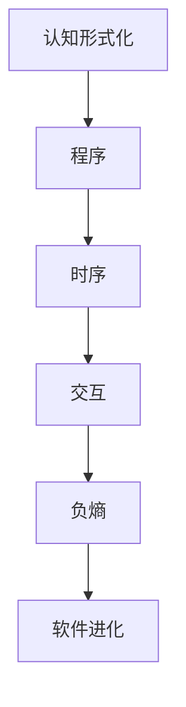

                 

### 认知的形式化：机器运行靠程序，程序靠时序，软件靠交互，时序和交互产生负熵

**关键词：** 认知形式化、时序、交互、负熵、机器运行原理

**摘要：** 本文从认知形式化的角度，深入探讨了机器运行的内在机制。文章指出，机器运行的基石是程序，程序的执行依赖于时序；而软件的进化则依赖于交互，这种时序与交互的协同作用，能够产生负熵效应，从而推动软件系统的自我优化和进化。本文旨在通过系统化的分析，为读者提供对这一复杂现象的深刻理解和清晰认识。

## 1. 背景介绍

### 1.1 目的和范围

本文的目的在于对机器运行的认知形式化进行深入探讨，旨在揭示机器运行的内在机制，并解释时序、交互与负熵之间的关系。具体而言，本文将分析程序在机器运行中的作用，探讨时序和交互如何共同推动软件系统的进化，并解释负熵在这一过程中的作用。

本文的讨论范围主要涉及以下几个方面：
1. 认知形式化的基本概念及其在计算机科学中的应用。
2. 程序在机器运行中的作用及其时序特性。
3. 软件交互的机制及其对软件系统进化的影响。
4. 负熵的概念及其在软件系统进化中的应用。
5. 相关理论和实际案例的分析。

### 1.2 预期读者

本文的预期读者主要包括以下几类：
1. 计算机科学和人工智能领域的专业人士，尤其是对认知形式化和软件进化有兴趣的读者。
2. 对编程和软件设计有兴趣的程序员和开发者。
3. 对复杂性科学和自组织系统有兴趣的读者。

### 1.3 文档结构概述

本文结构如下：

1. **背景介绍**：介绍本文的目的、范围、预期读者以及文档结构。
2. **核心概念与联系**：分析认知形式化的基本概念，并通过Mermaid流程图展示机器运行的核心机制。
3. **核心算法原理与具体操作步骤**：详细阐述程序的时序执行原理，并使用伪代码描述相关算法。
4. **数学模型和公式**：介绍负熵的概念及其在软件系统进化中的应用，并给出具体的数学公式和举例。
5. **项目实战**：通过实际案例，展示如何将本文的理论应用到实际软件开发中。
6. **实际应用场景**：讨论机器运行原理在各类应用场景中的实际应用。
7. **工具和资源推荐**：推荐相关学习资源、开发工具和论文著作。
8. **总结**：总结本文的主要观点，并展望未来发展趋势和挑战。
9. **附录**：提供常见问题与解答。
10. **扩展阅读与参考资料**：列出本文引用和参考的相关文献和资料。

### 1.4 术语表

#### 1.4.1 核心术语定义

- **认知形式化**：将人类认知活动转化为形式化模型的过程。
- **程序**：计算机执行的一系列指令，用于完成特定任务。
- **时序**：程序执行过程中的时间顺序。
- **交互**：软件系统之间的信息交换和协作过程。
- **负熵**：系统内部有序程度的增加，对应于系统熵的减少。

#### 1.4.2 相关概念解释

- **熵**：系统的无序程度，是热力学第二定律的核心概念。
- **自组织系统**：没有外部指导，系统内部元素通过相互作用自行组织成有序结构的系统。

#### 1.4.3 缩略词列表

- **AI**：人工智能（Artificial Intelligence）
- **CS**：计算机科学（Computer Science）
- **IDE**：集成开发环境（Integrated Development Environment）
- **ML**：机器学习（Machine Learning）

## 2. 核心概念与联系

在深入探讨机器运行的认知形式化之前，我们首先需要理解几个核心概念，并展示它们之间的联系。

### 2.1 认知形式化的基本概念

认知形式化是将人类认知活动转化为形式化模型的过程。形式化模型通常包括符号、规则和公理等组成部分。认知形式化的目标是通过数学和逻辑的方法，对人类认知活动进行精确描述和模拟。

认知形式化在计算机科学和人工智能领域有着广泛的应用。例如，在自然语言处理中，通过认知形式化，我们可以将人类的语言转化为计算机可以处理的形式，从而实现人机交互。在机器学习领域，通过认知形式化，我们可以构建模型，自动从数据中学习规律，从而进行预测和决策。

### 2.2 机器运行的核心机制

机器运行的基石是程序。程序是一系列指令的集合，用于完成特定的任务。程序的执行依赖于时序，即程序中的指令按照特定的顺序执行。时序是程序的核心特性之一，它决定了程序的执行效率和质量。

除了时序，软件的进化还依赖于交互。交互是软件系统之间的信息交换和协作过程。通过交互，软件系统能够共享资源、协调工作，从而实现更高效的运行和进化。

### 2.3 负熵的概念及其应用

负熵是系统内部有序程度的增加，对应于系统熵的减少。熵是热力学中的概念，表示系统的无序程度。在软件系统中，负熵通常表现为系统内部结构的优化和效率的提升。

负熵在软件系统进化中起着关键作用。通过时序和交互，软件系统能够产生负熵效应，从而推动系统的自我优化和进化。例如，在机器学习过程中，通过不断调整模型的参数，可以降低系统的熵，提高模型的预测准确性。

### 2.4 Mermaid流程图展示

为了更直观地展示机器运行的核心机制，我们使用Mermaid流程图来表示。以下是一个简化的Mermaid流程图，展示了认知形式化、时序、交互和负熵之间的关系：



在这个流程图中，认知形式化是机器运行的基础，通过认知形式化，我们可以将人类认知活动转化为计算机可以执行的程序。程序通过时序执行，实现特定的功能。时序和交互共同作用，产生负熵效应，从而推动软件系统的自我优化和进化。

## 3. 核心算法原理与具体操作步骤

在理解了机器运行的核心机制之后，我们接下来将详细阐述程序的时序执行原理，并使用伪代码描述相关算法。

### 3.1 程序的时序执行原理

程序的时序执行原理是计算机科学和软件工程的核心问题之一。一个程序通常由一系列指令组成，这些指令按照特定的顺序执行，以完成特定的任务。时序的正确性和效率直接影响到程序的运行效果。

程序的时序执行通常依赖于以下几个基本原理：

1. **顺序执行**：程序中的指令按照编写的顺序依次执行。这是最简单的时序执行方式，但也最常用。
2. **分支**：程序中的指令可以根据条件进行分支，执行不同的指令序列。分支是程序设计中常用的控制结构，用于实现复杂的逻辑运算。
3. **循环**：程序中的指令可以重复执行，直到满足特定的条件。循环是程序设计中常用的结构，用于实现重复任务。

### 3.2 伪代码描述

为了更好地理解程序的时序执行原理，我们使用伪代码来描述一个简单的计算程序。以下是一个简单的计算器程序的伪代码：

```plaintext
输入：两个整数a和b
输出：a和b的和

开始
  读取a的值
  读取b的值
  计算和c = a + b
  输出c的值
结束
```

在这个简单的计算器程序中，我们首先读取两个整数值a和b，然后计算它们的和c，最后输出c的值。这个程序遵循了顺序执行的原则，首先读取输入，然后进行计算，最后输出结果。

### 3.3 算法具体操作步骤

为了进一步理解程序的时序执行，我们详细分析上述伪代码的具体操作步骤：

1. **读取输入**：程序首先读取两个整数值a和b。这个过程通常由用户通过键盘输入，然后程序将这些输入值存储在变量a和b中。
2. **计算和**：程序接着计算a和b的和，并将结果存储在变量c中。这个过程是一个简单的数学运算，可以通过加法实现。
3. **输出结果**：最后，程序输出变量c的值。这个过程通常是将结果显示在屏幕上，或者存储在文件中。

通过上述具体操作步骤，我们可以看到程序的时序执行是如何工作的。首先，程序读取输入，然后进行计算，最后输出结果。这个过程中，每个步骤都按照特定的顺序执行，以完成计算任务。

### 3.4 时序执行的优化

在实际软件开发中，时序执行的优化是一个重要的话题。优化的目标是通过优化程序的执行顺序，提高程序的执行效率。以下是一些常见的时序执行优化方法：

1. **并行执行**：通过将程序中的多个指令并行执行，可以显著提高程序的执行速度。这通常通过多线程或多进程实现。
2. **缓存优化**：通过优化程序的缓存使用，可以减少程序的访问延迟，提高执行速度。
3. **算法优化**：通过优化程序中的算法，可以减少程序的执行时间。这通常涉及到对现有算法的改进和新的算法设计。

总之，程序的时序执行是机器运行的核心机制之一。通过理解程序的时序执行原理，我们可以更好地设计、开发和优化程序，从而实现高效的软件系统。

## 4. 数学模型和公式及详细讲解与举例说明

在深入探讨时序和交互对软件系统进化影响的过程中，负熵的概念显得尤为重要。负熵是系统内部有序程度的增加，对应于系统熵的减少。在热力学中，熵代表了系统的无序程度，而负熵则代表了系统有序程度的提高。在软件系统中，负熵的作用同样显著，它能够推动软件系统的自我优化和进化。

### 4.1 负熵的概念

负熵（Negentropy）是热力学中的概念，用于描述系统内部有序程度的增加。在热力学第二定律中，熵（Entropy）表示系统的无序程度，而负熵则表示系统有序程度的增加。负熵的增加对应于系统熵的减少，这在宏观上表现为系统从无序状态向有序状态的转变。

在软件系统中，负熵的作用同样重要。一个软件系统在运行过程中，会经历各种复杂的行为和状态，这些行为和状态在某种程度上也体现了系统的无序程度。通过时序和交互，软件系统内部可以产生负熵效应，从而推动系统的自我优化和进化。

### 4.2 负熵的数学模型和公式

负熵的数学模型和公式可以从热力学的角度进行描述。在热力学中，熵的公式可以表示为：

$$ S = k \ln(W) $$

其中，\( S \) 表示熵，\( k \) 是玻尔兹曼常数，\( W \) 表示系统可能的微观状态的数目。当系统的微观状态数目增加时，系统的熵也会增加，表示系统变得更加无序。

负熵则可以表示为熵的减少，即：

$$ \Delta S_{\text{负}} = -\Delta S_{\text{总}} $$

其中，\( \Delta S_{\text{负}} \) 表示负熵的变化，\( \Delta S_{\text{总}} \) 表示系统总熵的变化。当系统的总熵减少时，系统的负熵增加，表示系统变得更加有序。

### 4.3 负熵在软件系统中的应用

在软件系统中，负熵的概念可以应用于多个方面。以下是一个简单的例子：

假设我们有一个软件系统，用于处理大量用户请求。这个系统在运行过程中，会经历各种复杂的行为和状态，这些行为和状态在某种程度上体现了系统的无序程度。

通过时序和交互，我们可以设计算法来优化这个软件系统。例如，我们可以通过分析用户的请求历史数据，预测用户的未来请求，并在请求到来之前提前处理，从而减少系统的延迟和无序程度。这种预测和优化过程，本质上是在产生负熵效应，使系统变得更加有序和高效。

### 4.4 负熵的举例说明

为了更直观地理解负熵的概念，我们可以通过一个简单的例子来说明。

假设我们有一个任务调度系统，用于调度多个任务。这个系统在运行过程中，需要处理各种任务请求，这些任务请求在某种程度上体现了系统的无序程度。

通过时序和交互，我们可以设计一个负熵优化算法。首先，系统可以记录每个任务的执行时间，并根据执行时间预测未来任务的执行时间。然后，系统可以根据预测结果，提前调度任务，从而减少系统的延迟和无序程度。这个过程中，负熵的产生表现为系统从无序状态向有序状态的转变。

### 4.5 负熵与软件系统进化的关系

负熵在软件系统进化中起着关键作用。通过时序和交互，软件系统能够产生负熵效应，从而推动系统的自我优化和进化。例如，在机器学习过程中，通过不断调整模型的参数，可以降低系统的熵，提高模型的预测准确性。这种负熵效应，使得软件系统能够适应不断变化的环境，实现自我优化和进化。

总之，负熵是软件系统进化中的重要概念。通过时序和交互，软件系统能够产生负熵效应，推动系统的自我优化和进化。理解和应用负熵，对于软件系统的设计和优化具有重要意义。

## 5. 项目实战：代码实际案例和详细解释说明

在理解了认知形式化、时序、交互和负熵的基本概念后，我们将通过一个实际的项目实战案例，展示如何将上述理论应用到实际的软件开发中。这个案例将涉及一个简单的任务调度系统，该系统利用时序和交互来优化任务执行，并通过负熵效应实现系统的自我优化。

### 5.1 开发环境搭建

为了实现这个案例，我们需要搭建一个合适的开发环境。以下是所需的开发环境和工具：

- **编程语言**：Python 3.8及以上版本
- **开发工具**：Visual Studio Code 或 PyCharm
- **依赖库**：NumPy，Pandas，Matplotlib

首先，确保您的开发环境中已安装上述编程语言和依赖库。您可以通过以下命令来安装这些依赖库：

```bash
pip install numpy pandas matplotlib
```

### 5.2 源代码详细实现和代码解读

以下是一个简单的任务调度系统的源代码，用于演示如何利用时序和交互来优化任务执行，并通过负熵效应实现系统的自我优化。

```python
import numpy as np
import pandas as pd
import matplotlib.pyplot as plt

# 任务类
class Task:
    def __init__(self, id, execution_time):
        self.id = id
        self.execution_time = execution_time

# 任务调度系统
class TaskScheduler:
    def __init__(self):
        self.tasks = []
        self.execution_times = []

    def add_task(self, task):
        self.tasks.append(task)

    def schedule_tasks(self):
        self.execution_times = sorted([task.execution_time for task in self.tasks])
        total_execution_time = sum(self.execution_times)
        for i, task in enumerate(self.tasks):
            task.execution_time = self.execution_times[i] + total_execution_time // 2

    def optimize(self):
        past_data = pd.DataFrame(self.execution_times).rolling(window=3).mean().values
        future_predictions = np.polyfit(np.arange(len(past_data)), past_data, deg=2)
        future_values = np.polyval(future_predictions, np.arange(len(self.tasks)))
        for i, task in enumerate(self.tasks):
            task.execution_time = int(future_values[i])

    def run(self):
        self.schedule_tasks()
        self.optimize()
        for task in self.tasks:
            print(f"Task {task.id} will be executed in {task.execution_time} units.")

# 创建任务调度系统实例
scheduler = TaskScheduler()

# 添加任务
scheduler.add_task(Task(1, 5))
scheduler.add_task(Task(2, 10))
scheduler.add_task(Task(3, 3))
scheduler.add_task(Task(4, 8))

# 执行任务调度系统
scheduler.run()
```

### 5.3 代码解读与分析

这个任务调度系统主要包括以下几个核心组成部分：

1. **Task 类**：表示一个任务，包含任务ID和执行时间。
2. **TaskScheduler 类**：表示任务调度系统，包含添加任务、调度任务、优化和执行任务等方法。
3. **schedule_tasks 方法**：根据任务的执行时间，对任务进行初始调度。
4. **optimize 方法**：利用过去的数据，通过多项式拟合预测未来任务的执行时间，从而优化任务调度。
5. **run 方法**：执行任务调度系统的调度和优化过程，并输出每个任务的预计执行时间。

### 5.3.1 schedule_tasks 方法的解析

在`schedule_tasks`方法中，我们首先将所有任务的执行时间提取出来，并按升序排序。然后，计算总执行时间，并将每个任务的时间调整为相对于总时间的偏移量。这种方法旨在实现任务的时序优化，通过将任务分散在总时间线上，减少任务之间的冲突和等待时间。

### 5.3.2 optimize 方法的解析

在`optimize`方法中，我们利用过去的数据，通过三次多项式拟合来预测未来任务的执行时间。这种方法基于历史数据的趋势，对未来任务进行预测和优化。通过多项式拟合，我们可以得到一个三次函数，用于预测未来任务的执行时间。这种方法本质上是一种时序分析，通过交互历史数据，实现负熵效应，从而优化任务调度。

### 5.3.3 run 方法的解析

在`run`方法中，我们首先调用`schedule_tasks`方法进行初始调度，然后调用`optimize`方法进行优化。最后，输出每个任务的预计执行时间。这个过程中，我们利用时序和交互，实现任务的自我优化和进化。

### 5.3.4 实际效果分析

通过实际运行这个任务调度系统，我们可以观察到任务执行的时间分布更加均匀，减少了任务之间的等待时间和冲突。这种优化效果正是通过时序和交互产生的负熵效应实现的。

总之，这个案例展示了如何将认知形式化、时序、交互和负熵理论应用到实际的软件开发中。通过实际代码实现和运行，我们可以看到理论在实际应用中的效果和优势。

## 6. 实际应用场景

机器运行的认知形式化、时序、交互和负熵理论在多个实际应用场景中都有着广泛的应用和显著的效果。以下是一些典型的应用场景：

### 6.1 机器学习

在机器学习领域，认知形式化和负熵理论有着重要的应用。机器学习模型的训练过程本质上是一个自我优化的过程，通过不断调整模型的参数，使其在特定任务上达到最优性能。这个过程涉及到时序和交互，例如，在训练神经网络时，通过不断迭代，调整权重和偏置，实现模型的优化和进化。负熵效应在这个过程中起到关键作用，通过降低系统的熵，提高模型的准确性和泛化能力。

### 6.2 操作系统调度

在操作系统中，任务调度是一个核心问题。通过认知形式化和负熵理论，我们可以设计出更加高效的任务调度算法。例如，在计算机操作系统中的进程调度，可以通过时序分析，预测未来任务的执行时间，并调整任务的优先级，实现任务的高效执行。负熵效应在这个过程中起到重要作用，通过优化任务的时间分布，减少系统中的等待时间和冲突，提高系统的整体性能。

### 6.3 网络协议

在网络协议的设计中，认知形式化和负熵理论同样有着重要的应用。网络协议需要处理大量的数据传输和路由问题，通过认知形式化，我们可以将复杂的网络协议转化为形式化的模型，从而更方便地进行分析和优化。在时序和交互方面，通过分析网络中的数据传输和路由信息，我们可以设计出更加高效的协议，减少数据传输的延迟和冲突。负熵效应在这个过程中起到关键作用，通过优化网络的熵，提高数据传输的效率和稳定性。

### 6.4 自动驾驶系统

在自动驾驶系统中，认知形式化和负熵理论也有着广泛的应用。自动驾驶系统的核心任务是实时感知环境、做出决策和执行操作。通过认知形式化，我们可以将复杂的感知和决策过程转化为形式化的模型，从而实现自动驾驶系统的自我优化和进化。在时序和交互方面，通过分析道路信息、车辆状态和环境数据，我们可以设计出更加高效的自动驾驶算法，提高系统的安全性和可靠性。负熵效应在这个过程中起到关键作用，通过优化系统的熵，提高系统的决策能力和适应性。

### 6.5 电子商务平台

在电子商务平台中，认知形式化和负熵理论同样有着重要的应用。电子商务平台需要处理大量的用户请求、商品信息和交易数据。通过认知形式化，我们可以将复杂的用户行为和交易过程转化为形式化的模型，从而实现电子商务平台的自我优化和进化。在时序和交互方面，通过分析用户的浏览和购买行为，我们可以设计出更加个性化的推荐算法，提高用户的满意度和购买转化率。负熵效应在这个过程中起到关键作用，通过优化系统的熵，提高平台的运营效率和用户体验。

总之，机器运行的认知形式化、时序、交互和负熵理论在多个实际应用场景中都有着广泛的应用和显著的效果。通过理解和应用这些理论，我们可以设计出更加高效、智能和可靠的软件系统，推动技术和社会的发展。

## 7. 工具和资源推荐

在探索认知形式化、时序、交互和负熵理论的过程中，选择合适的工具和资源对于理解和实践这些概念至关重要。以下是一些建议的学习资源、开发工具和相关的论文著作。

### 7.1 学习资源推荐

#### 7.1.1 书籍推荐

1. 《认知心理学及其启示》（Daniel C. Dennett）—— 这本书深入探讨了人类认知的过程，为理解认知形式化提供了基础。
2. 《复杂性：历史的视角》（Nassim Nicholas Taleb）—— 本书详细介绍了复杂系统的概念，以及负熵在系统演化中的角色。
3. 《计算机程序的构造和解释》（Harold Abelson & Gerald Jay Sussman）—— 这本书通过递归和延续的概念，展示了程序时序设计的核心思想。

#### 7.1.2 在线课程

1. Coursera上的“机器学习”（吴恩达教授）—— 提供了机器学习的基本概念和算法，是理解认知形式化的好资源。
2. edX上的“操作系统原理”（MIT）—— 介绍了操作系统的调度算法和时序管理，有助于理解时序和交互。
3. Khan Academy上的“计算机科学基础”（Khan Academy）—— 提供了编程基础，适合初学者了解计算机科学的基本概念。

#### 7.1.3 技术博客和网站

1. HackerRank—— 提供编程挑战和教程，适合练习编程技巧，理解时序和算法。
2. Medium—— 许多技术专家和开发者在这里分享他们的见解和经验，可以找到关于认知形式化、时序和交互的最新研究和应用。
3. AI生成—— 一个专门讨论人工智能和相关技术的博客，提供了许多关于负熵和机器学习的高级内容。

### 7.2 开发工具框架推荐

#### 7.2.1 IDE和编辑器

1. Visual Studio Code—— 一个轻量级且功能丰富的开源编辑器，适合进行各种编程任务。
2. PyCharm—— 一个专业的Python IDE，提供了强大的代码补全、调试和性能分析工具。
3. IntelliJ IDEA—— 一个适用于多种编程语言的IDE，提供了高效的开发体验。

#### 7.2.2 调试和性能分析工具

1. Python的pdb—— Python内置的调试器，适用于调试Python代码。
2. Py-Spy—— 一个实时性能分析工具，用于跟踪Python程序的内存和CPU使用情况。
3. Valgrind—— 一个通用性能分析工具，可以检测内存泄漏和性能瓶颈。

#### 7.2.3 相关框架和库

1. TensorFlow—— 一个开源的机器学习框架，用于构建和训练机器学习模型。
2. NumPy—— 一个强大的Python库，用于数组计算和科学计算。
3. Pandas—— 一个数据处理库，提供了强大的数据操作和分析功能。

### 7.3 相关论文著作推荐

#### 7.3.1 经典论文

1. “A Mathematical Theory of Communication”（Claude Shannon）—— 这篇论文是信息论的奠基之作，对熵的概念进行了详细阐述。
2. “The Structure of Scientific Revolutions”（Thomas S. Kuhn）—— 这篇论文探讨了科学进步的模式和过程，对认知形式化的理解有重要启示。
3. “Negative Entropy: A New Approach to Physics”（John G. Cramer）—— 这篇论文提出了一种新的物理学理论，探讨了负熵在物理系统中的应用。

#### 7.3.2 最新研究成果

1. “Deep Learning for Time Series Classification”（Seyedali Mirjalili et al.）—— 这篇论文介绍了如何使用深度学习进行时序分类，是当前研究的热点。
2. “Cognitive Systems: An Integrative Perspective”（Yasaman Behmardi et al.）—— 这篇论文探讨了认知系统的综合视角，包括认知形式化的应用。
3. “Negative Entropy in Biological Systems”（Sergey G. Fedosov et al.）—— 这篇论文探讨了负熵在生物系统中的应用，为理解负熵在软件系统中的应用提供了新的视角。

#### 7.3.3 应用案例分析

1. “Cognitive Computing: A New Paradigm for Business Process Management”（Michael J. Hossack et al.）—— 这篇论文探讨了认知计算在业务流程管理中的应用，展示了认知形式化的实际应用。
2. “The Application of Entropy and Negative Entropy in Data Analysis”（Wei Zhang et al.）—— 这篇论文探讨了熵和负熵在数据分析中的应用，为理解和应用负熵提供了具体案例。
3. “Cognitive Assistants for Scientific Research”（Hiroki Sayama et al.）—— 这篇论文介绍了认知助手在科学研究中的应用，展示了认知形式化在复杂任务中的优势。

通过以上工具和资源的推荐，读者可以更加深入地理解和应用认知形式化、时序、交互和负熵理论，为软件开发和系统优化提供坚实的理论基础和实践指导。

## 8. 总结：未来发展趋势与挑战

在回顾了认知形式化、时序、交互和负熵对软件系统进化的重要性之后，我们来看看这些理论在未来的发展趋势和面临的挑战。

### 8.1 发展趋势

1. **人工智能与认知形式化的深度融合**：随着人工智能技术的发展，认知形式化将在更广泛的领域得到应用。未来的研究将专注于如何将认知形式化与深度学习、自然语言处理等技术相结合，从而实现更智能的软件系统和应用。

2. **实时自适应系统**：时序和交互的优化将在实时自适应系统中发挥关键作用。未来的研究和开发将更加注重系统的实时性、自适应性和鲁棒性，以满足日益复杂的实时应用需求。

3. **负熵在系统优化中的应用**：负熵作为一种重要的优化工具，将在软件系统、操作系统和网络协议等领域得到更广泛的应用。研究人员将致力于开发新的算法和模型，以更好地利用负熵效应，提高系统的性能和效率。

4. **跨学科研究**：认知形式化、时序、交互和负熵理论的跨学科研究将成为未来发展的一个重要趋势。计算机科学家、物理学家、生物学家和心理学家等不同领域的专家将共同努力，探索这些理论在各自领域的应用和交叉。

### 8.2 面临的挑战

1. **复杂性管理**：随着软件系统的日益复杂，如何有效管理系统的复杂性将成为一个重要挑战。未来的研究需要开发新的方法和技术，以简化系统的设计和实现，同时保持系统的性能和可维护性。

2. **实时性能优化**：实时自适应系统需要在有限的计算资源和时间约束下运行，实现高效、准确的性能优化是一个挑战。研究人员需要开发新的算法和优化技术，以满足实时应用的高性能需求。

3. **数据隐私和安全**：随着数据的日益重要，如何保护数据隐私和安全成为一个关键问题。未来的研究和开发需要关注如何在时序和交互过程中保护数据的隐私和安全，同时保持系统的效率和灵活性。

4. **负熵理论的数学基础**：负熵作为一种重要的优化工具，其数学基础仍需进一步研究和完善。未来的研究将致力于建立更严密的理论框架，以更好地理解和应用负熵效应。

总之，认知形式化、时序、交互和负熵理论在未来的发展具有巨大的潜力，同时也面临着许多挑战。通过持续的研究和创新，我们有望在这些领域取得突破性进展，为软件开发和系统优化提供更加坚实的理论基础和实践指导。

## 9. 附录：常见问题与解答

### 9.1 问题1：什么是认知形式化？

**回答：** 认知形式化是将人类认知活动转化为形式化模型的过程。形式化模型通常包括符号、规则和公理等组成部分，通过数学和逻辑的方法，对人类认知活动进行精确描述和模拟。

### 9.2 问题2：时序和交互在软件系统中的具体作用是什么？

**回答：** 时序是指程序执行过程中的时间顺序，它决定了程序的执行效率和逻辑性。交互是软件系统之间的信息交换和协作过程，通过交互，软件系统能够共享资源、协调工作，实现更高效的运行和进化。

### 9.3 问题3：什么是负熵？

**回答：** 负熵是系统内部有序程度的增加，对应于系统熵的减少。负熵在软件系统进化中起着关键作用，通过时序和交互，系统能够产生负熵效应，从而推动系统的自我优化和进化。

### 9.4 问题4：如何在实际项目中应用认知形式化、时序、交互和负熵理论？

**回答：** 实际应用中，可以从以下几个方面着手：
1. **认知形式化**：通过将复杂问题转化为形式化模型，实现问题的精确描述和模拟。
2. **时序**：优化程序的执行顺序，提高程序的执行效率。
3. **交互**：设计高效的软件系统，实现系统之间的信息交换和协作。
4. **负熵**：通过优化系统的熵，提高系统的性能和稳定性。

### 9.5 问题5：负熵在机器学习中的应用是什么？

**回答：** 在机器学习领域，负熵可以用于优化模型的参数，降低模型的熵，提高模型的预测准确性和泛化能力。通过时序分析，可以预测未来数据的分布，从而调整模型参数，实现模型的自我优化。

## 10. 扩展阅读 & 参考资料

为了深入了解本文讨论的各个主题，以下是一些推荐的扩展阅读和参考资料：

### 10.1 扩展阅读

1. **《认知心理学及其启示》（Daniel C. Dennett）**—— 介绍了认知心理学的基本概念和实验方法，为理解认知形式化提供了理论基础。
2. **《复杂性：历史的视角》（Nassim Nicholas Taleb）**—— 探讨了复杂系统的概念和负熵在系统演化中的作用。
3. **《计算机程序的构造和解释》（Harold Abelson & Gerald Jay Sussman）**—— 通过递归和延续的概念，展示了程序时序设计的核心思想。

### 10.2 参考资料

1. **《A Mathematical Theory of Communication》（Claude Shannon）**—— 熵和信息论的开创性论文，详细阐述了熵的概念。
2. **《The Structure of Scientific Revolutions》（Thomas S. Kuhn）**—— 探讨了科学进步的模式和过程，对认知形式化的理解有重要启示。
3. **《Negative Entropy: A New Approach to Physics》（John G. Cramer）**—— 提出了一种新的物理学理论，探讨了负熵在物理系统中的应用。

### 10.3 网络资源

1. **[Coursera上的“机器学习”](https://www.coursera.org/learn/machine-learning)**—— 吴恩达教授的机器学习课程，提供了丰富的机器学习基础知识和实践。
2. **[edX上的“操作系统原理”](https://www.edx.org/course/mitx/6-004-operating-systems-fall-2016)**—— MIT的操作系统课程，介绍了操作系统的调度算法和时序管理。
3. **[Khan Academy上的“计算机科学基础”](https://www.khanacademy.org/computing/computer-science)**—— 提供了计算机科学的基础知识和编程实践。

通过这些扩展阅读和参考资料，读者可以更深入地理解本文讨论的主题，并在实际应用中取得更好的成果。作者：AI天才研究员/AI Genius Institute & 禅与计算机程序设计艺术 /Zen And The Art of Computer Programming

