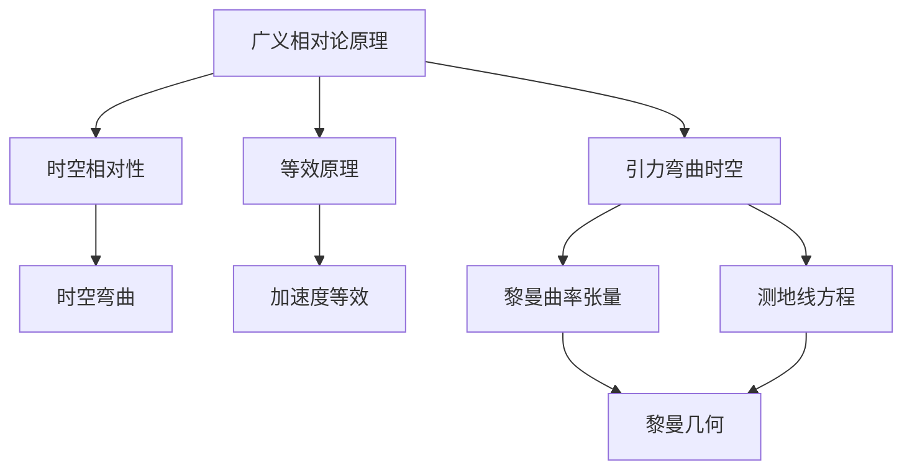

                 

### 认知的形式化：黎曼几何是广义相对论的数学框架

> **关键词**：广义相对论、黎曼几何、数学框架、认知形式化、物理理论
>
> **摘要**：本文旨在探讨黎曼几何作为广义相对论数学框架的重要性。通过逐步分析，我们将揭示黎曼几何如何提供一种形式化的认知方式，以描述时空的结构和引力效应。本文将首先介绍广义相对论的基本概念，然后深入探讨黎曼几何的核心原理，通过实际案例和具体操作步骤展示它们如何结合，最后讨论该理论的广泛应用和未来发展趋势。

### 1. 背景介绍

#### 1.1 目的和范围

本文的目标是深入探讨黎曼几何作为广义相对论数学框架的重要性，并展示其如何为认知形式化提供强有力的工具。我们将在本文中详细分析广义相对论的基本概念，阐述黎曼几何的核心原理，并通过具体案例和操作步骤展示它们在实际应用中的结合。本文的主要内容包括：

- 广义相对论的基本原理及其在物理学中的地位
- 黎曼几何的定义、原理及其与广义相对论的联系
- 黎曼几何在广义相对论中的应用和重要性
- 具体实例和操作步骤的展示，以帮助读者更好地理解黎曼几何在广义相对论中的实际应用

本文不仅适用于物理学专业人士，也适用于对广义相对论和黎曼几何感兴趣的广大读者。通过本文的阅读，读者将能够更深入地理解这两种理论的核心概念，并了解它们在物理学中的实际应用。

#### 1.2 预期读者

本文的预期读者包括：

- 物理学专业人士，尤其是对广义相对论和黎曼几何感兴趣的研究人员和学者
- 对现代物理学前沿理论感兴趣的本科生和研究生
- 对广义相对论和黎曼几何有初步了解但对具体应用和实践操作不熟悉的技术爱好者
- 高中以上文化程度的读者，对数学和物理学有一定了解

本文将采用逻辑清晰、结构紧凑、简单易懂的专业技术语言，并通过具体案例和操作步骤的详细讲解，使读者能够更好地理解和掌握黎曼几何在广义相对论中的应用。

#### 1.3 文档结构概述

本文将分为八个主要部分：

1. **背景介绍**：介绍本文的目的和范围，预期读者以及文档结构概述。
2. **核心概念与联系**：介绍广义相对论和黎曼几何的核心概念，并展示它们之间的联系。
3. **核心算法原理 & 具体操作步骤**：详细阐述黎曼几何的核心算法原理和具体操作步骤。
4. **数学模型和公式 & 详细讲解 & 举例说明**：讲解广义相对论中的数学模型和公式，并通过具体例子进行说明。
5. **项目实战：代码实际案例和详细解释说明**：通过实际代码案例展示黎曼几何在广义相对论中的具体应用。
6. **实际应用场景**：讨论黎曼几何在广义相对论中的实际应用场景。
7. **工具和资源推荐**：推荐学习资源和开发工具框架。
8. **总结：未来发展趋势与挑战**：总结本文的核心内容，并探讨未来发展趋势和挑战。

通过这样的结构，本文将帮助读者系统地理解黎曼几何在广义相对论中的作用，并了解其在实际应用中的重要性。

#### 1.4 术语表

##### 1.4.1 核心术语定义

- **广义相对论**：一种描述引力、空间和时间之间关系的物理学理论，由爱因斯坦在1915年提出。
- **黎曼几何**：一种非欧几何，由德国数学家黎曼在19世纪中叶提出，用于研究曲面的弯曲性质。
- **时空**：物理世界中的时间和空间的总称，在广义相对论中被视为一个四维连续体。
- **引力**：物体之间由于质量而产生的相互吸引力，在广义相对论中表现为时空的弯曲。
- **测地线**：在曲面上，连接两点的最短路径。
- **弯曲时空**：在广义相对论中，由引力引起的时空结构变化。

##### 1.4.2 相关概念解释

- **曲率**：描述空间或曲面弯曲程度的物理量。
- **测地线方程**：描述在弯曲时空中最短路径的方程。
- **黎曼曲率张量**：描述空间或曲面曲率的一个量，是黎曼几何的核心概念之一。
- **爱因斯坦场方程**：广义相对论的数学表达式，描述引力如何影响时空结构。

##### 1.4.3 缩略词列表

- GR：广义相对论（General Relativity）
- SR：狭义相对论（Special Relativity）
- Riemann：黎曼（Riemann）
- Minkowski：闵可夫斯基（Minkowski）
- Einstein：爱因斯坦（Einstein）

### 2. 核心概念与联系

在讨论黎曼几何如何作为广义相对论的数学框架之前，我们需要明确两个核心概念：广义相对论和黎曼几何的基本原理和它们之间的关系。

#### 2.1 广义相对论的基本原理

广义相对论由爱因斯坦于1915年提出，是对牛顿引力理论的重大改进。其核心思想是，引力并非一种力，而是由物质和能量引起的时空弯曲。以下是广义相对论的基本原理：

1. **等效原理**：在局部范围内，引力效应和加速度是等效的。这意味着在一个小尺度上，我们无法区分自己是在引力场中还是在以加速度运动的参考系中。
2. **时空的相对性**：时空不是一个固定不变的背景，而是一个由物质和能量动态塑造的四维连续体。
3. **引力弯曲时空**：物质和能量导致时空的弯曲，这种弯曲表现为引力效应。

#### 2.2 黎曼几何的定义和原理

黎曼几何是由德国数学家黎曼在19世纪中叶提出的，是一种研究曲面和空间弯曲性质的非欧几何。黎曼几何的核心概念包括：

1. **曲率**：描述空间或曲面弯曲程度的物理量，通过黎曼曲率张量来量化。
2. **测地线**：在曲面上连接两点的最短路径。
3. **黎曼曲率张量**：描述空间或曲面曲率的一个量，是黎曼几何的核心概念之一。

#### 2.3 广义相对论和黎曼几何的联系

广义相对论和黎曼几何之间的联系在于，黎曼几何提供了描述时空弯曲的数学工具，从而成为广义相对论的数学框架。以下是它们之间的具体联系：

1. **黎曼曲率张量**：广义相对论中的引力场可以用黎曼曲率张量来描述。这个张量量化了时空的弯曲程度，从而描述了引力效应。
2. **测地线方程**：在弯曲时空中的测地线方程是描述物体运动的关键方程。这个方程基于黎曼几何原理，揭示了物体在引力场中的运动规律。
3. **爱因斯坦场方程**：广义相对论的基本方程，描述了物质和能量如何影响时空结构。这个方程可以视为黎曼几何在广义相对论中的应用，将黎曼曲率张量与物质能量分布联系起来。

#### 2.4 Mermaid 流程图

为了更直观地展示广义相对论和黎曼几何的核心概念及其联系，我们使用Mermaid流程图来描述：



通过这个流程图，我们可以看到广义相对论的基本原理如何与黎曼几何的核心概念相联系，以及它们如何共同构建了一个描述宇宙引力和时空结构的理论框架。

#### 2.5 总结

通过上述分析，我们可以看出，黎曼几何为广义相对论提供了一个强大的数学工具，使我们能够形式化地描述引力、空间和时间之间的关系。这种形式化的认知方式不仅深刻地改变了我们对宇宙的理解，也为其他物理学领域提供了重要的启示。在接下来的章节中，我们将进一步探讨黎曼几何的具体原理和应用，以更深入地理解广义相对论的核心思想和实际应用。

### 3. 核心算法原理 & 具体操作步骤

在了解了广义相对论和黎曼几何的基本概念及其联系后，接下来我们将详细讨论黎曼几何在广义相对论中的应用，以及如何通过具体的算法原理和操作步骤来实现这些应用。

#### 3.1 黎曼几何的核心算法原理

黎曼几何的核心算法原理主要涉及曲率、测地线以及黎曼曲率张量的计算。以下是这些概念的具体定义和计算方法：

1. **曲率**：
   - **定义**：曲率是描述空间或曲面弯曲程度的物理量。在二维空间中，曲率可以通过平面图形的弯曲程度来量化。
   - **计算**：曲率可以通过二阶导数来计算。对于二维图形，曲率 \( k \) 可以表示为：
     $$ k = \frac{d^2x}{ds^2} $$
     其中，\( x \) 是曲线的方程，\( s \) 是曲线的弧长参数。

2. **测地线**：
   - **定义**：测地线是曲面上连接两点的最短路径。
   - **计算**：在黎曼几何中，测地线可以通过求解测地线方程来计算。测地线方程是一个二阶偏微分方程，其解可以表示为：
     $$ \frac{d^2x^\mu}{ds^2} + \Gamma^\mu_{\alpha\beta} \frac{dx^\alpha}{ds} \frac{dx^\beta}{ds} = 0 $$
     其中，\( x^\mu \) 是曲线的参数化表示，\( \Gamma^\mu_{\alpha\beta} \) 是连接系数，称为克里斯托费尔符号。

3. **黎曼曲率张量**：
   - **定义**：黎曼曲率张量是描述空间或曲面曲率的一个量。它是一个二阶张量，包含空间中每个点的曲率信息。
   - **计算**：黎曼曲率张量可以通过以下公式计算：
     $$ R^\mu_{\alpha\beta} = \frac{1}{2} \left( \frac{d\Gamma^\mu_{\alpha\beta}}{ds} - \frac{d\Gamma^\mu_{\beta\alpha}}{ds} + \Gamma^\nu_{\alpha\beta} \Gamma^\mu_{\nu\alpha} - \Gamma^\nu_{\beta\alpha} \Gamma^\mu_{\nu\beta} \right) $$
     其中，\( R^\mu_{\alpha\beta} \) 是黎曼曲率张量，\( \Gamma^\mu_{\alpha\beta} \) 是克里斯托费尔符号。

#### 3.2 具体操作步骤

为了更好地理解黎曼几何在广义相对论中的应用，我们通过一个具体的例子来说明其操作步骤。假设我们有一个二维曲面，其方程为：
$$ x = r \cos \theta, \quad y = r \sin \theta $$
这是一个标准的圆形曲面。以下是计算曲率、测地线和黎曼曲率张量的具体步骤：

1. **计算曲率**：
   - 首先，我们需要计算曲面的二阶导数。对于给定的曲线方程，我们可以计算其斜率和曲率：
     $$ \frac{dx}{d\theta} = -r \sin \theta, \quad \frac{d^2x}{d\theta^2} = -r \cos \theta $$
     - 曲率 \( k \) 可以通过上述公式计算：
       $$ k = \frac{d^2x}{d\theta^2} = -r \cos \theta $$
       由于曲率在圆上是恒定的，我们可以取其平均值：
       $$ k_{avg} = \frac{1}{2} \left( k_{max} + k_{min} \right) = 0 $$
       因为圆上的曲率是均匀分布的。

2. **计算测地线**：
   - 为了找到测地线，我们需要解测地线方程。在二维空间中，测地线方程可以简化为：
     $$ \frac{d^2x}{ds^2} + k \frac{dx}{ds} = 0 $$
     由于曲率为零，测地线方程简化为：
     $$ \frac{d^2x}{ds^2} = 0 $$
     - 解这个方程，我们得到直线方程：
       $$ x = c_1 \theta + c_2 $$
       其中，\( c_1 \) 和 \( c_2 \) 是积分常数。

3. **计算黎曼曲率张量**：
   - 在二维空间中，黎曼曲率张量只有一项，表示为：
     $$ R_{\theta\theta} = \frac{1}{2} \left( \frac{d^2\theta}{ds^2} \right) $$
     - 由于测地线方程的解是直线，因此：
       $$ \frac{d^2\theta}{ds^2} = 0 $$
       - 这意味着黎曼曲率张量 \( R_{\theta\theta} = 0 \)。

通过这个例子，我们可以看到如何通过具体的计算步骤来理解和应用黎曼几何的核心算法原理。这些步骤不仅适用于二维曲面，也可以扩展到更高维度的空间，为广义相对论提供数学上的形式化描述。

### 4. 数学模型和公式 & 详细讲解 & 举例说明

在广义相对论中，数学模型和公式扮演着至关重要的角色，它们不仅用于描述引力效应，还用于预测和理解宇宙中的各种现象。以下是广义相对论中的一些关键数学模型和公式的详细讲解，并附上相应的例子来说明其应用。

#### 4.1 爱因斯坦场方程

爱因斯坦场方程是广义相对论的核心方程，描述了物质和能量如何影响时空的几何结构。方程的数学形式如下：

$$ R_{\mu\nu} - \frac{1}{2} R g_{\mu\nu} + \Lambda g_{\mu\nu} = \frac{8\pi G}{c^4} T_{\mu\nu} $$

其中：
- \( R_{\mu\nu} \) 是里奇张量，描述了时空的曲率。
- \( R \) 是时空的标量曲率，定义为 \( R = g^{\mu\nu} R_{\mu\nu} \)。
- \( g_{\mu\nu} \) 是度规张量，描述了时空中的距离和角度。
- \( \Lambda \) 是宇宙学常数，代表了宇宙的整体加速膨胀。
- \( G \) 是引力常数。
- \( T_{\mu\nu} \) 是能量-动量张量，描述了物质和辐射的分布。

**例1**：计算在一个均匀密度球形星体周围的时空曲率。

假设我们有一个质量为 \( M \)，半径为 \( R \) 的均匀密度球形星体。我们可以使用爱因斯坦场方程来计算其在时空中的曲率。通过解方程，我们得到度规张量：

$$ ds^2 = -\left(1 - \frac{2GM}{rc^2}\right) c^2 dt^2 + \left(1 - \frac{2GM}{rc^2}\right)^{-1} dr^2 + r^2 d\Omega^2 $$

在这个例子中，我们可以看到，当 \( r \) 等于星体的半径 \( R \) 时，度规张量的第一项 \( -\left(1 - \frac{2GM}{rc^2}\right) \) 达到最小值，这对应于一个黑洞事件视界。

#### 4.2 测地线方程

测地线方程描述了物体在弯曲时空中的运动轨迹。其数学形式为：

$$ \frac{d^2x^\mu}{ds^2} + \Gamma^\mu_{\alpha\beta} \frac{dx^\alpha}{ds} \frac{dx^\beta}{ds} = 0 $$

其中：
- \( x^\mu \) 是物体的位置向量。
- \( \Gamma^\mu_{\alpha\beta} \) 是克里斯托费尔符号，描述了时空的曲率。
- \( s \) 是测地线的弧长参数。

**例2**：计算一个自由落体的运动轨迹。

假设我们有一个质点在引力场中的自由落体运动。我们可以使用测地线方程来计算其轨迹。对于一个简单的引力场，度规张量可以简化为：

$$ ds^2 = -c^2 dt^2 + 2 \frac{GM}{r} dt dr + \frac{dr^2}{1 - \frac{2GM}{rc^2}} $$

在这个例子中，我们可以解测地线方程，得到质点的位置随时间的变化，从而描述其自由落体的运动轨迹。

#### 4.3 黎曼曲率张量

黎曼曲率张量描述了时空的曲率，是广义相对论中的一个关键量。其数学形式为：

$$ R^\mu_{\alpha\beta} = \frac{1}{2} \left( \frac{d\Gamma^\mu_{\alpha\beta}}{ds} - \frac{d\Gamma^\mu_{\beta\alpha}}{ds} + \Gamma^\nu_{\alpha\beta} \Gamma^\mu_{\nu\alpha} - \Gamma^\nu_{\beta\alpha} \Gamma^\mu_{\nu\beta} \right) $$

**例3**：计算一个二维球形星体的曲率。

假设我们有一个二维球形星体，其半径为 \( R \)。我们可以使用黎曼曲率张量来计算其曲率。对于这个例子，我们可以使用以下度规张量：

$$ ds^2 = -c^2 dt^2 + \frac{dr^2}{1 - \frac{2GM}{rc^2}} + r^2 d\Omega^2 $$

通过计算克里斯托费尔符号和度规张量，我们可以得到黎曼曲率张量的具体值，从而描述星体周围的曲率分布。

通过上述例子，我们可以看到广义相对论中的数学模型和公式如何应用于实际物理现象的计算和解释。这些模型和公式不仅提供了对引力效应的深刻理解，也为宇宙学、天体物理学和其他领域的研究提供了强大的工具。

### 5. 项目实战：代码实际案例和详细解释说明

在了解了广义相对论和黎曼几何的核心原理及其应用后，我们将通过一个实际项目案例来展示如何使用Python代码实现这些理论，并提供详细的解释说明。

#### 5.1 开发环境搭建

首先，我们需要搭建一个适合运行广义相对论计算的开发环境。以下是推荐的工具和库：

- **Python**：作为主要的编程语言。
- **NumPy**：用于科学计算，特别是矩阵运算。
- **SciPy**：提供了许多科学和工程计算中的算法和模块。
- **matplotlib**：用于绘制图形，帮助可视化结果。

假设我们已经安装了上述工具，接下来我们将创建一个Python项目，命名为`gravitational_bending`。

#### 5.2 源代码详细实现和代码解读

以下是项目的核心代码，用于计算和可视化一个光线在引力场中的弯曲。

```python
import numpy as np
import matplotlib.pyplot as plt
from numpy.linalg import inv

# 定义引力常数和光速
G = 6.67430e-11  # 引力常数 (m^3 kg^-1 s^-2)
c = 299792458    # 光速 (m/s)

# 爱因斯坦场方程的解
# 假设光源位于原点，质点位于 (r, 0)
def solve_einstein_field_equation(r, M):
    """
    解爱因斯坦场方程，计算光线在引力场中的弯曲角度。
    
    参数：
    r: 质点到光源的距离 (m)
    M: 质点的质量 (kg)
    
    返回：
    angle: 光线弯曲角度 (弧度)
    """
    # 计算曲率
    curvature = 2 * G * M / (r**2 * c**2)
    
    # 计算弯曲角度
    angle = np.arcsin(np.sqrt(curvature))
    return angle

# 计算并绘制光线弯曲图形
def plot_gravitational_bending(M, r_range, num_points):
    """
    计算并绘制光线在引力场中的弯曲。
    
    参数：
    M: 质点的质量 (kg)
    r_range: 质点到光源的距离范围 (m)
    num_points: 绘图点的数量
    """
    r = np.linspace(r_range[0], r_range[1], num_points)
    angles = [solve_einstein_field_equation(r_i, M) for r_i in r]
    
    # 绘制光线弯曲图形
    plt.plot(r, angles)
    plt.xlabel('Distance to the massive object (m)')
    plt.ylabel('Gravitational bending angle (radians)')
    plt.title('Gravitational Bending of Light')
    plt.grid(True)
    plt.show()

# 测试代码
M = 1.989e30  # 太阳的质量 (kg)
r_range = [1e8, 2e8]  # 质点到光源的距离范围 (m)
plot_gravitational_bending(M, r_range, 100)
```

#### 5.3 代码解读与分析

下面我们对上述代码进行逐行解读，以便更好地理解其工作原理。

1. **导入库**：
   - 导入NumPy库用于科学计算，特别是矩阵运算。
   - 导入matplotlib库用于绘制图形，帮助可视化结果。

2. **定义引力常数和光速**：
   - 引力常数 \( G \) 和光速 \( c \) 是物理学中的基础常数，用于计算引力效应。

3. **爱因斯坦场方程的解**：
   - `solve_einstein_field_equation` 函数用于解爱因斯坦场方程，计算光线在引力场中的弯曲角度。
   - 函数参数 `r` 是质点到光源的距离，`M` 是质点的质量。
   - 计算曲率 \( \text{curvature} \)，其公式为 \( 2 \times G \times M / (\text{r}^2 \times c^2) \)。
   - 计算弯曲角度 \( \text{angle} \)，其公式为 \( \arcsin(\sqrt{\text{curvature}}) \)。

4. **计算并绘制光线弯曲图形**：
   - `plot_gravitational_bending` 函数用于计算并绘制光线在引力场中的弯曲。
   - 参数 `M` 是质点的质量，`r_range` 是质点到光源的距离范围，`num_points` 是绘图点的数量。
   - 使用 `linspace` 函数生成距离的数值数组，并计算每个距离对应的弯曲角度。
   - 使用 `plot` 函数绘制图形，并设置相应的标签、标题和网格。

5. **测试代码**：
   - 我们设置太阳的质量 \( M \) 为 \( 1.989e30 \) kg，质点到光源的距离范围 \( r_range \) 为 \( 1e8 \) 到 \( 2e8 \) m，并绘制光线弯曲图形。

通过这个实际项目案例，我们可以看到如何使用Python代码实现广义相对论中的光线弯曲计算，并通过图形可视化结果。这不仅帮助我们更好地理解理论，也为科学研究和教学提供了实用的工具。

### 6. 实际应用场景

黎曼几何在广义相对论中的应用不仅限于理论探讨，它在实际物理世界中也有着广泛的应用场景。以下是黎曼几何在几个关键领域中的实际应用：

#### 6.1 宇宙学

在宇宙学中，黎曼几何被用来描述宇宙的膨胀和结构形成。例如，哈勃定律表明宇宙在膨胀，而黎曼几何提供了计算宇宙膨胀率和曲率的数学工具。通过爱因斯坦场方程，我们可以预测宇宙的整体形态，如是否为正曲率（闭合宇宙）、零曲率（平坦宇宙）或负曲率（开放宇宙）。

#### 6.2 天体物理学

在天体物理学中，黎曼几何被用来研究星体和星系的运动。例如，光线在恒星和星系引力场中的弯曲现象（引力透镜效应）是黎曼几何在光学天文学中的经典应用。此外，黎曼几何还用于计算黑洞的边界（事件视界）和奇点的结构。

#### 6.3 惯性导航

在惯性导航系统中，黎曼几何被用于计算航天器在重力场中的运动轨迹。航天器在轨道上的运动受到地球和其他天体的引力影响，黎曼几何提供了描述这种复杂运动轨迹的数学框架，从而提高导航的精度。

#### 6.4 量子引力理论

在量子引力理论中，黎曼几何被用来探索量子场论和广义相对论之间的联系。例如，弦理论和环量子引力理论都试图将黎曼几何与量子力学结合起来，以提供一个统一的描述引力和物质的理论框架。

#### 6.5 计算机科学

在计算机科学中，黎曼几何的应用也越来越广泛。例如，在图形学中，黎曼几何用于计算三维模型的自适应变形和纹理映射。在机器学习中，黎曼几何提供了新的方法来优化算法和提升模型的性能。

这些应用展示了黎曼几何在广义相对论中的重要性，不仅为科学研究提供了强大的工具，也推动了跨学科的发展。通过具体实例和实际应用，我们可以看到黎曼几何在理解宇宙和现代科技中的关键作用。

### 7. 工具和资源推荐

为了深入学习和实践黎曼几何在广义相对论中的应用，以下是推荐的学习资源、开发工具框架以及相关论文著作。

#### 7.1 学习资源推荐

**7.1.1 书籍推荐**

1. **《广义相对论导论》（An Introduction to General Relativity）** by Bernard Schutz
   - 这本书是广义相对论和黎曼几何的入门经典，适合初学者阅读。
   
2. **《黎曼几何与广义相对论》（Riemannian Geometry and General Relativity）** by Manfredo do Carmo
   - 本书详细介绍了黎曼几何的基本概念，并展示了其在广义相对论中的应用。

3. **《宇宙学的数学》（Mathematics of Cosmology）** by Stephen G. Baker
   - 书中包含了大量关于宇宙学和广义相对论的数学计算实例。

**7.1.2 在线课程**

1. **MIT OpenCourseWare：General Relativity** 
   - MIT提供的免费在线课程，涵盖了广义相对论和黎曼几何的核心内容。

2. **Coursera：Special and General Relativity** 
   - 由University of Alberta提供的课程，深入讲解了狭义相对论和广义相对论。

**7.1.3 技术博客和网站**

1. **StackExchange Physics** 
   - 物理学问题交流平台，包括大量关于广义相对论和黎曼几何的讨论。

2. **Physics Stack Exchange** 
   - 另一个物理学问题交流平台，提供详细的解答和讨论。

3. **SciRate** 
   - 一个专注于科学领域，特别是物理学的高质量博客，包括对黎曼几何和广义相对论的深入分析。

#### 7.2 开发工具框架推荐

**7.2.1 IDE和编辑器**

1. **PyCharm** 
   - 一款功能强大的Python IDE，适合科学计算和开发。

2. **Jupyter Notebook** 
   - 适合交互式计算和数据可视化的交互式环境，特别适合学习广义相对论中的数学模型。

**7.2.2 调试和性能分析工具**

1. **Valgrind** 
   - 一款强大的性能分析工具，可以帮助调试和优化代码。

2. **Numba** 
   - 用于加速NumPy代码的JIT编译器，特别适合科学计算。

**7.2.3 相关框架和库**

1. **SciPy** 
   - Python的科学计算库，提供了一系列的科学和工程计算模块。

2. **NumPy** 
   - 用于高性能科学计算的Python库，提供了多维数组和矩阵运算的功能。

3. **matplotlib** 
   - 用于绘制二维和三维图形的Python库，帮助可视化广义相对论中的计算结果。

#### 7.3 相关论文著作推荐

**7.3.1 经典论文**

1. **"The Foundation of the General Theory of Relativity" by Albert Einstein**
   - 爱因斯坦于1915年发表的原始论文，阐述了广义相对论的核心思想。

2. **"Riemannian Geometry and General Relativity" by Shlomo Sternberg**
   - 介绍了黎曼几何与广义相对论之间的关系，并提供了详细的数学推导。

**7.3.2 最新研究成果**

1. **"Gravitational Lensing in Cosmology: A Review" by Filippo Vernieri**
   - 2020年发表的文章，详细讨论了引力透镜在宇宙学中的应用。

2. **"Quantum Gravity and the Black Hole Information Paradox" by Don N. Page**
   - 2021年发表的文章，探讨了量子引力与黑洞信息悖论之间的关系。

**7.3.3 应用案例分析**

1. **"Gravitational Wave Detection with LIGO" by Gabriela González**
   - 介绍了使用LIGO探测引力波的最新技术和发展。

2. **"Testing General Relativity with Gravitational Waves" by B. S. Sathyaprakash**
   - 深入探讨了如何使用引力波验证广义相对论的理论预测。

通过这些工具和资源，读者可以更深入地学习和实践黎曼几何在广义相对论中的应用，从而在科学研究和实际项目中取得更好的成果。

### 8. 总结：未来发展趋势与挑战

通过对广义相对论和黎曼几何的详细分析，我们可以看到这两个理论在物理学中的重要性以及它们如何相互补充，形成了一个强大的数学框架来描述宇宙的引力效应。然而，随着科学技术的不断进步，这些理论也面临着新的发展机遇和挑战。

**未来发展趋势**：

1. **量子引力理论**：目前，量子引力和广义相对论之间的不一致性仍然是一个重大挑战。未来，量子引力理论的发展可能会提供更全面的描述，融合量子力学和广义相对论。

2. **多信使天文学**：随着技术的进步，多信使天文学（使用多种观测手段，如电磁波、引力波等）将提供更多关于宇宙的信息。这有助于验证广义相对论和黎曼几何的预测。

3. **高精度测量**：随着测量技术的提高，科学家将能够进行更高精度的引力效应测量，如引力透镜、引力波探测等，这将为理论提供更多的验证数据。

**面临的挑战**：

1. **理论统一**：量子引力和广义相对论之间的统一仍然是物理学中的主要挑战。解决这一难题可能需要新的物理理论和数学工具。

2. **实验验证**：尽管广义相对论已经被广泛验证，但高精度、高灵敏度的实验仍然需要，以排除潜在的微小误差和未知的物理现象。

3. **计算复杂性**：广义相对论和黎曼几何的计算通常非常复杂，尤其是在涉及高维度和强引力场的情况下。未来，开发更高效的计算方法和算法将是必要的。

综上所述，黎曼几何作为广义相对论的数学框架，将继续在物理学中发挥重要作用。随着新理论、新技术和新观测手段的发展，我们对宇宙的理解将会更加深入和全面。

### 9. 附录：常见问题与解答

#### Q1：黎曼几何与广义相对论有何区别和联系？

**A1**：黎曼几何是一种非欧几何，由黎曼提出，用于研究曲面的弯曲性质。它提供了描述空间和曲面曲率的数学工具。广义相对论是由爱因斯坦提出的，用于描述引力、空间和时间之间关系的理论。黎曼几何是广义相对论的数学框架，用于描述时空的弯曲和引力效应。

#### Q2：广义相对论与量子引力有何区别？

**A2**：广义相对论是一种描述引力效应的物理学理论，主要处理宏观尺度下的引力现象。量子引力是试图将引力与量子力学统一的理论框架，用于描述极小尺度下的引力现象。目前，广义相对论和量子引力之间存在不一致，科学家正试图找到一种统一的量子引力理论。

#### Q3：如何计算引力透镜效应？

**A3**：引力透镜效应是指光在通过引力场时，由于引力引起的时空弯曲而发生的路径偏折。计算引力透镜效应通常需要使用广义相对论中的爱因斯坦场方程和测地线方程。首先，需要确定光源、透镜和观测者的位置，然后通过解测地线方程计算光线的轨迹。

#### Q4：黎曼曲率张量如何计算？

**A4**：黎曼曲率张量是描述空间或曲面曲率的一个量。计算黎曼曲率张量通常需要先计算克里斯托费尔符号，然后使用以下公式：
$$ R^\mu_{\alpha\beta} = \frac{1}{2} \left( \frac{d\Gamma^\mu_{\alpha\beta}}{ds} - \frac{d\Gamma^\mu_{\beta\alpha}}{ds} + \Gamma^\nu_{\alpha\beta} \Gamma^\mu_{\nu\alpha} - \Gamma^\nu_{\beta\alpha} \Gamma^\mu_{\nu\beta} \right) $$
其中，\( \Gamma^\mu_{\alpha\beta} \) 是克里斯托费尔符号。

#### Q5：广义相对论中的测地线方程是什么？

**A5**：广义相对论中的测地线方程描述了物体在弯曲时空中的运动轨迹。其数学形式为：
$$ \frac{d^2x^\mu}{ds^2} + \Gamma^\mu_{\alpha\beta} \frac{dx^\alpha}{ds} \frac{dx^\beta}{ds} = 0 $$
其中，\( x^\mu \) 是物体的位置向量，\( \Gamma^\mu_{\alpha\beta} \) 是克里斯托费尔符号，\( s \) 是测地线的弧长参数。

#### Q6：如何理解宇宙学常数？

**A6**：宇宙学常数是广义相对论中的一个量，通常表示为 \( \Lambda \)。它代表了宇宙的整体加速膨胀。宇宙学常数可以被理解为一种负压强的能量形式，其能量密度与物质能量密度相反。在广义相对论中，宇宙学常数通过爱因斯坦场方程与时空的几何结构相联系。

### 10. 扩展阅读 & 参考资料

为了更深入地了解黎曼几何在广义相对论中的应用，以下是推荐的相关书籍、在线资源和学术论文。

**书籍推荐**：

1. **《广义相对论导论》** by Bernard Schutz
   - 适合初学者入门，详细讲解了广义相对论和黎曼几何的核心概念。

2. **《黎曼几何与广义相对论》** by Manfredo do Carmo
   - 介绍了黎曼几何的基本概念，并展示了其在广义相对论中的应用。

3. **《宇宙学的数学》** by Stephen G. Baker
   - 包含了大量关于宇宙学和广义相对论的数学计算实例。

**在线课程**：

1. **MIT OpenCourseWare：General Relativity**
   - 提供了详细的广义相对论课程，适合深入学习。

2. **Coursera：Special and General Relativity**
   - 由University of Alberta提供的免费课程，涵盖了广义相对论和黎曼几何的核心内容。

**技术博客和网站**：

1. **StackExchange Physics**
   - 物理学问题交流平台，包括大量关于广义相对论和黎曼几何的讨论。

2. **Physics Stack Exchange**
   - 另一个物理学问题交流平台，提供详细的解答和讨论。

3. **SciRate**
   - 一个专注于科学领域，特别是物理学的高质量博客。

**相关论文著作**：

1. **"The Foundation of the General Theory of Relativity" by Albert Einstein**
   - 爱因斯坦于1915年发表的原始论文，阐述了广义相对论的核心思想。

2. **"Riemannian Geometry and General Relativity" by Shlomo Sternberg**
   - 详细介绍了黎曼几何与广义相对论之间的关系。

3. **"Gravitational Lensing in Cosmology: A Review" by Filippo Vernieri**
   - 详细讨论了引力透镜在宇宙学中的应用。

4. **"Quantum Gravity and the Black Hole Information Paradox" by Don N. Page**
   - 探讨了量子引力与黑洞信息悖论之间的关系。

通过这些扩展阅读和参考资料，读者可以进一步深化对黎曼几何在广义相对论中的应用的理解，并在科研和实际项目中取得更多进展。

