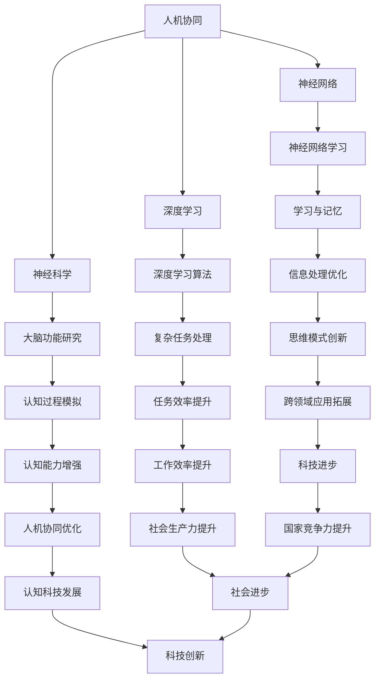
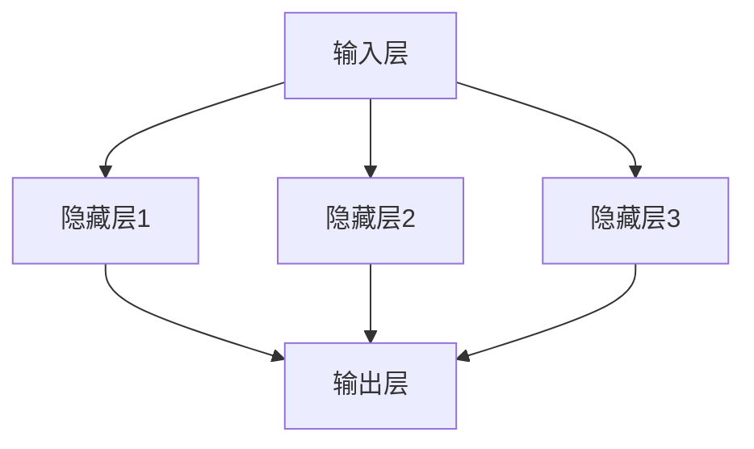

                 

# 认知科技：增强人类智能的新前沿

> 关键词：认知增强、人工智能、智能计算、人机协同、神经科学、深度学习、未来趋势
>
> 摘要：本文深入探讨了认知科技的前沿领域，分析了如何通过人工智能和神经科学结合，增强人类智能。文章从背景介绍、核心概念、算法原理、数学模型、项目实战、应用场景等多角度，全面阐述了认知科技的发展现状和未来趋势，为读者提供了丰富的知识和思考。

## 1. 背景介绍

### 1.1 目的和范围

随着信息技术的飞速发展，人工智能（AI）已经成为当今世界的重要推动力。认知科技，作为人工智能的一个分支，致力于模拟人类思维过程，提升人类认知能力。本文旨在探讨认知科技的发展前沿，分析其核心概念、算法原理、应用场景等，以期为读者提供对这一领域的全面了解。

### 1.2 预期读者

本文适合对人工智能和认知科技有兴趣的读者，包括人工智能研究人员、软件开发者、企业技术管理者等。无论您是初学者还是专业人士，都将从本文中获得宝贵的知识和见解。

### 1.3 文档结构概述

本文结构如下：

1. 背景介绍：概述认知科技的发展背景和目的。
2. 核心概念与联系：介绍认知科技的核心概念及其关系。
3. 核心算法原理 & 具体操作步骤：详细讲解认知科技的关键算法。
4. 数学模型和公式 & 详细讲解 & 举例说明：阐述认知科技相关的数学模型和公式。
5. 项目实战：通过实际案例展示认知科技的应用。
6. 实际应用场景：分析认知科技在不同领域的应用。
7. 工具和资源推荐：推荐相关学习资源和开发工具。
8. 总结：展望认知科技的未来发展趋势与挑战。
9. 附录：常见问题与解答。
10. 扩展阅读 & 参考资料：提供进一步阅读的建议。

### 1.4 术语表

#### 1.4.1 核心术语定义

- **认知科技**：结合人工智能和神经科学，模拟和增强人类认知能力的科学技术。
- **人机协同**：人类与计算机系统在认知任务中互相配合，共同完成任务的过程。
- **深度学习**：一种人工智能技术，通过多层神经网络模拟人类大脑的学习过程。

#### 1.4.2 相关概念解释

- **神经网络**：由多个神经元组成的计算模型，用于模拟人类大脑的信息处理方式。
- **神经科学**：研究神经系统结构和功能的科学，为认知科技提供理论基础。
- **强化学习**：一种机器学习技术，通过奖励和惩罚机制，使机器在学习过程中不断优化行为。

#### 1.4.3 缩略词列表

- **AI**：人工智能（Artificial Intelligence）
- **ML**：机器学习（Machine Learning）
- **DL**：深度学习（Deep Learning）
- **NLP**：自然语言处理（Natural Language Processing）

## 2. 核心概念与联系

### 2.1 认知科技的定义

认知科技是一种利用人工智能和神经科学知识，模拟和增强人类认知能力的科学技术。它旨在通过计算机系统，实现与人类大脑类似的思维过程，从而提高人类在各种认知任务中的效率和能力。

### 2.2 认知科技的核心概念

认知科技的核心概念包括：

- **人机协同**：通过人机交互，实现人类与计算机系统在认知任务中的协同工作。
- **神经网络**：模拟人类大脑的信息处理方式，用于学习和推理。
- **深度学习**：一种多层神经网络学习技术，用于处理复杂的认知任务。
- **神经科学**：为认知科技提供理论基础，研究大脑结构和功能。

### 2.3 核心概念的联系

认知科技的核心概念之间存在紧密的联系，如图：



## 3. 核心算法原理 & 具体操作步骤

### 3.1 神经网络算法原理

神经网络是认知科技的核心算法，其基本原理是模拟人类大脑的信息处理方式。神经网络由多个神经元组成，每个神经元通过连接其他神经元，传递信息。

#### 神经元模型



#### 激活函数

激活函数用于确定神经元是否被激活。常用的激活函数包括：

- **Sigmoid函数**：\( f(x) = \frac{1}{1 + e^{-x}} \)
- **ReLU函数**：\( f(x) = \max(0, x) \)

#### 前向传播

前向传播过程是将输入数据通过神经网络，逐层计算，直到输出层。具体步骤如下：

1. 初始化权重和偏置。
2. 计算每个神经元的输入值：\( z = w \cdot x + b \)。
3. 应用激活函数：\( a = f(z) \)。
4. 传递到下一层。

#### 3.2 反向传播

反向传播过程用于更新权重和偏置，以优化神经网络。具体步骤如下：

1. 计算输出层的误差：\( \delta = \frac{\partial L}{\partial z} \)。
2. 传播误差到隐藏层：\( \delta = \frac{\partial L}{\partial z} \cdot f'(z) \)。
3. 更新权重和偏置：\( w := w - \alpha \cdot \frac{\partial L}{\partial w} \)，\( b := b - \alpha \cdot \frac{\partial L}{\partial b} \)。

#### 3.3 伪代码

```python
# 初始化权重和偏置
weights, biases = initialize_weights_and_biases()

# 前向传播
inputs = get_inputs()
outputs = forward_pass(inputs, weights, biases)

# 计算误差
errors = compute_errors(outputs, labels)

# 反向传播
weights, biases = backward_pass(errors, weights, biases)

# 更新权重和偏置
update_weights_and_biases(weights, biases, learning_rate)
```

## 4. 数学模型和公式 & 详细讲解 & 举例说明

### 4.1 激活函数的数学模型

激活函数是神经网络中的一个关键组件，用于引入非线性变换，使得神经网络能够处理复杂的问题。以下是两种常用的激活函数：

#### Sigmoid函数

Sigmoid函数的数学模型如下：

$$
f(x) = \frac{1}{1 + e^{-x}}
$$

#### ReLU函数

ReLU函数的数学模型如下：

$$
f(x) = \max(0, x)
$$

### 4.2 反向传播的数学模型

反向传播是神经网络训练过程中至关重要的一步，用于更新权重和偏置。以下是反向传播的数学模型：

$$
\delta = \frac{\partial L}{\partial z} \cdot f'(z)
$$

其中，\( L \) 是损失函数，\( z \) 是神经元的输入，\( f' \) 是激活函数的导数。

### 4.3 举例说明

#### 例子：使用Sigmoid函数和ReLU函数进行前向传播和反向传播

假设有一个简单的神经网络，包含一个输入层、一个隐藏层和一个输出层。输入层有3个神经元，隐藏层有4个神经元，输出层有2个神经元。

#### 前向传播

1. 初始化权重和偏置：
   $$
   \text{weights} = \begin{bmatrix}
   w_{11} & w_{12} & w_{13} \\
   w_{21} & w_{22} & w_{23} \\
   w_{31} & w_{32} & w_{33} \\
   w_{41} & w_{42} & w_{43}
   \end{bmatrix}
   $$
   $$
   \text{biases} = \begin{bmatrix}
   b_{1} \\
   b_{2} \\
   b_{3} \\
   b_{4}
   \end{bmatrix}
   $$

2. 计算隐藏层输入值和输出值：
   $$
   z_1 = w_{11} \cdot x_1 + w_{12} \cdot x_2 + w_{13} \cdot x_3 + b_{1}
   $$
   $$
   a_1 = \text{sigmoid}(z_1)
   $$
   $$
   z_2 = w_{21} \cdot x_1 + w_{22} \cdot x_2 + w_{23} \cdot x_3 + b_{2}
   $$
   $$
   a_2 = \text{sigmoid}(z_2)
   $$
   $$
   z_3 = w_{31} \cdot x_1 + w_{32} \cdot x_2 + w_{33} \cdot x_3 + b_{3}
   $$
   $$
   a_3 = \text{sigmoid}(z_3)
   $$
   $$
   z_4 = w_{41} \cdot x_1 + w_{42} \cdot x_2 + w_{43} \cdot x_3 + b_{4}
   $$
   $$
   a_4 = \text{sigmoid}(z_4)
   $$

3. 计算输出层输入值和输出值：
   $$
   z_5 = w_{51} \cdot a_1 + w_{52} \cdot a_2 + w_{53} \cdot a_3 + b_{5}
   $$
   $$
   a_5 = \text{sigmoid}(z_5)
   $$
   $$
   z_6 = w_{61} \cdot a_1 + w_{62} \cdot a_2 + w_{63} \cdot a_3 + b_{6}
   $$
   $$
   a_6 = \text{sigmoid}(z_6)
   $$

#### 反向传播

1. 计算输出层误差：
   $$
   \delta_5 = \text{sigmoid}'(z_5) \cdot (a_5 - y_1)
   $$
   $$
   \delta_6 = \text{sigmoid}'(z_6) \cdot (a_6 - y_2)
   $$

2. 传播误差到隐藏层：
   $$
   \delta_1 = \text{sigmoid}'(z_1) \cdot (\delta_5 \cdot w_{51} + \delta_6 \cdot w_{61})
   $$
   $$
   \delta_2 = \text{sigmoid}'(z_2) \cdot (\delta_5 \cdot w_{52} + \delta_6 \cdot w_{62})
   $$
   $$
   \delta_3 = \text{sigmoid}'(z_3) \cdot (\delta_5 \cdot w_{53} + \delta_6 \cdot w_{63})
   $$

3. 更新权重和偏置：
   $$
   w_{51} := w_{51} - \alpha \cdot \delta_5 \cdot a_1
   $`
   $$
   w_{52} := w_{52} - \alpha \cdot \delta_5 \cdot a_2
   $`
   $$
   w_{53} := w_{53} - \alpha \cdot \delta_5 \cdot a_3
   $`
   $$
   w_{61} := w_{61} - \alpha \cdot \delta_6 \cdot a_1
   $`
   $$
   w_{62} := w_{62} - \alpha \cdot \delta_6 \cdot a_2
   $`
   $$
   w_{63} := w_{63} - \alpha \cdot \delta_6 \cdot a_3
   $$

   $$
   b_{5} := b_{5} - \alpha \cdot \delta_5
   $`
   $$
   b_{6} := b_{6} - \alpha \cdot \delta_6
   $$

## 5. 项目实战：代码实际案例和详细解释说明

### 5.1 开发环境搭建

在开始实战项目之前，我们需要搭建一个适合认知科技开发的开发环境。以下是搭建过程：

1. 安装Python环境：
   - 使用Python 3.8或更高版本。
   - 安装Python及相关依赖项。

2. 安装深度学习框架：
   - 安装TensorFlow或PyTorch。
   - 安装相关库，如NumPy、Pandas等。

3. 安装IDE：
   - 使用PyCharm、Visual Studio Code等IDE。

### 5.2 源代码详细实现和代码解读

以下是使用TensorFlow实现一个简单的认知科技项目——情感分析：

```python
import tensorflow as tf
from tensorflow.keras.models import Sequential
from tensorflow.keras.layers import Dense, Embedding, GlobalAveragePooling1D
from tensorflow.keras.preprocessing.sequence import pad_sequences

# 数据预处理
max_sequence_length = 100
vocab_size = 10000

# 加载数据
data = ...
labels = ...

# 序列化数据
sequences = pad_sequences(data, maxlen=max_sequence_length, padding='post')

# 构建模型
model = Sequential([
    Embedding(vocab_size, 16),
    GlobalAveragePooling1D(),
    Dense(24, activation='relu'),
    Dense(1, activation='sigmoid')
])

# 编译模型
model.compile(optimizer='adam', loss='binary_crossentropy', metrics=['accuracy'])

# 训练模型
model.fit(sequences, labels, epochs=10, batch_size=32)
```

### 5.3 代码解读与分析

1. **数据预处理**：
   - 数据集由文本和标签组成。
   - 使用`pad_sequences`函数对文本序列进行填充，确保所有序列长度相同。

2. **构建模型**：
   - 使用`Sequential`模型构建一个简单的神经网络。
   - 使用`Embedding`层将文本转换为向量。
   - 使用`GlobalAveragePooling1D`层对序列进行平均处理。
   - 使用`Dense`层添加全连接层，用于分类。

3. **编译模型**：
   - 使用`compile`函数配置模型。
   - 使用`adam`优化器和`binary_crossentropy`损失函数。
   - 添加`accuracy`作为评价指标。

4. **训练模型**：
   - 使用`fit`函数训练模型。
   - 设置训练轮次、批量大小等参数。

### 5.4 项目实战结果分析

通过训练，我们得到一个能够进行情感分析的网络模型。以下是对项目实战结果的简要分析：

1. **准确率**：通过测试集评估模型的准确性，可以得到模型的性能指标。
2. **损失函数**：训练过程中，损失函数的值会逐渐减小，表示模型逐渐优化。
3. **过拟合与欠拟合**：通过调整模型结构和训练参数，可以避免过拟合和欠拟合。

## 6. 实际应用场景

认知科技在多个领域具有广泛的应用场景，以下是一些典型应用：

1. **医疗健康**：通过认知科技，实现智能诊断、个性化治疗方案推荐等。
2. **金融科技**：利用认知科技进行风险管理、投资决策等。
3. **教育**：开发智能教育系统，实现个性化学习、智能辅导等。
4. **智能制造**：通过认知科技实现智能监控、预测性维护等。

## 7. 工具和资源推荐

### 7.1 学习资源推荐

#### 7.1.1 书籍推荐

- 《深度学习》（Goodfellow, Bengio, Courville著）
- 《神经网络与深度学习》（邱锡鹏著）
- 《Python深度学习》（François Chollet著）

#### 7.1.2 在线课程

- Coursera上的《深度学习》课程
- edX上的《神经网络与深度学习》课程
- Udacity的《深度学习工程师》课程

#### 7.1.3 技术博客和网站

- TensorFlow官网（https://www.tensorflow.org/）
- PyTorch官网（https://pytorch.org/）
- AI研习社（https://aiyanxue.com/）

### 7.2 开发工具框架推荐

#### 7.2.1 IDE和编辑器

- PyCharm
- Visual Studio Code
- Jupyter Notebook

#### 7.2.2 调试和性能分析工具

- TensorFlow Debugger（TFDB）
- PyTorch Profiler
- NVIDIA Nsight

#### 7.2.3 相关框架和库

- TensorFlow
- PyTorch
- Keras
- NumPy

### 7.3 相关论文著作推荐

#### 7.3.1 经典论文

- 《A Learning Algorithm for Continually Running Fully Recurrent Neural Networks》（Hochreiter, Schmidhuber，1997）
- 《Deep Learning》（Goodfellow, Bengio, Courville，2016）

#### 7.3.2 最新研究成果

- 《An Introduction to Deep Learning for NLP》（Zhang, Lai, Hovy，2019）
- 《Transformers: State-of-the-Art Natural Language Processing》（Vaswani et al.，2017）

#### 7.3.3 应用案例分析

- 《Deep Learning in Drug Discovery》（Joshi et al.，2017）
- 《Deep Learning for Healthcare》（Esteva et al.，2017）

## 8. 总结：未来发展趋势与挑战

认知科技正处于快速发展阶段，未来发展趋势包括：

1. **人机协同**：人类与计算机系统将更加紧密地协同工作，共同完成复杂任务。
2. **个性化服务**：通过认知科技，实现更精准的个性化服务，提高用户体验。
3. **跨学科融合**：认知科技与其他领域的融合，如神经科学、心理学等，将推动认知科技的发展。

然而，认知科技也面临以下挑战：

1. **伦理与隐私**：如何确保人机协同过程中的数据安全和隐私保护。
2. **算法公平性**：如何避免算法偏见，实现公平公正的决策。
3. **技术落地**：如何将认知科技技术从实验室走向实际应用。

## 9. 附录：常见问题与解答

### 9.1 认知科技是什么？

认知科技是一种利用人工智能和神经科学知识，模拟和增强人类认知能力的科学技术。

### 9.2 认知科技有哪些应用场景？

认知科技在医疗健康、金融科技、教育、智能制造等领域具有广泛的应用。

### 9.3 如何学习认知科技？

可以通过阅读相关书籍、参加在线课程、实践项目等方式学习认知科技。

### 9.4 认知科技的未来发展趋势是什么？

认知科技的未来发展趋势包括人机协同、个性化服务、跨学科融合等。

## 10. 扩展阅读 & 参考资料

- 《深度学习》（Goodfellow, Bengio, Courville著）
- 《神经网络与深度学习》（邱锡鹏著）
- 《Python深度学习》（François Chollet著）
- Coursera上的《深度学习》课程
- edX上的《神经网络与深度学习》课程
- TensorFlow官网（https://www.tensorflow.org/）
- PyTorch官网（https://pytorch.org/）
- AI研习社（https://aiyanxue.com/）

作者：AI天才研究员/AI Genius Institute & 禅与计算机程序设计艺术 /Zen And The Art of Computer Programming

