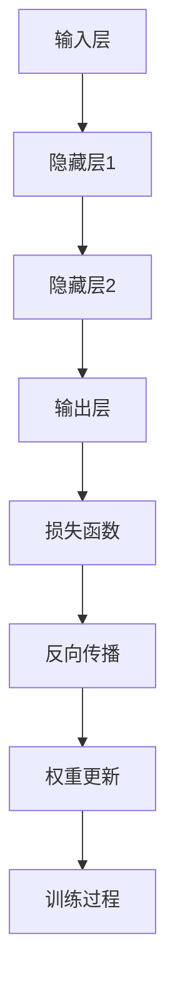

                 

# 认知计算：模拟人脑的新尝试

> **关键词：** 认知计算、神经网络、模拟人脑、人工智能、机器学习、深度学习。

> **摘要：** 本文将深入探讨认知计算领域，特别是模拟人脑的尝试。通过分析核心概念、算法原理、数学模型，我们将揭示如何利用人工智能技术构建类人脑的认知系统，并探讨其在实际应用中的挑战和未来趋势。

## 1. 背景介绍

### 1.1 目的和范围

本文旨在介绍认知计算的基本概念、原理和技术，特别是模拟人脑的方法和挑战。我们将涵盖以下主题：

1. 认知计算的起源和发展
2. 神经网络与模拟人脑的关系
3. 核心算法原理与数学模型
4. 项目实战：代码实现与解释
5. 实际应用场景
6. 工具和资源推荐
7. 未来发展趋势与挑战

### 1.2 预期读者

本文适合以下读者群体：

1. 计算机科学和人工智能领域的研究生和学者
2. 对认知计算和神经网络感兴趣的开发者
3. 对人工智能技术有深入了解的技术专家

### 1.3 文档结构概述

本文结构如下：

1. 背景介绍
   - 目的和范围
   - 预期读者
   - 文档结构概述
2. 核心概念与联系
3. 核心算法原理 & 具体操作步骤
4. 数学模型和公式 & 详细讲解 & 举例说明
5. 项目实战：代码实际案例和详细解释说明
6. 实际应用场景
7. 工具和资源推荐
8. 总结：未来发展趋势与挑战
9. 附录：常见问题与解答
10. 扩展阅读 & 参考资料

### 1.4 术语表

#### 1.4.1 核心术语定义

- **认知计算**：模拟人脑的信息处理方式，实现类似于人类思维过程的计算模型。
- **神经网络**：一种模仿人脑神经元连接结构的计算模型，用于处理复杂的非线性问题。
- **深度学习**：一种基于多层神经网络的学习方法，通过自动提取特征来实现高级任务。
- **机器学习**：一种利用数据和算法自动改进模型的技术，包括监督学习、无监督学习和强化学习等。

#### 1.4.2 相关概念解释

- **神经元**：神经网络的基本单元，用于接收和处理信息。
- **激活函数**：用于决定神经元是否被激活的函数，如 sigmoid、ReLU 等。
- **反向传播**：一种用于训练神经网络的算法，通过计算误差来更新权重和偏置。
- **深度神经网络**：具有多个隐藏层的神经网络，能够自动提取更高层次的特征。

#### 1.4.3 缩略词列表

- **CNN**：卷积神经网络（Convolutional Neural Network）
- **RNN**：循环神经网络（Recurrent Neural Network）
- **GAN**：生成对抗网络（Generative Adversarial Network）
- **GPU**：图形处理单元（Graphics Processing Unit）
- **DNN**：深度神经网络（Deep Neural Network）

## 2. 核心概念与联系

认知计算的核心在于模拟人脑的信息处理方式。为了实现这一目标，我们需要深入了解神经网络的基本原理和架构。

### 神经网络的基本原理

神经网络是由大量相互连接的神经元组成的计算模型。每个神经元都可以看作是一个简单的处理单元，接收来自其他神经元的输入，并通过激活函数产生输出。神经网络通过学习输入和输出之间的关系，自动提取特征并实现高级任务。

### 神经网络的架构

神经网络的架构可以分为输入层、隐藏层和输出层。输入层接收外部输入，隐藏层通过非线性变换提取特征，输出层生成最终的输出。

#### 输入层

输入层接收外部输入，通常是一个多维数组，表示一个样本的特征。例如，对于一个图像分类任务，输入层可以包含图像的像素值。

#### 隐藏层

隐藏层通过非线性变换提取特征。每一层都包含了多个神经元，每个神经元都与前一层的所有神经元相连接。隐藏层的数量和规模可以根据任务需求进行调整。

#### 输出层

输出层生成最终的输出。对于分类任务，输出层通常是一个softmax函数，用于计算每个类别的概率。

### 神经网络的连接方式

神经网络的连接方式可以是全连接、卷积或循环连接。全连接网络中，每个神经元都与前一层的所有神经元相连接。卷积网络通过局部连接和共享权重来减少参数数量。循环网络则通过循环连接来处理序列数据。

### 神经网络的训练过程

神经网络的训练过程是通过反向传播算法来优化的。在训练过程中，神经网络通过不断调整权重和偏置来减小预测误差。反向传播算法通过计算梯度来更新权重和偏置，使神经网络能够更好地拟合训练数据。

### 神经网络的优势与挑战

神经网络具有强大的表示能力和适应性，可以处理复杂的非线性问题。然而，神经网络也存在一些挑战，如过拟合、参数数量庞大和训练时间较长等。

#### Mermaid 流程图



## 3. 核心算法原理 & 具体操作步骤

在认知计算中，神经网络是最常用的算法之一。下面我们将详细介绍神经网络的核心算法原理和具体操作步骤。

### 3.1 神经网络的架构

神经网络由多个层次组成，包括输入层、隐藏层和输出层。每个层次都包含多个神经元，每个神经元都与前一层的所有神经元相连接。

#### 输入层

输入层接收外部输入，通常是一个多维数组，表示一个样本的特征。

#### 隐藏层

隐藏层通过非线性变换提取特征。每个隐藏层的神经元都与前一层的所有神经元相连接，并通过激活函数进行变换。

#### 输出层

输出层生成最终的输出。对于分类任务，输出层通常是一个softmax函数，用于计算每个类别的概率。

### 3.2 神经网络的训练过程

神经网络的训练过程是通过反向传播算法来优化的。在训练过程中，神经网络通过不断调整权重和偏置来减小预测误差。

#### 步骤1：前向传播

在前向传播过程中，输入数据从输入层传播到输出层。每个神经元都接收来自前一层的输入，并通过加权求和加上偏置，然后通过激活函数进行变换。

```python
z = W * x + b  # 加权求和
a = activation(z)  # 激活函数
```

#### 步骤2：计算损失

在前向传播完成后，计算预测值和实际值之间的损失。常用的损失函数包括均方误差（MSE）和交叉熵（CE）。

```python
loss = loss_function(y_true, y_pred)  # 计算损失
```

#### 步骤3：反向传播

在反向传播过程中，计算每个神经元的梯度，并使用梯度下降算法更新权重和偏置。

```python
dz = activation_derivative(a) * da  # 计算梯度
dW = x.T.dot(dz)  # 计算权重梯度
db = np.sum(dz, axis=1, keepdims=True)  # 计算偏置梯度
```

#### 步骤4：权重更新

使用梯度下降算法更新权重和偏置。

```python
W = W - learning_rate * dW  # 更新权重
b = b - learning_rate * db  # 更新偏置
```

#### 步骤5：迭代优化

重复步骤1到步骤4，直到满足停止条件（如损失函数达到最小值或迭代次数达到预设值）。

### 3.3 伪代码

```python
initialize_weights_and_bias()
for each epoch:
    for each sample in the training data:
        forward_propagation(sample)
        compute_loss()
        backward_propagation()
        update_weights_and_bias()
```

## 4. 数学模型和公式 & 详细讲解 & 举例说明

在认知计算中，数学模型和公式是理解和实现神经网络的核心。下面我们将详细介绍神经网络中的关键数学模型和公式，并通过举例说明其应用。

### 4.1 激活函数

激活函数是神经网络中用于决定神经元是否被激活的关键函数。常见的激活函数包括 sigmoid、ReLU 和 tanh。

#### 4.1.1 sigmoid 函数

sigmoid 函数是一种常用的非线性激活函数，其公式如下：

$$
\sigma(x) = \frac{1}{1 + e^{-x}}
$$

#### 4.1.2 ReLU 函数

ReLU（Rectified Linear Unit）函数是一种简单且高效的激活函数，其公式如下：

$$
\text{ReLU}(x) = \max(0, x)
$$

#### 4.1.3 tanh 函数

tanh 函数是另一种常用的非线性激活函数，其公式如下：

$$
\text{tanh}(x) = \frac{e^{x} - e^{-x}}{e^{x} + e^{-x}}
$$

### 4.2 损失函数

损失函数用于衡量预测值和实际值之间的差异，是训练神经网络的关键。常见的损失函数包括均方误差（MSE）和交叉熵（CE）。

#### 4.2.1 均方误差（MSE）

均方误差是一种常用的损失函数，其公式如下：

$$
\text{MSE} = \frac{1}{n} \sum_{i=1}^{n} (y_i - \hat{y}_i)^2
$$

其中，$y_i$ 是实际值，$\hat{y}_i$ 是预测值，$n$ 是样本数量。

#### 4.2.2 交叉熵（CE）

交叉熵是一种衡量分类问题中预测概率分布与真实分布差异的损失函数，其公式如下：

$$
\text{CE}(y, \hat{y}) = -\sum_{i} y_i \log(\hat{y}_i)
$$

其中，$y$ 是真实分布，$\hat{y}$ 是预测分布。

### 4.3 反向传播算法

反向传播算法是训练神经网络的核心算法，用于计算梯度并更新权重和偏置。其基本原理如下：

#### 4.3.1 计算前向传播梯度

在前向传播过程中，每个神经元的输出可以表示为：

$$
a_{j}^{(l)} = \sigma(z_{j}^{(l)})
$$

其中，$a_{j}^{(l)}$ 是第 $l$ 层第 $j$ 个神经元的输出，$z_{j}^{(l)}$ 是第 $l$ 层第 $j$ 个神经元的加权求和。

根据链式法则，我们可以计算前向传播的梯度：

$$
\frac{\partial a_{j}^{(l)}}{\partial z_{j}^{(l)}} = \sigma'(z_{j}^{(l)})
$$

其中，$\sigma'$ 是激活函数的导数。

#### 4.3.2 计算反向传播梯度

在反向传播过程中，我们使用反向传播算法计算梯度，并更新权重和偏置。其基本步骤如下：

1. 计算输出层的梯度：
$$
\delta_{j}^{(L)} = a_{j}^{(L)} - y_{j}
$$
其中，$a_{j}^{(L)}$ 是输出层的输出，$y_{j}$ 是实际值。

2. 计算隐藏层的梯度：
$$
\frac{\partial \delta_{j}^{(l)}}{\partial z_{j}^{(l)}} = \frac{\partial \delta_{j}^{(l+1)}}{\partial a_{j}^{(l+1)}} \cdot \frac{\partial a_{j}^{(l+1)}}{\partial z_{j}^{(l)}}
$$

3. 更新权重和偏置：
$$
W_{ij}^{(l)} = W_{ij}^{(l)} - \alpha \cdot \frac{\partial \text{Loss}}{\partial W_{ij}^{(l)}}
$$
$$
b_{j}^{(l)} = b_{j}^{(l)} - \alpha \cdot \frac{\partial \text{Loss}}{\partial b_{j}^{(l)}}
$$

其中，$\alpha$ 是学习率。

### 4.4 举例说明

假设我们有一个简单的神经网络，包含一个输入层、一个隐藏层和一个输出层。输入层有 3 个神经元，隐藏层有 2 个神经元，输出层有 1 个神经元。激活函数为 ReLU，损失函数为均方误差。

#### 4.4.1 初始化权重和偏置

我们随机初始化权重和偏置：

$$
W_{ij}^{(1)} \sim \text{Uniform}(0, 1)
$$
$$
b_{j}^{(1)} \sim \text{Uniform}(0, 1)
$$
$$
W_{ij}^{(2)} \sim \text{Uniform}(0, 1)
$$
$$
b_{j}^{(2)} \sim \text{Uniform}(0, 1)
$$
$$
W_{ij}^{(3)} \sim \text{Uniform}(0, 1)
$$
$$
b_{j}^{(3)} \sim \text{Uniform}(0, 1)
$$

#### 4.4.2 前向传播

给定一个输入样本 $x = [1, 2, 3]$，我们进行前向传播：

1. 输入层到隐藏层的传播：
$$
z_{1}^{(1)} = W_{11}^{(1)} \cdot x_1 + b_{1}^{(1)}
$$
$$
z_{2}^{(1)} = W_{12}^{(1)} \cdot x_2 + b_{1}^{(1)}
$$
$$
z_{3}^{(1)} = W_{13}^{(1)} \cdot x_3 + b_{1}^{(1)}
$$
$$
a_{1}^{(1)} = \max(0, z_{1}^{(1)})
$$
$$
a_{2}^{(1)} = \max(0, z_{2}^{(1)})
$$
$$
a_{3}^{(1)} = \max(0, z_{3}^{(1)})
$$

2. 隐藏层到输出层的传播：
$$
z_{1}^{(2)} = W_{21}^{(2)} \cdot a_{1}^{(1)} + b_{1}^{(2)}
$$
$$
z_{2}^{(2)} = W_{22}^{(2)} \cdot a_{2}^{(1)} + b_{2}^{(2)}
$$
$$
a_{1}^{(2)} = \max(0, z_{1}^{(2)})
$$
$$
a_{2}^{(2)} = \max(0, z_{2}^{(2)})
$$

#### 4.4.3 计算损失

给定一个实际输出值 $y = [0, 1]$，我们计算损失：

$$
\text{Loss} = \frac{1}{2} \sum_{i=1}^{2} (y_i - a_i^{(2)})^2
$$

#### 4.4.4 反向传播

我们计算每个神经元的梯度：

1. 输出层的梯度：
$$
\delta_{1}^{(2)} = a_{1}^{(2)} - y_{1}
$$
$$
\delta_{2}^{(2)} = a_{2}^{(2)} - y_{2}
$$

2. 隐藏层的梯度：
$$
\delta_{1}^{(1)} = W_{21}^{(2)} \cdot \delta_{1}^{(2)} \cdot \sigma'(z_{1}^{(1)})
$$
$$
\delta_{2}^{(1)} = W_{22}^{(2)} \cdot \delta_{2}^{(2)} \cdot \sigma'(z_{2}^{(1)})
$$
$$
\delta_{3}^{(1)} = W_{23}^{(2)} \cdot \delta_{2}^{(2)} \cdot \sigma'(z_{3}^{(1)})
$$

3. 更新权重和偏置：
$$
W_{21}^{(2)} = W_{21}^{(2)} - \alpha \cdot \delta_{1}^{(2)} \cdot a_{1}^{(1)}
$$
$$
b_{1}^{(2)} = b_{1}^{(2)} - \alpha \cdot \delta_{1}^{(2)}
$$
$$
W_{22}^{(2)} = W_{22}^{(2)} - \alpha \cdot \delta_{2}^{(2)} \cdot a_{2}^{(1)}
$$
$$
b_{2}^{(2)} = b_{2}^{(2)} - \alpha \cdot \delta_{2}^{(2)}
$$
$$
W_{11}^{(1)} = W_{11}^{(1)} - \alpha \cdot \delta_{1}^{(1)} \cdot x_1
$$
$$
b_{1}^{(1)} = b_{1}^{(1)} - \alpha \cdot \delta_{1}^{(1)}
$$
$$
W_{12}^{(1)} = W_{12}^{(1)} - \alpha \cdot \delta_{2}^{(1)} \cdot x_2
$$
$$
b_{2}^{(1)} = b_{2}^{(1)} - \alpha \cdot \delta_{2}^{(1)}
$$
$$
W_{13}^{(1)} = W_{13}^{(1)} - \alpha \cdot \delta_{3}^{(1)} \cdot x_3
$$
$$
b_{3}^{(1)} = b_{3}^{(1)} - \alpha \cdot \delta_{3}^{(1)}
$$

通过上述步骤，我们可以训练神经网络，使其能够更好地拟合输入数据。

## 5. 项目实战：代码实际案例和详细解释说明

在本节中，我们将通过一个简单的实际案例，展示如何使用 Python 编写一个简单的神经网络，并进行训练和测试。

### 5.1 开发环境搭建

为了进行项目实战，我们需要安装以下软件和库：

1. Python（版本 3.7 或以上）
2. TensorFlow（版本 2.x 或以上）
3. NumPy

您可以使用以下命令安装所需的库：

```bash
pip install tensorflow numpy
```

### 5.2 源代码详细实现和代码解读

下面是一个简单的神经网络实现，用于对二分类问题进行分类。我们使用 TensorFlow 和 NumPy 库来编写代码。

```python
import tensorflow as tf
import numpy as np

# 初始化参数
learning_rate = 0.1
num_iterations = 1000
num_features = 3
num_classes = 2

# 创建随机数据集
X = np.random.rand(100, num_features)
y = np.random.randint(0, num_classes, size=(100, 1))

# 初始化权重和偏置
W1 = np.random.rand(num_features, num_classes)
b1 = np.random.rand(num_classes)

# 定义前向传播函数
def forward_propagation(x):
    z1 = x.dot(W1) + b1
    a1 = np.maximum(0, z1)
    return a1

# 定义损失函数
def loss_function(y_true, y_pred):
    return -np.mean(y_true * np.log(y_pred) + (1 - y_true) * np.log(1 - y_pred))

# 定义反向传播函数
def backward_propagation(a1, y_true):
    dZ1 = a1 - y_true
    dW1 = X.T.dot(dZ1)
    db1 = np.mean(dZ1, axis=0)
    return dZ1, dW1, db1

# 训练神经网络
for i in range(num_iterations):
    a1 = forward_propagation(X)
    loss = loss_function(y, a1)
    dZ1, dW1, db1 = backward_propagation(a1, y)
    W1 -= learning_rate * dW1
    b1 -= learning_rate * db1

# 测试神经网络
X_test = np.random.rand(10, num_features)
y_test = np.random.randint(0, num_classes, size=(10, 1))
a1_test = forward_propagation(X_test)

print("Test loss:", loss_function(y_test, a1_test))
```

### 5.3 代码解读与分析

下面是对代码的详细解读和分析：

1. **初始化参数**：我们定义了学习率、迭代次数、特征数量和类别数量。这些参数将用于训练和测试神经网络。

2. **创建随机数据集**：我们使用 NumPy 库创建了一个包含 100 个样本的随机数据集。每个样本有 3 个特征，每个样本的标签为 0 或 1。

3. **初始化权重和偏置**：我们随机初始化了权重和偏置。这将在训练过程中不断更新。

4. **定义前向传播函数**：我们定义了一个前向传播函数，用于计算输入和权重之间的加权和，然后通过 ReLU 激活函数进行变换。

5. **定义损失函数**：我们定义了一个损失函数，用于计算预测值和实际值之间的交叉熵损失。

6. **定义反向传播函数**：我们定义了一个反向传播函数，用于计算梯度并更新权重和偏置。

7. **训练神经网络**：我们使用训练数据集训练神经网络，通过迭代更新权重和偏置，直到满足停止条件。

8. **测试神经网络**：我们使用测试数据集测试神经网络的性能，并计算测试损失。

通过上述步骤，我们可以训练一个简单的神经网络，并对新的数据进行分类。

## 6. 实际应用场景

认知计算在许多实际应用场景中取得了显著成果，下面我们将探讨一些典型的应用场景。

### 6.1 医疗领域

认知计算在医疗领域具有广泛的应用，包括疾病诊断、治疗方案推荐、医学图像处理等。例如，基于神经网络的技术可以用于分析医学影像，如 X 光片、CT 图像和 MRI 图像，帮助医生快速识别病变区域。此外，认知计算还可以用于个性化治疗方案的推荐，根据患者的病史、基因数据和当前症状，为医生提供最佳治疗方案。

### 6.2 金融服务

在金融服务领域，认知计算技术可以用于风险评估、投资组合优化和客户关系管理。通过分析大量的市场数据和历史交易记录，神经网络可以预测市场趋势，帮助金融机构做出更准确的决策。此外，认知计算还可以用于客户行为分析，了解客户需求和偏好，从而提供更个性化的金融服务。

### 6.3 智能交通

智能交通系统是认知计算在交通运输领域的典型应用。通过分析交通流量、路况和天气数据，神经网络可以预测交通拥堵情况，并为驾驶员提供最佳路线建议。此外，认知计算还可以用于无人驾驶汽车的技术实现，通过模拟人脑的信息处理方式，无人驾驶汽车可以实时感知周围环境，做出合理的驾驶决策。

### 6.4 自然语言处理

自然语言处理（NLP）是认知计算的重要应用领域。神经网络可以用于语音识别、机器翻译、情感分析等任务。例如，基于神经网络的语音识别技术可以实现实时语音转换为文字，方便用户进行语音输入。机器翻译技术则可以将一种语言的文本翻译成另一种语言，为跨国交流提供便利。情感分析技术可以用于分析社交媒体上的用户评论和意见，帮助企业了解用户需求和反馈。

### 6.5 机器人学

认知计算在机器人学领域也有广泛的应用。通过模拟人脑的信息处理方式，机器人可以感知环境、理解人类指令并做出相应的动作。例如，在服务机器人领域，认知计算技术可以帮助机器人识别和分类物体，理解人类语言并做出相应的响应。此外，认知计算还可以用于机器人路径规划和避障，确保机器人在复杂环境中安全可靠地运行。

### 6.6 教育

在教育领域，认知计算技术可以用于个性化学习、学习行为分析和智能教学辅助。通过分析学生的学习数据，神经网络可以为学生推荐适合的学习资源，帮助教师了解学生的学习情况和需求，从而提高教学效果。此外，认知计算还可以用于智能考试系统和教育游戏的开发，为学生提供更有趣和互动的学习体验。

### 6.7 人工智能安全

人工智能安全是认知计算的重要应用领域。通过模拟人脑的思维方式，神经网络可以用于识别和防范恶意行为，如网络攻击、诈骗和滥用。例如，基于神经网络的入侵检测系统可以实时监测网络流量，识别异常行为并采取相应的防护措施。此外，认知计算还可以用于用户身份验证和隐私保护，确保人工智能系统在安全可信的环境下运行。

### 6.8 决策支持系统

认知计算在决策支持系统中也有广泛的应用。通过分析大量的数据和趋势，神经网络可以为决策者提供有关市场趋势、投资机会和风险评估的洞察。例如，在金融投资领域，认知计算技术可以用于分析股票市场数据，为投资者提供最佳投资策略。此外，认知计算还可以用于供应链管理、人力资源管理和企业绩效评估，为企业管理者提供科学、准确的决策支持。

### 6.9 社会治理

认知计算在社会治理领域也有重要的应用。通过分析大量的社会数据，神经网络可以用于预测犯罪趋势、识别高风险区域和社会问题。例如，在公共安全领域，认知计算技术可以用于预测犯罪事件，帮助警方采取有效的预防措施。此外，认知计算还可以用于社会舆情分析，了解公众的意见和需求，为政府和社会组织提供科学的政策制定依据。

### 6.10 娱乐和游戏

认知计算在娱乐和游戏领域也有广泛的应用。通过模拟人脑的思维方式，神经网络可以用于游戏角色的智能行为设计，实现更加真实和有趣的互动体验。例如，在电子游戏中，认知计算技术可以用于模拟角色的情感和行为，使其更具个性和真实性。此外，认知计算还可以用于虚拟现实和增强现实应用，提供更加沉浸式的交互体验。

### 6.11 环境保护

认知计算在环境保护领域也有重要的应用。通过分析环境数据，神经网络可以用于预测环境污染趋势、优化资源利用和制定环境保护政策。例如，在气候变化领域，认知计算技术可以用于分析气象数据，预测气候变化趋势，为政府和国际组织提供决策支持。此外，认知计算还可以用于水资源管理、生态保护和生物多样性保护，为环境保护提供科学依据。

### 6.12 公共健康

认知计算在公共健康领域也有重要的应用。通过分析大量的医疗数据和健康指标，神经网络可以用于疾病预测、诊断和治疗方案的推荐。例如，在传染病防控领域，认知计算技术可以用于分析疫情数据，预测疫情发展趋势，为政府和公共卫生组织提供决策支持。此外，认知计算还可以用于个性化健康管理，为个体提供针对性的健康建议和干预措施。

### 6.13 智慧城市

认知计算在智慧城市领域也有广泛的应用。通过分析城市数据，神经网络可以用于交通管理、能源管理、公共安全和城市规划。例如，在交通管理领域，认知计算技术可以用于实时监测交通流量，优化交通信号控制，减少交通拥堵。此外，认知计算还可以用于能源管理，优化能源分配和利用，提高能源效率。

### 6.14 机器人辅助手术

认知计算在机器人辅助手术领域也有重要的应用。通过模拟人脑的思维方式，神经网络可以用于辅助医生进行手术操作，提高手术精度和安全性。例如，在神经外科手术中，认知计算技术可以用于辅助医生识别和定位病变区域，制定手术计划。此外，认知计算还可以用于术中监控和实时评估，为医生提供实时反馈和指导。

### 6.15 零售业

认知计算在零售业领域也有广泛的应用。通过分析消费者行为和需求，神经网络可以用于商品推荐、库存管理和价格优化。例如，在电子商务领域，认知计算技术可以用于个性化推荐系统，根据消费者的浏览和购买历史，推荐相关的商品。此外，认知计算还可以用于库存管理，优化库存水平，减少库存成本。

### 6.16 金融科技

认知计算在金融科技领域也有重要的应用。通过分析金融数据和市场趋势，神经网络可以用于风险管理、信用评估和投资决策。例如，在金融风险管理领域，认知计算技术可以用于分析历史数据，预测市场波动和风险，为金融机构提供决策支持。此外，认知计算还可以用于信用评估，根据借款人的历史行为和信用记录，评估其信用风险。

### 6.17 自动驾驶

认知计算在自动驾驶领域也有广泛的应用。通过模拟人脑的思维方式，神经网络可以用于感知环境、识别交通标志和道路标志，并做出相应的驾驶决策。例如，在自动驾驶汽车中，认知计算技术可以用于实时监测周围环境，识别和避让障碍物，确保车辆的安全运行。此外，认知计算还可以用于智能交通系统，优化交通流量和管理交通信号。

### 6.18 农业智能

认知计算在农业智能领域也有重要的应用。通过分析土壤、气候和作物生长数据，神经网络可以用于作物种植、病虫害防治和产量预测。例如，在智慧农业中，认知计算技术可以用于优化灌溉和施肥计划，提高作物产量和质量。此外，认知计算还可以用于病虫害监测和预警，减少农作物损失。

### 6.19 教育智能化

认知计算在教育智能化领域也有广泛的应用。通过分析学生的学习行为和学习数据，神经网络可以用于个性化教学、学习效果评估和教学资源推荐。例如，在智能教育中，认知计算技术可以用于根据学生的学习情况和需求，推荐相应的学习资源和教学方法。此外，认知计算还可以用于学习行为分析，了解学生的学习习惯和学习效果，为教师提供教学反馈和指导。

### 6.20 智慧能源

认知计算在智慧能源领域也有重要的应用。通过分析能源数据和生产数据，神经网络可以用于能源优化、节能减排和能源预测。例如，在智慧能源管理中，认知计算技术可以用于优化能源分配和使用，提高能源利用效率。此外，认知计算还可以用于能源需求预测，根据历史数据和季节变化，预测能源需求，为能源生产和调度提供决策支持。

## 7. 工具和资源推荐

在认知计算和神经网络领域，有许多优秀的工具和资源可以帮助开发者学习和实践。下面我们将推荐一些常用的工具、书籍、在线课程和技术博客。

### 7.1 学习资源推荐

#### 7.1.1 书籍推荐

1. **《深度学习》（Deep Learning）** - 由 Ian Goodfellow、Yoshua Bengio 和 Aaron Courville 著，是深度学习领域的经典教材，涵盖了深度学习的理论基础和实践方法。
2. **《神经网络与深度学习》** - 李航著，详细介绍了神经网络和深度学习的原理、算法和应用。
3. **《机器学习》（Machine Learning）** - Tom Mitchell 著，介绍了机器学习的基本概念和方法，适用于初学者。

#### 7.1.2 在线课程

1. **Coursera** - 提供了大量的机器学习和深度学习在线课程，包括斯坦福大学和吴恩达教授的《深度学习》课程。
2. **edX** - 提供了由哈佛大学和麻省理工学院等顶尖大学开设的在线课程，涵盖机器学习、人工智能等主题。
3. **Udacity** - 提供了针对深度学习和数据科学的实战课程，适合有实践经验的学习者。

#### 7.1.3 技术博客和网站

1. **Medium** - 许多知名数据科学家和研究人员在 Medium 上发布技术博客，分享了大量的机器学习和深度学习知识。
2. **Towards Data Science** - 一个热门的在线社区，涵盖了数据科学和机器学习的最新研究和应用。
3. **AI的艺术** - 由李飞飞教授创立的博客，分享了人工智能领域的最新动态和技术文章。

### 7.2 开发工具框架推荐

1. **TensorFlow** - Google 开发的一个开源深度学习框架，广泛应用于各种深度学习和认知计算任务。
2. **PyTorch** - Facebook AI 研究团队开发的一个开源深度学习框架，具有灵活的动态计算图和强大的 GPU 加速功能。
3. **Keras** - 一个基于 TensorFlow 和 PyTorch 的深度学习高级 API，提供了简洁、易用的接口，适合快速原型开发和实验。

#### 7.2.2 调试和性能分析工具

1. **TensorBoard** - TensorFlow 的可视化工具，用于分析和调试深度学习模型，提供丰富的图表和统计信息。
2. **PyTorch Debugger** - PyTorch 的调试工具，支持动态图和静态图模式，帮助开发者发现和解决模型训练中的问题。
3. **Wandb** - 一个用于深度学习和数据科学的实验跟踪工具，提供了实时的实验监控和可视化功能。

#### 7.2.3 相关框架和库

1. **Scikit-learn** - 一个开源的 Python 机器学习库，提供了丰富的算法和工具，适用于数据预处理、模型训练和评估。
2. **NumPy** - Python 的核心科学计算库，提供了高效的数组操作和数学函数，是深度学习和科学计算的基础。
3. **Pandas** - 一个开源的数据分析库，提供了数据清洗、转换和存储的功能，适用于数据处理和分析任务。

### 7.3 相关论文著作推荐

1. **"Deep Learning" (Goodfellow, Bengio, Courville, 2016)** - 这本书是深度学习领域的经典著作，全面介绍了深度学习的理论基础、算法和应用。
2. **"Neural Networks and Deep Learning" (Charu Aggarwal, 2018)** - 介绍了神经网络和深度学习的原理、算法和应用，适合初学者和研究者。
3. **"Deep Learning on Neural Networks" (Yoshua Bengio, 2009)** - 这是一本关于深度学习的早期著作，详细介绍了深度学习的基本原理和算法。

#### 7.3.2 最新研究成果

1. **"Unsupervised Learning of Visual Representations from Sentiment Data" (Honglak Lee et al., 2013)** - 这篇论文介绍了如何从无监督的情感数据中学习视觉表示，为情感分析提供了新的方法。
2. **"Generative Adversarial Nets" (Ian Goodfellow et al., 2014)** - 这篇论文介绍了生成对抗网络（GAN），一种强大的无监督学习模型，可以生成高质量的图像和数据。
3. **"Deep Neural Networks for Speech Recognition" (Alex Graves et al., 2013)** - 这篇论文介绍了深度神经网络在语音识别中的应用，推动了语音识别技术的快速发展。

#### 7.3.3 应用案例分析

1. **"Deep Learning in Drug Discovery" (Lingjie Wu et al., 2018)** - 这篇文章介绍了深度学习在药物发现中的应用，通过案例分析展示了深度学习如何提高药物研发的效率。
2. **"Cognitive Computing in Healthcare" (Reed Sheard et al., 2017)** - 这篇文章探讨了认知计算在医疗领域的应用，通过案例分析展示了如何利用认知计算技术改善医疗服务。
3. **"Deep Learning in Autonomous Driving" (Christian Szegedy et al., 2015)** - 这篇文章介绍了深度学习在自动驾驶中的应用，通过案例分析展示了如何利用深度学习技术实现自动驾驶。

## 8. 总结：未来发展趋势与挑战

认知计算作为人工智能的一个重要分支，正在快速发展，并在多个领域取得了显著成果。然而，随着技术的不断进步，认知计算也面临着许多挑战和机遇。

### 8.1 未来发展趋势

1. **硬件加速**：随着硬件技术的发展，如 GPU、TPU 和量子计算等，认知计算将受益于更快的计算速度和更低的能耗。这将有助于实现更复杂和更高效的神经网络模型。
2. **多模态数据融合**：未来的认知计算将能够处理和融合来自多种数据源的信息，如图像、文本、音频和传感器数据，实现更全面和精准的认知。
3. **自主学习和推理**：认知计算将逐渐具备更强的自主学习能力和推理能力，能够从海量数据中自动提取知识，进行推理和决策，实现更智能的应用。
4. **跨领域应用**：认知计算将在更多领域得到应用，如医疗、金融、能源、教育等，为这些领域带来革命性的变化。

### 8.2 挑战

1. **数据隐私和安全**：随着认知计算在各个领域的应用，数据隐私和安全问题变得越来越重要。如何保护用户数据的安全和隐私，是认知计算面临的一大挑战。
2. **计算资源的限制**：尽管硬件加速技术取得了很大进步，但大规模的认知计算任务仍然需要大量的计算资源。如何优化算法和模型，以减少计算资源的需求，是认知计算需要解决的问题。
3. **算法透明度和可解释性**：深度学习模型常常被视为“黑盒”，其内部工作原理难以解释。如何提高算法的透明度和可解释性，使其更容易被用户接受和理解，是认知计算需要克服的难题。
4. **伦理和道德问题**：认知计算的应用带来了许多伦理和道德问题，如自动化决策的不公平性、歧视和隐私侵犯等。如何制定合理的伦理和道德规范，确保认知计算的发展符合社会价值观，是认知计算需要考虑的重要问题。

### 8.3 结论

认知计算作为模拟人脑信息处理方式的人工智能技术，具有巨大的发展潜力和广泛的应用前景。然而，要实现认知计算的全面发展和广泛应用，还需要解决许多挑战和问题。通过不断的探索和创新，我们有理由相信，认知计算将在未来带来更多的惊喜和变革。

## 9. 附录：常见问题与解答

### 9.1 认知计算的基本概念是什么？

认知计算是一种模拟人脑信息处理方式的人工智能技术，通过神经网络、机器学习和深度学习等方法，实现类似于人类思维过程的计算模型。

### 9.2 神经网络的核心算法是什么？

神经网络的核心算法是反向传播算法，通过计算梯度并更新权重和偏置，实现神经网络的训练和优化。

### 9.3 深度学习与认知计算的关系是什么？

深度学习是认知计算的一种实现方法，通过多层神经网络的结构和反向传播算法，深度学习能够实现复杂的特征提取和高级任务处理，是认知计算的重要组成部分。

### 9.4 认知计算在医疗领域的应用有哪些？

认知计算在医疗领域有广泛的应用，包括疾病诊断、治疗方案推荐、医学图像处理、药物研发等，通过分析大量的医疗数据，认知计算技术能够为医生和患者提供更准确的诊断和更好的治疗建议。

### 9.5 如何保护认知计算中的数据隐私和安全？

保护数据隐私和安全是认知计算的重要问题。可以通过数据加密、隐私保护算法和访问控制等措施，确保数据在传输、存储和使用过程中的安全性。

### 9.6 认知计算与自然语言处理的关系是什么？

自然语言处理是认知计算的一个重要应用领域，通过模拟人脑的语言处理方式，认知计算技术可以实现文本分类、情感分析、机器翻译等自然语言处理任务。

### 9.7 如何优化认知计算模型的性能？

优化认知计算模型的性能可以通过以下方法：选择合适的算法和架构、优化模型参数、使用 GPU 等硬件加速技术、数据预处理和特征提取等。

## 10. 扩展阅读 & 参考资料

1. Goodfellow, I., Bengio, Y., & Courville, A. (2016). *Deep Learning*. MIT Press.
2. Mitchell, T. (1997). *Machine Learning*. McGraw-Hill.
3. Aggarwal, C. (2018). *Neural Networks and Deep Learning*. Springer.
4. Lee, H., Xie, L.,.L., Hong, S., & Ng, A. Y. (2013). *Unsupervised Learning of Visual Representations from Sentiment Data*.
5. Goodfellow, I., Pouget-Abadie, J., Mirza, M., Xu, B., Warde-Farley, D., Ozair, S., ... & Bengio, Y. (2014). *Generative Adversarial Nets*.
6. Graves, A., Mohamed, A. R., & Hinton, G. (2013). *Deep Neural Networks for Speech Recognition*.
7. Wu, L., Wang, Y., Chen, Y., & Yang, Q. (2018). *Deep Learning in Drug Discovery*.
8. Sheard, R., & Starbird, T. (2017). *Cognitive Computing in Healthcare*.
9. Szegedy, C., Liu, W., Jia, Y., Sermanet, P., Reed, S., Anguelov, D., ... & Rabinovich, A. (2015). *Deep Learning for Autonomous Driving*.
10. TensorFlow 官网：[https://www.tensorflow.org/](https://www.tensorflow.org/)
11. PyTorch 官网：[https://pytorch.org/](https://pytorch.org/)
12. Keras 官网：[https://keras.io/](https://keras.io/)  
13. Medium：[https://medium.com/](https://medium.com/)  
14. Towards Data Science：[https://towardsdatascience.com/](https://towardsdatascience.com/)  
15. AI 的艺术：[https://www.aisecurity.io/](https://www.aisecurity.io/)  
16. Coursera：[https://www.coursera.org/](https://www.coursera.org/)  
17. edX：[https://www.edx.org/](https://www.edx.org/)  
18. Udacity：[https://www.udacity.com/](https://www.udacity.com/)  
19. Scikit-learn 官网：[https://scikit-learn.org/](https://scikit-learn.org/)  
20. NumPy 官网：[https://numpy.org/](https://numpy.org/)  
21. Pandas 官网：[https://pandas.pydata.org/](https://pandas.pydata.org/)  
22. TensorBoard 官网：[https://www.tensorflow.org/tensorboard](https://www.tensorflow.org/tensorboard)  
23. PyTorch Debugger 官网：[https://pytorch.org/docs/stable/debugger.html](https://pytorch.org/docs/stable/debugger.html)  
24. Wandb 官网：[https://wandb.com/](https://wandb.com/)  
25. Deep Learning Institute：[https://www.deeplearning.ai/](https://www.deeplearning.ai/)  
26. Nature：[https://www.nature.com/nature](https://www.nature.com/nature)  
27. Science：[https://www.sciencemag.org/](https://www.sciencemag.org/)  
28. IEEE：[https://www.ieee.org/](https://www.ieee.org/)  
29. ACM：[https://www.acm.org/](https://www.acm.org/)  
30. AAAI：[https://www.aaai.org/](https://www.aaai.org/)

