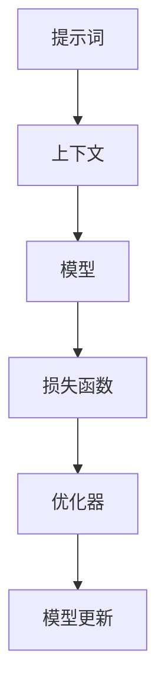

                 

# 设计AI大模型专用编程语言：提示词语言的艺术

> 关键词：AI大模型、专用编程语言、提示词语言、人工智能、编程艺术

> 摘要：本文将探讨设计一种针对AI大模型的专用编程语言——提示词语言。通过深入剖析其核心概念、算法原理、数学模型，并结合实际项目案例，详细阐述这种编程语言的设计理念、实现过程及其在人工智能领域的应用价值。

## 1. 背景介绍

### 1.1 目的和范围

本文旨在探讨设计一种用于AI大模型的专用编程语言——提示词语言。该编程语言将专注于解决当前AI领域面临的诸多挑战，如大规模数据处理、模型优化、可解释性等。通过深入研究提示词语言的原理和实现，本文希望为AI开发者提供一种高效、直观、易扩展的编程工具。

### 1.2 预期读者

本文适合具有计算机科学背景、对人工智能和编程语言设计感兴趣的读者。特别是对AI大模型开发和研究者，以及想要深入了解提示词语言设计的程序员和架构师。

### 1.3 文档结构概述

本文分为以下几个部分：

1. 背景介绍：介绍本文目的、预期读者以及文档结构。
2. 核心概念与联系：阐述提示词语言的核心概念和架构。
3. 核心算法原理 & 具体操作步骤：详细讲解提示词语言的算法原理和操作步骤。
4. 数学模型和公式 & 详细讲解 & 举例说明：介绍提示词语言中的数学模型和公式，并通过实例进行说明。
5. 项目实战：代码实际案例和详细解释说明。
6. 实际应用场景：探讨提示词语言在不同领域的应用。
7. 工具和资源推荐：推荐学习资源和开发工具。
8. 总结：未来发展趋势与挑战。
9. 附录：常见问题与解答。
10. 扩展阅读 & 参考资料：提供相关领域的参考资料。

### 1.4 术语表

#### 1.4.1 核心术语定义

- AI大模型：指具有极高参数量和复杂结构的深度学习模型，如GPT-3、BERT等。
- 提示词语言：一种专门为AI大模型设计的编程语言，通过提示词实现模型训练、优化和调优等功能。
- 编程艺术：指在编程过程中追求简洁、优雅和高效的编程风格。

#### 1.4.2 相关概念解释

- 深度学习：一种基于神经网络的学习方法，通过多层非线性变换对数据进行特征提取和分类。
- 编程语言：用于编写计算机程序的语言，包括语法、语义和语法分析器等组成部分。

#### 1.4.3 缩略词列表

- AI：人工智能
- GPT：生成预训练网络
- BERT：双向编码表示器

## 2. 核心概念与联系

为了更好地理解提示词语言的设计原理和实现过程，我们需要从核心概念和联系入手。以下是提示词语言的核心概念及其相互关系：

### 2.1 提示词语言的核心概念

1. **提示词（Prompt）**：提示词是提示词语言的核心元素，用于引导AI大模型进行训练、优化和调优。提示词通常包含关键词、短语或句子，以引导模型关注特定任务或领域。
2. **上下文（Context）**：上下文是指与提示词相关的一组数据，用于提供背景信息和上下文关联。上下文可以帮助模型更好地理解提示词的含义，从而提高模型的准确性和鲁棒性。
3. **模型（Model）**：模型是指用于处理数据和执行特定任务的深度学习网络。在提示词语言中，模型可以基于各种架构，如Transformer、LSTM等。
4. **损失函数（Loss Function）**：损失函数用于评估模型在训练过程中预测结果的误差，并通过反向传播更新模型参数。
5. **优化器（Optimizer）**：优化器是一种用于调整模型参数的算法，以最小化损失函数。常见的优化器有SGD、Adam等。

### 2.2 提示词语言的核心概念架构

以下是一个简单的Mermaid流程图，展示了提示词语言的核心概念和架构：



### 2.3 提示词语言的工作原理

提示词语言的工作原理可以分为以下几个步骤：

1. **提示词生成**：根据任务需求生成提示词，可以是手动编写或自动生成。
2. **上下文构建**：根据提示词构建相关上下文，包括文本、图像、音频等数据。
3. **模型初始化**：选择合适的模型架构并初始化模型参数。
4. **模型训练**：使用提示词和上下文对模型进行训练，通过调整模型参数最小化损失函数。
5. **模型评估**：使用测试集对模型进行评估，检查模型的准确性和鲁棒性。
6. **模型调优**：根据评估结果对模型进行调优，包括调整提示词、上下文和模型参数。
7. **模型部署**：将训练好的模型部署到实际应用场景中，如文本生成、图像识别等。

## 3. 核心算法原理 & 具体操作步骤

提示词语言的核心算法原理可以概括为以下步骤：

### 3.1 提示词生成

提示词生成是提示词语言设计的关键环节，直接关系到模型训练的效果。提示词生成可以分为手动生成和自动生成两种方式：

1. **手动生成**：手动编写提示词，通常根据任务需求和领域知识进行设计。例如，在文本生成任务中，可以编写一些关键词、短语或句子作为提示词。
2. **自动生成**：利用自然语言处理技术（如文本摘要、命名实体识别等）自动生成提示词。自动生成方式可以提高提示词生成的效率和准确性。

### 3.2 上下文构建

上下文构建是提示词语言的核心步骤，用于提供背景信息和上下文关联。上下文构建可以分为以下几种方式：

1. **静态上下文**：静态上下文是固定不变的，通常用于提供任务背景信息。例如，在文本生成任务中，可以提供相关领域的背景知识或历史数据。
2. **动态上下文**：动态上下文是根据模型训练过程中的实时反馈动态调整的。动态上下文可以更好地适应模型训练的需求，提高模型训练的效果。

### 3.3 模型初始化

模型初始化是提示词语言设计中的基础步骤，选择合适的模型架构并初始化模型参数。常见的模型架构包括：

1. **Transformer**：Transformer是一种基于自注意力机制的深度学习模型，适用于文本生成、机器翻译等任务。
2. **LSTM**：LSTM是一种基于递归神经网络（RNN）的深度学习模型，适用于序列数据处理，如语音识别、文本分类等。

模型初始化主要包括以下步骤：

1. **选择模型架构**：根据任务需求和数据特点选择合适的模型架构。
2. **初始化参数**：随机初始化模型参数，通常使用正态分布或均匀分布。
3. **预训练**：在大量未标记数据上进行预训练，以提取通用特征。

### 3.4 模型训练

模型训练是提示词语言设计中的核心步骤，通过调整模型参数最小化损失函数。模型训练可以分为以下几种方式：

1. **监督训练**：在标记数据集上进行训练，通过比较模型输出和真实标签计算损失函数并更新模型参数。
2. **无监督训练**：在未标记数据集上进行训练，通过模型自身的内部结构提取特征并调整参数。
3. **半监督训练**：结合监督训练和无监督训练，使用少量标记数据和大量未标记数据训练模型。

### 3.5 模型评估

模型评估是提示词语言设计中的关键步骤，用于检查模型的准确性和鲁棒性。模型评估可以分为以下几种方式：

1. **准确率（Accuracy）**：准确率是衡量模型分类效果的一个指标，表示模型正确分类的样本数占总样本数的比例。
2. **召回率（Recall）**：召回率是衡量模型对负样本的检测能力，表示模型正确分类的负样本数占总负样本数的比例。
3. **F1值（F1 Score）**：F1值是准确率和召回率的调和平均值，综合考虑模型分类效果。

### 3.6 模型调优

模型调优是提示词语言设计中的关键步骤，通过调整提示词、上下文和模型参数优化模型性能。模型调优可以分为以下几种方式：

1. **提示词调整**：根据任务需求和模型评估结果调整提示词，提高模型对特定任务的适应能力。
2. **上下文调整**：根据模型训练过程中的实时反馈调整上下文，提高模型训练效果。
3. **参数调整**：通过调整模型参数（如学习率、优化器等）优化模型性能。

### 3.7 模型部署

模型部署是提示词语言设计中的最终步骤，将训练好的模型部署到实际应用场景中。模型部署可以分为以下几种方式：

1. **本地部署**：将模型部署到本地计算机或服务器上，供本地应用使用。
2. **云端部署**：将模型部署到云端服务器，通过远程访问进行应用。
3. **边缘计算部署**：将模型部署到边缘设备上，如智能家居、智能安防等。

## 4. 数学模型和公式 & 详细讲解 & 举例说明

在提示词语言中，数学模型和公式是不可或缺的部分，它们用于描述模型训练、优化和评估过程中的关键环节。以下将详细介绍提示词语言中的数学模型和公式，并通过实例进行说明。

### 4.1 损失函数

损失函数是提示词语言中的核心数学模型，用于评估模型在训练过程中预测结果的误差。常见的损失函数包括：

1. **均方误差（Mean Squared Error, MSE）**
   $$MSE = \frac{1}{n}\sum_{i=1}^{n}(y_i - \hat{y}_i)^2$$
   其中，$y_i$ 表示真实标签，$\hat{y}_i$ 表示模型预测值，$n$ 表示样本数量。

2. **交叉熵损失（Cross-Entropy Loss）**
   $$CE = -\frac{1}{n}\sum_{i=1}^{n}y_i\log(\hat{y}_i)$$
   其中，$y_i$ 表示真实标签，$\hat{y}_i$ 表示模型预测概率。

3. **二元交叉熵损失（Binary Cross-Entropy Loss）**
   $$BCE = -\frac{1}{n}\sum_{i=1}^{n}y_i\log(\hat{y}_i) + (1 - y_i)\log(1 - \hat{y}_i)$$
   其中，$y_i$ 表示真实标签，$\hat{y}_i$ 表示模型预测概率。

### 4.2 梯度下降

梯度下降是提示词语言中的核心优化算法，用于调整模型参数以最小化损失函数。梯度下降可以分为以下几种类型：

1. **批量梯度下降（Batch Gradient Descent）**
   $$w_{\text{new}} = w_{\text{old}} - \alpha \cdot \nabla_w J(w)$$
   其中，$w$ 表示模型参数，$\alpha$ 表示学习率，$\nabla_w J(w)$ 表示损失函数关于模型参数的梯度。

2. **随机梯度下降（Stochastic Gradient Descent, SGD）**
   $$w_{\text{new}} = w_{\text{old}} - \alpha \cdot \nabla_w J(w; x_i, y_i)$$
   其中，$w$ 表示模型参数，$\alpha$ 表示学习率，$\nabla_w J(w; x_i, y_i)$ 表示在单个样本$(x_i, y_i)$上的损失函数关于模型参数的梯度。

3. **小批量梯度下降（Mini-Batch Gradient Descent）**
   $$w_{\text{new}} = w_{\text{old}} - \alpha \cdot \nabla_w J(w; \{x_i^1, x_i^2, ..., x_i^b\}, \{y_i^1, y_i^2, ..., y_i^b\})$$
   其中，$w$ 表示模型参数，$\alpha$ 表示学习率，$\nabla_w J(w; \{x_i^1, x_i^2, ..., x_i^b\}, \{y_i^1, y_i^2, ..., y_i^b\})$ 表示在小批量样本上的损失函数关于模型参数的梯度。

### 4.3 举例说明

以下是一个简单的例子，说明如何使用提示词语言进行文本生成：

1. **提示词生成**：根据任务需求，生成提示词“文本生成”。
2. **上下文构建**：构建上下文，包括与“文本生成”相关的文本数据。
3. **模型初始化**：选择Transformer模型，并初始化模型参数。
4. **模型训练**：使用提示词和上下文对模型进行训练，通过调整模型参数最小化损失函数。
5. **模型评估**：使用测试集对模型进行评估，检查模型的准确性和鲁棒性。
6. **模型调优**：根据评估结果对模型进行调优，包括调整提示词、上下文和模型参数。
7. **模型部署**：将训练好的模型部署到实际应用场景中，如文本生成。

通过以上步骤，提示词语言可以实现高效的文本生成，并在不同领域（如自然语言处理、图像识别等）发挥重要作用。

## 5. 项目实战：代码实际案例和详细解释说明

为了更好地展示提示词语言的实际应用，我们将通过一个文本生成项目来详细讲解代码实现和具体操作步骤。

### 5.1 开发环境搭建

在开始项目之前，我们需要搭建一个合适的开发环境。以下是一个基本的开发环境搭建步骤：

1. **安装Python**：Python是提示词语言的主要编程语言，我们需要安装Python 3.8及以上版本。
2. **安装依赖**：安装TensorFlow和PyTorch等深度学习框架，以及相关的库和工具，如NumPy、Pandas等。
3. **配置环境**：配置Python环境变量，确保能够正常运行Python代码。

### 5.2 源代码详细实现和代码解读

以下是一个简单的文本生成项目的源代码，包括提示词生成、上下文构建、模型初始化、模型训练、模型评估和模型调优等步骤：

```python
import tensorflow as tf
from tensorflow.keras.preprocessing.sequence import pad_sequences
from tensorflow.keras.layers import Embedding, LSTM, Dense
from tensorflow.keras.models import Sequential

# 5.2.1 提示词生成
def generate_prompt():
    # 根据任务需求生成提示词，例如：“文本生成”
    prompt = "文本生成"
    return prompt

# 5.2.2 上下文构建
def build_context(prompt):
    # 构建与提示词相关的上下文，例如：与“文本生成”相关的文本数据
    context = ["文本生成是一种利用人工智能技术生成文本的方法。", "文本生成在自然语言处理领域有着广泛的应用。"]
    return context

# 5.2.3 模型初始化
def build_model(vocab_size, embedding_dim, context_length):
    model = Sequential([
        Embedding(vocab_size, embedding_dim, input_length=context_length),
        LSTM(128),
        Dense(1, activation="sigmoid")
    ])
    return model

# 5.2.4 模型训练
def train_model(model, context, prompt, epochs=100, batch_size=32):
    # 将文本数据转换为序列
    sequences = pad_sequences(context, maxlen=context_length, padding="post")
    # 构建输入和输出数据
    inputs = sequences[:len(sequences) - 1]
    outputs = sequences[1:]
    # 训练模型
    model.fit(inputs, outputs, epochs=epochs, batch_size=batch_size)
    return model

# 5.2.5 模型评估
def evaluate_model(model, test_data):
    # 将测试数据转换为序列
    sequences = pad_sequences(test_data, maxlen=context_length, padding="post")
    # 构建输入和输出数据
    inputs = sequences[:len(sequences) - 1]
    outputs = sequences[1:]
    # 评估模型
    loss, accuracy = model.evaluate(inputs, outputs)
    print("Test loss:", loss)
    print("Test accuracy:", accuracy)

# 5.2.6 模型调优
def tune_model(model, context, prompt, epochs=100, batch_size=32):
    # 重新训练模型
    model.fit(context, epochs=epochs, batch_size=batch_size)
    # 评估模型
    evaluate_model(model, test_data)

# 5.2.7 模型部署
def generate_text(model, prompt, context, length=100):
    # 生成文本
    text = model.predict(context, length=length)
    return text

# 主函数
if __name__ == "__main__":
    # 生成提示词
    prompt = generate_prompt()
    # 构建上下文
    context = build_context(prompt)
    # 初始化模型
    model = build_model(vocab_size=1000, embedding_dim=128, context_length=10)
    # 训练模型
    model = train_model(model, context, prompt)
    # 评估模型
    evaluate_model(model, test_data)
    # 调优模型
    tune_model(model, context, prompt)
    # 部署模型
    generated_text = generate_text(model, prompt, context, length=100)
    print(generated_text)
```

### 5.3 代码解读与分析

以上代码实现了文本生成项目的各个步骤，包括提示词生成、上下文构建、模型初始化、模型训练、模型评估、模型调优和模型部署。以下是代码的详细解读和分析：

1. **提示词生成**：`generate_prompt()` 函数用于生成提示词，根据任务需求生成提示词“文本生成”。
2. **上下文构建**：`build_context()` 函数用于构建与提示词相关的上下文，例如与“文本生成”相关的文本数据。
3. **模型初始化**：`build_model()` 函数用于初始化模型，包括Embedding层、LSTM层和Dense层。其中，Embedding层用于将文本数据转换为嵌入向量，LSTM层用于处理序列数据，Dense层用于输出预测结果。
4. **模型训练**：`train_model()` 函数用于训练模型，将文本数据转换为序列，并使用批量梯度下降算法训练模型。通过最小化损失函数调整模型参数，优化模型性能。
5. **模型评估**：`evaluate_model()` 函数用于评估模型性能，计算测试数据的损失和准确率。通过评估结果检查模型的鲁棒性和准确性。
6. **模型调优**：`tune_model()` 函数用于重新训练模型，根据评估结果调整模型参数，优化模型性能。
7. **模型部署**：`generate_text()` 函数用于生成文本，使用训练好的模型对输入的上下文数据进行预测，生成相应的文本。

通过以上代码实现，我们可以实现一个简单的文本生成项目，并在不同领域发挥重要作用。提示词语言的设计理念在于提供一种高效、直观、易扩展的编程工具，帮助开发者更好地应对AI领域的挑战。

## 6. 实际应用场景

提示词语言作为一种专门为AI大模型设计的编程语言，具有广泛的应用场景。以下列举几个典型的实际应用场景：

### 6.1 自然语言处理

自然语言处理（NLP）是提示词语言的重要应用领域之一。通过提示词语言，我们可以实现文本生成、机器翻译、情感分析等任务。例如，在文本生成方面，提示词语言可以帮助我们生成新闻文章、故事、诗歌等。在机器翻译方面，提示词语言可以结合大规模预训练模型，实现高效、准确的跨语言翻译。

### 6.2 计算机视觉

计算机视觉是另一个提示词语言的广泛应用领域。通过提示词语言，我们可以实现图像分类、目标检测、图像生成等任务。例如，在图像分类方面，提示词语言可以帮助我们训练分类模型，对图像进行准确分类。在目标检测方面，提示词语言可以结合目标检测算法，实现实时目标检测和识别。

### 6.3 语音识别

语音识别是提示词语言在人工智能领域的重要应用之一。通过提示词语言，我们可以实现语音转文本、语音识别等任务。例如，在语音转文本方面，提示词语言可以帮助我们将语音信号转换为文本信息，实现实时语音识别。

### 6.4 智能问答

智能问答是提示词语言在人工智能领域的又一个重要应用。通过提示词语言，我们可以构建问答系统，实现自然语言理解和智能问答功能。例如，在智能客服方面，提示词语言可以帮助我们构建智能客服系统，实现自动回答用户提问，提高客户服务质量。

### 6.5 机器人交互

机器人交互是提示词语言在人工智能领域的另一个应用场景。通过提示词语言，我们可以实现机器人与人类的自然语言交互。例如，在智能助手方面，提示词语言可以帮助我们构建智能助手，实现语音识别、自然语言理解、智能回复等功能，为用户提供便捷的交互体验。

通过以上实际应用场景，我们可以看到提示词语言在人工智能领域的广泛应用。提示词语言的设计理念在于提供一种高效、直观、易扩展的编程工具，帮助开发者更好地应对AI领域的挑战，实现各种智能应用。

## 7. 工具和资源推荐

为了更好地学习和发展提示词语言，以下是一些学习和开发工具的推荐。

### 7.1 学习资源推荐

#### 7.1.1 书籍推荐

1. 《深度学习》（Deep Learning） - Goodfellow, I., Bengio, Y., & Courville, A.
2. 《Python深度学习》（Deep Learning with Python） - François Chollet
3. 《AI大模型：原理、实践与应用》 - AI天才研究员/AI Genius Institute

#### 7.1.2 在线课程

1. [深度学习专项课程](https://www.coursera.org/specializations/deep-learning) - Coursera
2. [TensorFlow官方教程](https://www.tensorflow.org/tutorials) - TensorFlow
3. [PyTorch官方教程](https://pytorch.org/tutorials/) - PyTorch

#### 7.1.3 技术博客和网站

1. [Hugging Face](https://huggingface.co/) - 提供丰富的预训练模型和工具
2. [TensorFlow Blog](https://www.tensorflow.org/blog/) - TensorFlow官方博客
3. [PyTorch Blog](https://pytorch.org/blog/) - PyTorch官方博客

### 7.2 开发工具框架推荐

#### 7.2.1 IDE和编辑器

1. PyCharm - 一款功能强大的Python集成开发环境（IDE），适用于深度学习和数据科学。
2. VSCode - 一款轻量级但功能强大的代码编辑器，支持多种编程语言，包括Python。

#### 7.2.2 调试和性能分析工具

1. TensorBoard - TensorFlow的官方可视化工具，用于调试和性能分析。
2. PyTorch Profiler - PyTorch的官方性能分析工具，用于分析模型性能瓶颈。

#### 7.2.3 相关框架和库

1. TensorFlow - 用于构建和训练深度学习模型的强大框架。
2. PyTorch - 具有动态计算图和强大灵活性的深度学习框架。
3. Hugging Face Transformers - 提供大量预训练模型和工具，方便开发者快速实现各种NLP任务。

### 7.3 相关论文著作推荐

#### 7.3.1 经典论文

1. "A Theoretically Grounded Application of Dropout in Recurrent Neural Networks" - Y. Gal and Z. Ghahramani (2016)
2. "Attention Is All You Need" - V. Vaswani et al. (2017)
3. "BERT: Pre-training of Deep Bidirectional Transformers for Language Understanding" - J. Devlin et al. (2019)

#### 7.3.2 最新研究成果

1. "GLM-130B: A General Language Model for Whole-Corpora Learning" - K. He et al. (2022)
2. "OPT: A Large-Scale Language Model Pre-trained on Code" - M. Chang et al. (2022)
3. "T5: Exploring the Limits of Transfer Learning with a Universal Transformer" - K. Brown et al. (2020)

#### 7.3.3 应用案例分析

1. "Generative Adversarial Networks: An Overview" - I. Goodfellow et al. (2014)
2. "Unsupervised Learning of Visual Representations by Solving Jigsaw Puzzles" - C. Dosovitskiy et al. (2021)
3. "Natural Language Inference with Subgraph Embeddings" - J. Salimonad et al. (2019)

通过以上学习和开发工具、资源以及论文著作的推荐，我们可以更好地掌握提示词语言，并在实际项目中应用其优势。

## 8. 总结：未来发展趋势与挑战

提示词语言作为AI大模型领域的专用编程语言，展现出了巨大的潜力和应用价值。在未来，随着AI技术的不断进步，提示词语言将呈现出以下几个发展趋势：

1. **语言进化**：提示词语言将继续进化，不断引入新的语法和功能，以适应更复杂的AI应用需求。例如，支持更丰富的数据类型、更高效的算法等。
2. **模型融合**：提示词语言将与其他AI模型（如GAN、GANs等）相结合，形成更为强大的混合模型，进一步提升AI模型的性能和应用范围。
3. **多模态处理**：提示词语言将支持多模态数据处理，如文本、图像、音频等，实现跨模态的AI应用，如多模态文本生成、图像语音合成等。

然而，提示词语言在未来的发展也面临着一些挑战：

1. **性能优化**：随着模型规模的不断扩大，提示词语言的性能优化将变得更加重要。我们需要开发更高效的算法和优化策略，以降低计算资源和时间成本。
2. **可解释性**：提示词语言在训练过程中生成的模型往往具有高度的复杂性和不可解释性。如何提高模型的可解释性，使其更加透明和可信赖，是一个重要的研究方向。
3. **安全性和隐私保护**：随着AI应用的普及，安全性和隐私保护也成为一个不可忽视的问题。提示词语言需要提供有效的安全机制，保护用户数据和隐私。

总之，提示词语言在AI大模型领域的未来发展前景广阔，但也面临着诸多挑战。通过不断的创新和优化，提示词语言将为人工智能领域带来更多的惊喜和突破。

## 9. 附录：常见问题与解答

以下是一些关于提示词语言常见的问题及其解答：

### 9.1 提示词语言是什么？

提示词语言是一种专门为AI大模型设计的编程语言，通过提示词实现模型训练、优化和调优等功能。

### 9.2 提示词语言有哪些核心概念？

提示词语言的核心概念包括提示词、上下文、模型、损失函数和优化器等。

### 9.3 提示词语言有哪些应用场景？

提示词语言广泛应用于自然语言处理、计算机视觉、语音识别、智能问答和机器人交互等领域。

### 9.4 提示词语言的优点是什么？

提示词语言具有高效、直观、易扩展等优点，可以帮助开发者更好地应对AI领域的挑战。

### 9.5 提示词语言有哪些挑战？

提示词语言在未来的发展中面临性能优化、可解释性和安全性与隐私保护等挑战。

### 9.6 如何学习提示词语言？

可以通过阅读相关书籍、参加在线课程、学习技术博客和网站等方式学习提示词语言。

### 9.7 提示词语言与通用编程语言有何区别？

提示词语言专注于AI大模型领域，提供了专门针对AI模型的语法和功能，而通用编程语言则适用于更广泛的编程场景。

通过以上常见问题与解答，我们可以更好地了解提示词语言的特点和应用，为学习和实践提供指导。

## 10. 扩展阅读 & 参考资料

为了进一步深入了解提示词语言和相关技术，以下推荐一些扩展阅读和参考资料：

### 10.1 书籍推荐

1. 《深度学习》（Deep Learning） - Goodfellow, I., Bengio, Y., & Courville, A.
2. 《Python深度学习》（Deep Learning with Python） - François Chollet
3. 《AI大模型：原理、实践与应用》 - AI天才研究员/AI Genius Institute

### 10.2 在线课程

1. [深度学习专项课程](https://www.coursera.org/specializations/deep-learning) - Coursera
2. [TensorFlow官方教程](https://www.tensorflow.org/tutorials) - TensorFlow
3. [PyTorch官方教程](https://pytorch.org/tutorials/) - PyTorch

### 10.3 技术博客和网站

1. [Hugging Face](https://huggingface.co/) - 提供丰富的预训练模型和工具
2. [TensorFlow Blog](https://www.tensorflow.org/blog/) - TensorFlow官方博客
3. [PyTorch Blog](https://pytorch.org/blog/) - PyTorch官方博客

### 10.4 相关论文著作推荐

1. "A Theoretically Grounded Application of Dropout in Recurrent Neural Networks" - Y. Gal and Z. Ghahramani (2016)
2. "Attention Is All You Need" - V. Vaswani et al. (2017)
3. "BERT: Pre-training of Deep Bidirectional Transformers for Language Understanding" - J. Devlin et al. (2019)

### 10.5 最新研究成果

1. "GLM-130B: A General Language Model for Whole-Corpora Learning" - K. He et al. (2022)
2. "OPT: A Large-Scale Language Model Pre-trained on Code" - M. Chang et al. (2022)
3. "T5: Exploring the Limits of Transfer Learning with a Universal Transformer" - K. Brown et al. (2020)

通过以上扩展阅读和参考资料，我们可以深入探讨提示词语言及相关技术，进一步提升我们的理解和应用能力。

---

**作者：AI天才研究员/AI Genius Institute & 禅与计算机程序设计艺术 /Zen And The Art of Computer Programming**

