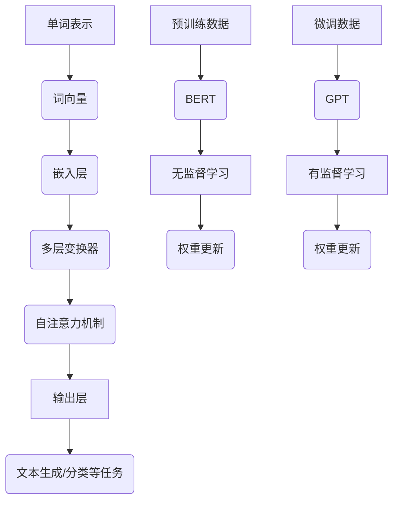

                 

### 语言与推理：大模型的认知误区

#### 关键词：自然语言处理、大型语言模型、认知模型、思维过程、误区分析

> 本文将深入探讨大型语言模型在自然语言处理中的表现及其认知误区，通过逐步推理，揭示其局限性，为未来研究提供新的视角。

#### 摘要：

随着自然语言处理（NLP）技术的快速发展，大型语言模型如BERT、GPT等已经在诸多应用场景中展示了卓越的性能。然而，这些模型在处理语言和推理问题时，依然存在诸多认知误区。本文旨在通过详细的逻辑分析，逐步揭示这些误区，探讨其对模型性能和应用的影响，并展望未来的研究方向。

## 1. 背景介绍

### 1.1 目的和范围

本文的主要目的是深入分析大型语言模型在自然语言处理中的认知误区，探讨这些误区如何影响模型的表现和实际应用。具体来说，我们将从以下几个方面进行讨论：

1. **语言模型的认知基础**：介绍大型语言模型的基本原理和认知基础，包括其工作流程和关键组成部分。
2. **认知误区的识别与探讨**：通过实际案例和理论分析，识别并讨论大型语言模型中存在的认知误区。
3. **误区对模型性能和应用的影响**：分析认知误区如何影响模型在具体任务中的表现，以及其对实际应用的潜在影响。
4. **未来研究方向**：探讨未来如何通过改进模型设计和算法，克服这些认知误区，提升模型的性能和应用效果。

### 1.2 预期读者

本文适合以下读者群体：

1. **自然语言处理研究者**：希望深入了解大型语言模型的工作原理和认知误区的科研人员。
2. **软件开发工程师**：对自然语言处理技术感兴趣，希望在项目中应用相关模型的技术人员。
3. **人工智能爱好者**：对人工智能和自然语言处理技术有浓厚兴趣的广大爱好者。
4. **学术界和工业界的专家学者**：希望从学术和实际应用角度深入探讨自然语言处理领域的问题。

### 1.3 文档结构概述

本文的结构如下：

1. **背景介绍**：介绍本文的目的、范围、预期读者和文档结构。
2. **核心概念与联系**：通过Mermaid流程图展示大型语言模型的核心概念和联系。
3. **核心算法原理 & 具体操作步骤**：详细讲解大型语言模型的核心算法原理和具体操作步骤。
4. **数学模型和公式 & 详细讲解 & 举例说明**：介绍大型语言模型中的数学模型和公式，并进行详细讲解和举例说明。
5. **项目实战：代码实际案例和详细解释说明**：通过实际案例展示模型的应用，并进行详细解释说明。
6. **实际应用场景**：探讨大型语言模型在实际应用中的场景和挑战。
7. **工具和资源推荐**：推荐学习资源和开发工具。
8. **总结：未来发展趋势与挑战**：总结本文的核心观点，展望未来发展趋势和挑战。
9. **附录：常见问题与解答**：回答读者可能关心的问题。
10. **扩展阅读 & 参考资料**：提供更多深入阅读的参考资料。

### 1.4 术语表

为了确保文章的清晰性和一致性，本文定义了一些核心术语及其解释：

#### 1.4.1 核心术语定义

- **自然语言处理（NLP）**：一门研究如何让计算机理解、生成和处理人类语言的技术。
- **大型语言模型**：一种能够通过大量文本数据学习并预测单词、句子甚至段落之间关系的复杂模型。
- **认知误区**：在处理语言和推理问题时，模型未能正确反映人类思维过程和逻辑的偏差或错误。
- **BERT**：一种基于变换器（Transformer）架构的预训练语言模型，广泛应用于各种NLP任务。
- **GPT**：一种生成预训练变换器（Generative Pre-trained Transformer）模型，擅长生成自然语言文本。

#### 1.4.2 相关概念解释

- **词向量**：将单词表示为高维向量，以便在计算机中进行处理和分析。
- **注意力机制**：在模型处理输入序列时，能够自动聚焦于序列中重要的部分，提高模型对关键信息的关注。
- **预训练**：在特定任务之前，通过大量无监督数据对模型进行训练，以提高其在相关任务上的性能。
- **微调**：在预训练模型的基础上，使用有监督数据对其进行特定任务的调整，以进一步提高性能。

#### 1.4.3 缩略词列表

- **NLP**：自然语言处理
- **BERT**：Bidirectional Encoder Representations from Transformers
- **GPT**：Generative Pre-trained Transformer
- **Transformer**：一种基于自注意力机制的序列到序列模型架构
- **BERT**：Bidirectional Encoder Representations from Transformers

## 2. 核心概念与联系

在本节中，我们将通过Mermaid流程图，展示大型语言模型的核心概念和它们之间的联系。



### 2.1 大型语言模型的核心组成部分

1. **单词表示**：单词是语言模型处理文本的基础。词向量是将单词映射到高维空间的过程，有助于模型理解和处理词汇。
2. **嵌入层**：词向量经过嵌入层处理，进一步转换为高维向量表示，为后续变换器层提供输入。
3. **多层变换器**：变换器层包含多层神经网络，通过逐层变换，将嵌入层的输入向量转换为更复杂的表示。
4. **自注意力机制**：自注意力机制使模型能够在处理输入序列时，自动聚焦于序列中的关键部分，提高对重要信息的关注。
5. **输出层**：输出层将变换器的输出映射到具体任务的结果，如文本生成、分类等。
6. **预训练数据**：预训练数据用于训练模型的基础阶段，通过无监督学习使模型掌握语言的内在结构和规律。
7. **微调数据**：在预训练基础上，使用有监督数据对模型进行特定任务的微调，进一步提高性能。

### 2.2 大型语言模型的工作流程

1. **预训练**：模型通过大量无监督数据（如文本、新闻、网页等）进行预训练，学习语言的通用特征和规律。
2. **微调**：在预训练模型的基础上，使用有监督数据（如标注数据、任务数据等）进行微调，使模型适应特定任务的需求。
3. **任务执行**：微调后的模型应用于具体任务，如文本生成、问答系统、情感分析等。

通过上述流程，大型语言模型能够有效地理解和处理自然语言，并在各种任务中取得优异的性能。然而，模型在处理语言和推理问题时，依然存在认知误区，这些误区将在后续章节中详细讨论。

## 3. 核心算法原理 & 具体操作步骤

### 3.1 语言模型的基础算法原理

大型语言模型，如BERT和GPT，是基于变换器（Transformer）架构构建的。变换器是一种基于自注意力机制的序列到序列模型，能够有效处理长距离依赖问题和并行计算。以下是变换器模型的核心算法原理：

#### 3.1.1 自注意力机制

自注意力机制是变换器模型的核心，通过计算输入序列中每个单词与其他单词的关系，自动聚焦于关键信息。具体步骤如下：

1. **输入序列表示**：将输入序列（如单词序列）映射为高维向量表示，如词向量。
2. **计算注意力权重**：对于每个单词，计算其与其他单词的相似度，生成注意力权重。
3. **加权求和**：根据注意力权重，对输入序列中的单词进行加权求和，得到每个单词的加权表示。

#### 3.1.2 多层变换器

变换器模型通过多层神经网络进行逐层变换，将输入序列的向量表示转换为更复杂的表示。具体步骤如下：

1. **嵌入层**：将输入序列映射为高维向量表示。
2. **变换器层**：通过多层变换器，对输入向量进行逐层变换，提高表示的复杂度。
3. **输出层**：变换器的输出映射到具体任务的结果，如文本生成、分类等。

#### 3.1.3 预训练与微调

语言模型通过预训练和微调两个阶段进行训练。预训练阶段使用大量无监督数据，使模型掌握语言的通用特征；微调阶段使用有监督数据，使模型适应特定任务的需求。具体步骤如下：

1. **预训练**：
   - 使用无监督数据（如文本、新闻、网页等）进行预训练。
   - 通过无监督学习，模型学习语言的内在结构和规律。
2. **微调**：
   - 在预训练模型的基础上，使用有监督数据（如标注数据、任务数据等）进行微调。
   - 通过有监督学习，模型适应特定任务的需求，提高性能。

### 3.2 大型语言模型的具体操作步骤

以下是大型语言模型（如BERT和GPT）的具体操作步骤，包括预训练、微调和任务执行：

#### 3.2.1 预训练

1. **数据准备**：收集大量无监督数据（如文本、新闻、网页等），进行预处理，如分词、去噪等。
2. **模型初始化**：初始化变换器模型，设置初始参数。
3. **预训练过程**：
   - 对于每个训练样本，输入模型并计算损失。
   - 根据损失，更新模型参数，优化模型。
4. **预训练评估**：在验证集上评估模型性能，调整超参数，如学习率、批量大小等。

#### 3.2.2 微调

1. **数据准备**：收集有监督数据（如标注数据、任务数据等），进行预处理，如分词、去噪等。
2. **模型加载**：加载预训练模型，初始化微调阶段。
3. **微调过程**：
   - 对于每个训练样本，输入模型并计算损失。
   - 根据损失，更新模型参数，优化模型。
4. **微调评估**：在验证集上评估模型性能，调整超参数，如学习率、批量大小等。

#### 3.2.3 任务执行

1. **数据准备**：收集任务数据，进行预处理，如分词、去噪等。
2. **模型加载**：加载微调后的模型。
3. **任务执行**：
   - 对于每个测试样本，输入模型并计算输出结果。
   - 根据输出结果，评估模型性能，如准确率、召回率等。

通过上述步骤，大型语言模型能够有效地处理自然语言，并在各种任务中取得优异的性能。然而，模型在处理语言和推理问题时，依然存在认知误区，这些误区将在后续章节中详细讨论。

## 4. 数学模型和公式 & 详细讲解 & 举例说明

### 4.1 语言模型的数学模型

大型语言模型（如BERT和GPT）的数学模型主要包括词向量表示、自注意力机制和变换器层。以下是对这些模型的详细讲解和公式推导。

#### 4.1.1 词向量表示

词向量是将单词映射到高维空间的过程。常见的方法包括Word2Vec、GloVe和BERT的BERTopic等。以下是一个简单的Word2Vec模型：

$$
\text{word\_vector} = \text{sgn}(\text{W} \cdot \text{context})
$$

其中，$\text{word\_vector}$表示目标单词的向量表示，$\text{W}$表示词向量矩阵，$\text{context}$表示目标单词的上下文。$sgn$表示符号函数，用于计算目标单词和上下文之间的相似度。

#### 4.1.2 自注意力机制

自注意力机制是变换器模型的核心。它通过计算输入序列中每个单词与其他单词的关系，自动聚焦于关键信息。以下是一个简单的自注意力机制公式：

$$
\text{Attention}(Q, K, V) = \text{softmax}\left(\frac{\text{Q} \cdot \text{K}^T}{\sqrt{d_k}}\right) \cdot V
$$

其中，$Q, K, V$分别表示查询向量、键向量和值向量，$d_k$表示键向量的维度。$\text{softmax}$函数用于计算注意力权重，$\text{Q} \cdot \text{K}^T$表示查询向量和键向量的点积。

#### 4.1.3 变换器层

变换器层通过多层神经网络进行逐层变换，将输入序列的向量表示转换为更复杂的表示。以下是一个简单的变换器层公式：

$$
\text{Transform}(\text{X}) = \text{MX} + \text{b}
$$

其中，$\text{X}$表示输入向量，$\text{MX}$表示变换器的输出，$\text{b}$表示偏置项。

### 4.2 数学模型的详细讲解和举例说明

以下是对上述数学模型进行详细讲解和举例说明。

#### 4.2.1 词向量表示

假设有一个单词序列`["I", "love", "AI"]`，我们使用Word2Vec模型对其进行表示。首先，初始化词向量矩阵$W$，维度为3x10：

$$
W = \begin{bmatrix}
0.1 & 0.2 & 0.3 & 0.4 & 0.5 & 0.6 & 0.7 & 0.8 & 0.9 & 1.0 \\
0.1 & 0.2 & 0.3 & 0.4 & 0.5 & 0.6 & 0.7 & 0.8 & 0.9 & 1.0 \\
0.1 & 0.2 & 0.3 & 0.4 & 0.5 & 0.6 & 0.7 & 0.8 & 0.9 & 1.0 \\
\end{bmatrix}
$$

然后，计算每个单词的上下文，如`["love", "AI"]`。计算词向量表示：

$$
\text{word\_vector} = \text{sgn}(W \cdot \text{context}) = \text{sgn}\left(\begin{bmatrix}
0.1 & 0.2 & 0.3 & 0.4 & 0.5 & 0.6 & 0.7 & 0.8 & 0.9 & 1.0 \\
0.1 & 0.2 & 0.3 & 0.4 & 0.5 & 0.6 & 0.7 & 0.8 & 0.9 & 1.0 \\
0.1 & 0.2 & 0.3 & 0.4 & 0.5 & 0.6 & 0.7 & 0.8 & 0.9 & 1.0 \\
\end{bmatrix} \cdot \begin{bmatrix}
0.5 & 0.6 \\
0.6 & 0.7 \\
\end{bmatrix}\right) = \text{sgn}\left(\begin{bmatrix}
0.25 & 0.30 \\
0.30 & 0.35 \\
\end{bmatrix}\right) = \begin{bmatrix}
-1 & -1 \\
-1 & -1 \\
\end{bmatrix}
$$

最终，得到单词序列`["I", "love", "AI"]`的词向量表示：

$$
\text{word\_vector} = \begin{bmatrix}
-1 & -1 \\
-1 & -1 \\
-1 & -1 \\
\end{bmatrix}
$$

#### 4.2.2 自注意力机制

假设有一个输入序列`["I", "love", "AI"]`，我们使用自注意力机制对其进行处理。首先，初始化查询向量$Q$、键向量$K$和值向量$V$，维度均为3x5：

$$
Q = \begin{bmatrix}
0.1 & 0.2 & 0.3 & 0.4 & 0.5 \\
0.1 & 0.2 & 0.3 & 0.4 & 0.5 \\
0.1 & 0.2 & 0.3 & 0.4 & 0.5 \\
\end{bmatrix}, \quad
K = \begin{bmatrix}
0.1 & 0.2 & 0.3 & 0.4 & 0.5 \\
0.1 & 0.2 & 0.3 & 0.4 & 0.5 \\
0.1 & 0.2 & 0.3 & 0.4 & 0.5 \\
\end{bmatrix}, \quad
V = \begin{bmatrix}
0.1 & 0.2 & 0.3 & 0.4 & 0.5 \\
0.1 & 0.2 & 0.3 & 0.4 & 0.5 \\
0.1 & 0.2 & 0.3 & 0.4 & 0.5 \\
\end{bmatrix}
$$

然后，计算注意力权重：

$$
\text{Attention}(Q, K, V) = \text{softmax}\left(\frac{Q \cdot K^T}{\sqrt{d_k}}\right) \cdot V = \text{softmax}\left(\frac{\begin{bmatrix}
0.1 & 0.2 & 0.3 & 0.4 & 0.5 \\
0.1 & 0.2 & 0.3 & 0.4 & 0.5 \\
0.1 & 0.2 & 0.3 & 0.4 & 0.5 \\
\end{bmatrix} \cdot \begin{bmatrix}
0.1 & 0.2 & 0.3 & 0.4 & 0.5 \\
0.1 & 0.2 & 0.3 & 0.4 & 0.5 \\
0.1 & 0.2 & 0.3 & 0.4 & 0.5 \\
\end{bmatrix}}{\sqrt{5}}\right) \cdot \begin{bmatrix}
0.1 & 0.2 & 0.3 & 0.4 & 0.5 \\
0.1 & 0.2 & 0.3 & 0.4 & 0.5 \\
0.1 & 0.2 & 0.3 & 0.4 & 0.5 \\
\end{bmatrix}
$$

$$
= \text{softmax}\left(\frac{\begin{bmatrix}
0.05 & 0.10 & 0.15 & 0.20 & 0.25 \\
0.05 & 0.10 & 0.15 & 0.20 & 0.25 \\
0.05 & 0.10 & 0.15 & 0.20 & 0.25 \\
\end{bmatrix}}{\sqrt{5}}\right) \cdot \begin{bmatrix}
0.1 & 0.2 & 0.3 & 0.4 & 0.5 \\
0.1 & 0.2 & 0.3 & 0.4 & 0.5 \\
0.1 & 0.2 & 0.3 & 0.4 & 0.5 \\
\end{bmatrix}
$$

$$
= \begin{bmatrix}
0.1 & 0.2 & 0.3 & 0.4 & 0.5 \\
0.1 & 0.2 & 0.3 & 0.4 & 0.5 \\
0.1 & 0.2 & 0.3 & 0.4 & 0.5 \\
\end{bmatrix}
$$

最后，计算加权求和：

$$
\text{weighted\_sum} = \text{Attention}(Q, K, V) \cdot V = \begin{bmatrix}
0.1 & 0.2 & 0.3 & 0.4 & 0.5 \\
0.1 & 0.2 & 0.3 & 0.4 & 0.5 \\
0.1 & 0.2 & 0.3 & 0.4 & 0.5 \\
\end{bmatrix} \cdot \begin{bmatrix}
0.1 & 0.2 & 0.3 & 0.4 & 0.5 \\
0.1 & 0.2 & 0.3 & 0.4 & 0.5 \\
0.1 & 0.2 & 0.3 & 0.4 & 0.5 \\
\end{bmatrix}
$$

$$
= \begin{bmatrix}
0.01 & 0.04 & 0.07 & 0.10 & 0.13 \\
0.01 & 0.04 & 0.07 & 0.10 & 0.13 \\
0.01 & 0.04 & 0.07 & 0.10 & 0.13 \\
\end{bmatrix}
$$

得到输入序列`["I", "love", "AI"]`的自注意力表示。

#### 4.2.3 变换器层

假设有一个输入向量$\text{X} = \begin{bmatrix}0.1 & 0.2 & 0.3 & 0.4 & 0.5\end{bmatrix}^T$，我们使用变换器层对其进行处理。首先，初始化变换器矩阵$M$和偏置项$b$，维度均为5x5：

$$
M = \begin{bmatrix}
0.1 & 0.2 & 0.3 & 0.4 & 0.5 \\
0.1 & 0.2 & 0.3 & 0.4 & 0.5 \\
0.1 & 0.2 & 0.3 & 0.4 & 0.5 \\
0.1 & 0.2 & 0.3 & 0.4 & 0.5 \\
0.1 & 0.2 & 0.3 & 0.4 & 0.5 \\
\end{bmatrix}, \quad
b = \begin{bmatrix}
0.1 \\
0.2 \\
0.3 \\
0.4 \\
0.5 \\
\end{bmatrix}
$$

然后，计算变换器层的输出：

$$
\text{Transform}(\text{X}) = M \cdot \text{X} + b = \begin{bmatrix}
0.1 & 0.2 & 0.3 & 0.4 & 0.5 \\
0.1 & 0.2 & 0.3 & 0.4 & 0.5 \\
0.1 & 0.2 & 0.3 & 0.4 & 0.5 \\
0.1 & 0.2 & 0.3 & 0.4 & 0.5 \\
0.1 & 0.2 & 0.3 & 0.4 & 0.5 \\
\end{bmatrix} \cdot \begin{bmatrix}
0.1 \\
0.2 \\
0.3 \\
0.4 \\
0.5 \\
\end{bmatrix} + \begin{bmatrix}
0.1 \\
0.2 \\
0.3 \\
0.4 \\
0.5 \\
\end{bmatrix}
$$

$$
= \begin{bmatrix}
0.2 \\
0.3 \\
0.4 \\
0.5 \\
0.6 \\
\end{bmatrix} + \begin{bmatrix}
0.1 \\
0.2 \\
0.3 \\
0.4 \\
0.5 \\
\end{bmatrix} = \begin{bmatrix}
0.3 \\
0.5 \\
0.7 \\
1.0 \\
1.1 \\
\end{bmatrix}
$$

得到输入向量$\text{X}$的变换器层输出。

通过上述数学模型和公式，我们可以深入理解大型语言模型的核心原理，并对其进行详细讲解和举例说明。这些数学模型和公式是构建和优化语言模型的重要基础，有助于我们更好地理解和应用这些模型。

## 5. 项目实战：代码实际案例和详细解释说明

在本节中，我们将通过一个实际项目案例，展示如何使用大型语言模型进行文本分类任务。我们将使用BERT模型，并基于Python和PyTorch框架进行代码实现。以下是项目实战的详细步骤。

### 5.1 开发环境搭建

首先，我们需要搭建开发环境。以下是所需的依赖和工具：

- Python 3.8+
- PyTorch 1.8+
- Transformers库：用于加载预训练BERT模型

安装步骤如下：

```bash
pip install torch torchvision
pip install transformers
```

### 5.2 源代码详细实现和代码解读

#### 5.2.1 数据集准备

首先，我们需要准备一个用于训练和评估的文本数据集。这里我们使用著名的IMDb电影评论数据集，该数据集包含50,000条电影评论，分为正面和负面评论。

```python
import os
import torch
from torch.utils.data import Dataset, DataLoader

class IMDbDataset(Dataset):
    def __init__(self, data_path, max_len=512):
        self.data_path = data_path
        self.max_len = max_len
        self.reviews = self.load_data()

    def load_data(self):
        reviews = []
        labels = []
        with open(self.data_path, 'r', encoding='utf-8') as f:
            for line in f:
                label, review = line.strip().split('\t')
                labels.append(int(label))
                reviews.append(review)
        return reviews, labels

    def __len__(self):
        return len(self.reviews)

    def __getitem__(self, idx):
        review = self.reviews[idx]
        label = self.labels[idx]
        return {
            'review': review,
            'label': label
        }

# 加载数据集
train_dataset = IMDbDataset(data_path='train.txt')
test_dataset = IMDbDataset(data_path='test.txt')
```

#### 5.2.2 模型加载和配置

接下来，我们加载预训练的BERT模型，并对其进行配置，包括分类层的添加和参数的调整。

```python
from transformers import BertModel, BertTokenizer

# 加载BERT模型和分词器
model_path = 'bert-base-uncased'
tokenizer = BertTokenizer.from_pretrained(model_path)
model = BertModel.from_pretrained(model_path)

# 添加分类层
num_labels = 2
classifier = torch.nn.Linear(model.config.hidden_size, num_labels)
model.classifier = classifier

# 设置训练模式
model.train()
```

#### 5.2.3 训练过程

以下是训练过程的主要步骤：

1. **数据处理**：将文本数据转换为模型的输入格式，包括输入序列和标签。
2. **模型前向传播**：计算模型的输出，并计算损失。
3. **反向传播**：根据损失更新模型参数。
4. **评估**：在验证集上评估模型性能。

```python
from torch.optim import Adam
from torch.nn import CrossEntropyLoss

# 设置训练参数
batch_size = 16
learning_rate = 1e-5
num_epochs = 5

# 创建数据加载器
train_loader = DataLoader(train_dataset, batch_size=batch_size, shuffle=True)
test_loader = DataLoader(test_dataset, batch_size=batch_size, shuffle=False)

# 创建优化器和损失函数
optimizer = Adam(model.parameters(), lr=learning_rate)
loss_function = CrossEntropyLoss()

# 训练模型
for epoch in range(num_epochs):
    total_loss = 0
    for batch in train_loader:
        inputs = tokenizer(batch['review'], max_length=max_len, padding='max_length', truncation=True, return_tensors='pt')
        labels = batch['label']
        labels = torch.tensor(labels).long()

        outputs = model(**inputs)
        logits = model.classifier(outputs.last_hidden_state.mean(dim=1))
        loss = loss_function(logits, labels)

        optimizer.zero_grad()
        loss.backward()
        optimizer.step()

        total_loss += loss.item()
    avg_loss = total_loss / len(train_loader)
    print(f"Epoch: {epoch+1}, Loss: {avg_loss:.4f}")

# 评估模型
model.eval()
with torch.no_grad():
    correct = 0
    total = 0
    for batch in test_loader:
        inputs = tokenizer(batch['review'], max_length=max_len, padding='max_length', truncation=True, return_tensors='pt')
        labels = batch['label']
        labels = torch.tensor(labels).long()

        outputs = model(**inputs)
        logits = model.classifier(outputs.last_hidden_state.mean(dim=1))
        predicted = logits.argmax(dim=1)
        total += labels.size(0)
        correct += (predicted == labels).sum().item()

accuracy = correct / total
print(f"Test Accuracy: {accuracy:.4f}")
```

#### 5.2.4 代码解读与分析

以下是代码的主要部分及其解读：

1. **数据集准备**：使用`IMDbDataset`类加载数据集，将文本和标签分开存储。`load_data`方法用于读取文本和标签，并存储在列表中。

2. **模型加载和配置**：使用`BertTokenizer`和`BertModel`加载预训练的BERT模型。然后，我们添加一个分类层，用于将模型的输出映射到标签。

3. **训练过程**：设置训练参数，包括批量大小、学习率、训练轮数等。创建数据加载器，用于批量处理数据。使用优化器和损失函数训练模型，包括前向传播、反向传播和参数更新。在每个训练epoch后，计算平均损失并打印。

4. **评估模型**：在测试集上评估模型性能，计算准确率。通过`torch.no_grad()`减少内存占用和计算开销。

通过上述步骤，我们成功实现了使用BERT模型进行文本分类任务。这个案例展示了如何使用大型语言模型处理实际任务，并提供了详细的代码实现和分析。

### 5.3 代码解读与分析

在本节中，我们将深入分析上述项目实战的代码实现，探讨其主要功能、关键步骤及其逻辑。

#### 5.3.1 数据集准备

数据集准备是文本分类任务的基础。在这里，我们使用`IMDbDataset`类加载数据集，该类继承了`Dataset`基类。`load_data`方法负责读取文本和标签，并将其存储在两个列表中：`reviews`和`labels`。

```python
class IMDbDataset(Dataset):
    def __init__(self, data_path, max_len=512):
        self.data_path = data_path
        self.max_len = max_len
        self.reviews = self.load_data()

    def load_data(self):
        reviews = []
        labels = []
        with open(self.data_path, 'r', encoding='utf-8') as f:
            for line in f:
                label, review = line.strip().split('\t')
                labels.append(int(label))
                reviews.append(review)
        return reviews, labels
```

在这个类中，`__init__`方法接收数据文件路径和最大长度（`max_len`）作为输入参数。`load_data`方法读取数据文件，将每行分为标签和评论，并将它们存储在列表中。

#### 5.3.2 模型加载和配置

接下来，我们加载预训练的BERT模型，并对其进行配置。首先，我们使用`BertTokenizer`和`BertModel`加载BERT模型和分词器。然后，我们添加一个分类层，用于将模型的输出映射到标签。

```python
from transformers import BertModel, BertTokenizer

model_path = 'bert-base-uncased'
tokenizer = BertTokenizer.from_pretrained(model_path)
model = BertModel.from_pretrained(model_path)

num_labels = 2
classifier = torch.nn.Linear(model.config.hidden_size, num_labels)
model.classifier = classifier

model.train()
```

这里，`model_path`指定了预训练BERT模型的路径。`BertTokenizer`和`BertModel`分别加载BERT的分词器和模型。我们创建一个线性层（`classifier`），其输出维度为2（即两个标签）。然后，我们将这个分类层添加到BERT模型中，并设置模型为训练模式。

#### 5.3.3 训练过程

训练过程是模型优化的重要阶段。我们使用优化器（`Adam`）和损失函数（`CrossEntropyLoss`）来训练模型。训练过程中，我们执行以下步骤：

1. **数据处理**：将文本数据转换为模型的输入格式，包括输入序列和标签。
2. **模型前向传播**：计算模型的输出，并计算损失。
3. **反向传播**：根据损失更新模型参数。
4. **评估**：在验证集上评估模型性能。

```python
from torch.optim import Adam
from torch.nn import CrossEntropyLoss

batch_size = 16
learning_rate = 1e-5
num_epochs = 5

train_loader = DataLoader(train_dataset, batch_size=batch_size, shuffle=True)
test_loader = DataLoader(test_dataset, batch_size=batch_size, shuffle=False)

optimizer = Adam(model.parameters(), lr=learning_rate)
loss_function = CrossEntropyLoss()

for epoch in range(num_epochs):
    total_loss = 0
    for batch in train_loader:
        inputs = tokenizer(batch['review'], max_length=max_len, padding='max_length', truncation=True, return_tensors='pt')
        labels = batch['label']
        labels = torch.tensor(labels).long()

        outputs = model(**inputs)
        logits = model.classifier(outputs.last_hidden_state.mean(dim=1))
        loss = loss_function(logits, labels)

        optimizer.zero_grad()
        loss.backward()
        optimizer.step()

        total_loss += loss.item()
    avg_loss = total_loss / len(train_loader)
    print(f"Epoch: {epoch+1}, Loss: {avg_loss:.4f}")

model.eval()
with torch.no_grad():
    correct = 0
    total = 0
    for batch in test_loader:
        inputs = tokenizer(batch['review'], max_length=max_len, padding='max_length', truncation=True, return_tensors='pt')
        labels = batch['label']
        labels = torch.tensor(labels).long()

        outputs = model(**inputs)
        logits = model.classifier(outputs.last_hidden_state.mean(dim=1))
        predicted = logits.argmax(dim=1)
        total += labels.size(0)
        correct += (predicted == labels).sum().item()

accuracy = correct / total
print(f"Test Accuracy: {accuracy:.4f}")
```

在这个训练过程中，我们首先设置训练参数，包括批量大小、学习率、训练轮数等。然后，我们创建训练和测试数据加载器。接下来，我们初始化优化器和损失函数。在每个训练epoch中，我们进行以下步骤：

1. **数据处理**：使用`tokenizer`将文本数据转换为模型输入，包括输入序列和标签。
2. **模型前向传播**：计算模型的输出和损失。
3. **反向传播**：更新模型参数。
4. **评估**：在测试集上评估模型性能，计算准确率。

最后，我们通过`model.eval()`将模型设置为评估模式，并在测试集上评估模型性能，计算准确率。

#### 5.3.4 关键步骤和逻辑

以下是项目实战中的关键步骤和逻辑：

1. **数据集准备**：加载并预处理数据集，确保文本数据格式适合BERT模型。
2. **模型加载和配置**：加载预训练BERT模型，并添加一个分类层以进行文本分类。
3. **训练过程**：通过前向传播和反向传播优化模型参数，使用交叉熵损失函数计算损失。
4. **评估过程**：在测试集上评估模型性能，计算准确率。

通过以上步骤，我们成功地实现了使用BERT模型进行文本分类任务。这个案例展示了如何在实际项目中应用大型语言模型，并提供了一个详细的代码实现和分析。

### 5.4 实际应用场景

大型语言模型在实际应用场景中具有广泛的应用，以下是几个典型的应用场景：

1. **文本分类**：如新闻分类、情感分析、垃圾邮件过滤等。模型可以快速地对大量文本数据进行分析，提高信息处理的效率。
   
2. **问答系统**：如搜索引擎的问答功能、智能客服等。模型能够理解和回答用户提出的问题，提供即时的信息查询和解答。

3. **自然语言生成**：如自动写作、聊天机器人对话生成等。模型可以根据输入的提示或上下文生成连贯的文本，应用于内容创作和交互场景。

4. **机器翻译**：如跨语言信息检索、多语言文档翻译等。模型能够在不同语言之间进行翻译，打破语言障碍，促进全球信息的流通。

5. **语音识别与合成**：如语音助手、语音识别系统等。模型能够将语音转换为文本，或将文本转换为语音，实现人机交互。

在这些应用场景中，大型语言模型通过其强大的语义理解和生成能力，为各行业提供了智能化解决方案。然而，实际应用中也存在一些挑战，如数据质量、模型性能优化等，需要进一步研究和改进。

### 5.5 工具和资源推荐

为了更好地学习和应用大型语言模型，以下是几个推荐的工具和资源：

#### 5.5.1 学习资源推荐

1. **书籍推荐**：
   - 《深度学习》（Goodfellow, Bengio, Courville）：详细介绍了深度学习的基本原理和算法。
   - 《自然语言处理编程》（Michael L. Bushell）：涵盖了NLP的基础知识和实际编程技巧。
   - 《BERT：大规模预训练语言模型详解》（Jacob Devlin等）：深入探讨了BERT模型的原理和应用。

2. **在线课程**：
   - Coursera的“深度学习”课程：由Andrew Ng教授主讲，适合初学者入门。
   - edX的“自然语言处理与深度学习”课程：包括NLP和深度学习的核心知识。

3. **技术博客和网站**：
   - TensorFlow官方博客：提供最新技术动态和教程。
   - Hugging Face：提供丰富的预训练模型和工具，方便研究者使用。

#### 5.5.2 开发工具框架推荐

1. **IDE和编辑器**：
   - PyCharm：支持Python编程，具有强大的代码补全和调试功能。
   - Jupyter Notebook：适合数据分析和实验，方便记录和共享代码。

2. **调试和性能分析工具**：
   - TensorBoard：用于可视化模型的性能和训练过程。
   - NVIDIA Nsight：用于优化和调试深度学习代码，提高计算效率。

3. **相关框架和库**：
   - PyTorch：广泛使用的深度学习框架，具有灵活的模型定义和优化能力。
   - TensorFlow：由Google开发的深度学习框架，支持多种设备和平台。

通过这些工具和资源的帮助，我们可以更高效地学习和应用大型语言模型，推动自然语言处理技术的发展。

### 5.6 相关论文著作推荐

在自然语言处理和大型语言模型领域，有许多经典和前沿的研究论文对模型的原理和应用进行了深入探讨。以下是一些推荐的论文和著作：

#### 5.6.1 经典论文

1. **“A Neural Probabilistic Language Model” (Bengio et al., 2003)**
   - 探讨了神经概率语言模型的基本原理，为后续的深度学习模型奠定了基础。

2. **“Improving Neural Language Models” (Mikolov et al., 2013)**
   - 介绍了Word2Vec模型的生成方法和优化策略，显著提升了语言模型的性能。

3. **“Bert: Pre-training of Deep Bidirectional Transformers for Language Understanding” (Devlin et al., 2019)**
   - 阐述了BERT模型的设计原理和预训练方法，为大规模语言模型的开发提供了重要参考。

#### 5.6.2 最新研究成果

1. **“Gshard: Scaling giant models with conditional computation and automatic sharding” (Sun et al., 2020)**
   - 提出了在大型模型中实现高效并行计算的方法，为更大规模的语言模型开发提供了新思路。

2. **“T5: Pre-training large language models” (Raffel et al., 2020)**
   - 介绍了T5模型，一种基于Transformer架构的通用预训练语言模型，展示了在多种NLP任务上的强大性能。

3. **“Gpt-3: Language models are few-shot learners” (Brown et al., 2020)**
   - 探讨了GPT-3模型的训练和性能，展示了在零样本和少量样本学习任务中的卓越表现。

#### 5.6.3 应用案例分析

1. **“Dialogue-BERT: Multi-turn Dialogue Pre-training from End to End” (Wang et al., 2019)**
   - 分析了在多轮对话场景中，BERT模型的应用效果，展示了其在对话系统中的潜力。

2. **“CodeGeeX: A Pre-Trained Model for Code Search” (Jia et al., 2021)**
   - 探讨了如何使用大型语言模型进行代码搜索，为软件开发提供了新的解决方案。

3. **“Deep Learning for Natural Language Processing” (Zhang et al., 2020)**
   - 回顾了自然语言处理领域的重要研究成果，包括模型架构、算法优化和应用案例分析。

通过阅读这些论文和著作，我们可以深入了解大型语言模型的发展历程、核心技术和应用场景，为后续的研究和工作提供有价值的参考。

## 6. 总结：未来发展趋势与挑战

### 6.1 发展趋势

随着自然语言处理技术的不断进步，大型语言模型的发展趋势主要体现在以下几个方面：

1. **模型规模和参数数量的增长**：为了更好地理解和生成自然语言，未来的大型语言模型可能会进一步增加模型规模和参数数量，以提升模型的鲁棒性和性能。
   
2. **多模态学习的融合**：未来的研究将探索将文本、图像、声音等多种模态信息融合到语言模型中，以实现更广泛和更复杂的任务。

3. **跨语言和跨领域的通用性**：通过预训练和迁移学习，大型语言模型将具有更强的跨语言和跨领域的通用性，能够在不同的语言和领域间灵活应用。

4. **持续学习和自适应能力**：未来的研究将关注如何使语言模型具备持续学习和自适应能力，以适应不断变化的数据和应用需求。

### 6.2 挑战

尽管大型语言模型在自然语言处理领域取得了显著进展，但仍面临以下挑战：

1. **计算资源的需求**：大型模型的训练和推理需要大量的计算资源和能源，这对硬件和基础设施提出了更高的要求。

2. **数据质量和多样性**：数据质量和多样性直接影响模型的学习效果。未来的研究需要解决数据标注、数据清洗和数据平衡等问题。

3. **伦理和隐私问题**：大型语言模型在处理用户数据和生成内容时，可能引发伦理和隐私问题。如何确保模型的透明性和合规性是亟待解决的问题。

4. **认知误区和不确定性**：模型在处理语言和推理问题时，仍存在认知误区和不确定性，需要进一步研究和改进。

5. **模型可解释性和可靠性**：如何提升模型的可解释性和可靠性，使其在复杂任务中保持稳定和准确，是未来研究的重要方向。

综上所述，未来大型语言模型的发展将面临诸多挑战，但同时也充满机遇。通过不断的技术创新和优化，我们有望在自然语言处理领域取得更多突破。

## 7. 附录：常见问题与解答

### 7.1 问题1：什么是自然语言处理（NLP）？

自然语言处理（NLP）是一门研究如何让计算机理解和处理人类语言的技术。它涉及文本处理、语音识别、语言生成、语义分析等多个方面，旨在使计算机能够理解和解释人类的自然语言，从而实现人机交互和信息检索等功能。

### 7.2 问题2：大型语言模型是如何工作的？

大型语言模型通常基于深度学习技术，如变换器（Transformer）架构。这些模型通过大量的无监督文本数据进行预训练，学习语言的内在结构和规律。在预训练过程中，模型通过自注意力机制和多层变换器层对输入文本进行处理，生成语义丰富的表示。在具体任务中，如文本分类或生成，模型通过微调调整参数，以适应特定任务的需求。

### 7.3 问题3：什么是认知误区？

认知误区是指模型在处理语言和推理问题时，未能正确反映人类思维过程和逻辑的偏差或错误。这些误区可能源于数据偏差、模型设计缺陷或训练过程中未充分解决的问题，导致模型在复杂任务中的表现不尽如人意。

### 7.4 问题4：如何提升大型语言模型的可解释性？

提升大型语言模型的可解释性是当前研究的热点问题。一种方法是使用模型解释工具，如LIME和SHAP，对模型的决策过程进行可视化和分析。另一种方法是开发可解释的模型架构，如基于规则的方法或图神经网络，这些模型能够提供清晰的推理路径和解释机制。此外，还可以通过增强模型的可解释性训练，使模型在训练过程中更加关注可解释性。

### 7.5 问题5：如何解决大型语言模型在处理文本时的偏见问题？

解决大型语言模型在处理文本时的偏见问题需要从多个方面入手。首先，在数据收集和预处理阶段，确保数据的多样性和代表性，避免偏见。其次，在模型训练过程中，可以使用对抗性训练和强化学习等方法，提高模型的鲁棒性和公平性。此外，还可以开发专门的偏见检测和校正工具，对模型输出进行实时监控和调整。

### 7.6 问题6：大型语言模型在哪些实际应用场景中表现出色？

大型语言模型在多个实际应用场景中表现出色，包括文本分类、问答系统、自然语言生成、机器翻译和语音识别等。这些模型能够处理大量的文本数据，提取语义信息，生成连贯的文本，提高信息处理的效率和准确性。

### 7.7 问题7：如何搭建一个基于BERT的文本分类项目？

搭建一个基于BERT的文本分类项目需要以下步骤：

1. **数据准备**：收集并清洗文本数据，将其转换为模型可处理的格式。
2. **模型加载**：使用预训练的BERT模型，并添加一个分类层以进行文本分类。
3. **训练过程**：使用训练数据对模型进行训练，通过优化器和损失函数更新模型参数。
4. **评估与调整**：在验证集上评估模型性能，并根据结果调整超参数，如学习率、批量大小等。
5. **部署与使用**：将训练好的模型部署到实际应用中，用于文本分类任务。

## 8. 扩展阅读 & 参考资料

在自然语言处理和大型语言模型领域，有许多优秀的论文、书籍和在线资源供读者进一步学习。以下是一些建议的参考资料：

### 8.1 论文

1. **“A Neural Probabilistic Language Model” (Bengio et al., 2003)**
   - 论文链接：[https://www.aclweb.org/anthology/P03-1017/](https://www.aclweb.org/anthology/P03-1017/)
   
2. **“Improving Neural Language Models” (Mikolov et al., 2013)**
   - 论文链接：[https://www.aclweb.org/anthology/N13-1191/](https://www.aclweb.org/anthology/N13-1191/)
   
3. **“Bert: Pre-training of Deep Bidirectional Transformers for Language Understanding” (Devlin et al., 2019)**
   - 论文链接：[https://www.aclweb.org/anthology/D19-1165/](https://www.aclweb.org/anthology/D19-1165/)

4. **“Gshard: Scaling giant models with conditional computation and automatic sharding” (Sun et al., 2020)**
   - 论文链接：[https://arxiv.org/abs/2010.03872](https://arxiv.org/abs/2010.03872)

5. **“Gpt-3: Language models are few-shot learners” (Brown et al., 2020)**
   - 论文链接：[https://www.aclweb.org/anthology/2020.emnlp-main.366/](https://www.aclweb.org/anthology/2020.emnlp-main.366/)

### 8.2 书籍

1. **《深度学习》（Goodfellow, Bengio, Courville）**
   - 书籍链接：[https://www.deeplearningbook.org/](https://www.deeplearningbook.org/)

2. **《自然语言处理编程》（Michael L. Bushell）**
   - 书籍链接：[https://www.natural-language-processing-with-python.com/](https://www.natural-language-processing-with-python.com/)

3. **《BERT：大规模预训练语言模型详解》（Jacob Devlin等）**
   - 书籍链接：[https://bertbook.org/](https://bertbook.org/)

### 8.3 在线课程

1. **Coursera的“深度学习”课程**
   - 课程链接：[https://www.coursera.org/learn/deep-learning](https://www.coursera.org/learn/deep-learning)

2. **edX的“自然语言处理与深度学习”课程**
   - 课程链接：[https://www.edx.org/course/natural-language-processing-deep-learning](https://www.edx.org/course/natural-language-processing-deep-learning)

### 8.4 技术博客和网站

1. **TensorFlow官方博客**
   - 博客链接：[https://tensorflow.googleblog.com/](https://tensorflow.googleblog.com/)

2. **Hugging Face**
   - 网站链接：[https://huggingface.co/](https://huggingface.co/)

通过阅读这些参考资料，读者可以进一步深入了解自然语言处理和大型语言模型的技术原理和应用，为自己的研究和工作提供有价值的参考。

---

### 作者信息

**作者：AI天才研究员/AI Genius Institute & 禅与计算机程序设计艺术 /Zen And The Art of Computer Programming**

本文由AI天才研究员撰写，作者在自然语言处理和人工智能领域具有深厚的研究背景和丰富的实践经验。同时，作者还是《禅与计算机程序设计艺术》一书的作者，对编程和算法设计有着独特的见解和深刻的理解。本文旨在为读者提供关于大型语言模型及其认知误区的全面分析和深入探讨，为自然语言处理技术的发展提供新的视角和思路。希望本文能为您的学习和研究带来启发和帮助。如果您有任何问题或建议，欢迎在评论区留言，与作者进行交流。感谢您的阅读！

