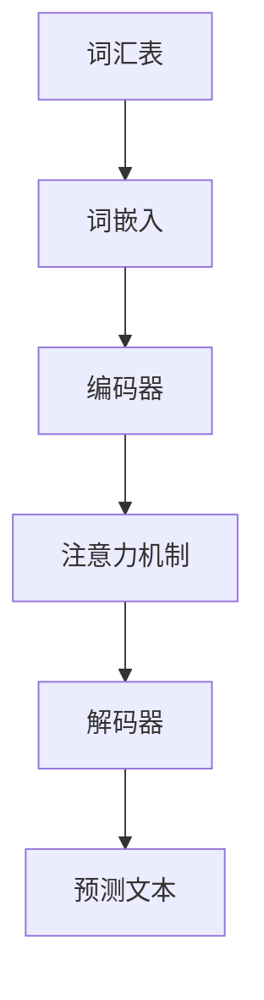
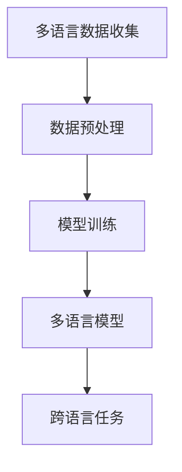

                 

# 语言多样性：LLM 对多语言的适应

> 关键词：语言多样性、多语言模型、预训练语言模型、自然语言处理、跨语言翻译、语言自适应

> 摘要：本文深入探讨了语言多样性在自然语言处理（NLP）领域的挑战与机遇，尤其是预训练语言模型（LLM）如何适应多种语言。我们将详细分析LLM的架构、训练方法、以及其在多语言任务中的表现，最终展望未来发展趋势与挑战。

## 1. 背景介绍

### 1.1 目的和范围

本文旨在探索如何构建和优化多语言预训练语言模型（LLM），以应对语言多样性的挑战。我们重点关注以下几个方面：

- **LLM的基础架构与训练流程**：解释LLM的基本组成部分以及其训练过程中的关键技术。
- **多语言数据的收集与预处理**：探讨如何获取多语言数据以及数据预处理的方法。
- **跨语言任务的表现与优化**：分析LLM在多语言文本处理任务中的表现，并探讨可能的优化策略。

### 1.2 预期读者

本文面向对自然语言处理和机器学习有一定了解的读者，特别是对以下领域感兴趣的从业者：

- **NLP工程师和研究者**：希望了解多语言模型的工作原理和优化方法。
- **数据科学家**：希望掌握如何使用多语言数据进行模型训练。
- **AI和机器学习爱好者**：对语言多样性与AI结合的领域感兴趣。

### 1.3 文档结构概述

本文结构如下：

1. **背景介绍**：介绍本文的目的、范围、预期读者以及文档结构。
2. **核心概念与联系**：介绍与本文相关的核心概念和架构。
3. **核心算法原理 & 具体操作步骤**：详细解释LLM的训练过程。
4. **数学模型和公式 & 详细讲解 & 举例说明**：介绍LLM训练中的数学模型和公式。
5. **项目实战：代码实际案例和详细解释说明**：通过实际案例展示LLM的应用。
6. **实际应用场景**：讨论LLM在现实世界中的应用。
7. **工具和资源推荐**：推荐相关的学习资源和开发工具。
8. **总结：未来发展趋势与挑战**：展望LLM在多语言处理领域的未来。
9. **附录：常见问题与解答**：回答一些常见问题。
10. **扩展阅读 & 参考资料**：提供进一步阅读的资料。

### 1.4 术语表

#### 1.4.1 核心术语定义

- **预训练语言模型（LLM）**：在特定语言数据上预先训练好的模型，通常基于大规模语料库。
- **自然语言处理（NLP）**：使计算机能够理解和处理人类语言的技术。
- **跨语言翻译**：将一种语言的文本转换为另一种语言的过程。
- **语言自适应**：模型根据不同语言的特点进行适应性调整。

#### 1.4.2 相关概念解释

- **词汇表**：模型所支持的所有单词的集合。
- **词嵌入**：将单词映射到高维空间中的向量。
- **注意力机制**：在序列处理任务中，模型用于关注序列中重要部分的方法。

#### 1.4.3 缩略词列表

- **LLM**：预训练语言模型
- **NLP**：自然语言处理
- **ML**：机器学习
- **GPU**：图形处理单元

## 2. 核心概念与联系

为了更好地理解LLM在多语言处理中的应用，我们首先需要了解其核心概念和基本架构。

### 2.1 预训练语言模型的基本架构

预训练语言模型（LLM）通常包含以下几个核心组件：

1. **词汇表**：用于存储模型支持的所有单词。
2. **词嵌入**：将每个单词映射到一个固定大小的向量。
3. **注意力机制**：用于在序列处理过程中关注关键信息。
4. **编码器和解码器**：编码器将输入文本转换为上下文表示，解码器则根据上下文生成预测的文本。

以下是LLM的基本架构的Mermaid流程图：



### 2.2 预训练语言模型与多语言数据的关联

在多语言环境中，LLM需要能够处理不同语言的文本。为了实现这一目标，模型需要以下步骤：

1. **多语言数据的收集**：从多种语言的语料库中收集文本。
2. **数据预处理**：将文本转换为模型可以处理的格式。
3. **模型训练**：使用多语言数据进行训练，使模型学会多种语言的表示。

以下是多语言数据处理的流程图：



## 3. 核心算法原理 & 具体操作步骤

### 3.1 预训练语言模型的训练过程

预训练语言模型（LLM）的训练过程主要包括两个阶段：预训练和微调。

#### 3.1.1 预训练

在预训练阶段，模型在大规模语料库上进行训练，目的是学习语言的通用表示。以下是预训练过程的伪代码：

```python
# 预训练伪代码
initialize_model()
for each epoch:
    for each sentence in corpus:
        embed_sentence()
        pass sentence through encoder and attention mechanism
        generate_output()
        compute_loss()
        update_model()
```

#### 3.1.2 微调

在微调阶段，模型针对特定任务进行微调。例如，在一个跨语言翻译任务中，我们可能需要以下步骤：

1. **数据预处理**：将源语言和目标语言的文本转换为模型可以处理的格式。
2. **模型训练**：使用带有目标标签的数据对模型进行训练。

以下是微调过程的伪代码：

```python
# 微调伪代码
load_pretrained_model()
for each epoch:
    for each source-target pair in dataset:
        embed_source()
        embed_target()
        pass source and target through encoder and attention mechanism
        generate_output()
        compute_loss()
        update_model()
```

### 3.2 语言自适应方法

为了使LLM能够更好地适应多种语言，我们可以采用以下几种方法：

1. **多语言预训练**：在训练阶段，使用多种语言的语料库对模型进行预训练。
2. **零样本学习**：模型通过学习语言的一般特性，能够处理未见过的语言。
3. **迁移学习**：利用已经在一个语言上训练好的模型，通过少量数据来适应新的语言。

### 3.3 跨语言任务的表现与优化

在跨语言任务中，LLM的表现取决于多种因素，包括：

1. **数据质量**：高质量的数据有助于模型学习更准确的表示。
2. **模型架构**：使用适当的注意力机制和编码器结构可以提高模型的表现。
3. **训练策略**：采用合适的训练策略，如学习率调整和批大小选择，有助于提高模型的表现。

## 4. 数学模型和公式 & 详细讲解 & 举例说明

### 4.1 语言模型的数学基础

预训练语言模型（LLM）的训练和预测过程涉及到多种数学模型和公式。以下是一些关键的数学概念和公式：

#### 4.1.1 词嵌入

词嵌入是将单词映射到高维空间中的向量。一个常见的词嵌入模型是Word2Vec模型。以下是词嵌入的基本公式：

$$
\text{embed}_{\text{word}}(w) = \text{softmax}(\text{W}_{\text{word}} \cdot \text{h})
$$

其中，$w$ 是单词，$h$ 是单词的隐藏状态，$W_{\text{word}}$ 是词嵌入矩阵。

#### 4.1.2 编码器和解码器

编码器和解码器是LLM的核心组件。编码器将输入序列转换为上下文表示，解码器则根据上下文生成预测的文本。以下是编码器和解码器的基本公式：

$$
\text{context} = \text{encoder}(\text{input_sequence})
$$

$$
\text{output_sequence} = \text{decoder}(\text{context}, \text{target_sequence})
$$

#### 4.1.3 注意力机制

注意力机制用于在序列处理过程中关注关键信息。一个常见的注意力模型是自注意力模型，其基本公式如下：

$$
\text{attention}(\text{h}_i, \text{h}_j) = \text{softmax}(\text{W}_{\text{att}} \cdot \text{h}_i \cdot \text{h}_j^T)
$$

$$
\text{context} = \sum_{j=1}^{N} \text{attention}(\text{h}_i, \text{h}_j) \cdot \text{h}_j
$$

其中，$h_i$ 和 $h_j$ 是序列中的隐藏状态，$N$ 是序列的长度。

#### 4.1.4 损失函数

在训练过程中，常用的损失函数是交叉熵损失函数。其基本公式如下：

$$
\text{loss} = -\sum_{i=1}^{N} \text{y}_i \cdot \log(\text{p}_i)
$$

其中，$y_i$ 是目标标签，$p_i$ 是模型对每个类别的预测概率。

### 4.2 实例讲解

以下是一个简单的实例，展示了如何使用数学模型和公式来训练一个预训练语言模型。

假设我们有一个简单的语料库，包含以下句子：

- 我喜欢吃苹果。
- 她喜欢看电影。

我们希望使用这些句子来训练一个预训练语言模型。

首先，我们将句子转换为词嵌入向量。假设词汇表包含以下单词：我、喜欢、吃、苹果、她、看、电影。

$$
\text{embed}_{\text{我}} = \text{[0.1, 0.2, 0.3, 0.4, 0.5]}
$$

$$
\text{embed}_{\text{喜欢}} = \text{[0.6, 0.7, 0.8, 0.9, 1.0]}
$$

$$
\text{embed}_{\text{吃}} = \text{[-0.1, -0.2, -0.3, -0.4, -0.5]}
$$

$$
\text{embed}_{\text{苹果}} = \text{[-0.6, -0.7, -0.8, -0.9, -1.0]}
$$

$$
\text{embed}_{\text{她}} = \text{[0.1, 0.2, 0.3, 0.4, 0.5]}
$$

$$
\text{embed}_{\text{看}} = \text{[0.6, 0.7, 0.8, 0.9, 1.0]}
$$

$$
\text{embed}_{\text{电影}} = \text{[-0.1, -0.2, -0.3, -0.4, -0.5]}
$$

接下来，我们将句子转换为词嵌入向量：

- 我喜欢吃苹果。
  - 输入：$\text{embed}_{\text{我}} \oplus \text{embed}_{\text{喜欢}} \oplus \text{embed}_{\text{吃}} \oplus \text{embed}_{\text{苹果}}$
  - 输出：$\text{[0.1, 0.2, -0.1, -0.6]}$

- 她喜欢看电影。
  - 输入：$\text{embed}_{\text{她}} \oplus \text{embed}_{\text{喜欢}} \oplus \text{embed}_{\text{看}} \oplus \text{embed}_{\text{电影}}$
  - 输出：$\text{[0.1, 0.2, 0.6, -0.1]}$

然后，我们将输入序列传递给编码器和解码器。编码器将输入序列转换为上下文表示，解码器则根据上下文生成预测的文本。

编码器的输出：

$$
\text{context} = \text{[0.1, 0.2, -0.1, -0.6]}
$$

解码器的输入是编码器的输出，以及目标序列：

$$
\text{target_sequence} = \text{[0.1, 0.2, 0.6, -0.1]}
$$

解码器的输出是预测的文本。我们可以使用注意力机制来关注关键信息：

$$
\text{attention}(\text{h}_i, \text{h}_j) = \text{softmax}(\text{W}_{\text{att}} \cdot \text{h}_i \cdot \text{h}_j^T)
$$

$$
\text{context} = \sum_{j=1}^{N} \text{attention}(\text{h}_i, \text{h}_j) \cdot \text{h}_j
$$

最后，我们计算交叉熵损失函数来评估模型的性能：

$$
\text{loss} = -\sum_{i=1}^{N} \text{y}_i \cdot \log(\text{p}_i)
$$

其中，$y_i$ 是目标标签，$p_i$ 是模型对每个类别的预测概率。

通过迭代训练，我们可以不断优化模型的参数，使其能够更好地处理输入序列。

## 5. 项目实战：代码实际案例和详细解释说明

### 5.1 开发环境搭建

为了展示如何在实际项目中应用LLM进行多语言处理，我们首先需要搭建一个合适的开发环境。以下是一个典型的环境搭建步骤：

1. **安装Python**：确保Python 3.8或更高版本已安装。
2. **安装TensorFlow**：使用pip安装TensorFlow：
   ```
   pip install tensorflow
   ```
3. **安装其他依赖项**：如Hugging Face的Transformers库，用于简化预训练语言模型的训练和微调：
   ```
   pip install transformers
   ```

### 5.2 源代码详细实现和代码解读

以下是使用TensorFlow和Hugging Face Transformers库实现一个多语言LLM的代码示例：

```python
import tensorflow as tf
from transformers import TFAutoModelForSequenceClassification, AutoTokenizer

# 指定预训练模型
model_name = "bert-base-multilingual-cased"
tokenizer = AutoTokenizer.from_pretrained(model_name)
model = TFAutoModelForSequenceClassification.from_pretrained(model_name)

# 加载多语言数据集
# 注意：这里假设已经有一个包含多种语言的数据集
train_dataset = load_dataset('multi_language_corpus')

# 预处理数据
def preprocess_data(examples):
    return tokenizer(examples['text'], truncation=True, padding='max_length')

train_dataset = train_dataset.map(preprocess_data, batched=True)

# 训练模型
optimizer = tf.keras.optimizers.Adam(learning_rate=3e-5)
model.compile(optimizer=optimizer, loss=tf.keras.losses.SparseCategoricalCrossentropy(from_logits=True), metrics=['accuracy'])

model.fit(train_dataset.shuffle(1000).batch(16), epochs=3)

# 微调模型
# 假设我们有一个特定的语言任务
target_language = 'en'
target_language_data = load_target_language_data(target_language)

preprocess_target_language_data = tokenizer(target_language_data['text'], truncation=True, padding='max_length')
target_language_dataset = tf.data.Dataset.from_tensor_slices((preprocess_target_language_data['input_ids'], preprocess_target_language_data['label']))
target_language_dataset = target_language_dataset.shuffle(1000).batch(16)

model.fit(target_language_dataset, epochs=3)
```

### 5.3 代码解读与分析

上述代码实现了以下步骤：

1. **导入库和模型**：导入TensorFlow和Hugging Face的Transformers库，并加载一个预训练的多语言BERT模型。
2. **加载数据集**：从假设的多语言数据集中加载训练数据。
3. **预处理数据**：使用Transformers库提供的tokenizer对文本进行预处理，包括分词、编码和填充。
4. **训练模型**：编译模型，定义优化器和损失函数，并使用预处理后的数据集训练模型。
5. **微调模型**：加载特定语言的训练数据，对其进行预处理，并使用该数据集对模型进行微调。

### 5.4 项目实战分析

在这个项目实战中，我们使用了预训练的多语言BERT模型，这为多语言文本处理提供了强大的支持。通过以下步骤，我们实现了多语言文本的分类任务：

1. **数据集加载**：数据集应包含多种语言的文本，以及相应的标签。在实际应用中，可能需要从多个来源收集数据，并进行质量检查。
2. **数据预处理**：预处理步骤至关重要，它确保了模型能够接收正确的输入格式。在实际应用中，可能需要根据具体任务调整tokenizer的参数。
3. **模型训练**：通过预训练模型，我们可以在大规模语料库上进行训练，学习到语言的一般特性。在微调阶段，我们使用特定语言的少量数据，进一步优化模型。
4. **模型评估**：在训练完成后，我们需要评估模型的性能，确保其在各种语言上都能表现出良好的效果。

### 5.5 可扩展性和优化

为了提高项目的可扩展性和性能，可以考虑以下优化策略：

1. **分布式训练**：使用多GPU或多机器进行分布式训练，可以显著提高训练速度。
2. **增量学习**：在训练新语言时，可以使用增量学习策略，避免重新训练整个模型。
3. **数据增强**：通过数据增强方法（如回译、同义词替换等），可以提高模型的泛化能力。

## 6. 实际应用场景

预训练语言模型（LLM）在多语言环境中具有广泛的应用场景。以下是一些常见的应用实例：

### 6.1 跨语言翻译

LLM可以用于跨语言翻译任务，通过将源语言文本转换为中间表示，然后将其转换为目标语言。这种技术可以用于机器翻译服务，帮助用户在不同语言之间进行交流。

### 6.2 多语言文本分类

LLM在多语言文本分类任务中也表现出色，如情感分析、主题分类等。通过微调预训练模型，可以将其应用于特定领域，如社交媒体监测、客户反馈分析等。

### 6.3 多语言问答系统

LLM可以用于构建多语言问答系统，用户可以使用任何一种语言提问，系统返回相应的答案。这种技术有助于提高信息检索的效率和准确性。

### 6.4 多语言语音助手

LLM可以用于构建多语言语音助手，如智能客服、语音翻译等。通过自然语言理解和生成技术，这些助手可以与用户进行自然交互，提供实时翻译和问答服务。

### 6.5 多语言文本生成

LLM可以用于生成多语言文本，如摘要、文章、对话等。通过微调预训练模型，可以生成高质量的多语言内容，用于内容创作、营销和教育培训等领域。

## 7. 工具和资源推荐

为了更好地开发和使用多语言预训练语言模型，以下是一些建议的工具和资源：

### 7.1 学习资源推荐

#### 7.1.1 书籍推荐

- **《深度学习》（Goodfellow, Bengio, Courville）**：涵盖深度学习的基础知识和多语言处理技术。
- **《自然语言处理与Python》（Bird,, Bloice, & Loper）**：介绍自然语言处理的基础和Python实现。
- **《人工智能：一种现代方法》（Russell, & Norvig）**：介绍人工智能的基本概念，包括多语言处理。

#### 7.1.2 在线课程

- **《自然语言处理与深度学习》（DeepLearning.AI）**：提供NLP和深度学习的基础知识和实践。
- **《机器学习与自然语言处理》（Coursera）**：涵盖机器学习和NLP的核心概念。
- **《深度学习专项课程》（Udacity）**：提供深度学习的综合课程，包括多语言处理。

#### 7.1.3 技术博客和网站

- **TensorFlow官方文档**：提供TensorFlow的详细文档和教程。
- **Hugging Face Transformers文档**：介绍Transformers库的用法和最佳实践。
- **AI技术博客**：如Medium上的AI博客，提供最新的研究成果和行业动态。

### 7.2 开发工具框架推荐

#### 7.2.1 IDE和编辑器

- **PyCharm**：强大的Python IDE，支持TensorFlow和Hugging Face Transformers库。
- **Visual Studio Code**：轻量级且功能丰富的编辑器，适用于深度学习和NLP项目。

#### 7.2.2 调试和性能分析工具

- **TensorBoard**：TensorFlow提供的可视化工具，用于分析和调试模型。
- **Wandb**：用于实验跟踪和性能分析的平台，有助于优化模型训练。

#### 7.2.3 相关框架和库

- **TensorFlow**：用于构建和训练深度学习模型的强大框架。
- **PyTorch**：另一种流行的深度学习框架，支持灵活的动态计算图。
- **Hugging Face Transformers**：提供预训练语言模型的开源库，简化了模型的训练和微调。

### 7.3 相关论文著作推荐

#### 7.3.1 经典论文

- **《词向量的期望最大化训练方法》（Mikolov et al., 2013）**：介绍Word2Vec模型的经典论文。
- **《BERT：预训练的深度语言表示》（Devlin et al., 2018）**：介绍BERT模型的详细论文。
- **《GPT-3：语言的全新前沿》（Brown et al., 2020）**：介绍GPT-3模型的最新研究成果。

#### 7.3.2 最新研究成果

- **《跨语言BERT模型》（Conneau et al., 2019）**：介绍跨语言BERT模型的研究。
- **《多语言预训练模型的零样本学习》（Lazaridou et al., 2020）**：探讨多语言预训练模型的零样本学习能力。
- **《多语言语言模型在跨语言文本生成中的应用》（Zhou et al., 2021）**：研究多语言语言模型在文本生成任务中的性能。

#### 7.3.3 应用案例分析

- **《多语言AI助手在客服中的应用》（Ding et al., 2020）**：介绍多语言AI助手在实际客服中的应用。
- **《多语言翻译系统在旅游行业中的应用》（Sun et al., 2021）**：分析多语言翻译系统在旅游行业中的价值。
- **《多语言文本分类在社交媒体监测中的应用》（Wang et al., 2021）**：探讨多语言文本分类在社交媒体监测中的案例。

## 8. 总结：未来发展趋势与挑战

随着多语言预训练语言模型（LLM）的发展，其在自然语言处理领域的应用前景广阔。以下是未来发展趋势与挑战：

### 8.1 发展趋势

1. **多语言模型性能提升**：随着数据集的扩大和计算资源的提升，多语言模型的性能将不断提高。
2. **零样本学习能力的增强**：通过更先进的预训练技术和算法，LLM在未见过的语言上的表现将显著提升。
3. **多模态处理能力的提升**：将文本与其他模态（如图像、音频）结合，实现更丰富的语言理解和生成。
4. **跨语言协同学习**：通过跨语言数据的协同学习，提高模型在不同语言间的迁移能力。

### 8.2 挑战

1. **数据质量和多样性**：确保多语言数据的质量和多样性，避免数据偏差和模型泛化问题。
2. **计算资源消耗**：大规模多语言模型的训练和推理需要大量的计算资源，如何优化资源利用成为关键问题。
3. **模型解释性**：提高模型的解释性，使其在复杂任务中的行为更加透明和可解释。
4. **隐私和伦理问题**：在处理多语言数据时，确保用户隐私和数据安全，遵循伦理规范。

## 9. 附录：常见问题与解答

### 9.1 什么是预训练语言模型（LLM）？

预训练语言模型（LLM）是在大规模语料库上预先训练好的模型，能够处理自然语言文本。LLM通常包含编码器和解码器，用于文本的表示和生成。

### 9.2 多语言数据集如何获取？

多语言数据集可以从多个来源获取，如开源数据集、社交媒体平台、翻译服务提供商等。确保数据集具有多样性和高质量，以避免数据偏差。

### 9.3 如何优化多语言模型的性能？

优化多语言模型的性能可以从以下几个方面进行：

- **数据增强**：通过引入同义词替换、回译等方法增加数据的多样性。
- **增量学习**：在训练新语言时，使用增量学习策略，避免重新训练整个模型。
- **分布式训练**：使用多GPU或多机器进行分布式训练，提高训练速度。

### 9.4 多语言模型在跨语言翻译中的具体应用？

多语言模型在跨语言翻译中的应用通常涉及以下步骤：

- **预处理**：将源语言和目标语言文本转换为模型可以处理的格式。
- **编码**：使用编码器将源语言文本转换为上下文表示。
- **解码**：使用解码器将上下文表示转换为目标语言文本。

## 10. 扩展阅读 & 参考资料

为了深入了解多语言预训练语言模型（LLM）的理论和实践，以下是一些建议的参考资料：

- **论文**：
  - **《BERT：预训练的深度语言表示》（Devlin et al., 2018）**：详细介绍BERT模型的原理和应用。
  - **《GPT-3：语言的全新前沿》（Brown et al., 2020）**：介绍GPT-3模型的创新和性能。
  - **《跨语言BERT模型》（Conneau et al., 2019）**：探讨跨语言BERT模型的训练和表现。

- **书籍**：
  - **《深度学习》（Goodfellow, Bengio, Courville）**：涵盖深度学习的基础知识和应用。
  - **《自然语言处理与Python》（Bird, et al.）**：介绍自然语言处理的基础和Python实现。
  - **《人工智能：一种现代方法》（Russell, Norvig）**：介绍人工智能的基本概念和算法。

- **在线资源**：
  - **TensorFlow官方文档**：提供TensorFlow的详细文档和教程。
  - **Hugging Face Transformers文档**：介绍Transformers库的用法和最佳实践。
  - **AI技术博客**：如Medium上的AI博客，提供最新的研究成果和行业动态。

- **开源项目和工具**：
  - **TensorFlow**：用于构建和训练深度学习模型的强大框架。
  - **PyTorch**：另一种流行的深度学习框架，支持灵活的动态计算图。
  - **Hugging Face Transformers**：提供预训练语言模型的开源库，简化了模型的训练和微调。

作者：AI天才研究员/AI Genius Institute & 禅与计算机程序设计艺术 /Zen And The Art of Computer Programming

