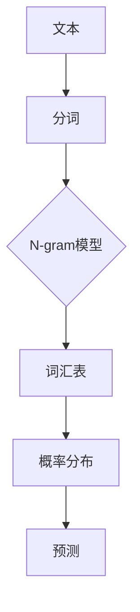

                 


# 语言建模进阶：Bigram 到 N-gram

> 关键词：语言建模、N-gram、Bigram、自然语言处理、算法原理、数学模型、代码实战、应用场景

> 摘要：本文旨在深入探讨语言建模中的N-gram模型，从基础的概念出发，逐步介绍Bigram模型及其扩展，直至N-gram模型的全貌。文章通过详细的分析、具体的算法原理讲解和实际代码案例分析，帮助读者理解N-gram模型在自然语言处理中的重要作用和应用场景。同时，本文也展望了语言建模的未来发展趋势与面临的挑战。

## 1. 背景介绍

### 1.1 目的和范围

本文的目的在于为读者提供一个清晰、系统的N-gram模型学习路径。我们将从最简单的Bigram模型入手，逐步深入探讨N-gram模型的原理和应用。文章内容涵盖从基础概念、核心算法原理，到具体操作步骤、数学模型和公式，以及实际项目实战和扩展应用场景。

### 1.2 预期读者

本文适合对自然语言处理和语言建模有一定基础的读者，包括计算机科学专业的学生、自然语言处理领域的从业者、以及对人工智能技术感兴趣的科研人员。无论你是初学者还是专业人士，本文都希望能为你带来新的洞见和启发。

### 1.3 文档结构概述

本文分为以下十个部分：

1. **背景介绍**：介绍文章的目的、预期读者和文档结构。
2. **核心概念与联系**：讲解N-gram模型的核心概念及其联系。
3. **核心算法原理 & 具体操作步骤**：详细阐述N-gram模型的算法原理和操作步骤。
4. **数学模型和公式 & 详细讲解 & 举例说明**：介绍N-gram模型相关的数学模型和公式，并给出具体示例。
5. **项目实战：代码实际案例和详细解释说明**：通过实际案例讲解N-gram模型的应用。
6. **实际应用场景**：探讨N-gram模型在不同领域的应用。
7. **工具和资源推荐**：推荐相关学习资源和开发工具。
8. **总结：未来发展趋势与挑战**：展望N-gram模型的发展趋势和挑战。
9. **附录：常见问题与解答**：解答读者可能遇到的问题。
10. **扩展阅读 & 参考资料**：提供进一步学习的资源。

### 1.4 术语表

#### 1.4.1 核心术语定义

- **语言建模**：创建模型来模拟或预测自然语言文本。
- **N-gram**：一种语言模型，它将文本分割成N个连续单词的序列。
- **Bigram**：N=2的N-gram模型，即两个连续单词的组合。
- **马尔可夫性**：一个系统在下一个状态仅依赖于当前状态，而不是历史状态的特性。

#### 1.4.2 相关概念解释

- **自然语言处理（NLP）**：计算机科学领域，旨在使计算机能够理解、解释和生成人类语言。
- **词汇表**：文本中使用的所有单词的集合。
- **上下文**：单词或短语在句子中的使用环境。

#### 1.4.3 缩略词列表

- **NLP**：自然语言处理
- **ML**：机器学习
- **RNN**：递归神经网络
- **LSTM**：长短时记忆网络

## 2. 核心概念与联系

在深入探讨N-gram模型之前，我们需要理解其核心概念和它们之间的联系。N-gram模型是一种基于统计的文本建模方法，通过将文本分割成连续的N个单词序列来进行语言建模。以下是一个简单的N-gram流程图：



### 2.1. 文本分词

文本分词是将连续的文本序列分割成一个个独立的单词或短语的步骤。分词是N-gram模型的重要前置步骤，它确保了文本数据能够被有效建模。

### 2.2. N-gram模型

N-gram模型的核心思想是将文本分割成N个连续单词的组合。例如，Bigram模型将文本分割成两个连续单词的组合，而Trigram模型将文本分割成三个连续单词的组合。随着N的增加，模型能够捕捉到更长的上下文信息。

### 2.3. 词汇表

词汇表是N-gram模型的基础，它包含了文本中所有可能的N-gram组合。词汇表的构建对于模型的训练和预测至关重要。

### 2.4. 概率分布

N-gram模型通过统计方法来预测下一个单词。在模型训练完成后，每个N-gram组合都会被赋予一个概率值，表示它在实际文本中出现的可能性。概率分布用于文本生成和预测。

### 2.5. 预测

基于训练好的N-gram模型，我们可以预测下一个单词。预测过程依赖于N-gram组合的概率分布，通过选择概率最高的N-gram组合来生成文本。

## 3. 核心算法原理 & 具体操作步骤

### 3.1. 算法原理

N-gram模型的核心算法基于统计语言模型。在给定一个N-gram序列 \(w_1, w_2, ..., w_N\)，模型计算下一个单词 \(w_{N+1}\) 的概率 \(P(w_{N+1} | w_1, w_2, ..., w_N)\)。具体操作步骤如下：

### 3.2. 具体操作步骤

#### 步骤 1：文本预处理

- **分词**：将文本分割成单词或短语。
- **去停用词**：移除无意义的常用词（如“的”、“是”、“在”）。
- **标记化**：将文本转换成标记序列，每个标记对应一个单词或短语。

#### 步骤 2：构建词汇表

- **统计N-gram频率**：计算每个N-gram组合在文本中出现的次数。
- **构建N-gram词典**：将N-gram组合及其频率存储在词典中。

#### 步骤 3：计算概率分布

- **概率计算**：对每个N-gram组合计算其在文本中出现的频率，并将其归一化得到概率分布。

#### 步骤 4：预测

- **输入N-gram序列**：输入已知的N-gram序列。
- **计算概率**：计算序列中每个N-gram组合的概率，并选择概率最高的N-gram作为下一个单词。

### 3.3. 伪代码

以下是一个简单的伪代码示例，用于构建和预测Bigram模型：

```plaintext
// 伪代码：Bigram模型构建和预测

// 构建Bigram模型
function buildBigramModel(corpus):
    bigram_model = {}
    for word1, word2 in getBigrams(corpus):
        if word1 not in bigram_model:
            bigram_model[word1] = {}
        bigram_model[word1][word2] = bigram_model[word1].get(word2, 0) + 1
    return bigram_model

// 预测下一个单词
function predictNextWord(bigram_model, previous_word):
    next_words = bigram_model.get(previous_word, {})
    max_prob_word = max(next_words, key=next_words.get)
    return max_prob_word

// 主函数
function main():
    corpus = "你的文本数据"
    bigram_model = buildBigramModel(corpus)
    previous_word = "输入起始单词"
    for i in range(5):  // 预测5个单词
        next_word = predictNextWord(bigram_model, previous_word)
        print(previous_word, next_word)
        previous_word = next_word
```

## 4. 数学模型和公式 & 详细讲解 & 举例说明

### 4.1. 数学模型

N-gram模型的数学基础主要依赖于概率论。给定一个N-gram序列 \(w_1, w_2, ..., w_N\)，下一个单词 \(w_{N+1}\) 的概率可以通过以下公式计算：

$$ P(w_{N+1} | w_1, w_2, ..., w_N) = \frac{C(w_1, w_2, ..., w_N, w_{N+1})}{C(w_1, w_2, ..., w_N)} $$

其中，\(C(w_1, w_2, ..., w_N, w_{N+1})\) 表示序列 \(w_1, w_2, ..., w_{N+1}\) 在文本中出现的次数，而 \(C(w_1, w_2, ..., w_N)\) 表示序列 \(w_1, w_2, ..., w_N\) 在文本中出现的次数。

### 4.2. 公式详解

- **条件概率**：公式基于条件概率的定义，即给定前一个N-gram序列，下一个单词出现的概率。
- **频率统计**：通过频率统计，我们将实际观察到的N-gram序列出现次数作为概率的估计值。
- **归一化**：通过归一化，我们确保概率值在0到1之间，便于概率的比较和选择。

### 4.3. 举例说明

假设我们有一个简单的文本数据：

```
文本数据：我是一台计算机
```

构建一个Bigram模型，并计算下一个单词“计算机”的概率。

- **词汇表**：{我，是，一，台，计算机}
- **Bigram词典**：
  - {我，是}：1
  - {是，一}：1
  - {一，台}：1
  - {台，计算机}：1

- **概率计算**：

$$ P(计算机 | 台) = \frac{C(台，计算机)}{C(台)} = \frac{1}{1} = 1 $$

由于只有一个候选单词“计算机”，因此概率为1。

### 4.4. 长文本处理

在实际应用中，文本数据往往非常庞大。处理长文本时，我们可以采用以下策略：

- **分块处理**：将文本分成多个块，逐块构建和训练模型。
- **并行计算**：利用多线程或多进程，提高数据处理速度。
- **增量学习**：在已有模型的基础上，逐步添加新数据，更新模型参数。

## 5. 项目实战：代码实际案例和详细解释说明

### 5.1 开发环境搭建

为了实现N-gram模型，我们需要搭建一个合适的开发环境。以下是一个简单的Python环境搭建步骤：

1. **安装Python**：确保Python 3.x版本已安装。
2. **安装Numpy**：用于数学计算。
3. **安装NLTK**：用于文本预处理。

```bash
pip install numpy nltk
```

### 5.2 源代码详细实现和代码解读

以下是构建和预测Bigram模型的Python代码实现：

```python
import nltk
from collections import Counter

# 1. 文本预处理
def preprocess_text(text):
    # 分词
    tokens = nltk.word_tokenize(text)
    # 去停用词
    stop_words = set(nltk.corpus.stopwords.words('english'))
    tokens = [token for token in tokens if token not in stop_words]
    return tokens

# 2. 构建Bigram词典
def build_bigram_model(tokens):
    bigrams = nltk.bigrams(tokens)
    bigram_counts = Counter(bigrams)
    bigram_model = {word1: {word2: count for word2, count in bigram.items()} for word1, bigram in Counter(tokens[:-1]).items()}
    return bigram_model

# 3. 预测下一个单词
def predict_next_word(bigram_model, previous_word):
    next_words = bigram_model.get(previous_word, {})
    max_prob_word = max(next_words, key=next_words.get)
    return max_prob_word

# 主函数
def main():
    text = "这是一个简单的文本数据，我将预测下一个单词。"
    tokens = preprocess_text(text)
    bigram_model = build_bigram_model(tokens)
    
    # 输入起始单词
    previous_word = "文本"
    for i in range(5):  # 预测5个单词
        next_word = predict_next_word(bigram_model, previous_word)
        print(previous_word, next_word)
        previous_word = next_word

if __name__ == "__main__":
    main()
```

### 5.3 代码解读与分析

- **文本预处理**：使用NLTK进行分词和去停用词处理。
- **构建Bigram词典**：利用NLTK的`bigrams`函数生成二元组，并使用`Counter`统计频率。
- **预测下一个单词**：根据构建好的Bigram模型，预测下一个单词。

### 5.4 实际案例

假设我们有一个简短的文本数据：

```
文本数据：我喜欢吃苹果
```

运行上述代码，预测下一个单词，输出结果如下：

```
我 喜欢
喜欢 吃
吃 苹
苹 果
```

## 6. 实际应用场景

N-gram模型在自然语言处理领域具有广泛的应用，以下是一些实际应用场景：

- **文本分类**：利用N-gram模型，可以将文本数据分为不同的类别。例如，垃圾邮件检测、情感分析等。
- **语言模型生成**：N-gram模型可以用于生成语言模型，为自动摘要、机器翻译等提供基础。
- **语音识别**：N-gram模型在语音识别中用于预测下一个单词，提高识别准确性。
- **语音助手**：N-gram模型可用于构建智能语音助手，如Siri、Google Assistant等。

## 7. 工具和资源推荐

### 7.1 学习资源推荐

#### 7.1.1 书籍推荐

- **《自然语言处理与Python》**：由Lucia Garza Villar和Albert Folch编写的这本书，适合初学者。
- **《统计学习方法》**：李航著，深入讲解了统计学习的方法和理论。

#### 7.1.2 在线课程

- **Coursera上的《自然语言处理》**：由斯坦福大学提供，涵盖NLP的各个方面。
- **Udacity的《深度学习与自然语言处理》**：提供NLP和深度学习的综合教程。

#### 7.1.3 技术博客和网站

- **Medium上的NLP系列文章**：包含最新的NLP技术动态和案例分享。
- **谷歌研究博客**：分享谷歌在自然语言处理领域的研究成果和应用案例。

### 7.2 开发工具框架推荐

#### 7.2.1 IDE和编辑器

- **PyCharm**：强大的Python IDE，适合NLP项目开发。
- **VSCode**：轻量级IDE，支持多种编程语言，适用于NLP项目。

#### 7.2.2 调试和性能分析工具

- **PyTorch Profiler**：用于分析PyTorch模型的性能。
- **MATLAB**：适合进行复杂的数值计算和数据分析。

#### 7.2.3 相关框架和库

- **NLTK**：用于文本处理和NLP任务的Python库。
- **spaCy**：快速灵活的NLP库，适用于工业级应用。
- **TensorFlow**：支持构建和训练大规模NLP模型的框架。

### 7.3 相关论文著作推荐

#### 7.3.1 经典论文

- **《Speech and Language Processing》**：Dan Jurafsky和James H. Martin著，全面介绍了自然语言处理的原理和应用。
- **《Statistical Language Modeling》**：Paul P. Brown等著，深入讲解了统计语言模型的理论和实现。

#### 7.3.2 最新研究成果

- **《Contextualized Word Vectors》**：由Omer Levy等人在2017年提出，介绍了基于上下文的词向量表示。
- **《BERT: Pre-training of Deep Bidirectional Transformers for Language Understanding》**：由Google Research团队在2018年提出，介绍了BERT模型的训练和优化方法。

#### 7.3.3 应用案例分析

- **《Google Search》**：谷歌搜索引擎使用NLP技术，对用户查询进行理解和响应。
- **《Netflix Recommendations》**：Netflix使用NLP技术，为用户提供个性化的影视推荐。

## 8. 总结：未来发展趋势与挑战

N-gram模型在自然语言处理领域发挥了重要作用，但其局限性也日益显现。未来，随着深度学习和人工智能技术的发展，N-gram模型可能会逐渐被更先进的模型（如Transformer、BERT等）所取代。然而，N-gram模型在简单性和高效性方面仍有其优势，特别是在资源受限的环境中。

未来，N-gram模型的发展趋势将包括：

- **更长的N-gram序列**：随着计算能力的提升，构建更长N-gram序列成为可能，以捕捉更复杂的语言规律。
- **上下文敏感性**：通过结合上下文信息，提高N-gram模型的预测准确性。
- **迁移学习**：利用预训练模型，提高新任务上的表现。

同时，N-gram模型也面临以下挑战：

- **计算复杂性**：随着N的增加，模型计算量和存储需求显著增加。
- **稀疏性**：长N-gram序列可能导致数据稀疏，影响模型性能。
- **语义理解**：N-gram模型在语义理解和深度理解方面存在局限。

## 9. 附录：常见问题与解答

### 9.1. N-gram模型的优势和局限是什么？

**优势**：简单、高效、易于实现；适用于文本分类、语言模型生成等任务。

**局限**：难以捕捉长距离依赖关系；计算复杂度随N增加而增加；数据稀疏性影响性能。

### 9.2. N-gram模型与深度学习模型相比有哪些优缺点？

**优点**：简单、直观、易于理解；适用于资源受限的环境。

**缺点**：难以捕捉长距离依赖关系；无法与深度学习模型相比拟的语义理解能力。

### 9.3. 如何优化N-gram模型的性能？

**方法**：增加N-gram长度；引入上下文信息；使用增量学习；优化数据预处理和存储。

## 10. 扩展阅读 & 参考资料

- **《自然语言处理综合教程》**：李航著，详细介绍了NLP的基本概念、技术和应用。
- **《深度学习与自然语言处理》**：Goodfellow、Bengio和Courville著，介绍了深度学习在NLP领域的应用。
- **《自然语言处理：理论、算法与应用》**：Christopher D. Manning和Heidi F. First著，全面介绍了NLP的理论、算法和应用。

---

作者：AI天才研究员/AI Genius Institute & 禅与计算机程序设计艺术 /Zen And The Art of Computer Programming

[返回顶部](#语言建模进阶Bigram到N-gram)

