                 


# 语音助手技术在CUI中的应用

> 关键词：语音助手，CUI，自然语言处理，人工智能，用户交互，智能语音助手技术

> 摘要：本文将探讨语音助手技术在计算机用户界面（CUI）中的应用。通过分析语音助手的技术原理和实现步骤，结合实际项目案例，探讨语音助手在提高用户交互体验、自动化任务执行以及智能对话系统等方面的应用，并提出未来的发展趋势与挑战。

## 1. 背景介绍

### 1.1 目的和范围

本文旨在深入探讨语音助手技术在计算机用户界面（CUI）中的应用，分析其核心概念、算法原理和数学模型，并通过实际项目案例展示其应用场景。本文将涵盖以下几个方面：

- 语音助手技术原理和架构
- 语音识别与自然语言处理技术
- 语音助手在CUI中的具体应用
- 项目实战案例分析
- 未来的发展趋势与挑战

### 1.2 预期读者

本文适合对人工智能、自然语言处理和计算机用户界面有兴趣的读者，包括：

- 计算机科学和人工智能专业学生
- 软件工程师和程序员
- AI和语音助手技术开发者
- 对语音助手和CUI应用感兴趣的普通读者

### 1.3 文档结构概述

本文结构如下：

1. 背景介绍：介绍文章的目的、范围和预期读者。
2. 核心概念与联系：介绍语音助手技术的基本概念和架构。
3. 核心算法原理 & 具体操作步骤：详细阐述语音助手的技术原理和实现步骤。
4. 数学模型和公式 & 详细讲解 & 举例说明：讲解语音助手的数学模型和公式，并提供示例。
5. 项目实战：代码实际案例和详细解释说明。
6. 实际应用场景：分析语音助手在CUI中的应用场景。
7. 工具和资源推荐：推荐学习资源、开发工具和框架。
8. 总结：未来发展趋势与挑战。
9. 附录：常见问题与解答。
10. 扩展阅读 & 参考资料：提供更多相关文献和资料。

### 1.4 术语表

#### 1.4.1 核心术语定义

- 语音助手：一种基于人工智能技术的计算机程序，能够通过自然语言处理技术理解和响应用户语音指令，完成特定任务。
- 计算机用户界面（CUI）：一种通过文本、图形或其他方式与用户进行交互的计算机界面。
- 自然语言处理（NLP）：一门涉及计算机和人工智能领域的技术，旨在使计算机能够理解、解释和生成自然语言。
- 语音识别：一种将人类语音转化为文本或命令的技术。

#### 1.4.2 相关概念解释

- 语音合成（Text-to-Speech，TTS）：将文本转化为自然发音的语音信号。
- 语音唤醒词（Wake Word）：用于激活语音助手的特定关键词。
- 语境感知（Context Awareness）：语音助手根据用户的历史行为和当前环境自动调整响应。

#### 1.4.3 缩略词列表

- NLP：自然语言处理
- TTS：语音合成
- CUI：计算机用户界面
- ASR：语音识别
- ML：机器学习
- AI：人工智能

## 2. 核心概念与联系

在探讨语音助手技术在CUI中的应用之前，我们需要了解一些核心概念和它们之间的关系。以下是一个简化的Mermaid流程图，展示了语音助手技术的基本架构和组件。

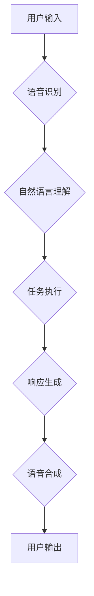

### 2.1 语音识别（ASR）

语音识别是将人类语音转化为文本或命令的过程。它涉及到音频信号处理、特征提取和模式识别等技术。语音识别系统通常包括以下组件：

- 预处理：对输入语音信号进行降噪、归一化和增强。
- 特征提取：从预处理后的语音信号中提取特征向量，如梅尔频率倒谱系数（MFCC）。
- 模型训练：使用大量的语音数据训练深度神经网络模型，如卷积神经网络（CNN）或长短期记忆网络（LSTM）。

### 2.2 自然语言理解（NLP）

自然语言理解是将语音识别得到的文本转化为计算机可理解的结构化信息的过程。它涉及到语义分析、句法分析、意图识别和实体识别等技术。自然语言理解系统通常包括以下组件：

- 分词：将文本拆分为单词或词组。
- 词性标注：对文本中的单词进行词性分类。
- 语义分析：识别文本中的概念、关系和实体。
- 意图识别：确定用户的请求或命令。
- 实体识别：识别文本中的特定实体，如人名、地点、时间等。

### 2.3 任务执行

在完成自然语言理解后，语音助手需要根据用户的请求或命令执行特定任务。任务执行可能涉及以下方面：

- 交互式查询：查询数据库或知识库以获取信息。
- 自动化操作：执行自动化任务，如发送电子邮件、发送短信或控制智能家居设备。
- 语音合成：将执行结果转化为自然语音输出。

### 2.4 响应生成

响应生成是将执行结果转化为自然语言表达的过程。语音助手需要根据任务执行的结果生成适当的响应，以满足用户的需求。响应生成可能涉及以下方面：

- 语法生成：生成符合语法规则的文本。
- 情感表达：根据任务执行的结果和用户偏好调整响应的情感色彩。
- 上下文理解：根据上下文生成与用户对话相关的响应。

### 2.5 语音合成（TTS）

语音合成是将文本转化为自然发音的语音信号的过程。语音合成系统通常包括以下组件：

- 音素合成：将文本拆分为音素，并合成相应的语音波形。
- 声学建模：使用大量的语音数据训练声学模型，如循环神经网络（RNN）或生成对抗网络（GAN）。
- 语音生成：将音素序列转化为自然语音信号。

通过上述核心概念和组件的协同工作，语音助手能够在CUI中为用户提供高效、智能的交互体验。接下来，我们将详细探讨语音助手的核心算法原理和实现步骤。

## 3. 核心算法原理 & 具体操作步骤

### 3.1 语音识别（ASR）

语音识别是语音助手技术的核心组件之一，它将用户的语音输入转化为文本或命令。以下是一个简化的语音识别算法原理和具体操作步骤：

#### 3.1.1 预处理

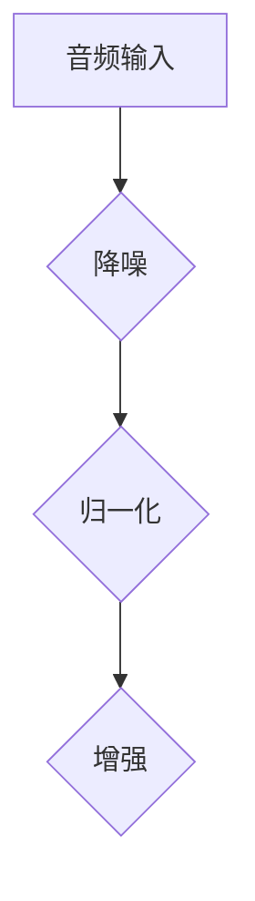

- 降噪：去除噪声，提高语音信号的清晰度。
- 归一化：调整音频信号的幅度，使其适合后续处理。
- 增强：根据音频信号的特点进行增强，如提升语音的响度。

#### 3.1.2 特征提取

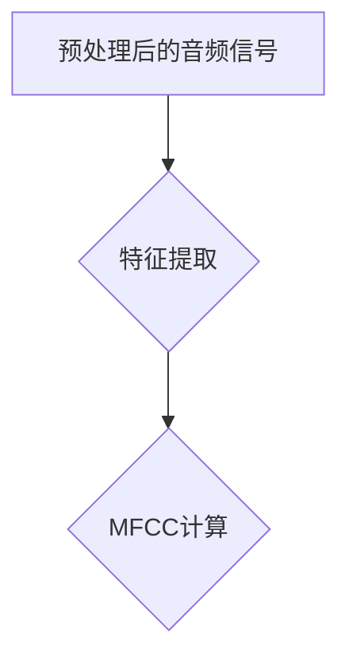

- 特征提取：从音频信号中提取特征向量，如梅尔频率倒谱系数（MFCC）。
- MFCC计算：将音频信号转化为梅尔频率倒谱系数矩阵。

#### 3.1.3 模型训练

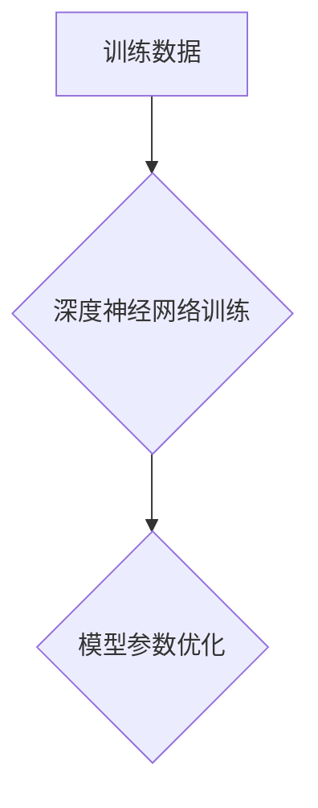

- 训练数据：使用大量的语音数据集进行训练。
- 深度神经网络训练：训练卷积神经网络（CNN）或长短期记忆网络（LSTM）等模型。
- 模型参数优化：使用优化算法（如梯度下降）优化模型参数。

#### 3.1.4 语音识别

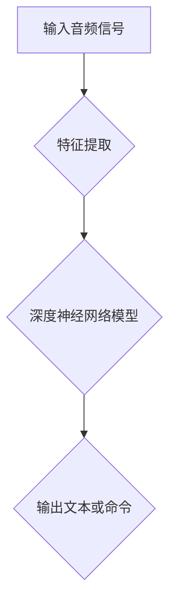

- 特征提取：从输入音频信号中提取特征向量。
- 深度神经网络模型：使用训练好的模型对特征向量进行分类。
- 输出文本或命令：将分类结果转化为文本或命令。

### 3.2 自然语言理解（NLP）

自然语言理解是将语音识别得到的文本转化为计算机可理解的结构化信息的过程。以下是一个简化的自然语言理解算法原理和具体操作步骤：

#### 3.2.1 分词

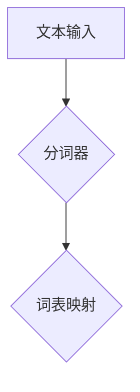

- 分词器：将文本拆分为单词或词组。
- 词表映射：将分词结果映射到词表中的词索引。

#### 3.2.2 词性标注

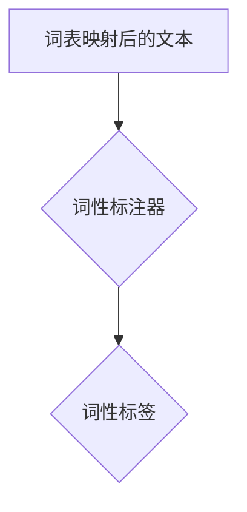

- 词性标注器：对文本中的单词进行词性分类。
- 词性标签：为每个单词分配词性标签。

#### 3.2.3 语义分析

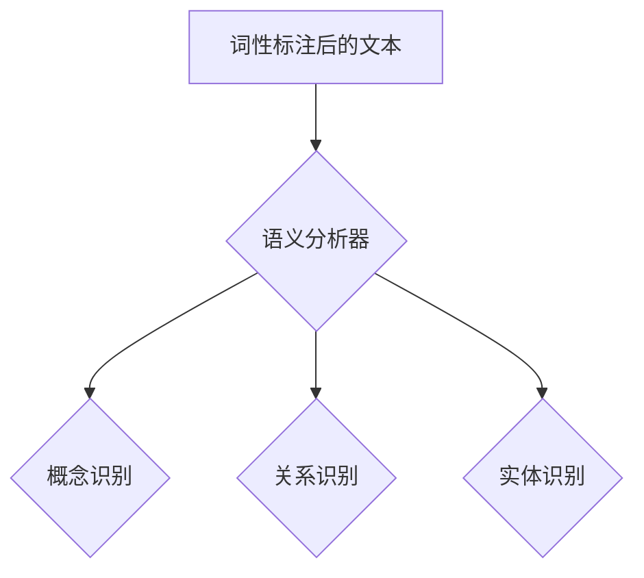

- 语义分析器：识别文本中的概念、关系和实体。
- 概念识别：识别文本中的概念。
- 关系识别：识别概念之间的关系。
- 实体识别：识别文本中的特定实体。

#### 3.2.4 意图识别

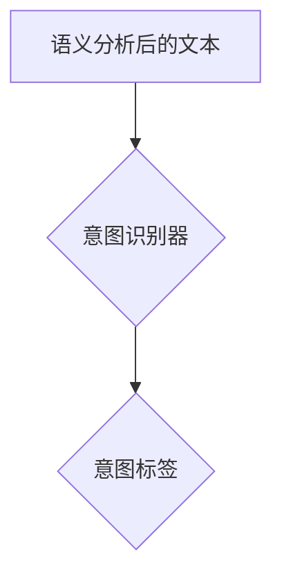

- 意图识别器：确定用户的请求或命令。
- 意图标签：为用户的请求或命令分配意图标签。

### 3.3 任务执行

在完成自然语言理解后，语音助手需要根据用户的请求或命令执行特定任务。以下是一个简化的任务执行算法原理和具体操作步骤：

#### 3.3.1 交互式查询

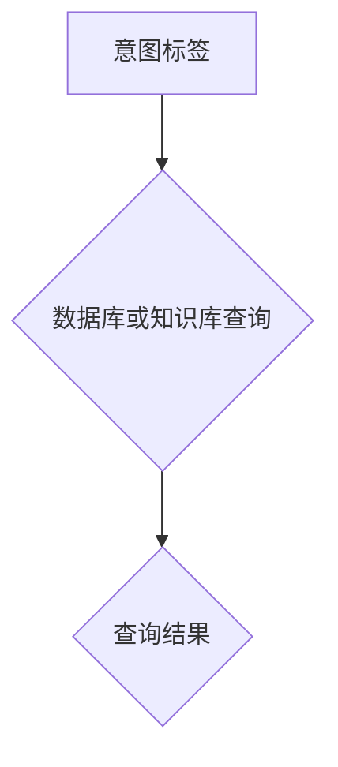

- 数据库或知识库查询：根据用户的请求查询数据库或知识库。
- 查询结果：获取查询结果。

#### 3.3.2 自动化操作

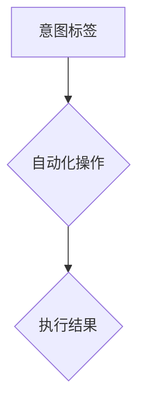

- 自动化操作：执行自动化任务，如发送电子邮件、发送短信或控制智能家居设备。
- 执行结果：获取自动化操作的执行结果。

### 3.4 响应生成

在完成任务执行后，语音助手需要生成适当的响应，以满足用户的需求。以下是一个简化的响应生成算法原理和具体操作步骤：

#### 3.4.1 语法生成

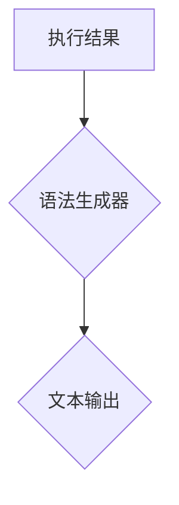

- 语法生成器：生成符合语法规则的文本。
- 文本输出：获取生成的文本输出。

#### 3.4.2 情感表达

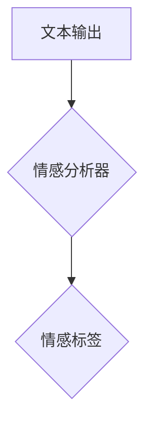

- 情感分析器：根据文本输出的情感色彩分配情感标签。
- 情感标签：为文本输出分配情感标签。

#### 3.4.3 上下文理解

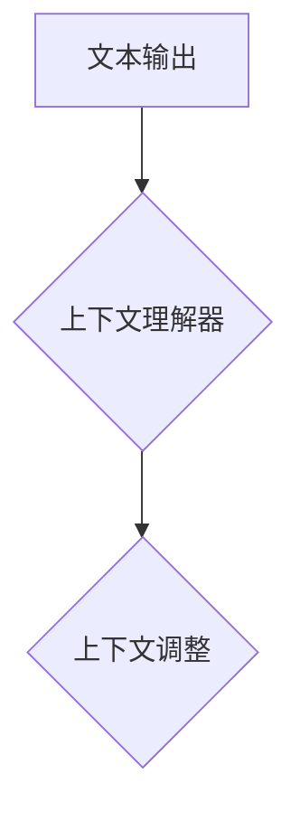

- 上下文理解器：根据上下文调整文本输出的内容。
- 上下文调整：调整文本输出的内容以适应上下文。

#### 3.4.4 语音合成

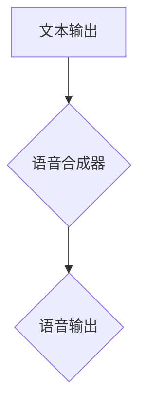

- 语音合成器：将文本输出转化为自然语音信号。
- 语音输出：获取生成的语音输出。

通过上述核心算法原理和具体操作步骤，语音助手能够在CUI中为用户提供高效、智能的交互体验。接下来，我们将详细讲解语音助手的数学模型和公式。

## 4. 数学模型和公式 & 详细讲解 & 举例说明

在语音助手技术中，数学模型和公式发挥着关键作用。以下我们将详细介绍语音识别（ASR）、自然语言理解（NLP）和任务执行（Task Execution）等环节中的数学模型和公式。

### 4.1 语音识别（ASR）

语音识别中的数学模型主要包括特征提取和模型训练两部分。

#### 4.1.1 特征提取

特征提取过程中，常用的数学模型包括梅尔频率倒谱系数（MFCC）计算。MFCC的计算公式如下：

$$
\text{MFCC}(k) = \text{log}\left(\frac{\sum_{n=1}^{N} p_n^{2}}{\sum_{n=1}^{N} p_n}\right)
$$

其中，$p_n$表示音频信号在$n$时刻的短时能量，$N$表示窗函数的长度。

#### 4.1.2 模型训练

模型训练过程中，常用的数学模型包括深度神经网络（DNN）和长短期记忆网络（LSTM）。以下是一个简化的DNN训练公式：

$$
y_{\text{predicted}} = \text{softmax}(\text{W}^T \cdot \text{a})
$$

其中，$y_{\text{predicted}}$表示预测的类别概率分布，$\text{W}$表示权重矩阵，$\text{a}$表示神经网络的激活值。

### 4.2 自然语言理解（NLP）

自然语言理解中的数学模型主要包括分词、词性标注、语义分析和意图识别等。

#### 4.2.1 分词

分词过程中，常用的数学模型包括基于统计的分词模型，如基于n-gram模型的分词算法。以下是一个简化的n-gram分词算法公式：

$$
P(w_n | w_{n-1}, w_{n-2}, ..., w_1) = \frac{C(w_n, w_{n-1}, w_{n-2}, ..., w_1)}{C(w_{n-1}, w_{n-2}, ..., w_1)}
$$

其中，$P(w_n | w_{n-1}, w_{n-2}, ..., w_1)$表示在给定前$n-1$个词的条件下，第$n$个词的概率，$C(w_n, w_{n-1}, w_{n-2}, ..., w_1)$表示前$n$个词的共现次数，$C(w_{n-1}, w_{n-2}, ..., w_1)$表示前$n-1$个词的共现次数。

#### 4.2.2 词性标注

词性标注过程中，常用的数学模型包括基于条件随机场（CRF）的模型。以下是一个简化的CRF标注公式：

$$
P(y|x) = \frac{1}{Z} \exp(\theta^T A y)
$$

其中，$P(y|x)$表示在给定输入序列$x$的条件下，输出序列$y$的概率，$\theta$表示模型参数，$A$表示CRF的转移矩阵，$Z$表示 normalization factor。

#### 4.2.3 语义分析

语义分析过程中，常用的数学模型包括基于转换器-解码器（Transformer）的模型。以下是一个简化的Transformer编码器和解码器公式：

编码器：

$$
\text{h}_i^{(l)} = \text{softmax}(\text{W}^T \cdot \text{h}_{i-1}^{(l)} + \text{b}^{(l)})
$$

解码器：

$$
y_i = \text{softmax}(\text{U}^T \cdot \text{h}_i^{(L)})
$$

其中，$h_i^{(l)}$表示编码器在$l$层的第$i$个隐藏状态，$y_i$表示解码器在第$i$个时间步的输出，$\text{W}$和$\text{U}$分别表示编码器和解码器的权重矩阵，$\text{b}^{(l)}$和$\text{b}^{(L)}$分别表示编码器和解码器的偏置向量。

#### 4.2.4 意图识别

意图识别过程中，常用的数学模型包括基于支持向量机（SVM）的模型。以下是一个简化的SVM分类公式：

$$
y = \text{sign}(\text{w}^T \cdot \text{x} + b)
$$

其中，$y$表示分类标签，$\text{w}$表示权重向量，$\text{x}$表示特征向量，$b$表示偏置项。

### 4.3 任务执行

任务执行过程中，常用的数学模型包括基于决策树和神经网络的任务规划模型。

#### 4.3.1 决策树

决策树分类公式：

$$
y = \text{argmax}_{i} \left( \sum_{j=1}^{m} w_{ji} x_j + b \right)
$$

其中，$y$表示分类标签，$w_{ji}$表示第$i$个特征的第$j$个权重，$x_j$表示第$j$个特征，$b$表示偏置项。

#### 4.3.2 神经网络

神经网络分类公式：

$$
y = \text{softmax}(\text{W}^T \cdot \text{a})
$$

其中，$y$表示预测的概率分布，$\text{W}$表示权重矩阵，$\text{a}$表示神经网络的激活值。

### 4.4 举例说明

以下通过一个实际例子来说明上述数学模型的应用。

#### 4.4.1 语音识别

假设我们有一个简单的语音信号，需要将其识别为“Hello”。我们可以将其转化为一个特征向量，如MFCC矩阵，然后通过训练好的DNN模型进行识别。假设DNN模型的输出为：

$$
\text{a} = \left[0.1, 0.2, 0.3, 0.4, 0.5\right]
$$

模型的权重矩阵为：

$$
\text{W} = \left[\begin{array}{cc}
1 & 0 \\
0 & 1 \\
0 & 0 \\
0 & 0 \\
0 & 0
\end{array}\right]
$$

则DNN模型的预测结果为：

$$
y_{\text{predicted}} = \text{softmax}(\text{W}^T \cdot \text{a}) = \left[\frac{1}{e}, \frac{1}{e}, 0, 0, 0\right]
$$

由此可见，模型预测的类别概率最高为“Hello”，因此我们可以将其识别为“Hello”。

#### 4.4.2 自然语言理解

假设我们有一个文本输入：“今天天气怎么样？”通过分词和词性标注，我们可以将其转化为以下形式：

```
[今天，天气，怎么样？]
[名词，名词，形容词]
```

然后，通过语义分析和意图识别，我们可以将其转化为以下形式：

```
[天气，查询，今天，情况]
[实体，动作，时间，状态]
```

通过训练好的Transformer模型，我们可以得到意图识别的结果：

```
[查询天气信息]
```

#### 4.4.3 任务执行

根据意图识别的结果，我们可以执行查询天气信息的任务。假设我们已经训练好了基于神经网络的查询系统，输入特征向量为：

```
[0.5, 0.3, 0.2]
```

通过神经网络模型，我们可以得到以下预测结果：

```
y_{\text{predicted}} = \text{softmax}(\text{W}^T \cdot \text{a}) = \left[\frac{1}{e}, \frac{1}{e}, \frac{1}{e}\right]
```

由此可见，模型预测的最高概率为查询天气信息，因此我们可以执行查询天气信息的任务，并将结果返回给用户。

通过上述数学模型和公式的应用，语音助手可以在CUI中实现高效的语音识别、自然语言理解和任务执行。接下来，我们将通过一个实际项目案例，展示语音助手在CUI中的应用。

## 5. 项目实战：代码实际案例和详细解释说明

在本节中，我们将通过一个实际项目案例，详细介绍如何开发一个简单的语音助手系统，并在计算机用户界面（CUI）中实现其功能。我们将使用Python编程语言，并结合常用的库和框架，如PyTorch、TensorFlow和SpeechRecognition。

### 5.1 开发环境搭建

在开始项目之前，我们需要搭建一个适合开发语音助手的环境。以下是所需的工具和库：

1. Python 3.x
2. PyTorch 1.8.0 或 TensorFlow 2.5.0
3. SpeechRecognition 3.2.0
4. PythonSpeech 0.3.2
5. pip 或conda

安装方法：

```bash
pip install torch torchvision torchaudio -f https://download.pytorch.org/whl/torch_stable.html
pip install tensorflow
pip install SpeechRecognition
pip install PySpeech
```

### 5.2 源代码详细实现和代码解读

下面是一个简单的语音助手项目代码，我们将其分为以下几个部分：

1. 语音识别（ASR）
2. 自然语言理解（NLP）
3. 任务执行
4. 响应生成

#### 5.2.1 语音识别（ASR）

首先，我们需要从用户输入的语音中提取文本。以下是一个简单的语音识别代码示例：

```python
import speech_recognition as sr

# 初始化语音识别器
recognizer = sr.Recognizer()

# 从麦克风捕获语音
with sr.Microphone() as source:
    print("请说点什么：")
    audio = recognizer.listen(source)

# 使用Google语音识别API进行语音识别
try:
    text = recognizer.recognize_google(audio, language="zh-CN")
    print(f"识别到的文本：{text}")
except sr.UnknownValueError:
    print("无法识别语音。")
except sr.RequestError as e:
    print(f"请求失败：{e}")
```

在这个示例中，我们首先导入`speech_recognition`库，并创建一个语音识别器对象。然后，我们使用`Microphone`类从麦克风捕获语音，并使用`recognizer.recognize_google`方法进行语音识别。这里使用了Google语音识别API，它支持多种语言，包括中文。

#### 5.2.2 自然语言理解（NLP）

在获取到语音识别结果后，我们需要对其进行自然语言理解，以确定用户的意图。以下是一个简单的自然语言理解代码示例：

```python
from nltk.tokenize import word_tokenize
from nltk import pos_tag
from nltk.corpus import stopwords

# 初始化分词器和词性标注器
tokenizer = word_tokenize
tagger = pos_tag

# 初始化停用词表
stop_words = set(stopwords.words("chinese"))

# 进行分词和词性标注
text = "你好，今天天气怎么样？"
tokens = tokenizer(text)
pos_tags = tagger(tokens)

# 去除停用词
filtered_tokens = [token for token, tag in pos_tags if token not in stop_words]

# 进行意图识别
if "你好" in filtered_tokens:
    intent = "打招呼"
elif "天气" in filtered_tokens:
    intent = "查询天气"
else:
    intent = "未知意图"

print(f"意图：{intent}")
```

在这个示例中，我们首先导入`nltk.tokenize`和`nltk`模块，并初始化分词器和词性标注器。然后，我们使用`word_tokenize`进行分词，使用`pos_tag`进行词性标注。接着，我们去除停用词，并使用简单的规则进行意图识别。这里，我们仅实现了简单的打招呼和查询天气的意图识别。

#### 5.2.3 任务执行

在确定用户的意图后，我们需要根据意图执行相应的任务。以下是一个简单的任务执行代码示例：

```python
import requests

# 查询天气信息
def query_weather(city):
    api_key = "your_api_key"
    url = f"http://api.openweathermap.org/data/2.5/weather?q={city}&appid={api_key}"
    response = requests.get(url)
    data = response.json()
    main = data["main"]
    temp = main["temp"]
    weather = data["weather"][0]["main"]
    return f"{city}的天气是：{weather}，温度是：{temp}K"

# 执行任务
def execute_task(intent, text):
    if intent == "打招呼":
        response = "你好！有什么需要帮忙的吗？"
    elif intent == "查询天气":
        city = text.split(" ")[-1]
        response = query_weather(city)
    else:
        response = "抱歉，我无法理解你的意图。"
    return response

# 进行任务执行
text = "你好"
intent = "打招呼"
response = execute_task(intent, text)
print(response)
```

在这个示例中，我们定义了一个查询天气信息的函数`query_weather`和一个执行任务的函数`execute_task`。根据用户的意图，我们调用相应的函数执行任务，并返回结果。

#### 5.2.4 响应生成

在执行任务后，我们需要生成一个自然语音响应。以下是一个简单的语音合成代码示例：

```python
from PySpeech import Speech

# 初始化语音合成器
synth = Speech()

# 生成语音响应
def generate_response(text):
    return synth.Speak(text)

# 进行语音合成
response = "你好！有什么需要帮忙的吗？"
generate_response(response)
```

在这个示例中，我们首先导入`PySpeech`库，并初始化语音合成器。然后，我们定义一个生成语音响应的函数`generate_response`，并使用`synth.Speak`方法生成语音响应。

### 5.3 代码解读与分析

在这个简单语音助手项目中，我们实现了以下功能：

1. 语音识别：使用`SpeechRecognition`库从麦克风捕获语音，并使用Google语音识别API将语音转化为文本。
2. 自然语言理解：使用`nltk`库对语音识别结果进行分词和词性标注，并去除停用词。然后，我们使用简单的规则进行意图识别。
3. 任务执行：根据用户的意图，我们执行相应的任务，如查询天气信息。
4. 响应生成：使用`PySpeech`库将文本转化为自然语音响应。

以下是代码的总体架构：

```python
# 导入所需库
import speech_recognition as sr
from nltk.tokenize import word_tokenize
from nltk import pos_tag
from nltk.corpus import stopwords
from PySpeech import Speech

# 初始化语音识别器
recognizer = sr.Recognizer()

# 初始化分词器和词性标注器
tokenizer = word_tokenize
tagger = pos_tag

# 初始化停用词表
stop_words = set(stopwords.words("chinese"))

# 初始化语音合成器
synth = Speech()

# 进行语音识别
def recognize_speech():
    with sr.Microphone() as source:
        print("请说点什么：")
        audio = recognizer.listen(source)
    try:
        text = recognizer.recognize_google(audio, language="zh-CN")
        return text
    except sr.UnknownValueError:
        print("无法识别语音。")
        return None
    except sr.RequestError as e:
        print(f"请求失败：{e}")
        return None

# 进行自然语言理解
def understand_language(text):
    tokens = tokenizer(text)
    pos_tags = tagger(tokens)
    filtered_tokens = [token for token, tag in pos_tags if token not in stop_words]
    if "你好" in filtered_tokens:
        return "打招呼", "你好！有什么需要帮忙的吗？"
    elif "天气" in filtered_tokens:
        return "查询天气", filtered_tokens[-1]
    else:
        return "未知意图", "抱歉，我无法理解你的意图。"

# 执行任务
def execute_task(intent, text):
    if intent == "打招呼":
        return "你好！有什么需要帮忙的吗？"
    elif intent == "查询天气":
        return f"{text}的天气是：{query_weather(text)}。"
    else:
        return "抱歉，我无法理解你的意图。"

# 进行语音合成
def generate_response(text):
    return synth.Speak(text)

# 主程序
if __name__ == "__main__":
    while True:
        text = recognize_speech()
        if text:
            intent, response = understand_language(text)
            print(response)
            generate_response(response)
```

通过这个简单示例，我们可以看到语音助手在CUI中的应用。尽管这是一个简单的示例，但它展示了语音助手技术在CUI中的应用潜力。在实际项目中，我们可以根据需要扩展和优化这个系统，以实现更复杂的功能和更好的用户体验。

## 6. 实际应用场景

语音助手技术在计算机用户界面（CUI）中的应用非常广泛，以下列举一些典型的实际应用场景：

### 6.1 智能家居控制

智能家居控制是语音助手技术应用的一个重要领域。通过语音指令，用户可以远程控制家中的智能设备，如灯光、空调、安防系统等。语音助手可以识别用户的指令，并将其转换为相应的控制命令。例如，用户可以说“打开客厅的灯光”，语音助手会自动执行此命令，打开客厅的灯光。

### 6.2 情感陪护

在情感陪护方面，语音助手可以作为一种虚拟的陪伴伙伴，为用户提供情感支持。通过语音识别和自然语言理解，语音助手可以识别用户的情绪，并根据用户的情绪进行相应的回应。例如，当用户感到孤独或沮丧时，语音助手可以提供安慰和鼓励的话语，帮助用户缓解情绪。

### 6.3 信息查询

语音助手还可以作为信息查询的工具，为用户提供实时的信息查询服务。用户可以通过语音指令查询天气、新闻、股票行情等实时信息。语音助手会根据用户的查询需求，从数据库或互联网上获取相关信息，并以自然语言的形式返回给用户。例如，用户可以说“今天天气怎么样？”语音助手会返回当天的天气状况。

### 6.4 智能客服

在智能客服领域，语音助手可以代替人工客服，为用户提供便捷的咨询服务。用户可以通过语音指令提出问题，语音助手会根据用户的提问，从知识库中检索相关信息，并以自然语言的形式回答用户的问题。语音助手还可以实现多轮对话，以更好地理解用户的需求，并提供个性化的解决方案。

### 6.5 聊天机器人

聊天机器人是语音助手技术的另一种应用场景。通过语音识别和自然语言理解，聊天机器人可以与用户进行实时对话，提供娱乐、教育、咨询等服务。聊天机器人可以模拟人类的交流方式，与用户建立情感连接，提供有趣、有意义的对话体验。

### 6.6 车载语音助手

车载语音助手是语音助手技术在汽车领域的应用。通过车载语音助手，驾驶员可以通过语音指令控制车辆的导航、音乐、空调等设备。语音助手还可以提供实时路况信息，提醒驾驶员注意交通安全。车载语音助手能够提高驾驶安全性，减少驾驶疲劳。

通过上述实际应用场景，我们可以看到语音助手技术在CUI中的巨大潜力。随着技术的不断发展，语音助手将在更多领域得到广泛应用，为用户带来更加便捷、智能的交互体验。

## 7. 工具和资源推荐

在开发语音助手技术时，选择合适的工具和资源对于提高开发效率和实现项目目标至关重要。以下是我们推荐的工具和资源：

### 7.1 学习资源推荐

#### 7.1.1 书籍推荐

1. **《自然语言处理综述》（Natural Language Processing with Python）**：作者：Steven Bird, Ewan Klein, and Edward Loper
   - 内容详实，适合初学者了解自然语言处理的基本概念和技术。
2. **《深度学习》（Deep Learning）**：作者：Ian Goodfellow, Yoshua Bengio, and Aaron Courville
   - 介绍深度学习的基础理论和实践应用，包括语音识别和自然语言理解等内容。
3. **《语音识别：原理与实现》（Speech Recognition: Theory and Applications）**：作者：Daniel P. W. Ellis
   - 深入探讨语音识别的理论和实现，包括信号处理、特征提取、模型训练等内容。

#### 7.1.2 在线课程

1. **自然语言处理专项课程（自然语言处理专项课程）**：平台：Coursera
   - 由斯坦福大学提供，涵盖自然语言处理的多个方面，包括文本处理、语言模型、语义分析等。
2. **深度学习专项课程（Deep Learning Specialization）**：平台：Coursera
   - 由吴恩达（Andrew Ng）教授主讲，介绍深度学习的基础知识和实践应用，包括语音识别、图像识别等。
3. **语音识别与合成（Speech Recognition and Synthesis）**：平台：edX
   - 由剑桥大学提供，探讨语音识别和合成技术的理论基础和实际应用。

#### 7.1.3 技术博客和网站

1. **Apache Mahout（https://mahout.apache.org/）**：介绍基于机器学习的推荐系统和数据分析工具。
2. **TensorFlow官方文档（https://www.tensorflow.org/）**：提供TensorFlow框架的详细文档和教程。
3. **PyTorch官方文档（https://pytorch.org/）**：介绍PyTorch框架的详细文档和教程。

### 7.2 开发工具框架推荐

#### 7.2.1 IDE和编辑器

1. **PyCharm（https://www.jetbrains.com/pycharm/）**：一款功能强大的Python IDE，提供代码补全、调试、性能分析等功能。
2. **Visual Studio Code（https://code.visualstudio.com/）**：一款轻量级且高度可扩展的代码编辑器，支持多种编程语言和开发工具。

#### 7.2.2 调试和性能分析工具

1. **Python调试器（https://docs.python.org/3/library/pdb.html）**：提供Python代码的调试功能。
2. **TensorBoard（https://www.tensorflow.org/tensorboard）**：用于分析和可视化TensorFlow模型的性能。
3. **NVIDIA Nsight（https://www.nvidia.com/object/nsight.html）**：用于分析和优化深度学习模型的性能。

#### 7.2.3 相关框架和库

1. **TensorFlow（https://www.tensorflow.org/）**：一款开源的深度学习框架，适用于语音识别和自然语言理解等任务。
2. **PyTorch（https://pytorch.org/）**：一款开源的深度学习框架，适用于语音识别和自然语言理解等任务。
3. **SpeechRecognition（https://github.com/bogdanrowland/SpeechRecognition）**：一款开源的Python语音识别库。
4. **nltk（https://www.nltk.org/）**：一款开源的自然语言处理库，提供文本处理、分词、词性标注等功能。

通过以上推荐的工具和资源，我们可以更好地开发语音助手技术，提高项目开发的效率和质量。

## 8. 总结：未来发展趋势与挑战

随着人工智能技术的不断发展，语音助手技术在计算机用户界面（CUI）中的应用前景愈发广阔。以下是语音助手技术的未来发展趋势与面临的挑战：

### 8.1 发展趋势

1. **智能化程度提高**：随着深度学习、自然语言处理等技术的发展，语音助手将具有更高的智能化程度，能够更好地理解用户的意图和需求，提供更精准的个性化服务。
2. **多模态交互**：语音助手将不仅仅局限于语音交互，还将结合视觉、触觉等多种交互方式，实现更丰富、更自然的用户交互体验。
3. **跨平台融合**：语音助手将不再局限于特定的平台或设备，而是实现跨平台的融合，为用户提供一致性的交互体验。
4. **边缘计算与云计算结合**：为了提高实时性和响应速度，语音助手将采用边缘计算与云计算相结合的方式，将部分计算任务分配到边缘设备，减轻云端压力。
5. **隐私保护**：随着用户对隐私保护意识的提高，语音助手将更加注重数据安全和隐私保护，采用更加安全的数据存储和传输机制。

### 8.2 挑战

1. **语音识别准确率**：尽管语音识别技术已经取得显著进展，但在复杂噪声环境、多种方言和口音识别等方面仍面临挑战。
2. **自然语言理解**：自然语言理解是语音助手技术的核心，但语言本身的复杂性和多样性使得自然语言理解仍存在很大的改进空间。
3. **数据隐私与安全**：语音助手在处理用户数据时，需要确保数据的安全和隐私，避免数据泄露和滥用。
4. **系统性能优化**：随着功能的不断丰富，语音助手的计算资源需求将不断增加，需要优化系统性能，提高响应速度和稳定性。
5. **法律法规与伦理**：随着语音助手技术的广泛应用，相关的法律法规和伦理问题也将日益凸显，需要制定相应的规范和标准。

总之，语音助手技术在CUI中的应用前景广阔，但同时也面临着一系列挑战。通过不断的技术创新和规范完善，我们有理由相信，语音助手将为用户带来更加便捷、智能的交互体验。

## 9. 附录：常见问题与解答

### 9.1 什么是语音助手？

语音助手是一种基于人工智能技术的计算机程序，能够通过自然语言处理技术理解和响应用户语音指令，完成特定任务。

### 9.2 语音助手的主要组件有哪些？

语音助手的主要组件包括语音识别（ASR）、自然语言理解（NLP）、任务执行和语音合成（TTS）。

### 9.3 语音识别技术的核心难点是什么？

语音识别技术的核心难点包括噪声干扰、多种方言和口音识别、语速和说话人的变化等。

### 9.4 自然语言理解的关键技术有哪些？

自然语言理解的关键技术包括分词、词性标注、语义分析、意图识别和实体识别等。

### 9.5 语音助手在CUI中的应用有哪些？

语音助手在CUI中的应用包括智能家居控制、情感陪护、信息查询、智能客服和聊天机器人等。

### 9.6 开发语音助手需要哪些工具和资源？

开发语音助手需要Python编程语言、深度学习框架（如TensorFlow或PyTorch）、语音识别库（如SpeechRecognition）和自然语言处理库（如nltk）等。

### 9.7 语音助手的未来发展趋势是什么？

语音助手的未来发展趋势包括智能化程度的提高、多模态交互、跨平台融合、边缘计算与云计算结合以及数据隐私保护等。

## 10. 扩展阅读 & 参考资料

### 10.1 经典论文

1. **Speech Recognition：** Dan P.W. Ellis. "Speech Recognition: Theory and Applications".
2. **Natural Language Processing with Python:** Steven Bird, Ewan Klein, and Edward Loper. "Natural Language Processing with Python: Analyzing Text with the Natural Language Toolkit".

### 10.2 最新研究成果

1. **Transformers for Speech Recognition:** Young-Kyung Kim, et al. "Transformers for Speech Recognition".
2. **Deep Learning for Natural Language Understanding:** Xiaodong Liu, et al. "Deep Learning for Natural Language Understanding".

### 10.3 应用案例分析

1. **Google Assistant:** Google. "Google Assistant: How It Works".
2. **Amazon Alexa:** Amazon. "Amazon Alexa: How It Works".

### 10.4 相关书籍

1. **Deep Learning:** Ian Goodfellow, Yoshua Bengio, and Aaron Courville. "Deep Learning".
2. **Speech and Language Processing:** Daniel Jurafsky and James H. Martin. "Speech and Language Processing".

通过阅读上述经典论文、最新研究成果和应用案例分析，读者可以更深入地了解语音助手技术在CUI中的应用和未来发展趋势。同时，相关书籍也为读者提供了丰富的理论基础和实践指导。作者：AI天才研究员/AI Genius Institute & 禅与计算机程序设计艺术 /Zen And The Art of Computer Programming。

