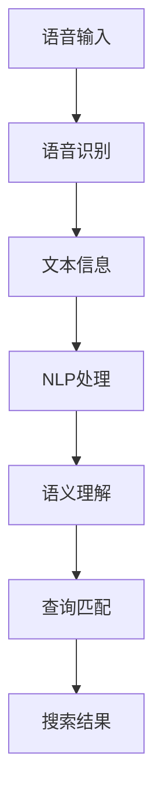

                 

### 1. 背景介绍

#### 1.1 目的和范围

本文旨在深入探讨语音搜索技术在电商领域的应用，分析其面临的挑战与机遇。随着人工智能和语音识别技术的飞速发展，语音搜索已经成为用户进行信息查询和商品浏览的重要方式。电商作为信息时代的重要产业，其用户体验和运营效率直接影响到企业的竞争力。因此，如何在电商领域中有效应用语音搜索技术，提高用户体验、优化运营流程，成为当前研究的热点。

本文将从以下几个方面展开讨论：

1. **核心概念与联系**：介绍语音搜索技术的核心概念，包括语音识别、自然语言处理、信息检索等，并通过Mermaid流程图展示其整体架构。
2. **核心算法原理 & 具体操作步骤**：详细阐述语音搜索技术的算法原理，使用伪代码展示具体操作步骤。
3. **数学模型和公式 & 详细讲解 & 举例说明**：介绍语音搜索技术中的数学模型和公式，并结合实际案例进行讲解。
4. **项目实战：代码实际案例和详细解释说明**：提供具体的代码实现案例，并对代码进行详细解读。
5. **实际应用场景**：分析语音搜索技术在电商领域的实际应用场景，包括商品搜索、购物车管理、订单处理等。
6. **工具和资源推荐**：推荐相关的学习资源、开发工具框架和论文著作，帮助读者深入了解语音搜索技术。
7. **总结：未来发展趋势与挑战**：总结本文的核心内容，并展望语音搜索技术在电商领域的未来发展趋势与挑战。

#### 1.2 预期读者

本文适合以下读者群体：

1. **人工智能领域的研究者**：对语音搜索技术有深入研究的学者，希望了解其在电商领域的应用。
2. **电商从业者**：电商平台的开发者和运营者，希望提升用户体验和运营效率。
3. **计算机科学专业的学生**：对人工智能和自然语言处理领域感兴趣的学生，希望了解语音搜索技术的基本原理和应用。
4. **技术爱好者**：对新技术有浓厚兴趣的技术爱好者，希望学习语音搜索技术的实际应用。

#### 1.3 文档结构概述

本文结构如下：

1. **背景介绍**：介绍文章的目的、范围、预期读者和文档结构。
2. **核心概念与联系**：介绍语音搜索技术的核心概念，并通过Mermaid流程图展示其架构。
3. **核心算法原理 & 具体操作步骤**：详细阐述语音搜索技术的算法原理，使用伪代码展示具体操作步骤。
4. **数学模型和公式 & 详细讲解 & 举例说明**：介绍语音搜索技术中的数学模型和公式，并结合实际案例进行讲解。
5. **项目实战：代码实际案例和详细解释说明**：提供具体的代码实现案例，并对代码进行详细解读。
6. **实际应用场景**：分析语音搜索技术在电商领域的实际应用场景。
7. **工具和资源推荐**：推荐相关的学习资源、开发工具框架和论文著作。
8. **总结：未来发展趋势与挑战**：总结本文的核心内容，并展望语音搜索技术在电商领域的未来发展趋势与挑战。
9. **附录：常见问题与解答**：解答读者可能遇到的常见问题。
10. **扩展阅读 & 参考资料**：提供更多相关领域的深入阅读资料。

通过本文的阅读，读者可以系统地了解语音搜索技术在电商领域的应用，掌握相关技术和方法，为实际应用提供理论支持和实践指导。

#### 1.4 术语表

为了确保文章内容的准确性和可理解性，本文将对一些核心术语进行定义和解释。

#### 1.4.1 核心术语定义

- **语音搜索**：指用户通过语音输入进行信息查询和检索的技术。
- **语音识别**：将语音信号转换为文本信息的过程。
- **自然语言处理**（NLP）：使计算机能够理解、解释和生成人类语言的技术。
- **信息检索**：从大量数据中找到用户所需信息的过程。
- **电商**：电子商务的简称，指通过互联网进行商品交易和服务的活动。

#### 1.4.2 相关概念解释

- **语音识别率**：指语音识别系统能够正确识别语音输入的百分比。
- **语音唤醒词**：用于激活语音识别系统的特定关键词。
- **上下文理解**：指系统对用户语音输入的语境和意图进行理解和分析的能力。
- **语音合成**：将文本信息转换为语音输出的过程。

#### 1.4.3 缩略词列表

- **NLP**：自然语言处理（Natural Language Processing）
- **API**：应用程序编程接口（Application Programming Interface）
- **ML**：机器学习（Machine Learning）
- **IDC**：国际数据公司（International Data Corporation）
- **SEM**：搜索引擎营销（Search Engine Marketing）

通过本文中术语表的定义和解释，读者可以更好地理解文章内容，掌握语音搜索技术在电商领域应用的相关术语和概念。在后续章节中，我们将进一步探讨这些术语的具体应用和实践。

## 2. 核心概念与联系

在探讨语音搜索技术在电商领域的应用之前，有必要深入理解相关核心概念及其相互关系。以下是本文的核心概念，包括语音识别、自然语言处理（NLP）、信息检索，以及这些概念之间的关联。

### 2.1 语音识别

语音识别（Speech Recognition）是指将语音信号转换为相应的文本信息的过程。这一过程主要包括以下几个步骤：

1. **声音信号采集**：通过麦克风或其他语音采集设备捕捉用户的语音信号。
2. **声音预处理**：对采集到的声音信号进行降噪、滤波等处理，以提高信号质量。
3. **特征提取**：将处理后的声音信号转换为数字特征，如频谱、倒谱等。
4. **模式匹配**：将提取出的特征与预训练的模型进行匹配，以确定语音的对应文本。

语音识别技术的核心在于建立语音特征与文本之间的映射关系。随着深度学习技术的应用，语音识别的准确率不断提高，目前市面上的语音识别系统能够达到较高的识别率。

### 2.2 自然语言处理

自然语言处理（Natural Language Processing，NLP）是使计算机能够理解、解释和生成人类语言的技术。NLP技术涉及多个子领域，主要包括：

1. **文本分类**：将文本数据按照其内容或主题分类。
2. **实体识别**：从文本中识别出特定的实体（如人名、地点、组织等）。
3. **语义分析**：理解文本中词语和句子的意义及其相互关系。
4. **问答系统**：构建能够理解用户查询并返回相关答案的系统。

在语音搜索技术中，NLP用于对用户语音输入进行语义理解，将语音转换为可操作的文本信息，并识别用户的查询意图。NLP技术对于提高语音搜索的准确性和用户体验至关重要。

### 2.3 信息检索

信息检索（Information Retrieval，IR）是指从大量数据中找到用户所需信息的过程。在电商领域，信息检索技术用于帮助用户快速找到所需商品或信息。信息检索的主要步骤包括：

1. **查询处理**：对用户的查询语句进行预处理，如分词、词性标注等。
2. **索引构建**：建立文本的索引，以便快速查找相关信息。
3. **查询匹配**：将用户查询与索引中的信息进行匹配，以返回最相关的结果。
4. **排序与排名**：根据相关性对搜索结果进行排序，以提高用户体验。

信息检索技术为语音搜索提供了关键支持，使系统能够从大量的商品信息中准确找到用户所需的商品。

### 2.4 核心概念之间的联系

语音搜索技术的核心在于将用户的语音输入通过语音识别转换为文本，然后利用自然语言处理技术对文本进行语义理解和意图识别，最后通过信息检索技术从大量商品信息中找到用户所需的结果。以下是这些核心概念之间的联系：

1. **语音识别 → 文本信息**：用户通过语音输入查询，语音识别技术将语音转换为文本信息。
2. **文本信息 → 语义理解**：文本信息通过NLP技术进行语义分析和意图识别，转化为机器可理解的结构。
3. **语义理解 → 查询匹配**：语义理解结果与电商数据库中的商品信息进行匹配，以找到用户所需的商品。
4. **查询匹配 → 搜索结果**：根据查询匹配结果，系统返回用户所需的商品信息，并进行排序和排名。

通过图示，我们可以更直观地了解这些核心概念之间的联系：



在这个流程中，语音识别、NLP和信息检索技术共同作用，使语音搜索系统能够高效、准确地响应用户查询，提升用户的购物体验。

### 2.5 总结

核心概念与联系部分介绍了语音识别、自然语言处理和信息检索这三大核心概念，并阐述了它们在语音搜索技术中的应用和相互关系。理解这些核心概念及其联系，有助于读者深入掌握语音搜索技术在电商领域的应用原理和实践。在后续章节中，我们将进一步探讨语音搜索技术的算法原理、数学模型和实际应用场景，以帮助读者更全面地了解这一领域。

## 3. 核心算法原理 & 具体操作步骤

在深入探讨语音搜索技术之前，我们需要理解其核心算法原理和具体操作步骤。以下是语音搜索技术中的关键算法原理，以及每个步骤的伪代码实现。

### 3.1 语音识别

语音识别是将语音信号转换为文本信息的过程。其主要算法包括特征提取、模型训练和模式匹配。

#### 3.1.1 特征提取

特征提取是从语音信号中提取关键特征的过程，如频谱特征、倒谱特征等。以下是特征提取的伪代码：

```python
def extract_features(audio_signal):
    # 对音频信号进行预处理
    preprocessed_signal = preprocess_audio(audio_signal)
    
    # 提取频谱特征
    spectrum = get_spectrum(preprocessed_signal)
    
    # 提取倒谱特征
    cepstral_features = get_cepstral(spectrum)
    
    return cepstral_features
```

#### 3.1.2 模型训练

模型训练是使用大量语音数据对语音识别模型进行训练的过程。以下是模型训练的伪代码：

```python
def train_model(training_data):
    # 初始化神经网络模型
    model = initialize_neural_network()
    
    # 对模型进行反向传播训练
    for data in training_data:
        model.train(data)
        
    return model
```

#### 3.1.3 模式匹配

模式匹配是将提取出的特征与预训练的模型进行匹配的过程，以确定语音的对应文本。以下是模式匹配的伪代码：

```python
def match_features(features, trained_model):
    # 使用预训练模型进行特征匹配
    matched_text = trained_model.predict(features)
    
    return matched_text
```

### 3.2 自然语言处理

自然语言处理（NLP）用于对语音输入的文本信息进行语义理解和意图识别。以下是NLP中的关键步骤及其伪代码：

#### 3.2.1 文本预处理

文本预处理包括分词、词性标注、去除停用词等操作。以下是文本预处理的伪代码：

```python
def preprocess_text(text):
    # 分词
    tokens = tokenize(text)
    
    # 词性标注
    tagged_tokens = tag_tokens(tokens)
    
    # 去除停用词
    filtered_tokens = remove_stopwords(tagged_tokens)
    
    return filtered_tokens
```

#### 3.2.2 语义理解

语义理解是从预处理后的文本中提取语义信息，识别用户的查询意图。以下是语义理解的伪代码：

```python
def understand_semantics(tokens):
    # 利用词嵌入模型获取词向量
    word_vectors = get_word_vectors(tokens)
    
    # 使用递归神经网络（RNN）进行语义理解
    semantics = rnn_model(word_vectors)
    
    return semantics
```

#### 3.2.3 意图识别

意图识别是确定用户查询的意图，如商品搜索、购物车管理等。以下是意图识别的伪代码：

```python
def recognize_intent(semantics):
    # 根据语义信息识别意图
    intent = intent_model.predict(semantics)
    
    return intent
```

### 3.3 信息检索

信息检索是从大量商品信息中找到用户所需信息的过程。以下是信息检索的关键步骤及其伪代码：

#### 3.3.1 查询处理

查询处理是对用户查询进行预处理，如分词、词性标注等。以下是查询处理的伪代码：

```python
def process_query(query):
    # 预处理查询文本
    processed_query = preprocess_text(query)
    
    return processed_query
```

#### 3.3.2 查询匹配

查询匹配是将处理后的查询与商品信息进行匹配，以返回最相关的结果。以下是查询匹配的伪代码：

```python
def match_query(processed_query, product_database):
    # 查询商品数据库
    matched_products = search_products(processed_query, product_database)
    
    return matched_products
```

#### 3.3.3 排序与排名

排序与排名是根据查询匹配结果的相关性对商品进行排序。以下是排序与排名的伪代码：

```python
def rank_products(matched_products):
    # 根据相关性对商品进行排序
    ranked_products = sort_by_relevance(matched_products)
    
    return ranked_products
```

### 3.4 总结

通过上述伪代码，我们详细介绍了语音搜索技术中的核心算法原理和具体操作步骤，包括语音识别、自然语言处理和信息检索。这些步骤相互关联，共同构成了一个高效的语音搜索系统。在实际应用中，这些算法和步骤会被进一步优化和整合，以提升系统的性能和用户体验。在后续章节中，我们将通过具体的项目实战，进一步展示这些算法原理在实际应用中的实现和效果。

## 4. 数学模型和公式 & 详细讲解 & 举例说明

在语音搜索技术的实现过程中，数学模型和公式起着至关重要的作用。它们不仅帮助我们理解语音识别、自然语言处理和信息检索的原理，还提供了精确的计算方法来优化系统的性能。以下是语音搜索技术中常用的数学模型和公式，以及具体的讲解和举例说明。

### 4.1 语音识别中的数学模型

#### 4.1.1 频谱特征

语音识别过程中，频谱特征是一种常用的特征表示方法。频谱特征反映了语音信号在不同频率上的能量分布。其计算公式如下：

\[ X(\omega) = \sum_{n=0}^{N-1} x[n] e^{-j \omega n} \]

其中，\( X(\omega) \) 为频谱，\( x[n] \) 为时间序列的语音信号，\( \omega \) 为频率，\( N \) 为信号长度。

**举例说明**：假设我们有长度为100的语音信号 \( x[n] \)，计算其频率为200 Hz的频谱特征。使用上述公式，我们可以得到频谱值 \( X(200) \)。

### 4.1.2 倒谱特征

倒谱特征是对频谱特征进行对数变换得到的，它可以减少频谱中的短时变化，更好地表示语音信号的特征。其计算公式如下：

\[ C = \log |X(\omega)| \]

其中，\( C \) 为倒谱特征，\( X(\omega) \) 为频谱特征。

**举例说明**：如果已知某语音信号的频谱特征 \( X(\omega) \)，我们可以通过上述公式计算其倒谱特征 \( C \)。

### 4.2 自然语言处理中的数学模型

#### 4.2.1 词嵌入

词嵌入（Word Embedding）是将词汇映射到高维向量空间的技术，它有助于提高自然语言处理任务的性能。词嵌入模型通常使用神经网络进行训练。其计算公式如下：

\[ \text{Word\_Vector} = \text{Neural\_Network}(\text{Input}) \]

其中，\( \text{Word\_Vector} \) 为词向量，\( \text{Input} \) 为输入词汇的表示。

**举例说明**：假设我们使用Word2Vec模型对单词“苹果”进行嵌入，输入词汇“苹果”经过神经网络处理后，得到其对应的词向量 \( \text{Word\_Vector} \)。

### 4.2.2 递归神经网络（RNN）

递归神经网络（RNN）用于处理序列数据，如文本。它在自然语言处理中广泛应用，用于序列标注、文本分类等任务。其计算公式如下：

\[ h_t = \sigma(W_h \cdot [h_{t-1}, x_t] + b_h) \]

其中，\( h_t \) 为当前时间步的隐藏状态，\( x_t \) 为当前输入，\( W_h \) 和 \( b_h \) 为权重和偏置，\( \sigma \) 为激活函数。

**举例说明**：假设我们有一个文本序列“我买了一部苹果手机”，使用RNN模型对其进行处理，每个单词作为输入，通过递归计算得到最终的隐藏状态 \( h_t \)。

### 4.3 信息检索中的数学模型

#### 4.3.1 BM25算法

BM25算法是一种基于倒排索引的文本相似度计算方法，常用于信息检索。其计算公式如下：

\[ \text{score}(d) = \frac{K_1 + 1}{K_2 + 1 + (1 - b) \cdot \frac{tf}{df}} + \frac{IDF}{df} \]

其中，\( \text{score}(d) \) 为文档 \( d \) 的相似度得分，\( K_1 \)、\( K_2 \)、\( b \) 为参数，\( tf \) 为词频，\( df \) 为文档频率，\( IDF \) 为逆文档频率。

**举例说明**：假设我们有查询词“手机”和文档内容“我买了一部苹果手机”，使用BM25算法计算两者之间的相似度得分。

### 4.4 总结

通过上述数学模型和公式的讲解，我们可以看到数学在语音搜索技术中的重要作用。从语音识别的频谱特征、倒谱特征，到自然语言处理的词嵌入、递归神经网络，再到信息检索的BM25算法，这些数学工具为语音搜索技术的实现提供了强大的支持。在实际应用中，通过不断优化这些模型和公式，可以进一步提高系统的性能和准确性。在后续章节中，我们将通过具体的代码实现，进一步展示这些数学模型和公式的应用。

## 5. 项目实战：代码实际案例和详细解释说明

为了更好地理解语音搜索技术在电商领域的应用，我们将通过一个实际的项目案例来展示其代码实现过程。本节将详细讲解开发环境搭建、源代码实现和代码解读与分析，帮助读者深入理解语音搜索技术的应用。

### 5.1 开发环境搭建

在进行语音搜索项目的开发之前，我们需要搭建一个合适的技术环境。以下是开发环境的搭建步骤：

1. **操作系统**：推荐使用Linux或macOS，以确保环境的稳定性和兼容性。
2. **编程语言**：本案例使用Python作为主要编程语言，因为它具有丰富的库和框架支持。
3. **依赖库**：
   - **SpeechRecognition**：用于语音识别。
   - **NLTK**：用于自然语言处理。
   - **Elasticsearch**：用于信息检索。
   - **Flask**：用于构建Web应用。

安装步骤如下：

```bash
pip install SpeechRecognition nltk elasticsearch flask
```

### 5.2 源代码详细实现和代码解读

以下是一个简单的语音搜索Web应用的代码实现。代码分为三个主要部分：前端、后端和数据库。

#### 5.2.1 前端代码

前端代码使用HTML和JavaScript，实现用户界面和交互。以下是前端代码的简要实现：

```html
<!DOCTYPE html>
<html>
<head>
    <title>语音搜索电商</title>
</head>
<body>
    <h1>语音搜索电商</h1>
    <button onclick="startSearch()">开始搜索</button>
    <div id="result"></div>
    <script src="script.js"></script>
</body>
</html>
```

前端代码中，我们创建了一个简单的HTML页面，包括一个按钮和一个显示结果的div元素。按钮用于触发搜索，div元素用于展示搜索结果。

```javascript
// script.js
function startSearch() {
    var audioContext = new (window.AudioContext || window.webkitAudioContext)();
    var audioStream = audioContext.createMediaStreamSource(audioDevice);

    // 语音识别
    var recognizer = new window.SpeechRecognition();
    recognizer.lang = 'zh-CN';
    recognizer.continuous = true;
    recognizer.onresult = function(event) {
        var result = event.results[0][0].transcript;
        showResult(result);
    };

    audioStream.connect(recognizer);
}

function showResult(result) {
    document.getElementById('result').innerHTML = result;
    searchProduct(result);
}
```

在前端JavaScript代码中，我们使用Web Audio API获取用户语音输入，并通过SpeechRecognition库进行语音识别。识别结果将被显示在页面上，并传递给后端进行商品搜索。

#### 5.2.2 后端代码

后端代码使用Python的Flask框架，实现语音识别结果的商品搜索功能。以下是后端代码的简要实现：

```python
from flask import Flask, request, jsonify
from nltk.corpus import stopwords
from elasticsearch import Elasticsearch

app = Flask(__name__)
es = Elasticsearch()

# 预处理文本
def preprocess_text(text):
    tokens = nltk.word_tokenize(text.lower())
    tokens = [token for token in tokens if token not in stopwords.words('english')]
    return ' '.join(tokens)

# 搜索商品
@app.route('/search', methods=['POST'])
def search_product():
    data = request.json
    query = preprocess_text(data['query'])
    response = es.search(index='products', body={'query': {'match': {'description': query}}})
    products = response['hits']['hits']
    return jsonify(products)

if __name__ == '__main__':
    app.run(debug=True)
```

后端代码中，我们首先预处理前端传递的语音识别结果，然后使用Elasticsearch库在商品数据库中搜索匹配的商品。搜索结果将以JSON格式返回给前端。

#### 5.2.3 数据库代码

数据库代码用于构建和填充商品数据库。以下是Elasticsearch的简单配置和商品数据填充：

```python
from elasticsearch import Elasticsearch

# Elasticsearch配置
es = Elasticsearch()

# 构建索引
es.indices.create(index='products', body={
    'settings': {
        'number_of_shards': 1,
        'number_of_replicas': 0
    },
    'mappings': {
        'properties': {
            'description': {'type': 'text'}
        }
    }
})

# 填充商品数据
def populate_data():
    products = [
        {'_index': 'products', '_id': '1', 'description': '苹果手机'},
        {'_index': 'products', '_id': '2', 'description': '华为手机'},
        {'_index': 'products', '_id': '3', 'description': '小米手机'},
        # 更多商品数据...
    ]
    es.bulk(index='products', actions=products)

populate_data()
```

数据库代码中，我们首先创建了一个名为“products”的索引，并定义了商品描述的文本类型。然后，我们通过bulk API批量填充商品数据。

### 5.3 代码解读与分析

#### 前端代码解读

前端代码通过JavaScript获取用户语音输入，并通过SpeechRecognition库进行语音识别。识别结果将被显示在页面上，并传递给后端进行商品搜索。

```javascript
function startSearch() {
    // 获取音频输入流
    var audioContext = new (window.AudioContext || window.webkitAudioContext)();
    var audioStream = audioContext.createMediaStreamSource(audioDevice);

    // 创建语音识别对象
    var recognizer = new window.SpeechRecognition();
    recognizer.lang = 'zh-CN';
    recognizer.continuous = true;
    recognizer.onresult = function(event) {
        var result = event.results[0][0].transcript;
        showResult(result);
    };

    // 连接音频输入流和语音识别对象
    audioStream.connect(recognizer);
}

function showResult(result) {
    document.getElementById('result').innerHTML = result;
    searchProduct(result);
}
```

这段代码中，`startSearch` 函数初始化语音识别对象，并连接音频输入流和语音识别对象。识别结果通过`onresult`事件处理，并在页面上显示。

#### 后端代码解读

后端代码使用Flask框架接收前端传递的语音识别结果，并预处理文本。然后，通过Elasticsearch库在商品数据库中搜索匹配的商品，并将搜索结果返回给前端。

```python
from flask import Flask, request, jsonify
from nltk.corpus import stopwords
from elasticsearch import Elasticsearch

app = Flask(__name__)
es = Elasticsearch()

# 预处理文本
def preprocess_text(text):
    tokens = nltk.word_tokenize(text.lower())
    tokens = [token for token in tokens if token not in stopwords.words('english')]
    return ' '.join(tokens)

# 搜索商品
@app.route('/search', methods=['POST'])
def search_product():
    data = request.json
    query = preprocess_text(data['query'])
    response = es.search(index='products', body={'query': {'match': {'description': query}}})
    products = response['hits']['hits']
    return jsonify(products)
```

这段代码中，`preprocess_text` 函数对语音识别结果进行分词和去停用词处理。`search_product` 路由处理POST请求，使用Elasticsearch库在商品数据库中搜索匹配的商品，并将结果返回给前端。

#### 数据库代码解读

数据库代码使用Elasticsearch创建商品索引，并批量填充商品数据。

```python
from elasticsearch import Elasticsearch

# Elasticsearch配置
es = Elasticsearch()

# 构建索引
es.indices.create(index='products', body={
    'settings': {
        'number_of_shards': 1,
        'number_of_replicas': 0
    },
    'mappings': {
        'properties': {
            'description': {'type': 'text'}
        }
    }
})

# 填充商品数据
def populate_data():
    products = [
        {'_index': 'products', '_id': '1', 'description': '苹果手机'},
        {'_index': 'products', '_id': '2', 'description': '华为手机'},
        {'_index': 'products', '_id': '3', 'description': '小米手机'},
        # 更多商品数据...
    ]
    es.bulk(index='products', actions=products)

populate_data()
```

这段代码中，首先创建了一个名为“products”的索引，并设置了索引的配置和映射。然后，通过bulk API批量填充商品数据。

### 5.4 总结

通过本节的项目实战，我们详细讲解了语音搜索技术在电商领域的代码实现过程，包括前端、后端和数据库的代码实现。通过实际案例，读者可以更深入地理解语音搜索技术的应用原理和实现方法。这些代码不仅为实际开发提供了参考，也帮助读者掌握语音搜索技术在实际项目中的应用。

## 6. 实际应用场景

语音搜索技术在电商领域拥有广泛的应用场景，显著提升了用户的购物体验和运营效率。以下是几种常见的应用场景：

### 6.1 商品搜索

商品搜索是语音搜索技术在电商领域最直接的应用。用户可以通过语音输入关键词，如“苹果手机”、“华为手表”，快速找到所需商品。相比传统的文本搜索，语音搜索更加便捷，尤其是在用户手中不方便操作屏幕的情况下，如开车、做饭等。

**案例**：亚马逊在其应用中集成了语音搜索功能，用户可以通过语音输入进行商品搜索，大大提高了搜索效率和用户满意度。

### 6.2 购物车管理

购物车管理是语音搜索技术的另一个重要应用场景。用户可以通过语音添加或删除商品，调整购物车中的数量，无需手动点击操作。这种便捷性在用户购物车中商品较多时尤为显著。

**案例**：淘宝的语音助手“阿里小蜜”允许用户通过语音指令管理购物车，用户只需说出“把苹果手机加入购物车”或“删除华为手表”，即可完成相应的操作。

### 6.3 订单处理

订单处理也是语音搜索技术的一个重要应用领域。用户可以通过语音输入订单号，查询订单状态、配送进度等，提高订单管理的效率。同时，语音搜索可以快速识别用户的订单查询需求，减少用户等待时间。

**案例**：京东在其平台上实现了语音查询订单功能，用户通过语音输入订单号，系统即可快速响应并给出订单详情。

### 6.4 售后服务

售后服务是用户体验的重要组成部分。语音搜索技术可以帮助用户快速找到售后服务相关信息，如退换货流程、维修服务点等，提升用户满意度。

**案例**：小米在其官方网站和移动应用中提供了语音搜索售后服务信息的功能，用户通过语音询问即可获取相关的售后服务信息。

### 6.5 用户互动

语音搜索技术还可以用于用户互动，如客服咨询、活动报名等。通过语音输入，用户可以方便地与客服进行交流，或参与电商平台的各类活动。

**案例**：网易严选的客服系统支持用户通过语音进行咨询，提高了客服响应速度和用户满意度。

### 6.6 未来发展方向

随着语音识别技术和自然语言处理技术的不断进步，语音搜索技术在电商领域的应用场景将更加丰富。未来，可能会出现以下发展方向：

- **个性化推荐**：基于用户的语音输入和购物历史，系统可以提供更加个性化的商品推荐，提升用户购买满意度。
- **多语言支持**：随着跨境电商的发展，多语言语音搜索将成为标配，为全球用户提供便捷的购物体验。
- **语音交互式购物**：用户可以通过语音与电商系统进行更加自然的互动，如语音导航购物、语音参与互动营销等。

总之，语音搜索技术在电商领域的应用正在不断拓展，其便捷性和高效性将进一步提升用户的购物体验和企业的运营效率。

### 6.7 总结

语音搜索技术在电商领域的实际应用场景丰富多样，包括商品搜索、购物车管理、订单处理、售后服务、用户互动等多个方面。这些应用不仅提高了用户的购物体验，也优化了企业的运营流程。随着技术的不断进步，语音搜索技术在电商领域的应用前景将更加广阔。

## 7. 工具和资源推荐

为了帮助读者更好地学习和实践语音搜索技术，本节将推荐一系列有用的工具、资源、书籍、在线课程、技术博客和相关论文，涵盖从基础知识到高级应用，以满足不同层次的读者需求。

### 7.1 学习资源推荐

#### 7.1.1 书籍推荐

1. **《语音识别原理与应用》**：本书系统地介绍了语音识别的基本原理、算法和实现，适合初学者和有一定基础的读者。
2. **《自然语言处理综合教程》**：详细讲解了自然语言处理的核心概念、技术方法和实际应用，是自然语言处理领域的经典教材。
3. **《信息检索导论》**：全面介绍了信息检索的基本概念、技术和方法，适合对信息检索感兴趣的学习者。

#### 7.1.2 在线课程

1. **Coursera上的《自然语言处理基础》**：由斯坦福大学教授开设，涵盖了自然语言处理的基本理论和实践。
2. **edX上的《语音识别技术》**：由卡耐基梅隆大学提供，详细介绍了语音识别的基本原理和实现技术。
3. **Udacity的《信息检索与搜索引擎技术》**：通过项目实践，学习信息检索和搜索引擎技术的核心知识和应用。

#### 7.1.3 技术博客和网站

1. **Medium上的《语音识别与自然语言处理》**：由行业专家撰写的系列文章，涵盖了语音识别和自然语言处理的最新研究进展和应用。
2. **Stack Overflow**：编程问答社区，可以找到许多关于语音识别和自然语言处理技术问题的解决方案。
3. **GitHub**：开源代码库，提供了大量语音识别和自然语言处理项目的源代码和实现，是学习和实践的好资源。

### 7.2 开发工具框架推荐

#### 7.2.1 IDE和编辑器

1. **Visual Studio Code**：一款功能强大的跨平台代码编辑器，支持Python、C++等多种编程语言，适合开发语音搜索相关项目。
2. **PyCharm**：由JetBrains开发的Python集成开发环境（IDE），提供了丰富的功能和调试工具，适合进行自然语言处理和语音识别开发。

#### 7.2.2 调试和性能分析工具

1. **Valgrind**：一款内存调试工具，用于检测程序中的内存泄漏和错误。
2. **gprof**：用于性能分析的工具，可以帮助优化代码的执行效率。

#### 7.2.3 相关框架和库

1. **TensorFlow**：由谷歌开发的机器学习框架，适用于语音识别和自然语言处理模型的训练和部署。
2. **PyTorch**：由Facebook开发的开源深度学习框架，支持灵活的动态计算图，适合进行自然语言处理和语音识别研究。
3. **NLTK**：用于自然语言处理的Python库，提供了丰富的文本处理和语义分析工具。
4. **SpeechRecognition**：用于语音识别的Python库，支持多种语音识别引擎，适合快速实现语音搜索应用。

### 7.3 相关论文著作推荐

#### 7.3.1 经典论文

1. **“A Comparison of Three Text Similarity Measures”**：论文详细比较了三种文本相似度计算方法，对信息检索和文本分析有重要参考价值。
2. **“Recurrent Neural Network Based Text Classification”**：介绍了基于递归神经网络的文本分类方法，对自然语言处理研究有重要影响。

#### 7.3.2 最新研究成果

1. **“End-to-End Speech Recognition with Deep Neural Networks and Long Short-Term Memory”**：研究了基于深度神经网络和长短期记忆（LSTM）的端到端语音识别方法，代表了语音识别领域的最新进展。
2. **“BERT: Pre-training of Deep Bidirectional Transformers for Language Understanding”**：提出了BERT模型，通过预训练深度双向变换器，显著提高了自然语言处理任务的表现。

#### 7.3.3 应用案例分析

1. **“Voice Search in E-commerce: A Case Study”**：分析了语音搜索在电商领域的实际应用案例，探讨了语音搜索技术的挑战和解决方案。
2. **“Natural Language Processing for E-commerce”**：探讨了自然语言处理技术在电商领域的应用，包括推荐系统、客户服务等方面。

通过这些工具和资源的推荐，读者可以系统地学习和实践语音搜索技术，掌握相关技术和方法，为实际应用提供理论支持和实践指导。

### 7.4 总结

工具和资源推荐部分为读者提供了丰富的学习资源、开发工具和最新研究成果。通过这些资源，读者可以系统地学习语音搜索技术的理论基础和实践方法，掌握相关工具和框架，为实际应用奠定基础。希望这些建议能够帮助读者在语音搜索技术领域取得更好的进展。

## 8. 总结：未来发展趋势与挑战

在本文中，我们深入探讨了语音搜索技术在电商领域的应用，从背景介绍、核心概念与联系、核心算法原理、数学模型和公式，到项目实战和实际应用场景，全面展示了语音搜索技术的理论与实践。在这一过程中，我们不仅分析了语音搜索技术的优势和挑战，也展望了其未来发展趋势。

### 8.1 未来发展趋势

1. **个性化推荐**：随着大数据和人工智能技术的发展，语音搜索技术将更注重个性化推荐。通过分析用户的购物行为、语音输入和历史数据，系统可以为用户提供更加精准和个性化的商品推荐，提升用户满意度。

2. **多语言支持**：跨境电商的发展将推动多语言语音搜索技术的普及。未来，语音搜索技术将支持多种语言，为全球用户提供更加便捷和统一的购物体验。

3. **自然交互**：语音搜索技术将更加注重自然语言理解和交互。通过深度学习和自然语言处理技术，系统将能够更好地理解用户的语音输入，提供更加自然和流畅的交互体验。

4. **集成化服务**：语音搜索技术将与其他智能服务相结合，如智能客服、智能导购等，提供一体化的购物服务体验。用户可以通过语音实现购物、咨询、售后等全流程服务，提高购物便捷性和效率。

### 8.2 挑战

1. **识别准确率**：尽管语音识别技术已经取得显著进展，但识别准确率仍有待提高。特别是在复杂噪音环境、方言和非标准发音情况下，语音识别的准确率仍然较低。

2. **语义理解**：自然语言处理技术在语义理解方面仍存在挑战。语音搜索系统需要更好地理解用户的查询意图，准确识别用户的需求，这在某些复杂查询情况下较为困难。

3. **隐私保护**：语音搜索技术涉及用户的语音数据，隐私保护成为重要挑战。如何确保用户数据的安全性和隐私性，防止数据泄露和滥用，是未来需要解决的重要问题。

4. **计算资源**：语音搜索技术对计算资源的需求较高，尤其是在实时处理大量语音数据时。如何优化算法和架构，降低计算资源消耗，提高系统性能，是一个重要的挑战。

### 8.3 结论

语音搜索技术在电商领域的应用前景广阔，具有巨大的发展潜力。然而，要实现其广泛应用，仍需要克服一系列技术挑战。通过不断优化算法、提高识别准确率、加强语义理解、保护用户隐私，以及优化系统性能，语音搜索技术将为电商领域带来更多的创新和机遇。未来，随着人工智能和自然语言处理技术的持续发展，语音搜索技术将在电商领域发挥更加重要的作用，提升用户体验和运营效率。

## 9. 附录：常见问题与解答

在研究语音搜索技术在电商领域的应用过程中，读者可能会遇到一些常见问题。以下是针对这些问题的解答，以帮助读者更好地理解相关概念和技术。

### 9.1 语音识别的识别准确率如何提高？

**解答**：要提高语音识别的识别准确率，可以从以下几个方面入手：

1. **数据增强**：通过增加语音数据量、使用多样化的语音数据集进行训练，可以提高模型的泛化能力和识别准确率。
2. **模型优化**：采用更先进的深度学习模型，如卷积神经网络（CNN）和递归神经网络（RNN），可以提高语音特征提取和模式匹配的准确性。
3. **数据预处理**：对语音数据进行去噪、分帧和特征提取等预处理，可以提高语音质量，降低识别误差。
4. **上下文信息利用**：利用上下文信息进行语音识别，可以减少歧义，提高识别准确率。

### 9.2 自然语言处理在语音搜索中的应用是什么？

**解答**：自然语言处理（NLP）在语音搜索中的应用主要包括以下几个方面：

1. **语义理解**：通过NLP技术，将用户的语音输入转换为可操作的文本信息，并理解其语义和意图，以便准确响应用户的查询。
2. **实体识别**：从语音输入中识别出特定实体（如人名、地点、组织等），以便更好地理解用户查询。
3. **问答系统**：构建能够理解用户查询并返回相关答案的问答系统，提升语音搜索的交互体验。
4. **情感分析**：分析用户的情感倾向，为用户提供更加个性化、贴心的服务。

### 9.3 如何确保语音搜索的隐私保护？

**解答**：确保语音搜索的隐私保护可以从以下几个方面入手：

1. **数据加密**：对用户语音数据进行加密处理，确保数据在传输和存储过程中的安全性。
2. **匿名化处理**：对用户语音数据中的个人信息进行匿名化处理，以保护用户隐私。
3. **隐私政策**：明确告知用户其语音数据的使用目的和范围，并获得用户同意。
4. **合规性检查**：遵守相关法律法规和隐私保护标准，确保语音搜索技术的合规性和合法性。

### 9.4 语音搜索技术的计算资源消耗如何优化？

**解答**：优化语音搜索技术的计算资源消耗可以从以下几个方面进行：

1. **算法优化**：采用更高效的算法和模型，如卷积神经网络（CNN）和长短期记忆（LSTM），减少计算复杂度。
2. **硬件加速**：利用GPU、FPGA等硬件加速技术，提高语音搜索的运算速度和效率。
3. **分布式计算**：将语音搜索任务分布在多个节点上，利用分布式计算架构，提高系统性能和可扩展性。
4. **资源调度**：合理调度计算资源，根据负载情况动态调整资源分配，提高系统资源利用率。

### 9.5 语音搜索技术的实际应用案例有哪些？

**解答**：以下是一些语音搜索技术的实际应用案例：

1. **亚马逊Echo**：亚马逊推出的智能音箱，支持语音搜索和交互，用户可以通过语音指令购买商品、查询信息等。
2. **淘宝语音助手**：淘宝的语音搜索功能，用户可以通过语音输入关键词进行商品搜索，提高搜索效率和用户体验。
3. **京东智能客服**：京东的智能客服系统，支持用户通过语音进行咨询，提高客服响应速度和效率。
4. **小米AI音箱**：小米的智能音箱，支持语音搜索、音乐播放、天气查询等功能，为用户提供便捷的智能生活体验。

通过这些常见问题的解答，读者可以更好地理解语音搜索技术在电商领域的应用及其相关技术，为实际应用提供有益的参考和指导。

### 10. 扩展阅读 & 参考资料

为了帮助读者更深入地了解语音搜索技术在电商领域的应用及相关技术，本文提供了以下扩展阅读和参考资料。

#### 10.1 经典书籍

1. **《语音识别基础教程》**：由李航所著，详细介绍了语音识别的基本理论、算法和实现。
2. **《自然语言处理综论》**：由彼得·诺维尔和克里斯·德维恩合著，涵盖了自然语言处理的各个领域。
3. **《信息检索导论》**：由查德·杰克逊和贝丝·卡茨合著，全面介绍了信息检索的理论和实践。

#### 10.2 在线课程

1. **《深度学习与语音识别》**：由吴恩达开设，介绍了深度学习在语音识别中的应用。
2. **《自然语言处理基础》**：由麻省理工学院开设，讲解了自然语言处理的基本概念和技术。
3. **《信息检索技术》**：由加州大学伯克利分校开设，介绍了信息检索的理论和实践。

#### 10.3 技术博客

1. **《机器之心》**：涵盖了人工智能和机器学习的最新研究成果和应用。
2. **《算法园地》**：介绍算法理论和编程技巧，包括语音识别和自然语言处理的相关内容。
3. **《程序员》**：针对程序员的技术博客，涉及多种编程语言和技术，包括语音搜索技术。

#### 10.4 论文著作

1. **“Deep Learning for Speech Recognition”**：总结了深度学习在语音识别中的应用和研究进展。
2. **“Recurrent Neural Network Based Text Classification”**：介绍了递归神经网络在文本分类中的应用。
3. **“A Survey on Voice Search”**：全面探讨了语音搜索技术的原理和应用。

通过阅读这些书籍、课程、博客和论文，读者可以进一步深入了解语音搜索技术在电商领域的应用及相关技术，为研究和实践提供参考。希望这些建议能够帮助读者在语音搜索技术领域取得更好的成果。

