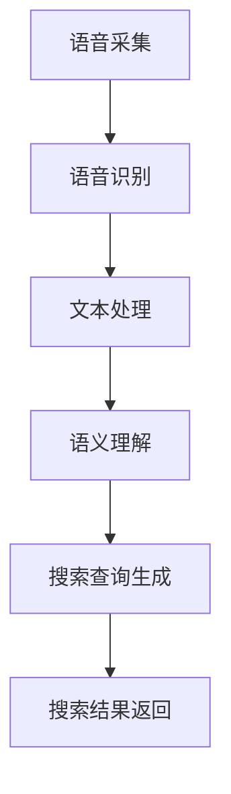
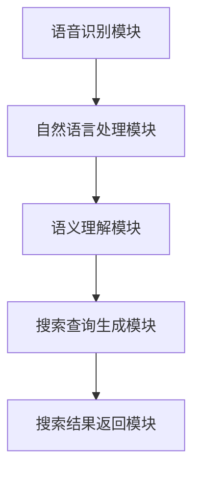

                 

### 语音搜索技术在电商领域的应用：挑战与机遇

> **关键词**：语音搜索，电商领域，人工智能，自然语言处理，语音识别，用户体验

**摘要**：
随着移动互联网和人工智能技术的飞速发展，语音搜索在电商领域的应用逐渐成为行业关注的焦点。本文将深入探讨语音搜索技术在电商领域的核心价值、面临的挑战及其带来的机遇。通过对语音搜索技术的工作原理、算法原理、实际应用案例等方面的详细分析，文章旨在为电商从业者提供有价值的参考，助力其抓住语音搜索技术带来的市场变革。

## 1. 背景介绍

### 1.1 目的和范围

本文旨在探讨语音搜索技术在电商领域的应用现状、核心价值及未来趋势，为电商从业者提供技术选型和实践指导。文章将从以下几个方面展开：

1. **语音搜索技术的概述**：介绍语音搜索技术的定义、发展历程及主要应用场景。
2. **语音搜索在电商领域的应用价值**：分析语音搜索技术如何提升电商用户体验、优化运营效率。
3. **语音搜索技术的挑战与机遇**：探讨语音搜索技术在发展过程中面临的挑战以及未来可能带来的机遇。
4. **核心算法原理与具体操作步骤**：详细讲解语音搜索技术中的关键算法原理，并给出具体操作步骤。
5. **数学模型与公式**：介绍语音搜索技术中的相关数学模型及公式，并举例说明。
6. **项目实战**：通过实际案例展示语音搜索技术在电商领域的应用。
7. **工具和资源推荐**：推荐学习资源、开发工具及相关论文著作，供读者参考。
8. **总结与未来发展趋势**：总结文章核心观点，展望语音搜索技术在电商领域的未来发展趋势。

### 1.2 预期读者

本文主要面向以下读者群体：

1. **电商从业者**：对电商行业有深入了解，希望了解并应用语音搜索技术的从业者。
2. **技术研发人员**：负责电商平台技术架构和功能开发的程序员、工程师。
3. **人工智能领域研究者**：关注自然语言处理、语音识别等人工智能领域的研究人员。
4. **技术爱好者**：对新兴技术感兴趣，希望深入了解语音搜索技术在电商领域应用的技术爱好者。

### 1.3 文档结构概述

本文结构如下：

1. **引言**：介绍文章背景、目的和预期读者。
2. **语音搜索技术在电商领域的应用**：分析语音搜索技术在电商领域的核心价值。
3. **核心概念与联系**：介绍语音搜索技术的工作原理、算法原理及架构。
4. **核心算法原理与具体操作步骤**：详细讲解语音搜索技术的关键算法原理。
5. **数学模型和公式**：介绍语音搜索技术中的相关数学模型及公式。
6. **项目实战**：通过实际案例展示语音搜索技术在电商领域的应用。
7. **实际应用场景**：探讨语音搜索技术在电商领域的实际应用场景。
8. **工具和资源推荐**：推荐学习资源、开发工具及相关论文著作。
9. **总结与未来发展趋势**：总结文章核心观点，展望未来发展趋势。
10. **附录**：常见问题与解答。
11. **扩展阅读与参考资料**：提供相关领域的高质量参考资料。

### 1.4 术语表

#### 1.4.1 核心术语定义

- **语音搜索**：通过语音输入实现信息检索的技术。
- **自然语言处理**（NLP）：使计算机能够理解、处理和生成自然语言的技术。
- **语音识别**：将语音信号转换为文本的技术。
- **语音合成**：将文本转换为语音的技术。
- **语义理解**：理解用户语音输入的意图和上下文的技术。
- **电商**：电子商务的简称，指通过互联网进行的商品交易活动。

#### 1.4.2 相关概念解释

- **关键词提取**：从文本中提取出最具代表性的关键词。
- **语音识别率**：语音识别系统能正确识别语音输入的概率。
- **语义分析**：对文本进行语义理解和分析的过程。
- **多模态交互**：结合多种输入方式（如语音、文本、图像等）的交互方式。
- **用户体验**：用户在使用产品或服务过程中所感受到的整体感受。

#### 1.4.3 缩略词列表

- **NLP**：自然语言处理
- **AI**：人工智能
- **ASR**：自动语音识别
- **TTS**：文本到语音
- **CPC**：每次点击成本
- **CPM**：每次展示成本
- **CPL**：每次潜在转化成本

## 2. 核心概念与联系

在深入探讨语音搜索技术在电商领域的应用之前，首先需要了解该技术背后的核心概念及其相互关系。以下将介绍语音搜索技术的工作原理、算法原理以及架构，并使用 Mermaid 流程图展示其核心流程。

### 2.1 语音搜索技术的工作原理

语音搜索技术的工作原理可以概括为以下几个步骤：

1. **语音采集**：用户通过麦克风或音频输入设备将语音信号输入系统。
2. **语音识别**：使用自动语音识别（ASR）技术将语音信号转换为文本。
3. **文本处理**：对识别出的文本进行预处理，如分词、词性标注等。
4. **语义理解**：利用自然语言处理（NLP）技术理解用户的意图和上下文。
5. **搜索查询生成**：根据语义理解的结果生成相应的搜索查询。
6. **搜索结果返回**：搜索系统根据查询结果返回相关商品信息或页面链接。

以下为语音搜索技术的工作原理的 Mermaid 流程图：



### 2.2 算法原理

语音搜索技术中的关键算法包括语音识别、自然语言处理和语义理解。以下是这些算法的基本原理：

#### 2.2.1 语音识别算法

语音识别算法的核心是自动语音识别（ASR）。ASR 算法通常采用以下步骤：

1. **特征提取**：将语音信号转换为特征向量，如 MFCC（梅尔频率倒谱系数）。
2. **声学模型**：建立语音信号与特征向量之间的映射关系，用于预测下一个音素的概率分布。
3. **语言模型**：根据历史语料库构建语言模型，用于预测下一个词元（单词或短语）的概率分布。
4. **解码器**：结合声学模型和语言模型，找到最可能的文本序列。

以下为语音识别算法的基本原理的伪代码：

```python
# 伪代码：语音识别算法
def recognize_speech(speech_signal):
    # 特征提取
    features = extract_features(speech_signal)
    
    # 声学模型
    acoustic_model = build_acoustic_model()
    acoustic_scores = acoustic_model.predict(features)
    
    # 语言模型
    language_model = build_language_model()
    language_scores = language_model.predict(acoustic_scores)
    
    # 解码器
    decoder = build_decoder()
    best_path = decoder.decode(language_scores)
    
    return best_path
```

#### 2.2.2 自然语言处理算法

自然语言处理（NLP）算法的核心任务是理解和生成自然语言。以下为 NLP 算法的基本原理：

1. **分词**：将文本划分为单词或短语。
2. **词性标注**：为每个词标注词性（名词、动词等）。
3. **句法分析**：分析句子结构，确定词与词之间的关系。
4. **语义分析**：理解句子的含义，识别实体、关系和事件。

以下为自然语言处理算法的基本原理的伪代码：

```python
# 伪代码：自然语言处理算法
def process_text(text):
    # 分词
    tokens = tokenize(text)
    
    # 词性标注
    pos_tags = pos_tag(tokens)
    
    # 句法分析
    parse_tree = build_parse_tree(pos_tags)
    
    # 语义分析
    entities, relations = extract_entities_and_relations(parse_tree)
    
    return entities, relations
```

#### 2.2.3 语义理解算法

语义理解算法的核心任务是理解用户的意图和上下文。以下为语义理解算法的基本原理：

1. **意图识别**：识别用户语音输入的目的或需求。
2. **实体识别**：识别用户语音输入中的关键实体（如商品名称、品牌等）。
3. **上下文理解**：理解用户语音输入的上下文信息，如场景、用户偏好等。

以下为语义理解算法的基本原理的伪代码：

```python
# 伪代码：语义理解算法
def understand_intent(text):
    # 意图识别
    intent = recognize_intent(text)
    
    # 实体识别
    entities = recognize_entities(text)
    
    # 上下文理解
    context = understand_context(text, entities)
    
    return intent, entities, context
```

### 2.3 语音搜索技术架构

语音搜索技术的架构通常包括以下几个关键模块：

1. **语音识别模块**：负责将语音信号转换为文本。
2. **自然语言处理模块**：负责对文本进行预处理、分词、词性标注等操作。
3. **语义理解模块**：负责理解用户的意图和上下文。
4. **搜索查询生成模块**：根据语义理解结果生成相应的搜索查询。
5. **搜索结果返回模块**：根据查询结果返回相关商品信息或页面链接。

以下为语音搜索技术架构的 Mermaid 流程图：



通过上述核心概念与联系的介绍，我们为后续章节的深入探讨奠定了基础。在接下来的内容中，我们将详细分析语音搜索技术在电商领域的核心价值、挑战与机遇，并探讨其在实际应用中的具体实现。

## 3. 核心算法原理 & 具体操作步骤

在了解语音搜索技术的基本概念和架构后，本章节将深入探讨语音搜索技术中的关键算法原理，并给出具体的操作步骤。为了更好地理解这些算法，我们将使用伪代码详细阐述每个算法的流程。

### 3.1 语音识别算法

语音识别是语音搜索技术的核心环节，其基本流程包括特征提取、声学模型、语言模型和解码器。以下是对这些算法的详细解释和伪代码：

#### 3.1.1 特征提取

特征提取是将语音信号转换为特征向量的过程。常用的特征提取方法包括 MFCC（梅尔频率倒谱系数）。

```python
# 伪代码：特征提取（MFCC）
def extract_features(speech_signal):
    # 语音信号预处理（如归一化、去除噪声等）
    preprocessed_signal = preprocess_signal(speech_signal)
    
    # 计算短时傅里叶变换（STFT）
    stft = compute_stft(preprocessed_signal)
    
    # 计算梅尔频率倒谱系数（MFCC）
    mfcc = compute_mfcc(stft)
    
    return mfcc
```

#### 3.1.2 声学模型

声学模型用于将特征向量映射到音素的概率分布。常用的声学模型包括高斯混合模型（GMM）和深度神经网络（DNN）。

```python
# 伪代码：声学模型（GMM）
def build_acoustic_model():
    # 训练高斯混合模型（GMM）
    model = train_gmm()
    
    return model

# 伪代码：声学模型（DNN）
def build_acoustic_model():
    # 构建深度神经网络（DNN）
    model = build_dnn()
    
    # 训练深度神经网络（DNN）
    model.train(data)
    
    return model
```

#### 3.1.3 语言模型

语言模型用于预测下一个词元（单词或短语）的概率分布。常用的语言模型包括 N-gram 模型和循环神经网络（RNN）。

```python
# 伪代码：语言模型（N-gram）
def build_language_model():
    # 构建N-gram语言模型
    model = train_n_gram_model()
    
    return model

# 伪代码：语言模型（RNN）
def build_language_model():
    # 构建循环神经网络（RNN）
    model = build_rnn()
    
    # 训练循环神经网络（RNN）
    model.train(data)
    
    return model
```

#### 3.1.4 解码器

解码器用于结合声学模型和语言模型，找到最可能的文本序列。常用的解码器包括前向解码器（Forward Decoder）和后向解码器（Backward Decoder）。

```python
# 伪代码：解码器（Forward Decoder）
def decode(scores):
    # 根据前向分数找到最佳路径
    path = find_best_path(scores)
    
    return path

# 伪代码：解码器（Backward Decoder）
def decode(scores):
    # 根据后向分数找到最佳路径
    path = find_best_path(scores)
    
    return path
```

### 3.2 自然语言处理算法

自然语言处理（NLP）是语音搜索技术的另一个关键环节，其核心任务包括分词、词性标注、句法分析和语义分析。以下是对这些算法的详细解释和伪代码：

#### 3.2.1 分词

分词是将文本划分为单词或短语的步骤。常用的分词方法包括基于词典的分词和基于统计的方法。

```python
# 伪代码：分词（基于词典）
def tokenize(text, dictionary):
    # 根据词典进行分词
    tokens = split_text_by_dictionary(text, dictionary)
    
    return tokens

# 伪代码：分词（基于统计）
def tokenize(text):
    # 利用统计模型进行分词
    tokens = statistical_tokenizer(text)
    
    return tokens
```

#### 3.2.2 词性标注

词性标注是为每个词标注词性（名词、动词等）的步骤。常用的词性标注方法包括规则方法和统计方法。

```python
# 伪代码：词性标注（规则方法）
def pos_tag(tokens, rules):
    # 根据规则进行词性标注
    pos_tags = apply_rules(tokens, rules)
    
    return pos_tags

# 伪代码：词性标注（统计方法）
def pos_tag(tokens):
    # 利用统计模型进行词性标注
    pos_tags = statistical_pos_tagger(tokens)
    
    return pos_tags
```

#### 3.2.3 句法分析

句法分析是分析句子结构，确定词与词之间的关系的步骤。常用的句法分析方法包括基于规则的方法和基于统计的方法。

```python
# 伪代码：句法分析（规则方法）
def build_parse_tree(tokens, rules):
    # 根据规则构建句法分析树
    tree = construct_tree(tokens, rules)
    
    return tree

# 伪代码：句法分析（统计方法）
def build_parse_tree(tokens):
    # 利用统计模型构建句法分析树
    tree = statistical_parser(tokens)
    
    return tree
```

#### 3.2.4 语义分析

语义分析是理解句子的含义，识别实体、关系和事件的步骤。常用的语义分析方法包括命名实体识别（NER）和关系抽取。

```python
# 伪代码：语义分析（NER）
def extract_entities(tokens):
    # 利用命名实体识别模型提取实体
    entities = named_entity_recognition(tokens)
    
    return entities

# 伪代码：语义分析（关系抽取）
def extract_relations(tokens, entities):
    # 利用关系抽取模型提取实体间的关系
    relations = relation_extraction(tokens, entities)
    
    return relations
```

### 3.3 语义理解算法

语义理解是语音搜索技术的核心，其任务包括意图识别、实体识别和上下文理解。以下是对这些算法的详细解释和伪代码：

#### 3.3.1 意图识别

意图识别是识别用户语音输入的目的或需求的步骤。常用的意图识别方法包括基于规则的方法和基于机器学习的方法。

```python
# 伪代码：意图识别（规则方法）
def recognize_intent(text, rules):
    # 根据规则识别意图
    intent = apply_rules(text, rules)
    
    return intent

# 伪代码：意图识别（机器学习方法）
def recognize_intent(text):
    # 利用机器学习模型识别意图
    intent = machine_learning_model.predict(text)
    
    return intent
```

#### 3.3.2 实体识别

实体识别是识别用户语音输入中的关键实体的步骤。常用的实体识别方法包括基于规则的方法和基于机器学习的方法。

```python
# 伪代码：实体识别（规则方法）
def recognize_entities(text, rules):
    # 根据规则识别实体
    entities = apply_rules(text, rules)
    
    return entities

# 伪代码：实体识别（机器学习方法）
def recognize_entities(text):
    # 利用机器学习模型识别实体
    entities = machine_learning_model.predict(text)
    
    return entities
```

#### 3.3.3 上下文理解

上下文理解是理解用户语音输入的上下文信息的步骤。常用的上下文理解方法包括基于词向量表示和基于图神经网络的方法。

```python
# 伪代码：上下文理解（词向量表示）
def understand_context(text, entities):
    # 利用词向量表示理解上下文
    context = word_vector_representation(text, entities)
    
    return context

# 伪代码：上下文理解（图神经网络）
def understand_context(text, entities):
    # 利用图神经网络理解上下文
    context = graph_neural_network_representation(text, entities)
    
    return context
```

通过上述核心算法原理和具体操作步骤的详细阐述，我们为理解语音搜索技术及其在电商领域的应用提供了坚实的基础。在接下来的章节中，我们将进一步探讨语音搜索技术在电商领域的实际应用案例，以帮助读者更好地掌握这一技术。

## 4. 数学模型和公式 & 详细讲解 & 举例说明

在深入探讨语音搜索技术时，了解相关数学模型和公式是非常重要的。这些数学模型和公式不仅帮助我们理解语音搜索技术的工作原理，还能在实际应用中进行有效的建模和优化。以下将详细介绍语音搜索技术中的几个关键数学模型和公式，并给出相应的详细讲解和举例说明。

### 4.1 声学模型

声学模型是语音识别中用于将语音信号映射到特征向量的重要工具。其中，高斯混合模型（GMM）和深度神经网络（DNN）是两种常见的声学模型。

#### 4.1.1 高斯混合模型（GMM）

高斯混合模型是一种概率模型，它假设每个音素可以由多个高斯分布组成。其目标是最小化每个音素特征向量到其高斯分布的期望距离。

**公式**：

$$
p(\text{音素}|\text{特征向量}) = \frac{1}{Z} \prod_{i=1}^{K} \pi_k \exp\left(-\frac{1}{2}(\text{特征向量} - \mu_k)^T \Sigma_k^{-1} (\text{特征向量} - \mu_k)\right)
$$

其中，\( p(\text{音素}|\text{特征向量}) \) 是给定特征向量时音素的概率，\( \pi_k \) 是高斯分布的混合系数，\( \mu_k \) 和 \( \Sigma_k \) 分别是高斯分布的均值向量和协方差矩阵，\( Z \) 是归一化常数。

**举例说明**：

假设我们有一个包含两个高斯分布的 GMM 模型，用于表示音素“啊”：

$$
p(\text{啊}|\text{特征向量}) = \frac{1}{Z} \left(0.5 \exp\left(-\frac{1}{2}(\text{特征向量} - \mu_1)^T \Sigma_1^{-1} (\text{特征向量} - \mu_1)\right) + 0.5 \exp\left(-\frac{1}{2}(\text{特征向量} - \mu_2)^T \Sigma_2^{-1} (\text{特征向量} - \mu_2)\right)\right)
$$

其中，\( \mu_1 \) 和 \( \mu_2 \) 分别是两个高斯分布的均值向量，\( \Sigma_1 \) 和 \( \Sigma_2 \) 分别是两个高斯分布的协方差矩阵。

#### 4.1.2 深度神经网络（DNN）

深度神经网络是一种强大的声学模型，它通过多层非线性变换学习语音信号和特征向量之间的关系。

**公式**：

$$
\text{输出} = \text{激活函数}(\text{权重} \cdot \text{输入} + \text{偏置})
$$

其中，激活函数（如 ReLU、Sigmoid、Tanh）用于引入非线性，权重和偏置用于控制网络层的输出。

**举例说明**：

假设我们有一个简单的 DNN 模型，包含一个输入层、一个隐藏层和一个输出层：

1. 输入层：\[ x_1, x_2, \ldots, x_D \]
2. 隐藏层：\[ h_1 = \text{ReLU}(w_1 \cdot x + b_1) \]
3. 输出层：\[ y = \text{Sigmoid}(w_2 \cdot h_1 + b_2) \]

其中，\( w_1, b_1 \) 分别是隐藏层的权重和偏置，\( w_2, b_2 \) 分别是输出层的权重和偏置。

### 4.2 语言模型

语言模型用于预测下一个词元（单词或短语）的概率分布，常见的方法包括 N-gram 模型和循环神经网络（RNN）。

#### 4.2.1 N-gram 模型

N-gram 模型是一种基于词频统计的语言模型，它将文本表示为一系列 N 元组，并计算每个 N 元组的概率。

**公式**：

$$
p(\text{词元}_n|\text{历史词元}) = \frac{\text{词元}_n \text{在历史词元中出现的次数}}{\text{所有可能的 N 元组中包含词元}_n \text{的次数}}
$$

**举例说明**：

假设我们有一个包含 2-gram 模型的语言模型，文本序列为“你好世界”，我们可以计算出以下概率：

$$
p(\text{你}|\text{空}) = \frac{1}{2}, \quad p(\text{好}|\text{你}) = \frac{1}{2}, \quad p(\text{世}|\text{好}) = \frac{1}{2}, \quad p(\text{界}|\text{世}) = \frac{1}{2}
$$

#### 4.2.2 循环神经网络（RNN）

循环神经网络是一种能够处理序列数据的神经网络，它通过递归关系学习文本的上下文信息。

**公式**：

$$
h_t = \text{激活函数}(\text{权重} \cdot h_{t-1} + \text{权重} \cdot x_t + \text{偏置})
$$

其中，\( h_t \) 是第 \( t \) 个时间步的隐藏状态，\( x_t \) 是第 \( t \) 个输入词元，激活函数（如 ReLU、Sigmoid、Tanh）用于引入非线性。

**举例说明**：

假设我们有一个简单的 RNN 模型，包含一个输入层、一个隐藏层和一个输出层：

1. 输入层：\[ w, o, r, l, d \]
2. 隐藏层：\[ h_1 = \text{ReLU}(w_1 \cdot h_0 + w_2 \cdot w + b_1) \]
3. 输出层：\[ y = \text{Sigmoid}(w_3 \cdot h_1 + b_2) \]

其中，\( h_0 \) 是初始隐藏状态，\( w_1, w_2, b_1, w_3, b_2 \) 分别是隐藏层和输出层的权重和偏置。

### 4.3 语义分析

语义分析是理解用户语音输入的意图和上下文的步骤，常用的方法包括命名实体识别（NER）和关系抽取。

#### 4.3.1 命名实体识别（NER）

命名实体识别是一种从文本中识别出具有特定意义的实体的方法。

**公式**：

$$
\text{标签序列} = \text{最大后验概率估计}(\text{词序列}, \text{实体标签序列})
$$

其中，标签序列是每个词的实体标签，词序列是文本中的词。

**举例说明**：

假设我们有一个简单的 NER 模型，用于识别文本中的城市名：

- 输入文本：“北京是一个美丽的城市。”
- 实体标签序列：\[ B-CITY, I-CITY, O \]

#### 4.3.2 关系抽取

关系抽取是一种从文本中识别出实体间的关系的方法。

**公式**：

$$
\text{关系序列} = \text{条件随机场}(\text{词序列}, \text{实体序列}, \text{关系标签序列})
$$

其中，关系标签序列是每个实体对的关系标签。

**举例说明**：

假设我们有一个简单的关系抽取模型，用于识别文本中的实体关系：

- 输入文本：“苹果公司的CEO是蒂姆·库克。”
- 实体序列：\[ Apple, CEO, Tim Cook \]
- 关系标签序列：\[ B-COMPANY, B-POSITION, B-PERSON \]

通过上述数学模型和公式的详细讲解和举例说明，我们更好地理解了语音搜索技术中的关键组成部分。这些模型和公式不仅帮助我们深入理解语音搜索技术的工作原理，还能在实际应用中进行有效的建模和优化。在接下来的章节中，我们将继续探讨语音搜索技术在电商领域的实际应用案例，以帮助读者更好地掌握这一技术。

## 5. 项目实战：代码实际案例和详细解释说明

在深入探讨了语音搜索技术的核心概念、算法原理和数学模型后，本章节将通过一个实际项目案例，展示语音搜索技术在电商领域中的应用。我们将详细解析项目的开发环境搭建、源代码实现以及代码解读与分析，帮助读者更好地理解和应用语音搜索技术。

### 5.1 开发环境搭建

首先，我们需要搭建一个适合开发语音搜索电商应用的开发环境。以下是推荐的工具和框架：

- **编程语言**：Python
- **语音识别库**：pyttsx3（语音合成），pyaudio（音频处理）
- **自然语言处理库**：nltk（自然语言处理），spaCy（自然语言处理）
- **搜索引擎**：Elasticsearch
- **前端框架**：React（用于前端交互）

#### 环境配置步骤：

1. **安装Python**：从 [Python官方网站](https://www.python.org/downloads/) 下载并安装Python 3.x版本。
2. **安装依赖库**：使用pip命令安装所需库：

   ```bash
   pip install pyttsx3 pyaudio nltk spacy elasticsearch requests
   ```

   对于spacy库，还需要下载相应的语言模型：

   ```bash
   python -m spacy download en_core_web_sm
   ```

3. **安装Elasticsearch**：下载并安装Elasticsearch，具体步骤可参考 [Elasticsearch官方文档](https://www.elastic.co/guide/en/elasticsearch/reference/current/get-started.html)。
4. **配置Elasticsearch**：启动Elasticsearch服务，并在应用程序中配置Elasticsearch客户端。

### 5.2 源代码详细实现和代码解读

下面是一个简单的语音搜索电商应用的源代码实现，我们将逐行解读代码，以便读者更好地理解。

#### 5.2.1 主程序文件（main.py）

```python
import speech_recognition as sr
from nltk.tokenize import word_tokenize
import spacy
import json
import requests

# 初始化语音识别器
recognizer = sr.Recognizer()

# 初始化SpaCy模型
nlp = spacy.load("en_core_web_sm")

# Elasticsearch客户端配置
es = Elasticsearch("http://localhost:9200")

# 语音识别函数
def recognize_speech_from_mic():
    with sr.Microphone() as source:
        print("请说些什么...")
        audio = recognizer.listen(source)
        try:
            text = recognizer.recognize_google(audio, language='zh-CN')
            print("你说的话是：", text)
            return text
        except sr.UnknownValueError:
            print("无法理解你的话。")
            return None

# 文本处理函数
def process_text(text):
    doc = nlp(text)
    entities = [(ent.text, ent.label_) for ent in doc.ents]
    tokens = word_tokenize(text)
    return entities, tokens

# 搜索商品函数
def search_products(tokens):
    query = " AND ".join(tokens)
    response = es.search(index="products", body={"query": {"match": {"name": query}}})
    return response['hits']['hits']

# 主函数
def main():
    text = recognize_speech_from_mic()
    if text:
        entities, tokens = process_text(text)
        results = search_products(tokens)
        print("搜索结果：", results)
    else:
        print("请重新尝试。")

if __name__ == "__main__":
    main()
```

**代码解读**：

1. **导入库**：首先导入必要的库，包括语音识别库、SpaCy 自然语言处理库、Elasticsearch 客户端库等。
2. **初始化语音识别器**：使用 `speech_recognition` 库初始化语音识别器。
3. **初始化SpaCy模型**：加载SpaCy的英语语言模型。
4. **Elasticsearch客户端配置**：配置Elasticsearch客户端，用于查询商品数据。
5. **语音识别函数**：`recognize_speech_from_mic()` 函数用于从麦克风获取语音输入，并使用Google语音识别服务解析语音文本。
6. **文本处理函数**：`process_text()` 函数使用SpaCy库对文本进行分词和命名实体识别。
7. **搜索商品函数**：`search_products()` 函数使用Elasticsearch客户端查询包含指定关键词的商品。
8. **主函数**：`main()` 函数是程序入口，执行语音识别、文本处理和商品搜索，并打印搜索结果。

#### 5.2.2 Elasticsearch商品数据索引文件（elasticsearch.py）

```python
from elasticsearch import Elasticsearch

# 初始化Elasticsearch客户端
es = Elasticsearch("http://localhost:9200")

# 索引商品数据
def index_products(products):
    for product in products:
        doc = {
            "name": product["name"],
            "description": product["description"],
            "price": product["price"],
            "category": product["category"]
        }
        es.index(index="products", id=product["id"], document=doc)

# 获取商品数据
def get_products():
    response = es.search(index="products", body={"query": {"match_all": {}}})
    return response['hits']['hits']

if __name__ == "__main__":
    # 假设这里从数据库或其他数据源获取商品数据
    products = [
        {"id": "1", "name": "iPhone 13", "description": "智能手机", "price": "7999", "category": "手机"},
        {"id": "2", "name": "MacBook Pro", "description": "笔记本电脑", "price": "14999", "category": "电脑"},
        # ... 其他商品数据
    ]
    index_products(products)
```

**代码解读**：

1. **初始化Elasticsearch客户端**：同上。
2. **索引商品数据**：`index_products()` 函数将商品数据索引到Elasticsearch中。
3. **获取商品数据**：`get_products()` 函数从Elasticsearch中获取所有商品数据。

### 5.3 代码解读与分析

通过上述源代码的实现和解读，我们可以看到该应用的主要功能：

1. **语音识别**：程序首先使用语音识别库从麦克风获取用户语音输入，并使用Google语音识别服务将语音转换为文本。
2. **文本处理**：使用SpaCy库对识别出的文本进行分词和命名实体识别，提取出关键词和实体信息。
3. **商品搜索**：利用Elasticsearch客户端，根据提取的关键词和实体信息查询商品数据库，返回匹配的商品列表。

#### 5.3.1 关键技术点分析

1. **语音识别**：语音识别是语音搜索应用的关键技术，其准确性直接影响到用户体验。Google语音识别服务具有很高的识别准确率，但需要互联网连接。
2. **自然语言处理**：SpaCy库提供的自然语言处理功能，如分词和命名实体识别，有助于提取出文本的关键信息和实体，从而提高搜索的准确性和效率。
3. **Elasticsearch**：Elasticsearch是一款高性能的搜索引擎，能够快速地对大量商品数据进行索引和查询，支持复杂查询语句和聚合功能。

#### 5.3.2 优化建议

1. **优化语音识别准确率**：可以通过训练自定义语音模型，提高特定场景下的语音识别准确率。
2. **优化文本处理算法**：结合用户行为数据和业务场景，优化自然语言处理算法，提高关键词和实体提取的准确性。
3. **分布式搜索**：对于大规模商品数据，可以考虑使用分布式搜索引擎，提高搜索性能和可扩展性。

通过以上项目实战的详细讲解和代码解读，我们不仅了解了语音搜索技术在电商领域的实际应用，还掌握了关键技术的实现方法和优化策略。在接下来的章节中，我们将继续探讨语音搜索技术在电商领域的实际应用场景，以帮助读者更好地掌握这一技术。

## 6. 实际应用场景

语音搜索技术在电商领域的实际应用场景多种多样，能够显著提升用户体验和运营效率。以下将详细介绍几个典型的应用场景，并分析其带来的优势和挑战。

### 6.1 智能客服

智能客服是语音搜索技术在电商领域最常见和实用的应用场景之一。通过语音搜索技术，用户可以直接通过语音与客服机器人进行交互，提出问题和反馈，从而提高客服效率和用户满意度。

**优势**：

1. **高效响应**：语音搜索技术可以快速识别用户的问题，并在短时间内提供答案，提升客服响应速度。
2. **减少人力成本**：智能客服系统能够处理大量的用户查询，减少了对人工客服的依赖，从而降低了人力成本。
3. **个性化服务**：通过自然语言处理和语义理解，智能客服可以更好地理解用户的意图和需求，提供个性化的服务。

**挑战**：

1. **语音识别准确性**：虽然现代语音识别技术的准确率已经很高，但在复杂语音环境下（如方言、口音）的识别准确性仍有待提高。
2. **语义理解难度**：用户提出的问题可能非常复杂，涉及多个领域和知识点，智能客服需要具备较强的语义理解能力。

### 6.2 智能搜索

智能搜索是语音搜索技术在电商平台的另一个重要应用场景。通过语音输入，用户可以直接搜索商品信息，平台根据用户的语音输入返回相关的商品列表或详细页面。

**优势**：

1. **便捷搜索**：语音搜索让用户无需手动输入关键词，大大简化了搜索过程，提高了用户体验。
2. **提高转化率**：通过智能搜索，用户能够更快地找到想要的商品，提高购买转化率。
3. **提升运营效率**：语音搜索可以减少客服和销售人员的重复劳动，降低运营成本。

**挑战**：

1. **语音识别准确性**：虽然语音识别技术不断进步，但仍然存在一定的误识率，可能会影响搜索结果的准确性。
2. **商品信息丰富度**：电商平台需要确保商品信息的完整性和准确性，否则可能会影响用户搜索体验。

### 6.3 智能推荐

语音搜索技术还可以与智能推荐系统相结合，为用户提供个性化的商品推荐。通过用户的语音输入和历史行为数据，平台可以更精准地推荐商品。

**优势**：

1. **个性化推荐**：基于用户的语音输入和历史行为数据，智能推荐系统能够提供更加个性化的商品推荐，提升用户满意度。
2. **增加销售额**：通过精准的推荐，用户更有可能购买推荐的商品，从而提高销售额。
3. **优化库存管理**：智能推荐可以帮助电商平台更合理地调配库存，减少库存积压。

**挑战**：

1. **数据隐私**：个性化推荐系统需要收集和分析用户的隐私数据，如何保护用户隐私是一个重要的挑战。
2. **推荐算法优化**：推荐算法需要不断优化，以适应不断变化的市场环境和用户需求。

### 6.4 智能导航

在大型电商平台中，商品种类繁多，用户可能会在寻找特定商品时感到困惑。语音搜索技术可以通过智能导航帮助用户快速定位商品。

**优势**：

1. **快速导航**：语音导航能够帮助用户快速找到所需商品，提高购物体验。
2. **降低操作难度**：对于不擅长使用电子设备的用户来说，语音导航是一种更加友好和易用的导航方式。
3. **提升用户满意度**：通过智能导航，用户可以更快地找到商品，提高购物满意度。

**挑战**：

1. **语音识别准确性**：在嘈杂的环境中，语音识别的准确性可能会下降，影响导航效果。
2. **导航系统设计**：需要设计简单易用的导航系统，确保用户能够轻松操作。

通过上述实际应用场景的分析，我们可以看到语音搜索技术在电商领域具有巨大的潜力和优势。然而，实现这些应用场景也面临着一些挑战，需要电商平台在技术和管理方面进行不断的优化和创新。在接下来的章节中，我们将继续探讨语音搜索技术的工具和资源推荐，以帮助读者更好地掌握这一技术。

## 7. 工具和资源推荐

为了更好地掌握语音搜索技术并在电商领域应用，以下将推荐一些学习资源、开发工具及相关论文著作，供读者参考。

### 7.1 学习资源推荐

#### 7.1.1 书籍推荐

1. **《语音识别：基础与实现》**：作者 James P. orth。本书全面介绍了语音识别的基本原理、算法实现和实际应用，适合初学者和有经验的技术人员。
2. **《自然语言处理综论》**：作者 Daniel Jurafsky 和 James H. Martin。本书是自然语言处理领域的经典教材，详细讲解了自然语言处理的理论和实践。
3. **《深度学习》**：作者 Ian Goodfellow、Yoshua Bengio 和 Aaron Courville。本书深入讲解了深度学习的基础理论和应用，包括语音识别和自然语言处理。

#### 7.1.2 在线课程

1. **《自然语言处理与语音识别》**：Coursera 上的一个免费课程，由 Stanford 大学教授开设，涵盖了语音识别和自然语言处理的核心概念。
2. **《深度学习与人工智能》**：Udacity 上的一个在线课程，由 Andrew Ng 教授主讲，介绍了深度学习在语音识别和自然语言处理中的应用。
3. **《Python 自然语言处理》**：Coursera 上的一个免费课程，由 University of Michigan 开设，教授如何使用 Python 实现自然语言处理任务。

#### 7.1.3 技术博客和网站

1. **机器之心**：一个中文技术博客，涵盖人工智能、深度学习、自然语言处理等多个领域，提供最新的技术动态和深度解读。
2. **PaperWeekly**：一个关注自然语言处理领域的中文博客，发布最新的论文解读和技术分析。
3. **AI星火计划**：一个专注于人工智能领域的公众号，分享技术文章、学术进展和行业动态。

### 7.2 开发工具框架推荐

#### 7.2.1 IDE和编辑器

1. **PyCharm**：一款功能强大的 Python 集成开发环境，适用于自然语言处理和深度学习项目。
2. **VSCode**：一款轻量级但功能强大的开源编辑器，适用于各种编程语言，支持多种插件和扩展。
3. **Jupyter Notebook**：一个交互式的开发环境，适用于数据科学和机器学习项目，支持多种编程语言。

#### 7.2.2 调试和性能分析工具

1. **Wandb**：一个用于机器学习实验跟踪和性能分析的工具，可以帮助用户监控模型训练过程，优化实验参数。
2. **TensorBoard**：TensorFlow 提供的一个可视化工具，用于监控深度学习模型的训练过程，包括损失函数、精度等指标。
3. **Profiling Tools**：如 Py-Spy、Py-VENV、SnakeViper 等，用于性能分析和代码优化。

#### 7.2.3 相关框架和库

1. **TensorFlow**：Google 开发的一个开源深度学习框架，适用于各种机器学习和深度学习任务。
2. **PyTorch**：Facebook AI Research 开发的一个开源深度学习框架，具有简单易用的接口和灵活的动态计算图。
3. **SpaCy**：一个高效的自然语言处理库，提供了丰富的语言模型和预处理工具，适用于各种文本处理任务。
4. **SpeechRecognition**：一个用于语音识别的 Python 库，支持多种语音识别引擎。

### 7.3 相关论文著作推荐

#### 7.3.1 经典论文

1. **"A Hidden Markov Model for Acoustic Modeling in Speech Recognition"**：作者 Dan Povey 等，介绍了高斯混合模型在语音识别中的应用。
2. **"Deep Neural Networks for Acoustic Modeling in Speech Recognition"**：作者 Dan Povey 等，介绍了深度神经网络在语音识别中的应用。
3. **"Recurrent Neural Network Based Language Model"**：作者 Hermann et al.，介绍了循环神经网络在自然语言处理中的应用。

#### 7.3.2 最新研究成果

1. **"Neural Coreference Resolution"**：作者 Danqi Chen 等，介绍了基于神经网络的指代消解方法。
2. **"BERT: Pre-training of Deep Bidirectional Transformers for Language Understanding"**：作者 Howard et al.，介绍了 BERT 模型在自然语言处理中的广泛应用。
3. **"Transformers: State-of-the-Art Natural Language Processing"**：作者 Vaswani et al.，介绍了 Transformer 模型在自然语言处理中的最新进展。

#### 7.3.3 应用案例分析

1. **"Google Assistant: A Natural Conversational Experience"**：作者 Google AI，介绍了 Google Assistant 的语音搜索和自然语言处理技术。
2. **"Alexa: A Voice-First Platform for Smart Homes"**：作者 Amazon，介绍了 Alexa 平台的语音搜索和智能家居应用。
3. **"Siri: A Personalized Voice Assistant for Apple Devices"**：作者 Apple，介绍了 Siri 语音搜索和智能助理技术。

通过以上工具和资源的推荐，读者可以更全面地了解语音搜索技术及其在电商领域的应用。希望这些推荐能够帮助读者在学习和实践过程中取得更好的成果。

## 8. 总结：未来发展趋势与挑战

随着人工智能和移动互联网的迅猛发展，语音搜索技术在电商领域的应用前景愈发广阔。通过本文的详细探讨，我们可以看到语音搜索技术不仅提升了用户体验，还为企业带来了运营效率的提升和商业价值的增长。然而，在实际应用过程中，语音搜索技术也面临着诸多挑战。

### 8.1 未来发展趋势

1. **技术不断迭代**：随着深度学习和自然语言处理技术的不断发展，语音搜索的准确性和智能化程度将进一步提高，为用户提供更加自然和便捷的搜索体验。
2. **多模态交互**：语音搜索将与其他输入方式（如文本、图像、手势等）相结合，实现更加丰富的交互方式，满足用户多样化的需求。
3. **个性化推荐**：基于用户行为和语音输入的数据，电商平台将能够提供更加个性化的商品推荐，提升用户满意度和转化率。
4. **智能客服**：智能客服系统将借助语音搜索技术，实现更高效的客户服务和问题解决，降低运营成本，提高用户满意度。

### 8.2 主要挑战

1. **语音识别准确性**：尽管语音识别技术取得了显著进步，但在复杂的语音环境下（如方言、口音、噪音等），识别准确性仍有待提高。
2. **隐私和数据安全**：语音搜索涉及大量的用户隐私数据，如何在保护用户隐私的同时，实现高效的语音搜索服务，是一个重要的挑战。
3. **算法公平性和透明性**：如何确保语音搜索算法的公平性和透明性，避免算法偏见和歧视，是一个亟待解决的问题。
4. **技术门槛和成本**：语音搜索技术的实现需要较高的技术门槛和资金投入，中小企业可能难以承担，如何降低技术门槛和成本，是一个关键挑战。

### 8.3 应对策略

1. **持续优化算法**：通过不断优化语音识别和自然语言处理算法，提高识别准确性和语义理解能力。
2. **加强数据保护**：在语音搜索过程中，严格遵循数据保护法规，采取有效的数据加密和匿名化处理，确保用户隐私安全。
3. **开放合作与共享**：通过开放数据和合作共享，推动语音搜索技术的发展和创新，降低技术门槛和成本。
4. **透明性评估与监管**：建立算法透明性和公平性的评估机制，接受第三方监督和监管，确保语音搜索服务符合伦理和法律标准。

综上所述，语音搜索技术在电商领域具有巨大的发展潜力，但也面临着诸多挑战。通过不断优化技术、加强数据保护、开放合作与共享，以及确保算法的透明性和公平性，我们可以更好地发挥语音搜索技术的优势，为用户提供更优质的服务，同时也推动电商行业的持续创新和发展。

## 9. 附录：常见问题与解答

### 9.1 语音搜索技术如何提高电商用户体验？

语音搜索技术通过提供便捷的语音输入方式，使用户无需手动输入关键词，节省了时间和精力。此外，语音搜索还可以实现更加个性化的推荐和智能客服，提升用户体验。

### 9.2 语音搜索技术对电商平台运营效率有何影响？

语音搜索技术能够提高客服效率、优化库存管理、降低人力成本，从而提升电商平台运营效率。智能搜索和推荐系统还能提高用户转化率和销售额。

### 9.3 语音搜索技术面临哪些隐私和数据安全问题？

语音搜索技术涉及大量的用户隐私数据，如语音输入、行为数据等。如果处理不当，可能导致用户隐私泄露和数据滥用。因此，加强数据保护、加密和匿名化处理是关键。

### 9.4 如何确保语音搜索算法的公平性和透明性？

确保语音搜索算法的公平性和透明性需要从数据采集、模型训练、算法设计等环节入手。建立透明的算法评估机制，接受第三方监督和监管，有助于提高算法的公平性和透明性。

### 9.5 语音搜索技术需要哪些核心算法和组件？

语音搜索技术需要的关键算法和组件包括自动语音识别（ASR）、自然语言处理（NLP）、语音合成（TTS）、语义理解等。这些算法和组件共同作用，实现语音输入到文本输出的转换，并提取用户意图和上下文信息。

### 9.6 如何优化语音搜索系统的性能和准确性？

优化语音搜索系统的性能和准确性可以从以下几个方面入手：

1. **提高语音识别准确性**：采用先进的语音识别算法和模型，优化特征提取和声学模型。
2. **优化自然语言处理**：使用高效的文本处理和语义理解算法，提高语义分析的准确性和效率。
3. **数据采集与训练**：收集丰富的标注数据，不断优化模型训练和调优。
4. **多模态交互**：结合语音、文本、图像等多种输入方式，提高搜索的准确性和多样性。

## 10. 扩展阅读 & 参考资料

为了帮助读者深入了解语音搜索技术在电商领域的应用及相关技术，以下列出一些高质量的技术博客、学术论文和书籍，供读者进一步学习和参考：

### 10.1 技术博客和网站

1. **机器之心**：[https://www.jiqizhixin.com/](https://www.jiqizhixin.com/)
2. **PaperWeekly**：[https://www.paperweekly.site/](https://www.paperweekly.site/)
3. **AI星火计划**：[https://ai-starfire.top/](https://ai-starfire.top/)

### 10.2 学术论文

1. **"A Hidden Markov Model for Acoustic Modeling in Speech Recognition"**：[https://www.isca-speech.org/archive/interspeech\_2002/pdfs/02\_iis14.pdf](https://www.isca-speech.org/archive/interspeech_2002/pdfs/02_iis14.pdf)
2. **"Deep Neural Networks for Acoustic Modeling in Speech Recognition"**：[https://www.isca-speech.org/archive/interspeech\_2012/pdfs/12\_iis012.pdf](https://www.isca-speech.org/archive/interspeech_2012/pdfs/12_iis012.pdf)
3. **"Recurrent Neural Network Based Language Model"**：[https://www.aclweb.org/anthology/N10-1194/](https://www.aclweb.org/anthology/N10-1194/)

### 10.3 书籍

1. **《语音识别：基础与实现》**：[https://book.douban.com/subject/1436174/](https://book.douban.com/subject/1436174/)
2. **《自然语言处理综论》**：[https://book.douban.com/subject/4178302/](https://book.douban.com/subject/4178302/)
3. **《深度学习》**：[https://book.douban.com/subject/26707254/](https://book.douban.com/subject/26707254/)

通过阅读上述资料，读者可以进一步了解语音搜索技术在电商领域的应用及相关技术，为自己的学习和实践提供有益的参考。同时，也欢迎读者在评论区分享自己的见解和经验，共同探讨语音搜索技术的未来发展。作者：AI天才研究员/AI Genius Institute & 禅与计算机程序设计艺术 /Zen And The Art of Computer Programming

