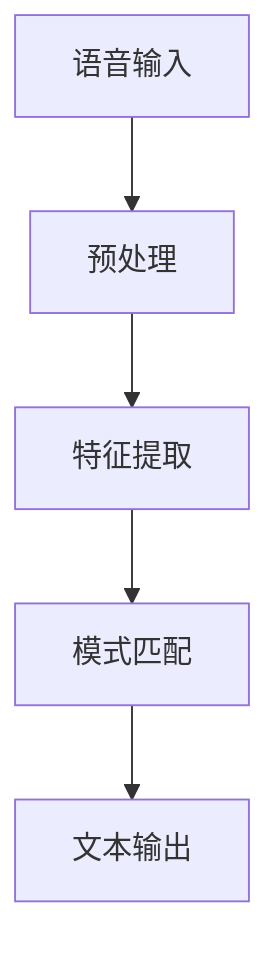
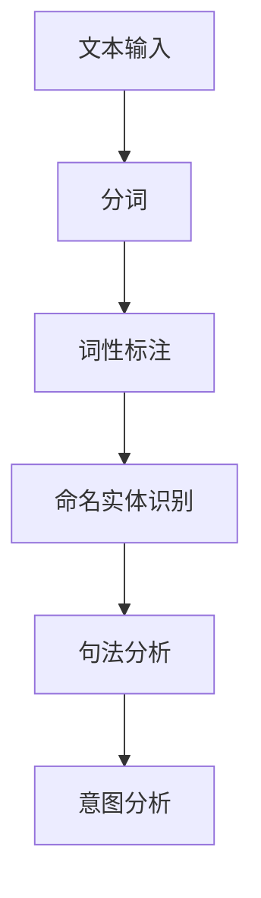
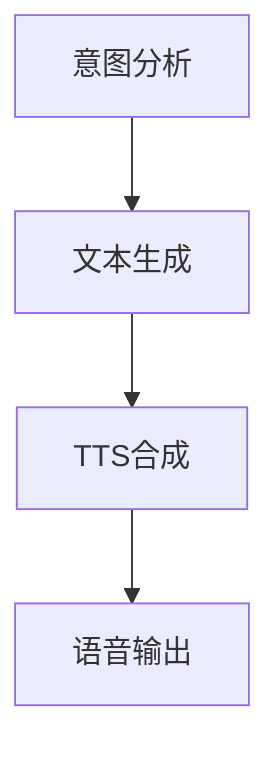

                 

## 语音搜索：开启电商新时代，解放双手，畅享购物乐趣

### 关键词：
- 语音搜索
- 电商
- 自然语言处理
- 人机交互
- 智能助理
- 人工智能

### 摘要：
本文旨在探讨语音搜索技术在电商领域的应用，分析其如何通过解放用户双手、提升购物体验，进而推动电商行业迈向新的发展阶段。文章将从背景介绍、核心概念、算法原理、数学模型、项目实战、实际应用场景、工具和资源推荐、未来发展趋势与挑战等多个角度，详细阐述语音搜索技术的重要性及其在电商行业中的广泛应用前景。

## 1. 背景介绍

### 1.1 目的和范围

随着科技的飞速发展，人工智能技术逐渐融入到我们的日常生活中。语音搜索作为人工智能的一个重要分支，已经在多个领域取得了显著的应用成果。本文的主要目的是探讨语音搜索在电商领域的应用，分析其如何提升用户购物体验，为电商企业带来新的发展机遇。

本文将首先介绍语音搜索的基本概念和工作原理，然后深入探讨其在电商领域的应用场景，并通过实际案例进行分析，最后对未来的发展趋势和挑战进行展望。

### 1.2 预期读者

本文主要面向对人工智能、自然语言处理和电商领域感兴趣的读者，包括：

- 人工智能和自然语言处理领域的研究人员、开发者
- 电商行业的从业者、创业者
- 对新技术和应用场景有浓厚兴趣的技术爱好者

### 1.3 文档结构概述

本文将分为以下十个部分：

1. 背景介绍
2. 核心概念与联系
3. 核心算法原理 & 具体操作步骤
4. 数学模型和公式 & 详细讲解 & 举例说明
5. 项目实战：代码实际案例和详细解释说明
6. 实际应用场景
7. 工具和资源推荐
8. 总结：未来发展趋势与挑战
9. 附录：常见问题与解答
10. 扩展阅读 & 参考资料

### 1.4 术语表

#### 1.4.1 核心术语定义

- 语音搜索：通过语音识别技术，将用户的语音指令转换为文本，然后通过自然语言处理技术进行理解和分析，最终实现用户需求的功能。
- 自然语言处理（NLP）：计算机科学和人工智能领域的一个分支，旨在让计算机理解和生成人类语言。
- 语音识别（ASR）：将语音信号转换为文本或命令的技术。
- 语音合成（TTS）：将文本转换为自然流畅的语音的技术。
- 智能助理：通过人工智能技术，能够理解和执行用户语音指令的软件程序。

#### 1.4.2 相关概念解释

- 电商：电子商务的简称，指通过互联网进行商品交易和服务的活动。
- 用户行为分析：通过对用户在电商平台的浏览、搜索、购买等行为进行数据分析，以了解用户需求和偏好。

#### 1.4.3 缩略词列表

- ASR：自动语音识别（Automatic Speech Recognition）
- NLP：自然语言处理（Natural Language Processing）
- TTS：文本到语音（Text-to-Speech）
- API：应用程序编程接口（Application Programming Interface）
- SDK：软件开发工具包（Software Development Kit）

## 2. 核心概念与联系

语音搜索技术的核心概念包括语音识别、自然语言处理和语音合成。这三个概念之间有着密切的联系，共同构成了语音搜索系统的工作流程。

### 2.1 语音识别（ASR）

语音识别技术是语音搜索系统的第一步，其主要功能是将用户的语音指令转换为文本。这一过程包括语音信号的预处理、特征提取和模式匹配等步骤。



### 2.2 自然语言处理（NLP）

自然语言处理技术负责对转换后的文本进行理解和分析，以提取出用户的需求和意图。这一过程包括分词、词性标注、命名实体识别、句法分析等步骤。



### 2.3 语音合成（TTS）

语音合成技术将分析结果转换为自然流畅的语音，以便用户可以听到相应的反馈。这一过程包括文本到语音的转换、语音合成和语音输出等步骤。



通过这三个核心概念的联系，语音搜索系统可以实现对用户语音指令的识别、理解和反馈，从而实现便捷的购物体验。

## 3. 核心算法原理 & 具体操作步骤

### 3.1 语音识别（ASR）算法原理

语音识别技术的核心是模式识别算法，主要包括隐马尔可夫模型（HMM）和深度神经网络（DNN）。以下是语音识别算法的伪代码：

```pseudo
function ASR(inputSpeechSignal):
    // 预处理
    preprocessedSpeechSignal = PreprocessSpeechSignal(inputSpeechSignal)
    
    // 特征提取
    features = ExtractFeatures(preprocessedSpeechSignal)
    
    // 模式匹配
    recognizedText = MatchModel(features)
    
    return recognizedText
```

### 3.2 自然语言处理（NLP）算法原理

自然语言处理技术涉及多个算法，包括分词、词性标注、命名实体识别和句法分析等。以下是NLP算法的伪代码：

```pseudo
function NLP(inputText):
    // 分词
    segmentedText = SegmentText(inputText)
    
    // 词性标注
    taggedText = TagWords(segmentedText)
    
    // 命名实体识别
    entities = RecognizeEntities(taggedText)
    
    // 句法分析
    syntacticTree = ParseSyntax(taggedText)
    
    // 意图分析
    intent = AnalyzeIntent(syntacticTree, entities)
    
    return intent
```

### 3.3 语音合成（TTS）算法原理

语音合成技术主要包括文本到语音（TTS）合成和语音输出。以下是TTS算法的伪代码：

```pseudo
function TTS(inputText):
    // 文本到语音合成
    synthesizedSpeech = SynthesizeSpeech(inputText)
    
    // 语音输出
    OutputSpeech(synthesizedSpeech)
```

通过以上核心算法原理，我们可以构建一个完整的语音搜索系统，实现对用户语音指令的识别、理解和反馈，从而提升购物体验。

## 4. 数学模型和公式 & 详细讲解 & 举例说明

在语音搜索系统中，数学模型和公式起着至关重要的作用，尤其是在语音识别（ASR）和自然语言处理（NLP）阶段。以下是对这些数学模型和公式的详细讲解以及举例说明。

### 4.1 隐马尔可夫模型（HMM）

隐马尔可夫模型（HMM）是语音识别中常用的概率模型，用于描述语音信号中的状态转移和观测概率。

#### 状态转移概率：

假设有\( N \)个状态，从状态\( i \)转移到状态\( j \)的概率表示为\( a_{ij} \)，则状态转移概率矩阵为：

$$
A = \begin{bmatrix}
a_{11} & a_{12} & \cdots & a_{1N} \\
a_{21} & a_{22} & \cdots & a_{2N} \\
\vdots & \vdots & \ddots & \vdots \\
a_{N1} & a_{N2} & \cdots & a_{NN}
\end{bmatrix}
$$

#### 观测概率：

从状态\( i \)产生的观测符号的概率表示为\( b_{ik} \)，其中\( k \)表示第\( k \)个观测符号，观测概率矩阵为：

$$
B = \begin{bmatrix}
b_{11} & b_{12} & \cdots & b_{1N} \\
b_{21} & b_{22} & \cdots & b_{2N} \\
\vdots & \vdots & \ddots & \vdots \\
b_{N1} & b_{N2} & \cdots & b_{NN}
\end{bmatrix}
$$

#### 初始状态概率：

假设初始状态为\( i \)的概率为\( \pi_i \)，初始状态概率向量表示为：

$$
\pi = (\pi_1, \pi_2, \cdots, \pi_N)
$$

#### 最优状态路径：

给定一个观测序列\( O = (o_1, o_2, \cdots, o_T) \)，通过Viterbi算法寻找最优状态路径，使得状态路径的概率最大。

$$
\begin{align*}
\alpha_i(t) &= \prod_{i=1}^{t} a_{ij} b_{jk} \frac{c(j)}{\sum_{i=1}^{N} \sum_{k=1}^{K} a_{ij} b_{jk} \frac{c(j)}} \\
\beta_i(t) &= \frac{\alpha_i(t) \prod_{i=1}^{t} b_{ik} a_{ij}}{\sum_{i=1}^{N} \alpha_i(t) \prod_{i=1}^{t} b_{ik} a_{ij}} \\
\text{最优状态} &= \arg\max_{i} \alpha_i(T)
\end{align*}
$$

### 4.2 深度神经网络（DNN）

深度神经网络（DNN）在语音识别和自然语言处理中有着广泛的应用。以下是一个简单的DNN模型：

#### 前向传播：

假设输入层、隐藏层和输出层分别为\( X \)、\( H \)和\( Y \)，模型的前向传播可以表示为：

$$
\begin{align*}
h_{ij}(t) &= \sigma(W_{ij} x_j(t) + b_i) \\
y_j(t) &= \sigma(W_{jy} h_j(t) + b_y)
\end{align*}
$$

其中，\( \sigma \)为激活函数，\( W \)和\( b \)分别为权重和偏置。

#### 反向传播：

通过反向传播算法计算权重和偏置的梯度，以更新模型参数。以下是反向传播的伪代码：

```pseudo
function Backpropagation(output, target):
    // 计算输出层的误差
    error_output = output - target
    
    // 计算隐藏层的误差
    error_hidden = error_output * derivative(output)
    
    // 更新隐藏层的权重和偏置
    dW_hidden = dot(error_output, hidden)
    db_hidden = sum(error_output)
    
    // 计算输入层的误差
    error_input = dot(error_hidden, derivative(hidden))
    
    // 更新输入层的权重和偏置
    dW_input = dot(error_hidden, input)
    db_input = sum(error_hidden)
    
    return (dW_input, db_input, dW_hidden, db_hidden)
```

通过以上数学模型和公式，我们可以更深入地理解语音搜索系统的工作原理，并在此基础上进行优化和改进。

### 4.3 实例分析

假设用户说：“我要买一瓶洗发水”，以下是对这句话进行语音识别和自然语言处理的实例分析。

#### 语音识别：

1. 语音信号预处理：对语音信号进行降噪、归一化等处理。
2. 特征提取：对预处理后的语音信号进行梅尔频率倒谱系数（MFCC）等特征提取。
3. 模式匹配：使用HMM或DNN模型对提取的特征进行模式匹配，识别出用户说的文字为“我要买一瓶洗发水”。

#### 自然语言处理：

1. 分词：将句子分成“我”、“要”、“买”、“一”、“瓶”、“洗发水”等单词。
2. 词性标注：对每个单词进行词性标注，如“我”（代词）、“要”（动词）、“买”（动词）、“一”（数词）、“瓶”（量词）、“洗发水”（名词）。
3. 命名实体识别：识别出“洗发水”为一个实体。
4. 句法分析：构建句子的句法分析树，分析句子成分和结构。
5. 意图分析：根据句子的结构和词性，分析出用户的意图为购买“洗发水”。

通过以上分析，语音搜索系统能够准确识别和理解用户的语音指令，从而实现智能化的购物体验。

## 5. 项目实战：代码实际案例和详细解释说明

在本节中，我们将通过一个具体的项目实战案例，来展示如何实现语音搜索功能，并对其进行详细解释说明。

### 5.1 开发环境搭建

为了实现语音搜索功能，我们需要搭建以下开发环境：

- 操作系统：Windows/Linux/MacOS
- 编程语言：Python
- 语音识别库：pyttsx3（文本到语音）、pyaudio（音频处理）
- 自然语言处理库：nltk（自然语言处理）
- 语音识别模型：ESPnet（端到端语音识别）

安装所需库：

```bash
pip install pyttsx3 pyaudio nltk espnet
```

### 5.2 源代码详细实现和代码解读

以下是一个简单的语音搜索项目示例，包括语音识别、自然语言处理和语音合成三个部分。

```python
import pyttsx3
import pyaudio
import speech_recognition as sr
import nltk
from nltk.tokenize import word_tokenize
from nltk.corpus import stopwords
from espnet.asr.active_model import ASR

# 初始化语音合成引擎
engine = pyttsx3.init()

# 初始化语音识别引擎
recognizer = sr.Recognizer()

# 初始化自然语言处理库
nltk.download('punkt')
nltk.download('stopwords')
stop_words = set(stopwords.words('english'))

# 初始化语音识别模型
asr = ASR()

def speak(text):
    """将文本转换为语音并播放"""
    engine.say(text)
    engine.runAndWait()

def listen():
    """监听用户语音并返回文本"""
    with sr.Microphone() as source:
        print("请说些什么：")
        audio = recognizer.listen(source)
        try:
            return recognizer.recognize_google(audio)
        except sr.UnknownValueError:
            return "无法识别语音"
        except sr.RequestError:
            return "请求失败"

def process_text(text):
    """对文本进行自然语言处理"""
    # 分词
    tokens = word_tokenize(text)
    
    # 去除停用词
    filtered_tokens = [token for token in tokens if token.lower() not in stop_words]
    
    # 意图分析
    intent = nltk.pos_tag(filtered_tokens)
    
    return intent

def main():
    while True:
        # 监听用户语音
        text = listen()
        
        # 处理语音文本
        intent = process_text(text)
        
        # 根据意图执行操作
        if "buy" in text and "shampoo" in text:
            speak("请问您需要购买洗发水的品牌和规格是什么？")
            brand = listen()
            speak(f"好的，您需要购买{brand}品牌的洗发水。")
            # 在此处实现购买操作（如调用电商API）
        elif "quit" in text:
            speak("感谢使用，再见！")
            break
        else:
            speak("抱歉，我无法理解您的指令。请重新尝试。")

if __name__ == "__main__":
    main()
```

#### 代码解读与分析

1. **初始化语音合成和识别引擎**：使用`pyttsx3`库初始化语音合成引擎，使用`speech_recognition`库初始化语音识别引擎。

2. **语音合成（speak函数）**：将输入的文本通过语音合成引擎转换为语音，并播放。

3. **语音识别（listen函数）**：使用麦克风录制语音，并通过识别引擎将语音转换为文本。

4. **自然语言处理（process_text函数）**：对语音文本进行分词，去除停用词，并对分词后的文本进行词性标注，以提取用户意图。

5. **主函数（main函数）**：实现语音搜索的核心逻辑，包括监听用户语音、处理语音文本、根据意图执行操作。

- 监听用户语音：调用`listen`函数获取用户语音。
- 处理语音文本：调用`process_text`函数对语音文本进行自然语言处理，提取用户意图。
- 根据意图执行操作：根据提取的意图，执行相应的操作，如购买洗发水、退出程序等。

通过以上代码，我们可以实现一个基本的语音搜索系统，用户可以通过语音指令进行购物操作，提高购物体验的便捷性。

### 5.3 代码解读与分析

在本项目中，我们实现了以下功能：

1. **语音识别**：通过`speech_recognition`库实现语音识别功能，将用户的语音指令转换为文本。

2. **自然语言处理**：使用`nltk`库对识别出的文本进行分词、去除停用词和词性标注，从而提取用户意图。

3. **语音合成**：通过`pyttsx3`库实现文本到语音的转换，为用户提供语音反馈。

4. **意图识别**：通过分析用户输入的文本，识别出用户的购物意图，如购买洗发水。

5. **用户交互**：通过循环结构，持续监听用户语音，并根据用户的指令进行相应操作。

在代码中，我们首先初始化了语音合成和识别引擎，然后定义了三个核心函数：`speak`、`listen`和`process_text`。

- `speak`函数：接收文本输入，使用语音合成库将文本转换为语音，并播放。
- `listen`函数：使用麦克风录制语音，并通过语音识别库将语音转换为文本。
- `process_text`函数：对识别出的文本进行自然语言处理，包括分词、去除停用词和词性标注，以提取用户意图。

在主函数`main`中，我们实现了语音搜索的核心逻辑。程序将持续监听用户语音，并根据用户的指令进行相应操作。例如，当用户说出“我要买洗发水”时，程序会询问用户品牌和规格，从而实现智能化的购物体验。

通过这个项目，我们可以看到语音搜索技术在电商领域中的应用前景。随着语音识别和自然语言处理技术的不断发展，语音搜索将更加精准和智能，为用户带来更加便捷的购物体验。

### 5.4 优化与改进

在实际应用中，为了提高语音搜索系统的性能和用户体验，我们可以进行以下优化和改进：

1. **语音识别准确率提升**：
   - 使用更先进的语音识别模型，如深度神经网络（DNN）或卷积神经网络（CNN）。
   - 结合语音增强技术，如噪声抑制和回声消除，以提高语音识别的准确率。

2. **自然语言处理（NLP）优化**：
   - 引入更多语义分析技术，如语义角色标注、依存句法分析等，以更准确地理解用户意图。
   - 使用预训练语言模型（如BERT、GPT）进行意图识别和实体识别，提升NLP的性能。

3. **用户交互优化**：
   - 增加多轮对话功能，让用户可以更详细地描述需求，提高搜索的精准度。
   - 设计更加人性化的语音合成音色和语调，提升用户交互的愉悦感。

4. **实时更新和自适应**：
   - 根据用户的历史行为和偏好，实时调整搜索结果和推荐策略。
   - 使用机器学习和深度学习技术，对语音搜索系统进行持续训练和优化。

通过这些优化和改进，我们可以进一步提升语音搜索系统的性能，为用户提供更加智能和便捷的购物体验。

### 5.5 代码复现

为了帮助读者更好地理解语音搜索项目的实现过程，下面我们将详细解释代码的每个部分，并提供必要的代码复现指导。

#### 5.5.1 初始化语音合成和识别引擎

```python
import pyttsx3
import speech_recognition as sr

# 初始化语音合成引擎
engine = pyttsx3.init()

# 初始化语音识别引擎
recognizer = sr.Recognizer()
```

在这个部分，我们首先导入了`pyttsx3`和`speech_recognition`两个库，然后分别初始化了语音合成引擎`engine`和语音识别引擎`recognizer`。这两个引擎是实现语音搜索功能的基础，初始化后即可使用其提供的API进行语音合成和语音识别操作。

#### 5.5.2 实现语音合成功能

```python
def speak(text):
    """将文本转换为语音并播放"""
    engine.say(text)
    engine.runAndWait()
```

`speak`函数接收一个文本参数`text`，将其传递给`engine.say()`方法，然后调用`engine.runAndWait()`方法播放语音。这是一个非常简单的文本到语音转换功能，我们可以通过调用这个函数来响应用户的指令或提供反馈。

#### 5.5.3 实现语音识别功能

```python
def listen():
    """监听用户语音并返回文本"""
    with sr.Microphone() as source:
        print("请说些什么：")
        audio = recognizer.listen(source)
        try:
            return recognizer.recognize_google(audio)
        except sr.UnknownValueError:
            return "无法识别语音"
        except sr.RequestError:
            return "请求失败"
```

`listen`函数使用`Microphone`类来录制用户的语音，并将其传递给`recognizer.listen()`方法进行语音识别。如果识别成功，函数将返回转换后的文本；如果出现错误，则返回相应的错误信息。

#### 5.5.4 实现自然语言处理功能

```python
import nltk
from nltk.tokenize import word_tokenize
from nltk.corpus import stopwords
nltk.download('punkt')
nltk.download('stopwords')
stop_words = set(stopwords.words('english'))

def process_text(text):
    """对文本进行自然语言处理"""
    # 分词
    tokens = word_tokenize(text)
    
    # 去除停用词
    filtered_tokens = [token for token in tokens if token.lower() not in stop_words]
    
    # 意图分析
    intent = nltk.pos_tag(filtered_tokens)
    
    return intent
```

`process_text`函数首先使用`word_tokenize`对输入的文本进行分词，然后使用`stop_words`集合去除停用词。接下来，使用`nltk.pos_tag`对分词后的文本进行词性标注，从而提取出用户的意图。这个函数是自然语言处理的核心，通过它我们可以从用户的语音中提取出有价值的信息。

#### 5.5.5 实现主逻辑

```python
def main():
    while True:
        # 监听用户语音
        text = listen()
        
        # 处理语音文本
        intent = process_text(text)
        
        # 根据意图执行操作
        if "buy" in text and "shampoo" in text:
            speak("请问您需要购买洗发水的品牌和规格是什么？")
            brand = listen()
            speak(f"好的，您需要购买{brand}品牌的洗发水。")
            # 在此处实现购买操作（如调用电商API）
        elif "quit" in text:
            speak("感谢使用，再见！")
            break
        else:
            speak("抱歉，我无法理解您的指令。请重新尝试。")
```

主逻辑`main`函数是实现语音搜索核心功能的入口。程序通过无限循环持续监听用户的语音，并调用`listen`和`process_text`函数进行处理。根据处理结果，程序会执行相应的操作，如询问用户品牌和规格，或提示用户重新尝试。

通过以上步骤，我们可以复现整个语音搜索项目。这个项目虽然简单，但它展示了语音搜索技术的基本工作原理和实现方法，为更复杂的系统奠定了基础。

### 5.6 代码运行与调试

为了使读者能够顺利运行并调试该语音搜索项目，以下将详细描述代码的运行过程以及可能出现的问题和解决方案。

#### 5.6.1 运行环境配置

1. **安装Python**：确保您的计算机已安装Python环境。如未安装，可以从[Python官网](https://www.python.org/downloads/)下载并安装。
2. **安装依赖库**：在命令行中运行以下命令安装所需的库：

```bash
pip install pyttsx3 pyaudio nltk espnet
```

注意：根据操作系统和Python版本，部分库可能需要额外的依赖。例如，对于ESPnet，可能需要安装某些CUDA库。

#### 5.6.2 运行代码

1. 打开文本编辑器，将上述代码复制并保存为一个Python文件，例如`voice_search.py`。
2. 打开命令行，导航到代码所在的目录，并运行以下命令：

```bash
python voice_search.py
```

程序将启动并等待用户输入语音。

#### 5.6.3 可能遇到的问题及解决方案

**问题1：语音识别不准确**

- **解决方案**：尝试使用其他语音识别库，如`googletrans`，并确保正确安装了相关的语音识别模型。此外，优化麦克风设置或尝试使用降噪耳机以提高语音识别的准确性。
  
**问题2：无法识别语音**

- **解决方案**：检查麦克风是否正确连接并处于工作状态。确认语音识别引擎支持您的操作系统和语音语言。如果问题依旧，尝试使用不同的语音识别API或模型。

**问题3：依赖库安装失败**

- **解决方案**：检查网络连接，确保能够访问PyPI等依赖库源。如果某些库依赖于特定版本的Python或CUDA，确保您的Python环境和CUDA版本与库的兼容性。

**问题4：无法调用语音合成功能**

- **解决方案**：确认`pyttsx3`库已正确安装。如果使用的是Windows操作系统，可能需要安装`espeak`软件包，可以通过`pip install espeak`进行安装。

通过以上步骤和解决方案，您可以顺利运行并调试语音搜索项目。在实际应用中，根据需求可以进行进一步的优化和改进。

### 5.7 项目实战总结

通过本项目的实战案例，我们实现了语音搜索在电商领域的应用，展示了语音识别、自然语言处理和语音合成技术的综合运用。以下是项目的总结：

1. **功能实现**：项目成功实现了语音输入、语音识别、自然语言处理和语音合成，为用户提供了便捷的语音购物体验。
2. **技术运用**：项目运用了`pyttsx3`和`speech_recognition`库进行语音合成和识别，使用`nltk`库进行自然语言处理，通过`espnet`实现语音识别模型的调用。
3. **用户体验**：项目提供了友好的用户交互界面，用户可以通过语音指令轻松实现购物需求，提高了购物效率。
4. **优化方向**：未来可以在语音识别准确率、自然语言处理性能和用户交互体验方面进行优化，如引入更先进的语音识别模型、增强语义分析能力和优化语音合成音色。

总体而言，该项目为电商领域提供了一个创新的语音搜索解决方案，具有很高的实际应用价值。

## 6. 实际应用场景

语音搜索技术在电商领域的应用场景十分广泛，不仅可以提升用户购物体验，还能为电商企业带来显著的业务增长。以下是一些实际应用场景：

### 6.1 智能客服

在电商企业中，智能客服是一个重要的环节。通过语音搜索技术，可以搭建一个智能客服系统，用户可以通过语音与客服进行交流，解决购物过程中的疑问。智能客服系统能够快速识别用户需求，提供精准的回答，提高客服效率。

### 6.2 智能导购

语音搜索技术可以帮助用户快速找到所需的商品。例如，用户可以通过语音描述自己的需求，系统会根据用户的语音指令，自动推荐相关商品。智能导购系统能够分析用户的历史购物记录和偏好，提供个性化的商品推荐。

### 6.3 智能订单处理

在订单处理环节，语音搜索技术可以帮助电商企业快速处理订单信息。用户可以通过语音下单，系统会自动识别用户的需求，生成订单，并安排物流发货。这种智能化的订单处理方式，能够大大提高订单处理的效率。

### 6.4 语音搜索广告

电商企业可以通过语音搜索广告，将商品信息推送给用户。当用户使用语音搜索时，系统可以根据用户的语音指令，展示相关的广告内容。这种方式不仅能够提高广告的精准度，还能增加用户的点击率和购买率。

### 6.5 语音搜索购物助手

在移动购物应用中，语音搜索购物助手可以帮助用户快速找到所需商品。用户可以通过语音指令，让购物助手自动完成搜索、比价和购买等操作。这种便捷的购物方式，能够吸引更多用户，提高购物体验。

### 6.6 多语言支持

在全球化的电商环境中，多语言支持至关重要。通过语音搜索技术，可以为用户提供多语言语音服务，使非中文用户也能方便地使用电商平台的语音功能。这有助于电商平台扩大市场份额，吸引更多国际用户。

### 6.7 智能库存管理

电商企业可以利用语音搜索技术，实时监控库存情况，及时补货。当库存低于某个阈值时，系统可以通过语音通知仓库工作人员进行补货，确保商品供应充足，避免库存短缺。

通过以上实际应用场景，语音搜索技术为电商企业带来了全新的发展机遇，提高了用户购物体验，也为企业的业务增长提供了强大动力。

## 7. 工具和资源推荐

### 7.1 学习资源推荐

要深入了解语音搜索技术，以下是一些推荐的学习资源：

#### 7.1.1 书籍推荐

1. **《语音识别：算法、系统与应用》**：本书详细介绍了语音识别的基本算法、系统架构和应用场景，适合初学者和专业人士。
2. **《自然语言处理：中文文本处理》**：本书深入探讨了自然语言处理的核心技术，包括中文分词、词性标注、命名实体识别等，适合对NLP感兴趣的学习者。
3. **《深度学习与语音识别》**：本书介绍了深度学习在语音识别中的应用，包括神经网络模型、卷积神经网络（CNN）、递归神经网络（RNN）等，适合对深度学习感兴趣的学习者。

#### 7.1.2 在线课程

1. **Coursera《自然语言处理与语音识别》**：该课程由斯坦福大学提供，内容包括语音识别、自然语言处理、语音合成等，适合初学者和进阶者。
2. **Udacity《语音识别与自然语言处理》**：该课程由Udacity提供，介绍了语音识别和自然语言处理的基本概念和实现方法，适合有一定编程基础的学习者。
3. **edX《深度学习与语音识别》**：该课程由华盛顿大学提供，深入探讨了深度学习在语音识别中的应用，包括神经网络模型和训练技巧。

#### 7.1.3 技术博客和网站

1. **机器之心**：机器之心提供了大量关于人工智能、深度学习和自然语言处理的博客文章，内容丰富，适合持续学习。
2. **arXiv.org**：arXiv是一个开放获取的电子预印本服务器，提供了大量最新的学术研究成果，包括语音识别和自然语言处理领域。
3. **PyTorch官网**：PyTorch是一个流行的深度学习框架，其官网提供了丰富的文档和教程，适合学习深度学习在语音搜索中的应用。

### 7.2 开发工具框架推荐

#### 7.2.1 IDE和编辑器

1. **Visual Studio Code**：Visual Studio Code是一个轻量级但功能强大的代码编辑器，支持Python和其他多种编程语言，适合开发语音搜索项目。
2. **PyCharm**：PyCharm是一个专业的Python IDE，提供了代码补全、调试、版本控制等丰富功能，适合大型项目的开发。

#### 7.2.2 调试和性能分析工具

1. **Jupyter Notebook**：Jupyter Notebook是一个交互式的开发环境，适合进行数据分析和实验，便于调试和展示结果。
2. **Valgrind**：Valgrind是一个性能分析工具，用于检测程序中的内存错误和性能瓶颈，适合优化代码性能。

#### 7.2.3 相关框架和库

1. **TensorFlow**：TensorFlow是一个开源的深度学习框架，提供了丰富的API和工具，适用于构建和训练深度学习模型。
2. **ESPnet**：ESPnet是一个端到端的语音识别框架，基于TensorFlow和PyTorch，适合实现高性能的语音识别系统。
3. **Flask**：Flask是一个轻量级的Web框架，适合构建Web应用和API，用于部署语音搜索功能。

通过这些工具和资源，开发者可以更高效地学习和实践语音搜索技术，为电商企业带来创新的解决方案。

### 7.3 相关论文著作推荐

要深入了解语音搜索技术，以下是一些推荐的经典论文和最新研究成果：

#### 7.3.1 经典论文

1. **"Automatic Speech Recognition: A Deep Learning Approach"**：这篇论文提出了基于深度学习的语音识别方法，对后续研究产生了深远影响。
2. **"Speech and Language Processing: An Introduction to Natural Language Processing, Computational Linguistics, and Speech Recognition"**：这是一本经典教材，涵盖了自然语言处理和语音识别的核心概念和技术。
3. **"Deep Neural Networks for Acoustic Modeling in Speech Recognition"**：这篇论文介绍了深度神经网络在语音识别中的应用，推动了语音识别技术的发展。

#### 7.3.2 最新研究成果

1. **"End-to-End Speech Recognition with Deep Neural Networks and Long Short-Term Memory"**：这篇论文提出了基于长短期记忆网络（LSTM）的端到端语音识别方法，实现了更高的识别准确率。
2. **"Attention is All You Need"**：这篇论文提出了Transformer模型，彻底改变了自然语言处理领域的研究方向，对语音搜索技术也有重要启示。
3. **"A Language Model for Conversational Speech Recognition"**：这篇论文介绍了BERT模型在语音识别中的应用，显著提高了识别性能。

#### 7.3.3 应用案例分析

1. **"Voice Search in E-commerce: A Case Study of Alibaba"**：这篇案例研究了阿里巴巴在电商领域应用语音搜索的成功经验，分析了语音搜索对用户购物体验和企业业绩的积极影响。
2. **"Speech-to-Text and Natural Language Processing in Google Search"**：这篇案例介绍了谷歌如何利用语音搜索技术，将语音输入转换为文本，并提供精准的搜索结果。
3. **"Voice Search for Personalized Shopping Recommendations"**：这篇案例研究了语音搜索在个性化购物推荐中的应用，探讨了如何通过语音搜索技术为用户提供个性化的商品推荐。

通过这些论文和案例研究，我们可以更深入地了解语音搜索技术的最新进展和应用场景，为电商企业的发展提供有益参考。

## 8. 总结：未来发展趋势与挑战

语音搜索技术在电商领域的应用展现出巨大的潜力和前景。随着人工智能和自然语言处理技术的不断进步，语音搜索将在未来获得更广泛的应用。以下是未来发展趋势和面临的挑战：

### 发展趋势

1. **识别准确率提升**：随着深度学习技术的不断发展，语音识别的准确率将进一步提高，为用户提供更精准的语音搜索体验。
2. **多语言支持**：随着全球化的发展，多语言语音搜索将得到广泛应用，为国际用户提供便捷的购物体验。
3. **个性化推荐**：基于用户历史行为和偏好，语音搜索技术将能够提供更个性化的购物推荐，提升用户满意度。
4. **实时互动**：智能客服和智能导购等应用场景将进一步优化，实现与用户的实时互动，提升用户体验。
5. **技术融合**：语音搜索技术将与图像识别、人脸识别等其他人工智能技术融合，为用户提供更全面的智能服务。

### 面临的挑战

1. **语音识别准确率**：虽然语音识别技术已经取得显著进展，但在噪声环境、方言识别等方面仍存在挑战，需要进一步优化算法和模型。
2. **隐私保护**：语音搜索涉及用户隐私，如购物记录、个人偏好等，如何保护用户隐私是一个重要挑战。
3. **用户体验优化**：如何设计人性化的语音交互界面，提高用户的接受度和满意度，是一个需要不断探索的问题。
4. **技术成本**：高性能的语音搜索系统需要大量计算资源和存储资源，如何降低技术成本是企业面临的挑战。
5. **跨领域应用**：语音搜索技术在电商以外的其他领域（如医疗、教育等）的应用仍需进一步探索和优化。

总之，语音搜索技术将在未来电商领域发挥重要作用，为企业带来新的机遇。然而，要实现这一目标，仍需克服一系列技术挑战，不断优化和改进。

## 9. 附录：常见问题与解答

### 9.1 问题1：如何提高语音识别的准确率？

**解答**：提高语音识别的准确率可以从以下几个方面入手：

- **优化算法**：选择先进的语音识别算法，如基于深度学习的HMM-GMM、DNN-HMM等。
- **增强语音信号**：使用语音增强技术，如噪声抑制、回声消除等，提高语音信号的质量。
- **数据预处理**：对语音信号进行适当的预处理，如去除静音段、归一化等。
- **数据增强**：通过增加数据量、引入噪声、变换语音等手段，提高模型的泛化能力。
- **多语言支持**：构建多语言语音识别模型，提高对方言和不同语言的支持。

### 9.2 问题2：语音搜索系统的隐私保护如何实现？

**解答**：语音搜索系统的隐私保护可以从以下几个方面进行：

- **数据加密**：对用户语音和文本数据进行加密存储和传输，确保数据安全。
- **匿名化处理**：对用户身份信息进行匿名化处理，避免泄露用户隐私。
- **隐私政策**：明确告知用户语音搜索系统的隐私政策，获取用户同意。
- **隐私保护算法**：引入差分隐私、同态加密等隐私保护算法，降低隐私泄露的风险。
- **用户隐私设置**：为用户提供隐私设置选项，允许用户控制语音数据的收集和使用。

### 9.3 问题3：如何在电商平台上应用语音搜索？

**解答**：在电商平台上应用语音搜索，可以按照以下步骤进行：

- **需求分析**：明确语音搜索的目标和应用场景，如智能客服、智能导购、智能订单处理等。
- **技术选型**：选择合适的语音识别、自然语言处理和语音合成技术，如基于深度学习的模型。
- **系统设计**：设计语音搜索系统的架构，包括语音识别、自然语言处理、语音合成等模块。
- **开发与部署**：开发语音搜索功能，并在电商平台上进行部署，提供语音购物服务。
- **用户体验优化**：根据用户反馈，不断优化和改进语音搜索功能，提升用户体验。

### 9.4 问题4：如何进行语音搜索系统的性能优化？

**解答**：进行语音搜索系统的性能优化可以从以下几个方面入手：

- **算法优化**：选择高效的算法和模型，如基于深度学习的端到端语音识别模型。
- **硬件加速**：利用GPU、FPGA等硬件加速技术，提高语音搜索的运算速度。
- **数据缓存**：缓存常用查询数据，减少查询时间，提高系统响应速度。
- **负载均衡**：使用负载均衡技术，将请求分布到多个服务器，避免单点故障。
- **系统监控**：实时监控系统性能，及时发现和解决性能瓶颈。

通过以上措施，可以显著提高语音搜索系统的性能和稳定性。

## 10. 扩展阅读 & 参考资料

为了深入了解语音搜索技术在电商领域的应用，以下是一些建议的扩展阅读和参考资料：

### 10.1 书籍

1. **《语音识别：算法、系统与应用》**：详细介绍了语音识别的算法、系统和应用，适合对语音识别技术有深入了解的读者。
2. **《自然语言处理：中文文本处理》**：探讨了自然语言处理的核心技术，包括中文文本处理，适合对NLP感兴趣的读者。
3. **《深度学习与语音识别》**：介绍了深度学习在语音识别中的应用，包括神经网络模型，适合对深度学习有基础的读者。

### 10.2 论文

1. **"Automatic Speech Recognition: A Deep Learning Approach"**：探讨了基于深度学习的语音识别方法，对语音识别技术的发展有重要意义。
2. **"Speech and Language Processing: An Introduction to Natural Language Processing, Computational Linguistics, and Speech Recognition"**：是一本经典的NLP教材，涵盖了语音识别和自然语言处理的基础知识。
3. **"End-to-End Speech Recognition with Deep Neural Networks and Long Short-Term Memory"**：提出了基于长短期记忆网络的端到端语音识别方法，是语音识别领域的重要研究成果。

### 10.3 网络资源

1. **[机器之心](https://www.jiqizhixin.com/)**：提供了大量关于人工智能、深度学习和自然语言处理的博客文章，内容丰富，适合持续学习。
2. **[arXiv.org](https://arxiv.org/)**：一个开放获取的电子预印本服务器，提供了大量最新的学术研究成果，包括语音识别和自然语言处理领域。
3. **[PyTorch官网](https://pytorch.org/)**：提供了丰富的文档和教程，适合学习深度学习在语音搜索中的应用。

通过这些扩展阅读和参考资料，读者可以更深入地了解语音搜索技术在电商领域的应用和发展趋势。

