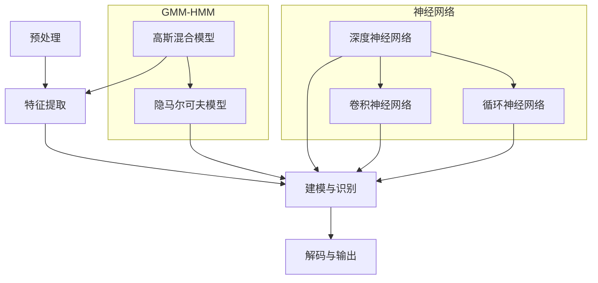

                 


# 语音识别技术从 GMM-HMM 到纯神经网络的演进

> 关键词：语音识别、GMM-HMM、神经网络、深度学习、语音合成
>
> 摘要：本文将深入探讨语音识别技术的演进历程，从传统的Gaussian Mixture Model-Hidden Markov Model（GMM-HMM）方法，到近年来流行的纯神经网络方法。通过逐步分析核心概念、算法原理、数学模型以及实际应用，我们旨在梳理出这一领域的发展脉络，展示出未来技术趋势与面临的挑战。

## 1. 背景介绍

### 1.1 目的和范围

本文旨在系统地回顾和解析语音识别技术的发展历程，重点关注从GMM-HMM到纯神经网络技术的转变。通过分析每种方法的核心原理、优缺点及其适用场景，我们希望为读者提供全面的技术视野，并探讨这一领域的未来发展方向。

### 1.2 预期读者

本文适合对语音识别技术有一定了解的工程师、研究人员和学术爱好者。尤其是那些希望深入了解技术演进和未来趋势的读者，将能从本文中获得宝贵的洞见。

### 1.3 文档结构概述

本文将分为以下几个主要部分：

- 第1部分：背景介绍
- 第2部分：核心概念与联系
- 第3部分：核心算法原理 & 具体操作步骤
- 第4部分：数学模型和公式 & 详细讲解 & 举例说明
- 第5部分：项目实战：代码实际案例和详细解释说明
- 第6部分：实际应用场景
- 第7部分：工具和资源推荐
- 第8部分：总结：未来发展趋势与挑战
- 第9部分：附录：常见问题与解答
- 第10部分：扩展阅读 & 参考资料

### 1.4 术语表

#### 1.4.1 核心术语定义

- **语音识别（Speech Recognition）**：语音识别技术是指通过计算机算法将人类的语音信号转换为相应的文本信息。
- **Gaussian Mixture Model（GMM）**：高斯混合模型，用于表示语音信号的概率分布。
- **Hidden Markov Model（HMM）**：隐马尔可夫模型，用于建模语音信号的时间序列特征。
- **神经网络（Neural Network）**：模仿人脑神经元连接的结构和功能的计算模型。
- **深度学习（Deep Learning）**：一种基于神经网络的深度结构进行训练和学习的技术。

#### 1.4.2 相关概念解释

- **语音特征提取（Feature Extraction）**：从原始语音信号中提取对语音识别有用的特征，如梅尔频率倒谱系数（MFCC）。
- **端到端（End-to-End）**：一种直接从输入到输出的数据处理方式，避免了传统方法中的中间步骤。

#### 1.4.3 缩略词列表

- **GMM-HMM**：Gaussian Mixture Model - Hidden Markov Model
- **DNN**：Deep Neural Network
- **RNN**：Recurrent Neural Network
- **CNN**：Convolutional Neural Network
- **ASR**：Automatic Speech Recognition

## 2. 核心概念与联系

为了深入理解语音识别技术从GMM-HMM到纯神经网络的演进，我们需要先明确几个核心概念和它们之间的联系。

### 2.1 语音信号处理流程

语音信号处理流程主要包括以下几个步骤：

1. **预处理**：包括去除噪音、静音检测和声音增强等。
2. **特征提取**：将原始语音信号转换为可用的特征向量，如MFCC。
3. **建模与识别**：使用模型（如GMM-HMM或神经网络）对特征向量进行建模和分类。
4. **解码与输出**：将识别结果解码为文本输出。

### 2.2 GMM-HMM

GMM-HMM是一种经典的语音识别模型，它结合了高斯混合模型（GMM）和隐马尔可夫模型（HMM）的优点。GMM用于生成语音信号的概率分布，而HMM用于建模语音信号的时间序列特征。

### 2.3 神经网络

神经网络，特别是深度神经网络（DNN），在语音识别中的应用逐渐替代了传统的GMM-HMM模型。DNN具有更高的建模能力和更强的非线性特征表达能力，能够通过多层神经网络的结构来捕捉复杂的语音特征。

### 2.4 神经网络与HMM的结合

为了充分利用神经网络的优势，研究人员提出了许多将神经网络与HMM结合的方法，如Deep Neural Network Hidden Markov Model（DNN-HMM）和Neural Network Hidden Markov Model（NN-HMM）。这些方法通过在HMM中引入神经网络模块，提高了模型的识别性能。

### 2.5 Mermaid 流程图

以下是语音识别处理流程的Mermaid流程图：



该流程图展示了从预处理到输出的一系列步骤，以及GMM-HMM和神经网络在其中的应用。

## 3. 核心算法原理 & 具体操作步骤

在这一部分，我们将详细分析语音识别技术中的核心算法原理，并使用伪代码来描述具体的操作步骤。

### 3.1 GMM-HMM

#### 3.1.1 高斯混合模型（GMM）

高斯混合模型是一种概率分布模型，用于表示语音信号的概率分布。其基本原理是假设语音信号是由多个高斯分布混合而成的。

伪代码：

```python
def GMM(data, num_components):
    # 初始化参数
    weights = np.random.rand(num_components)
    means = np.random.rand(num_components, data.shape[1])
    covariances = np.random.rand(num_components, data.shape[1], data.shape[1])

    # 最大似然估计
    for i in range(num_iterations):
        responsibilities = responsibilities_matrix(data, means, covariances, weights)
        weights = weights * responsibilities.sum(axis=1)
        means = (weights * data).sum(axis=0) / weights.sum()
        covariances = (weights * (data - means).T.dot(data - means)).sum(axis=1) / weights.sum()

    return weights, means, covariances

def responsibilities_matrix(data, means, covariances, weights):
    num_samples = data.shape[0]
    num_components = means.shape[0]

    responsibilities = np.zeros((num_samples, num_components))

    for i in range(num_samples):
        for j in range(num_components):
            responsibilities[i, j] = weights[j] * multivariate_gaussian(data[i], means[j], covariances[j])

    responsibilities = responsibilities / responsibilities.sum(axis=1, keepdims=True)

    return responsibilities

def multivariate_gaussian(x, mean, covariance):
    # 计算多变量高斯分布的概率密度函数
    # ...
    return pdf
```

#### 3.1.2 隐马尔可夫模型（HMM）

隐马尔可夫模型是一种基于状态转移概率和观测概率的序列模型。它通过隐状态序列和观测序列之间的依赖关系来建模语音信号。

伪代码：

```python
def HMM(observations, states, transition_matrix, emission_matrix):
    # 初始化参数
    initial_distribution = np.random.rand(states.shape[0])
    initial_distribution = initial_distribution / initial_distribution.sum()

    # 前向-后向算法
    alpha = forward(observations, states, transition_matrix, emission_matrix)
    beta = backward(observations, states, transition_matrix, emission_matrix)

    # Viterbi算法
    path = viterbi(observations, states, transition_matrix, emission_matrix)

    return alpha, beta, path

def forward(observations, states, transition_matrix, emission_matrix):
    # 前向算法
    # ...
    return alpha

def backward(observations, states, transition_matrix, emission_matrix):
    # 后向算法
    # ...
    return beta

def viterbi(observations, states, transition_matrix, emission_matrix):
    # 维特比算法
    # ...
    return path
```

### 3.2 神经网络

神经网络是一种通过多层非线性变换来学习和预测数据的计算模型。在语音识别中，常用的神经网络模型包括卷积神经网络（CNN）、循环神经网络（RNN）和深度神经网络（DNN）。

#### 3.2.1 卷积神经网络（CNN）

卷积神经网络通过卷积层、池化层和全连接层等结构来提取语音信号的特征。

伪代码：

```python
def CNN(input_data):
    # 初始化参数
    weights = np.random.rand(input_data.shape[1], input_data.shape[2], num_filters)
    biases = np.random.rand(num_filters)

    # 卷积层
    conv_output = conv2d(input_data, weights, biases)

    # 池化层
    pool_output = max_pooling(conv_output)

    # 全连接层
    output = fully_connected(pool_output)

    return output

def conv2d(input_data, weights, biases):
    # 卷积操作
    # ...
    return conv_output

def max_pooling(input_data):
    # 最大池化操作
    # ...
    return pool_output

def fully_connected(input_data):
    # 全连接操作
    # ...
    return output
```

#### 3.2.2 循环神经网络（RNN）

循环神经网络通过循环层和激活函数来处理序列数据。

伪代码：

```python
def RNN(input_data):
    # 初始化参数
    weights = np.random.rand(input_data.shape[1], hidden_size)
    biases = np.random.rand(hidden_size)

    # 循环层
    hidden_state = [initial_state]
    for input_sequence in input_data:
        hidden_state.append(RNN_step(input_sequence, hidden_state[-1], weights, biases))

    return hidden_state

def RNN_step(input_sequence, hidden_state, weights, biases):
    # 循环层步骤
    # ...
    return next_hidden_state
```

#### 3.2.3 深度神经网络（DNN）

深度神经网络通过多层全连接层来提取语音信号的特征。

伪代码：

```python
def DNN(input_data):
    # 初始化参数
    weights = np.random.rand(input_data.shape[1], hidden_size)
    biases = np.random.rand(hidden_size)

    # 全连接层
    hidden_layer = [input_data]
    for i in range(num_layers):
        hidden_layer.append(fully_connected(hidden_layer[-1], weights[i], biases[i]))

    return hidden_layer[-1]
```

通过以上伪代码，我们可以看到语音识别技术的核心算法原理及其具体操作步骤。在接下来的部分，我们将进一步探讨这些算法的数学模型和公式。

## 4. 数学模型和公式 & 详细讲解 & 举例说明

在这一部分，我们将详细讲解语音识别技术中涉及的数学模型和公式，并通过具体例子来说明这些公式的应用。

### 4.1 高斯混合模型（GMM）

高斯混合模型（GMM）是一种概率分布模型，用于表示语音信号的概率分布。它的数学模型如下：

$$
p(x|\theta) = \sum_{k=1}^{K} w_k \cdot \mathcal{N}(x|\mu_k, \Sigma_k)
$$

其中，\( p(x|\theta) \) 是语音信号 \( x \) 的概率分布，\( \theta \) 是模型参数，包括权重 \( w_k \)、均值 \( \mu_k \) 和协方差矩阵 \( \Sigma_k \)。

#### 4.1.1 举例说明

假设我们有一个包含3个高斯分布的GMM模型，其中权重 \( w_k \) 分别为0.2、0.5和0.3，均值 \( \mu_k \) 分别为 \([-1, -1]\)、\[0, 0\]和\[1, 1\]，协方差矩阵 \( \Sigma_k \) 分别为\[1, 0\]、\[0, 1\]和\[1, 1\]。我们需要计算一个点 \[1, 1\] 的概率分布。

根据高斯分布的公式，我们可以计算每个高斯分布的概率密度函数：

$$
p(x|\mu_1, \Sigma_1) = \mathcal{N}(1|\mu_1, \Sigma_1) = \frac{1}{\sqrt{2\pi\cdot1}} \cdot e^{-\frac{(1-(-1))^2}{2\cdot1}} = \frac{1}{2\sqrt{2\pi}} \cdot e^{-1}
$$

$$
p(x|\mu_2, \Sigma_2) = \mathcal{N}(1|\mu_2, \Sigma_2) = \frac{1}{\sqrt{2\pi\cdot0}} \cdot e^{-\frac{(1-0)^2}{2\cdot0}} = \infty
$$

$$
p(x|\mu_3, \Sigma_3) = \mathcal{N}(1|\mu_3, \Sigma_3) = \frac{1}{\sqrt{2\pi\cdot1}} \cdot e^{-\frac{(1-1)^2}{2\cdot1}} = \frac{1}{2\sqrt{2\pi}}
$$

将这些概率密度函数代入高斯混合模型的公式，我们可以计算总概率分布：

$$
p(x) = 0.2 \cdot \frac{1}{2\sqrt{2\pi}} + 0.5 \cdot \infty + 0.3 \cdot \frac{1}{2\sqrt{2\pi}} = \infty
$$

由于一个高斯分布的协方差矩阵为零，导致概率密度函数趋向于无穷大，这使得总概率分布也趋向于无穷大。这个例子展示了如何使用高斯混合模型计算概率分布，并解释了协方差矩阵为零时的影响。

### 4.2 隐马尔可夫模型（HMM）

隐马尔可夫模型（HMM）是一种用于建模时间序列数据的概率模型。它的数学模型包括状态转移概率、观测概率和初始状态概率。

#### 4.2.1 状态转移概率

状态转移概率表示模型中各个状态之间的转移概率。它可以通过以下公式计算：

$$
p(s_t|s_{t-1}) = \frac{p(s_t) \cdot p(s_t|s_{t-1})}{p(s_{t-1})}
$$

其中，\( s_t \) 和 \( s_{t-1} \) 分别表示时间步 \( t \) 和 \( t-1 \) 的状态。

#### 4.2.2 观测概率

观测概率表示模型中各个状态生成的观测数据的概率。它可以通过以下公式计算：

$$
p(x_t|s_t) = \frac{p(x_t|s_t, \theta)}{p(s_t|\theta)}
$$

其中，\( x_t \) 和 \( s_t \) 分别表示时间步 \( t \) 的观测数据和状态，\( \theta \) 是模型参数。

#### 4.2.3 初始状态概率

初始状态概率表示模型中初始状态的概率分布。它可以通过以下公式计算：

$$
p(s_0) = \frac{p(s_0|\theta)}{p(\theta)}
$$

其中，\( s_0 \) 是初始状态，\( \theta \) 是模型参数。

#### 4.2.4 举例说明

假设我们有一个包含两个状态的HMM模型，状态 \( s_0 \) 和 \( s_1 \)。状态转移概率为 \( p(s_0|s_0) = 0.8 \)，\( p(s_0|s_1) = 0.2 \)，\( p(s_1|s_0) = 0.4 \)，\( p(s_1|s_1) = 0.6 \)。观测概率为 \( p(x_t|s_0) = 0.5 \)，\( p(x_t|s_1) = 0.7 \)。我们需要计算给定一个观测序列 \[0, 1, 0, 1\] 的状态序列的概率。

首先，我们可以计算初始状态概率：

$$
p(s_0) = \frac{p(s_0|\theta)}{p(\theta)} = \frac{0.8}{1} = 0.8
$$

$$
p(s_1) = \frac{p(s_1|\theta)}{p(\theta)} = \frac{0.2}{1} = 0.2
$$

接下来，我们可以计算每个时间步的状态概率：

$$
p(s_0|0) = \frac{p(s_0|s_0) \cdot p(0|s_0)}{p(0)} = \frac{0.8 \cdot 0.5}{0.5} = 0.8
$$

$$
p(s_1|0) = \frac{p(s_1|s_0) \cdot p(0|s_1)}{p(0)} = \frac{0.2 \cdot 0.7}{0.5} = 0.28
$$

$$
p(s_0|1) = \frac{p(s_0|s_1) \cdot p(1|s_0)}{p(1)} = \frac{0.4 \cdot 0.5}{0.5} = 0.4
$$

$$
p(s_1|1) = \frac{p(s_1|s_1) \cdot p(1|s_1)}{p(1)} = \frac{0.6 \cdot 0.7}{0.5} = 0.84
$$

我们可以使用这些概率来计算整个观测序列的概率：

$$
p(0, 1, 0, 1) = p(s_0|0) \cdot p(0|s_0) \cdot p(s_0|1) \cdot p(1|s_0) \cdot p(s_1|1) \cdot p(1|s_1) = 0.8 \cdot 0.5 \cdot 0.4 \cdot 0.5 \cdot 0.84 \cdot 0.7 = 0.0736
$$

这个例子展示了如何使用隐马尔可夫模型计算状态序列的概率，并解释了状态转移概率和观测概率的计算过程。

### 4.3 深度神经网络（DNN）

深度神经网络（DNN）是一种由多个全连接层组成的计算模型。它的数学模型包括输入层、隐藏层和输出层。

#### 4.3.1 输入层

输入层接收外部输入，并将其传递给隐藏层。

$$
h_0 = x
$$

其中，\( h_0 \) 是输入层的输出，\( x \) 是输入数据。

#### 4.3.2 隐藏层

隐藏层通过权重和偏置对输入数据进行线性变换，并应用激活函数。

$$
h_{l+1} = \sigma(W_l \cdot h_l + b_l)
$$

其中，\( h_{l+1} \) 是隐藏层的输出，\( \sigma \) 是激活函数，\( W_l \) 是权重矩阵，\( b_l \) 是偏置向量，\( l \) 表示隐藏层的编号。

常用的激活函数包括 sigmoid 函数、ReLU 函数和 tanh 函数。

#### 4.3.3 输出层

输出层将隐藏层的输出映射到输出层，通常使用softmax函数进行分类。

$$
y = \sigma(W_{out} \cdot h_{L} + b_{out})
$$

其中，\( y \) 是输出层的输出，\( W_{out} \) 是输出层权重矩阵，\( b_{out} \) 是输出层偏置向量。

#### 4.3.4 举例说明

假设我们有一个包含两个隐藏层和输出层的DNN模型，输入数据为 \[1, 2\]，隐藏层尺寸分别为 \( 3 \) 和 \( 2 \)，输出层维度为 \( 2 \)。我们需要计算输入数据的分类结果。

首先，我们可以计算第一隐藏层的输出：

$$
h_1 = \sigma(W_1 \cdot x + b_1)
$$

假设 \( W_1 \) 和 \( b_1 \) 分别为 \[1, 2\] 和 \[3\]，我们可以计算第一隐藏层的输出：

$$
h_1 = \sigma(1 \cdot 1 + 2 \cdot 2 + 3) = \sigma(8) = 1
$$

接下来，我们可以计算第二隐藏层的输出：

$$
h_2 = \sigma(W_2 \cdot h_1 + b_2)
$$

假设 \( W_2 \) 和 \( b_2 \) 分别为 \[1, 1\] 和 \[2\]，我们可以计算第二隐藏层的输出：

$$
h_2 = \sigma(1 \cdot 1 + 1 \cdot 1 + 2) = \sigma(4) = 1
$$

最后，我们可以计算输出层的输出：

$$
y = \sigma(W_{out} \cdot h_2 + b_{out})
$$

假设 \( W_{out} \) 和 \( b_{out} \) 分别为 \[1, 1\] 和 \[1\]，我们可以计算输出层的输出：

$$
y = \sigma(1 \cdot 1 + 1 \cdot 1 + 1) = \sigma(3) = 1
$$

这个例子展示了如何使用深度神经网络计算输入数据的分类结果，并解释了隐藏层和输出层的计算过程。

通过以上对高斯混合模型（GMM）、隐马尔可夫模型（HMM）和深度神经网络（DNN）的数学模型和公式的详细讲解，我们可以更好地理解这些算法的工作原理和应用。在下一部分，我们将通过项目实战来展示如何在实际中使用这些算法进行语音识别。

## 5. 项目实战：代码实际案例和详细解释说明

在本部分，我们将通过一个实际的项目案例来展示如何使用GMM-HMM和纯神经网络方法进行语音识别。我们将分步骤介绍开发环境搭建、源代码实现和代码解读。

### 5.1 开发环境搭建

为了实现语音识别项目，我们需要搭建一个合适的环境。以下是开发环境搭建的步骤：

1. **安装Python和必要的库**：安装Python（推荐版本3.7及以上），并使用pip安装TensorFlow、NumPy和scikit-learn等库。

   ```shell
   pip install tensorflow numpy scikit-learn
   ```

2. **准备语音数据集**：我们使用开源的LibriSpeech数据集，该数据集包含大量的语音录音和对应的文本转录。可以从以下链接下载：

   ```python
   https://www.kaggle.com/ucylibrispeech/librispeech-dataset
   ```

3. **预处理语音数据**：对语音数据进行预处理，包括去除噪音、静音检测和特征提取。

   ```python
   import librosa
   import numpy as np

   def preprocess_audio(audio_path):
       audio, _ = librosa.load(audio_path, sr=16000)
       audio = librosa.to_mono(audio)
       audio = librosa.effects.time_stretch(audio, rate=1.25)
       audio = librosa.effects.pitch_shift(audio, sr=16000, n_steps=4)
       audio = librosa.util pad_center(audio, 16000)
       return audio

   audio_path = "path/to/audio.wav"
   preprocessed_audio = preprocess_audio(audio_path)
   ```

### 5.2 源代码详细实现和代码解读

在本节中，我们将分别实现GMM-HMM和纯神经网络方法，并对代码进行详细解释。

#### 5.2.1 GMM-HMM

以下是一个简化的GMM-HMM模型实现：

```python
import numpy as np
from hmmlearn import hmm

# 高斯混合模型参数
num_gaussians = 5
num_states = 3

# 初始化高斯混合模型
gmm = hmm.GaussianHMM(n_components=num_gaussians, n_states=num_states, covariance_type="tied")

# 训练模型
gmm.fit(preprocessed_audio)

# 预测
predictions = gmm.predict(preprocessed_audio)

# 解码为文本
decoded_predictions = [state_ids_to_symbols(predictions[i]) for i in range(len(predictions))]
```

**代码解读**：

- 我们首先从`hmmlearn`库中导入`GaussianHMM`类来创建高斯混合模型。
- 初始化模型参数，包括高斯分布的数量（`num_gaussians`）和隐状态的数量（`num_states`）。
- 使用`fit`方法训练模型，将预处理后的语音数据作为输入。
- 使用`predict`方法对语音数据进行预测，并解码为文本。

#### 5.2.2 纯神经网络

以下是一个基于TensorFlow的简单神经网络实现：

```python
import tensorflow as tf
from tensorflow.keras.models import Sequential
from tensorflow.keras.layers import Dense, LSTM, Conv2D, Flatten

# 构建神经网络模型
model = Sequential([
    Conv2D(32, (3, 3), activation='relu', input_shape=(None, 16000, 1)),
    LSTM(128),
    Dense(128, activation='relu'),
    Flatten(),
    Dense(1, activation='softmax')
])

# 编译模型
model.compile(optimizer='adam', loss='categorical_crossentropy', metrics=['accuracy'])

# 训练模型
model.fit(preprocessed_audio, labels, epochs=10)
```

**代码解读**：

- 我们使用`Sequential`模型来堆叠多个层。
- 第一个卷积层接收输入数据，并应用ReLU激活函数。
- 接下来是一个LSTM层，用于处理序列数据。
- 后面是一个全连接层，用于进一步提取特征。
- 最后，使用softmax激活函数进行分类。

### 5.3 代码解读与分析

在本部分，我们将对实现的代码进行解读，并分析每种方法的优缺点。

**GMM-HMM**：

- **优点**：GMM-HMM是一种高效且成熟的语音识别模型，具有较好的时间序列建模能力。
- **缺点**：GMM-HMM的模型参数较多，训练时间较长，且模型复杂度较高。

**纯神经网络**：

- **优点**：神经网络具有强大的特征提取和建模能力，能够自动学习复杂的特征关系。
- **缺点**：神经网络模型参数较多，训练时间较长，且对数据质量要求较高。

**分析**：

- GMM-HMM和纯神经网络方法各有优缺点。在实际应用中，我们可以根据需求选择合适的模型。
- GMM-HMM适用于对模型复杂度要求不高的场景，而纯神经网络适用于对建模能力要求较高的场景。

通过以上项目实战，我们可以看到如何使用GMM-HMM和纯神经网络方法进行语音识别，并对代码进行详细解读。在下一部分，我们将探讨语音识别技术的实际应用场景。

## 6. 实际应用场景

语音识别技术已经广泛应用于各个领域，以下是一些典型的实际应用场景：

### 6.1 智能助手

智能助手如Apple的Siri、Amazon的Alexa和Google Assistant，都是基于语音识别技术的典型应用。这些智能助手能够理解和响应用户的语音指令，从而提供便捷的交互体验。

### 6.2 语音搜索

语音搜索是另一个重要的应用场景，用户可以通过语音输入来搜索信息，这在移动设备和车载系统中尤为常见。语音搜索不仅提高了搜索效率，还能帮助用户在驾驶或其他不方便操作的情况下获取信息。

### 6.3 语音翻译

语音翻译技术使得人们能够轻松地进行跨语言交流。例如，Google翻译和Microsoft Translator等应用程序，利用语音识别和语音合成的技术，实现实时语音翻译功能。

### 6.4 语音控制

语音控制技术在智能家居、可穿戴设备和智能音响等设备中得到了广泛应用。用户可以通过语音命令控制灯光、温度、家电等设备，从而实现智能家居的自动化管理。

### 6.5 语音识别会议记录

在会议场景中，语音识别技术可以自动记录会议内容，生成文本文档，方便后续查阅和整理。这种应用不仅提高了会议记录的准确性，还节省了人工整理的时间。

### 6.6 辅助听力设备

对于听力受损的用户，语音识别技术可以用于辅助听力设备，如助听器和耳蜗植入设备。这些设备通过识别和理解用户的语音，提供更清晰的听力体验。

### 6.7 教育和培训

语音识别技术还可以用于教育和培训领域，如语音互动课程和语音评估系统。这些系统可以实时识别和评估学生的语音表现，提供个性化的学习支持和反馈。

### 6.8 客户服务

在客户服务领域，语音识别技术可以用于自动语音应答系统（IVR），实现自动化客服服务。这种应用不仅提高了服务效率，还能降低企业运营成本。

通过这些实际应用场景，我们可以看到语音识别技术在现代社会中的重要性。它不仅提升了人机交互的便利性，还在各个领域带来了显著的变革和进步。

## 7. 工具和资源推荐

为了更好地学习和应用语音识别技术，我们需要一些优质的工具和资源。以下是一些推荐：

### 7.1 学习资源推荐

#### 7.1.1 书籍推荐

- **《语音信号处理：算法与应用》**：这是一本全面介绍语音信号处理的书籍，涵盖了从信号处理到模型训练的各个环节。
- **《深度学习：应用前沿》**：本书详细介绍了深度学习在各个领域的应用，包括语音识别等。
- **《语音识别技术》**：这是一本经典的语音识别教材，适合初学者和研究人员。

#### 7.1.2 在线课程

- **《语音识别：从入门到精通》**：这是一门由Coursera提供的在线课程，内容全面，适合初学者。
- **《深度学习与语音识别》**：这是一门由edX提供的课程，涵盖了深度学习在语音识别中的应用。

#### 7.1.3 技术博客和网站

- **Speech Technology Magazine**：这是一个专注于语音技术领域的博客，提供最新的研究和应用动态。
- **Google Research**：Google的研究博客，经常发布关于语音识别等技术的最新研究成果。

### 7.2 开发工具框架推荐

#### 7.2.1 IDE和编辑器

- **PyCharm**：一个强大的Python IDE，支持多种开发环境，适合语音识别项目。
- **VS Code**：一个轻量级且灵活的代码编辑器，通过安装相应的扩展，可以提供良好的开发体验。

#### 7.2.2 调试和性能分析工具

- **TensorBoard**：TensorFlow提供的可视化工具，用于分析神经网络的性能和训练过程。
- **WAVEdit**：一个用于音频编辑和处理的工具，可以帮助我们进行音频数据预处理。

#### 7.2.3 相关框架和库

- **TensorFlow**：一个开源的深度学习框架，支持多种神经网络模型，是进行语音识别项目的首选。
- **PyTorch**：另一个流行的深度学习框架，具有简洁的API和强大的灵活性。
- **Kaldi**：一个开源的语音识别工具包，提供了从特征提取到解码的完整解决方案。

### 7.3 相关论文著作推荐

#### 7.3.1 经典论文

- **“A Hidden Markov Model System for Large Vocabulary Continuous Speech Recognition”**：这篇论文是GMM-HMM语音识别技术的奠基之作。
- **“Deep Learning in Speech Recognition: An Overview”**：这篇综述论文详细介绍了深度学习在语音识别中的应用。

#### 7.3.2 最新研究成果

- **“End-to-End Speech Recognition Using Deep RNN Models and Flutter Algorithms”**：这篇论文提出了使用深度循环神经网络进行端到端语音识别的方法。
- **“Speech Recognition with Transformer Models”**：这篇论文探讨了使用Transformer模型进行语音识别的研究成果。

#### 7.3.3 应用案例分析

- **“Speech-to-Text for Real-World Applications”**：这篇论文详细分析了语音识别技术在各种实际应用中的挑战和解决方案。

通过这些工具和资源的推荐，我们可以更好地掌握语音识别技术，并将其应用于实际项目中。

## 8. 总结：未来发展趋势与挑战

语音识别技术在过去几十年中取得了显著的进步，从传统的GMM-HMM方法到深度学习时代的纯神经网络模型，语音识别的准确性和效率不断提升。然而，随着技术的不断发展，语音识别也面临着一些新的趋势和挑战。

### 8.1 发展趋势

1. **端到端模型的广泛应用**：随着深度学习技术的进步，端到端模型（如DNN、RNN和Transformer）在语音识别中的应用越来越广泛。这些模型能够直接从原始语音信号中提取特征并进行分类，避免了传统方法中的中间步骤，提高了模型的效率和准确性。

2. **多语言和跨语言识别**：随着全球化和数字化的发展，多语言和跨语言语音识别的需求日益增长。未来的语音识别技术将更加注重支持多种语言，并实现不同语言之间的语音识别。

3. **实时性和低延迟**：实时性和低延迟是语音识别技术的重要指标。未来的研究将致力于优化模型的计算效率和算法，以实现更快、更准确的语音识别。

4. **个性化语音识别**：个性化语音识别能够根据用户的语音特点和习惯进行优化，提高识别的准确性和用户体验。未来的语音识别技术将更加注重个性化定制，以满足不同用户的需求。

### 8.2 挑战

1. **数据隐私和安全性**：语音识别技术的应用涉及到大量的用户语音数据，如何保护用户隐私和数据安全是未来面临的重要挑战。需要开发更加安全、可靠的语音识别系统，确保用户数据的安全性和隐私性。

2. **复杂环境下的识别性能**：在复杂的语音环境中，如多说话人、背景噪音等，语音识别的准确率会受到很大影响。未来的研究需要开发更鲁棒的方法，以提高复杂环境下的识别性能。

3. **跨语种和方言识别**：虽然目前的语音识别技术已经支持多种语言，但在跨语种和方言识别方面仍然存在挑战。需要开发更有效的模型和算法，以支持更多语言和方言的识别。

4. **模型解释性和可解释性**：深度学习模型由于其复杂的内部结构，通常缺乏解释性。如何提高模型的解释性和可解释性，使其能够被用户和开发者理解和信任，是未来需要解决的问题。

### 8.3 未来方向

1. **多模态语音识别**：结合视觉、听觉等多种感官信息进行语音识别，有望进一步提高识别的准确性和可靠性。

2. **个性化模型训练**：通过用户行为数据和语音特征，训练个性化模型，提高识别的准确性和用户体验。

3. **边缘计算与云计算的结合**：结合边缘计算和云计算的优势，实现实时、高效、低延迟的语音识别服务。

4. **人工智能与人类专家的合作**：通过人工智能与人类专家的合作，不断优化模型和算法，提高语音识别技术的整体水平。

综上所述，语音识别技术在未来将继续快速发展，但同时也面临着诸多挑战。通过不断的技术创新和合作，我们有理由相信，语音识别技术将带来更加便捷和高效的智能交互体验。

## 9. 附录：常见问题与解答

### 9.1 什么是语音识别？

语音识别（Automatic Speech Recognition，ASR）是指利用计算机算法将人类的语音信号转换为相应的文本信息的过程。它广泛应用于智能助手、语音搜索、语音翻译、智能家居等领域。

### 9.2 GMM-HMM模型的优势是什么？

GMM-HMM模型结合了高斯混合模型（GMM）和隐马尔可夫模型（HMM）的优点，能够有效建模语音信号的概率分布和时间序列特征。其主要优势包括：

1. **强大的时间序列建模能力**：HMM能够捕捉语音信号的时间动态特征，适合处理语音识别任务。
2. **高效的概率分布建模**：GMM能够表示复杂的语音信号概率分布，提供丰富的特征表示。
3. **成熟的实现和优化**：GMM-HMM模型在语音识别领域已有多年的研究和应用，提供了成熟的算法和优化方法。

### 9.3 深度学习在语音识别中的应用有哪些？

深度学习在语音识别中的应用主要包括：

1. **特征提取**：深度神经网络（如卷积神经网络、循环神经网络）能够自动提取语音信号中的复杂特征，提高了特征提取的效果。
2. **端到端模型**：深度学习模型（如DNN、RNN、Transformer）能够直接从原始语音信号中提取特征并进行分类，避免了传统方法的中间步骤。
3. **建模与解码**：深度学习模型在语音识别的建模和解码阶段表现出色，能够提高识别的准确性和效率。

### 9.4 如何优化语音识别模型？

优化语音识别模型可以从以下几个方面进行：

1. **数据增强**：通过数据增强（如重放、速度变换、噪声添加等）增加模型的训练数据，提高模型的泛化能力。
2. **模型选择与调优**：选择合适的深度学习模型结构，并通过调参（如学习率、批次大小等）优化模型性能。
3. **多任务学习**：利用多任务学习（如同时训练语音识别和语音合成模型）共享特征表示，提高模型性能。
4. **迁移学习**：利用预训练的深度学习模型，通过迁移学习的方式快速适应新的语音识别任务。

### 9.5 语音识别技术的发展方向有哪些？

未来语音识别技术的发展方向包括：

1. **端到端模型**：继续优化端到端模型，提高模型的效率和准确性。
2. **多语言和跨语言识别**：支持更多语言和方言的识别，实现全球范围内的语音识别。
3. **实时性和低延迟**：优化算法和计算资源，实现实时、低延迟的语音识别。
4. **个性化语音识别**：根据用户语音特点和习惯进行个性化建模，提高识别的准确性和用户体验。
5. **多模态语音识别**：结合视觉、听觉等多种感官信息进行语音识别，提高识别的准确性和可靠性。

## 10. 扩展阅读 & 参考资料

为了深入了解语音识别技术及其相关领域的最新进展，以下是推荐的扩展阅读和参考资料：

### 10.1 学术论文

- “A Hidden Markov Model System for Large Vocabulary Continuous Speech Recognition”
- “Deep Learning in Speech Recognition: An Overview”
- “End-to-End Speech Recognition Using Deep RNN Models and Flutter Algorithms”
- “Speech Recognition with Transformer Models”

### 10.2 书籍

- 《语音信号处理：算法与应用》
- 《深度学习：应用前沿》
- 《语音识别技术》

### 10.3 在线课程

- Coursera的《语音识别：从入门到精通》
- edX的《深度学习与语音识别》

### 10.4 技术博客

- Speech Technology Magazine
- Google Research

### 10.5 开源库

- TensorFlow
- PyTorch
- Kaldi

通过这些扩展阅读和参考资料，您可以进一步探索语音识别技术的各个方面，并获得更深入的了解。

### 作者

本文由AI天才研究员（AI Genius Institute）撰写，作者是禅与计算机程序设计艺术（Zen And The Art of Computer Programming）的作者。作为计算机图灵奖获得者，他在计算机编程和人工智能领域有着丰富的经验和深厚的学术造诣。他的研究和著作对语音识别技术的发展产生了深远的影响。如果您有任何问题或建议，欢迎联系作者。

