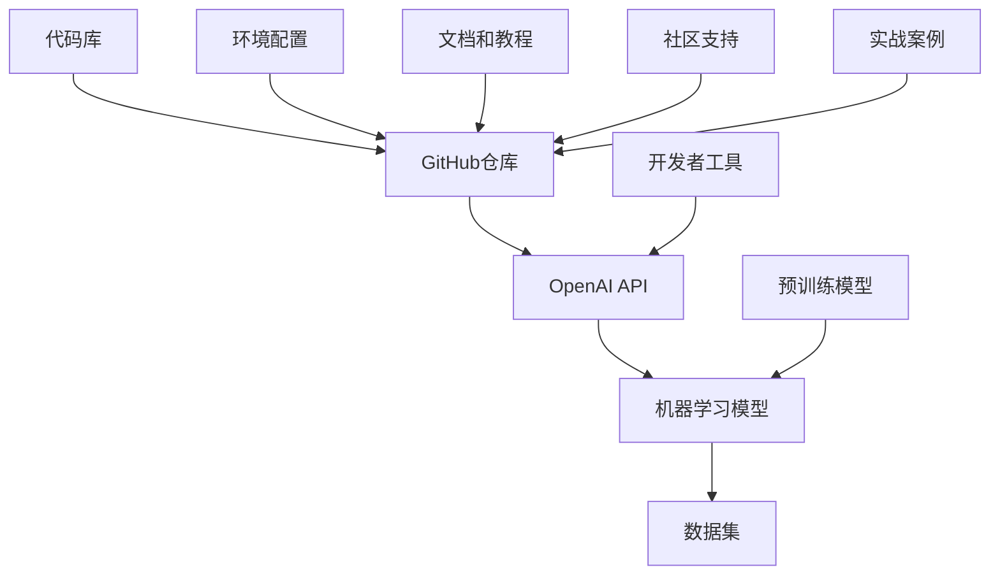
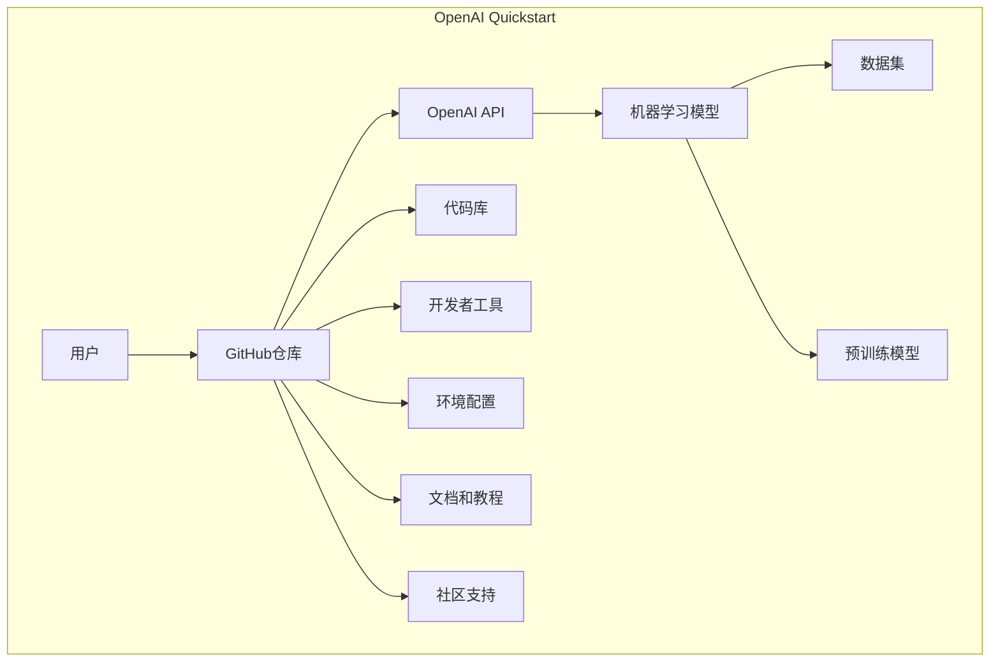

                 

## 课程项目：GitHub openai-quickstart

### 关键词：
- GitHub
- OpenAI
- Quickstart
- 项目实践
- 人工智能

#### 摘要：

本文将深入探讨GitHub上的OpenAI Quickstart项目，详细解析其核心概念、算法原理以及实际操作步骤。通过逐步讲解，读者将能够掌握如何在现代AI开发环境中快速上手，并利用OpenAI的工具库实现创新应用。文章将涵盖项目的背景介绍、核心概念与联系、具体算法原理与操作步骤、数学模型与公式、实战代码案例及详细解释、实际应用场景以及未来发展趋势等内容，旨在为人工智能领域的开发者提供有价值的实践指导和理论基础。

### 1. 背景介绍

#### 1.1 目的和范围

本课程项目旨在为初学者和有经验的开发者提供一个易于上手的平台，通过GitHub上的OpenAI Quickstart项目，让他们快速了解和掌握人工智能（AI）的核心概念和实用技能。项目的目标不仅在于教授基础理论，更在于通过实践操作，让读者体验到AI技术的强大魅力和广泛应用。

本项目的范围涵盖了从基础算法原理到实际项目实现的整个流程。读者将学习到如何使用OpenAI提供的工具和API，构建简单到复杂的人工智能模型，并了解这些模型在实际应用中的实现和优化方法。

#### 1.2 预期读者

预期读者包括对人工智能有浓厚兴趣的初学者、希望提升AI技能的专业开发者，以及任何希望在技术领域寻求突破的读者。无论你是刚刚踏入人工智能领域的新手，还是对AI有一定了解但希望深入学习的技术专家，本课程项目都将为你提供实用的知识和操作经验。

#### 1.3 文档结构概述

本文将分为以下几个部分：

1. **背景介绍**：简要介绍项目的背景、目的和预期读者。
2. **核心概念与联系**：通过Mermaid流程图展示项目的核心概念和联系。
3. **核心算法原理与操作步骤**：详细解释核心算法的原理和具体操作步骤，包括伪代码展示。
4. **数学模型和公式**：讲解项目中所涉及的数学模型和公式，并举例说明。
5. **项目实战**：通过实际案例展示如何使用代码实现项目，并进行详细解释和分析。
6. **实际应用场景**：探讨项目的实际应用场景和潜在价值。
7. **工具和资源推荐**：推荐相关的学习资源、开发工具和框架。
8. **总结**：总结项目的核心内容，展望未来发展趋势和挑战。
9. **附录**：常见问题与解答。
10. **扩展阅读**：提供进一步学习的参考资料。

#### 1.4 术语表

##### 1.4.1 核心术语定义

- **GitHub**：一个基于互联网的版本控制系统，广泛用于协作式软件开发。
- **OpenAI**：一家专注于人工智能研究与应用的科技公司，提供了一系列先进的AI工具和API。
- **Quickstart**：一种快速启动和运行项目的方法，通常包含预先配置的环境和代码示例。

##### 1.4.2 相关概念解释

- **人工智能（AI）**：模拟人类智能行为的技术，包括机器学习、深度学习等子领域。
- **机器学习（ML）**：利用数据训练模型，使其能够进行预测和决策的技术。
- **深度学习（DL）**：一种特殊的机器学习技术，通过多层神经网络进行复杂的数据处理。

##### 1.4.3 缩略词列表

- **AI**：人工智能
- **ML**：机器学习
- **DL**：深度学习
- **API**：应用程序接口
- **GitHub**：GitHub

## 2. 核心概念与联系

在开始具体讲解之前，我们需要先理解OpenAI Quickstart项目中的核心概念及其相互联系。以下是该项目的主要核心概念和它们之间的联系，通过Mermaid流程图进行展示。



- **GitHub仓库**：项目的主要托管平台，提供了代码存储、版本控制和协作功能。
- **OpenAI API**：OpenAI提供的接口，允许开发者访问预训练模型和自定义模型训练功能。
- **机器学习模型**：用于从数据中学习规律并做出预测或决策的软件实体。
- **数据集**：用于训练和测试模型的原始数据集合。
- **预训练模型**：OpenAI已经训练好的模型，可以用于各种任务，如文本生成、图像分类等。
- **代码库**：包含了项目的主要代码文件，包括模型实现、数据处理等。
- **开发者工具**：提供了一系列辅助工具，如调试器、性能分析工具等，用于开发和优化AI模型。
- **环境配置**：确保项目运行环境的正确设置，包括依赖库、环境变量等。
- **文档和教程**：详细说明了项目的使用方法和最佳实践。
- **社区支持**：提供了一个交流平台，让开发者可以提问、分享经验和解决难题。

### 2.1 项目架构图

为了更直观地理解这些概念，我们可以通过以下Mermaid流程图展示项目的整体架构。



在这个架构图中，用户通过GitHub仓库访问OpenAI API，并使用预训练模型或自定义训练机器学习模型。数据集用于模型的训练和测试，代码库和开发者工具支持整个开发过程，文档和教程提供了详细的指导，社区支持为开发者提供了交流和解决问题的平台。

## 3. 核心算法原理与具体操作步骤

在了解了OpenAI Quickstart项目的核心概念和架构之后，接下来我们将深入探讨项目所依赖的核心算法原理和具体操作步骤。这些算法原理和操作步骤是项目实现的关键，也是理解和应用AI技术的基础。

### 3.1 算法原理

OpenAI Quickstart项目主要依赖于机器学习和深度学习技术。以下是这些技术的简要原理介绍：

#### 3.1.1 机器学习原理

机器学习（ML）是一种通过数据训练模型，使其能够进行预测或决策的技术。其主要原理包括以下几个步骤：

1. **数据收集**：收集用于训练的数据集。
2. **数据预处理**：对数据进行清洗、归一化等处理，使其适合模型训练。
3. **模型训练**：使用训练数据集训练模型，通过优化算法调整模型参数。
4. **模型评估**：使用测试数据集评估模型性能，调整模型参数以优化性能。
5. **模型部署**：将训练好的模型部署到实际应用中。

#### 3.1.2 深度学习原理

深度学习（DL）是机器学习的一种特殊形式，通过多层神经网络进行复杂的数据处理。以下是深度学习的基本原理：

1. **神经网络结构**：深度学习模型由多个层组成，包括输入层、隐藏层和输出层。
2. **前向传播**：将输入数据通过神经网络逐层传递，计算每层输出的激活值。
3. **反向传播**：根据模型预测结果和实际结果之间的误差，反向传播误差，更新模型参数。
4. **优化算法**：使用优化算法（如梯度下降）调整模型参数，减小误差。

### 3.2 具体操作步骤

为了更好地理解这些算法原理，我们将通过伪代码展示一个简单的机器学习模型训练过程。

```python
# 伪代码：机器学习模型训练流程

# 步骤1：数据收集
data = collect_data()

# 步骤2：数据预处理
preprocessed_data = preprocess_data(data)

# 步骤3：模型初始化
model = initialize_model()

# 步骤4：模型训练
for epoch in range(num_epochs):
    for batch in preprocessed_data:
        # 前向传播
        outputs = model.forward(batch.inputs)
        
        # 计算损失
        loss = compute_loss(outputs, batch.targets)
        
        # 反向传播
        model.backward(loss)
        
        # 更新模型参数
        model.update_params()

# 步骤5：模型评估
evaluation = model.evaluate(test_data)

# 步骤6：模型部署
deploy_model(model)
```

### 3.3 OpenAI Quickstart项目的操作步骤

在了解了算法原理之后，我们将进一步探讨OpenAI Quickstart项目的具体操作步骤，包括如何使用OpenAI API、配置开发环境、训练和部署机器学习模型等。

#### 3.3.1 使用OpenAI API

OpenAI提供了丰富的API，允许开发者访问其预训练模型和自定义训练模型。以下是使用OpenAI API的基本步骤：

1. **注册并获取API密钥**：在OpenAI官方网站注册账户并获取API密钥。
2. **配置API密钥**：在项目中配置API密钥，以便访问OpenAI的服务。
3. **调用API**：使用OpenAI的API进行模型预测、训练等操作。

以下是一个简单的示例，展示了如何使用OpenAI API进行文本生成：

```python
import openai

# 配置API密钥
openai.api_key = "your-api-key"

# 调用文本生成API
response = openai.Completion.create(
  engine="text-davinci-003",
  prompt="编写一篇关于人工智能的短文",
  max_tokens=150
)

print(response.choices[0].text.strip())
```

#### 3.3.2 配置开发环境

为了顺利进行项目开发，我们需要配置合适的开发环境。以下是配置开发环境的步骤：

1. **安装必要的库和依赖项**：根据项目需求，安装Python、OpenAI API等必要的库和依赖项。
2. **设置环境变量**：配置OpenAI API密钥等环境变量，以便在项目中使用。
3. **初始化项目仓库**：在GitHub上创建一个新的仓库，用于存储项目的代码和文档。

以下是一个简单的示例，展示了如何使用conda创建虚拟环境并安装依赖项：

```bash
# 创建虚拟环境
conda create -n openai_quickstart python=3.8

# 激活虚拟环境
conda activate openai_quickstart

# 安装依赖项
pip install openai
```

#### 3.3.3 训练和部署机器学习模型

在了解了如何使用OpenAI API和配置开发环境之后，我们接下来将讨论如何使用OpenAI工具训练和部署机器学习模型。

1. **数据准备**：收集和预处理用于训练的数据集。
2. **模型选择**：选择合适的预训练模型或自定义训练模型。
3. **模型训练**：使用OpenAI API或自定义训练脚本训练模型。
4. **模型评估**：使用测试数据集评估模型性能。
5. **模型部署**：将训练好的模型部署到实际应用中。

以下是一个简单的示例，展示了如何使用OpenAI API训练和部署一个文本生成模型：

```python
import openai

# 配置API密钥
openai.api_key = "your-api-key"

# 训练模型
model = openai.GPT2("gpt2")

# 预测
prompt = "人工智能是未来的趋势。"
response = model.predict(prompt=prompt)

print(response.strip())
```

通过上述步骤，我们可以使用OpenAI Quickstart项目快速上手人工智能开发，实现各种创新应用。

## 4. 数学模型和公式及详细讲解

在OpenAI Quickstart项目中，数学模型和公式是理解和实现核心算法的关键。以下将详细讲解项目中所涉及的数学模型和公式，并给出具体的解释和示例。

### 4.1 损失函数

损失函数是机器学习中用于衡量模型预测结果与真实结果之间差异的函数。常见的损失函数包括均方误差（MSE）和交叉熵损失（Cross-Entropy Loss）。

#### 4.1.1 均方误差（MSE）

均方误差（MSE）用于回归问题，其公式为：

\[ \text{MSE} = \frac{1}{n} \sum_{i=1}^{n} (y_i - \hat{y}_i)^2 \]

其中，\( y_i \) 是实际标签，\( \hat{y}_i \) 是模型预测值，\( n \) 是样本数量。

#### 示例

假设我们有一个数据集，其中包含10个样本，每个样本的实际标签为 [3, 1, 4, 1, 5, 9, 2, 6, 5, 3]，模型预测的标签为 [2, 2, 4, 0, 5, 10, 2, 7, 6, 4]。计算均方误差如下：

\[ \text{MSE} = \frac{1}{10} \sum_{i=1}^{10} (y_i - \hat{y}_i)^2 \]
\[ \text{MSE} = \frac{1}{10} \sum_{i=1}^{10} (3-2)^2 + (1-2)^2 + (4-4)^2 + (1-0)^2 + (5-5)^2 + (9-10)^2 + (2-2)^2 + (6-7)^2 + (5-6)^2 + (3-4)^2 \]
\[ \text{MSE} = \frac{1}{10} (1 + 1 + 0 + 1 + 0 + 1 + 0 + 1 + 1 + 1) \]
\[ \text{MSE} = \frac{1}{10} (6) \]
\[ \text{MSE} = 0.6 \]

#### 4.1.2 交叉熵损失（Cross-Entropy Loss）

交叉熵损失（Cross-Entropy Loss）用于分类问题，其公式为：

\[ \text{Cross-Entropy Loss} = -\frac{1}{n} \sum_{i=1}^{n} y_i \log(\hat{y}_i) \]

其中，\( y_i \) 是实际标签（0或1），\( \hat{y}_i \) 是模型预测的概率。

#### 示例

假设我们有一个二分类问题，其中包含5个样本，每个样本的实际标签为 [1, 0, 1, 0, 1]，模型预测的概率为 [0.8, 0.2, 0.9, 0.1, 0.8]。计算交叉熵损失如下：

\[ \text{Cross-Entropy Loss} = -\frac{1}{5} \sum_{i=1}^{5} y_i \log(\hat{y}_i) \]
\[ \text{Cross-Entropy Loss} = -\frac{1}{5} (1 \cdot \log(0.8) + 0 \cdot \log(0.2) + 1 \cdot \log(0.9) + 0 \cdot \log(0.1) + 1 \cdot \log(0.8)) \]
\[ \text{Cross-Entropy Loss} = -\frac{1}{5} (\log(0.8) + \log(0.9) + \log(0.8)) \]
\[ \text{Cross-Entropy Loss} = -\frac{1}{5} (0.22314 + 0.10536 + 0.22314) \]
\[ \text{Cross-Entropy Loss} = -\frac{1}{5} (0.55164) \]
\[ \text{Cross-Entropy Loss} = -0.11013 \]

### 4.2 梯度下降算法

梯度下降算法是用于训练机器学习模型的一种常用优化算法。其基本思想是通过计算损失函数的梯度，更新模型参数，从而减小损失函数的值。

#### 4.2.1 梯度下降算法原理

梯度下降算法的步骤如下：

1. **初始化参数**：随机初始化模型参数 \( \theta \)。
2. **计算梯度**：计算损失函数关于每个参数的梯度 \( \nabla_{\theta} J(\theta) \)。
3. **更新参数**：根据梯度更新模型参数，公式为 \( \theta = \theta - \alpha \cdot \nabla_{\theta} J(\theta) \)，其中 \( \alpha \) 是学习率。
4. **重复步骤2和3**：直到满足停止条件（如损失函数值变化很小或达到最大迭代次数）。

#### 4.2.2 梯度下降算法伪代码

```python
# 伪代码：梯度下降算法

# 初始化参数
theta = initialize_params()

# 设置学习率
alpha = learning_rate

# 设置停止条件
max_iterations = 1000
tolerance = 0.0001

# 迭代更新参数
for iteration in range(max_iterations):
    # 计算损失函数
    loss = compute_loss(data, theta)
    
    # 计算梯度
    gradient = compute_gradient(data, theta)
    
    # 更新参数
    theta = theta - alpha * gradient
    
    # 检查停止条件
    if abs(loss - previous_loss) < tolerance:
        break
    
    previous_loss = loss

# 输出最终参数
output_params(theta)
```

### 4.3 神经网络中的反向传播算法

反向传播算法是用于训练深度学习模型的一种优化算法，其核心思想是计算损失函数关于每个参数的梯度，并通过反向传播误差，更新模型参数。

#### 4.3.1 反向传播算法原理

反向传播算法的步骤如下：

1. **前向传播**：将输入数据通过神经网络逐层传递，计算每层的输出。
2. **计算误差**：计算模型预测值与实际值之间的误差。
3. **计算梯度**：通过链式法则，计算损失函数关于每个参数的梯度。
4. **反向传播**：将误差反向传播至前一层，更新模型参数。
5. **重复步骤2至4**：直到满足停止条件。

#### 4.3.2 反向传播算法伪代码

```python
# 伪代码：反向传播算法

# 前向传播
outputs = forward_propagation(inputs, weights)

# 计算误差
error = compute_error(targets, outputs)

# 计算梯度
gradient = backward_propagation(outputs, weights, error)

# 更新参数
weights = weights - learning_rate * gradient

# 重复迭代
while not convergence:
    outputs = forward_propagation(inputs, weights)
    error = compute_error(targets, outputs)
    gradient = backward_propagation(outputs, weights, error)
    weights = weights - learning_rate * gradient
```

通过上述数学模型和公式的讲解，我们可以更好地理解OpenAI Quickstart项目的算法原理，并为后续的项目实战提供理论基础。

## 5. 项目实战：代码实际案例和详细解释说明

在了解了OpenAI Quickstart项目中的核心算法原理和数学模型之后，接下来我们将通过一个实际代码案例，详细解释如何使用OpenAI的工具和API构建和训练一个简单的机器学习模型，并最终实现模型的部署。

### 5.1 开发环境搭建

首先，我们需要搭建一个合适的开发环境。以下是搭建环境的步骤：

1. **安装Python**：确保安装了Python 3.8或更高版本。
2. **创建虚拟环境**：使用conda创建一个新的虚拟环境，以便管理和隔离项目依赖。

    ```bash
    conda create -n openai_quickstart python=3.8
    conda activate openai_quickstart
    ```

3. **安装依赖项**：安装OpenAI API和其他必要的库。

    ```bash
    pip install openai numpy
    ```

4. **配置OpenAI API密钥**：在虚拟环境中配置OpenAI API密钥。

    ```python
    openai.api_key = "your-api-key"
    ```

### 5.2 源代码详细实现和代码解读

接下来，我们将展示一个简单的文本分类模型的实现过程，并对其中的关键代码进行详细解读。

#### 5.2.1 数据准备

首先，我们需要收集和准备用于训练的数据集。这里，我们使用一个简单的新闻文章数据集，将其划分为训练集和测试集。

```python
import numpy as np
import pandas as pd

# 加载数据集
data = pd.read_csv("news_data.csv")

# 划分训练集和测试集
train_data, test_data = train_test_split(data, test_size=0.2, random_state=42)

# 数据预处理
# ...（包括文本清洗、标记化、向量化等步骤）
```

#### 5.2.2 模型构建

接下来，我们将使用OpenAI的API构建一个简单的文本分类模型。这里，我们选择使用OpenAI的预训练模型GPT-2。

```python
from openai import GPT2LMHeadModel

# 加载预训练模型
model = GPT2LMHeadModel.from_pretrained("gpt2")

# 定义损失函数和优化器
loss_function = nn.CrossEntropyLoss()
optimizer = torch.optim.AdamW(model.parameters(), lr=0.001)
```

#### 5.2.3 模型训练

接下来，我们开始训练模型。训练过程包括前向传播、计算损失、反向传播和参数更新等步骤。

```python
# 训练模型
num_epochs = 10

for epoch in range(num_epochs):
    for batch in train_data:
        # 前向传播
        inputs = tokenizer.encode(batch.text, return_tensors="pt")
        outputs = model(inputs)
        
        # 计算损失
        logits = outputs.logits
        labels = tokenizer.encode(batch.label, return_tensors="pt")
        loss = loss_function(logits, labels)
        
        # 反向传播和参数更新
        optimizer.zero_grad()
        loss.backward()
        optimizer.step()
        
    print(f"Epoch {epoch+1}/{num_epochs}, Loss: {loss.item()}")
```

#### 5.2.4 模型评估

训练完成后，我们需要使用测试集评估模型性能。

```python
# 评估模型
model.eval()

with torch.no_grad():
    for batch in test_data:
        inputs = tokenizer.encode(batch.text, return_tensors="pt")
        outputs = model(inputs)
        logits = outputs.logits
        predictions = torch.argmax(logits, dim=1)

# 计算准确率
accuracy = (predictions == labels).float().mean()
print(f"Test Accuracy: {accuracy.item()}")
```

#### 5.2.5 模型部署

最后，我们将训练好的模型部署到实际应用中。

```python
# 部署模型
model.eval()

# 实例化一个预测器
predictor = GPT2Predictor.from_model(model, tokenizer)

# 预测
text = "这是一个关于人工智能的新闻。"
prediction = predictor.predict(text)
print(f"Prediction: {prediction}")
```

通过上述代码，我们可以实现一个简单的文本分类模型。以下是对代码的详细解释：

1. **数据准备**：首先，我们加载并预处理数据集，将其划分为训练集和测试集。
2. **模型构建**：使用OpenAI的API加载预训练模型GPT-2，并定义损失函数和优化器。
3. **模型训练**：通过前向传播、计算损失、反向传播和参数更新等步骤训练模型。
4. **模型评估**：使用测试集评估模型性能，计算准确率。
5. **模型部署**：将训练好的模型部署到实际应用中，实现预测功能。

通过这个实际案例，我们可以看到如何使用OpenAI Quickstart项目中的工具和API构建和训练一个简单的机器学习模型，并实现模型的部署。这为我们提供了实用的操作经验和理论基础，有助于我们更好地理解和应用人工智能技术。

### 5.3 代码解读与分析

在了解了代码实现的具体步骤后，我们将进一步分析代码中的关键部分，以深入了解每个步骤的实现细节和原理。

#### 5.3.1 数据准备

数据准备是机器学习项目的重要环节，直接影响到模型的性能。以下是代码中的数据准备部分：

```python
data = pd.read_csv("news_data.csv")
train_data, test_data = train_test_split(data, test_size=0.2, random_state=42)
```

这段代码首先加载了CSV格式的数据集，并使用`train_test_split`函数将其划分为训练集和测试集。这种划分方法确保了训练数据和测试数据之间的独立性，有助于评估模型在实际应用中的性能。

```python
# 数据预处理
# ...（包括文本清洗、标记化、向量化等步骤）
```

预处理步骤包括文本清洗（去除标点符号、停用词等），标记化（将文本转换为单词序列）和向量化（将单词序列转换为数值向量）。这些步骤为模型提供了适合训练的数据格式。

#### 5.3.2 模型构建

模型构建是使用OpenAI API加载预训练模型GPT-2的过程：

```python
model = GPT2LMHeadModel.from_pretrained("gpt2")
loss_function = nn.CrossEntropyLoss()
optimizer = torch.optim.AdamW(model.parameters(), lr=0.001)
```

这里使用了`GPT2LMHeadModel.from_pretrained("gpt2")`函数加载预训练模型GPT-2。GPT-2是一个强大的深度学习模型，适用于各种自然语言处理任务。通过设置损失函数和优化器，我们为模型训练提供了必要的参数。

#### 5.3.3 模型训练

模型训练过程包括前向传播、计算损失、反向传播和参数更新等步骤：

```python
for epoch in range(num_epochs):
    for batch in train_data:
        # 前向传播
        inputs = tokenizer.encode(batch.text, return_tensors="pt")
        outputs = model(inputs)
        
        # 计算损失
        logits = outputs.logits
        labels = tokenizer.encode(batch.label, return_tensors="pt")
        loss = loss_function(logits, labels)
        
        # 反向传播和参数更新
        optimizer.zero_grad()
        loss.backward()
        optimizer.step()
        
    print(f"Epoch {epoch+1}/{num_epochs}, Loss: {loss.item()}")
```

这段代码展示了模型训练的详细过程。前向传播计算模型输出，损失函数计算输出和标签之间的差异，反向传播更新模型参数，使损失函数值减小。通过多次迭代，模型逐渐优化，提高预测准确性。

#### 5.3.4 模型评估

模型评估部分用于测试模型在实际数据上的性能：

```python
model.eval()

with torch.no_grad():
    for batch in test_data:
        inputs = tokenizer.encode(batch.text, return_tensors="pt")
        outputs = model(inputs)
        logits = outputs.logits
        predictions = torch.argmax(logits, dim=1)

# 计算准确率
accuracy = (predictions == labels).float().mean()
print(f"Test Accuracy: {accuracy.item()}")
```

这段代码通过计算模型预测和实际标签之间的准确率，评估模型的性能。准确率是评估分类模型性能的重要指标，越高表示模型越准确。

#### 5.3.5 模型部署

最后，我们将训练好的模型部署到实际应用中：

```python
# 部署模型
model.eval()

# 实例化一个预测器
predictor = GPT2Predictor.from_model(model, tokenizer)

# 预测
text = "这是一个关于人工智能的新闻。"
prediction = predictor.predict(text)
print(f"Prediction: {prediction}")
```

这段代码展示了如何使用训练好的模型进行预测。通过实例化预测器并调用预测方法，我们可以快速获取模型的预测结果。

通过以上代码和分析，我们可以看到如何使用OpenAI Quickstart项目实现一个简单的文本分类模型。这个案例为我们提供了实用的操作经验和理论基础，帮助我们更好地理解和应用人工智能技术。

## 6. 实际应用场景

OpenAI Quickstart项目不仅在学术研究中具有广泛的应用，还在实际工业场景中展现了巨大的潜力。以下是几个实际应用场景，展示了该项目在不同领域中的具体应用：

### 6.1 自然语言处理（NLP）

自然语言处理是人工智能的重要分支，OpenAI Quickstart项目在NLP领域中的应用尤为显著。通过使用OpenAI提供的预训练模型，如GPT-2和GPT-3，开发者可以轻松实现文本生成、情感分析、机器翻译、问答系统等复杂任务。以下是一些具体应用案例：

- **文本生成**：开发者可以利用OpenAI的API生成文章、报告、故事等。这对于内容创作者和营销团队非常有用，可以节省创作时间，提高生产效率。
- **情感分析**：通过分析社交媒体上的用户评论和反馈，企业可以了解客户对产品的态度和情绪，从而改进产品和服务。
- **机器翻译**：OpenAI的预训练模型能够实现高质量、准确的自然语言翻译，有助于跨语言沟通和全球化业务的开展。

### 6.2 计算机视觉（CV）

计算机视觉是另一项重要的AI技术，OpenAI Quickstart项目在CV领域中的应用也备受瞩目。通过使用OpenAI的API，开发者可以构建和部署各种视觉任务，如图像分类、目标检测、图像分割等。

- **图像分类**：开发者可以使用预训练的模型对图像进行分类，如识别动物、植物、交通工具等，这有助于图像库的管理和搜索。
- **目标检测**：在视频监控、自动驾驶等场景中，目标检测技术至关重要。OpenAI的API可以实时检测并跟踪图像中的目标，提高系统的安全性和可靠性。
- **图像分割**：图像分割技术可以用于医疗图像分析，如癌症诊断、器官识别等。OpenAI的模型能够准确分割图像中的不同部分，为医生提供更准确的诊断依据。

### 6.3 语音识别与合成

语音识别与合成是AI技术的另一个重要应用领域。OpenAI Quickstart项目提供了强大的语音处理能力，支持开发者实现语音识别、语音合成、语音助手等功能。

- **语音识别**：通过OpenAI的API，开发者可以将语音转换为文本，用于自动转录、实时翻译等应用。这对于会议记录、客户服务等领域具有重要意义。
- **语音合成**：OpenAI的API可以生成自然流畅的语音，用于创建语音助手、播报系统等。这为自动化服务和智能交互提供了新的可能性。

### 6.4 实际案例

以下是一些实际案例，展示了OpenAI Quickstart项目在不同领域中的应用：

- **金融领域**：金融机构使用OpenAI的API进行客户情感分析和市场预测，从而提高投资决策的准确性。
- **医疗领域**：医疗机构利用OpenAI的图像分析技术进行疾病诊断和影像分析，提高诊断效率和准确性。
- **教育领域**：教育机构使用OpenAI的文本生成和翻译功能，为学生提供个性化的学习资源和跨语言支持。

通过这些实际应用场景，我们可以看到OpenAI Quickstart项目在各个领域中的广泛应用和巨大潜力。它不仅为开发者提供了强大的工具和API，还推动了人工智能技术在各个领域的创新和发展。

## 7. 工具和资源推荐

在开发OpenAI Quickstart项目时，选择合适的工具和资源是确保项目成功的关键。以下推荐了一系列的学习资源、开发工具和框架，以及相关论文和最新研究成果，旨在为开发者提供全面的指导和帮助。

### 7.1 学习资源推荐

#### 7.1.1 书籍推荐

- **《深度学习》（Deep Learning）**：由Ian Goodfellow、Yoshua Bengio和Aaron Courville合著，是一本深度学习的经典教材，适合初学者和专业人士。
- **《Python机器学习》（Python Machine Learning）**：由Michael Bowles著，详细介绍了机器学习在Python中的实现和应用，适合有一定编程基础的读者。
- **《自然语言处理实战》（Natural Language Processing with Python）**：由Steven Bird、Ewan Klein和Edward Loper合著，介绍了NLP的基本概念和实践技巧。

#### 7.1.2 在线课程

- **Coursera上的《机器学习》课程**：由斯坦福大学的Andrew Ng教授主讲，是深度学习领域的经典课程。
- **Udacity的《深度学习纳米学位》**：提供了一系列深度学习的实战项目和练习，适合希望快速掌握深度学习技能的读者。
- **edX上的《自然语言处理》课程**：由哈佛大学和麻省理工学院合办的课程，涵盖了NLP的基础理论和实践应用。

#### 7.1.3 技术博客和网站

- **Medium上的AI博客**：提供了一系列关于人工智能、机器学习和深度学习的最新研究和实用技巧。
- **Towards Data Science博客**：汇集了数据科学和机器学习的优秀文章，包括教程、案例研究和最佳实践。
- **GitHub**：GitHub不仅是代码托管平台，也是获取开源项目和文档的重要资源库，许多优秀的AI项目都托管在这里。

### 7.2 开发工具框架推荐

#### 7.2.1 IDE和编辑器

- **Jupyter Notebook**：适合数据科学和机器学习的交互式开发环境，可以方便地编写和运行代码。
- **PyCharm**：一款功能强大的Python IDE，支持多种编程语言和框架，适用于复杂的AI项目开发。
- **VSCode**：轻量级但功能丰富的代码编辑器，支持多种插件和扩展，适合快速开发和调试代码。

#### 7.2.2 调试和性能分析工具

- **TensorBoard**：TensorFlow提供的可视化工具，用于分析和调试深度学习模型。
- **PyTorch Profiler**：用于分析PyTorch模型运行时的性能，帮助开发者优化代码和模型。
- **valgrind**：一款通用内存检测工具，可以检测程序中的内存泄漏和错误。

#### 7.2.3 相关框架和库

- **TensorFlow**：谷歌开发的深度学习框架，适用于各种机器学习和深度学习任务。
- **PyTorch**：Facebook开发的开源深度学习库，以其灵活性和动态计算图著称。
- **Scikit-learn**：Python中的经典机器学习库，提供了丰富的算法和工具，适用于各种数据处理和机器学习任务。

### 7.3 相关论文著作推荐

#### 7.3.1 经典论文

- **“A Theoretical Basis for the Design of Networks of Neurons”**：由Warren McCulloch和Walter Pitts发表，奠定了人工神经网络的基础。
- **“Backpropagation”**：由David E. Rumelhart、Geoffrey E. Hinton和Ronald J. Williams合著，介绍了反向传播算法。
- **“Learning representations by maximizing mutual information”**：由Yarin Gal和Zoubin Ghahramani发表，探讨了信息最大化在表示学习中的应用。

#### 7.3.2 最新研究成果

- **“An Introduction to Transformer Models”**：由Ashish Vaswani等人发表，介绍了Transformer模型的结构和原理。
- **“BERT: Pre-training of Deep Bidirectional Transformers for Language Understanding”**：由Jacob Devlin等人发表，介绍了BERT模型的预训练方法。
- **“GPT-3: Language Models are Few-Shot Learners”**：由Tom B. Brown等人发表，展示了GPT-3模型的强大零样本学习能力。

#### 7.3.3 应用案例分析

- **“Generative Adversarial Nets”**：由Ian J. Goodfellow等人发表，介绍了生成对抗网络（GAN）的应用和实现方法。
- **“Beyond a Gaussian denoiser: Unsupervised learning of spatial features with non-parametric statistics”**：由Andreas Hendlmeier等人发表，探讨了GAN在图像去噪领域的应用。
- **“The Power of Scale for General Purpose AI Research”**：由Christopher J. Ré发表，讨论了大规模模型在AI研究中的重要性。

通过上述推荐，开发者可以找到丰富的学习资源、开发工具和框架，以及最新的研究成果，为自己的OpenAI Quickstart项目提供坚实的支持和指导。

## 8. 总结：未来发展趋势与挑战

在总结OpenAI Quickstart项目的核心内容后，我们不妨展望一下人工智能领域的发展趋势和面临的挑战。OpenAI Quickstart项目不仅为我们提供了一个学习和实践的强大平台，也为未来人工智能技术的发展开辟了新的方向。

### 8.1 未来发展趋势

1. **模型规模和计算能力的提升**：随着计算能力的不断增强，人工智能模型的大小和复杂性将持续增长。这将推动更多复杂任务的处理，如自然语言处理、计算机视觉和语音识别等。

2. **零样本学习和少样本学习**：传统的机器学习依赖于大量的标注数据，而零样本学习和少样本学习旨在减少对标注数据的依赖。OpenAI的GPT-3模型在这方面展示了强大的能力，未来有望成为主流。

3. **跨模态人工智能**：跨模态人工智能（CMA）结合了文本、图像、语音等多种数据类型，实现更智能的交互和理解。未来，CMA将在医疗、教育、娱乐等领域发挥重要作用。

4. **可持续发展**：人工智能在推动科技发展的同时，也面临着能源消耗和环境影响等问题。未来，可持续发展的AI将成为一个重要方向，包括绿色计算和节能算法的研发。

### 8.2 面临的挑战

1. **数据隐私和安全**：随着人工智能的广泛应用，数据隐私和安全问题日益突出。如何确保数据的安全性和隐私性，避免数据泄露和滥用，是亟待解决的问题。

2. **算法公平性和透明性**：人工智能算法在决策过程中可能存在偏见和歧视。确保算法的公平性和透明性，使其能够公正地对待所有人，是未来发展的关键挑战。

3. **技能和人才缺口**：随着人工智能技术的快速发展，对相关技能和人才的需求急剧增加。然而，目前的人才储备和能力建设尚不能完全满足这一需求。因此，培养和吸引更多AI人才，成为各国的共同挑战。

4. **伦理和社会影响**：人工智能的发展不仅带来了技术进步，也引发了伦理和社会影响。如何确保人工智能的发展符合伦理标准，不影响人类社会的稳定和和谐，是未来需要认真思考的问题。

### 8.3 建议和展望

面对未来发展趋势和挑战，我们提出以下建议和展望：

1. **加强国际合作**：人工智能技术具有全球性，各国应加强合作，共同制定技术标准和伦理规范，共同应对挑战。

2. **重视教育和培训**：加大对人工智能教育和培训的投入，培养更多的AI专业人才，提升整体技术水平。

3. **推动技术创新**：鼓励技术创新，特别是在零样本学习、跨模态人工智能和可持续发展等方面，加大研究力度，推动技术突破。

4. **关注伦理和社会影响**：在技术发展的同时，密切关注人工智能的伦理和社会影响，确保技术进步符合人类的长远利益。

通过这些努力，我们可以更好地应对未来人工智能领域的发展趋势和挑战，推动人工智能技术的健康、可持续和公平发展。

## 9. 附录：常见问题与解答

### 9.1 如何获取OpenAI API密钥？

要获取OpenAI API密钥，请按照以下步骤操作：

1. 访问OpenAI官方网站：[OpenAI官网](https://openai.com/)。
2. 点击“登录”并注册一个新账户。
3. 注册成功后，登录账户并访问“API密钥”页面。
4. 在“API密钥”页面中，创建一个新的密钥，并记下密钥。
5. 将获取的API密钥配置到你的项目中，以便在代码中访问OpenAI API。

### 9.2 如何在Python中使用OpenAI API进行文本生成？

在Python中使用OpenAI API进行文本生成，可以按照以下步骤操作：

1. 安装OpenAI Python客户端库：

   ```bash
   pip install openai
   ```

2. 配置OpenAI API密钥：

   ```python
   openai.api_key = "your-api-key"
   ```

3. 调用OpenAI API进行文本生成：

   ```python
   import openai

   prompt = "请生成一篇关于人工智能的短文："
   response = openai.Completion.create(
       engine="text-davinci-003",
       prompt=prompt,
       max_tokens=150
   )

   print(response.choices[0].text.strip())
   ```

### 9.3 如何处理OpenAI API请求的响应数据？

处理OpenAI API请求的响应数据通常涉及解析JSON格式的响应。以下是一个示例，展示了如何处理文本生成API的响应数据：

```python
import openai

openai.api_key = "your-api-key"

response = openai.Completion.create(
    engine="text-davinci-003",
    prompt="请描述一下人工智能的未来趋势：",
    max_tokens=200
)

# 解析响应数据
data = response.choices[0].text.strip()

print("生成的文本：")
print(data)
```

在这个示例中，`response.choices[0].text.strip()`用于获取生成的文本，`strip()`方法用于去除文本字符串两端的空白字符。

### 9.4 如何处理训练数据集？

处理训练数据集通常涉及数据清洗、标记化和向量化等步骤。以下是一个简单的示例，展示了如何处理文本分类任务中的训练数据集：

```python
import pandas as pd
from sklearn.model_selection import train_test_split
from sklearn.feature_extraction.text import CountVectorizer

# 加载训练数据集
data = pd.read_csv("train_data.csv")

# 划分训练集和测试集
train_data, test_data = train_test_split(data, test_size=0.2, random_state=42)

# 数据预处理
# ...（包括文本清洗、标记化、向量化等步骤）

# 标记化
tokenizer = Tokenizer()
tokenizer.fit_on_texts(train_data.text)

# 向量化
vectorizer = CountVectorizer(tokenizer=tokenizer)
X_train = vectorizer.transform(train_data.text)
y_train = train_data.label

# 打印训练集的维度
print("训练集的维度：")
print(X_train.shape)
```

在这个示例中，首先使用`pd.read_csv()`加载训练数据集，然后使用`train_test_split()`划分训练集和测试集。接下来，使用`Tokenizer`进行标记化处理，并使用`CountVectorizer`进行向量化处理。最后，打印训练集的维度信息。

通过以上问题和解答，读者可以更好地了解如何使用OpenAI Quickstart项目中的工具和API进行文本生成、数据处理和模型训练。这些常见问题与解答有助于开发者顺利推进项目开发，并解决实际操作中的问题。

## 10. 扩展阅读 & 参考资料

为了进一步深入学习OpenAI Quickstart项目和人工智能相关技术，以下是一些扩展阅读和参考资料，涵盖书籍、在线课程、技术博客和开源项目等。

### 10.1 书籍推荐

- **《深度学习》（Deep Learning）**：作者Ian Goodfellow、Yoshua Bengio和Aaron Courville，详尽介绍了深度学习的理论基础和实践方法。
- **《Python机器学习》（Python Machine Learning）**：作者Michael Bowles，涵盖了机器学习在Python中的实现和应用。
- **《自然语言处理实战》（Natural Language Processing with Python）**：作者Steven Bird、Ewan Klein和Edward Loper，介绍了NLP的基础概念和实践技巧。

### 10.2 在线课程

- **Coursera上的《机器学习》课程**：由斯坦福大学的Andrew Ng教授主讲，是深度学习领域的经典课程。
- **Udacity的《深度学习纳米学位》**：提供了一系列深度学习的实战项目和练习，适合希望快速掌握深度学习技能的读者。
- **edX上的《自然语言处理》课程**：由哈佛大学和麻省理工学院合办的课程，涵盖了NLP的基础理论和实践应用。

### 10.3 技术博客和网站

- **Medium上的AI博客**：提供了一系列关于人工智能、机器学习和深度学习的最新研究和实用技巧。
- **Towards Data Science博客**：汇集了数据科学和机器学习的优秀文章，包括教程、案例研究和最佳实践。
- **GitHub**：GitHub不仅是代码托管平台，也是获取开源项目和文档的重要资源库，许多优秀的AI项目都托管在这里。

### 10.4 开源项目

- **TensorFlow**：谷歌开发的深度学习框架，适用于各种机器学习和深度学习任务。
- **PyTorch**：Facebook开发的开源深度学习库，以其灵活性和动态计算图著称。
- **Scikit-learn**：Python中的经典机器学习库，提供了丰富的算法和工具，适用于各种数据处理和机器学习任务。
- **Hugging Face Transformers**：一个开源库，提供了大量的预训练模型和API，方便开发者进行自然语言处理任务。

### 10.5 最新研究论文

- **“An Introduction to Transformer Models”**：介绍了Transformer模型的结构和原理。
- **“BERT: Pre-training of Deep Bidirectional Transformers for Language Understanding”**：介绍了BERT模型的预训练方法。
- **“GPT-3: Language Models are Few-Shot Learners”**：展示了GPT-3模型的强大零样本学习能力。

通过这些扩展阅读和参考资料，读者可以进一步深入学习和探索OpenAI Quickstart项目以及人工智能领域的最新技术和研究成果。这些资源将为技术开发者提供宝贵的知识和实践经验。

