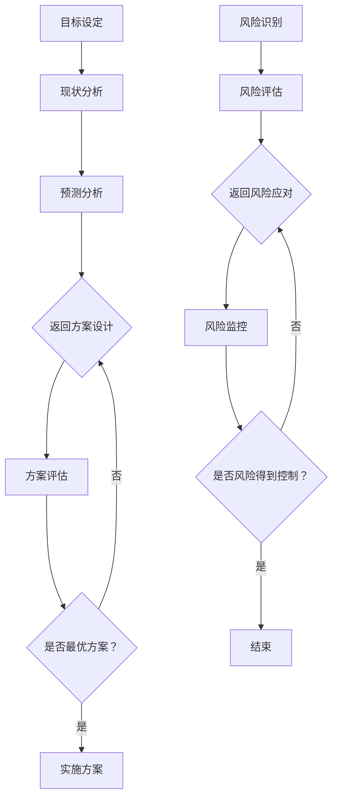

                 

# 财务经理的创业职能：财务规划与风险管控

> 关键词：财务规划、创业、风险管控、财务管理、创业者
> 
> 摘要：本文将深入探讨财务经理在创业过程中的关键角色，着重分析财务规划与风险管控两大核心职能。通过一系列实际案例和操作步骤，本文旨在帮助创业者更好地掌握财务管理的本质，实现企业的稳健发展和持续增长。

## 1. 背景介绍

### 1.1 目的和范围

本文旨在探讨财务经理在创业过程中的重要作用，特别是财务规划与风险管控这两大核心职能。通过分析具体的案例和操作步骤，本文希望能够为创业者提供实用的指导，帮助他们在创业初期就建立科学、稳健的财务管理体系。

### 1.2 预期读者

本文主要面向以下读者群体：
- 创业初期的创始人、财务经理和财务管理人员
- 对企业财务管理感兴趣的技术人员和管理者
- 企业财务咨询顾问和专业人士

### 1.3 文档结构概述

本文将按照以下结构展开：

1. 背景介绍
   - 目的和范围
   - 预期读者
   - 文档结构概述
   - 术语表
2. 核心概念与联系
   - 财务规划原理
   - 风险管控架构
   - Mermaid流程图
3. 核心算法原理 & 具体操作步骤
   - 财务规划算法
   - 风险管控策略
   - 伪代码讲解
4. 数学模型和公式 & 详细讲解 & 举例说明
   - 财务指标计算
   - 风险评估公式
   - LaTeX数学公式
5. 项目实战：代码实际案例和详细解释说明
   - 开发环境搭建
   - 源代码实现
   - 代码解读与分析
6. 实际应用场景
   - 企业融资
   - 投资决策
   - 成本控制
7. 工具和资源推荐
   - 学习资源推荐
   - 开发工具框架推荐
   - 相关论文著作推荐
8. 总结：未来发展趋势与挑战
9. 附录：常见问题与解答
10. 扩展阅读 & 参考资料

### 1.4 术语表

#### 1.4.1 核心术语定义

- 财务规划：企业为实现特定财务目标，对资金筹集、运用、分配等方面进行的系统性和预见性的安排。
- 风险管控：企业为了降低财务风险，采取的一系列策略和措施，包括风险识别、风险评估、风险应对等。
- 创业者：具有创新精神，主动寻求机会，致力于创建新企业或拓展现有企业业务的人。

#### 1.4.2 相关概念解释

- 资金筹集：企业为获取资金，通过发行股票、债券、贷款等渠道获取所需资金的过程。
- 成本控制：企业在生产、运营过程中，通过制定合理的成本预算和成本控制措施，降低成本支出，提高盈利能力。
- 投资决策：企业根据市场情况和自身战略目标，对投资项目的可行性、收益和风险进行分析和评估，作出投资决策。

#### 1.4.3 缩略词列表

- CFO：Chief Financial Officer，首席财务官
- ROI：Return on Investment，投资回报率
- DCF：Discounted Cash Flow，折现现金流

## 2. 核心概念与联系

### 2.1 财务规划原理

财务规划是企业为实现长期财务目标，对资金筹集、运用、分配等方面进行的系统性和预见性的安排。财务规划的核心目标是确保企业拥有足够的资金，实现稳定、可持续的发展。

#### 2.1.1 财务规划的基本流程

1. **目标设定**：明确企业财务目标，如提高盈利能力、降低成本、优化资本结构等。
2. **现状分析**：分析企业当前的财务状况，包括资产负债、现金流、盈利能力等。
3. **预测分析**：预测企业未来的财务状况，如收入、成本、利润等。
4. **方案设计**：制定实现财务目标的方案，包括资金筹集、运用、分配等方面的具体措施。
5. **方案评估**：对制定的方案进行评估，比较不同方案的优劣，选择最优方案。

#### 2.1.2 财务规划的核心要素

- **资金筹集**：企业为获取资金，可以通过发行股票、债券、贷款等渠道进行筹集。
- **资金运用**：企业将筹集到的资金用于生产经营、投资、偿还债务等方面。
- **资金分配**：企业在分配资金时，需要考虑股东回报、员工福利、企业发展等方面。

### 2.2 风险管控架构

风险管控是企业为了降低财务风险，采取的一系列策略和措施。风险管控的核心目标是确保企业财务稳定，降低风险对企业运营的影响。

#### 2.2.1 风险管控的基本流程

1. **风险识别**：识别企业可能面临的财务风险，如市场风险、信用风险、操作风险等。
2. **风险评估**：对识别出的风险进行评估，分析风险的概率和影响程度。
3. **风险应对**：根据风险评估结果，制定相应的风险应对策略，如风险规避、风险分散、风险控制等。
4. **风险监控**：对已采取的风险应对措施进行监控，确保风险得到有效控制。

#### 2.2.2 风险管控的核心要素

- **市场风险**：企业面临的因市场波动引起的财务风险，如利率风险、汇率风险等。
- **信用风险**：企业面临的因客户违约或无法按时还款而导致的财务风险。
- **操作风险**：企业面临的因内部管理失误、操作失误等导致的财务风险。

### 2.3 Mermaid流程图

下面是财务规划与风险管控的Mermaid流程图：



## 3. 核心算法原理 & 具体操作步骤

### 3.1 财务规划算法

财务规划的核心算法是**折现现金流（DCF）模型**，它通过预测企业未来的现金流，并将这些现金流折现到现值，以此来评估企业的价值。

#### 3.1.1 DCF模型的基本原理

DCF模型的基本原理是将企业未来的现金流按照一定的折现率折现到现值，从而计算出企业的现值。具体步骤如下：

1. **预测未来现金流**：根据企业的业务模式和市场环境，预测企业未来各年的自由现金流（Free Cash Flow, FCF）。
2. **确定折现率**：折现率通常由无风险收益率和风险溢价组成，用于反映投资者对企业风险的补偿。
3. **计算现值**：将未来现金流按照折现率折现到现值，从而计算出企业的现值。

#### 3.1.2 DCF模型的伪代码

```python
# 输入参数
initialCashFlow = input("请输入第一年的自由现金流（单位：万元）:")
discountRate = input("请输入折现率（单位：%）:")

# 计算折现系数
discountFactor = 1 / (1 + discountRate / 100)

# 计算现值
presentValue = initialCashFlow * discountFactor

# 输出结果
print("企业的现值为：", presentValue, "万元")
```

### 3.2 风险管控策略

风险管控策略的核心是**风险评估**，通过评估企业可能面临的财务风险，制定相应的风险应对措施。

#### 3.2.1 风险评估的基本原理

风险评估的基本原理是识别企业可能面临的财务风险，并对这些风险进行评估。具体步骤如下：

1. **风险识别**：识别企业可能面临的财务风险，如市场风险、信用风险、操作风险等。
2. **风险评估**：对识别出的风险进行评估，分析风险的概率和影响程度。
3. **风险分类**：根据风险评估结果，将风险分为低风险、中风险、高风险三个等级。

#### 3.2.2 风险评估的伪代码

```python
# 输入参数
riskLevel = input("请输入风险等级（1：低风险，2：中风险，3：高风险）:")

# 风险评估结果
if riskLevel == 1:
    print("风险较低，无需采取额外措施。")
elif riskLevel == 2:
    print("风险中等，建议采取风险分散等措施。")
elif riskLevel == 3:
    print("风险较高，建议采取风险规避等措施。")
else:
    print("输入错误，请重新输入。")
```

## 4. 数学模型和公式 & 详细讲解 & 举例说明

### 4.1 财务指标计算

财务指标是评估企业财务状况的重要工具，主要包括盈利能力、偿债能力、营运能力、增长能力等。

#### 4.1.1 盈利能力指标

- **净利润率**：净利润率是企业净利润与营业收入的比率，用于衡量企业的盈利能力。

$$
净利润率 = \frac{净利润}{营业收入} \times 100\%
$$

- **毛利率**：毛利率是企业毛利润与营业收入的比率，用于衡量企业的盈利能力。

$$
毛利率 = \frac{毛利润}{营业收入} \times 100\%
$$

#### 4.1.2 偿债能力指标

- **资产负债率**：资产负债率是企业负债总额与资产总额的比率，用于衡量企业的偿债能力。

$$
资产负债率 = \frac{负债总额}{资产总额} \times 100\%
$$

- **流动比率**：流动比率是企业流动资产与流动负债的比率，用于衡量企业的短期偿债能力。

$$
流动比率 = \frac{流动资产}{流动负债}
$$

#### 4.1.3 营运能力指标

- **存货周转率**：存货周转率是企业销售成本与平均存货余额的比率，用于衡量企业的存货管理能力。

$$
存货周转率 = \frac{销售成本}{平均存货余额}
$$

- **应收账款周转率**：应收账款周转率是企业销售收入与平均应收账款的比率，用于衡量企业的应收账款管理能力。

$$
应收账款周转率 = \frac{销售收入}{平均应收账款}
$$

#### 4.1.4 增长能力指标

- **净资产增长率**：净资产增长率是企业净资产增长额与期初净资产的比率，用于衡量企业的增长能力。

$$
净资产增长率 = \frac{期末净资产 - 期初净资产}{期初净资产} \times 100\%
$$

### 4.2 风险评估公式

风险评估公式是评估企业财务风险的重要工具，主要包括风险概率和风险影响。

#### 4.2.1 风险概率计算

- **风险概率**：风险概率是企业面临某种风险的概率，可以通过历史数据或专家评估得出。

$$
风险概率 = \frac{风险事件发生的次数}{总次数}
$$

#### 4.2.2 风险影响计算

- **风险影响**：风险影响是企业面临某种风险时的损失，可以通过损失额或损失率来衡量。

$$
风险影响 = 损失额或损失率
$$

### 4.3 举例说明

#### 4.3.1 盈利能力指标计算

假设某企业的净利润为100万元，营业收入为1000万元，资产总额为5000万元，负债总额为3000万元。

- 净利润率 = (100 / 1000) \times 100\% = 10\%
- 毛利率 = (1000 - 800) / 1000 \times 100\% = 20\%
- 资产负债率 = (3000 / 5000) \times 100\% = 60\%
- 流动比率 = 2000 / 1000 = 2
- 存货周转率 = 800 / 500 = 1.6
- 应收账款周转率 = 1000 / 500 = 2
- 净资产增长率 = (1000 - 800) / 800 \times 100\% = 25\%

#### 4.3.2 风险评估

假设某企业面临市场风险，历史数据表明该风险的概率为30%，每次发生的损失额为50万元。

- 风险概率 = 30%
- 风险影响 = 50万元

## 5. 项目实战：代码实际案例和详细解释说明

### 5.1 开发环境搭建

在开始项目实战之前，我们需要搭建一个合适的开发环境。以下是一个简单的Python开发环境搭建步骤：

1. **安装Python**：下载并安装Python 3.x版本（建议使用Python 3.8及以上版本）。
2. **安装IDE**：下载并安装一个Python IDE，如PyCharm或VS Code。
3. **安装相关库**：使用pip命令安装所需的Python库，如numpy、pandas等。

### 5.2 源代码详细实现和代码解读

#### 5.2.1 源代码实现

以下是一个简单的财务规划与风险管控的Python代码实现：

```python
import numpy as np
import pandas as pd

# 5.2.1 财务规划算法实现
def financial_planning(cash_flows, discount_rate):
    """
    财务规划算法实现
    :param cash_flows: 自由现金流列表
    :param discount_rate: 折现率
    :return: 现值
    """
    present_value = 0
    for cash_flow in cash_flows:
        present_value += cash_flow / (1 + discount_rate)
    return present_value

# 5.2.2 风险评估算法实现
def risk_assessment(risk_probability, risk_impact):
    """
    风险评估算法实现
    :param risk_probability: 风险概率
    :param risk_impact: 风险影响
    :return: 风险等级
    """
    if risk_probability < 0.3 and risk_impact < 100:
        return "低风险"
    elif risk_probability >= 0.3 and risk_probability < 0.7 and risk_impact >= 100:
        return "中风险"
    else:
        return "高风险"

# 5.2.3 主函数
def main():
    # 5.2.3.1 输入自由现金流
    cash_flows = [100, 150, 200, 250]

    # 5.2.3.2 输入折现率
    discount_rate = 0.05

    # 5.2.3.3 计算现值
    present_value = financial_planning(cash_flows, discount_rate)
    print("企业的现值为：", present_value)

    # 5.2.3.4 输入风险概率和风险影响
    risk_probability = 0.4
    risk_impact = 200

    # 5.2.3.5 计算风险等级
    risk_level = risk_assessment(risk_probability, risk_impact)
    print("风险等级为：", risk_level)

# 5.2.4 运行主函数
if __name__ == "__main__":
    main()
```

#### 5.2.2 代码解读

- **5.2.1 财务规划算法实现**：
  - `financial_planning`函数用于计算自由现金流的现值。
  - `cash_flows`参数为自由现金流列表，`discount_rate`参数为折现率。
  - 使用循环遍历`cash_flows`列表，将每个现金流按照折现率折现到现值，并累加得到总现值。

- **5.2.2 风险评估算法实现**：
  - `risk_assessment`函数用于计算风险等级。
  - `risk_probability`参数为风险概率，`risk_impact`参数为风险影响。
  - 根据风险概率和风险影响，判断风险等级，并返回相应的字符串。

- **5.2.3 主函数**：
  - `main`函数为主程序入口。
  - `cash_flows`为自由现金流列表，`discount_rate`为折现率。
  - 调用`financial_planning`函数计算企业的现值，并打印结果。
  - 调用`risk_assessment`函数计算风险等级，并打印结果。

### 5.3 代码解读与分析

- **5.3.1 财务规划算法分析**：
  - `financial_planning`函数使用了简单的折现现金流模型，通过计算每个现金流的现值，并累加得到总现值。
  - 这种方法适用于简单的财务规划问题，但对于复杂的财务规划问题，可能需要更高级的算法，如动态规划、蒙特卡洛模拟等。

- **5.3.2 风险评估算法分析**：
  - `risk_assessment`函数通过简单的逻辑判断，对风险概率和风险影响进行分类，并返回相应的风险等级。
  - 这种方法适用于简单的风险评估问题，但对于复杂的风险评估问题，可能需要更高级的模型和方法，如贝叶斯网络、机器学习等。

## 6. 实际应用场景

### 6.1 企业融资

在企业融资过程中，财务规划与风险管控是至关重要的。财务经理需要准确预测企业的现金流，评估融资方案的可行性，并制定相应的风险应对措施。

- **应用场景**：某初创公司计划融资1000万元，用于扩大生产规模和研发新产品。
- **解决方案**：
  - **财务规划**：财务经理通过DCF模型预测企业未来的现金流，评估融资方案的现值，确保融资后的企业价值得到提升。
  - **风险管控**：财务经理对市场风险、信用风险等进行评估，制定风险应对措施，如降低债务比例、分散投资等。

### 6.2 投资决策

在投资决策过程中，财务经理需要根据财务规划与风险管控的原则，对投资项目的可行性进行评估。

- **应用场景**：某企业计划投资一个新项目，预计投资额为500万元，预计年收益率为20%。
- **解决方案**：
  - **财务规划**：财务经理通过DCF模型预测项目的现金流，评估投资回报率和净现值，确保投资项目的可行性。
  - **风险管控**：财务经理对市场风险、技术风险等进行评估，制定风险应对措施，如投资组合分散、风险管理工具等。

### 6.3 成本控制

在成本控制过程中，财务经理需要根据财务规划与风险管控的原则，制定合理的成本控制策略，降低企业成本支出。

- **应用场景**：某企业计划降低生产成本，提高市场竞争力。
- **解决方案**：
  - **财务规划**：财务经理通过分析企业成本结构，制定合理的成本预算和控制措施，确保成本支出在可控范围内。
  - **风险管控**：财务经理对成本控制措施进行风险评估，制定相应的风险应对措施，如成本监控、风险预警等。

## 7. 工具和资源推荐

### 7.1 学习资源推荐

#### 7.1.1 书籍推荐

- 《财务管理》（第四版），斯蒂芬·A.罗斯等著
- 《创业财务管理》，约翰·M.富兰克林著
- 《风险管理与金融机构》，菲利普·J.科尔等著

#### 7.1.2 在线课程

- Coursera上的《财务规划与风险管控》
- Udemy上的《企业财务规划与风险管理》
- LinkedIn Learning上的《财务管理基础》

#### 7.1.3 技术博客和网站

- Fintech Zoom（https://fintechzoom.com/）
- CFO.com（https://www.cfo.com/）
- Financial Management Association（https://www.fma.org/）

### 7.2 开发工具框架推荐

#### 7.2.1 IDE和编辑器

- PyCharm（https://www.jetbrains.com/pycharm/）
- VS Code（https://code.visualstudio.com/）
- Jupyter Notebook（https://jupyter.org/）

#### 7.2.2 调试和性能分析工具

- PyS

