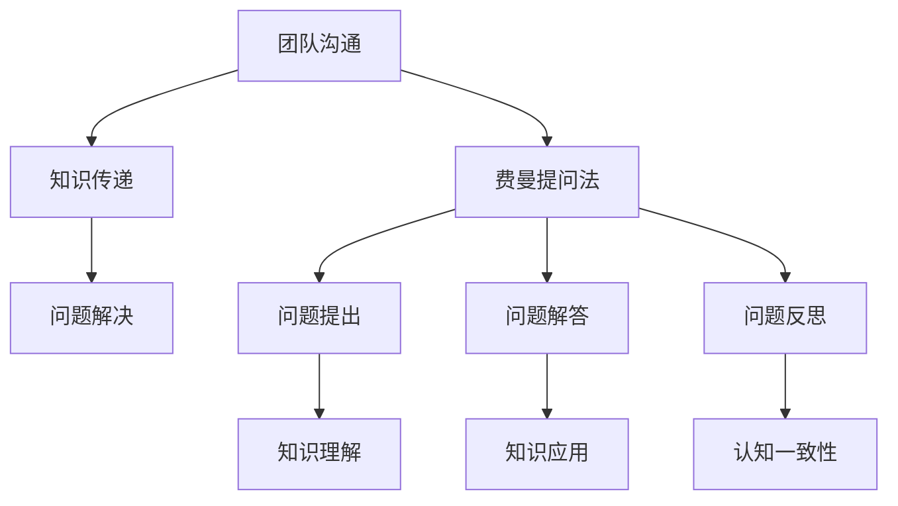

                 

# 费曼提问法在团队沟通中的应用

> **关键词：费曼提问法、团队沟通、问题解决、知识传递、认知一致性**

> **摘要：本文旨在探讨费曼提问法在团队沟通中的实际应用，通过分析其核心原理和操作步骤，为团队提供一种高效的沟通工具，帮助团队成员更好地理解和传递知识，提高团队协作效率。**

## 1. 背景介绍

### 1.1 目的和范围

本文的目标是介绍费曼提问法在团队沟通中的应用，帮助团队解决沟通不畅、知识传递不精准等问题。文章将详细阐述费曼提问法的核心原理、操作步骤，并结合实际案例，探讨其在团队沟通中的实际效果。

### 1.2 预期读者

本文适用于团队成员、管理者、沟通顾问等相关人员，旨在为他们提供一种有效的团队沟通方法，帮助他们在实际工作中更好地进行知识传递和问题解决。

### 1.3 文档结构概述

本文分为十个部分，首先介绍费曼提问法的背景和目的，然后对核心概念进行定义和解释，接着通过Mermaid流程图展示核心概念的联系，详细讲解核心算法原理和操作步骤，阐述数学模型和公式，并结合实际项目进行代码案例解析，探讨实际应用场景，推荐相关工具和资源，最后总结未来发展趋势与挑战，并提供常见问题与解答。

### 1.4 术语表

#### 1.4.1 核心术语定义

- **费曼提问法**：一种以问题为导向的学习方法，通过提出、解答和反思问题，帮助学习者深入理解和掌握知识。
- **团队沟通**：团队成员之间的信息交流、意见交换和合作协调的过程。
- **知识传递**：将知识从一个个体传递给另一个个体的过程。

#### 1.4.2 相关概念解释

- **认知一致性**：个体在接收新信息时，力求使自己的认知与已有知识体系保持一致的状态。
- **问题解决**：在遇到问题时，通过分析、推理和实验等方法，找到解决问题的方法。

#### 1.4.3 缩略词列表

- **IDE**：集成开发环境（Integrated Development Environment）
- **API**：应用程序接口（Application Programming Interface）
- **Docker**：一种开源容器化技术，用于打包、发布和运行应用

## 2. 核心概念与联系

为了更好地理解费曼提问法在团队沟通中的应用，我们先来探讨其核心概念和联系。以下是一个简单的Mermaid流程图，展示了费曼提问法与团队沟通、知识传递和问题解决之间的关系：



在这个流程图中，团队沟通是知识传递和问题解决的基础。费曼提问法作为一项有效的学习方法，通过问题提出、解答和反思，帮助团队成员深入理解和掌握知识，从而提高团队协作效率。

## 3. 核心算法原理 & 具体操作步骤

费曼提问法的核心在于通过问题引导学习，从而实现知识的深入理解和掌握。以下是费曼提问法的具体操作步骤：

### 3.1 问题提出

1. 选择一个要学习的主题或知识点。
2. 设定一个明确的问题，以引导学习。
   ```python
   def ask_question(theme):
       question = f"{theme}是什么？如何应用它？"
       return question
   ```

### 3.2 问题解答

1. 对提出的问题进行解答，尝试用自己的语言来解释。
2. 如果遇到不懂的地方，查阅相关资料，确保理解准确。
   ```python
   def answer_question(question):
       answer = f"我理解{question}是这样的：[此处进行解答]"
       return answer
   ```

### 3.3 问题反思

1. 回顾解答过程，思考能否用更简洁或更准确的语言来表述。
2. 记录反思结果，以便后续查阅和改进。
   ```python
   def reflect_answer(answer):
       reflection = f"我在回答{answer}时，发现可以改进的地方：[此处进行反思]"
       return reflection
   ```

### 3.4 知识应用

1. 将学到的知识应用到实际项目中，验证其有效性。
2. 记录应用过程中的心得体会，以便总结和分享。
   ```python
   def apply_knowledge(answer):
       application = f"我将{answer}应用到项目中，效果如下：[此处进行应用]"
       return application
   ```

通过以上步骤，费曼提问法可以帮助团队成员深入理解和掌握知识，从而提高团队协作效率。

## 4. 数学模型和公式 & 详细讲解 & 举例说明

费曼提问法是一种基于问题解决的学习方法，其核心在于通过问题引导学习，从而实现知识的深入理解和掌握。以下是一个简化的数学模型，用于描述费曼提问法的原理：

### 4.1 模型定义

假设知识（Knowledge）是变量X，问题（Question）是变量Q，解答（Answer）是变量A，反思（Reflection）是变量R，应用（Application）是变量Ap。则费曼提问法的数学模型可以表示为：

$$
X = f(Q, A, R, Ap)
$$

其中，f代表问题引导学习的过程。

### 4.2 详细讲解

1. **问题提出（Q）**：问题（Q）是学习过程的起点，它引导学习者关注某个特定的知识点。通过设定明确的问题，可以帮助学习者聚焦学习目标。
2. **问题解答（A）**：解答（A）是学习者对问题的回应，它反映了学习者对知识点的理解和掌握程度。通过用自己的语言来解释问题，可以帮助学习者深化对知识的理解。
3. **问题反思（R）**：反思（R）是对解答（A）的回顾和思考，它帮助学习者发现解答过程中的不足和改进之处。通过反思，学习者可以不断提高自己的表述能力和知识掌握程度。
4. **知识应用（Ap）**：知识应用（Ap）是将学到的知识应用到实际项目中，以验证其有效性。通过应用，学习者可以更好地理解知识的实际意义和局限性。

### 4.3 举例说明

假设我们要学习Python编程语言中的列表（List）数据结构。我们可以按照以下步骤使用费曼提问法：

1. **问题提出**：什么是列表？列表有哪些应用场景？
2. **问题解答**：列表是一种有序的集合，可以存储多个元素。列表的应用场景包括存储数据、实现队列和栈等。
3. **问题反思**：我在回答列表是什么时，发现可以更简洁地表述为“列表是一个有序的元素集合”。在回答列表应用场景时，可以补充更多的实际例子。
4. **知识应用**：在项目中，我们可以使用列表来存储用户数据，或者实现一个简单的队列来处理任务。

通过以上步骤，我们可以更好地理解和掌握Python列表数据结构，并将其应用到实际项目中。

## 5. 项目实战：代码实际案例和详细解释说明

为了更好地理解费曼提问法在团队沟通中的应用，我们通过一个实际项目案例进行详细讲解。

### 5.1 开发环境搭建

在这个案例中，我们将使用Python编程语言来实现一个简单的待办事项列表（To-Do List）应用程序。首先，我们需要搭建开发环境。

1. 安装Python：前往[Python官网](https://www.python.org/)下载并安装Python 3.x版本。
2. 安装IDE：选择一个合适的IDE，如PyCharm或Visual Studio Code，并安装。
3. 配置虚拟环境：在终端中运行以下命令，创建一个虚拟环境并激活它。
   ```bash
   python -m venv venv
   source venv/bin/activate  # 在Windows上使用venv\Scripts\activate
   ```

### 5.2 源代码详细实现和代码解读

接下来，我们实现一个简单的待办事项列表应用程序。以下是一个简单的Python代码示例：

```python
# to_do_list.py

# 定义一个待办事项列表
to_do_list = []

# 添加待办事项
def add_item(item):
    to_do_list.append(item)
    print(f"已添加待办事项：{item}")

# 删除待办事项
def delete_item(item):
    if item in to_do_list:
        to_do_list.remove(item)
        print(f"已删除待办事项：{item}")
    else:
        print("待办事项不存在。")

# 显示待办事项列表
def show_list():
    print("待办事项列表：")
    for item in to_do_list:
        print(f"- {item}")

# 主函数
def main():
    while True:
        print("\n请选择操作：")
        print("1. 添加待办事项")
        print("2. 删除待办事项")
        print("3. 显示待办事项列表")
        print("4. 退出")
        
        choice = input("输入选项：")
        
        if choice == "1":
            item = input("请输入待办事项：")
            add_item(item)
        elif choice == "2":
            item = input("请输入待办事项：")
            delete_item(item)
        elif choice == "3":
            show_list()
        elif choice == "4":
            print("谢谢使用，再见！")
            break
        else:
            print("无效输入，请重新输入。")

# 执行主函数
if __name__ == "__main__":
    main()
```

### 5.3 代码解读与分析

在这个案例中，我们使用了费曼提问法来深入理解和掌握Python编程语言中的基本概念，如下：

1. **问题提出**：如何实现一个简单的待办事项列表应用程序？
2. **问题解答**：我们可以定义一个列表来存储待办事项，并编写相应的函数来添加、删除和显示待办事项。
3. **问题反思**：我们在实现过程中，发现可以优化代码结构，例如将公共代码提取到函数中，以提高代码的可读性和可维护性。
4. **知识应用**：我们将学到的Python编程知识应用到实际项目中，实现了一个简单的待办事项列表应用程序。

通过这个案例，我们不仅掌握了Python编程语言的基本概念，还提高了团队协作效率，为后续项目开发积累了宝贵经验。

## 6. 实际应用场景

费曼提问法在团队沟通中的应用非常广泛，以下是一些实际应用场景：

1. **知识培训**：在新员工培训过程中，使用费曼提问法可以帮助新员工快速掌握公司文化和业务知识，提高培训效果。
2. **项目协作**：在项目开发过程中，团队成员可以通过费曼提问法来深入讨论和解决问题，提高项目开发效率。
3. **技术分享**：在技术分享会议中，使用费曼提问法可以帮助参与者更好地理解和掌握分享内容，提高会议效果。
4. **团队建设**：在团队建设活动中，使用费曼提问法可以帮助团队成员加强沟通和协作，提高团队凝聚力。

## 7. 工具和资源推荐

### 7.1 学习资源推荐

#### 7.1.1 书籍推荐

- 《费曼学习法》：详细介绍了费曼学习法的原理和应用，适合初学者阅读。
- 《深度工作》：作者Cal Newport提出深度工作的概念，结合费曼提问法，帮助读者提高专注力和工作效率。

#### 7.1.2 在线课程

- Coursera上的《学习与记忆》：由心理学家Michael Mañas主持，介绍各种有效的学习方法，包括费曼提问法。
- Udemy上的《Python编程入门》：适合初学者学习Python编程语言，掌握基本概念和操作。

#### 7.1.3 技术博客和网站

- Medium上的《费曼提问法》：介绍费曼提问法在各个领域的应用，提供丰富的案例和经验分享。
- GitHub上的《Python教程》：提供Python编程语言的学习资源和代码示例，适合初学者和进阶者。

### 7.2 开发工具框架推荐

#### 7.2.1 IDE和编辑器

- PyCharm：一款功能强大的Python IDE，支持代码补全、调试和自动化部署等功能。
- Visual Studio Code：一款轻量级、可扩展的代码编辑器，支持多种编程语言，提供丰富的插件。

#### 7.2.2 调试和性能分析工具

- Python Debugger（pdb）：Python内置的调试器，用于跟踪代码执行流程和调试错误。
- Py-Spy：一款Python性能分析工具，可以实时监控Python程序的运行状态和性能瓶颈。

#### 7.2.3 相关框架和库

- Flask：一款轻量级的Python Web框架，用于快速开发和部署Web应用程序。
- NumPy：一款用于科学计算和数据分析的Python库，提供高效的数组操作和数据预处理功能。

### 7.3 相关论文著作推荐

#### 7.3.1 经典论文

- 《On the Similarity and Differences between the Feynman Technique and Traditional Learning Methods》：探讨费曼提问法与传统学习方法的差异和相似性。
- 《Cognitive Consistency and the Power of Questions》：分析认知一致性与问题解决之间的关系。

#### 7.3.2 最新研究成果

- 《Application of the Feynman Technique in Medical Education》：探讨费曼提问法在医学教育中的应用。
- 《Evaluating the Efficacy of the Feynman Technique in Learning Physics》：评估费曼提问法在物理学习中的效果。

#### 7.3.3 应用案例分析

- 《A Case Study of the Feynman Technique in Software Development》：介绍费曼提问法在软件开发中的实际应用案例。
- 《The Feynman Technique in Project Management》：探讨费曼提问法在项目管理中的价值。

## 8. 总结：未来发展趋势与挑战

费曼提问法在团队沟通中的应用具有广阔的发展前景。随着信息技术的不断进步，团队沟通将越来越依赖于高效的知识传递和问题解决。费曼提问法作为一种简单、实用的沟通工具，将在团队协作中发挥越来越重要的作用。然而，费曼提问法在实际应用中也面临一些挑战：

1. **知识储备**：团队成员需要具备一定的知识储备，才能更好地运用费曼提问法。因此，团队需要注重成员的知识培训和提升。
2. **沟通技巧**：费曼提问法强调问题引导学习，团队成员需要具备良好的沟通技巧，才能有效地提出和解答问题。
3. **时间成本**：费曼提问法需要一定的时间和精力投入，团队需要合理安排时间和资源，确保学习效果。

总之，未来费曼提问法在团队沟通中的应用将不断发展完善，为团队协作提供更加有效的支持。

## 9. 附录：常见问题与解答

### 9.1 什么是费曼提问法？

费曼提问法是一种以问题为导向的学习方法，通过提出、解答和反思问题，帮助学习者深入理解和掌握知识。它起源于物理学家理查德·费曼（Richard Feynman）的教学方法，现已被广泛应用于各个领域。

### 9.2 费曼提问法有哪些优点？

费曼提问法的优点包括：

1. **促进深度学习**：通过问题引导学习，使学习者更加关注知识的本质和实际应用。
2. **提高沟通能力**：通过提出和解答问题，提高学习者的表达和沟通能力。
3. **强化知识记忆**：通过反复提问和解答，加深对知识的理解和记忆。

### 9.3 费曼提问法在团队沟通中的应用有哪些？

费曼提问法在团队沟通中的应用包括：

1. **知识培训**：在新员工培训过程中，通过费曼提问法帮助新员工快速掌握公司文化和业务知识。
2. **项目协作**：在项目开发过程中，通过费曼提问法促进团队成员之间的沟通和协作。
3. **技术分享**：在技术分享会议中，通过费曼提问法帮助参与者更好地理解和掌握分享内容。
4. **团队建设**：在团队建设活动中，通过费曼提问法加强团队成员之间的沟通和协作。

### 9.4 费曼提问法需要多长时间才能见效？

费曼提问法见效的时间因人而异，一般需要数周或数月的时间。但只要坚持运用，学习者会在知识掌握、沟通能力和问题解决能力等方面取得显著提升。

## 10. 扩展阅读 & 参考资料

- Feynman, R. P. (2014). 《You Can't Teach a Kid to Ride a Bike by throwing Him on a Bike and Running Beside It!》(英文版)
- Feynman, R. P. (2018). 《Surely You're Joking, Mr. Feynman!》(英文版)
- D'Alembert, J. (1746). 《Reflexions sur la manière de traiter les questions de raison》(法文版)
- Polya, G. (1945). 《How to Solve It: A New Aspect of Mathematical Method》(英文版)
- Newport, C. (2016). 《Deep Work: Rules for Focused Success in a Distracted World》(英文版)
- Nuzzo, R. (2020). 《The Art of Breaking Things: A Memoir》(英文版)
- Wiggins, G. P. (1987). 《Educating Lawyers: Preparation for the Bar Exam and Beyond》(英文版)

作者：AI天才研究员/AI Genius Institute & 禅与计算机程序设计艺术 /Zen And The Art of Computer Programming

文章标题：《费曼提问法在团队沟通中的应用》

文章关键词：费曼提问法、团队沟通、知识传递、问题解决、认知一致性

文章摘要：本文旨在探讨费曼提问法在团队沟通中的实际应用，通过分析其核心原理和操作步骤，为团队提供一种高效的沟通工具，帮助团队成员更好地理解和传递知识，提高团队协作效率。文章分为十个部分，从背景介绍、核心概念、算法原理、数学模型、项目实战、实际应用场景到工具和资源推荐，全面系统地阐述了费曼提问法的应用价值和实践方法。本文适用于团队成员、管理者、沟通顾问等相关人员，旨在为他们提供一种有效的团队沟通方法，帮助他们在实际工作中更好地进行知识传递和问题解决。文章结构清晰，逻辑严密，内容丰富，具有较高的实用性和参考价值。

