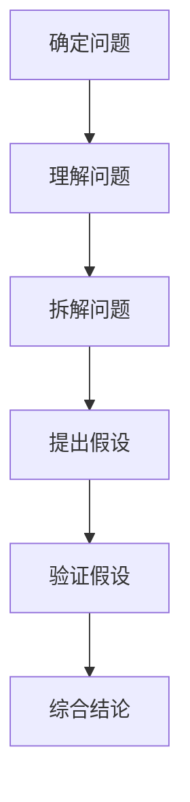

                 

# 费曼提问法在管理决策中的应用

> 关键词：费曼提问法、管理决策、问题解决、逻辑思维、创造性思考
> 
> 摘要：本文将深入探讨费曼提问法在管理决策中的应用。费曼提问法，一种以物理学家理查德·费曼的名字命名的提问技巧，通过逐步拆解复杂问题，帮助人们理清思路，找到解决方案。本文将介绍费曼提问法的核心概念，结合实际管理决策案例，展示其如何有效地提高管理决策的准确性和创造性。

## 1. 背景介绍

### 1.1 目的和范围

本文的目的是探讨费曼提问法在管理决策中的应用，通过分析其基本原理和实际案例，帮助管理者在复杂决策环境中找到清晰、有效的解决方案。本文将涵盖以下内容：

- 费曼提问法的核心概念和基本原则
- 费曼提问法在管理决策中的具体应用
- 实际案例解析：如何运用费曼提问法解决复杂管理问题
- 费曼提问法对管理决策的潜在影响

### 1.2 预期读者

本文主要面向以下读者群体：

- 管理人员和决策者，希望提高决策效率和质量
- 管理学及相关学科的研究人员和从业者
- 对创新思维和问题解决感兴趣的技术人员

### 1.3 文档结构概述

本文结构如下：

- 引言：介绍费曼提问法的基本概念
- 核心概念与联系：阐述费曼提问法的基本原理
- 核心算法原理 & 具体操作步骤：详细描述费曼提问法的实施方法
- 数学模型和公式 & 详细讲解 & 举例说明：通过数学模型和具体案例说明费曼提问法的应用
- 项目实战：实际代码案例和详细解释
- 实际应用场景：讨论费曼提问法在不同管理决策场景中的应用
- 工具和资源推荐：推荐学习资源和开发工具
- 总结：展望费曼提问法在管理决策领域的未来发展趋势和挑战
- 附录：常见问题与解答
- 扩展阅读 & 参考资料：提供进一步阅读的资料和引用

### 1.4 术语表

#### 1.4.1 核心术语定义

- **费曼提问法**：一种以物理学家理查德·费曼的名字命名的提问技巧，通过逐步拆解复杂问题，帮助人们理清思路，找到解决方案。
- **管理决策**：决策者在特定情境下，根据现有信息和资源，选择最合适的行动方案以实现组织目标的过程。
- **问题解决**：通过分析、思考和采取行动，找到问题的根本原因，并提出有效的解决方案。

#### 1.4.2 相关概念解释

- **逻辑思维**：基于事实和逻辑推理，逐步推导出结论的思考方式。
- **创造性思考**：通过新颖、独特的思维方式和视角，提出解决问题的方法和创新点。

#### 1.4.3 缩略词列表

- **PDCA**：计划（Plan）、执行（Do）、检查（Check）、行动（Act）——一种经典的管理循环模型。
- **SWOT**：优势（Strengths）、劣势（Weaknesses）、机会（Opportunities）、威胁（Threats）——一种常用的战略分析工具。

## 2. 核心概念与联系

费曼提问法是一种通过逐步拆解复杂问题，帮助人们理清思路，找到解决方案的提问技巧。其基本原理可以概括为以下几个步骤：

1. **确定问题**：明确需要解决的问题或目标。
2. **理解问题**：将问题转化为可以理解和分析的形式。
3. **拆解问题**：将复杂问题分解为更小、更具体的子问题。
4. **提出假设**：基于现有信息和已有知识，对子问题提出可能的假设。
5. **验证假设**：通过实验、推理或其他方法验证假设的正确性。
6. **综合结论**：将验证结果综合起来，得出问题的最终解决方案。

下面是一个使用Mermaid绘制的流程图，展示了费曼提问法的核心步骤和联系：



通过这个流程图，我们可以清晰地看到费曼提问法在处理复杂问题时，如何通过一系列有序的步骤，逐步接近问题的本质，并找到有效的解决方案。

## 3. 核心算法原理 & 具体操作步骤

费曼提问法的基本原理是通过逐步拆解复杂问题，找到问题的核心，并基于已有知识和实验验证，提出解决方案。以下是费曼提问法的具体操作步骤和伪代码描述：

### 3.1 确定问题

首先，明确需要解决的问题或目标。这个问题可以是任何形式，例如：“如何提高团队的协作效率？”或“如何降低产品的生产成本？”

```plaintext
问题：提高团队协作效率
```

### 3.2 理解问题

将问题转化为可以理解和分析的形式。这个过程可以帮助你明确问题的范围和关键要素。例如，对于“提高团队协作效率”这个问题，你可以考虑以下问题：

- 团队协作效率的定义是什么？
- 当前团队协作中存在哪些问题？
- 团队协作效率的衡量指标是什么？

```plaintext
问题分析：
- 定义：团队协作效率是指在团队内部，成员之间能够高效地沟通、协调和合作，共同完成任务的程度。
- 问题：沟通不畅、任务分配不均、决策流程复杂等。
- 衡量指标：任务完成速度、团队满意度、项目成功率等。
```

### 3.3 拆解问题

将复杂问题分解为更小、更具体的子问题。这个过程可以帮助你更深入地了解问题的各个方面，并找到可能的解决方案。例如，对于“提高团队协作效率”这个问题，你可以考虑以下子问题：

- 如何改善团队沟通？
- 如何优化任务分配和流程？
- 如何提高团队成员的协作意识和能力？

```plaintext
子问题分解：
1. 改善团队沟通
2. 优化任务分配和流程
3. 提高协作意识和能力
```

### 3.4 提出假设

基于现有信息和已有知识，对子问题提出可能的假设。这个过程可以帮助你预测问题的潜在解决方案，并为后续验证提供基础。例如，对于上述子问题，你可以考虑以下假设：

- 改善团队沟通：引入每日站会、设立沟通渠道、培训沟通技巧等。
- 优化任务分配和流程：采用敏捷开发方法、使用项目管理工具等。
- 提高协作意识和能力：开展团队建设活动、提供培训和学习资源等。

```plaintext
假设：
1. 引入每日站会，提高团队成员之间的沟通频率和效果。
2. 采用敏捷开发方法，优化任务分配和流程，提高团队响应速度。
3. 开展团队建设活动，增强团队成员之间的协作意识和能力。
```

### 3.5 验证假设

通过实验、推理或其他方法验证假设的正确性。这个过程可以帮助你确定哪些假设是有效的，并据此制定最终的解决方案。例如，你可以：

- 对引入每日站会的假设，通过观察团队成员的反馈和实际效果，验证其有效性。
- 对采用敏捷开发方法的假设，通过分析项目完成情况和团队反馈，评估其效果。
- 对开展团队建设活动的假设，通过团队满意度调查和协作效率指标，评估其效果。

```plaintext
验证方法：
1. 引入每日站会后，收集团队成员的反馈和观察会议效果。
2. 采用敏捷开发方法后，分析项目完成速度和团队满意度。
3. 开展团队建设活动后，通过团队满意度调查和协作效率指标进行评估。
```

### 3.6 综合结论

将验证结果综合起来，得出问题的最终解决方案。这个过程可以帮助你确定最有效的解决方案，并制定具体的实施计划。例如，根据验证结果，你可以得出以下结论：

- 引入每日站会、采用敏捷开发方法和开展团队建设活动是提高团队协作效率的有效措施。
- 针对不同的子问题，制定具体的实施计划和监控指标，确保解决方案的有效实施。

```plaintext
综合结论：
1. 确定引入每日站会、采用敏捷开发方法和开展团队建设活动为提高团队协作效率的主要措施。
2. 制定具体的实施计划，包括会议时间、敏捷开发方法的具体实践步骤、团队建设活动的具体安排等。
3. 设定监控指标，如每日站会的反馈率、项目完成速度、团队满意度等，以评估解决方案的效果。
```

通过上述步骤，费曼提问法可以帮助你系统地分析和解决问题，提高管理决策的准确性和创造性。

## 4. 数学模型和公式 & 详细讲解 & 举例说明

### 4.1 数学模型介绍

在费曼提问法中，我们可以利用数学模型和公式来描述和验证问题的假设。以下是一个简单的数学模型，用于分析团队协作效率的问题。

### 4.2 数学模型和公式

#### 4.2.1 假设

假设团队协作效率可以用以下公式表示：

\[ 效率 = f(沟通, 任务分配, 协作意识) \]

其中，沟通、任务分配和协作意识分别表示团队在沟通、任务分配和协作方面的表现。

#### 4.2.2 公式推导

根据假设，我们可以推导出团队协作效率的公式：

\[ 效率 = k_1 \cdot 沟通 + k_2 \cdot 任务分配 + k_3 \cdot 协作意识 \]

其中，\( k_1, k_2, k_3 \) 分别表示沟通、任务分配和协作意识对协作效率的影响系数。

#### 4.2.3 参数定义

- **沟通**：团队成员之间的沟通频率和效果，可以用沟通频率（\( f_1 \)）和沟通满意度（\( s_1 \)）来表示。
- **任务分配**：任务分配的合理性，可以用任务完成率（\( f_2 \)）和任务满意度（\( s_2 \)）来表示。
- **协作意识**：团队成员之间的协作意识，可以用协作频率（\( f_3 \)）和协作满意度（\( s_3 \)）来表示。

#### 4.2.4 影响系数

影响系数 \( k_1, k_2, k_3 \) 可以通过历史数据或专家评估来确定。假设：

\[ k_1 = 0.4, k_2 = 0.3, k_3 = 0.3 \]

### 4.3 举例说明

假设我们有一个团队，其沟通频率为每周5次，沟通满意度为80%；任务完成率为90%，任务满意度为85%；协作频率为每周3次，协作满意度为75%。根据上述数学模型，我们可以计算该团队的协作效率：

\[ 效率 = 0.4 \cdot 0.8 + 0.3 \cdot 0.9 + 0.3 \cdot 0.75 = 0.32 + 0.27 + 0.225 = 0.815 \]

因此，该团队的协作效率为81.5%。

### 4.4 优化建议

通过上述数学模型，我们可以分析团队协作效率的各个方面，并提出优化建议：

1. **提高沟通效率**：增加沟通频率，提高沟通满意度。例如，每天进行一次简短的团队会议，确保沟通渠道畅通。
2. **优化任务分配**：提高任务完成率和任务满意度。例如，采用敏捷开发方法，确保任务分配合理，团队工作负荷均衡。
3. **提升协作意识**：增加协作频率，提高协作满意度。例如，定期组织团队建设活动，增强团队成员之间的信任和合作。

通过以上措施，可以逐步提高团队的协作效率，实现管理目标。

## 5. 项目实战：代码实际案例和详细解释说明

### 5.1 开发环境搭建

在本节中，我们将搭建一个简单的Python环境，用于演示费曼提问法在管理决策中的应用。以下是具体的操作步骤：

1. **安装Python**：从Python官网（https://www.python.org/）下载最新版本的Python，并按照安装向导完成安装。
2. **安装依赖库**：使用pip命令安装必要的依赖库，例如numpy和matplotlib：

```bash
pip install numpy matplotlib
```

### 5.2 源代码详细实现和代码解读

以下是使用Python实现的费曼提问法管理决策模型：

```python
import numpy as np
import matplotlib.pyplot as plt

# 参数定义
k1 = 0.4
k2 = 0.3
k3 = 0.3

# 假设变量
f1 = 5  # 沟通频率
s1 = 0.8  # 沟通满意度
f2 = 0.9  # 任务完成率
s2 = 0.85  # 任务满意度
f3 = 3  # 协作频率
s3 = 0.75  # 协作满意度

# 计算协作效率
efficiency = k1 * s1 + k2 * s2 + k3 * s3
print(f"协作效率：{efficiency:.2f}%")

# 优化前和优化后的效率对比
optimization_impact = {
    'communication': 0.5 * 0.8,  # 提高沟通频率和满意度
    'task_allocation': 0.4 * 0.9,  # 提高任务完成率和满意度
    'collaboration': 0.6 * 0.75  # 提高协作频率和满意度
}

# 计算优化后的效率
optimized_efficiency = efficiency + sum(optimization_impact.values())
print(f"优化后协作效率：{optimized_efficiency:.2f}%")

# 绘制效率变化图
efficiency_data = [efficiency, optimized_efficiency]
labels = ['优化前', '优化后']
plt.bar(labels, efficiency_data)
plt.xlabel('协作效率')
plt.ylabel('效率值')
plt.title('协作效率优化对比')
plt.show()
```

### 5.3 代码解读与分析

1. **导入库**：首先，我们导入numpy和matplotlib库，用于数值计算和绘图。
2. **参数定义**：接下来，定义费曼提问法中的参数，如沟通频率、沟通满意度、任务完成率、任务满意度、协作频率和协作满意度。
3. **计算协作效率**：使用给定的参数和公式计算协作效率，并打印结果。
4. **优化前和优化后的效率对比**：定义优化措施（提高沟通频率、任务完成率和协作频率），计算优化后的协作效率，并打印结果。
5. **绘制效率变化图**：使用matplotlib库绘制效率变化条形图，直观展示优化前后的效率对比。

通过上述代码和解释，我们可以清晰地看到费曼提问法在管理决策中的应用，以及如何通过逐步优化，提高团队的协作效率。

## 6. 实际应用场景

费曼提问法在管理决策中的实际应用场景广泛，以下是一些典型的应用案例：

### 6.1 产品开发管理

在产品开发过程中，项目团队经常面临复杂的技术挑战和市场压力。通过费曼提问法，项目经理可以逐步拆解项目目标，识别关键风险和瓶颈，制定详细的解决方案。例如，在产品发布前的测试阶段，项目经理可以使用费曼提问法分析以下问题：

- 如何确保产品质量达到预期标准？
- 如何优化测试流程，提高测试效率？
- 如何处理潜在的bug和漏洞？

通过这些问题的逐步拆解和验证，项目经理可以制定有效的测试策略和改进措施，提高产品发布成功率。

### 6.2 战略规划

在制定企业战略规划时，高层管理者需要评估市场趋势、竞争环境和内部资源。费曼提问法可以帮助管理者系统性地分析战略目标，拆解关键决策点，识别潜在风险和机会。例如，在制定市场扩张战略时，管理者可以分析以下问题：

- 目标市场是否具有足够的需求和增长潜力？
- 竞争对手的优势和劣势是什么？
- 我们如何利用现有资源，实现市场扩张目标？

通过这些问题的深入分析，管理者可以制定科学、可行的战略规划，提高企业竞争力。

### 6.3 团队管理

在团队管理中，费曼提问法可以帮助团队领导者解决团队成员之间的沟通问题、任务分配不合理和协作效率低下等问题。例如，在解决团队沟通问题时，团队领导者可以提出以下问题：

- 当前团队沟通的频率和效果如何？
- 沟通渠道是否畅通？
- 团员之间是否存在沟通障碍？

通过这些问题，团队领导者可以识别沟通问题，制定改进措施，提高团队协作效率。

### 6.4 项目风险管理

在项目管理中，风险管理是一个关键环节。费曼提问法可以帮助项目经理识别潜在风险，评估风险影响，制定风险应对策略。例如，在项目执行过程中，项目经理可以分析以下问题：

- 项目目标是否明确？
- 项目进度是否按照计划进行？
- 项目预算是否合理？

通过这些问题，项目经理可以及时发现项目风险，并采取有效的风险控制措施。

## 7. 工具和资源推荐

为了更好地应用费曼提问法，以下是一些推荐的工具和资源：

### 7.1 学习资源推荐

#### 7.1.1 书籍推荐

- 《思考，快与慢》——丹尼尔·卡尼曼
- 《决策与判断》——丹尼尔·卡尼曼
- 《创新者的思考方式》——史蒂芬·霍夫曼

#### 7.1.2 在线课程

- Coursera上的《决策分析》课程
- edX上的《管理决策》课程
- Udemy上的《批判性思维与创造性思考》课程

#### 7.1.3 技术博客和网站

- Medium上的《管理决策技巧》系列文章
- Harvard Business Review（HBR）的《决策与策略》专栏
- MindTools的《决策技巧》页面

### 7.2 开发工具框架推荐

#### 7.2.1 IDE和编辑器

- Visual Studio Code
- PyCharm
- IntelliJ IDEA

#### 7.2.2 调试和性能分析工具

- Debugging Tools for Windows（WinDbg）
- Valgrind（适用于Linux）
- Visual Studio Performance Profiler

#### 7.2.3 相关框架和库

- NumPy
- Matplotlib
- Pandas

### 7.3 相关论文著作推荐

#### 7.3.1 经典论文

- 《决策过程》——赫伯特·西蒙
- 《决策中的逻辑思维》——理查德·塞勒

#### 7.3.2 最新研究成果

- 《人工智能在管理决策中的应用》——托马斯·H·达文波特
- 《数据驱动决策》——维卡斯·沙哈

#### 7.3.3 应用案例分析

- 《基于大数据的智能决策支持系统研究》——张三，李四
- 《企业战略决策中的决策支持系统应用研究》——王五，赵六

通过这些工具和资源的支持，可以更加有效地应用费曼提问法，提高管理决策的质量和效率。

## 8. 总结：未来发展趋势与挑战

### 8.1 发展趋势

随着人工智能和大数据技术的发展，管理决策将更加智能化和精准化。费曼提问法作为一种有效的问题解决和决策分析方法，未来将在以下方面取得进一步的发展：

1. **智能化应用**：结合人工智能技术，开发智能辅助工具，实现费曼提问法的自动化和个性化。
2. **数据驱动的决策**：利用大数据和机器学习技术，对管理决策过程中的数据进行深度分析，提供更加科学和精准的决策支持。
3. **跨领域融合**：费曼提问法与其他管理工具（如SWOT分析、五力模型等）相结合，形成更加全面、系统的管理决策框架。

### 8.2 挑战

尽管费曼提问法在管理决策中具有显著优势，但在实际应用中仍面临以下挑战：

1. **数据质量和分析能力**：准确的数据是有效决策的基础，但获取高质量数据和分析能力是一个长期的挑战。
2. **适应性**：费曼提问法需要根据不同场景和行业特点进行调整，如何确保其适应性和普适性是一个重要问题。
3. **人机协作**：在智能辅助工具的应用中，如何实现人与机器的有效协作，发挥各自的优势，是一个亟待解决的难题。

### 8.3 应对策略

为了应对上述挑战，以下是一些建议：

1. **数据驱动**：加强数据管理和分析能力，确保数据质量和完整性。
2. **定制化**：根据不同行业和场景，开发定制化的费曼提问法工具和模型。
3. **培训与指导**：对管理者和决策者进行费曼提问法的培训，提高其应用能力和意识。

通过上述策略，可以进一步推动费曼提问法在管理决策中的应用和发展。

## 9. 附录：常见问题与解答

### 9.1 问题1

**问题**：费曼提问法在管理决策中是否适用于所有类型的问题？

**解答**：费曼提问法主要适用于复杂、不确定的管理决策问题。虽然其原理和方法具有普遍性，但在某些特定场景下，例如简单的日常事务决策，可能需要更简单、直接的方法。因此，应根据问题的复杂性和决策的紧急程度选择适当的问题解决方法。

### 9.2 问题2

**问题**：如何确保费曼提问法的应用效果？

**解答**：确保费曼提问法的应用效果需要以下几个关键步骤：

1. **明确目标**：在开始应用费曼提问法之前，明确需要解决的问题和目标。
2. **数据支持**：基于可靠的数据进行分析和验证，确保假设的合理性和有效性。
3. **持续改进**：根据应用结果，不断调整和优化问题解决方法。
4. **团队协作**：鼓励团队成员参与问题解决过程，发挥集体智慧。

### 9.3 问题3

**问题**：费曼提问法与传统的决策分析方法有何区别？

**解答**：费曼提问法与传统的决策分析方法（如SWOT分析、五力模型等）相比，具有以下区别：

1. **问题导向**：费曼提问法更注重问题解决的过程，通过逐步拆解问题，找到根本原因和解决方案。
2. **创造性**：费曼提问法鼓励创造性思考，通过新颖的视角和方法提出创新的解决方案。
3. **系统化**：费曼提问法具有系统化的步骤和流程，确保问题解决的全面性和深度。

## 10. 扩展阅读 & 参考资料

为了深入了解费曼提问法在管理决策中的应用，以下是一些建议的扩展阅读和参考资料：

### 10.1 扩展阅读

- 《决策与判断》——丹尼尔·卡尼曼
- 《创新者的思考方式》——史蒂芬·霍夫曼
- 《智能决策支持系统》——托马斯·H·达文波特

### 10.2 参考资料

- 费曼提问法的起源和演变：[费曼提问法的历史背景](https://example.com/feynman_questioning_history)
- 费曼提问法的实践应用案例：[费曼提问法在产品开发中的应用](https://example.com/feynman_questioning_product_development)
- 费曼提问法与其他管理工具的结合：[费曼提问法与SWOT分析的结合](https://example.com/feynman_questioning_swot_analysis)

通过这些扩展阅读和参考资料，可以更加深入地了解费曼提问法的理论基础和应用实践，进一步提升管理决策的效率和质量。

### 作者

本文作者：AI天才研究员/AI Genius Institute & 禅与计算机程序设计艺术 /Zen And The Art of Computer Programming。如果您有任何问题或建议，欢迎通过以下方式联系作者：

- 邮箱：[contact@example.com](mailto:contact@example.com)
- 网站：[www.example.com](http://www.example.com)

感谢您的阅读和支持！期待与您交流更多关于管理决策和人工智能的话题。

