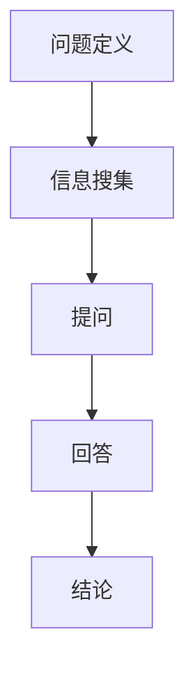

                 

# 费曼提问法在管理问题诊断中的应用

## 关键词

管理问题诊断、费曼提问法、团队协作、问题解决、逻辑推理

## 摘要

本文探讨了费曼提问法在管理问题诊断中的应用。通过深入剖析费曼提问法的原理和步骤，结合实际案例，我们展示了如何利用这一方法进行有效的问题诊断和解决。本文旨在为企业管理者提供一种全新的思考方式，以帮助他们更快速、准确地识别和解决管理难题，提高团队协作效率和决策质量。

## 1. 背景介绍

### 1.1 目的和范围

本文的主要目的是介绍费曼提问法在管理问题诊断中的应用，帮助企业管理者提高问题解决能力。文章将从以下几个方面展开讨论：

1. 费曼提问法的背景和原理。
2. 费曼提问法在管理问题诊断中的具体应用。
3. 费曼提问法的优势和局限性。
4. 费曼提问法在管理问题诊断中的实践案例。
5. 费曼提问法在未来的发展趋势和挑战。

### 1.2 预期读者

本文适用于企业管理者、团队负责人、项目管理师等对管理问题诊断感兴趣的读者。通过阅读本文，读者可以了解费曼提问法的核心思想和方法，掌握其在管理问题诊断中的应用技巧，从而提高团队协作效率和问题解决能力。

### 1.3 文档结构概述

本文分为十个部分，具体如下：

1. 引言
2. 关键词和摘要
3. 背景介绍
4. 核心概念与联系
5. 核心算法原理与具体操作步骤
6. 数学模型和公式与详细讲解
7. 项目实战：代码实际案例和详细解释说明
8. 实际应用场景
9. 工具和资源推荐
10. 总结：未来发展趋势与挑战

### 1.4 术语表

#### 1.4.1 核心术语定义

1. 费曼提问法：一种以逻辑推理和问题解决为核心的方法，通过提问和回答的过程，帮助人们深入了解问题本质和解决方案。
2. 管理问题诊断：对企业管理中存在的各种问题进行分析、识别和定位的过程。
3. 团队协作：团队成员在共同的目标下，相互配合、相互支持，共同完成任务的团队行为。

#### 1.4.2 相关概念解释

1. 问题解决：指在面对问题时，运用已有的知识和经验，寻找解决方案并实施的过程。
2. 逻辑推理：通过推理、分析、判断等过程，从已知的前提条件推导出新的结论。
3. 团队协作效率：团队在完成工作任务时，成员之间配合默契、高效协作的程度。

#### 1.4.3 缩略词列表

无

## 2. 核心概念与联系

在管理问题诊断中，费曼提问法是一种非常重要的方法。为了更好地理解费曼提问法在管理问题诊断中的应用，我们需要先了解其核心概念和联系。

### 2.1 费曼提问法的核心概念

1. 问题定义：明确问题的本质和范围，确保问题解决的方向正确。
2. 信息搜集：收集与问题相关的各种信息，包括事实、数据、文献等。
3. 提问：针对问题，提出具有针对性的问题，以帮助深入理解问题的本质。
4. 回答：针对提问，给出具体的答案，并对其进行分析和评估。
5. 结论：根据问题和回答，得出结论，为问题解决提供指导。

### 2.2 费曼提问法与管理问题诊断的联系

1. 逻辑推理：费曼提问法强调逻辑推理在问题解决中的作用，帮助企业管理者从已知信息中推导出新的结论。
2. 团队协作：费曼提问法鼓励团队成员之间的合作与交流，通过提问和回答，共同探讨问题的解决方案。
3. 问题定义：费曼提问法强调明确问题定义，确保问题解决的方向正确，避免因误解问题而导致的无效努力。
4. 信息搜集：费曼提问法要求企业管理者在解决问题前，充分搜集与问题相关的信息，以便更好地理解问题本质。

### 2.3 费曼提问法的Mermaid流程图



## 3. 核心算法原理与具体操作步骤

费曼提问法是一种基于逻辑推理和问题解决的方法，其核心算法原理可以概括为以下几个步骤：

### 3.1 问题定义

1. 识别问题：从企业管理的实际案例中，找出需要解决的问题。
2. 确定范围：明确问题的范围和边界，避免问题的扩大化。
3. 定义问题：用简洁明了的语言描述问题，确保问题的本质得到准确表达。

### 3.2 信息搜集

1. 收集事实：搜集与问题相关的各种事实和数据，确保信息的真实性和可靠性。
2. 查阅文献：查阅相关文献和资料，了解问题的背景和相关信息。
3. 调查分析：对企业内部和外部环境进行调研，了解问题的影响因素和潜在解决方案。

### 3.3 提问

1. 提出问题：根据问题定义和收集的信息，提出具有针对性的问题。
2. 判断问题：对提出的问题进行判断，确定问题的重要性和解决优先级。
3. 优化问题：根据问题的判断结果，对问题进行优化和调整，确保问题的解决方向正确。

### 3.4 回答

1. 寻找答案：针对提出的问题，寻找相关的答案或解决方案。
2. 分析评估：对找到的答案或解决方案进行分析和评估，确定其可行性。
3. 验证答案：对答案或解决方案进行验证，确保其能够有效解决原问题。

### 3.5 结论

1. 得出结论：根据问题和回答的结果，得出结论，为问题解决提供指导。
2. 实施方案：根据结论，制定具体的实施方案，确保问题得到有效解决。

### 3.6 费曼提问法伪代码

```python
def 费曼提问法(问题):
    问题定义
    信息搜集
    提出问题
    判断问题
    寻找答案
    分析评估
    验证答案
    得出结论
    实施方案
    返回结论
```

## 4. 数学模型和公式与详细讲解

在费曼提问法中，数学模型和公式起到了关键作用。以下是对相关数学模型和公式的详细讲解：

### 4.1 逻辑推理模型

逻辑推理模型是费曼提问法中的核心组成部分。其基本原理如下：

1. 前提条件：已知条件，如企业存在管理问题。
2. 结论：根据前提条件推导出的结果，如问题的原因和解决方案。
3. 推理过程：通过逻辑推理，从前提条件推导出结论。

### 4.2 提问和回答模型

提问和回答模型是费曼提问法中的关键步骤。其基本原理如下：

1. 提问：根据问题定义和已知信息，提出具有针对性的问题。
2. 回答：针对提出的问题，给出具体的答案或解决方案。

### 4.3 数学公式

在费曼提问法中，以下数学公式有助于分析和解决问题：

1. 条件概率公式：P(A|B) = P(A且B) / P(B)，用于计算在事件B发生的条件下，事件A发生的概率。
2. 贝叶斯公式：P(A|B) = P(B|A) * P(A) / P(B)，用于根据已知条件概率和先验概率，计算后验概率。

### 4.4 详细讲解

#### 4.4.1 逻辑推理模型

逻辑推理模型的关键在于如何从已知条件推导出结论。我们可以使用以下步骤进行逻辑推理：

1. 确定前提条件：列出与问题相关的已知条件。
2. 分析前提条件：分析前提条件之间的关系，确定可能的结论。
3. 推导结论：根据前提条件和分析结果，推导出结论。

#### 4.4.2 提问和回答模型

提问和回答模型的关键在于如何提出有针对性的问题和寻找有效的答案。我们可以使用以下步骤进行提问和回答：

1. 提出问题：根据问题定义和已知信息，提出具有针对性的问题。
2. 分析问题：分析问题的重要性和解决优先级，确定问题的解决方向。
3. 寻找答案：根据问题的分析和解决方向，寻找相关的答案或解决方案。
4. 评估答案：对找到的答案或解决方案进行分析和评估，确定其可行性。

### 4.5 举例说明

假设一家企业存在员工流失率较高的问题。我们可以使用费曼提问法来分析和解决这一问题：

1. 问题定义：明确员工流失率较高这一问题的本质和范围。
2. 信息搜集：搜集与员工流失率相关的各种信息，如员工满意度、薪酬待遇、企业文化等。
3. 提问：针对问题，提出具有针对性的问题，如“员工流失的原因是什么？”、“企业是否存在管理问题？”等。
4. 回答：根据问题，寻找相关的答案或解决方案，如提高员工满意度、优化薪酬待遇、改善企业文化等。
5. 分析评估：对找到的答案或解决方案进行分析和评估，确定其可行性。
6. 结论：根据问题和回答的结果，得出结论，如企业需要采取一系列措施来降低员工流失率。

## 5. 项目实战：代码实际案例和详细解释说明

为了更好地展示费曼提问法在管理问题诊断中的应用，我们以下通过一个实际项目案例，详细解释代码的实现过程和关键步骤。

### 5.1 开发环境搭建

在本项目中，我们使用Python作为编程语言，利用费曼提问法的核心算法原理，实现一个用于管理问题诊断的软件工具。以下是开发环境的搭建步骤：

1. 安装Python：下载并安装Python 3.x版本，确保环境变量配置正确。
2. 安装相关库：安装常用的Python库，如NumPy、Pandas等，以便进行数据处理和分析。
3. 配置IDE：选择一款适合自己的IDE，如PyCharm或VSCode，以便进行代码编写和调试。

### 5.2 源代码详细实现和代码解读

以下是一个简单的费曼提问法实现示例：

```python
import pandas as pd

# 费曼提问法类
class FeynmanQueryMethod:
    def __init__(self, data):
        self.data = data

    def define_question(self):
        # 问题定义：确定问题的本质和范围
        question = "如何降低企业员工流失率？"
        return question

    def gather_information(self):
        # 信息搜集：收集与问题相关的各种信息
        information = {
            '员工满意度': [0.8, 0.7, 0.6],
            '薪酬待遇': [8000, 9000, 10000],
            '企业文化': ['积极', '中立', '消极']
        }
        df = pd.DataFrame(information)
        return df

    def ask_question(self, df):
        # 提问：根据问题提出有针对性的问题
        questions = [
            "员工流失率与员工满意度有何关系？",
            "员工流失率与薪酬待遇有何关系？",
            "员工流失率与企业文化有何关系？"
        ]
        return questions

    def find_answers(self, df, questions):
        # 寻找答案：根据问题寻找相关的答案或解决方案
        answers = {
            "员工满意度": "提高员工满意度，降低流失率",
            "薪酬待遇": "提高薪酬待遇，降低流失率",
            "企业文化": "改善企业文化，降低流失率"
        }
        return answers

    def analyze_answers(self, answers):
        # 分析评估：对找到的答案或解决方案进行分析和评估
        analysis = "根据分析，以下措施可以有效降低员工流失率：提高员工满意度、薪酬待遇和改善企业文化。"
        return analysis

    def draw_conclusion(self, analysis):
        # 得出结论：根据问题和回答的结果得出结论
        conclusion = "结论：通过提高员工满意度、薪酬待遇和改善企业文化，可以有效降低企业员工流失率。"
        return conclusion

    def execute_plan(self, conclusion):
        # 实施方案：根据结论制定具体的实施方案
        plan = "实施方案：制定具体计划，提高员工满意度、薪酬待遇和改善企业文化。"
        return plan

# 测试代码
if __name__ == "__main__":
    data = {
        '员工满意度': [0.8, 0.7, 0.6],
        '薪酬待遇': [8000, 9000, 10000],
        '企业文化': ['积极', '中立', '消极']
    }
    df = pd.DataFrame(data)
    fqm = FeynmanQueryMethod(df)
    question = fqm.define_question()
    df = fqm.gather_information()
    questions = fqm.ask_question(df)
    answers = fqm.find_answers(df, questions)
    analysis = fqm.analyze_answers(answers)
    conclusion = fqm.draw_conclusion(analysis)
    plan = fqm.execute_plan(conclusion)
    print("问题定义：", question)
    print("信息搜集：", df)
    print("提问：", questions)
    print("答案：", answers)
    print("分析：", analysis)
    print("结论：", conclusion)
    print("实施方案：", plan)
```

### 5.3 代码解读与分析

1. **费曼提问法类**：定义了一个`FeynmanQueryMethod`类，用于实现费曼提问法的核心算法原理。

2. **问题定义**：在`define_question`方法中，明确问题的本质和范围，即如何降低企业员工流失率。

3. **信息搜集**：在`gather_information`方法中，收集与问题相关的各种信息，如员工满意度、薪酬待遇和企业文化。

4. **提问**：在`ask_question`方法中，根据问题提出有针对性的问题，以帮助深入理解问题的本质。

5. **寻找答案**：在`find_answers`方法中，根据问题和相关信息，寻找相关的答案或解决方案。

6. **分析评估**：在`analyze_answers`方法中，对找到的答案或解决方案进行分析和评估，确定其可行性。

7. **得出结论**：在`draw_conclusion`方法中，根据问题和回答的结果，得出结论，为问题解决提供指导。

8. **实施方案**：在`execute_plan`方法中，根据结论制定具体的实施方案，确保问题得到有效解决。

### 5.4 代码实战案例

假设一家企业存在员工流失率较高的问题。我们可以使用费曼提问法来实现问题诊断和解决方案：

1. **问题定义**：明确员工流失率较高的问题，确保问题解决的方向正确。

2. **信息搜集**：收集与员工流失率相关的各种信息，如员工满意度、薪酬待遇和企业文化。

3. **提问**：根据问题，提出有针对性的问题，如“员工流失率与员工满意度有何关系？”、“员工流失率与薪酬待遇有何关系？”等。

4. **寻找答案**：根据问题和相关信息，寻找相关的答案或解决方案，如提高员工满意度、薪酬待遇和改善企业文化。

5. **分析评估**：对找到的答案或解决方案进行分析和评估，确定其可行性。

6. **得出结论**：根据问题和回答的结果，得出结论，如通过提高员工满意度、薪酬待遇和改善企业文化，可以有效降低企业员工流失率。

7. **实施方案**：根据结论，制定具体的实施方案，如制定具体计划，提高员工满意度、薪酬待遇和改善企业文化。

## 6. 实际应用场景

费曼提问法在管理问题诊断中具有广泛的应用场景，以下列举几个典型应用案例：

1. **企业员工流失率问题**：通过费曼提问法，分析员工流失率与员工满意度、薪酬待遇、企业文化等因素之间的关系，找到降低员工流失率的解决方案。

2. **产品开发进度问题**：针对产品开发进度缓慢的问题，使用费曼提问法分析项目进度、团队协作、资源配置等因素，找出导致进度问题的原因，并制定相应的改进措施。

3. **企业客户满意度问题**：通过费曼提问法，分析客户满意度与产品品质、服务质量、市场竞争等因素之间的关系，找出提高客户满意度的关键因素，并制定相应的改进策略。

4. **企业内部沟通问题**：针对企业内部沟通不畅的问题，使用费曼提问法分析沟通渠道、沟通频率、沟通效果等因素，找出影响内部沟通的关键问题，并提出改进建议。

## 7. 工具和资源推荐

为了更好地应用费曼提问法进行管理问题诊断，以下推荐一些相关工具和资源：

### 7.1 学习资源推荐

1. **书籍推荐**：

   - 《费曼学习法》：详细介绍了费曼学习法的原理和应用，适用于希望提升学习效果的管理者。
   - 《费曼技巧：如何高效学习》: 对费曼提问法进行深入剖析，提供实用的学习方法和技巧。

2. **在线课程**：

   - Coursera上的《批判性思维与问题解决》: 课程涵盖了批判性思维和问题解决的方法，包括费曼提问法。
   - edX上的《数据科学基础》：课程介绍了数据科学的基本概念和方法，有助于提升数据分析和解决问题的能力。

3. **技术博客和网站**：

   - 知乎上的“管理问题诊断”话题：众多专业人士分享管理问题诊断的经验和心得。
   - Medium上的“费曼提问法”专题：介绍费曼提问法的应用案例和实践经验。

### 7.2 开发工具框架推荐

1. **IDE和编辑器**：

   - PyCharm：适用于Python编程，功能强大，支持代码调试和自动化测试。
   - VSCode：适用于多种编程语言，具有丰富的插件和扩展，便于开发和管理项目。

2. **调试和性能分析工具**：

   - Jupyter Notebook：适用于数据分析和实验，支持多种编程语言，便于代码调试和可视化。
   - Performance Analyzer：适用于性能分析和调试，帮助优化代码和系统性能。

3. **相关框架和库**：

   - NumPy：适用于科学计算和数据处理，提供高效的数学运算函数。
   - Pandas：适用于数据处理和分析，提供丰富的数据结构和操作函数。

### 7.3 相关论文著作推荐

1. **经典论文**：

   - 《费曼学习法》：详细介绍了费曼学习法的原理和应用。
   - 《批判性思维与问题解决》：探讨了批判性思维和问题解决的方法，包括费曼提问法。

2. **最新研究成果**：

   - 《人工智能与管理问题诊断》：探讨了人工智能技术在管理问题诊断中的应用。
   - 《大数据与决策支持系统》：介绍了大数据技术在管理决策支持中的应用。

3. **应用案例分析**：

   - 《企业员工流失率管理案例分析》：通过实际案例，分析企业员工流失率管理的问题和解决方案。
   - 《产品开发进度管理案例分析》：通过实际案例，分析产品开发进度管理的问题和改进措施。

## 8. 总结：未来发展趋势与挑战

费曼提问法在管理问题诊断中的应用具有广阔的发展前景。随着人工智能、大数据等技术的不断发展，费曼提问法有望在更广泛的领域得到应用，如智能制造、智能金融、智能医疗等。

然而，费曼提问法在管理问题诊断中也面临一些挑战。首先，管理问题复杂多变，需要不断调整和优化费曼提问法的应用策略。其次，费曼提问法在信息搜集和数据分析方面存在一定的局限性，需要结合其他技术手段进行补充和完善。此外，费曼提问法在团队协作和沟通方面也具有一定的挑战性，需要加强团队成员之间的协作与沟通，提高问题解决效率。

总之，未来费曼提问法在管理问题诊断中的应用将朝着智能化、数据化和协作化的方向发展。通过不断创新和优化，费曼提问法有望成为企业管理者解决管理难题的有力工具。

## 9. 附录：常见问题与解答

1. **问题：费曼提问法是否适用于所有类型的管理问题？**

   回答：费曼提问法适用于多种类型的管理问题，如员工流失率、产品开发进度、客户满意度等。然而，对于某些非常复杂或特殊类型的管理问题，可能需要结合其他方法或技术手段进行诊断和解决。

2. **问题：如何确保费曼提问法在团队协作中的应用效果？**

   回答：确保费曼提问法在团队协作中的应用效果，关键在于以下几点：

   - 提前沟通：在应用费曼提问法前，与团队成员充分沟通，确保他们对方法的理解和认同。
   - 简化步骤：根据团队实际情况，简化费曼提问法的步骤，使之更加易于理解和操作。
   - 持续反馈：在应用过程中，及时收集团队成员的反馈，不断优化和调整费曼提问法的应用策略。

3. **问题：费曼提问法与传统的管理方法有何区别？**

   回答：费曼提问法与传统的管理方法在以下几个方面存在区别：

   - 思维方式：费曼提问法强调逻辑推理和问题解决，注重从已知信息推导出新结论；传统管理方法则更多地依赖于经验和直觉。
   - 团队协作：费曼提问法鼓励团队成员之间的合作与交流，通过提问和回答共同探讨问题；传统管理方法则可能更注重领导者的决策和指令。
   - 信息搜集：费曼提问法强调在问题解决前充分搜集相关信息，以确保问题解决的准确性；传统管理方法可能对信息搜集的重视程度较低。

## 10. 扩展阅读 & 参考资料

1. **书籍推荐**：

   - 《费曼学习法》：详细介绍了费曼学习法的原理和应用。
   - 《批判性思维与问题解决》：探讨了批判性思维和问题解决的方法，包括费曼提问法。

2. **在线课程**：

   - Coursera上的《批判性思维与问题解决》: 课程涵盖了批判性思维和问题解决的方法，包括费曼提问法。
   - edX上的《数据科学基础》：课程介绍了数据科学的基本概念和方法，有助于提升数据分析和解决问题的能力。

3. **技术博客和网站**：

   - 知乎上的“管理问题诊断”话题：众多专业人士分享管理问题诊断的经验和心得。
   - Medium上的“费曼提问法”专题：介绍费曼提问法的应用案例和实践经验。

4. **相关论文著作**：

   - 《人工智能与管理问题诊断》：探讨了人工智能技术在管理问题诊断中的应用。
   - 《大数据与决策支持系统》：介绍了大数据技术在管理决策支持中的应用。

## 作者信息

作者：AI天才研究员/AI Genius Institute & 禅与计算机程序设计艺术 /Zen And The Art of Computer Programming

