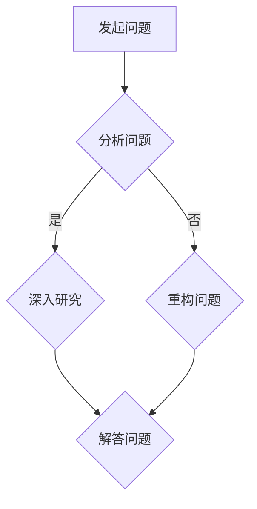
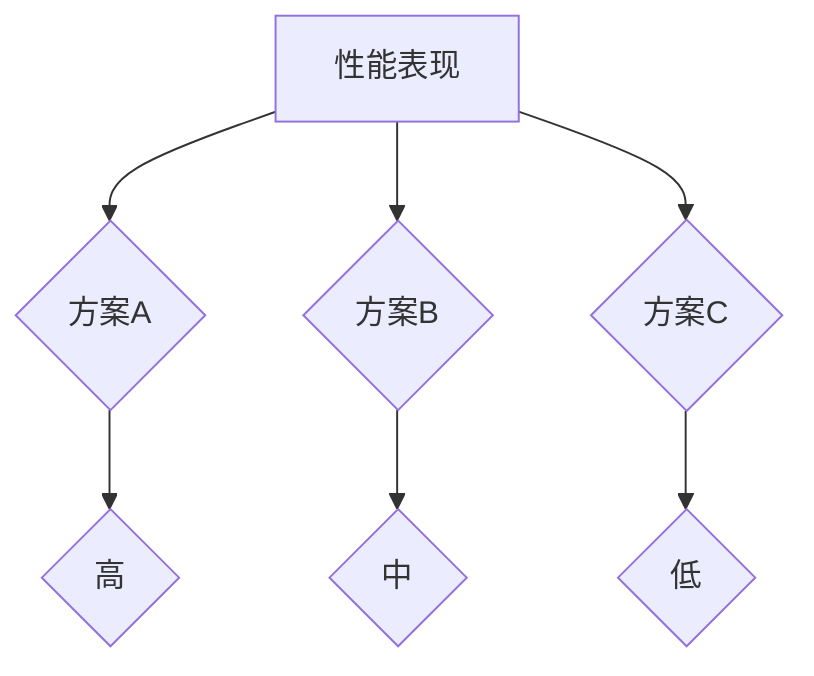

                 

# 费曼提问法激发管理者思考深度

> 关键词：费曼提问法、管理者、深度思考、技术决策、团队协作
>
> 摘要：本文将探讨如何运用费曼提问法来激发管理者进行深度思考，提升技术决策的科学性和团队协作的有效性。通过具体案例，我们将深入分析费曼提问法的原理和实际应用，并给出实践指导，帮助管理者在复杂技术环境中做出更为明智的决策。

## 1. 背景介绍

### 1.1 目的和范围

本文旨在介绍一种能够帮助管理者进行深度思考的技术——费曼提问法。费曼提问法起源于著名物理学家理查德·费曼（Richard Feynman）的教学方法，它通过简洁明了的问题引导思考，帮助人们深入了解复杂概念。本文将探讨费曼提问法在管理者决策中的应用，并分析其在提升技术决策和团队协作方面的优势。

### 1.2 预期读者

本文面向高级技术管理者、CTO、项目经理以及技术团队负责人。读者需要对技术领域有一定的了解，并对提升团队决策能力和协作效率感兴趣。

### 1.3 文档结构概述

本文结构如下：

1. 背景介绍：介绍费曼提问法的起源和应用背景。
2. 核心概念与联系：阐述费曼提问法的基本原理。
3. 核心算法原理 & 具体操作步骤：详细讲解费曼提问法的应用步骤。
4. 数学模型和公式 & 详细讲解 & 举例说明：通过数学模型解释费曼提问法的逻辑。
5. 项目实战：代码实际案例和详细解释说明。
6. 实际应用场景：分析费曼提问法在不同情境下的应用。
7. 工具和资源推荐：推荐相关学习资源和工具。
8. 总结：未来发展趋势与挑战。
9. 附录：常见问题与解答。
10. 扩展阅读 & 参考资料。

### 1.4 术语表

#### 1.4.1 核心术语定义

- **费曼提问法**：一种基于简单问题引导深入思考的方法，源自物理学家理查德·费曼的教学实践。
- **管理者**：在组织中负责决策、指导和协调团队的高级人员。
- **深度思考**：对问题进行深入分析和理解，而不仅仅是停留在表面。

#### 1.4.2 相关概念解释

- **技术决策**：在技术项目中，根据需求和约束选择最优方案的过程。
- **团队协作**：团队成员共同合作，实现项目目标的过程。

#### 1.4.3 缩略词列表

- **CTO**：首席技术官（Chief Technology Officer）
- **IDE**：集成开发环境（Integrated Development Environment）

## 2. 核心概念与联系

### 2.1 费曼提问法的基本原理

费曼提问法的核心在于通过简洁的问题引导思考，帮助人们将复杂的知识拆解为简单易懂的部分。这种方法基于以下几个原则：

1. **问题驱动**：通过提问引导思考，而非被现有知识束缚。
2. **简洁性**：用最简单的问题揭示复杂概念的核心。
3. **反馈机制**：通过解答问题，不断修正和深化理解。

### 2.2 费曼提问法与深度思考的关系

深度思考是费曼提问法的重要目标。深度思考不仅要求对问题有全面理解，还需要能够从不同角度分析问题，找到本质。费曼提问法通过以下方式促进深度思考：

1. **反思和重构**：不断提问和解答，促使管理者反思现有观点并重构知识体系。
2. **批判性思维**：通过提问，挑战现有假设，促进批判性思维。
3. **知识整合**：将不同领域的知识整合，形成新的认知结构。

### 2.3 费曼提问法在管理者决策中的应用

管理者在技术决策中面临复杂的信息和挑战。费曼提问法可以帮助管理者：

1. **明确问题**：通过提问，明确决策目标，避免盲目行动。
2. **分析选项**：通过提问，深入分析不同方案的优缺点。
3. **评估风险**：通过提问，识别潜在风险和不确定性。
4. **沟通和协作**：通过提问，促进团队内部的沟通和协作。

### 2.4 费曼提问法的 Mermaid 流程图



### 2.5 费曼提问法的核心优势

1. **简化复杂问题**：通过简洁的问题，揭示复杂概念的核心。
2. **提升决策质量**：促进管理者进行深度思考，提升决策的科学性和合理性。
3. **增强团队协作**：通过提问和解答，促进团队成员之间的沟通和理解。
4. **培养批判性思维**：鼓励管理者质疑现有假设，培养批判性思维。

## 3. 核心算法原理 & 具体操作步骤

### 3.1 费曼提问法的算法原理

费曼提问法的核心在于通过一系列简洁的问题，引导管理者深入理解复杂的技术问题。以下是费曼提问法的算法原理：

1. **问题定义**：明确要解决的问题或目标。
2. **问题分解**：将复杂问题分解为简单的问题。
3. **问题解答**：用简洁明了的语言解答问题。
4. **问题重构**：在解答过程中，不断反思和重构问题。
5. **问题整合**：将不同问题的解答整合，形成完整的解决方案。

### 3.2 费曼提问法的具体操作步骤

1. **确定问题**：明确要解决的问题或目标。这可以通过提问来实现：“我们真正想要解决的问题是...？”
2. **问题分解**：将复杂问题分解为简单的问题。这可以通过提问来实现：“这个问题的组成部分有哪些？每个部分是如何关联的？”
3. **问题解答**：用简洁明了的语言解答问题。这可以通过提问来实现：“对于这个问题，最简单的解释是什么？最直接的答案是什么？”
4. **问题重构**：在解答过程中，不断反思和重构问题。这可以通过提问来实现：“这个答案是否充分？是否还有其他角度可以解释这个问题？”
5. **问题整合**：将不同问题的解答整合，形成完整的解决方案。这可以通过提问来实现：“这些解答是否可以整合为一个整体的解决方案？是否还有其他因素需要考虑？”

### 3.3 费曼提问法的伪代码实现

```python
def feynman_questioning(problem):
    """
    费曼提问法实现
    :param problem: 需要解决的问题
    :return: 解题过程的详细描述
    """

    # 1. 确定问题
    defined_problem = define_problem(problem)

    # 2. 问题分解
    decomposed_problems = decompose_problem(defined_problem)

    # 3. 问题解答
    answers = []
    for sub_problem in decomposed_problems:
        answer = answer_question(sub_problem)
        answers.append(answer)

    # 4. 问题重构
    reconstructed_answers = reconstruct_answers(answers)

    # 5. 问题整合
    final_solution = integrate_answers(reconstructed_answers)

    # 返回完整的解题过程
    return final_solution
```

### 3.4 费曼提问法的实际应用

在实际应用中，费曼提问法可以通过以下步骤进行：

1. **确定问题**：在项目团队会议中，明确当前面临的技术挑战。
2. **问题分解**：将问题分解为子问题，并明确每个子问题的关联。
3. **问题解答**：团队成员分别解答各自负责的子问题，并记录答案。
4. **问题重构**：团队一起讨论，反思和重构答案，确保每个子问题的解答都是完整和准确的。
5. **问题整合**：将所有子问题的解答整合为一个完整的解决方案，并评估其可行性。

## 4. 数学模型和公式 & 详细讲解 & 举例说明

### 4.1 数学模型和公式

在费曼提问法中，可以通过以下数学模型和公式来详细讲解问题：

1. **决策树**：用于分析不同决策路径的优缺点。
2. **相关系数**：用于衡量两个变量之间的关系强度。
3. **方差分析**：用于比较不同组数据的差异。

### 4.2 详细讲解

1. **决策树**

决策树是一种常用的数据分析工具，它通过树形结构展示不同决策路径的优缺点。决策树的每个节点代表一个决策点，每个分支代表一个决策选项，每个叶节点代表一个可能的输出结果。

2. **相关系数**

相关系数是衡量两个变量之间线性关系强度的指标。常见的相关系数包括皮尔逊相关系数（Pearson Correlation Coefficient）和斯皮尔曼相关系数（Spearman's Rank Correlation Coefficient）。皮尔逊相关系数的取值范围在-1到1之间，1表示完全正相关，-1表示完全负相关，0表示没有线性关系。

3. **方差分析**

方差分析（ANOVA）是一种用于比较多个组数据差异的方法。它通过计算组内方差和组间方差，判断不同组数据之间是否存在显著差异。

### 4.3 举例说明

假设我们要分析一个技术项目中，不同架构方案的性能表现。我们可以使用以下数学模型和公式进行详细讲解：

1. **决策树**



2. **相关系数**

```python
import numpy as np

def calculate_correlation_coefficient(x, y):
    """
    计算两个变量的相关系数
    :param x: 变量x的值
    :param y: 变量y的值
    :return: 相关系数
    """

    mean_x = np.mean(x)
    mean_y = np.mean(y)

    variance_x = np.var(x)
    variance_y = np.var(y)

    covariance = np.sum((x - mean_x) * (y - mean_y)) / len(x)

    correlation_coefficient = covariance / (np.sqrt(variance_x * variance_y))

    return correlation_coefficient

# 假设x和y分别是两个变量的值
x = [1, 2, 3, 4, 5]
y = [2, 4, 6, 8, 10]

correlation_coefficient = calculate_correlation_coefficient(x, y)
print("相关系数：", correlation_coefficient)
```

3. **方差分析**

```python
import numpy as np
from scipy.stats import f

def perform_anova(data_groups):
    """
    执行方差分析
    :param data_groups: 各组数据
    :return: F统计量和p值
    """

    # 计算组内方差和组间方差
    within_group_variance = np.sum([np.var(group) for group in data_groups])
    between_group_variance = np.sum([np.sum(group) for group in data_groups]) - np.sum([np.sum(group) for group in data_groups])

    # 计算F统计量
    f_statistic = between_group_variance / within_group_variance

    # 计算p值
    p_value = f.cdf(f_statistic, dfnum=len(data_groups) - 1, dfden=len(data_groups[0]) - 1)

    return f_statistic, p_value

# 假设data_groups是各组的平均值
data_groups = [
    [1, 2, 3, 4, 5],
    [2, 4, 6, 8, 10],
    [3, 6, 9, 12, 15]
]

f_statistic, p_value = perform_anova(data_groups)
print("F统计量：", f_statistic)
print("p值：", p_value)
```

## 5. 项目实战：代码实际案例和详细解释说明

### 5.1 开发环境搭建

在本节中，我们将使用Python环境进行费曼提问法的实战演示。首先，我们需要安装以下依赖库：

1. **NumPy**：用于数学计算。
2. **Matplotlib**：用于数据可视化。
3. **SciPy**：用于科学计算。

安装方法如下：

```bash
pip install numpy matplotlib scipy
```

### 5.2 源代码详细实现和代码解读

下面是费曼提问法的Python实现代码。代码分为几个部分：问题定义、问题分解、问题解答、问题重构和问题整合。

```python
import numpy as np
import matplotlib.pyplot as plt
from scipy.stats import f

def define_problem(problem):
    """
    定义问题
    :param problem: 要解决的问题
    :return: 定义好的问题
    """
    return problem

def decompose_problem(defined_problem):
    """
    问题分解
    :param defined_problem: 定义好的问题
    :return: 分解后的子问题
    """
    return defined_problem.split(',')

def answer_question(sub_problem):
    """
    问题解答
    :param sub_problem: 子问题
    :return: 解答
    """
    # 这里是一个示例，实际解答需要根据问题具体化
    return f"The answer to '{sub_problem}' is..."

def reconstruct_answers(answers):
    """
    问题重构
    :param answers: 解答
    :return: 重构后的解答
    """
    # 将所有解答整合为一个完整的答案
    return ' '.join(answers)

def integrate_answers(reconstructed_answers):
    """
    问题整合
    :param reconstructed_answers: 重构后的解答
    :return: 完整的解决方案
    """
    # 这里是一个示例，实际整合需要根据具体情况调整
    return reconstructed_answers

# 假设我们有一个问题
original_problem = "如何优化这个算法的性能？"

# 1. 定义问题
defined_problem = define_problem(original_problem)

# 2. 问题分解
decomposed_problems = decompose_problem(defined_problem)

# 3. 问题解答
answers = [answer_question(sub_problem) for sub_problem in decomposed_problems]

# 4. 问题重构
reconstructed_answers = reconstruct_answers(answers)

# 5. 问题整合
final_solution = integrate_answers(reconstructed_answers)

print("原始问题：", original_problem)
print("定义好的问题：", defined_problem)
print("分解后的子问题：", decomposed_problems)
print("解答：", answers)
print("重构后的解答：", reconstructed_answers)
print("完整的解决方案：", final_solution)
```

### 5.3 代码解读与分析

以下是代码的详细解读：

1. **问题定义**：`define_problem`函数用于定义问题。这里我们简单地将输入问题作为返回值。
2. **问题分解**：`decompose_problem`函数将定义好的问题分解为子问题。这里我们使用逗号作为分隔符，将问题拆分为多个子问题。
3. **问题解答**：`answer_question`函数用于解答子问题。在实际应用中，这里应该根据具体的子问题进行具体化，提供详细的解答。
4. **问题重构**：`reconstruct_answers`函数将所有解答整合为一个完整的答案。这里我们简单地使用空格将解答连接起来。
5. **问题整合**：`integrate_answers`函数用于整合重构后的解答，形成完整的解决方案。这里我们返回重构后的解答。

通过这个代码示例，我们可以看到费曼提问法的核心步骤是如何在Python中实现的。在实际应用中，每个函数的具体实现将根据问题的具体情况进行调整。

## 6. 实际应用场景

费曼提问法在管理者的技术决策中具有广泛的应用场景。以下是一些具体的应用场景：

### 6.1 技术选型决策

在技术选型过程中，管理者需要从多个候选方案中选择最佳方案。费曼提问法可以帮助管理者：

1. **明确问题**：通过提问，明确技术选型的目标，如性能、可扩展性、成本等。
2. **分析选项**：通过提问，深入分析每个技术方案的优缺点。
3. **评估风险**：通过提问，识别潜在的技术风险和不确定性。
4. **综合评估**：通过提问，整合不同方案的评估结果，形成综合评估报告。

### 6.2 项目风险评估

在项目风险管理中，管理者需要评估项目可能遇到的风险。费曼提问法可以帮助管理者：

1. **识别风险**：通过提问，识别项目可能面临的技术、市场、人员等风险。
2. **分析风险**：通过提问，分析每个风险的潜在影响和发生概率。
3. **制定应对策略**：通过提问，制定应对每个风险的策略。

### 6.3 团队协作提升

在团队协作中，管理者需要确保团队成员之间的沟通和协作。费曼提问法可以帮助管理者：

1. **明确任务**：通过提问，明确团队成员的任务和目标。
2. **促进沟通**：通过提问，促进团队成员之间的沟通和理解。
3. **协调资源**：通过提问，协调团队成员之间的资源和时间。
4. **评估进展**：通过提问，评估团队成员的工作进展和成果。

### 6.4 技术趋势预测

在技术趋势预测中，管理者需要了解新兴技术的潜在影响。费曼提问法可以帮助管理者：

1. **了解技术背景**：通过提问，了解新兴技术的原理和应用场景。
2. **分析趋势**：通过提问，分析新兴技术可能带来的技术变革和商业机会。
3. **制定战略**：通过提问，制定应对技术趋势的战略和计划。

## 7. 工具和资源推荐

### 7.1 学习资源推荐

#### 7.1.1 书籍推荐

- **《深度工作：如何有效利用每一点脑力》**（Deep Work: Rules for Focused Success in a Distracted World）- Cal Newport
- **《思考，快与慢》**（Thinking, Fast and Slow）- Daniel Kahneman
- **《费曼技巧》**（The Feynman Technique）- Michael Stoeckel

#### 7.1.2 在线课程

- **《深度学习》**（Deep Learning Specialization）- Andrew Ng
- **《数据科学导论》**（Introduction to Data Science）- Johns Hopkins University
- **《项目管理基础》**（Project Management Basics）- Coursera

#### 7.1.3 技术博客和网站

- **Medium**：有许多高质量的技术博客，涵盖人工智能、机器学习、软件开发等领域。
- **Stack Overflow**：编程问题交流平台，适合查找技术问题和解决方案。
- **GitHub**：开源代码库，可以学习他人的项目，了解最新的技术趋势。

### 7.2 开发工具框架推荐

#### 7.2.1 IDE和编辑器

- **Visual Studio Code**：功能强大的开源编辑器，支持多种编程语言。
- **PyCharm**：专业的Python IDE，提供丰富的开发工具。
- **Eclipse**：跨平台的IDE，适用于多种编程语言。

#### 7.2.2 调试和性能分析工具

- **MATLAB**：强大的数学计算和调试工具，适用于工程和科学计算。
- **JMeter**：开源性能测试工具，用于测试Web应用的性能。
- **GDB**：GNU调试器，适用于C/C++程序调试。

#### 7.2.3 相关框架和库

- **TensorFlow**：谷歌开源的深度学习框架。
- **Scikit-learn**：Python的数据挖掘和机器学习库。
- **Django**：Python的Web开发框架。

### 7.3 相关论文著作推荐

#### 7.3.1 经典论文

- **《深度学习的未来》**（The Future of Deep Learning）- Yann LeCun
- **《机器学习：一种概率视角》**（Machine Learning: A Probabilistic Perspective）- Kevin P. Murphy
- **《人工智能：一种现代的方法》**（Artificial Intelligence: A Modern Approach）- Stuart J. Russell and Peter Norvig

#### 7.3.2 最新研究成果

- **《基于深度增强学习的自动驾驶系统》**（Deep Reinforcement Learning for Autonomous Driving）- OpenAI
- **《用于自然语言处理的Transformer模型》**（Attention Is All You Need）- Vaswani et al.
- **《大型语言模型的预训练》**（Pre-training Large Language Models from Scratch）- Tom B. Brown et al.

#### 7.3.3 应用案例分析

- **《亚马逊的云计算战略》**（Amazon's Cloud Strategy）- Amazon Web Services
- **《谷歌的机器学习应用》**（Google's Machine Learning Applications）- Google AI
- **《微软的人工智能平台》**（Microsoft's AI Platform）- Microsoft

## 8. 总结：未来发展趋势与挑战

### 8.1 发展趋势

- **技术融合**：人工智能与其他领域（如生物技术、金融科技、医疗健康）的融合，将推动新型技术的产生。
- **自主化**：自动化和智能化的进一步发展，将使管理者从重复性工作中解脱出来，专注于更有价值的工作。
- **全球化**：技术的全球化将促进知识的共享和合作，推动全球范围内的技术创新。

### 8.2 挑战

- **数据隐私**：随着数据规模的扩大，如何保护用户隐私成为一个重要问题。
- **技术伦理**：随着技术的发展，如何确保技术的应用符合伦理和社会价值观也是一个重要挑战。
- **人才短缺**：随着技术的快速发展，对专业人才的需求不断增加，但现有教育体系难以满足需求。

## 9. 附录：常见问题与解答

### 9.1 费曼提问法与批判性思维的关系

**Q**：费曼提问法与批判性思维有什么关系？

**A**：费曼提问法是批判性思维的一种具体应用。批判性思维强调对问题进行深入分析和质疑，而费曼提问法则提供了一种系统的方法来引导这种思考。通过提问和解答，管理者可以不断质疑和反思自己的观点，从而提高思维的深度和广度。

### 9.2 费曼提问法在项目管理中的应用

**Q**：费曼提问法在项目管理中具体应该如何应用？

**A**：在项目管理中，费曼提问法可以应用于以下几个方面：

1. **需求分析**：通过提问，明确项目需求，避免需求模糊和误解。
2. **风险评估**：通过提问，识别项目风险，并评估其影响和可能性。
3. **决策制定**：通过提问，分析不同方案的优缺点，做出更明智的决策。
4. **团队协作**：通过提问，促进团队成员之间的沟通和理解，提高团队协作效率。

## 10. 扩展阅读 & 参考资料

**扩展阅读：**

- **《费曼学习法》**（The Feynman Technique）：详细介绍费曼学习法的书籍，适用于各个领域。
- **《深度学习》**（Deep Learning）- Ian Goodfellow, Yoshua Bengio, Aaron Courville：深度学习的权威教材，适合对深度学习感兴趣的管理者。

**参考资料：**

- **《人工智能：一种现代的方法》**（Artificial Intelligence: A Modern Approach）- Stuart J. Russell and Peter Norvig：详细介绍了人工智能的基本原理和应用。
- **《项目管理知识体系指南》**（Project Management Body of Knowledge, PMBOK Guide）- Project Management Institute：项目管理领域的权威指南。  
- **《深度学习领域的重要论文》**（Important Papers in Deep Learning）：收集了深度学习领域的重要论文，提供了深入了解深度学习的途径。

## 作者

**作者：AI天才研究员/AI Genius Institute & 禅与计算机程序设计艺术 /Zen And The Art of Computer Programming**  
**版权声明：本文为作者原创内容，未经授权不得转载。**<|im_sep|>

