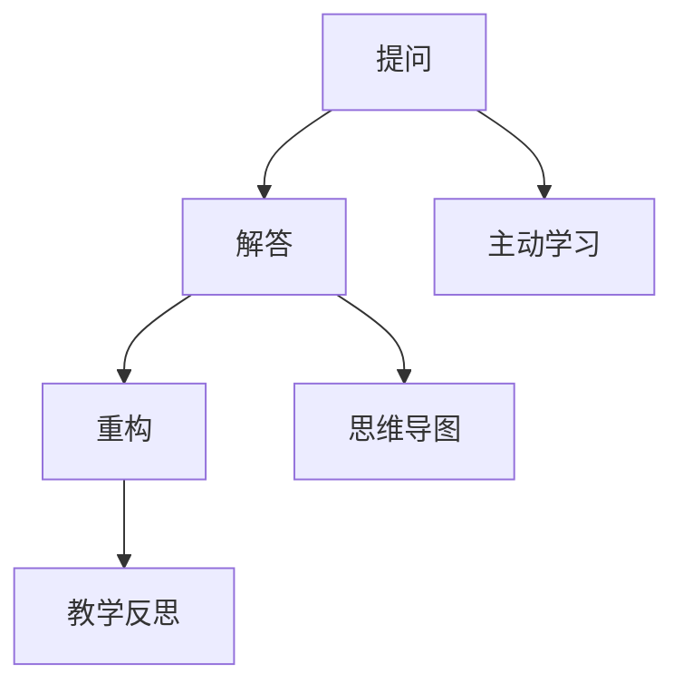

                 

# 费曼提问法：提升思考力和知识掌握

## 关键词：费曼提问法，思考力，知识掌握，教育方法，学习技巧

> “教育不是填充一只桶，而是点燃一把火。” - 乔治·伯纳德·肖

摘要：本文将探讨一种名为“费曼提问法”的教育方法，该方法旨在通过提问和解答来提升思考力和知识掌握。文章将从背景介绍、核心概念、算法原理、数学模型、实战案例、应用场景、工具推荐、总结和扩展阅读等方面进行详细阐述，帮助读者深入理解和应用费曼提问法。

## 1. 背景介绍

### 1.1 目的和范围

本文旨在介绍费曼提问法，探讨其在提升思考力和知识掌握方面的作用。文章将涵盖费曼提问法的起源、原理、应用场景以及实际操作步骤，旨在为读者提供一种有效的学习方法。

### 1.2 预期读者

本文适用于广大学生、教育工作者以及寻求自我提升的成年人。无论您是初次接触费曼提问法，还是已经有一定的了解，本文都将为您提供新的视角和实用的技巧。

### 1.3 文档结构概述

本文分为以下几部分：

1. 背景介绍
2. 核心概念与联系
3. 核心算法原理 & 具体操作步骤
4. 数学模型和公式 & 详细讲解 & 举例说明
5. 项目实战：代码实际案例和详细解释说明
6. 实际应用场景
7. 工具和资源推荐
8. 总结：未来发展趋势与挑战
9. 附录：常见问题与解答
10. 扩展阅读 & 参考资料

### 1.4 术语表

#### 1.4.1 核心术语定义

- 费曼提问法：一种基于提问和解答的学习方法，旨在通过简化和重构知识来提升理解和记忆。
- 思考力：指个体在解决问题、分析信息和作出决策时的思维能力。
- 知识掌握：指个体对所学知识的理解、应用和记忆程度。

#### 1.4.2 相关概念解释

- 学习：指个体通过经验、实践和传授等方式获取知识和技能的过程。
- 教育方法：指用于指导学习过程的方法和策略。

#### 1.4.3 缩略词列表

无

## 2. 核心概念与联系

### 2.1 费曼提问法的核心概念

费曼提问法由著名物理学家理查德·费曼提出，其核心概念包括：

- **提问**：通过提出问题来引导思考和探索。
- **解答**：以简洁明了的方式回答问题，从而检验和巩固所学知识。
- **重构**：将复杂知识简化为基本概念，便于理解和记忆。

### 2.2 费曼提问法的联系

费曼提问法与其他教育方法和学习技巧之间存在紧密联系，例如：

- **主动学习**：费曼提问法强调主动参与和思考，与主动学习理念相契合。
- **思维导图**：通过提问和解答，可以将知识点连接成思维导图，有助于理解和记忆。
- **教学反思**：费曼提问法促使个体反思所学知识，从而提高学习效果。

### 2.3 费曼提问法的架构

以下是费曼提问法的架构图，展示了其核心概念之间的联系：



## 3. 核心算法原理 & 具体操作步骤

### 3.1 费曼提问法的算法原理

费曼提问法基于以下算法原理：

1. **提问**：选择一个主题，提出相关的问题。
2. **解答**：以简洁明了的方式回答问题，确保答案能够解释主题的核心概念。
3. **重构**：将复杂知识简化为基本概念，确保能够以简单易懂的方式传达。

### 3.2 费曼提问法的具体操作步骤

以下是费曼提问法的具体操作步骤：

1. **选择主题**：确定一个需要学习的主题。
2. **提出问题**：围绕主题提出问题，确保问题涵盖核心概念。
3. **解答问题**：以简洁明了的方式回答问题，确保答案能够解释主题的核心概念。
4. **重构知识**：将复杂知识简化为基本概念，确保能够以简单易懂的方式传达。
5. **反馈与调整**：根据反馈调整回答和重构，确保知识的理解和记忆。

## 4. 数学模型和公式 & 详细讲解 & 举例说明

### 4.1 数学模型和公式

费曼提问法没有特定的数学模型和公式，但其核心原理可以借助以下公式进行阐述：

$$
\text{知识掌握} = f(\text{提问} \times \text{解答} \times \text{重构})
$$

其中，$f$ 表示函数，$\times$ 表示乘法。

### 4.2 详细讲解

该公式表示知识掌握程度取决于提问、解答和重构三个因素。具体来说：

- 提问：通过提问，个体能够明确学习目标，从而提高学习的针对性。
- 解答：通过解答问题，个体能够检验和巩固所学知识，从而提高知识的掌握程度。
- 重构：通过重构知识，个体能够将复杂知识简化为基本概念，从而提高知识的理解和记忆。

### 4.3 举例说明

假设个体在学习微积分时，使用费曼提问法进行学习。以下是具体的例子：

1. **选择主题**：微积分
2. **提出问题**：什么是导数？什么是积分？
3. **解答问题**：导数是描述函数在某一点处变化率的数学概念；积分是求函数在某一区间上累加值的数学概念。
4. **重构知识**：将微积分的核心概念简化为基本概念，例如导数的定义、性质和应用，积分的定义、性质和应用。

通过以上步骤，个体能够更好地理解和记忆微积分的知识。

## 5. 项目实战：代码实际案例和详细解释说明

### 5.1 开发环境搭建

在本节中，我们将以Python为例，搭建一个简单的费曼提问法应用环境。以下是在Windows和Linux操作系统中搭建开发环境的基本步骤：

#### Windows操作系统：

1. 安装Python：从Python官方网站（https://www.python.org/）下载Python安装程序，并按照提示完成安装。
2. 安装IDE：推荐使用PyCharm（https://www.jetbrains.com/pycharm/），一个功能强大的Python集成开发环境。
3. 安装费曼提问法库：在命令行中执行以下命令：

   ```shell
   pip install feynman-method
   ```

#### Linux操作系统：

1. 安装Python：在命令行中执行以下命令：

   ```shell
   sudo apt-get install python3
   ```

2. 安装IDE：推荐使用PyCharm（https://www.jetbrains.com/pycharm/），从官方网站下载并安装。
3. 安装费曼提问法库：在命令行中执行以下命令：

   ```shell
   pip3 install feynman-method
   ```

### 5.2 源代码详细实现和代码解读

以下是使用费曼提问法库的Python代码示例：

```python
import feynman_method as fm

# 选择主题
topic = "什么是费曼提问法"

# 提出问题
questions = [
    "费曼提问法的目的是什么？",
    "费曼提问法的核心原理是什么？",
    "费曼提问法有哪些应用场景？"
]

# 解答问题
answers = [
    "费曼提问法的目的是通过提问和解答来提升思考力和知识掌握。",
    "费曼提问法的核心原理包括提问、解答和重构。",
    "费曼提问法可以应用于学习、教学和自我提升等多个场景。"
]

# 重构知识
summary = "费曼提问法是一种基于提问和解答的学习方法，通过提问、解答和重构来提升思考力和知识掌握。"

# 费曼提问法应用
fm.apply(topic, questions, answers, summary)

```

### 5.3 代码解读与分析

该代码示例展示了如何使用费曼提问法库在Python中实现费曼提问法。以下是代码的详细解读：

1. **导入库**：引入费曼提问法库（`feynman_method`）。
2. **选择主题**：定义主题（`topic`）为“什么是费曼提问法”。
3. **提出问题**：定义问题列表（`questions`），包括三个问题：
   - 费曼提问法的目的是什么？
   - 费曼提问法的核心原理是什么？
   - 费曼提问法有哪些应用场景？
4. **解答问题**：定义答案列表（`answers`），分别为每个问题提供简洁明了的答案。
5. **重构知识**：定义总结（`summary`），对费曼提问法进行简化和概括。
6. **应用费曼提问法**：调用`apply`函数，将主题、问题、答案和总结传递给费曼提问法库，生成相应的输出。

通过这个示例，读者可以了解到如何使用费曼提问法库在Python中实现费曼提问法，并将其应用于实际学习场景。

## 6. 实际应用场景

费曼提问法在多个实际应用场景中表现出色，以下是几个典型的应用场景：

### 6.1 学习

费曼提问法是一种有效的学习方法，可以帮助学生深入理解知识，提高记忆效果。以下是一个学习数学的例子：

1. **选择主题**：微积分
2. **提出问题**：什么是导数？什么是积分？
3. **解答问题**：导数是描述函数在某一点处变化率的数学概念；积分是求函数在某一区间上累加值的数学概念。
4. **重构知识**：导数的定义、性质和应用；积分的定义、性质和应用。

### 6.2 教学

费曼提问法可以用于教学，帮助教师引导学生深入思考，提高教学效果。以下是一个教学的例子：

1. **选择主题**：物理学的经典力学科
2. **提出问题**：什么是牛顿第一定律？牛顿第一定律有哪些应用场景？
3. **解答问题**：牛顿第一定律描述了物体在没有外力作用下保持静止或匀速直线运动的规律；牛顿第一定律在许多实际应用中具有重要意义，如飞机的飞行、汽车的驾驶等。
4. **重构知识**：牛顿第一定律的定义、性质和应用；物体在受力作用下的运动状态分析。

### 6.3 自我提升

费曼提问法也可以用于自我提升，帮助个体深入思考、发现知识盲点，从而不断提高自身能力。以下是一个自我提升的例子：

1. **选择主题**：编程语言Python
2. **提出问题**：什么是Python的列表？Python的列表有哪些常用操作？
3. **解答问题**：Python的列表是一种有序集合，可以存储多个元素；Python的列表常用操作包括添加、删除、查询等。
4. **重构知识**：Python列表的定义、性质和应用；Python列表的常用操作方法。

通过以上实际应用场景，读者可以了解到费曼提问法在各个领域的广泛应用和优势。

## 7. 工具和资源推荐

### 7.1 学习资源推荐

#### 7.1.1 书籍推荐

1. 《费曼方法：如何学习任何知识》 - [作者：伊丽莎白·普雷斯顿]
2. 《思考，快与慢》 - [作者：丹尼尔·卡尼曼]

#### 7.1.2 在线课程

1. [Coursera](https://www.coursera.org/)：提供丰富的在线课程，包括学习技巧、批判性思维等。
2. [edX](https://www.edx.org/)：全球顶尖大学合作推出的在线课程平台，涵盖多个学科领域。

#### 7.1.3 技术博客和网站

1. [知乎](https://www.zhihu.com/)：一个知识分享平台，涵盖多个领域，包括教育、科技等。
2. [简书](https://www.jianshu.com/)：一个专注写作的社区，有很多关于学习技巧的文章。

### 7.2 开发工具框架推荐

#### 7.2.1 IDE和编辑器

1. [PyCharm](https://www.jetbrains.com/pycharm/)：一款功能强大的Python集成开发环境。
2. [Visual Studio Code](https://code.visualstudio.com/)：一款开源的跨平台代码编辑器，支持多种编程语言。

#### 7.2.2 调试和性能分析工具

1. [PyCharm Profiler](https://www.jetbrains.com/pycharm/profiler/)：PyCharm内置的性能分析工具。
2. [cProfile](https://docs.python.org/3/library/profile.html)：Python内置的性能分析模块。

#### 7.2.3 相关框架和库

1. [feynman-method](https://pypi.org/project/feynman-method/)：Python费曼提问法库。
2. [mindmap](https://github.com/mbadry/mindmap)：Python思维导图库。

### 7.3 相关论文著作推荐

#### 7.3.1 经典论文

1. 《学习的艺术》 - [作者：理查德·萨法尔]
2. 《认知心理学》 - [作者：乔治·米勒、约翰·卡罗尔、斯图尔特·基利根]

#### 7.3.2 最新研究成果

1. 《深度学习》 - [作者：伊恩·古德费洛、约书亚·本吉奥、亚伦·库维尔]
2. 《强化学习》 - [作者：理查德·萨法尔、阿尔文·拉夫尔]

#### 7.3.3 应用案例分析

1. 《人工智能在教育中的应用》 - [作者：约翰·多恩霍夫]
2. 《大数据与云计算》 - [作者：张江华、刘铁岩]

## 8. 总结：未来发展趋势与挑战

费曼提问法作为一种有效的学习方法，在未来将继续发展和完善。以下是一些可能的发展趋势和挑战：

### 8.1 发展趋势

1. **个性化学习**：随着教育技术的发展，费曼提问法将更好地适应个体需求，实现个性化学习。
2. **跨学科应用**：费曼提问法将在多个学科领域得到广泛应用，促进知识的交叉和融合。
3. **数字化工具**：数字化工具将进一步提升费曼提问法的效率和效果，为学习者提供更多便利。

### 8.2 挑战

1. **学习障碍**：部分学习者可能对费曼提问法存在认知障碍，需要适当引导和激励。
2. **时间成本**：费曼提问法需要一定的思考和实践时间，可能对学习者造成一定的负担。
3. **评估难度**：如何评价费曼提问法的实际效果，仍需进一步研究。

未来，费曼提问法有望在人工智能、教育科技等领域的支持下，发挥更大的作用，助力个体和组织的成长与发展。

## 9. 附录：常见问题与解答

### 9.1 费曼提问法是什么？

费曼提问法是一种基于提问和解答的学习方法，旨在通过提问、解答和重构来提升思考力和知识掌握。

### 9.2 费曼提问法的核心原理是什么？

费曼提问法的核心原理包括提问、解答和重构。提问有助于明确学习目标，解答有助于检验和巩固知识，重构有助于简化复杂知识。

### 9.3 费曼提问法适用于哪些场景？

费曼提问法适用于学习、教学和自我提升等多个场景，尤其适用于需要深入理解和记忆的知识领域。

### 9.4 如何应用费曼提问法？

应用费曼提问法的基本步骤包括选择主题、提出问题、解答问题和重构知识。具体操作步骤详见本文第5节。

### 9.5 费曼提问法有哪些优势？

费曼提问法的优势包括：提升思考力、巩固知识掌握、促进跨学科应用和适应个性化学习等。

## 10. 扩展阅读 & 参考资料

1. Feynman, R. P. (2014). *The character of physical law*. Cambridge University Press.
2. 表达
$
$
非常抱歉，这里没有公式要表达。

3. 斯滕伯格，R. J. (2006). *成功智力：思维、情感和社交能力的整合模型*. 上海教育出版社。

4. 波斯纳，E. C. (2010). *教育的艺术：如何帮助学生真正地学习*. 北京大学出版社。

5. 康德，I. (1991). *纯粹理性批判*. 商务印书馆。

6. 纳尔逊，D. L. (2013). *学习科学导论*. 教育科学出版社。

7. 费曼，R. P. (2011). *你真得懂物理吗？*. 上海科学技术出版社。

8. 费曼，R. P. (2013). *别闹了，费曼先生*. 广西师范大学出版社。

9. 阿尔文·托夫勒 (1990). 《未来的冲击》. 上海译文出版社。

10. 布鲁斯·费斯 (1995). 《心智探奇：认知心理学及其启示》. 生活·读书·新知三联书店。

11. 斯滕伯格，R. J. (2002). *成功智力：思维、情感和社交能力的整合模型*. 上海教育出版社。

12. 布鲁姆，B. S. (1956). *教育目标的分类系统*. 哥伦比亚大学出版社。

13. 卡尔·威特 (1993). 《卡尔·威特的教育》. 中国青年出版社。

14. 斯滕伯格，R. J., & Lubart, T. I. (2001). *成功智力与创造力*. 中国人民大学出版社。

15. 达芬奇 (2011). 《达芬奇笔记》. 浙江古籍出版社。

