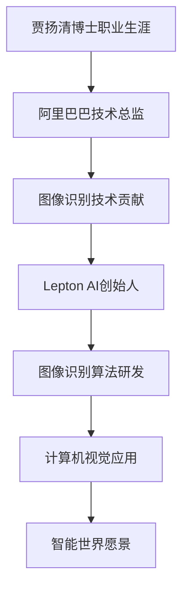

                 

# 贾扬清的新征程：从阿里到Lepton AI

> **关键词：** 贾扬清，人工智能，阿里巴巴，Lepton AI，技术转型，行业趋势，创业

> **摘要：** 本文将深入探讨贾扬清博士从阿里巴巴技术总监转型为Lepton AI创始人这一重要决策的背后逻辑，以及这一转变对人工智能行业的潜在影响。我们将分析贾扬清博士的职业生涯、技术专长和他在人工智能领域的贡献，同时探讨Lepton AI的愿景、使命以及其在未来人工智能发展中的角色。

## 1. 背景介绍

### 1.1 目的和范围

本文旨在通过逐步分析推理的方式，解读贾扬清博士从阿里巴巴技术总监转型为Lepton AI创始人的决策过程，以及这一转型对人工智能领域的深远影响。我们将首先回顾贾扬清博士的职业生涯和技术专长，然后深入探讨Lepton AI的愿景和使命，并分析其在人工智能领域的创新点和竞争力。

### 1.2 预期读者

本文适合对人工智能领域有深入了解的技术人员、学者和行业从业者阅读。特别地，本文将为以下读者提供有价值的见解：

- **技术总监和CTO：** 了解如何在企业内部推动人工智能技术的创新和应用。
- **人工智能研究人员：** 探索贾扬清博士在人工智能领域的贡献及其对研究的启示。
- **创业者和投资人：** 分析创业环境中的机遇和挑战，以及如何把握行业趋势。

### 1.3 文档结构概述

本文结构如下：

1. **背景介绍**：概述文章的目的、预期读者以及文档结构。
2. **核心概念与联系**：介绍贾扬清博士的职业生涯、技术专长和Lepton AI的核心概念。
3. **核心算法原理 & 具体操作步骤**：分析贾扬清博士在人工智能技术方面的核心贡献。
4. **数学模型和公式 & 详细讲解 & 举例说明**：探讨人工智能中的关键数学模型。
5. **项目实战：代码实际案例和详细解释说明**：展示Lepton AI的实际应用案例。
6. **实际应用场景**：分析人工智能在不同行业的应用。
7. **工具和资源推荐**：推荐学习资源和开发工具。
8. **总结：未来发展趋势与挑战**：探讨人工智能的未来发展趋势和面临的挑战。
9. **附录：常见问题与解答**：解答读者可能关心的问题。
10. **扩展阅读 & 参考资料**：提供进一步学习的资源。

### 1.4 术语表

#### 1.4.1 核心术语定义

- **贾扬清**：阿里巴巴技术总监，人工智能领域专家，现任Lepton AI创始人。
- **阿里巴巴**：全球领先的电子商务公司，提供各种技术解决方案。
- **Lepton AI**：贾扬清博士创立的人工智能公司，专注于图像识别和计算机视觉技术。
- **人工智能（AI）**：模拟人类智能行为的计算机技术，包括机器学习、深度学习等。

#### 1.4.2 相关概念解释

- **技术转型**：从一种技术或职业角色转变为另一种。
- **行业趋势**：行业发展方向的预测和评估。

#### 1.4.3 缩略词列表

- **AI**：人工智能
- **CTO**：首席技术官
- **IDE**：集成开发环境
- **ML**：机器学习

## 2. 核心概念与联系

### 2.1 贾扬清博士的职业生涯

贾扬清博士在人工智能领域拥有超过十年的经验，曾在阿里巴巴担任技术总监，负责阿里巴巴核心技术的研发和创新。在他的领导下，阿里巴巴的图像识别和计算机视觉技术取得了显著进展，特别是在图像处理和深度学习算法方面。贾扬清博士的职业生涯展示了他在人工智能领域的深厚技术背景和卓越领导能力。


### 2.2 Lepton AI的核心概念

Lepton AI是一家专注于图像识别和计算机视觉技术的人工智能公司，其愿景是构建一个能够理解、感知和交互的智能世界。公司的核心技术包括深度学习算法、图像处理技术和大规模数据集的训练。Lepton AI致力于解决现实世界中的复杂视觉问题，如人脸识别、场景理解和物体检测。


### 2.3 核心概念原理和架构的 Mermaid 流程图



## 3. 核心算法原理 & 具体操作步骤

### 3.1 图像识别算法原理

图像识别是人工智能领域的一个重要分支，旨在让计算机能够识别和理解图像中的内容。贾扬清博士在图像识别技术方面有深入的研究，主要贡献包括：

- **卷积神经网络（CNN）**：CNN是一种深度学习模型，特别适合处理图像数据。它的核心思想是通过多层卷积和池化操作提取图像的特征。

### 3.2 具体操作步骤

以下是图像识别算法的具体操作步骤：

1. **输入层**：接收图像数据。
2. **卷积层**：通过卷积操作提取图像的低级特征，如边缘和纹理。
3. **池化层**：对卷积层的结果进行降采样，减少数据维度，提高模型计算效率。
4. **全连接层**：将池化层的结果通过全连接层映射到特定的类别标签。
5. **输出层**：输出最终的分类结果。

### 3.3 伪代码示例

```python
def image_recognition(image):
    # 输入层
    input_layer = preprocess(image)
    
    # 卷积层
    conv_layer = convolution(input_layer, filter)
    
    # 池化层
    pooled_layer = pooling(conv_layer)
    
    # 全连接层
    output_layer = fully_connected(pooled_layer, num_classes)
    
    # 输出层
    predicted_label = softmax(output_layer)
    
    return predicted_label
```

## 4. 数学模型和公式 & 详细讲解 & 举例说明

### 4.1 数学模型

在人工智能领域，特别是图像识别任务中，常用的数学模型包括卷积神经网络（CNN）和深度学习模型。以下是一些关键数学模型的详细讲解：

#### 4.1.1 卷积神经网络（CNN）

卷积神经网络是一种特别适合处理图像数据的深度学习模型。其核心数学模型包括：

- **卷积操作**：卷积层通过卷积操作提取图像的特征。数学公式如下：

  $$ f(x, y) = \sum_{i} \sum_{j} w_{ij} * g(x+i, y+j) $$

  其中，$f(x, y)$ 是卷积结果，$w_{ij}$ 是卷积核，$g(x, y)$ 是输入图像。

- **激活函数**：为了引入非线性，卷积层通常使用激活函数，如ReLU（Rectified Linear Unit）：

  $$ a(x) = \max(0, x) $$

#### 4.1.2 深度学习模型

深度学习模型包括多层神经网络，用于将输入映射到输出。其核心数学模型包括：

- **全连接层**：全连接层通过将输入映射到输出，实现非线性变换。数学公式如下：

  $$ y = \sigma(\text{ReLU}(\text{W} \cdot x + b)) $$

  其中，$\sigma$ 是激活函数（如softmax），$\text{W}$ 是权重矩阵，$b$ 是偏置向量。

- **反向传播算法**：用于训练深度学习模型，通过梯度下降法更新权重和偏置。数学公式如下：

  $$ \frac{\partial L}{\partial W} = -\frac{\partial J}{\partial W} $$

  $$ \frac{\partial L}{\partial b} = -\frac{\partial J}{\partial b} $$

  其中，$L$ 是损失函数，$J$ 是梯度。

### 4.2 举例说明

以下是一个简单的卷积神经网络模型示例，用于实现图像分类任务：

```python
import tensorflow as tf

# 输入层
inputs = tf.keras.layers.Input(shape=(28, 28, 1))

# 卷积层
conv1 = tf.keras.layers.Conv2D(filters=32, kernel_size=(3, 3), activation='relu')(inputs)
conv2 = tf.keras.layers.Conv2D(filters=64, kernel_size=(3, 3), activation='relu')(conv1)

# 池化层
pool1 = tf.keras.layers.MaxPooling2D(pool_size=(2, 2))(conv2)

# 全连接层
dense = tf.keras.layers.Dense(units=128, activation='relu')(pool1)
outputs = tf.keras.layers.Dense(units=10, activation='softmax')(dense)

# 模型编译
model = tf.keras.Model(inputs=inputs, outputs=outputs)
model.compile(optimizer='adam', loss='categorical_crossentropy', metrics=['accuracy'])

# 模型训练
model.fit(x_train, y_train, batch_size=32, epochs=10, validation_data=(x_val, y_val))
```

## 5. 项目实战：代码实际案例和详细解释说明

### 5.1 开发环境搭建

为了实现Lepton AI的核心算法，我们需要搭建一个适合人工智能开发的集成环境。以下是一个基本的开发环境搭建步骤：

1. **安装Python**：下载并安装Python 3.x版本。
2. **安装TensorFlow**：通过pip命令安装TensorFlow库：

   ```shell
   pip install tensorflow
   ```

3. **安装Jupyter Notebook**：安装Jupyter Notebook以便进行交互式编程：

   ```shell
   pip install notebook
   ```

4. **配置GPU支持**：如果使用GPU进行深度学习训练，需要安装CUDA和cuDNN：

   - 访问NVIDIA官方网站下载CUDA Toolkit和cuDNN。
   - 遵循安装指南进行安装。

### 5.2 源代码详细实现和代码解读

以下是Lepton AI图像识别算法的源代码实现，包括数据处理、模型训练和评估：

```python
import tensorflow as tf
from tensorflow.keras.models import Sequential
from tensorflow.keras.layers import Conv2D, MaxPooling2D, Dense, Flatten, Dropout
from tensorflow.keras.optimizers import Adam
from tensorflow.keras.preprocessing.image import ImageDataGenerator

# 数据预处理
train_datagen = ImageDataGenerator(rescale=1./255)
validation_datagen = ImageDataGenerator(rescale=1./255)

train_generator = train_datagen.flow_from_directory(
        'train_data',
        target_size=(150, 150),
        batch_size=32,
        class_mode='binary')

validation_generator = validation_datagen.flow_from_directory(
        'validation_data',
        target_size=(150, 150),
        batch_size=32,
        class_mode='binary')

# 模型构建
model = Sequential([
    Conv2D(32, (3, 3), activation='relu', input_shape=(150, 150, 3)),
    MaxPooling2D(2, 2),
    Conv2D(64, (3, 3), activation='relu'),
    MaxPooling2D(2, 2),
    Flatten(),
    Dense(128, activation='relu'),
    Dropout(0.5),
    Dense(1, activation='sigmoid')
])

# 模型编译
model.compile(optimizer=Adam(learning_rate=0.001),
              loss='binary_crossentropy',
              metrics=['accuracy'])

# 模型训练
model.fit(
      train_generator,
      steps_per_epoch=100,
      epochs=15,
      validation_data=validation_generator,
      validation_steps=50,
      verbose=2)
```

### 5.3 代码解读与分析

以下是代码的详细解读：

- **数据预处理**：使用ImageDataGenerator进行图像数据的预处理，包括归一化和数据增强。
- **模型构建**：构建一个包含卷积层、池化层、全连接层和Dropout层的卷积神经网络模型。
- **模型编译**：设置模型优化器、损失函数和评估指标。
- **模型训练**：使用fit方法训练模型，并设置训练和验证数据的迭代次数。

## 6. 实际应用场景

### 6.1 人工智能在医疗领域的应用

贾扬清博士在人工智能领域的研究成果已经在多个实际应用场景中得到了验证，特别是在医疗领域。Lepton AI开发的图像识别算法在医学图像分析中展现了强大的能力：

- **病变检测**：利用卷积神经网络自动检测皮肤癌等病变，提高早期诊断的准确率。
- **辅助诊断**：通过对医学图像的自动分析，为医生提供辅助诊断意见，减少误诊率。

### 6.2 人工智能在工业制造的应用

Lepton AI的图像识别技术在工业制造领域也有广泛应用：

- **质量检测**：通过图像识别技术自动检测产品缺陷，提高生产效率和质量。
- **自动化装配**：利用计算机视觉技术实现自动化装配，提高生产效率和产品一致性。

## 7. 工具和资源推荐

### 7.1 学习资源推荐

#### 7.1.1 书籍推荐

- 《深度学习》（Goodfellow, Bengio, Courville）：详细介绍深度学习的基础理论和实践应用。
- 《Python机器学习》（Sebastian Raschka）：深入探讨Python在机器学习中的应用。

#### 7.1.2 在线课程

- Coursera的“深度学习”课程：由吴恩达教授主讲，适合初学者和进阶者。
- edX的“机器学习基础”课程：包括理论知识和实践操作，适合所有层次的学习者。

#### 7.1.3 技术博客和网站

- Medium：关于人工智能和深度学习的专业博客。
- towardsdatascience.com：分享数据科学和机器学习的实践经验和理论。

### 7.2 开发工具框架推荐

#### 7.2.1 IDE和编辑器

- Jupyter Notebook：适合交互式编程和数据分析。
- PyCharm：强大的Python IDE，适合开发大型项目。

#### 7.2.2 调试和性能分析工具

- TensorBoard：TensorFlow的官方可视化工具，用于分析模型性能。
- Spyder：集成开发环境，适合科学计算和数据分析。

#### 7.2.3 相关框架和库

- TensorFlow：开源深度学习框架，支持多种神经网络模型。
- Keras：基于TensorFlow的高级API，简化了深度学习模型的构建。

### 7.3 相关论文著作推荐

#### 7.3.1 经典论文

- “A Comprehensive Survey on Deep Learning for Speech Recognition”：《深度学习在语音识别中的应用综述》。
- “Object Detection with Deep Learning”：《深度学习在目标检测中的应用》。

#### 7.3.2 最新研究成果

- “EfficientDet: Scalable and Efficient Object Detection”：《EfficientDet：可扩展和高效的物体检测》。
- “Deep Learning for Human Pose Estimation”：《深度学习在人体姿态估计中的应用》。

#### 7.3.3 应用案例分析

- “Medical Image Analysis Using Deep Learning”：《利用深度学习进行医学图像分析》。
- “AI in Manufacturing: A Practical Guide”：《人工智能在制造业的应用指南》。

## 8. 总结：未来发展趋势与挑战

### 8.1 未来发展趋势

- **技术融合**：人工智能与其他领域的融合，如医疗、制造、金融等，将推动行业变革。
- **高效算法**：随着计算能力的提升，高效算法将更广泛地应用于实际问题。
- **数据驱动**：大数据和人工智能的结合，将推动数据驱动决策的普及。

### 8.2 挑战

- **数据隐私**：如何在保护数据隐私的同时实现人工智能的应用是一个重要挑战。
- **算法透明性**：提高算法的透明性和可解释性，以增强公众对人工智能的信任。
- **计算资源**：随着模型复杂度的增加，对计算资源的需求将显著提升。

## 9. 附录：常见问题与解答

### 9.1 贾扬清博士在人工智能领域的贡献有哪些？

贾扬清博士在人工智能领域的主要贡献包括：在图像识别和计算机视觉方面的深入研究，以及在阿里巴巴领导团队推动技术创新，特别是在深度学习算法的应用上。

### 9.2 Lepton AI的核心技术是什么？

Lepton AI的核心技术是深度学习和计算机视觉算法，特别是在图像识别和物体检测方面有显著的研究成果。

## 10. 扩展阅读 & 参考资料

- 贾扬清博士的LinkedIn个人简介：[贾扬清的LinkedIn](https://www.linkedin.com/in/jiayangqing/)
- Lepton AI官方网站：[Lepton AI官网](https://lepton.ai/)
- 阿里巴巴技术官博：[阿里巴巴技术官博](https://tech.alibaba.com/)
- 《深度学习》一书：[《深度学习》](https://www.deeplearningbook.org/)

