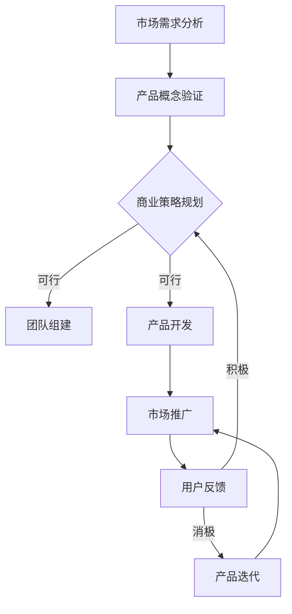

                 

# 资深程序员创立一人公司实现财富自由的计划

> **关键词：财富自由、一人公司、资深程序员、创业、技术驱动、商业策略**

> **摘要：本文将深入探讨资深程序员如何通过创业，特别是创立一人公司，实现财富自由。我们将详细分析创业的核心概念、商业策略、技术实施步骤，并提供实际案例和资源推荐，以帮助读者理解并借鉴这一过程。**

## 1. 背景介绍

### 1.1 目的和范围

本文旨在为资深程序员提供一条通过创业实现财富自由的清晰路径。文章将围绕以下几个核心问题展开讨论：

- 创业是否适合资深程序员？
- 一人公司的优势和挑战是什么？
- 如何制定有效的商业策略？
- 技术在创业中的关键角色是什么？
- 实际操作步骤和案例分析。

通过这些问题的探讨，本文希望能够为有志于创业的资深程序员提供实用的指导和借鉴。

### 1.2 预期读者

- 有志于创业的资深程序员
- 对商业策略和技术实施感兴趣的技术专家
- 想了解如何通过技术实现财富自由的创业者

### 1.3 文档结构概述

本文将分为以下章节：

- **1. 背景介绍**：介绍文章的目的、范围和结构。
- **2. 核心概念与联系**：阐述创业的核心概念和联系。
- **3. 核心算法原理 & 具体操作步骤**：详细讲解创业的关键算法和操作步骤。
- **4. 数学模型和公式 & 详细讲解 & 举例说明**：介绍创业相关的数学模型和公式，并进行详细解释。
- **5. 项目实战：代码实际案例和详细解释说明**：提供实际创业项目的代码案例和解读。
- **6. 实际应用场景**：探讨创业在不同场景下的应用。
- **7. 工具和资源推荐**：推荐学习资源和开发工具。
- **8. 总结：未来发展趋势与挑战**：总结创业的未来趋势和挑战。
- **9. 附录：常见问题与解答**：回答读者可能遇到的问题。
- **10. 扩展阅读 & 参考资料**：提供扩展阅读资料。

### 1.4 术语表

#### 1.4.1 核心术语定义

- **财富自由**：指个人或家庭通过被动收入（如投资收益、版权收入等）覆盖生活支出，无需为生计工作。
- **一人公司**：指由一名创始人独立经营的公司，无需合伙人或股东。
- **资深程序员**：在编程和技术领域有丰富经验和深厚积累的程序员。

#### 1.4.2 相关概念解释

- **商业策略**：为了实现特定商业目标而制定的一系列行动计划和决策。
- **被动收入**：不依赖于个人劳动时间就能持续获得的收入。
- **技术实施步骤**：将技术概念转化为实际产品或服务的具体操作流程。

#### 1.4.3 缩略词列表

- **AI**：人工智能（Artificial Intelligence）
- **ML**：机器学习（Machine Learning）
- **SDK**：软件开发工具包（Software Development Kit）

## 2. 核心概念与联系

为了更好地理解创业过程，我们需要先了解一些核心概念及其相互之间的联系。以下是一个简化的 Mermaid 流程图，展示了创业过程中的关键节点和它们之间的关系。



### 2.1 市场需求分析

市场需求分析是创业的第一步，它帮助我们确定是否有足够的用户愿意为我们的产品或服务支付费用。这一过程通常涉及市场调研、用户访谈和竞争分析。

### 2.2 产品概念验证

在确定了市场需求后，我们需要验证产品概念。这可以通过制作最小可行产品（MVP）来实现。MVP 是一种功能最小但足够证明市场需求的版本。

### 2.3 商业策略规划

商业策略规划是创业的核心，它涉及定价策略、收入模式、市场定位和品牌建设等方面。一个成功的商业策略可以帮助我们确保产品能够盈利并持续发展。

### 2.4 团队组建

对于一人公司来说，团队组建可能不是主要问题，但寻找合适的合作伙伴或顾问仍然至关重要。这可以帮助我们分担工作压力，提供专业建议。

### 2.5 产品开发

产品开发是将产品概念转化为实际产品的过程。在这一阶段，我们需要确保产品质量，并持续进行迭代优化。

### 2.6 市场推广

市场推广是让用户了解并购买我们产品的关键步骤。这包括线上营销、广告投放、社交媒体推广和公关活动等。

### 2.7 用户反馈

用户反馈是产品迭代的重要依据。通过分析用户反馈，我们可以了解产品的优点和不足，从而进行针对性的改进。

## 3. 核心算法原理 & 具体操作步骤

在创业过程中，核心算法原理和具体操作步骤是至关重要的。以下是一个简化的伪代码，用于阐述创业的关键步骤：

```pseudo
function 创业步骤()
    1. 市场需求分析()
    2. 产品概念验证()
    3. 商业策略规划()
    4. 团队组建(如果适用)
    5. 产品开发()
    6. 市场推广()
    7. 用户反馈收集与分析()
    8. 产品迭代()
    9. 回到步骤3，根据反馈调整商业策略
    10. 实现财富自由条件，结束创业
end function

function 市场需求分析()
    1. 进行市场调研()
    2. 用户访谈()
    3. 竞争分析()
    4. 确定市场需求
end function

function 产品概念验证()
    1. 制作MVP()
    2. 进行用户测试()
    3. 收集反馈()
    4. 验证产品概念
end function

function 商业策略规划()
    1. 确定定价策略()
    2. 确定收入模式()
    3. 确定市场定位()
    4. 建立品牌()
end function

function 团队组建()
    1. 寻找合作伙伴或顾问()
    2. 分配任务和责任()
    3. 建立团队文化()
end function

function 产品开发()
    1. 实现产品功能()
    2. 确保产品质量()
    3. 持续迭代优化()
end function

function 市场推广()
    1. 制定推广计划()
    2. 实施推广活动()
    3. 跟踪推广效果()
end function

function 用户反馈收集与分析()
    1. 收集用户反馈()
    2. 分析反馈数据()
    3. 确定改进方向()
end function

function 产品迭代()
    1. 根据反馈调整产品()
    2. 持续改进产品()
    3. 重新进行市场推广()
end function
```

通过上述伪代码，我们可以看到创业是一个复杂但系统化的过程。每个步骤都需要精心设计和执行，以确保最终的成功。

## 4. 数学模型和公式 & 详细讲解 & 举例说明

在创业过程中，数学模型和公式可以用于评估市场机会、预测收入和成本，以及优化商业策略。以下是一些常用的数学模型和公式，并进行详细讲解和举例说明。

### 4.1 需求预测模型

需求预测模型帮助我们预测未来一段时间内用户对产品或服务的需求量。一个常用的需求预测模型是时间序列模型，如移动平均模型（MA）。

#### 移动平均模型（MA）

移动平均模型是一个简单的时间序列预测方法，它通过计算过去一段固定时间内的平均值来预测未来的值。

$$
\hat{y}_t = \frac{1}{n} \sum_{i=1}^{n} y_{t-i}
$$

其中，\(y_t\) 是第 \(t\) 期的实际需求量，\(n\) 是移动平均的周期。

#### 举例说明

假设我们有一个电商网站，过去三个月的月均需求量如下：

- 第1个月：100件
- 第2个月：120件
- 第3个月：150件

使用移动平均模型预测第4个月的需求量：

$$
\hat{y}_4 = \frac{1}{3} (100 + 120 + 150) = 125
$$

预测第4个月的需求量为125件。

### 4.2 成本-收益分析

成本-收益分析（Cost-Benefit Analysis, CBA）是一种评估投资决策是否值得的方法，它通过比较项目的总成本和总收益来确定。

#### 成本-收益分析公式

$$
CBA = \frac{收益 - 成本}{成本}
$$

其中，收益是指项目实施后预期获得的经济效益，成本是指项目实施所需的全部费用。

#### 举例说明

假设我们计划开发一个应用程序，预计总成本为10万美元，预期收益为15万美元。进行成本-收益分析：

$$
CBA = \frac{150,000 - 100,000}{100,000} = 0.5
$$

成本-收益比为0.5，表明每投入1美元，可以预期获得0.5美元的收益。这是一个相对合理的投资回报率。

### 4.3 收益最大化模型

收益最大化模型帮助我们确定在特定市场条件下，如何最大化收益。一个简单的收益最大化模型是边际收益与边际成本平衡模型。

#### 边际收益与边际成本平衡模型

边际收益（Marginal Revenue, MR）是增加一个单位产品或服务销售所带来的额外收益。边际成本（Marginal Cost, MC）是增加一个单位产品或服务生产所需的额外成本。

$$
\text{最大化收益} \quad \Rightarrow \quad MR = MC
$$

#### 举例说明

假设我们生产一件产品的边际收益为50美元，边际成本为30美元。为了最大化收益，我们需要确保边际收益等于边际成本：

$$
MR = MC \quad \Rightarrow \quad 50 = 30
$$

这意味着我们需要在边际收益和边际成本相等时，停止生产更多的产品。在这个例子中，当生产第三件产品时，边际成本将超过边际收益，继续生产将导致总收益下降。

通过这些数学模型和公式，我们可以更准确地评估创业项目的可行性，并制定更有效的商业策略。

## 5. 项目实战：代码实际案例和详细解释说明

为了更好地理解创业过程中的技术实施，我们将通过一个实际案例来展示如何编写和解读代码。以下是一个简单的示例，用于构建一个在线教育平台。

### 5.1 开发环境搭建

在开始编码之前，我们需要搭建开发环境。以下是推荐的工具和框架：

- **编程语言**：Python
- **Web框架**：Django
- **数据库**：SQLite
- **代码编辑器**：Visual Studio Code

首先，安装Python和Django：

```bash
pip install django
```

然后，创建一个Django项目：

```bash
django-admin startproject online_education
```

接着，创建一个应用：

```bash
cd online_education
python manage.py startapp courses
```

### 5.2 源代码详细实现和代码解读

#### 5.2.1 模型定义

在`courses/models.py`中定义课程模型：

```python
from django.db import models

class Course(models.Model):
    title = models.CharField(max_length=100)
    description = models.TextField()
    price = models.DecimalField(max_digits=6, decimal_places=2)
    duration = models.PositiveIntegerField()

    def __str__(self):
        return self.title
```

这段代码定义了一个名为`Course`的模型，它包含课程标题、描述、价格和持续时间。`__str__`方法用于在后台管理界面中显示课程标题。

#### 5.2.2 视图实现

在`courses/views.py`中实现视图函数：

```python
from django.shortcuts import render
from .models import Course

def course_list(request):
    courses = Course.objects.all()
    return render(request, 'courses/course_list.html', {'courses': courses})
```

这段代码定义了一个名为`course_list`的视图函数，用于从数据库中检索所有课程，并将其传递给模板。

#### 5.2.3 模板渲染

在`courses/templates/courses/course_list.html`中创建一个简单的HTML模板：

```html
<!DOCTYPE html>
<html>
<head>
    <title>在线课程列表</title>
</head>
<body>
    <h1>在线课程列表</h1>
    
        <div>
            <h2>{{ course.title }}</h2>
            <p>{{ course.description }}</p>
            <p>价格: {{ course.price }}</p>
            <p>持续时间: {{ course.duration }}小时</p>
        </div>
    
</body>
</html>
```

这段代码定义了一个HTML模板，用于渲染课程列表。每个课程的信息都通过Django模板语言（）进行循环显示。

#### 5.2.4 代码解读与分析

1. **模型定义**：模型是数据库的抽象表示。`Course`模型定义了课程的基本属性，如标题、描述、价格和持续时间。
2. **视图实现**：视图函数负责处理用户请求，并返回相应的HTML页面。`course_list`视图从数据库中获取所有课程，并将其传递给模板。
3. **模板渲染**：模板是HTML页面，其中包含Django模板语言，用于动态显示课程信息。

通过这个简单的案例，我们可以看到如何将技术概念转化为实际代码，并使用Django框架快速搭建一个在线教育平台。

## 6. 实际应用场景

一人公司作为一种灵活的创业模式，在不同行业和领域中都有广泛应用。以下是一些实际应用场景：

### 6.1 在线教育

在线教育是资深程序员创立一人公司的一个热门领域。通过开发在线课程平台，程序员可以利用自己的编程技能和知识，为学习者提供高质量的教育资源。

### 6.2 软件开发

许多资深程序员选择独立开发软件产品，如桌面应用、移动应用或Web应用。这些产品可以通过电商平台、应用商店等渠道进行销售。

### 6.3 人工智能与数据分析

人工智能和数据分析领域的快速发展为程序员提供了大量创业机会。一人公司可以专注于特定领域，如自然语言处理、图像识别或数据分析服务。

### 6.4 云计算与服务器管理

随着云计算的普及，资深程序员可以提供云计算解决方案，如服务器管理、数据中心建设和云应用开发。这种模式通常适用于需要大规模计算资源和高效运维的企业。

### 6.5 游戏开发

游戏开发是另一个适合一人公司的领域。独立游戏开发者可以利用自己的编程和设计技能，制作和发布原创游戏，通过应用商店和数字发行平台获得收入。

通过以上实际应用场景，我们可以看到一人公司在不同行业中的广泛应用，这为资深程序员提供了丰富的创业机会。

## 7. 工具和资源推荐

为了成功创业，我们需要合适的工具和资源。以下是一些建议：

### 7.1 学习资源推荐

#### 7.1.1 书籍推荐

- **《创业维艰》（The Hard Thing About Hard Things）**：由本·霍洛维茨所著，提供了宝贵的创业经验和洞察。
- **《精益创业》（The Lean Startup）**：作者埃里克·莱斯，介绍了如何通过最小可行产品快速迭代和验证商业想法。

#### 7.1.2 在线课程

- **Coursera**：提供各种编程和技术课程，包括人工智能、数据分析等。
- **Udemy**：涵盖广泛的主题，包括商业策略、市场营销等。

#### 7.1.3 技术博客和网站

- **Medium**：许多成功创业者和技术专家在此分享经验和见解。
- **Stack Overflow**：编程问答社区，解决编程问题。

### 7.2 开发工具框架推荐

#### 7.2.1 IDE和编辑器

- **Visual Studio Code**：功能强大的开源编辑器，支持多种编程语言。
- **PyCharm**：适用于Python开发的IDE，提供丰富的功能。

#### 7.2.2 调试和性能分析工具

- **GDB**：GNU Debugger，用于调试C/C++程序。
- **Postman**：API调试工具，用于测试和调试Web服务。

#### 7.2.3 相关框架和库

- **Django**：Python Web框架，用于快速开发。
- **React**：JavaScript库，用于构建用户界面。

### 7.3 相关论文著作推荐

#### 7.3.1 经典论文

- **《创新者的窘境》（The Innovator's Dilemma）**：作者克莱顿·克里斯坦森，探讨了技术变革和创新。

#### 7.3.2 最新研究成果

- **《深度学习》（Deep Learning）**：作者Ian Goodfellow、Yoshua Bengio和Aaron Courville，介绍了深度学习的最新进展。

#### 7.3.3 应用案例分析

- **《硅谷创业课》（Startup Stories）**：通过真实案例，分享了创业者的经验和教训。

通过这些工具和资源，我们可以更好地准备和实施创业计划。

## 8. 总结：未来发展趋势与挑战

随着科技的不断进步，创业领域也在不断演变。以下是未来发展趋势与挑战的概述：

### 发展趋势

- **人工智能与自动化**：人工智能和自动化技术的普及将改变许多行业，为创业者提供新的机会。
- **云计算与边缘计算**：云计算和边缘计算的快速发展，使得创业公司能够更灵活地获取和利用计算资源。
- **区块链与加密货币**：区块链技术的应用和加密货币的兴起，为创业公司提供了新的商业模式和金融工具。
- **可持续发展与绿色科技**：可持续发展成为全球共识，绿色科技和环保项目受到越来越多的关注。

### 挑战

- **市场竞争激烈**：随着创业门槛的降低，市场竞争日益激烈，创业者需要不断创新和优化。
- **资金和资源短缺**：资金和资源的短缺是许多创业公司的常见问题，尤其是初期阶段。
- **法律法规和政策限制**：不同国家和地区的法律法规和政策可能对创业公司产生影响，需要谨慎应对。
- **人才短缺**：找到合适的人才对于创业公司至关重要，但在一些领域，人才短缺是一个普遍的问题。

总结而言，未来创业领域将继续受到技术变革的影响，同时面临一系列挑战。创业者需要具备前瞻性思维和应对能力，以在激烈的市场竞争中脱颖而出。

## 9. 附录：常见问题与解答

### 问题1：如何评估一个创业想法的可行性？

**解答**：评估创业想法的可行性通常包括以下几个步骤：

1. **市场调研**：了解目标市场的规模、增长趋势和竞争状况。
2. **用户访谈**：与潜在用户交流，了解他们的需求和痛点。
3. **竞争对手分析**：研究竞争对手的产品、优势和劣势。
4. **成本分析**：估算创业所需的成本，包括人力、资金、技术和运营成本。
5. **商业模型**：制定初步的商业策略和盈利模式。

### 问题2：如何确保创业项目的成功？

**解答**：确保创业项目成功的关键因素包括：

1. **市场需求**：确保产品或服务满足市场需求。
2. **执行力**：制定清晰的计划和目标，并确保团队高效执行。
3. **持续学习**：不断学习和适应市场变化，保持创新。
4. **资金管理**：确保充足的资金支持，并合理管理财务。
5. **团队建设**：建立一支有能力的团队，共同应对挑战。

### 问题3：如何处理创业过程中的挫折和失败？

**解答**：面对挫折和失败，创业者可以采取以下策略：

1. **反思与总结**：分析失败的原因，从中学习。
2. **保持乐观**：保持积极的心态，相信失败是成功的一部分。
3. **调整策略**：根据反馈和总结，调整商业策略和执行计划。
4. **求助与合作**：寻求专业咨询和合作伙伴，共同克服困难。
5. **坚持与耐心**：创业是一个长期过程，需要坚持和耐心。

## 10. 扩展阅读 & 参考资料

本文探讨了资深程序员如何通过创立一人公司实现财富自由。以下是一些扩展阅读和参考资料，供读者进一步学习：

1. **《深度工作》（Deep Work）**：作者卡尔·纽波特，介绍了如何在信息泛滥的时代保持专注和高效。
2. **《创业者的路径》（The Entrepreneur's Journey）**：作者史蒂夫·布兰克，提供了创业者如何成功建立和运营企业的实用指南。
3. **《精益创业手册》（The Lean Startup Handbook）**：作者埃里克·莱斯，详细介绍了如何通过精益创业方法快速验证和迭代商业想法。
4. **《编程心理学》（The Psychology of Programming）**：作者Philippe Kruchten，探讨了编程过程中的人类行为和认知心理学。
5. **《硅谷创业神话》（Startup Legends of Silicon Valley）**：作者Paul Saffo，分享了硅谷创业家的真实故事和经验。

通过阅读这些书籍和文章，读者可以更深入地了解创业和编程领域的知识和技巧。

## 作者信息

**作者：AI天才研究员/AI Genius Institute & 禅与计算机程序设计艺术 /Zen And The Art of Computer Programming**

