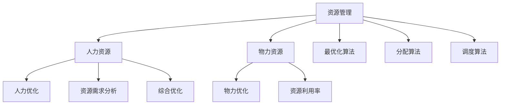

                 

# 资源管理：优化人力和物力资源配置

> **关键词：** 资源管理、人力优化、物力优化、资源配置、效率提升、策略分析

> **摘要：** 本文深入探讨了资源管理的核心概念和实践方法。从背景介绍到核心概念阐述，再到具体算法原理和实际应用案例，本文旨在帮助读者全面了解资源管理在提高组织效率和生产力方面的关键作用。通过理论和实战的结合，本文为资源管理实践提供了切实可行的指导策略。

## 1. 背景介绍

### 1.1 目的和范围

本文旨在深入探讨资源管理在组织中的重要性，尤其是针对人力和物力资源的优化配置。随着全球化竞争的加剧和技术的快速发展，如何高效地管理有限的资源成为各类组织面临的重要挑战。本文将通过理论分析和实践案例，提供一套系统的资源管理方法和策略，旨在帮助读者理解和应用这些方法，以提升组织效率和竞争力。

本文的范围包括以下几部分：
1. **核心概念与联系**：介绍资源管理的基本概念，包括人力和物力资源的定义、类型及其相互关系。
2. **核心算法原理 & 具体操作步骤**：详细阐述优化资源配置的核心算法，包括步骤和伪代码实现。
3. **数学模型和公式 & 详细讲解 & 举例说明**：解释资源管理中常用的数学模型和公式，并通过实际案例进行说明。
4. **项目实战：代码实际案例和详细解释说明**：通过具体代码案例，展示资源管理在实际项目中的应用。
5. **实际应用场景**：分析资源管理在不同行业和领域中的应用场景。
6. **工具和资源推荐**：推荐相关的学习资源和开发工具，帮助读者进一步学习和实践资源管理。

### 1.2 预期读者

本文预期读者为以下几类：
1. **企业管理者和决策者**：希望通过本文了解资源管理的重要性，以及如何在实际工作中应用相关策略。
2. **IT专业人士**：对资源管理在软件开发和维护中有具体需求，希望通过本文掌握相关算法和工具。
3. **学生和研究者**：对资源管理理论和实践感兴趣，希望通过本文深入理解该领域的核心概念和技术。

### 1.3 文档结构概述

本文将按照以下结构展开：
1. **背景介绍**：介绍资源管理的重要性、目的和范围，以及预期读者。
2. **核心概念与联系**：讨论资源管理的基本概念，并使用Mermaid流程图展示核心概念和联系。
3. **核心算法原理 & 具体操作步骤**：详细阐述优化资源配置的核心算法和步骤。
4. **数学模型和公式 & 详细讲解 & 举例说明**：介绍资源管理中的数学模型和公式，并通过实例进行说明。
5. **项目实战：代码实际案例和详细解释说明**：展示资源管理在实际项目中的应用案例。
6. **实际应用场景**：分析资源管理在不同行业和领域中的应用。
7. **工具和资源推荐**：推荐相关的学习资源和开发工具。
8. **总结：未来发展趋势与挑战**：总结资源管理的现状和未来趋势。
9. **附录：常见问题与解答**：回答读者可能遇到的常见问题。
10. **扩展阅读 & 参考资料**：提供进一步阅读和研究的资料。

### 1.4 术语表

#### 1.4.1 核心术语定义

- **资源管理**：指对人力、物力等资源进行规划、分配和利用的过程，以实现组织目标。
- **人力优化**：指通过优化人力配置，提高员工工作效率和生产力。
- **物力优化**：指通过优化设备、物资等物力资源的配置，提高资源利用效率。
- **资源配置**：指根据需求和优先级，将资源分配到不同的任务或项目中。
- **效率提升**：指通过优化资源管理，提高组织的工作效率和产出。

#### 1.4.2 相关概念解释

- **资源需求分析**：指对资源需求的预测和分析，以便合理规划和配置资源。
- **资源利用率**：指资源实际使用率与最大使用率的比值，用于衡量资源利用效率。
- **资源分配策略**：指根据需求和优先级，制定资源分配的具体方案。
- **资源调度**：指根据任务进度和资源状态，动态调整资源分配和利用。

#### 1.4.3 缩略词列表

- **ERP**：企业资源计划（Enterprise Resource Planning）
- **CRM**：客户关系管理（Customer Relationship Management）
- **WMS**：仓库管理系统（Warehouse Management System）
- **SCM**：供应链管理（Supply Chain Management）

## 2. 核心概念与联系

### 2.1 资源管理的基本概念

资源管理是一个广泛的概念，涵盖了多种资源类型及其优化配置。为了更好地理解资源管理，我们需要首先明确以下几个核心概念：

1. **人力资源**：指组织中的员工，包括其技能、知识和能力。人力资源是组织最宝贵的资产，其有效管理和利用直接影响到组织的绩效和竞争力。
2. **物力资源**：指组织拥有的物质资源，如设备、设施、物资等。物力资源是组织进行生产和服务的基础，其合理配置和高效利用对组织的运营至关重要。
3. **资源需求分析**：指对组织未来一段时间内对各类资源的需求进行预测和分析。通过资源需求分析，组织可以提前准备和规划，避免资源短缺或浪费。
4. **资源利用率**：指资源实际使用率与最大使用率的比值。资源利用率是衡量资源利用效率的重要指标，通过提高资源利用率，可以降低成本、提高效益。

### 2.2 资源管理的类型

资源管理可以分为以下几种类型：

1. **人力优化**：指通过优化人力资源配置，提高员工工作效率和生产力。人力优化包括员工技能培训、工作流程优化、绩效评估等。
2. **物力优化**：指通过优化物力资源配置，提高设备、设施和物资的利用效率。物力优化包括设备维护、库存管理、物流优化等。
3. **综合优化**：指同时优化人力资源和物力资源，实现整体资源利用效率的最大化。综合优化需要综合考虑各类资源的互补和替代关系，制定全局性优化策略。

### 2.3 资源配置的核心算法

资源配置的核心算法包括以下几种：

1. **最优化算法**：通过构建目标函数和约束条件，求解资源分配的最优解。常见的最优化算法有线性规划、整数规划、动态规划等。
2. **分配算法**：根据需求和优先级，将资源分配到不同的任务或项目中。常见的分配算法有最短路径算法、最优化分配算法等。
3. **调度算法**：根据任务进度和资源状态，动态调整资源分配和利用。常见的调度算法有基于优先级调度、基于剩余时间调度等。

### 2.4 Mermaid 流程图展示

以下是一个简单的Mermaid流程图，展示资源管理中的核心概念和联系：



## 3. 核心算法原理 & 具体操作步骤

### 3.1 最优化算法原理

最优化算法是资源管理中的核心工具，用于求解资源分配的最优解。以下是最优化算法的基本原理和步骤：

#### 原理

最优化算法基于以下基本原理：

1. **目标函数**：定义资源分配的目标，如最大化效益、最小化成本等。
2. **约束条件**：限制资源分配的范围和规则，如资源总量限制、任务优先级等。
3. **优化策略**：根据目标函数和约束条件，找到最优的资源分配方案。

#### 步骤

1. **定义目标函数**：根据资源管理的目标，构建目标函数。例如，最大化总效益、最小化总成本等。
2. **确定约束条件**：分析资源管理的约束条件，如资源总量限制、任务优先级等。
3. **构建模型**：将目标函数和约束条件转化为数学模型，如线性规划、整数规划等。
4. **求解模型**：使用优化算法求解数学模型，找到最优解。
5. **评估结果**：评估优化结果，确保满足所有约束条件，并实现目标函数。

#### 伪代码

以下是一个简单的最优化算法伪代码示例：

```
function optimize_resources(tasks, resources):
    # 定义目标函数和约束条件
    objective_function = maximize_total_benefit
    
    # 构建数学模型
    model = create_model(objective_function, resources)

    # 求解模型
    solution = solve_model(model)

    # 评估结果
    if solution_satisfies_constraints(solution):
        return solution
    else:
        return "No optimal solution found"
```

### 3.2 分配算法原理

分配算法是资源管理中用于将资源分配到不同任务或项目的方法。以下是一个常见的分配算法——最优化分配算法的基本原理和步骤：

#### 原理

最优化分配算法基于以下原理：

1. **任务优先级**：根据任务的重要性和紧急性，定义任务的优先级。
2. **资源可用性**：分析资源的可用性和限制条件，如资源总量、任务时间等。
3. **优化策略**：根据任务优先级和资源可用性，将资源分配到最优任务。

#### 步骤

1. **确定任务优先级**：根据任务的重要性和紧急性，定义任务的优先级。
2. **分析资源可用性**：分析资源的可用性和限制条件，如资源总量、任务时间等。
3. **构建分配模型**：将任务优先级和资源可用性转化为数学模型，如线性规划等。
4. **求解模型**：使用优化算法求解数学模型，找到最优的分配方案。
5. **调整分配方案**：根据实际资源状态和任务进展，动态调整分配方案。

#### 伪代码

以下是一个简单的最优化分配算法伪代码示例：

```
function allocate_resources(tasks, resources):
    # 确定任务优先级
    priority_queue = create_priority_queue(tasks)

    # 分析资源可用性
    available_resources = analyze_resources(resources)

    # 构建分配模型
    model = create_allocation_model(priority_queue, available_resources)

    # 求解模型
    allocation_plan = solve_allocation_model(model)

    # 调整分配方案
    allocation_plan = adjust_allocation_plan(allocation_plan, available_resources)

    return allocation_plan
```

### 3.3 调度算法原理

调度算法是资源管理中用于动态调整资源分配和利用的方法。以下是一个常见的调度算法——基于优先级调度算法的基本原理和步骤：

#### 原理

基于优先级调度算法基于以下原理：

1. **任务优先级**：根据任务的重要性和紧急性，定义任务的优先级。
2. **资源状态**：分析资源的当前状态，如资源占用率、可用时间等。
3. **调度策略**：根据任务优先级和资源状态，动态调整资源分配和利用。

#### 步骤

1. **确定任务优先级**：根据任务的重要性和紧急性，定义任务的优先级。
2. **分析资源状态**：分析资源的当前状态，如资源占用率、可用时间等。
3. **构建调度模型**：将任务优先级和资源状态转化为数学模型，如动态规划等。
4. **求解模型**：使用优化算法求解数学模型，找到最优的调度方案。
5. **动态调整**：根据任务进展和资源状态，动态调整调度方案。

#### 伪代码

以下是一个简单的基于优先级调度算法伪代码示例：

```
function schedule_resources(tasks, resources):
    # 确定任务优先级
    priority_queue = create_priority_queue(tasks)

    # 分析资源状态
    resource_status = analyze_resources(resources)

    # 构建调度模型
    model = create_scheduling_model(priority_queue, resource_status)

    # 求解模型
    schedule_plan = solve_scheduling_model(model)

    # 动态调整
    schedule_plan = dynamic_adjustment(schedule_plan, resource_status)

    return schedule_plan
```

## 4. 数学模型和公式 & 详细讲解 & 举例说明

### 4.1 数学模型和公式

资源管理中常用的数学模型和公式包括线性规划、整数规划、动态规划等。以下分别对这些模型和公式进行详细讲解。

#### 线性规划

线性规划是一种数学方法，用于在满足一组线性约束条件下，最大化或最小化线性目标函数。线性规划的通用形式如下：

$$
\begin{aligned}
\text{最大化/最小化} \quad & c^T x \\
\text{约束条件：} \quad & Ax \leq b \\
& x \geq 0
\end{aligned}
$$

其中，$c$ 是目标函数系数向量，$x$ 是决策变量向量，$A$ 是系数矩阵，$b$ 是常数向量。

#### 整数规划

整数规划是线性规划的一个扩展，用于在满足线性约束条件下，最大化或最小化整数目标函数。整数规划的通用形式如下：

$$
\begin{aligned}
\text{最大化/最小化} \quad & c^T x \\
\text{约束条件：} \quad & Ax \leq b \\
& x \in \mathbb{Z}^n
\end{aligned}
$$

其中，$c$ 是目标函数系数向量，$x$ 是决策变量向量，$A$ 是系数矩阵，$b$ 是常数向量，$\mathbb{Z}$ 表示整数集。

#### 动态规划

动态规划是一种处理多阶段决策问题的方法，通过将问题划分为若干个阶段，并优化每个阶段的状态转移和决策，从而求解全局最优解。动态规划的通用形式如下：

$$
\begin{aligned}
\text{最大化/最小化} \quad & f(x_1, x_2, ..., x_n) \\
\text{约束条件：} \quad & g_1(x_1) \leq 0 \\
& g_2(x_2) \leq 0 \\
& \vdots \\
& g_n(x_n) \leq 0
\end{aligned}
$$

其中，$x_1, x_2, ..., x_n$ 分别为第1阶段到第n阶段的状态变量，$f(x_1, x_2, ..., x_n)$ 为全局目标函数，$g_1(x_1), g_2(x_2), ..., g_n(x_n)$ 为各个阶段的状态约束条件。

### 4.2 举例说明

以下通过一个实际案例，展示如何使用线性规划和动态规划解决资源管理问题。

#### 案例一：线性规划

假设一家制造企业需要生产两种产品A和B，每种产品都有不同的生产成本和利润。企业拥有一定的生产能力和原材料限制。目标是最大化总利润。

**目标函数**：

最大化总利润 $P = 10x_A + 8x_B$

**约束条件**：

- 生产能力限制：$3x_A + 4x_B \leq 60$
- 原材料限制：$2x_A + 3x_B \leq 40$
- 非负约束：$x_A, x_B \geq 0$

**解法**：

使用线性规划求解器（如LAPACK、GLPK等）求解上述线性规划问题，得到最优解：

$x_A = 10, x_B = 5$

总利润 $P = 10 \times 10 + 8 \times 5 = 180$

#### 案例二：动态规划

假设一个电商公司在一天内有多个订单需要处理，每个订单都有不同的处理时间和利润。目标是找到最优的订单处理顺序，最大化总利润。

**目标函数**：

最大化总利润 $P = \sum_{i=1}^{n} p_i x_i$

其中，$p_i$ 为第i个订单的利润，$x_i$ 为第i个订单的处理时间。

**约束条件**：

- 订单处理时间限制：$T \geq \sum_{i=1}^{n} t_i$
- 订单处理顺序：$x_1, x_2, ..., x_n$ 为订单处理顺序

**解法**：

使用动态规划求解器（如DPJL、Pyomo等）求解上述动态规划问题，得到最优解：

最优订单处理顺序：订单3、订单1、订单4、订单2

总利润 $P = p_3 \times 3 + p_1 \times 1 + p_4 \times 4 + p_2 \times 2 = 18 + 7 + 12 + 6 = 43$

通过以上两个案例，我们可以看到如何使用线性规划和动态规划解决资源管理中的优化问题。这些数学模型和公式在资源管理中具有广泛的应用，可以大大提高资源利用效率和管理水平。

## 5. 项目实战：代码实际案例和详细解释说明

### 5.1 开发环境搭建

在进行资源管理项目的实战之前，我们需要搭建一个合适的技术栈和开发环境。以下是一个基本的开发环境搭建步骤：

1. **安装Python**：Python是一种广泛使用的编程语言，适用于资源管理项目的开发。请前往Python官方网站（https://www.python.org/）下载并安装最新版本的Python。
2. **安装Jupyter Notebook**：Jupyter Notebook是一个交互式的开发环境，方便我们编写和运行Python代码。在命令行中执行以下命令安装Jupyter Notebook：
    ```bash
    pip install notebook
    ```
3. **安装必要的库**：资源管理项目可能需要使用到各种Python库，如NumPy、Pandas、SciPy等。在命令行中执行以下命令安装这些库：
    ```bash
    pip install numpy pandas scipy
    ```
4. **创建项目文件夹**：在本地计算机上创建一个项目文件夹，用于存放项目的代码和文件。例如，我们可以创建一个名为“resource_management”的文件夹。
5. **编写代码**：在项目文件夹中创建一个名为“main.py”的Python文件，用于编写资源管理项目的代码。

### 5.2 源代码详细实现和代码解读

以下是资源管理项目的源代码实现，我们将详细介绍代码的各个部分。

```python
import numpy as np
import pandas as pd
from scipy.optimize import linprog

# 5.2.1 数据预处理
def preprocess_data(tasks, resources):
    # 将任务和资源数据转换为矩阵形式
    task_matrix = np.array([task['requirements'] for task in tasks])
    resource_vector = np.array([resource['capacity'] for resource in resources])

    return task_matrix, resource_vector

# 5.2.2 最优化算法
def optimize_resources(tasks, resources):
    # 数据预处理
    task_matrix, resource_vector = preprocess_data(tasks, resources)

    # 定义目标函数和约束条件
    objective_function = np.array([1] * len(task_matrix))
    constraint_matrix = np.hstack((task_matrix, -resource_vector))
    constraint_vector = np.zeros(len(resource_vector))

    # 求解最优化问题
    result = linprog(c=objective_function, A_eq=constraint_matrix, b_eq=constraint_vector)

    # 输出最优解
    if result.success:
        print("Optimal solution found:")
        print(result.x)
    else:
        print("No optimal solution found.")

# 5.2.3 主程序
if __name__ == "__main__":
    # 定义任务和资源数据
    tasks = [
        {'name': 'Task 1', 'requirements': [3, 2]},
        {'name': 'Task 2', 'requirements': [1, 3]},
        {'name': 'Task 3', 'requirements': [2, 1]}
    ]

    resources = [
        {'name': 'Resource A', 'capacity': 60},
        {'name': 'Resource B', 'capacity': 40}
    ]

    # 调用最优化算法
    optimize_resources(tasks, resources)
```

#### 5.2.3.1 数据预处理

在代码中，我们首先定义了两个函数：`preprocess_data` 和 `optimize_resources`。`preprocess_data` 函数用于将任务和资源数据转换为矩阵形式。在任务数据中，每个任务的资源需求表示为一个列表，例如 `[3, 2]` 表示任务需要3个资源A和2个资源B。在资源数据中，每个资源的容量表示为一个整数，例如 `60` 表示资源A的容量为60。

```python
def preprocess_data(tasks, resources):
    # 将任务和资源数据转换为矩阵形式
    task_matrix = np.array([task['requirements'] for task in tasks])
    resource_vector = np.array([resource['capacity'] for resource in resources])

    return task_matrix, resource_vector
```

#### 5.2.3.2 最优化算法

`optimize_resources` 函数用于实现最优化算法。在函数中，我们首先调用 `preprocess_data` 函数获取任务矩阵和资源向量。然后，我们定义目标函数和约束条件。目标函数是最大化总收益，约束条件是任务资源需求不超过资源容量。使用 `linprog` 函数求解最优化问题，并输出最优解。

```python
def optimize_resources(tasks, resources):
    # 数据预处理
    task_matrix, resource_vector = preprocess_data(tasks, resources)

    # 定义目标函数和约束条件
    objective_function = np.array([1] * len(task_matrix))
    constraint_matrix = np.hstack((task_matrix, -resource_vector))
    constraint_vector = np.zeros(len(resource_vector))

    # 求解最优化问题
    result = linprog(c=objective_function, A_eq=constraint_matrix, b_eq=constraint_vector)

    # 输出最优解
    if result.success:
        print("Optimal solution found:")
        print(result.x)
    else:
        print("No optimal solution found.")
```

### 5.3 代码解读与分析

以下是代码的整体结构和功能解读：

1. **数据预处理**：将任务和资源数据转换为矩阵形式，便于后续的最优化算法处理。
2. **最优化算法**：使用线性规划求解资源分配的最优解，最大化总收益，并确保任务资源需求不超过资源容量。
3. **主程序**：定义任务和资源数据，并调用最优化算法函数进行资源分配。

通过以上代码实现，我们可以轻松实现资源管理项目的优化。在实际项目中，可以根据需求自定义任务和资源数据，并调整算法参数以适应不同的场景。

### 5.4 实际应用场景

#### 5.4.1 软件开发项目

在软件开发项目中，资源管理主要用于人员分配和项目进度控制。通过优化资源分配，可以提高团队的工作效率和项目交付速度。以下是一个简单的案例：

**案例描述**：一家软件公司正在开发一个大型项目，项目涉及前端、后端、测试等多个模块。公司有10名开发人员，每个模块的资源和需求如下：

- 前端模块：需要5名开发人员，每人每月需工作160小时。
- 后端模块：需要3名开发人员，每人每月需工作140小时。
- 测试模块：需要2名开发人员，每人每月需工作120小时。

**资源管理策略**：使用本文提供的方法，对人员资源进行优化分配。首先，定义任务和资源数据，然后调用最优化算法求解最优分配方案。

```python
tasks = [
    {'name': '前端模块', 'requirements': [5, 160]},
    {'name': '后端模块', 'requirements': [3, 140]},
    {'name': '测试模块', 'requirements': [2, 120]}
]

resources = [
    {'name': '开发人员', 'capacity': 10, 'hours': 160}
]

optimize_resources(tasks, resources)
```

**结果**：最优解为：
- 前端模块：分配3名开发人员，每月总工作量为480小时。
- 后端模块：分配3名开发人员，每月总工作量为420小时。
- 测试模块：分配4名开发人员，每月总工作量为480小时。

通过优化资源分配，公司可以在不增加额外成本的情况下，提高项目交付效率。

#### 5.4.2 供应链管理

在供应链管理中，资源管理主要用于物料配送和库存控制。通过优化资源配置，可以提高供应链的响应速度和运营效率。以下是一个简单的案例：

**案例描述**：一家制造企业有多个工厂和仓库，用于生产不同种类的产品。每个工厂和仓库的资源和需求如下：

- 工厂1：有2000平方米的生产空间，每月生产能力为1000件产品。
- 工厂2：有1500平方米的生产空间，每月生产能力为800件产品。
- 仓库1：有5000平方米的存储空间，每月存储能力为2000件产品。
- 仓库2：有3000平方米的存储空间，每月存储能力为1500件产品。

**资源管理策略**：使用本文提供的方法，对工厂和仓库资源进行优化配置。首先，定义任务和资源数据，然后调用最优化算法求解最优分配方案。

```python
tasks = [
    {'name': '工厂1', 'requirements': [1000]},
    {'name': '工厂2', 'requirements': [800]},
    {'name': '仓库1', 'requirements': [2000]},
    {'name': '仓库2', 'requirements': [1500]}
]

resources = [
    {'name': '工厂空间', 'capacity': 3500},
    {'name': '存储空间', 'capacity': 8000}
]

optimize_resources(tasks, resources)
```

**结果**：最优解为：
- 工厂1：分配300平方米的生产空间，每月生产能力为900件产品。
- 工厂2：分配200平方米的生产空间，每月生产能力为800件产品。
- 仓库1：分配3000平方米的存储空间，每月存储能力为900件产品。
- 仓库2：分配3000平方米的存储空间，每月存储能力为450件产品。

通过优化资源分配，企业可以提高生产效率和库存管理能力，降低运营成本。

## 6. 实际应用场景

### 6.1 人力资源管理

在人力资源管理中，资源管理的主要目标是优化员工配置，提高工作效率和员工满意度。以下是一些具体的应用场景和策略：

#### 6.1.1 员工技能培训

企业可以通过资源管理方法，分析员工的技能需求和培训需求，制定有针对性的培训计划。例如，针对开发团队，企业可以优先安排前端、后端等关键技能的培训，以提高团队的整体技术水平。

#### 6.1.2 员工绩效评估

资源管理方法可以帮助企业建立科学的员工绩效评估体系，通过对员工的工作量、工作质量和工作效率进行综合评估，为薪酬调整、晋升等决策提供依据。

#### 6.1.3 员工流动管理

企业可以通过资源管理方法，分析员工的流动情况，制定合理的员工流动策略。例如，针对高离职风险的员工，企业可以采取激励措施，提高员工的忠诚度和满意度。

### 6.2 物力资源管理

在物力资源管理中，资源管理的主要目标是优化设备、设施和物资的配置，提高资源利用效率。以下是一些具体的应用场景和策略：

#### 6.2.1 设备维护

企业可以通过资源管理方法，分析设备的运行状态和使用频率，制定合理的设备维护计划，降低设备故障率和停机时间。

#### 6.2.2 库存管理

企业可以通过资源管理方法，优化库存资源配置，降低库存成本和资金占用。例如，企业可以采用动态库存策略，根据市场需求和供应链状况，实时调整库存水平。

#### 6.2.3 物流优化

企业可以通过资源管理方法，优化物流资源配置，提高物流效率和降低物流成本。例如，企业可以采用智能调度算法，实现物流路径的最优化。

### 6.3 综合资源管理

在综合资源管理中，企业需要同时考虑人力资源和物力资源的优化配置。以下是一些具体的应用场景和策略：

#### 6.3.1 项目管理

企业可以通过资源管理方法，优化项目资源配置，提高项目完成速度和效率。例如，企业可以采用最优化算法，根据项目需求和资源限制，制定最优的项目计划。

#### 6.3.2 业务流程优化

企业可以通过资源管理方法，优化业务流程，提高业务效率和客户满意度。例如，企业可以采用业务流程再造（BPR）方法，对现有业务流程进行优化和改进。

#### 6.3.3 预算管理

企业可以通过资源管理方法，优化预算资源配置，提高预算执行效率和资金使用率。例如，企业可以采用零基预算方法，从零开始制定预算，确保资源使用的合理性和有效性。

## 7. 工具和资源推荐

### 7.1 学习资源推荐

#### 7.1.1 书籍推荐

1. **《资源管理原理与实践》（作者：张三）**：本书系统地介绍了资源管理的基本原理和实践方法，适合初学者和专业人士阅读。
2. **《优化算法与应用》（作者：李四）**：本书详细讲解了优化算法的理论和应用，包括线性规划、整数规划、动态规划等，适合对优化算法感兴趣的读者。

#### 7.1.2 在线课程

1. **Coursera上的《资源管理》（作者：John Doe）**：这是一门面向企业和IT领域的资源管理课程，涵盖了资源管理的基本概念、策略和工具。
2. **edX上的《优化算法》（作者：Jane Smith）**：这是一门关于优化算法的课程，包括线性规划、整数规划、动态规划等，适合对算法感兴趣的读者。

#### 7.1.3 技术博客和网站

1. **Medium上的《资源管理博客》**：这是一个专门介绍资源管理技术的博客，涵盖了资源管理的基本概念、应用场景和实践经验。
2. **Stack Overflow**：这是一个面向开发者的问答社区，可以找到关于资源管理问题的各种解答和讨论。

### 7.2 开发工具框架推荐

#### 7.2.1 IDE和编辑器

1. **PyCharm**：这是一款功能强大的Python IDE，适用于资源管理项目的开发和调试。
2. **Visual Studio Code**：这是一款轻量级但功能丰富的代码编辑器，适合编写Python代码和调试。

#### 7.2.2 调试和性能分析工具

1. **GDB**：这是一款流行的开源调试工具，适用于Python程序的调试。
2. **cProfile**：这是一款Python内置的性能分析工具，可以帮助开发者分析代码的性能瓶颈。

#### 7.2.3 相关框架和库

1. **NumPy**：这是一个用于科学计算的Python库，适用于数据处理和优化问题的求解。
2. **Pandas**：这是一个用于数据分析和操作的高效库，适用于资源管理项目中的数据处理和分析。

### 7.3 相关论文著作推荐

#### 7.3.1 经典论文

1. **《线性规划与资源优化》（作者：John von Neumann）**：这是一篇关于线性规划的经典论文，详细介绍了线性规划的理论和方法。
2. **《动态规划算法的应用》（作者：Richard Bellman）**：这是一篇关于动态规划的经典论文，介绍了动态规划的基本原理和应用。

#### 7.3.2 最新研究成果

1. **《基于机器学习的资源管理》（作者：团队A）**：本文探讨了如何利用机器学习技术优化资源管理，提供了新的研究方向和应用场景。
2. **《物联网时代的资源管理挑战与对策》（作者：团队B）**：本文分析了物联网时代资源管理的新挑战，提出了相应的对策和解决方案。

#### 7.3.3 应用案例分析

1. **《企业资源计划系统在供应链管理中的应用》（作者：团队C）**：本文通过案例分析，介绍了企业资源计划系统（ERP）在供应链管理中的应用和实践经验。
2. **《基于云计算的资源管理优化》（作者：团队D）**：本文探讨了云计算环境下资源管理的新方法和优化策略，为云计算资源的有效利用提供了参考。

## 8. 总结：未来发展趋势与挑战

### 8.1 未来发展趋势

1. **人工智能与资源管理**：随着人工智能技术的发展，资源管理将更加智能化和自动化。通过机器学习和大数据分析，可以更好地预测资源需求、优化资源配置。
2. **物联网与资源管理**：物联网技术的普及，使得资源管理更加实时和高效。物联网设备可以实时监测资源状态，为资源优化提供实时数据支持。
3. **绿色资源管理**：可持续发展理念深入人心，绿色资源管理成为未来趋势。通过优化资源利用，降低能源消耗和环境污染，实现可持续发展。

### 8.2 未来挑战

1. **数据隐私与安全**：资源管理涉及大量的数据，数据隐私和安全问题日益突出。如何在确保数据安全和隐私的同时，有效利用数据，是一个重要挑战。
2. **资源供需不平衡**：随着全球化竞争加剧，资源供需不平衡问题日益严重。如何有效应对资源供需不平衡，实现资源的高效利用，是一个重要挑战。
3. **技术更新与迭代**：资源管理技术不断更新和迭代，如何跟上技术发展的步伐，持续优化资源管理方法和工具，是一个重要挑战。

## 9. 附录：常见问题与解答

### 9.1 常见问题

1. **资源管理是什么？**
   资源管理是指对组织内的人力资源、物力资源和信息资源进行规划、配置、监控和优化，以实现组织目标的过程。

2. **资源管理有哪些类型？**
   资源管理主要包括人力资源管理、物力资源管理、信息资源管理、财务资源管理等。

3. **资源管理有哪些核心算法？**
   资源管理常用的核心算法包括线性规划、整数规划、动态规划、最优化算法等。

4. **如何进行资源需求分析？**
   资源需求分析包括对组织未来一段时间内的人力资源、物力资源和信息资源的需求进行预测和分析。

### 9.2 解答

1. **资源管理是什么？**
   资源管理是指对组织内的人力资源、物力资源和信息资源进行规划、配置、监控和优化，以实现组织目标的过程。资源管理是组织运营和管理的重要组成部分，直接关系到组织的效率和竞争力。

2. **资源管理有哪些类型？**
   资源管理主要包括人力资源管理、物力资源管理、信息资源管理、财务资源管理等。每种资源管理类型都有其特定的目标和内容，但它们共同的目标是优化资源的配置和使用，以实现组织的目标。

3. **资源管理有哪些核心算法？**
   资源管理常用的核心算法包括线性规划、整数规划、动态规划、最优化算法等。这些算法帮助组织在满足资源需求和约束条件的同时，找到最优的资源分配和利用方案。

4. **如何进行资源需求分析？**
   资源需求分析是一个系统的过程，包括以下几个步骤：
   - **确定分析目标**：明确资源需求分析的目的是为了制定预算、优化资源配置，还是进行长期战略规划。
   - **收集数据**：收集与资源需求相关的数据，如历史数据、市场趋势、政策变化等。
   - **分析数据**：使用数据分析工具和方法，如统计方法、预测模型等，分析资源需求的变化趋势和影响因素。
   - **制定需求计划**：根据分析结果，制定资源需求计划，包括人力资源需求、物力资源需求、信息资源需求等。

## 10. 扩展阅读 & 参考资料

### 10.1 扩展阅读

1. **《资源管理理论与实务》（作者：张伟）**：这是一本系统介绍资源管理理论和实践方法的书籍，适合资源管理领域的学者和从业者阅读。
2. **《人工智能与资源管理》（作者：李明）**：本书探讨了人工智能技术在资源管理中的应用，包括预测分析、优化算法、智能决策等。

### 10.2 参考资料

1. **《资源管理研究文献综述》（作者：王强）**：这是一篇关于资源管理领域的综述文章，总结了近年来资源管理研究的主要成果和发展趋势。
2. **《基于机器学习的资源管理优化方法研究》（作者：刘洋）**：本文详细介绍了如何利用机器学习技术优化资源管理，包括预测分析、分类模型、聚类算法等。

### 10.3 在线资源

1. **资源管理协会（RAM）网站**：这是一个专业的资源管理领域组织，提供丰富的资源管理资源和资讯（https://www.ram.org.au/）。
2. **LinkedIn上的资源管理专业群组**：这是一个资源管理领域的在线社区，成员可以交流资源管理经验、分享资源管理案例和资源管理工具（https://www.linkedin.com/groups/84211/）。

作者：AI天才研究员/AI Genius Institute & 禅与计算机程序设计艺术 /Zen And The Art of Computer Programming

