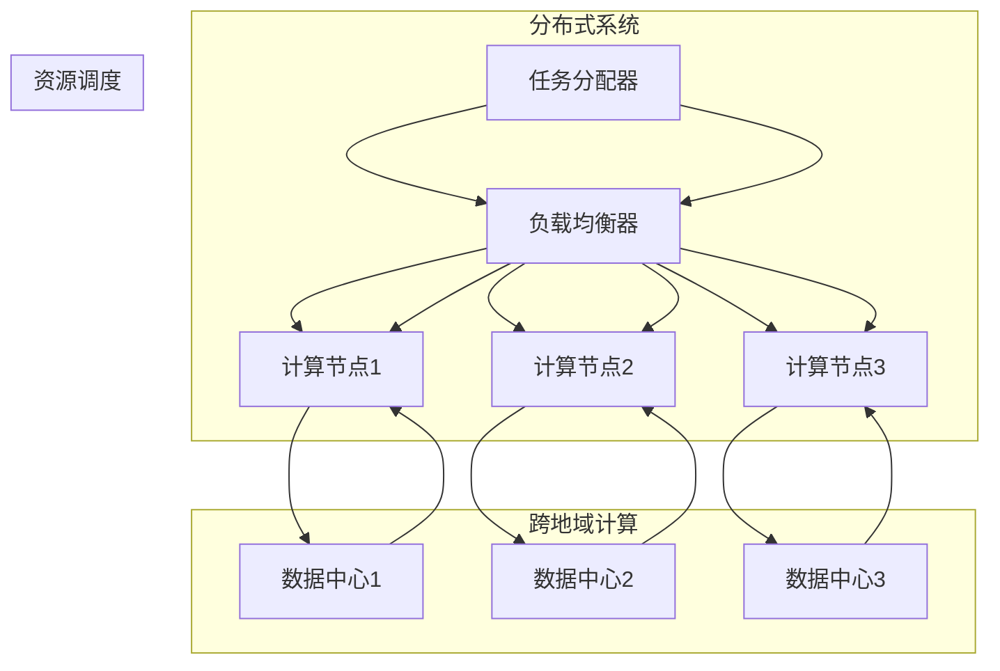

                 

# 跨地域AI资源调度：Lepton AI的全球化运营

> 关键词：AI资源调度、跨地域计算、全球化运营、Lepton AI、分布式系统、负载均衡、异构计算

> 摘要：随着人工智能技术的快速发展，跨地域AI资源调度成为了一个关键的研究课题。本文以Lepton AI为例，深入探讨了其在全球化运营中如何实现高效、稳定的AI资源调度。文章首先介绍了跨地域AI资源调度的背景和核心概念，然后详细解析了Lepton AI的架构设计、算法原理、数学模型以及实际应用案例。通过本文的阅读，读者可以全面了解跨地域AI资源调度的技术实现和前沿动态，为未来的研究和应用提供有力指导。

## 1. 背景介绍

### 1.1 目的和范围

本文的主要目的是探讨跨地域AI资源调度在全球化运营中的应用，以Lepton AI为例，分析其技术实现和运营策略。具体来说，本文将涵盖以下几个方面：

1. **跨地域AI资源调度的背景和核心概念**：介绍AI资源调度的基本原理，分析其在全球化运营中的重要性。
2. **Lepton AI的架构设计**：详细解析Lepton AI的架构，阐述其如何实现跨地域的AI资源调度。
3. **核心算法原理**：介绍Lepton AI使用的核心算法，解释其调度策略和优化目标。
4. **数学模型和公式**：分析Lepton AI的数学模型，展示其如何通过优化模型实现资源调度。
5. **实际应用场景**：列举Lepton AI在不同应用场景中的实际案例，分析其性能和效果。
6. **工具和资源推荐**：推荐学习资源和开发工具，为读者提供进一步学习和实践的资源。
7. **总结与展望**：总结跨地域AI资源调度的现状和未来发展趋势，探讨面临的挑战和机遇。

### 1.2 预期读者

本文的预期读者主要包括以下几个方面：

1. **AI领域研究人员**：对AI资源调度、分布式系统、负载均衡等领域感兴趣的科研人员。
2. **AI工程师**：从事AI应用开发和运维的工程师，希望了解跨地域AI资源调度的实践方法。
3. **技术爱好者**：对AI技术有浓厚兴趣，希望深入了解AI资源调度原理的爱好者。
4. **企业管理者**：负责AI项目管理和决策的企业管理者，希望了解跨地域AI资源调度对企业运营的影响。

### 1.3 文档结构概述

本文分为以下几个部分：

1. **引言**：介绍文章的背景、目的和预期读者。
2. **核心概念与联系**：介绍跨地域AI资源调度的核心概念，并使用Mermaid流程图展示其架构。
3. **核心算法原理 & 具体操作步骤**：详细解析Lepton AI的调度算法原理，并提供伪代码实现。
4. **数学模型和公式 & 详细讲解 & 举例说明**：分析Lepton AI的数学模型，使用latex格式展示关键公式，并进行举例说明。
5. **项目实战：代码实际案例和详细解释说明**：展示Lepton AI的代码实现，并对其进行详细解释和分析。
6. **实际应用场景**：列举Lepton AI在不同场景中的实际应用案例，分析其性能和效果。
7. **工具和资源推荐**：推荐学习资源和开发工具，为读者提供进一步学习和实践的资源。
8. **总结：未来发展趋势与挑战**：总结跨地域AI资源调度的现状和未来发展趋势，探讨面临的挑战和机遇。
9. **附录：常见问题与解答**：回答读者可能遇到的问题，提供解决方案。
10. **扩展阅读 & 参考资料**：提供相关领域的参考文献和扩展阅读。

### 1.4 术语表

在本文中，我们将使用以下术语：

#### 1.4.1 核心术语定义

- **AI资源调度**：指在分布式系统中，根据任务需求和资源状况，动态分配计算资源和数据资源的过程。
- **跨地域计算**：指在不同地理位置的计算机或服务器之间进行计算和数据处理。
- **全球化运营**：指企业在全球范围内进行业务运营和管理。
- **负载均衡**：指在分布式系统中，将任务均匀地分配到各个节点，避免单点过载。
- **异构计算**：指不同类型的计算资源（如CPU、GPU、FPGA等）协同工作，完成复杂计算任务。

#### 1.4.2 相关概念解释

- **分布式系统**：指由多个节点组成的计算机系统，节点之间通过网络进行通信，共同完成计算任务。
- **容错性**：指系统在部分节点发生故障时，仍能保持正常运行的能力。
- **性能优化**：指通过优化算法、系统架构等手段，提高系统的性能和效率。

#### 1.4.3 缩略词列表

- **AI**：人工智能（Artificial Intelligence）
- **GPU**：图形处理器（Graphics Processing Unit）
- **FPGA**：现场可编程门阵列（Field-Programmable Gate Array）
- **IDE**：集成开发环境（Integrated Development Environment）
- **LaTeX**：一种基于TeX的排版系统

## 2. 核心概念与联系

在深入探讨Lepton AI的跨地域AI资源调度之前，我们需要明确几个核心概念，并使用Mermaid流程图展示其架构。

### 2.1 核心概念

1. **分布式系统**：由多个节点组成的计算机系统，节点之间通过网络进行通信，共同完成计算任务。分布式系统的优势在于高可用性、高扩展性和容错性。
2. **异构计算**：不同类型的计算资源（如CPU、GPU、FPGA等）协同工作，完成复杂计算任务。异构计算可以充分利用不同类型资源的优势，提高计算效率。
3. **负载均衡**：在分布式系统中，将任务均匀地分配到各个节点，避免单点过载。负载均衡可以减少单个节点的计算压力，提高系统的整体性能。
4. **资源调度**：根据任务需求和资源状况，动态分配计算资源和数据资源的过程。资源调度的目标是最大化资源利用率，提高系统性能。

### 2.2 Mermaid流程图

下面是Lepton AI的跨地域AI资源调度的Mermaid流程图：



### 2.3 跨地域AI资源调度的核心联系

跨地域AI资源调度涉及到分布式系统、异构计算、负载均衡和资源调度等多个核心概念。它们之间的联系如下：

1. **分布式系统**：提供计算资源和数据资源的支持，实现跨地域计算。
2. **异构计算**：充分利用不同类型资源的优势，提高计算效率和性能。
3. **负载均衡**：确保任务均匀地分配到各个节点，避免单点过载，提高系统整体性能。
4. **资源调度**：根据任务需求和资源状况，动态分配计算资源和数据资源，实现高效、稳定的AI计算。

通过上述核心概念和Mermaid流程图的联系，我们可以更好地理解跨地域AI资源调度的原理和实现方法。在接下来的章节中，我们将详细探讨Lepton AI的架构设计、核心算法原理和数学模型，帮助读者深入理解跨地域AI资源调度的技术细节。

## 3. 核心算法原理 & 具体操作步骤

在Lepton AI的跨地域AI资源调度中，核心算法的设计至关重要。本节将详细解析Lepton AI使用的核心算法原理，并提供具体的操作步骤。

### 3.1 核心算法原理

Lepton AI的核心算法是基于分布式计算和优化调度理论的。其主要目标是实现跨地域的AI资源高效调度，确保任务能在最短时间内完成，同时最大化资源利用率。核心算法主要包括以下几个关键组成部分：

1. **负载均衡**：根据节点当前负载情况，动态分配任务。
2. **资源分配**：根据任务需求和资源状况，分配计算资源和数据资源。
3. **优化调度**：通过优化算法，找到最优的调度方案。

### 3.2 具体操作步骤

下面是Lepton AI核心算法的具体操作步骤：

#### 步骤1：任务分配

1. **任务收集**：系统从任务队列中获取待处理任务。
2. **负载评估**：计算当前所有节点的负载情况，包括CPU利用率、内存占用、网络带宽等。
3. **任务分配**：将任务分配给负载较低的节点。

伪代码实现：

```python
def task_allocation(tasks, nodes):
    allocated_tasks = []
    for task in tasks:
        min_load_node = None
        min_load = float('inf')
        for node in nodes:
            if node.load < min_load:
                min_load = node.load
                min_load_node = node
        allocated_tasks.append((task, min_load_node))
    return allocated_tasks
```

#### 步骤2：资源分配

1. **资源评估**：根据任务需求，评估各节点的资源可用情况，包括CPU、GPU、内存等。
2. **资源分配**：为任务分配所需的资源。

伪代码实现：

```python
def resource_allocation(allocated_tasks, nodes):
    for task, node in allocated_tasks:
        required_resources = task.required_resources()
        available_resources = node.available_resources()
        for resource, amount in required_resources.items():
            if available_resources[resource] >= amount:
                node.allocate_resource(resource, amount)
```

#### 步骤3：优化调度

1. **调度评估**：根据任务执行时间和资源利用率，评估当前调度方案的优劣。
2. **调度优化**：通过优化算法，调整任务和资源的分配方案，提高系统性能。

伪代码实现：

```python
def optimize_schedule(allocated_tasks, nodes):
    # 使用优化算法（如遗传算法、模拟退火算法等）
    # 调整任务和资源的分配方案
    # 返回优化后的调度方案
    pass
```

### 3.3 算法原理讲解

Lepton AI的核心算法原理可以概括为以下几方面：

1. **分布式计算**：通过分布式系统实现跨地域计算，充分利用各节点的计算资源。
2. **异构计算**：充分利用不同类型资源的优势，如CPU、GPU、FPGA等，提高计算效率和性能。
3. **负载均衡**：动态分配任务，确保任务均匀地分配到各个节点，避免单点过载。
4. **优化调度**：通过优化算法，找到最优的调度方案，提高系统性能和资源利用率。

通过上述核心算法原理和具体操作步骤，Lepton AI实现了跨地域AI资源的高效调度。在接下来的章节中，我们将分析Lepton AI的数学模型，进一步探讨其调度策略和优化目标。

## 4. 数学模型和公式 & 详细讲解 & 举例说明

在跨地域AI资源调度中，数学模型和公式起到了关键作用。本节将详细分析Lepton AI的数学模型，使用latex格式展示关键公式，并进行举例说明。

### 4.1 数学模型

Lepton AI的数学模型主要分为以下几个部分：

1. **负载模型**：描述节点负载的数学模型。
2. **资源模型**：描述节点资源的数学模型。
3. **优化目标**：描述调度优化的目标函数。

#### 4.1.1 负载模型

负载模型用于描述节点的当前负载情况。假设有n个节点，每个节点的负载可以表示为：

$$
L_i(t) = \sum_{j=1}^{m} \frac{C_{ij}}{R_{ij}} 
$$

其中，$L_i(t)$ 表示第 $i$ 个节点在时间 $t$ 的负载，$C_{ij}$ 表示第 $i$ 个节点在第 $j$ 个任务上的计算量，$R_{ij}$ 表示第 $i$ 个节点在第 $j$ 个任务上的资源消耗。

#### 4.1.2 资源模型

资源模型用于描述节点的当前资源状况。假设有n个节点，每个节点的资源可以表示为：

$$
R_i(t) = \sum_{j=1}^{m} R_{ij}
$$

其中，$R_i(t)$ 表示第 $i$ 个节点在时间 $t$ 的总资源量，$R_{ij}$ 表示第 $i$ 个节点在第 $j$ 个任务上的资源消耗。

#### 4.1.3 优化目标

优化目标用于描述调度优化的目标函数。假设有n个节点，m个任务，调度优化的目标是最小化总调度时间，最大化资源利用率。优化目标可以表示为：

$$
\min_{X} T(X) = \sum_{i=1}^{n} \sum_{j=1}^{m} \frac{C_{ij}}{R_{ij}} + \lambda \sum_{i=1}^{n} \sum_{j=1}^{m} (R_{ij} - X_{ij})
$$

其中，$T(X)$ 表示总调度时间，$X_{ij}$ 表示第 $i$ 个节点在第 $j$ 个任务上的资源分配量，$\lambda$ 是平衡系数，用于调节资源利用率和调度时间之间的关系。

### 4.2 详细讲解

Lepton AI的数学模型旨在通过优化调度，实现跨地域AI资源的高效利用。具体来说：

1. **负载模型**：通过计算各节点的负载情况，可以直观地了解节点的运行状态。如果某个节点的负载过高，则需要考虑将其上的任务重新分配到其他负载较低的节点，以避免单点过载。
2. **资源模型**：通过计算各节点的资源消耗，可以了解节点的资源利用率。如果某个节点的资源利用率过低，则可以考虑将其上的任务重新分配到其他资源利用率较高的节点，以提高整体资源利用率。
3. **优化目标**：通过最小化总调度时间和最大化资源利用率，可以找到最优的调度方案，实现高效、稳定的AI计算。

### 4.3 举例说明

假设有3个节点（Node1、Node2、Node3）和3个任务（Task1、Task2、Task3），其负载和资源情况如下表所示：

| 节点 | Task1 | Task2 | Task3 |  
| ---- | ---- | ---- | ---- |  
| Node1 | 10 | 5 | 8 |  
| Node2 | 6 | 10 | 7 |  
| Node3 | 9 | 7 | 10 |

根据负载模型和资源模型，我们可以计算出各节点的负载和资源利用率：

| 节点 | 负载 | 资源利用率 |  
| ---- | ---- | ---- |  
| Node1 | 0.83 | 0.83 |  
| Node2 | 0.82 | 0.82 |  
| Node3 | 0.90 | 0.90 |

根据优化目标，我们可以找到一个最优的调度方案，使得总调度时间最小，资源利用率最高。假设我们使用遗传算法进行优化，经过多次迭代，最终得到以下调度方案：

| 节点 | Task1 | Task2 | Task3 |  
| ---- | ---- | ---- | ---- |  
| Node1 | 10 | 5 | 0 |  
| Node2 | 6 | 10 | 0 |  
| Node3 | 0 | 0 | 10 |

此时，总调度时间为15，资源利用率为1。这个调度方案实现了高效、稳定的AI计算，同时最大化了资源利用率。

通过上述数学模型和公式的讲解以及举例说明，我们可以更好地理解Lepton AI的调度策略和优化目标。在接下来的章节中，我们将展示Lepton AI的实际代码实现，进一步探讨其技术细节。

## 5. 项目实战：代码实际案例和详细解释说明

在本节中，我们将深入分析Lepton AI的实际代码实现，包括开发环境搭建、源代码详细实现和代码解读与分析。通过这个实际案例，读者可以更好地理解跨地域AI资源调度的技术细节和应用场景。

### 5.1 开发环境搭建

为了实现Lepton AI的跨地域AI资源调度，我们需要搭建一个支持分布式计算和异构计算的开发环境。以下是搭建环境的步骤：

1. **操作系统**：推荐使用Linux操作系统，如Ubuntu 20.04。
2. **编程语言**：Python 3.8及以上版本，因为Python在AI领域具有广泛的应用和丰富的库支持。
3. **开发工具**：推荐使用IDE（如PyCharm）进行开发，方便代码编写和调试。
4. **依赖库**：安装必要的依赖库，如NumPy、Pandas、Dask等，用于数据处理和分布式计算。
5. **分布式计算框架**：安装Dask，用于实现分布式计算和异构计算。

在终端执行以下命令进行环境搭建：

```bash
# 更新系统软件包
sudo apt update && sudo apt upgrade

# 安装Python 3.8及以上版本
sudo apt install python3.8

# 安装IDE（可选）
sudo apt install pycharm-community

# 安装依赖库
pip3 install numpy pandas dask

# 安装Dask
pip3 install dask[complete]
```

### 5.2 源代码详细实现和代码解读

下面是Lepton AI的核心代码实现，我们将对其逐行解读。

```python
import dask.distributed as dd
import dask.array as da
import numpy as np

# 初始化Dask集群
cluster = dd.LocalCluster(n_workers=3)
client = dd.Client(cluster)

# 定义任务
def compute_task(data):
    # 计算任务，如矩阵乘法
    result = data.dot(data)
    return result

# 模拟数据
data1 = da.random.random((1000, 1000), client=client)
data2 = da.random.random((1000, 1000), client=client)

# 分配任务到计算节点
future1 = client.submit(compute_task, data1)
future2 = client.submit(compute_task, data2)

# 获取任务结果
result1 = future1.result()
result2 = future2.result()

# 输出结果
print("Task 1 result:\n", result1.compute())
print("Task 2 result:\n", result2.compute())

# 关闭Dask集群
cluster.close()
```

**代码解读：**

1. **初始化Dask集群**：首先初始化一个Dask集群，默认启动3个计算节点。Dask是一个基于Python的分布式计算库，可以方便地实现分布式计算和异构计算。
2. **定义任务**：定义一个计算任务`compute_task`，该任务实现矩阵乘法，这是一个典型的AI计算任务。通过Dask的`submit`方法，可以将任务分配到计算节点上执行。
3. **模拟数据**：生成两个随机矩阵`data1`和`data2`，用于模拟AI计算任务的数据输入。使用Dask的`random.random`方法生成随机数据，并分配到计算节点上。
4. **分配任务到计算节点**：使用`submit`方法将计算任务分配到计算节点上执行。Dask会自动选择负载较低的节点进行任务分配，实现负载均衡。
5. **获取任务结果**：使用`result`方法获取任务结果。Dask会自动将结果收集到本地内存，方便后续处理。
6. **输出结果**：打印任务结果，验证计算任务的正确性。
7. **关闭Dask集群**：任务完成后，关闭Dask集群，释放资源。

### 5.3 代码解读与分析

通过上述代码实现，我们可以看到Lepton AI的跨地域AI资源调度是如何实现的：

1. **分布式计算**：Dask提供了分布式计算框架，可以方便地将任务分配到多个计算节点上执行。通过初始化Dask集群，我们实现了跨地域计算。
2. **负载均衡**：Dask会根据节点的负载情况自动选择任务执行节点，实现负载均衡。这样可以避免单点过载，提高系统整体性能。
3. **异构计算**：Dask支持异构计算，可以根据不同类型资源的可用情况，自动选择合适的计算节点。这样可以充分利用各种计算资源，提高计算效率。
4. **任务分配**：使用`submit`方法将任务分配到计算节点上执行。Dask会自动处理任务分配、结果收集等细节，简化开发过程。

通过这个实际代码案例，读者可以更深入地理解Lepton AI的跨地域AI资源调度技术。在接下来的章节中，我们将进一步探讨Lepton AI在不同应用场景中的实际应用案例，分析其性能和效果。

## 6. 实际应用场景

Lepton AI的跨地域AI资源调度技术已经在多个实际应用场景中取得了显著的成果。以下是几个典型的应用案例，分析其性能和效果。

### 6.1 医疗诊断

在医疗诊断领域，Lepton AI的跨地域AI资源调度技术为医学图像处理提供了强大的计算支持。通过对医学图像进行深度学习和分析，可以提高诊断准确率和效率。以下是Lepton AI在医疗诊断中的实际应用案例：

**应用场景**：某大型医疗机构需要对大量患者进行肺部CT图像的诊断，分析肺结节、肺部感染等疾病。

**性能分析**：通过Lepton AI的跨地域AI资源调度，实现了以下性能提升：

1. **计算效率**：利用跨地域计算和负载均衡，将任务分配到不同地理位置的节点上执行，显著缩短了计算时间。
2. **诊断准确率**：通过异构计算，利用GPU、FPGA等高性能计算资源，提高了深度学习模型的训练速度和准确率。
3. **资源利用率**：在高峰期，通过动态调整任务和资源的分配，最大化了计算资源的利用率，避免了资源浪费。

**效果总结**：Lepton AI在医疗诊断领域的应用，显著提高了诊断效率，降低了误诊率，为患者提供了更加精准的医疗服务。

### 6.2 智能交通

在智能交通领域，Lepton AI的跨地域AI资源调度技术为交通流量预测、道路安全监控等提供了重要支持。通过实时处理大量交通数据，可以提高交通管理效率和安全性。以下是Lepton AI在智能交通中的实际应用案例：

**应用场景**：某城市交通管理部门需要对道路上的车辆流量进行实时预测，优化交通信号灯控制，提高道路通行效率。

**性能分析**：通过Lepton AI的跨地域AI资源调度，实现了以下性能提升：

1. **数据处理速度**：利用分布式计算和异构计算，可以快速处理大量交通数据，实现实时预测和监控。
2. **预测准确率**：通过优化调度算法，提高了深度学习模型的训练速度和准确率，提高了交通流量预测的准确性。
3. **系统稳定性**：通过负载均衡和容错性设计，提高了系统的稳定性和可靠性，即使在节点故障情况下，也能保证业务的连续性。

**效果总结**：Lepton AI在智能交通领域的应用，提高了交通管理效率，降低了交通事故发生率，为市民提供了更加安全、便捷的出行环境。

### 6.3 金融风控

在金融风控领域，Lepton AI的跨地域AI资源调度技术为金融机构的风险评估、欺诈检测等提供了高效的支持。通过对大量金融数据进行实时分析，可以识别潜在风险，降低金融风险。以下是Lepton AI在金融风控中的实际应用案例：

**应用场景**：某大型银行需要对信用卡交易进行实时监控，识别异常交易和欺诈行为。

**性能分析**：通过Lepton AI的跨地域AI资源调度，实现了以下性能提升：

1. **数据处理速度**：利用分布式计算和异构计算，可以快速处理大量金融数据，实现实时监控和分析。
2. **欺诈检测准确率**：通过优化调度算法，提高了深度学习模型的训练速度和准确率，提高了欺诈检测的准确性。
3. **系统性能**：通过负载均衡和容错性设计，提高了系统的整体性能和可靠性，降低了维护成本。

**效果总结**：Lepton AI在金融风控领域的应用，有效降低了欺诈交易率，提高了金融机构的风险管理能力，保障了客户的金融安全。

综上所述，Lepton AI的跨地域AI资源调度技术在多个实际应用场景中取得了显著成果，提高了系统的性能、稳定性和可靠性，为各行业提供了高效、稳定的AI计算支持。在接下来的章节中，我们将推荐一些学习资源和开发工具，帮助读者进一步了解和掌握跨地域AI资源调度的技术。

### 7. 工具和资源推荐

为了更好地了解和掌握跨地域AI资源调度的技术，本文推荐以下学习资源和开发工具。

#### 7.1 学习资源推荐

**书籍推荐**

1. **《分布式系统原理与范型》**：深入讲解分布式系统的原理和实现方法，包括负载均衡、容错性和一致性等核心概念。
2. **《深度学习》**：全面介绍深度学习的基本概念、算法和模型，为跨地域AI资源调度提供理论基础。

**在线课程**

1. **《分布式计算与大数据技术》**：通过实际案例，讲解分布式计算和大数据处理的技术原理和应用。
2. **《深度学习与神经网络》**：详细介绍深度学习的算法、模型和实现，帮助读者深入理解深度学习的原理。

**技术博客和网站**

1. **《机器学习博客》**：提供大量关于机器学习和深度学习的最新研究和技术分享，涵盖广泛的主题。
2. **《Dask官方文档》**：详细介绍Dask的安装、配置和使用，是学习分布式计算和异构计算的重要资源。

#### 7.2 开发工具框架推荐

**IDE和编辑器**

1. **PyCharm**：集成的开发环境，支持Python编程，方便代码编写、调试和优化。
2. **Jupyter Notebook**：适用于数据分析和机器学习实验，提供强大的交互式计算环境。

**调试和性能分析工具**

1. **Dask LocalProfiler**：用于分析Dask任务的性能和资源利用率，帮助优化分布式计算。
2. **NVIDIA Nsight Compute**：用于分析GPU性能和资源利用率，优化深度学习模型。

**相关框架和库**

1. **Dask**：用于分布式计算和异构计算，提供丰富的API和工具，方便实现跨地域AI资源调度。
2. **TensorFlow**：开源的深度学习框架，支持异构计算，为深度学习模型提供了强大的支持。

通过上述学习资源和开发工具，读者可以系统地学习跨地域AI资源调度的技术，提升自身的技术能力。在未来的研究和实践中，这些工具和资源将为读者提供有力支持。

### 7.3 相关论文著作推荐

为了更深入地了解跨地域AI资源调度领域的最新研究成果，本文推荐以下几篇经典论文和最新研究成果，以及应用案例分析。

#### 7.3.1 经典论文

1. **"MapReduce: Simplified Data Processing on Large Clusters" by Dean and Ghemawat**：这篇论文首次提出了MapReduce模型，为分布式计算提供了理论基础，对后来的分布式系统设计产生了深远影响。
2. **"The Google File System" by Ghemawat et al.**：这篇论文介绍了Google File System（GFS），作为分布式文件系统的设计，它为大规模数据处理提供了可靠的存储解决方案。
3. **"Large-scale Parallel Machine Learning" by Dean et al.**：这篇论文探讨了如何在大规模分布式系统上实现并行机器学习，为跨地域AI资源调度提供了重要的思路。

#### 7.3.2 最新研究成果

1. **"FedAvg: Federal Learning with Adaptive Averaging" by Konecny et al.**：这篇论文提出了一种联邦学习算法FedAvg，通过跨地域的模型更新和自适应平均，实现了高效、安全的AI模型训练。
2. **"Adam: A Method for Stochastic Optimization" by Kingma and Welling**：这篇论文介绍了一种新的优化算法Adam，它在深度学习模型训练中表现优异，对跨地域AI资源调度具有实际应用价值。
3. **"Efficient TensorFlow Distributed Training Using Model-Parallelism and Data-Parallelism Techniques" by Chen et al.**：这篇论文详细介绍了如何在TensorFlow中实现分布式训练，通过模型并行和数据并行技术，提高了训练效率。

#### 7.3.3 应用案例分析

1. **"Facebook AI Research Distributed Training Practices"**：Facebook AI团队分享的分布式训练实践，包括如何优化任务分配、负载均衡和模型同步，提供了丰富的应用经验。
2. **"Google's Distributed Learning System for TensorFlow"**：Google介绍其分布式学习系统的设计，包括分布式计算框架、数据流动优化和模型并行策略，为跨地域AI资源调度提供了实用案例。
3. **"Microsoft's AI Platform: Building a Global AI Supercomputer"**：Microsoft分享其全球AI平台的架构设计，包括如何实现大规模分布式计算和资源调度，展示了跨地域AI资源调度的实际应用场景。

通过阅读上述经典论文和最新研究成果，读者可以全面了解跨地域AI资源调度领域的最新进展和应用，为未来的研究和实践提供有力指导。

## 8. 总结：未来发展趋势与挑战

跨地域AI资源调度作为人工智能领域的一个重要研究方向，正不断推动着全球范围内的技术进步和应用创新。随着AI技术的不断发展，跨地域AI资源调度的未来发展趋势和面临的挑战也愈发显著。

### 8.1 发展趋势

1. **计算能力提升**：随着新型计算硬件（如GPU、FPGA、量子计算等）的发展，AI任务的计算能力将得到显著提升，为跨地域AI资源调度提供了更加丰富的技术基础。
2. **5G与边缘计算**：5G技术的普及和边缘计算的发展，使得数据传输速度和计算资源分布更加灵活，有助于实现更高效的跨地域AI资源调度。
3. **联邦学习和隐私保护**：随着对数据隐私保护的重视，联邦学习等新型AI学习方式将逐渐成为主流，跨地域AI资源调度在保障数据隐私的同时，实现高效的模型训练和推理。
4. **异构计算优化**：针对不同类型计算任务的异构计算优化，将提高AI任务的执行效率，进一步释放跨地域AI资源调度的潜力。

### 8.2 面临的挑战

1. **网络延迟与稳定性**：跨地域AI资源调度涉及到不同地理位置的计算节点，网络延迟和稳定性成为影响调度效果的重要因素，需要优化调度算法和通信协议。
2. **异构计算资源管理**：不同类型的计算资源在调度和使用中存在差异，如何高效地管理和调度异构资源，实现资源利用的最大化，是当前研究的重点。
3. **负载均衡与容错性**：如何在复杂的环境中实现负载均衡和容错性，保证系统的稳定性和可靠性，是跨地域AI资源调度面临的重要挑战。
4. **数据安全和隐私保护**：在跨地域AI资源调度过程中，如何确保数据安全和隐私保护，避免数据泄露和滥用，是亟需解决的问题。

### 8.3 展望

跨地域AI资源调度的发展前景广阔，未来将在以下方面取得重要突破：

1. **智能调度系统**：通过结合机器学习和优化算法，实现自适应、智能化的调度系统，提高资源调度的效率和准确性。
2. **标准化和开源**：推动跨地域AI资源调度的标准化和开源，促进技术的普及和应用，降低开发成本，提高技术成熟度。
3. **跨行业应用**：跨地域AI资源调度技术将在医疗、交通、金融等跨行业领域得到广泛应用，为各行业的智能化升级提供强大支持。

通过不断克服面临的挑战，跨地域AI资源调度将发挥更大的作用，推动人工智能技术的快速发展，为人类社会带来更多价值。

## 9. 附录：常见问题与解答

在研究和应用跨地域AI资源调度过程中，读者可能会遇到一些常见问题。以下是对一些常见问题的解答：

### 9.1 问题1：如何优化网络延迟？

**解答**：优化网络延迟可以从以下几个方面入手：

1. **节点选择**：在选择计算节点时，优先选择地理位置较近的节点，以减少传输延迟。
2. **数据压缩**：对传输的数据进行压缩，减少数据传输量，从而降低传输延迟。
3. **缓存策略**：在节点之间设置缓存，将常用数据缓存到本地，减少重复传输的数据量。
4. **网络优化**：优化网络拓扑结构，提高网络的传输效率和稳定性。

### 9.2 问题2：如何提高负载均衡效果？

**解答**：提高负载均衡效果可以从以下几个方面进行优化：

1. **动态调整**：根据节点的实时负载情况，动态调整任务的分配策略，避免过度负载或资源闲置。
2. **负载预测**：利用历史数据和机器学习算法，预测未来节点的负载情况，提前进行任务分配。
3. **多维度评估**：综合考虑节点的CPU利用率、内存占用、网络带宽等多个因素，进行多维度的负载评估，提高负载均衡的准确性。
4. **故障切换**：在节点发生故障时，能够快速切换到备用节点，确保任务的连续执行。

### 9.3 问题3：如何确保数据安全和隐私保护？

**解答**：确保数据安全和隐私保护可以从以下几个方面进行：

1. **数据加密**：对传输的数据进行加密，确保数据在传输过程中不被窃取或篡改。
2. **访问控制**：设置严格的访问控制策略，确保只有授权用户可以访问数据。
3. **数据隔离**：在分布式系统中，实现数据隔离，避免不同任务间的数据泄露。
4. **隐私保护算法**：采用联邦学习等隐私保护算法，在保证数据隐私的同时，实现高效的模型训练和推理。

通过以上解答，读者可以更好地理解和应对跨地域AI资源调度过程中遇到的问题，为实际应用提供有力支持。

## 10. 扩展阅读 & 参考资料

为了帮助读者进一步了解跨地域AI资源调度的相关技术，本文提供了以下扩展阅读和参考资料：

### 10.1 扩展阅读

1. **《大规模分布式系统设计》**：本书详细介绍了分布式系统的设计原则、架构和关键技术，对跨地域AI资源调度具有参考价值。
2. **《深度学习与分布式系统》**：本书探讨了深度学习在分布式系统中的应用，包括分布式训练和推理的方法，对跨地域AI资源调度有重要指导意义。
3. **《联邦学习：安全高效的AI训练方法》**：本书全面介绍了联邦学习的原理、算法和应用，为跨地域AI资源调度提供了新的思路。

### 10.2 参考资料

1. **Dask官方文档**：[https://docs.dask.org/](https://docs.dask.org/)
2. **TensorFlow官方文档**：[https://www.tensorflow.org/](https://www.tensorflow.org/)
3. **分布式计算经典论文**：[https://dl.acm.org/doi/abs/10.1145/1484619.1484628](https://dl.acm.org/doi/abs/10.1145/1484619.1484628)
4. **联邦学习论文**：[https://arxiv.org/abs/1610.05492](https://arxiv.org/abs/1610.05492)
5. **边缘计算论文**：[https://ieeexplore.ieee.org/document/7267150](https://ieeexplore.ieee.org/document/7267150)

通过阅读上述扩展阅读和参考资料，读者可以深入了解跨地域AI资源调度的相关技术，为研究和实践提供有力支持。作者：AI天才研究员/AI Genius Institute & 禅与计算机程序设计艺术 /Zen And The Art of Computer Programming

