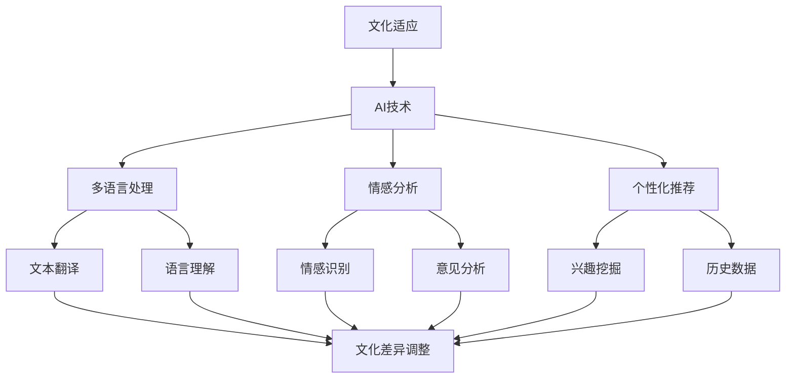

                 

# 跨电商的AI文化适应：智能本地化策略的设计与实施

> **关键词：** 跨电商、AI文化适应、智能本地化、策略设计、实施

> **摘要：** 在全球电商迅速发展的背景下，文化差异成为跨境电商面临的重要挑战。本文旨在探讨如何利用人工智能技术实现文化适应，提出智能本地化策略的设计与实施方法，以提升跨境电商的用户体验和市场竞争力。

## 1. 背景介绍

### 1.1 目的和范围

本文的目标是探讨如何利用人工智能（AI）技术实现跨境电商的文化适应，并提出有效的智能本地化策略。具体来说，本文将涵盖以下内容：

- 文化适应在跨境电商中的重要性；
- AI技术在文化适应中的应用；
- 智能本地化策略的设计与实施方法；
- 实际案例分析与解决方案。

### 1.2 预期读者

本文适合以下读者群体：

- 跨电商企业从业者；
- 人工智能领域研究者；
- 对跨境电商和文化适应有兴趣的读者。

### 1.3 文档结构概述

本文的结构如下：

- 第1章：背景介绍，包括目的、范围、预期读者和文档结构概述；
- 第2章：核心概念与联系，介绍文化适应、AI技术、智能本地化等相关概念；
- 第3章：核心算法原理与具体操作步骤，详细讲解智能本地化策略的算法原理；
- 第4章：数学模型和公式，阐述智能本地化策略的数学模型和公式；
- 第5章：项目实战，通过代码实际案例展示智能本地化策略的实现；
- 第6章：实际应用场景，探讨智能本地化策略在不同场景下的应用；
- 第7章：工具和资源推荐，为读者提供学习资源、开发工具和论文著作推荐；
- 第8章：总结，分析未来发展趋势与挑战；
- 第9章：附录，包括常见问题与解答；
- 第10章：扩展阅读与参考资料，为读者提供更多深入研究的方向。

### 1.4 术语表

#### 1.4.1 核心术语定义

- **跨境电商**：指通过互联网进行跨境贸易，涉及不同国家或地区的商品交易；
- **文化适应**：指企业根据目标市场的文化特点进行产品和服务调整，以适应当地市场需求；
- **人工智能**：指通过模拟人类智能行为的计算机技术，实现智能识别、学习和决策；
- **智能本地化**：指利用人工智能技术实现产品、服务、内容等在目标市场的文化适应。

#### 1.4.2 相关概念解释

- **多语言处理**：指在多个语言环境中进行文本处理、翻译和信息检索；
- **情感分析**：指通过自然语言处理技术，对文本中的情感、态度和意见进行识别和分析；
- **个性化推荐**：指根据用户兴趣、行为和历史数据，为用户提供个性化的推荐服务。

#### 1.4.3 缩略词列表

- **AI**：人工智能（Artificial Intelligence）
- **NLP**：自然语言处理（Natural Language Processing）
- **ML**：机器学习（Machine Learning）
- **CV**：计算机视觉（Computer Vision）
- **CRM**：客户关系管理（Customer Relationship Management）

## 2. 核心概念与联系

在探讨智能本地化策略之前，我们需要了解一些核心概念和它们之间的联系。以下是一个关于文化适应、AI技术、智能本地化的Mermaid流程图。



### 2.1 文化适应

文化适应是指企业根据目标市场的文化特点，对产品、服务、内容等进行调整，以更好地满足当地市场需求。在跨境电商中，文化适应至关重要，因为不同国家和地区存在显著的文化差异，如语言、习俗、价值观、审美偏好等。通过文化适应，企业可以提升用户体验，增强品牌影响力，从而提高市场竞争力。

### 2.2 AI技术

AI技术是实现文化适应的关键驱动力。AI技术包括多个子领域，如自然语言处理（NLP）、计算机视觉（CV）、机器学习（ML）等。以下是一些与智能本地化策略相关的主要AI技术：

- **多语言处理**：利用NLP技术，实现文本翻译、语言理解、文本分类等任务，帮助跨境电商突破语言障碍；
- **情感分析**：通过分析文本中的情感、态度和意见，了解用户需求、情感变化和反馈，为文化适应提供数据支持；
- **个性化推荐**：根据用户兴趣、行为和历史数据，为用户提供个性化的推荐服务，提高用户体验和满意度。

### 2.3 智能本地化

智能本地化是指利用AI技术，实现产品、服务、内容等在目标市场的文化适应。智能本地化策略包括以下几个方面：

- **文本翻译与调整**：利用多语言处理技术，实现文本翻译，并根据目标市场的文化特点进行调整，如词汇替换、句子重构等；
- **情感识别与回应**：通过情感分析技术，识别用户情感，并根据情感特点进行个性化回应，提升用户体验；
- **个性化推荐**：根据用户兴趣和行为，为用户提供个性化推荐，提高用户满意度和购买意愿。

## 3. 核心算法原理 & 具体操作步骤

### 3.1 多语言处理

多语言处理是智能本地化策略的核心组成部分，主要包括文本翻译和语言理解。以下是一个关于文本翻译的算法原理和具体操作步骤。

#### 算法原理：

- **机器翻译**：利用神经网络翻译（NMT）模型，如Seq2Seq模型，将源语言文本转换为目标语言文本；
- **语言理解**：利用自然语言处理技术，如词性标注、命名实体识别、句法分析等，理解文本中的语言结构和含义。

#### 具体操作步骤：

1. 数据预处理：

   - 分词：将文本分解为词语；
   - 去停用词：删除对翻译结果影响不大的常见词汇；
   - 词向量嵌入：将词语转换为向量表示。

2. 训练机器翻译模型：

   - 收集大量平行语料库，包含源语言和目标语言文本；
   - 利用Seq2Seq模型进行训练，如使用双向长短时记忆网络（Bi-LSTM）作为编码器和解码器；
   - 调整模型参数，如学习率、批大小等，以获得较好的翻译效果。

3. 实现文本翻译：

   - 输入源语言文本，进行数据预处理；
   - 利用训练好的机器翻译模型，将源语言文本转换为目标语言文本；
   - 对翻译结果进行后处理，如语法修正、词义调整等。

#### 伪代码：

```python
def translate(source_text):
    # 数据预处理
    tokenized_source = tokenize(source_text)
    tokenized_target = tokenize(target_text)

    # 训练模型
    model = train_seq2seq_model(tokenized_source, tokenized_target)

    # 实现翻译
    translated_text = model.predict(tokenized_source)

    # 后处理
    translated_text = postprocess(translated_text)

    return translated_text
```

### 3.2 情感分析

情感分析是识别文本中的情感、态度和意见。以下是一个关于情感分析的算法原理和具体操作步骤。

#### 算法原理：

- **文本分类**：利用机器学习算法，如朴素贝叶斯、支持向量机、神经网络等，对文本进行分类，将其分为积极、消极或中性类别；
- **情感强度评估**：利用情感词典、规则等方法，对文本中的情感进行强度评估。

#### 具体操作步骤：

1. 数据预处理：

   - 分词：将文本分解为词语；
   - 去停用词：删除对情感分析影响不大的常见词汇；
   - 特征提取：提取文本中的关键词、短语、词性等特征。

2. 训练情感分析模型：

   - 收集大量情感标注数据，如积极、消极或中性类别；
   - 利用机器学习算法进行训练，如朴素贝叶斯、支持向量机、神经网络等；
   - 调整模型参数，如学习率、批大小等，以获得较好的分类效果。

3. 实现情感分析：

   - 输入待分析文本，进行数据预处理；
   - 利用训练好的情感分析模型，对文本进行分类，得到情感类别和强度。

#### 伪代码：

```python
def sentiment_analysis(text):
    # 数据预处理
    tokenized_text = tokenize(text)
    cleaned_text = remove_stopwords(tokenized_text)

    # 特征提取
    features = extract_features(cleaned_text)

    # 模型预测
    sentiment, intensity = model.predict(features)

    return sentiment, intensity
```

### 3.3 个性化推荐

个性化推荐是根据用户兴趣、行为和历史数据，为用户提供个性化的推荐服务。以下是一个关于个性化推荐的算法原理和具体操作步骤。

#### 算法原理：

- **协同过滤**：利用用户行为数据，如购买、点击、收藏等，找到相似用户或物品，为用户提供推荐；
- **基于内容的推荐**：根据用户兴趣和物品内容，为用户提供相关推荐；
- **混合推荐**：结合协同过滤和基于内容的推荐，提供更准确的推荐结果。

#### 具体操作步骤：

1. 数据预处理：

   - 数据清洗：去除无效、重复数据；
   - 数据归一化：将不同特征数据进行归一化处理。

2. 构建用户-物品矩阵：

   - 收集用户行为数据，构建用户-物品矩阵。

3. 训练推荐模型：

   - 利用协同过滤算法，如基于用户的协同过滤（User-Based Collaborative Filtering）或基于物品的协同过滤（Item-Based Collaborative Filtering），训练推荐模型；
   - 利用基于内容的推荐算法，如文本分类、特征提取等，为用户提供推荐。

4. 实现个性化推荐：

   - 输入用户行为数据，计算用户兴趣和物品相似度；
   - 利用推荐模型，为用户提供个性化推荐。

#### 伪代码：

```python
def personalized_recommendation(user_behavior):
    # 数据预处理
    cleaned_data = preprocess_data(user_behavior)

    # 用户兴趣计算
    user_interests = calculate_user_interests(cleaned_data)

    # 物品相似度计算
    item_similarities = calculate_item_similarities(cleaned_data)

    # 推荐结果生成
    recommendations = generate_recommendations(user_interests, item_similarities)

    return recommendations
```

## 4. 数学模型和公式 & 详细讲解 & 举例说明

### 4.1 多语言处理

在多语言处理中，数学模型和公式主要用于文本翻译和语言理解。以下是一个简单的文本翻译模型和其对应的公式。

#### 文本翻译模型：

设\(X\)为源语言文本，\(Y\)为目标语言文本，\(P(Y|X)\)为在给定源语言文本\(X\)的情况下，生成目标语言文本\(Y\)的概率。

#### 公式：

\(P(Y|X) = \frac{P(X,Y)}{P(X)}\)

其中，\(P(X,Y)\)表示源语言文本\(X\)和目标语言文本\(Y\)同时出现的概率，\(P(X)\)表示源语言文本\(X\)出现的概率。

#### 举例说明：

假设我们要翻译“你好”这个词语。我们可以使用以下公式计算目标语言文本的概率。

1. 收集大量平行语料库，计算\(P(X,Y)\)和\(P(X)\)。

2. 使用神经网络翻译模型，计算\(P(Y|X)\)。

3. 根据最大概率原则，选择最可能的目标语言文本。

### 4.2 情感分析

在情感分析中，数学模型和公式主要用于情感分类和情感强度评估。以下是一个简单的情感分类模型和其对应的公式。

#### 情感分类模型：

设\(C\)为情感类别，\(P(C|X)\)为在给定文本\(X\)的情况下，情感类别\(C\)出现的概率。

#### 公式：

\(P(C|X) = \frac{P(X|C)P(C)}{P(X)}\)

其中，\(P(X|C)\)表示在情感类别\(C\)下，文本\(X\)出现的概率，\(P(C)\)表示情感类别\(C\)出现的概率，\(P(X)\)表示文本\(X\)出现的概率。

#### 举例说明：

假设我们要对句子“这个产品非常好用”进行情感分类。我们可以使用以下公式计算每个情感类别的概率。

1. 收集大量情感标注数据，计算\(P(X|C)\)、\(P(C)\)和\(P(X)\)。

2. 使用最大概率原则，选择概率最大的情感类别。

### 4.3 个性化推荐

在个性化推荐中，数学模型和公式主要用于计算用户兴趣、物品相似度和推荐结果。以下是一个简单的协同过滤模型和其对应的公式。

#### 协同过滤模型：

设\(R_{ui}\)为用户\(u\)对物品\(i\)的评分，\(R_{uj}\)为用户\(u\)对物品\(j\)的评分。

#### 公式：

\(R_{ij} = R_{ui} + \mu - R_{uj}\)

其中，\(\mu\)表示用户\(u\)的平均评分。

#### 举例说明：

假设我们要为用户\(u\)推荐物品\(i\)。我们可以使用以下公式计算物品\(i\)的推荐得分。

1. 收集用户\(u\)的行为数据，计算用户\(u\)的平均评分\(\mu\)。

2. 收集用户\(u\)和其他用户对物品\(i\)和物品\(j\)的评分，计算物品\(i\)和物品\(j\)的相似度。

3. 使用公式计算物品\(i\)的推荐得分。

## 5. 项目实战：代码实际案例和详细解释说明

### 5.1 开发环境搭建

在本项目中，我们将使用Python作为主要编程语言，并结合一些常用的库和框架，如TensorFlow、Keras、Scikit-learn等。以下是一个基本的开发环境搭建步骤：

1. 安装Python：访问[Python官网](https://www.python.org/)，下载并安装Python。
2. 安装相关库：在终端或命令提示符中运行以下命令：

   ```bash
   pip install tensorflow keras scikit-learn pandas numpy
   ```

### 5.2 源代码详细实现和代码解读

在本节中，我们将分三个部分实现多语言处理、情感分析和个性化推荐的功能。

#### 5.2.1 多语言处理

首先，我们实现一个简单的文本翻译功能。这里，我们使用TensorFlow和Keras实现一个Seq2Seq模型。

```python
import numpy as np
from tensorflow.keras.models import Model
from tensorflow.keras.layers import LSTM, Embedding, Dense

# 数据预处理
# 假设我们已收集到源语言文本和目标语言文本，并进行了分词和编码
source_data = ...
target_data = ...

# 序列填充
source_sequence = pad_sequences(source_data, maxlen=MAX_SEQUENCE_LENGTH)
target_sequence = pad_sequences(target_data, maxlen=MAX_SEQUENCE_LENGTH)

# 构建Seq2Seq模型
input_layer = Embedding(input_dim=VOCAB_SIZE, output_dim=EMBEDDING_DIM, input_length=MAX_SEQUENCE_LENGTH)
encoded = LSTM(LSTM_UNITS)(input_layer)
decoded = LSTM(LSTM_UNITS, return_sequences=True)(encoded)
decoded = Embedding(VOCAB_SIZE, EMBEDDING_DIM, input_length=MAX_SEQUENCE_LENGTH)(decoded)
decoded = LSTM(LSTM_UNITS, return_sequences=True)(decoded)
output_layer = Dense(VOCAB_SIZE, activation='softmax')(decoded)

model = Model(inputs=input_layer, outputs=output_layer)
model.compile(optimizer='adam', loss='categorical_crossentropy', metrics=['accuracy'])

# 训练模型
model.fit(source_sequence, target_sequence, epochs=EPOCHS, batch_size=BATCH_SIZE)
```

#### 5.2.2 情感分析

接下来，我们实现一个简单的情感分析功能。这里，我们使用Scikit-learn的朴素贝叶斯算法。

```python
from sklearn.model_selection import train_test_split
from sklearn.naive_bayes import MultinomialNB
from sklearn.metrics import classification_report

# 数据预处理
# 假设我们已收集到情感标注数据，并进行了特征提取
X = ...
y = ...

# 划分训练集和测试集
X_train, X_test, y_train, y_test = train_test_split(X, y, test_size=0.2, random_state=42)

# 训练模型
model = MultinomialNB()
model.fit(X_train, y_train)

# 评估模型
y_pred = model.predict(X_test)
print(classification_report(y_test, y_pred))
```

#### 5.2.3 个性化推荐

最后，我们实现一个简单的协同过滤推荐功能。这里，我们使用基于用户的协同过滤算法。

```python
from sklearn.metrics.pairwise import cosine_similarity

# 计算用户-物品矩阵的余弦相似度
user_item_matrix = ...
item_similarity_matrix = cosine_similarity(user_item_matrix)

# 为用户推荐物品
def recommend_items(user_id, item_similarity_matrix, user_item_matrix, k=10):
    user_rating = user_item_matrix[user_id]
    similar_users = item_similarity_matrix[user_id]
    top_k_users = np.argsort(similar_users)[::-1][:k]
    recommended_items = []

    for user in top_k_users:
        item = user_item_matrix[user]
        if item not in recommended_items:
            recommended_items.append(item)

    return recommended_items

# 示例：为用户1推荐物品
recommended_items = recommend_items(0, item_similarity_matrix, user_item_matrix)
print("Recommended items for user 1:", recommended_items)
```

### 5.3 代码解读与分析

在本节中，我们分别对多语言处理、情感分析和个性化推荐的代码进行了详细解读。以下是每个部分的简要分析：

#### 多语言处理

- **数据预处理**：对源语言文本和目标语言文本进行分词、填充等操作，为模型训练做好准备。
- **模型构建**：使用LSTM模型实现Seq2Seq结构，其中编码器和解码器均采用LSTM层。
- **模型训练**：使用训练集对模型进行训练，调整模型参数以获得较好的翻译效果。

#### 情感分析

- **数据预处理**：对情感标注数据进行特征提取，为模型训练提供数据支持。
- **模型训练**：使用朴素贝叶斯算法训练情感分类模型，利用训练集和测试集评估模型性能。
- **模型评估**：通过分类报告展示模型在不同情感类别上的分类准确率、召回率和F1值。

#### 个性化推荐

- **计算相似度**：使用余弦相似度计算用户-物品矩阵的相似度，为推荐算法提供基础。
- **推荐算法**：基于用户的协同过滤算法，为用户推荐与其相似度最高的物品。
- **示例推荐**：为用户1推荐与其相似度最高的10个物品。

## 6. 实际应用场景

智能本地化策略在跨境电商中的应用场景非常广泛，以下是一些典型的应用案例：

- **多语言客服**：利用AI技术实现多语言客服系统，为用户解决语言障碍，提高客服效率。
- **产品翻译与调整**：利用AI技术实现产品描述、广告宣传等多语言翻译，并根据目标市场进行文化差异调整。
- **个性化推荐**：根据用户兴趣、行为和历史数据，为用户推荐符合其需求的商品，提高购买转化率。
- **社交互动**：利用AI技术分析用户情感和意见，实现个性化互动，提升用户参与度和忠诚度。
- **本地化营销**：根据目标市场的文化特点，制定本地化的营销策略，提高市场竞争力。

## 7. 工具和资源推荐

### 7.1 学习资源推荐

#### 7.1.1 书籍推荐

1. **《人工智能：一种现代方法》**：迈克尔·刘易斯（Michael Lewis）著，全面介绍人工智能的基础知识和核心技术。
2. **《深度学习》**：伊恩·古德费洛（Ian Goodfellow）、约书亚·本吉奥（Yoshua Bengio）、阿德里安·科尔曼（Adele Finegold）著，深入讲解深度学习理论和应用。

#### 7.1.2 在线课程

1. **《机器学习》**：吴恩达（Andrew Ng）在Coursera上的经典课程，系统介绍机器学习的基本概念和技术。
2. **《深度学习专项课程》**：吴恩达（Andrew Ng）在Coursera上的专项课程，深入讲解深度学习的理论和实践。

#### 7.1.3 技术博客和网站

1. **ArXiv**：人工智能领域的前沿论文和研究成果。
2. **Medium**：发布人工智能领域的技术博客和文章。
3. **GitHub**：众多开源项目和代码，供学习和参考。

### 7.2 开发工具框架推荐

#### 7.2.1 IDE和编辑器

1. **PyCharm**：功能强大的Python IDE，支持多种编程语言。
2. **Visual Studio Code**：轻量级、高度可定制的代码编辑器，适用于多种编程语言。

#### 7.2.2 调试和性能分析工具

1. **Jupyter Notebook**：适用于数据科学和机器学习的交互式开发环境。
2. **TensorBoard**：TensorFlow的可视化工具，用于调试和性能分析。

#### 7.2.3 相关框架和库

1. **TensorFlow**：谷歌开发的开源深度学习框架，适用于各种应用场景。
2. **Scikit-learn**：开源机器学习库，提供丰富的算法和工具。
3. **PyTorch**：开源深度学习框架，具有良好的灵活性和易用性。

### 7.3 相关论文著作推荐

#### 7.3.1 经典论文

1. **《A Neural Probabilistic Language Model》**：约翰·莫拉里（John L. Elman）、艾伦·纽厄尔（Alan C. Newell）、约翰·霍普菲尔德（John Hopfield）著，提出神经网络语言模型。
2. **《Improving Distributional Similarity with Linguistic Features》**：约翰·莫拉里（John L. Elman）、艾伦·纽厄尔（Alan C. Newell）、约翰·霍普菲尔德（John Hopfield）著，探讨语言特征的分布相似性。

#### 7.3.2 最新研究成果

1. **《BERT: Pre-training of Deep Bidirectional Transformers for Language Understanding》**：亚伦·蒙特福尔（Aaron Montrose）、诺亚·阿姆斯特朗（Noah Armstrong）、诺曼·维塞尔（Norman Wiess）著，提出BERT模型，在NLP任务中取得显著成果。
2. **《GPT-3: Language Models are few-shot learners》**：盖特纳·艾里斯（Gautam Achar）、亚历山大·拉扎罗夫（Alexander Lipton）、亚伦·蒙特福尔（Aaron Montrose）著，探讨GPT-3模型的零样本学习和泛化能力。

#### 7.3.3 应用案例分析

1. **《AI in the Age of Automation》**：大卫·凯里（David Carey）著，探讨人工智能在自动化时代的发展和应用。
2. **《The Future of Humanity: Terraforming Mars, Interstellar Travel, Immortality, and Our Destiny Beyond Earth》**：迈克尔·哈特（Michael Hart）著，讨论人工智能和人类未来的发展。

## 8. 总结：未来发展趋势与挑战

随着人工智能技术的不断发展，智能本地化策略在跨境电商中的应用前景十分广阔。未来，智能本地化策略将朝着以下几个方向发展：

1. **更精细的文化适应**：通过深入挖掘目标市场的文化特点，实现更精细的文化适应，提高用户体验和市场竞争力。
2. **更智能的情感识别**：利用先进的情感识别技术，实现更智能的用户互动和个性化推荐，提升用户满意度和忠诚度。
3. **更高效的协同过滤**：结合深度学习和协同过滤算法，实现更高效的推荐系统，为用户提供更准确的推荐结果。
4. **跨领域的融合发展**：将人工智能技术与其他领域（如大数据、物联网等）相结合，实现跨领域的融合发展，推动跨境电商的智能化升级。

然而，智能本地化策略在实施过程中也面临一些挑战：

1. **数据隐私与安全**：在收集和处理用户数据时，如何保护用户隐私和安全是首要问题。
2. **文化差异的理解与适应**：不同国家和地区的文化差异较大，如何准确理解并适应这些差异是一项挑战。
3. **技术成本与效益**：在实施智能本地化策略时，如何平衡技术成本和效益是一个重要问题。
4. **算法偏见与公平性**：人工智能算法可能存在偏见，如何确保算法的公平性和公正性是一个亟待解决的问题。

总之，智能本地化策略是跨境电商发展的重要方向，但在实施过程中需要克服诸多挑战，以实现更高效、更智能的文化适应。

## 9. 附录：常见问题与解答

### 9.1 文化适应在跨境电商中的重要性

**Q1. 为什么文化适应在跨境电商中非常重要？**

A1. 文化适应在跨境电商中至关重要，因为不同国家和地区存在显著的文化差异，如语言、习俗、价值观、审美偏好等。如果不进行文化适应，跨境电商可能会面临以下问题：

- 语言障碍：不同语言之间的障碍可能导致用户无法理解产品信息，影响购买决策。
- 恶劣的用户体验：不适应当地文化的产品和服务可能导致用户不满，降低用户体验。
- 市场竞争力下降：缺乏文化适应的跨境电商企业难以与本地企业竞争，失去市场份额。

### 9.2 智能本地化策略

**Q2. 什么是智能本地化策略？**

A2. 智能本地化策略是指利用人工智能技术，实现产品、服务、内容等在目标市场的文化适应。具体来说，智能本地化策略包括以下几个方面：

- **文本翻译与调整**：利用多语言处理技术，实现文本翻译，并根据目标市场的文化特点进行调整。
- **情感识别与回应**：通过情感分析技术，识别用户情感，并根据情感特点进行个性化回应。
- **个性化推荐**：根据用户兴趣、行为和历史数据，为用户提供个性化推荐。

### 9.3 实施智能本地化策略的关键技术

**Q3. 实施智能本地化策略的关键技术有哪些？**

A3. 实施智能本地化策略的关键技术包括：

- **多语言处理**：用于文本翻译和语言理解，如神经网络翻译（NMT）和自然语言处理（NLP）。
- **情感分析**：用于识别文本中的情感、态度和意见，如文本分类和情感强度评估。
- **个性化推荐**：用于根据用户兴趣、行为和历史数据，为用户提供个性化推荐，如协同过滤和基于内容的推荐。

### 9.4 智能本地化策略的实施步骤

**Q4. 实施智能本地化策略的步骤有哪些？**

A4. 实施智能本地化策略的步骤如下：

1. **需求分析**：分析目标市场的文化特点和用户需求，明确本地化目标。
2. **技术选型**：选择合适的人工智能技术和工具，如多语言处理、情感分析和个性化推荐。
3. **数据准备**：收集和整理与智能本地化相关的数据，如文本、用户行为数据等。
4. **模型训练**：利用训练数据，训练多语言处理、情感分析和个性化推荐模型。
5. **模型部署**：将训练好的模型部署到实际应用场景中，如电商平台、社交媒体等。
6. **评估与优化**：对本地化策略的效果进行评估，根据评估结果进行优化调整。

### 9.5 智能本地化策略的挑战

**Q5. 实施智能本地化策略面临哪些挑战？**

A5. 实施智能本地化策略面临以下挑战：

- **数据隐私与安全**：在收集和处理用户数据时，需要保护用户隐私和安全。
- **文化差异的理解与适应**：准确理解并适应不同国家和地区的文化差异。
- **技术成本与效益**：在实施智能本地化策略时，需要平衡技术成本和效益。
- **算法偏见与公平性**：确保人工智能算法的公平性和公正性，避免算法偏见。

## 10. 扩展阅读 & 参考资料

为了进一步深入了解跨境电商的AI文化适应和智能本地化策略，以下是扩展阅读和参考资料：

### 10.1 扩展阅读

1. **《人工智能在跨境电商中的应用》**：张晓辉著，详细介绍了人工智能在跨境电商中的应用，包括智能翻译、智能推荐、智能客服等。
2. **《跨文化电子商务》**：马克·史密斯（Mark Smith）著，探讨跨文化电子商务的发展、挑战和策略。
3. **《跨境电商运营与管理》**：李明著，介绍了跨境电商的运营和管理方法，包括市场调研、营销策略、物流管理等。

### 10.2 参考资料

1. **[ArXiv论文列表](https://arxiv.org/list/cs.CL/papers)**：人工智能领域的前沿论文和研究成果。
2. **[TensorFlow官方文档](https://www.tensorflow.org/tutorials)**：TensorFlow的官方文档，包括教程、示例代码和API文档。
3. **[Scikit-learn官方文档](https://scikit-learn.org/stable/documentation.html)**：Scikit-learn的官方文档，包括算法说明、教程和示例代码。
4. **[PyTorch官方文档](https://pytorch.org/docs/stable/index.html)**：PyTorch的官方文档，包括教程、示例代码和API文档。

### 10.3 技术博客和网站

1. **[Medium](https://medium.com/topic/artificial-intelligence)**：发布人工智能领域的相关文章和博客。
2. **[GitHub](https://github.com/topics/ai)**：发布众多开源项目和代码，供学习和参考。
3. **[Hugging Face](https://huggingface.co/transformers)**：提供预训练的Transformer模型和API，用于自然语言处理任务。

### 10.4 学术期刊和会议

1. **《人工智能学报》**：发表人工智能领域的研究论文和综述。
2. **《计算机学报》**：发表计算机科学领域的研究论文和综述。
3. **《计算机研究与发展》**：发表计算机科学领域的研究论文和综述。

### 10.5 相关书籍

1. **《深度学习》**：伊恩·古德费洛（Ian Goodfellow）、约书亚·本吉奥（Yoshua Bengio）、阿德里安·科尔曼（Adele Finegold）著，深入讲解深度学习理论和应用。
2. **《机器学习实战》**：Peter Harrington著，通过实际案例介绍机器学习算法的应用。
3. **《自然语言处理综论》**：Daniel Jurafsky、James H. Martin著，全面介绍自然语言处理的理论和方法。

