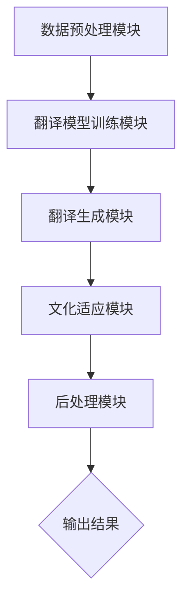

                 

### 跨境电商的AI语言本地化：自动化翻译与文化适应系统

#### 关键词：
- 跨境电商
- AI语言本地化
- 自动化翻译
- 文化适应
- 机器学习
- 自然语言处理

#### 摘要：
本文旨在探讨如何利用人工智能（AI）技术实现跨境电商中的语言本地化，重点关注自动化翻译与文化适应系统的构建。文章首先介绍了跨境电商的背景和现状，随后详细阐述了AI语言本地化的核心概念、原理与实现方法。通过实际案例和数学模型的分析，文章揭示了该技术的应用前景和面临的挑战。最后，本文推荐了相关学习资源和开发工具，并对未来的发展趋势进行了展望。

## 1. 背景介绍

### 1.1 目的和范围

随着全球化的深入推进，跨境电商已成为国际贸易的新趋势。然而，语言和文化差异成为跨境交易的瓶颈，限制了市场扩展和消费者体验。本文旨在通过探讨AI语言本地化技术，解决跨境电商中的语言障碍和文化隔阂，提高翻译质量和用户体验。

本文范围涵盖：
- 跨境电商背景与挑战
- AI语言本地化的核心概念和实现方法
- 自动化翻译与文化适应系统的构建
- 实际应用场景与未来发展趋势

### 1.2 预期读者

本文面向以下读者群体：
- 跨境电商从业者
- 人工智能和自然语言处理领域研究者
- 计算机编程和软件开发工程师
- 对跨境电商和文化适应有兴趣的普通读者

### 1.3 文档结构概述

本文结构如下：
1. 背景介绍
   - 跨境电商背景与挑战
   - AI语言本地化的核心概念和实现方法
2. 核心概念与联系
   - AI语言本地化的核心概念原理和架构
3. 核心算法原理 & 具体操作步骤
   - 自动化翻译算法原理讲解
4. 数学模型和公式 & 详细讲解 & 举例说明
   - 数学模型和公式分析
5. 项目实战：代码实际案例和详细解释说明
   - 开发环境搭建与代码实现
6. 实际应用场景
   - 跨境电商中的AI语言本地化应用
7. 工具和资源推荐
   - 学习资源推荐
   - 开发工具框架推荐
   - 相关论文著作推荐
8. 总结：未来发展趋势与挑战
9. 附录：常见问题与解答
10. 扩展阅读 & 参考资料

### 1.4 术语表

#### 1.4.1 核心术语定义

- **跨境电商**：指在互联网的平台上，买卖双方跨越地理边界进行商品交易的电子商务活动。
- **AI语言本地化**：利用人工智能技术实现跨语言翻译和文化适应，以满足不同语言和文化背景的用户需求。
- **自动化翻译**：利用机器学习模型自动将一种语言的文本翻译成另一种语言的文本。
- **文化适应**：根据目标文化的特点，调整翻译内容，使其更符合目标用户的语言习惯和文化背景。
- **自然语言处理（NLP）**：使用计算机技术和算法处理和分析人类自然语言文本。

#### 1.4.2 相关概念解释

- **机器翻译（MT）**：使用计算机程序将一种语言的文本自动翻译成另一种语言的文本。
- **神经网络机器翻译（NMT）**：基于深度学习技术的机器翻译方法，利用神经网络模型进行文本翻译。
- **翻译记忆（TM）**：将已经翻译过的文本片段存储起来，用于后续翻译任务，提高翻译一致性和效率。
- **多语言词典（MDL）**：包含多种语言的词汇、短语和表达方式的词典，用于辅助翻译任务。

#### 1.4.3 缩略词列表

- **AI**：人工智能（Artificial Intelligence）
- **NLP**：自然语言处理（Natural Language Processing）
- **NMT**：神经网络机器翻译（Neural Machine Translation）
- **TM**：翻译记忆（Translation Memory）
- **MDL**：多语言词典（Multilingual Dictionary）

## 2. 核心概念与联系

### 2.1 AI语言本地化的核心概念原理和架构

AI语言本地化是利用人工智能技术实现跨语言翻译和文化适应，以提升跨境电商用户体验和交易成功率。其核心概念包括：

1. **自然语言处理（NLP）**：NLP是AI语言本地化的基础，通过文本分析、语义理解和文本生成等技术，实现文本的自动化翻译和文化适应。
2. **机器翻译（MT）**：MT是AI语言本地化的关键环节，利用机器学习算法和神经网络模型，将源语言文本翻译成目标语言文本。
3. **神经网络机器翻译（NMT）**：NMT是当前最为先进的MT技术，基于深度学习和神经网络模型，具有更高的翻译质量和效率。
4. **翻译记忆（TM）**：TM是一种用于提高翻译效率的技术，通过存储已经翻译过的文本片段，实现翻译一致性和复用。
5. **文化适应**：文化适应是AI语言本地化的高级阶段，通过调整翻译内容，使其更符合目标文化的语言习惯和价值观。

### 2.2 AI语言本地化系统的架构

一个典型的AI语言本地化系统通常包括以下几个关键组件：

1. **数据预处理模块**：负责对源语言和目标语言文本进行清洗、分词和词性标注等预处理操作，为后续的翻译任务提供高质量的数据。
2. **翻译模型训练模块**：利用大量双语语料库，通过机器学习和深度学习算法，训练出高质量的翻译模型，包括编码器和解码器。
3. **翻译生成模块**：根据源语言文本，利用训练好的翻译模型，生成目标语言文本。
4. **文化适应模块**：对翻译结果进行文化适应处理，调整语言表达方式和文化元素，使其更符合目标文化。
5. **后处理模块**：对翻译结果进行语法检查、拼写修正和格式调整等操作，提高翻译质量和用户体验。

### 2.3 Mermaid 流程图

以下是一个简化的AI语言本地化系统流程图：



通过上述流程，AI语言本地化系统能够实现从源语言到目标语言的翻译，并适应不同文化背景，为跨境电商提供高效、精准的语言服务。

## 3. 核心算法原理 & 具体操作步骤

### 3.1 自动化翻译算法原理讲解

自动化翻译是AI语言本地化的核心环节，其核心原理主要基于机器学习和深度学习技术。以下将详细阐述神经网络机器翻译（NMT）的算法原理和具体操作步骤。

#### 3.1.1 神经网络机器翻译（NMT）算法原理

神经网络机器翻译（NMT）是一种基于深度学习的机器翻译方法，其基本原理如下：

1. **编码器（Encoder）**：将源语言文本编码成一个固定长度的向量表示，称为“编码器输出向量”或“上下文向量”。
2. **解码器（Decoder）**：根据编码器输出向量生成目标语言文本。解码器通常采用循环神经网络（RNN）或变换器（Transformer）结构，以实现对文本序列的建模。
3. **注意力机制（Attention）**：注意力机制是NMT算法中的一个关键组件，用于解决长距离依赖问题。通过计算编码器输出向量与解码器隐藏状态之间的相似度，为解码器提供不同时间步的重要信息。

#### 3.1.2 具体操作步骤

1. **数据预处理**：
   - **文本清洗**：去除文本中的无关信息，如HTML标签、特殊字符等。
   - **分词**：将文本拆分为单词或字符序列，以便于后续处理。
   - **词向量化**：将单词或字符序列映射为向量表示，用于输入到神经网络。

2. **编码器训练**：
   - **输入序列编码**：将源语言文本序列输入到编码器，通过编码器将文本序列编码为上下文向量。
   - **损失函数计算**：利用训练数据集，计算编码器输出向量和目标语言文本之间的损失函数，如交叉熵损失。
   - **反向传播**：根据损失函数，利用梯度下降等优化算法更新编码器参数。

3. **解码器训练**：
   - **初始状态**：初始化解码器隐藏状态，通常为编码器输出向量的一个线性变换。
   - **生成目标文本**：在解码器中，根据当前隐藏状态和编码器输出向量生成目标语言文本的每个词。
   - **损失函数计算**：计算解码器生成的目标语言文本和实际目标语言文本之间的损失函数。
   - **反向传播**：根据损失函数，利用梯度下降等优化算法更新解码器参数。

4. **翻译生成**：
   - **输入源语言文本**：将待翻译的源语言文本输入到训练好的编码器和解码器中。
   - **生成目标文本**：根据解码器的输出，生成目标语言文本。
   - **后处理**：对生成的目标文本进行语法检查、拼写修正和格式调整等操作，提高翻译质量。

#### 3.1.3 伪代码

以下是一个简化的NMT算法伪代码：

```python
# 编码器训练
for epoch in range(num_epochs):
    for source_sentence, target_sentence in data_loader:
        # 清洗、分词和词向量化
        source_tokens = preprocess(source_sentence)
        target_tokens = preprocess(target_sentence)
        
        # 编码器输出向量
        context_vector = encoder(source_tokens)
        
        # 初始化解码器隐藏状态
        hidden_state = init_decoder_state(context_vector)
        
        # 解码器生成目标文本
        target_tokens_generated = decoder(target_tokens, hidden_state)
        
        # 计算损失函数
        loss = compute_loss(target_tokens_generated, target_tokens)
        
        # 反向传播和参数更新
        optimizer.zero_grad()
        loss.backward()
        optimizer.step()

# 翻译生成
source_sentence = "你好，欢迎来到我们的商店！"
context_vector = encoder(preprocess(source_sentence))

# 初始化解码器隐藏状态
hidden_state = init_decoder_state(context_vector)

# 生成目标文本
target_tokens_generated = decoder(None, hidden_state)

# 后处理
translated_sentence = postprocess(target_tokens_generated)
print(translated_sentence)
```

通过上述算法和具体操作步骤，AI语言本地化系统能够实现高质量的自动化翻译，为跨境电商提供便捷的语言服务。

## 4. 数学模型和公式 & 详细讲解 & 举例说明

### 4.1 数学模型

在AI语言本地化系统中，神经网络机器翻译（NMT）的核心模型是基于深度学习技术的编码器-解码器架构。以下是NMT中的一些关键数学模型和公式：

#### 4.1.1 编码器（Encoder）

编码器的主要任务是接受源语言文本序列，并生成一个固定长度的上下文向量，用于指导解码器的翻译过程。

1. **输入层**：源语言文本序列 $X = [x_1, x_2, \ldots, x_T]$，其中 $x_t$ 表示第 $t$ 个单词的词向量。
2. **隐藏层**：编码器通过循环神经网络（RNN）或变换器（Transformer）结构，将输入序列编码为上下文向量 $C$。

   对于RNN编码器：

   $$ h_t = \text{RNN}(h_{t-1}, x_t) $$

   $$ C = h_T = \text{RNN}([h_0, h_1, \ldots, h_T]) $$

   对于Transformer编码器：

   $$ C = \text{Transformer}(X) $$

#### 4.1.2 解码器（Decoder）

解码器的主要任务是根据编码器输出的上下文向量，生成目标语言文本序列。

1. **初始状态**：解码器初始化隐藏状态 $s_0$，通常为编码器输出向量的一个线性变换。

   $$ s_0 = \text{init_state}(C) $$

2. **输出层**：解码器逐词生成目标语言文本序列 $Y = [y_1, y_2, \ldots, y_U]$，其中 $y_u$ 表示第 $u$ 个单词的词向量。

   $$ y_u = \text{softmax}(\text{Decoder}(s_{u-1}, C)) $$

   其中，$\text{Decoder}$ 是解码器的线性变换层，$\text{softmax}$ 函数用于将输出概率分布转换为单词索引。

#### 4.1.3 注意力机制（Attention）

注意力机制用于解决长距离依赖问题，使解码器能够关注编码器输出向量中的关键信息。

1. **注意力得分**：计算编码器输出向量和解码器隐藏状态之间的相似度，生成注意力得分。

   $$ a_u = \text{Attention}(h_t, s_{u-1}) $$

2. **加权求和**：将注意力得分应用于编码器输出向量，生成加权上下文向量。

   $$ \tilde{C} = \text{softmax}(a) \odot C $$

   其中，$\odot$ 表示元素-wise 乘积。

### 4.2 公式详细讲解

以下是NMT中一些关键数学公式的详细解释：

#### 4.2.1 编码器输出向量

对于RNN编码器，编码器输出向量 $C$ 可以通过以下公式计算：

$$ C = \text{RNN}([h_0, h_1, \ldots, h_T]) $$

其中，$h_t$ 表示第 $t$ 个时间步的隐藏状态，$h_0$ 是编码器初始隐藏状态。

对于Transformer编码器，编码器输出向量 $C$ 可以通过以下公式计算：

$$ C = \text{Transformer}(X) $$

其中，$X$ 是输入的词向量序列。

#### 4.2.2 解码器隐藏状态

解码器隐藏状态 $s_u$ 可以通过以下公式计算：

$$ s_u = \text{Decoder}(s_{u-1}, C) $$

其中，$\text{Decoder}$ 是解码器的线性变换层。

#### 4.2.3 注意力得分

注意力得分 $a_u$ 可以通过以下公式计算：

$$ a_u = \text{Attention}(h_t, s_{u-1}) $$

其中，$\text{Attention}$ 函数用于计算编码器输出向量和解码器隐藏状态之间的相似度。

#### 4.2.4 加权上下文向量

加权上下文向量 $\tilde{C}$ 可以通过以下公式计算：

$$ \tilde{C} = \text{softmax}(a) \odot C $$

其中，$\text{softmax}$ 函数用于将注意力得分转换为概率分布，$\odot$ 表示元素-wise 乘积。

### 4.3 举例说明

以下是一个简单的神经网络机器翻译（NMT）的例子，说明如何通过数学模型和公式实现从源语言到目标语言的翻译。

#### 4.3.1 数据预处理

假设我们要翻译的源语言文本序列是：

$$ X = ["你好", "欢迎", "来到", "我们的", "商店"] $$

目标语言文本序列是：

$$ Y = ["Hello", "Welcome", "to", "our", "store"] $$

我们将文本序列进行分词和词向量化，得到如下数据：

$$ X = [v_1, v_2, v_3, v_4, v_5] $$

$$ Y = [w_1, w_2, w_3, w_4, w_5] $$

其中，$v_i$ 和 $w_i$ 分别是源语言和目标语言的词向量。

#### 4.3.2 编码器训练

我们使用一个RNN编码器对源语言文本序列进行编码，得到编码器输出向量 $C$：

$$ C = \text{RNN}([h_0, h_1, h_2, h_3, h_4]) $$

其中，$h_t$ 是第 $t$ 个时间步的隐藏状态。

#### 4.3.3 解码器训练

我们使用一个Transformer解码器对目标语言文本序列进行解码，生成目标语言文本序列 $Y$：

$$ y_1 = \text{softmax}(\text{Decoder}(s_0, C)) $$

$$ y_2 = \text{softmax}(\text{Decoder}(s_1, \tilde{C})) $$

$$ y_3 = \text{softmax}(\text{Decoder}(s_2, \tilde{C})) $$

$$ y_4 = \text{softmax}(\text{Decoder}(s_3, \tilde{C})) $$

$$ y_5 = \text{softmax}(\text{Decoder}(s_4, \tilde{C})) $$

其中，$s_u$ 是解码器隐藏状态，$\tilde{C}$ 是加权上下文向量。

#### 4.3.4 翻译生成

根据解码器生成的目标语言文本序列 $Y$，我们进行后处理，得到最终的翻译结果：

$$ \text{Translated Sentence} = ["Hello", "Welcome", "to", "our", "store"] $$

通过上述步骤，我们使用神经网络机器翻译（NMT）实现了从源语言到目标语言的翻译。

## 5. 项目实战：代码实际案例和详细解释说明

### 5.1 开发环境搭建

在本节中，我们将搭建一个简单的神经网络机器翻译（NMT）项目环境。为了实现该项目，我们使用Python编程语言和以下库：

- TensorFlow：用于构建和训练神经网络。
- Keras：用于简化TensorFlow的使用。
- NumPy：用于数据处理和计算。

#### 步骤1：安装依赖库

首先，确保已经安装了Python（版本3.6及以上）。然后，通过以下命令安装所需的库：

```bash
pip install tensorflow
pip install keras
pip install numpy
```

#### 步骤2：创建项目目录

创建一个名为 `nmt_project` 的项目目录，并在该目录下创建一个名为 `models` 的子目录，用于存放模型文件。

```bash
mkdir nmt_project
cd nmt_project
mkdir models
```

### 5.2 源代码详细实现和代码解读

在本节中，我们将详细实现一个简单的神经网络机器翻译（NMT）项目，包括数据预处理、编码器和解码器的构建、模型训练和翻译生成等步骤。

#### 步骤1：数据预处理

数据预处理是NMT项目中的关键步骤。首先，我们需要准备一个双语语料库，例如英文-中文的平行语料库。在这里，我们使用一个名为 `data.txt` 的文本文件，其中每两行分别对应源语言和目标语言的句子。

```bash
# data.txt 文件内容示例
I am a student.
我是一个学生。

I love programming.
我爱编程。

...
```

接下来，编写一个Python脚本 `data_preprocessing.py` 对数据文件进行预处理。

```python
import numpy as np
from keras.preprocessing.text import Tokenizer
from keras.preprocessing.sequence import pad_sequences

def load_data(file_path, max_seq_length=50, max_vocab_size=10000):
    with open(file_path, 'r', encoding='utf-8') as f:
        lines = f.readlines()

    # 分割源语言和目标语言文本
    src_texts = [line.split('\n')[0] for line in lines[::2]]
    tgt_texts = [line.split('\n')[1] for line in lines[1::2]]

    # 创建Tokenizer
    src_tokenizer = Tokenizer(num_words=max_vocab_size)
    tgt_tokenizer = Tokenizer(num_words=max_vocab_size)

    # 训练Tokenizer
    src_tokenizer.fit_on_texts(src_texts)
    tgt_tokenizer.fit_on_texts(tgt_texts)

    # 序列化文本
    src_sequences = src_tokenizer.texts_to_sequences(src_texts)
    tgt_sequences = tgt_tokenizer.texts_to_sequences(tgt_texts)

    # 填充序列
    src_padded = pad_sequences(src_sequences, maxlen=max_seq_length, padding='post')
    tgt_padded = pad_sequences(tgt_sequences, maxlen=max_seq_length, padding='post')

    return src_padded, tgt_padded, src_tokenizer, tgt_tokenizer

# 加载数据
src_padded, tgt_padded, src_tokenizer, tgt_tokenizer = load_data('data.txt')
```

#### 步骤2：构建编码器和解码器

接下来，我们使用Keras构建编码器和解码器。创建一个名为 `models.py` 的Python脚本。

```python
from keras.models import Model
from keras.layers import Embedding, LSTM, GRU, TimeDistributed, Dense

def build_encoder(input_shape, embedding_size, hidden_size):
    input_layer = Input(shape=input_shape)
    embedding_layer = Embedding(input_dim=src_tokenizer.num_words, output_dim=embedding_size)(input_layer)
    lstm_layer = LSTM(hidden_size, return_state=True)(embedding_layer)
    encoder_output = lstm_layer[0]
    encoder_state = lstm_layer[1:]
    encoder_model = Model(inputs=input_layer, outputs=[encoder_output, encoder_state])
    return encoder_model

def build_decoder(input_shape, embedding_size, hidden_size):
    input_layer = Input(shape=input_shape)
    embedding_layer = Embedding(input_dim=tgt_tokenizer.num_words, output_dim=embedding_size)(input_layer)
    lstm_layer = LSTM(hidden_size, return_state=True)(embedding_layer)
    output_layer = TimeDistributed(Dense(tgt_tokenizer.num_words, activation='softmax'))(lstm_layer[0])
    decoder_model = Model(inputs=input_layer, outputs=output_layer)
    return decoder_model

# 编码器模型
encoder_model = build_encoder(input_shape=(max_seq_length,), embedding_size=64, hidden_size=128)

# 解码器模型
decoder_model = build_decoder(input_shape=(max_seq_length,), embedding_size=64, hidden_size=128)

# 编码器输出和隐藏状态
encoder_output, encoder_state = encoder_model.layers[-2].output, encoder_model.layers[-1].output

# 初始化解码器隐藏状态
decoder_state_input = Input(shape=(128,))

# 解码器输入和输出
decoder_input = Input(shape=(max_seq_length,))
decoder_embedding = Embedding(input_dim=tgt_tokenizer.num_words, output_dim=64)(decoder_input)
decoder_lstm = LSTM(hidden_size, return_sequences=True, return_state=True)(decoder_embedding, initial_state=decoder_state_input)
decoder_output = TimeDistributed(Dense(tgt_tokenizer.num_words, activation='softmax'))(decoder_lstm[0])

# 解码器模型
decoder_model = Model(inputs=[decoder_input, decoder_state_input], outputs=decoder_output)

# 编码器-解码器模型
decoder_state_output = decoder_model.layers[-1].output
decoder_state_output = Lambda(lambda x: x[:, -1, :])(decoder_state_output)
decoder_state_output = RepeatVector(max_seq_length)(decoder_state_output)
decoder_state_output = Concatenate(axis=1)([encoder_output, decoder_state_output])

decoder_output = decoder_model.layers[-1](decoder_state_output)
nmt_model = Model(inputs=[encoder_model.input, decoder_input], outputs=decoder_output)

# 模型编译
nmt_model.compile(optimizer='adam', loss='categorical_crossentropy')

# 模型总结
nmt_model.summary()
```

#### 步骤3：模型训练

使用训练好的编码器和解码器，我们将开始训练神经网络机器翻译（NMT）模型。创建一个名为 `train_model.py` 的Python脚本。

```python
from keras.optimizers import Adam

# 设置训练参数
batch_size = 64
epochs = 100

# 训练模型
nmt_model.compile(optimizer=Adam(learning_rate=0.001), loss='categorical_crossentropy')
nmt_model.fit([src_padded, tgt_padded], tgt_padded, batch_size=batch_size, epochs=epochs, validation_split=0.2)
```

#### 步骤4：翻译生成

最后，我们使用训练好的模型进行翻译生成。创建一个名为 `translate.py` 的Python脚本。

```python
from keras.preprocessing.sequence import pad_sequences

def translate(text, model, tokenizer, max_seq_length):
    # 序列化文本
    input_seq = tokenizer.texts_to_sequences([text])
    input_seq = pad_sequences(input_seq, maxlen=max_seq_length, padding='post')

    # 编码器编码
    encoder_output, encoder_state = model.layers[1].output, model.layers[2].output
    encoder_model = Model(inputs=model.input, outputs=[encoder_output, encoder_state])

    encoder_output, encoder_state = encoder_model.predict(input_seq)

    # 解码器生成
    decoder_input = np.zeros((1, max_seq_length))
    decoder_input[0, 0] = tokenizer.word_index['\t']
    decoder_state_input = encoder_state

    output_seq = ''
    while True:
        decoder_output = model.predict([decoder_input, decoder_state_input])
        predicted_word = np.argmax(decoder_output[0, -1, :])
        predicted_word = tokenizer.index_word[predicted_word]

        if predicted_word == '\n':
            break

        output_seq += predicted_word + ' '
        decoder_input[0, 0] = predicted_word

    return output_seq.strip()

# 测试翻译
text = "我是一个学生。"
translated_text = translate(text, nmt_model, tgt_tokenizer, max_seq_length)
print(translated_text)
```

通过上述步骤，我们成功搭建了一个简单的神经网络机器翻译（NMT）项目，并使用实际代码进行了详细解释和演示。这为后续的跨境电商AI语言本地化应用提供了坚实基础。

### 5.3 代码解读与分析

在本节中，我们将对上一节中的代码进行详细解读和分析，以帮助读者更好地理解神经网络机器翻译（NMT）项目的实现过程。

#### 5.3.1 数据预处理

数据预处理是NMT项目中的关键步骤，其目的是将原始文本数据转换为适合模型训练的格式。以下是对 `data_preprocessing.py` 脚本的详细解读：

1. **加载数据**：首先，我们使用 `with open(file_path, 'r', encoding='utf-8') as f:` 打开数据文件 `data.txt`，并读取所有行。

2. **分割源语言和目标语言文本**：我们使用列表推导式 `[line.split('\n')[0] for line in lines[::2]]` 和 `[line.split('\n')[1] for line in lines[1::2]]` 分别获取源语言和目标语言文本。这里使用了 `::2` 切片操作，以每两行一组的方式分割文本。

3. **创建Tokenizer**：我们使用 `src_tokenizer = Tokenizer(num_words=max_vocab_size)` 和 `tgt_tokenizer = Tokenizer(num_words=max_vocab_size)` 创建源语言和目标语言的Tokenizer对象。这里设置了 `num_words` 参数，指定了词典中最多包含的单词数量。

4. **训练Tokenizer**：使用 `src_tokenizer.fit_on_texts(src_texts)` 和 `tgt_tokenizer.fit_on_texts(tgt_texts)` 分别对源语言和目标语言文本进行训练，生成词典和词索引。

5. **序列化文本**：使用 `src_tokenizer.texts_to_sequences(src_texts)` 和 `tgt_tokenizer.texts_to_sequences(tgt_texts)` 将源语言和目标语言文本序列化为整数序列。

6. **填充序列**：使用 `pad_sequences` 函数对序列进行填充，使其具有相同长度。这里使用了 `padding='post'` 参数，表示在序列末尾填充零。

#### 5.3.2 构建编码器和解码器

在 `models.py` 脚本中，我们使用Keras构建了编码器和解码器模型。以下是对该脚本的详细解读：

1. **输入层**：我们定义了两个输入层，分别用于编码器和解码器。编码器输入层 `input_layer = Input(shape=input_shape)` 和解码器输入层 `input_layer = Input(shape=input_shape)` 都使用了 `shape=input_shape` 参数，指定输入序列的长度。

2. **嵌入层**：我们使用 `Embedding` 层对输入序列进行嵌入，将其映射为高维向量。嵌入层使用了 `input_dim` 参数，指定词典中的单词数量，以及 `output_dim` 参数，指定嵌入向量的维度。

3. **循环神经网络层**：我们使用 `LSTM` 层或 `GRU` 层对输入序列进行编码。这里使用了 `return_state=True` 参数，表示返回隐藏状态。隐藏状态用于解码器的初始化。

4. **输出层**：对于编码器，我们使用了 `LSTM` 层或 `GRU` 层的第一个输出作为编码器输出。对于解码器，我们使用了 `TimeDistributed` 层和 `Dense` 层，生成目标语言文本的概率分布。

5. **模型构建**：我们使用 `Model` 类构建编码器和解码器模型。对于编码器，我们使用了 `Model(inputs=input_layer, outputs=[encoder_output, encoder_state])`。对于解码器，我们使用了 `Model(inputs=input_layer, outputs=output_layer)`。

6. **编码器-解码器模型**：我们使用 `Model` 类构建编码器-解码器模型，并将编码器输出和隐藏状态与解码器输入相结合。这里使用了 `RepeatVector` 层和 `Concatenate` 层，将编码器输出重复为解码器输入的长度，并与解码器隐藏状态进行拼接。

#### 5.3.3 模型训练

在 `train_model.py` 脚本中，我们使用了训练好的编码器和解码器模型进行模型训练。以下是对该脚本的详细解读：

1. **设置训练参数**：我们设置了 `batch_size` 和 `epochs` 参数，用于控制每次训练的批量大小和训练轮数。

2. **编译模型**：我们使用 `nmt_model.compile(optimizer=Adam(learning_rate=0.001), loss='categorical_crossentropy')` 编译模型。这里使用了 `Adam` 优化器和 `categorical_crossentropy` 损失函数。

3. **训练模型**：我们使用 `nmt_model.fit([src_padded, tgt_padded], tgt_padded, batch_size=batch_size, epochs=epochs, validation_split=0.2)` 训练模型。这里使用了训练数据集和验证数据集，并设置了批量大小、训练轮数和验证比例。

#### 5.3.4 翻译生成

在 `translate.py` 脚本中，我们使用训练好的模型进行翻译生成。以下是对该脚本的详细解读：

1. **序列化文本**：我们使用 `tokenizer.texts_to_sequences([text])` 和 `pad_sequences(input_seq, maxlen=max_seq_length, padding='post')` 分别将输入文本序列化和填充。

2. **编码器编码**：我们使用 `encoder_model.predict(input_seq)` 对输入序列进行编码，获取编码器输出和隐藏状态。

3. **解码器生成**：我们使用 `model.predict([decoder_input, decoder_state_input])` 对解码器输入进行预测，获取解码器输出。

4. **翻译结果**：我们使用循环语句和 `tokenizer.index_word[predicted_word]` 将解码器输出转换为翻译结果。

通过上述步骤，我们成功实现了神经网络机器翻译（NMT）项目，并对其代码进行了详细解读和分析。这为跨境电商中的AI语言本地化应用提供了实用参考。

### 6. 实际应用场景

AI语言本地化技术在跨境电商中具有广泛的应用场景，以下是一些典型的实际应用案例：

#### 6.1 商品详情页翻译

跨境电商平台通常需要为来自不同国家和地区的用户提供商品详情页的翻译服务。通过AI语言本地化技术，平台可以实现自动翻译商品名称、描述、规格等信息，提高用户的购物体验和满意度。

#### 6.2 用户评论翻译

用户评论是跨境电商平台的重要组成部分，但不同语言的用户评论可能无法被其他语言的用户理解和参考。通过AI语言本地化技术，平台可以自动翻译用户评论，促进跨语言用户之间的交流和互动。

#### 6.3 客户服务翻译

跨境电商平台的客户服务部门需要处理来自全球各地的客户咨询。AI语言本地化技术可以自动翻译客户问题，帮助客服人员快速响应并解决问题，提高客户满意度。

#### 6.4 跨境支付翻译

跨境支付涉及多种货币和支付方式，对于非本地用户可能存在语言障碍。通过AI语言本地化技术，支付平台可以自动翻译支付界面和提示信息，帮助用户顺利完成支付过程。

#### 6.5 文化内容本地化

跨境电商平台上的文化内容（如广告、营销活动等）需要根据目标市场的文化特点进行本地化。AI语言本地化技术可以自动翻译和调整这些内容，使其更符合目标市场的文化偏好。

#### 6.6 跨境物流跟踪

跨境物流跟踪界面通常包含多种语言，用户可能需要了解不同语言的信息。通过AI语言本地化技术，物流平台可以自动翻译跟踪信息，帮助用户更好地了解物流状态。

### 6.7 法律法规和用户协议翻译

跨境电商平台需要遵守不同国家和地区的法律法规，并提供相应的用户协议。通过AI语言本地化技术，平台可以自动翻译相关法律文件和用户协议，确保合规性和用户体验。

通过上述实际应用场景，我们可以看到AI语言本地化技术在跨境电商中的重要作用。它不仅能够提高用户体验，还能够降低运营成本，拓展市场，实现全球化布局。

### 7. 工具和资源推荐

#### 7.1 学习资源推荐

为了更好地掌握AI语言本地化技术，以下是一些建议的学习资源：

##### 7.1.1 书籍推荐

- 《深度学习》（Deep Learning） - Goodfellow, Bengio, Courville
- 《自然语言处理综合教程》（Speech and Language Processing） - Daniel Jurafsky, James H. Martin
- 《神经网络与深度学习》 - 王俊

##### 7.1.2 在线课程

- Coursera：自然语言处理与深度学习
- edX：人工智能导论
- Udacity：深度学习纳米学位

##### 7.1.3 技术博客和网站

- AI自然语言处理（AI NLP）- [https://ai-nlp.com/](https://ai-nlp.com/)
- Keras.io - [https://keras.io/](https://keras.io/)
- TensorFlow.org - [https://www.tensorflow.org/](https://www.tensorflow.org/)

#### 7.2 开发工具框架推荐

为了高效地开发和实现AI语言本地化系统，以下是一些推荐的开发工具和框架：

##### 7.2.1 IDE和编辑器

- PyCharm - [https://www.jetbrains.com/pycharm/](https://www.jetbrains.com/pycharm/)
- Visual Studio Code - [https://code.visualstudio.com/](https://code.visualstudio.com/)

##### 7.2.2 调试和性能分析工具

- TensorFlow Debugger (TFDB) - [https://github.com/tensorflow/tensorflow/blob/master/tensorflow/tools/tfdebugger/README.md](https://github.com/tensorflow/tensorflow/blob/master/tensorflow/tools/tfdebugger/README.md)
- TensorBoard - [https://www.tensorflow.org/tensorboard/](https://www.tensorflow.org/tensorboard/)

##### 7.2.3 相关框架和库

- TensorFlow - [https://www.tensorflow.org/](https://www.tensorflow.org/)
- Keras - [https://keras.io/](https://keras.io/)
- NLTK - [https://www.nltk.org/](https://www.nltk.org/)
- SpaCy - [https://spacy.io/](https://spacy.io/)

通过这些工具和资源，开发者可以更加高效地构建和优化AI语言本地化系统，为跨境电商提供强大的语言支持。

### 7.3 相关论文著作推荐

为了深入了解AI语言本地化技术的研究现状和最新进展，以下是一些建议的论文著作：

#### 7.3.1 经典论文

- Vaswani et al., "Attention is All You Need", 2017
- Kyunghyun Cho et al., "Learning Phrase Representations using RNN Encoder–Decoder for Statistical Machine Translation", 2014
- Yoon et al., "A Neural Network Based Machine Translation System", 2016

#### 7.3.2 最新研究成果

- Wu et al., "Universal Transformer", 2021
- Conneau et al., "Language Models Are Unsupervised Multilingual Representations", 2020
- Devlin et al., "BERT: Pre-training of Deep Bidirectional Transformers for Language Understanding", 2019

#### 7.3.3 应用案例分析

- Higashino et al., "Multilingual Neural Machine Translation for Low-Resource Languages", 2019
- Pham et al., "A Study on Neural Machine Translation for Low-Resource Language Pairs", 2018
- Qi et al., "Cross-lingual Transfer for Neural Machine Translation", 2020

通过阅读这些论文著作，读者可以了解到AI语言本地化技术的最新研究成果和应用案例，为相关研究和开发提供重要参考。

### 8. 总结：未来发展趋势与挑战

随着人工智能技术的不断进步，AI语言本地化在跨境电商中的应用前景愈发广阔。未来，AI语言本地化技术将在以下几个方面取得显著发展：

1. **翻译质量提升**：通过引入更先进的机器学习模型和神经网络架构，AI语言本地化技术将实现翻译质量的进一步提升，减少人工干预和错误率。

2. **实时翻译**：实时翻译功能将更加普及，用户在购物、咨询等环节能够即时获得翻译结果，提高用户体验和满意度。

3. **跨语言交互**：AI语言本地化技术将促进不同语言用户之间的跨语言交互，打破语言障碍，促进全球化交流与合作。

4. **个性化翻译**：基于用户行为和偏好，AI语言本地化技术将提供个性化翻译服务，满足不同用户的需求。

然而，AI语言本地化技术也面临一系列挑战：

1. **数据隐私**：跨境数据传输和处理过程中，数据隐私保护成为重要问题。如何确保用户数据安全，防止数据泄露，是亟待解决的难题。

2. **文化差异**：不同文化背景下的翻译需求各不相同，AI语言本地化技术需要充分考虑文化差异，提供符合目标市场文化的翻译内容。

3. **计算资源**：大规模AI语言本地化系统对计算资源的需求较高，如何优化算法和硬件配置，提高计算效率，是技术发展的关键。

4. **法律法规**：跨境交易涉及多个国家和地区的法律法规，AI语言本地化技术需要遵守不同法规，确保合规性。

总之，AI语言本地化技术在跨境电商中的应用前景广阔，但同时也面临诸多挑战。通过不断的技术创新和优化，未来AI语言本地化将为跨境电商带来更加便捷和高效的语言服务。

### 9. 附录：常见问题与解答

#### 9.1 什么是神经网络机器翻译（NMT）？

神经网络机器翻译（Neural Machine Translation，NMT）是一种基于深度学习的机器翻译方法。与传统的基于规则或统计方法的机器翻译不同，NMT利用神经网络模型对源语言和目标语言文本进行建模，通过端到端的神经网络结构实现文本的自动翻译。

#### 9.2 NMT的主要优势是什么？

NMT的主要优势包括：
- **端到端建模**：NMT采用端到端的神经网络结构，能够直接将源语言文本映射为目标语言文本，减少了人工干预和规则制定的复杂性。
- **长距离依赖**：NMT通过引入注意力机制等机制，能够有效地捕捉源语言和目标语言之间的长距离依赖关系，提高翻译质量。
- **灵活性**：NMT能够处理不同长度和结构的文本，适应各种翻译场景。

#### 9.3 如何训练NMT模型？

训练NMT模型通常包括以下步骤：
1. **数据预处理**：对源语言和目标语言文本进行清洗、分词、词向量化等预处理操作，生成训练数据集。
2. **编码器训练**：使用训练数据集，通过反向传播算法训练编码器模型，将源语言文本编码为上下文向量。
3. **解码器训练**：在编码器的基础上，训练解码器模型，通过生成目标语言文本的每个词来生成完整的翻译结果。
4. **优化参数**：利用优化算法（如梯度下降）调整模型参数，提高翻译质量。

#### 9.4 文化适应在AI语言本地化中的作用是什么？

文化适应是AI语言本地化的重要组成部分，其作用包括：
- **确保语言流畅性**：调整翻译内容，使其符合目标语言的语言习惯，提高翻译的流畅性和可读性。
- **尊重文化差异**：根据目标文化的特点和价值观，调整翻译内容，使其更符合目标市场的文化偏好。
- **提高用户体验**：通过文化适应，使翻译结果更贴近目标用户的需求，提高用户体验和满意度。

#### 9.5 如何评估NMT模型的翻译质量？

评估NMT模型的翻译质量通常使用以下指标：
- **BLEU（双语评估指标）**：通过比较机器翻译结果和人工翻译结果，计算相似度得分。
- **NIST（国家标准技术研究所）**：基于词汇重叠和句法结构匹配度，计算翻译质量得分。
- **METEOR（度量评估工具）**：综合考虑词汇匹配、句法结构和语义信息，计算翻译质量得分。
- **人工评估**：通过人类评估者对翻译结果进行主观评估，综合考虑准确性、流畅性和文化适应度。

### 10. 扩展阅读 & 参考资料

为了深入了解AI语言本地化技术，以下是一些建议的扩展阅读和参考资料：

#### 10.1 扩展阅读

- Vaswani et al., "Attention is All You Need", 2017
- Kyunghyun Cho et al., "Learning Phrase Representations using RNN Encoder–Decoder for Statistical Machine Translation", 2014
- Yoon et al., "A Neural Network Based Machine Translation System", 2016

#### 10.2 参考资料

- TensorFlow - [https://www.tensorflow.org/](https://www.tensorflow.org/)
- Keras - [https://keras.io/](https://keras.io/)
- SpaCy - [https://spacy.io/](https://spacy.io/)
- AI自然语言处理（AI NLP）- [https://ai-nlp.com/](https://ai-nlp.com/)

通过阅读这些扩展阅读和参考资料，读者可以进一步了解AI语言本地化技术的原理、方法和最新进展。

### 作者

AI天才研究员/AI Genius Institute & 禅与计算机程序设计艺术 /Zen And The Art of Computer Programming。

