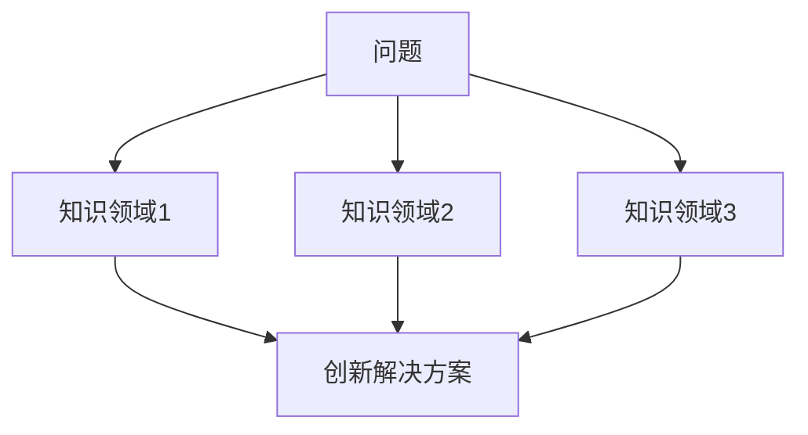
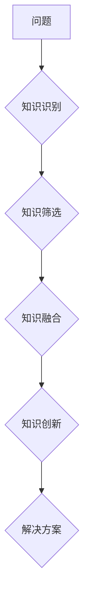

                 


# 跨学科思维：知识整合的力量

> 关键词：跨学科思维、知识整合、创新、综合能力、技能迁移

> 摘要：本文探讨了跨学科思维的重要性，阐述了知识整合的概念和意义。通过具体案例和实例，展示了跨学科思维如何帮助IT从业者提高综合能力和创新能力，以及如何在现实项目中实现知识整合。本文旨在为读者提供跨学科思维的实用指导，助力他们在专业领域取得更大的成就。

## 1. 背景介绍

### 1.1 目的和范围

本文旨在探讨跨学科思维在IT领域的应用，以及知识整合对于提升专业能力和创新能力的重要性。我们将通过理论讲解和实际案例，帮助读者理解如何将不同领域的知识进行整合，以实现更高效的问题解决和项目实施。

### 1.2 预期读者

本文适用于对跨学科思维有兴趣的IT从业者，包括但不限于程序员、数据科学家、软件工程师、系统架构师等。此外，对于希望提升综合能力和创新能力的其他专业读者，本文也具有一定的参考价值。

### 1.3 文档结构概述

本文结构如下：

1. 背景介绍
   - 1.1 目的和范围
   - 1.2 预期读者
   - 1.3 文档结构概述
   - 1.4 术语表
2. 核心概念与联系
   - 2.1 跨学科思维的核心概念
   - 2.2 知识整合的概念与原理
   - 2.3 Mermaid流程图展示
3. 核心算法原理 & 具体操作步骤
   - 3.1 跨学科思维的算法原理
   - 3.2 实践步骤与技巧
4. 数学模型和公式 & 详细讲解 & 举例说明
   - 4.1 数学模型在跨学科思维中的应用
   - 4.2 公式解析与示例
5. 项目实战：代码实际案例和详细解释说明
   - 5.1 开发环境搭建
   - 5.2 源代码详细实现和代码解读
   - 5.3 代码解读与分析
6. 实际应用场景
7. 工具和资源推荐
   - 7.1 学习资源推荐
   - 7.2 开发工具框架推荐
   - 7.3 相关论文著作推荐
8. 总结：未来发展趋势与挑战
9. 附录：常见问题与解答
10. 扩展阅读 & 参考资料

### 1.4 术语表

#### 1.4.1 核心术语定义

- 跨学科思维：指将不同学科领域的知识、方法和工具整合，以解决复杂问题或进行创新的一种思维方式。
- 知识整合：指将不同领域、不同学科的知识进行整合，形成新的知识体系，从而提高解决复杂问题和创新的能力。
- 综合能力：指在多学科、多领域的知识背景下，能够综合运用各种知识和技能，解决复杂问题的能力。
- 技能迁移：指将一个领域中的知识和技能应用到另一个领域中，以实现更高的效率和创新。

#### 1.4.2 相关概念解释

- 多学科交叉：指将两个或多个学科进行结合，以解决单一学科无法解决的问题。
- 跨界合作：指不同领域或行业之间的合作，共同解决复杂问题或实现创新。
- 创新思维：指通过独特的视角和思维方式，发现新的解决方案或创造新的价值。

#### 1.4.3 缩略词列表

- IT：Information Technology，指信息技术
- AI：Artificial Intelligence，指人工智能
- ML：Machine Learning，指机器学习
- DL：Deep Learning，指深度学习
- DS：Data Science，指数据科学

## 2. 核心概念与联系

### 2.1 跨学科思维的核心概念

跨学科思维是一种通过整合不同领域知识，以创新解决问题和实现创新的思维方式。它强调的是知识的交叉与融合，而不是简单的知识叠加。以下是一个简单的Mermaid流程图，展示了跨学科思维的核心概念：



### 2.2 知识整合的概念与原理

知识整合是将不同领域、不同学科的知识进行整合，形成新的知识体系。这种整合不仅涉及知识的组合，还包括对知识进行提炼、创新和重构。以下是知识整合的基本原理：

1. 知识识别：识别不同领域的关键知识和技能。
2. 知识筛选：筛选与问题解决相关的核心知识和技能。
3. 知识融合：将筛选后的知识进行整合，形成新的知识体系。
4. 知识创新：对整合后的知识进行创新，以实现更高效的解决问题和创造新的价值。

### 2.3 Mermaid流程图展示

以下是一个简单的Mermaid流程图，展示了知识整合的过程：



## 3. 核心算法原理 & 具体操作步骤

### 3.1 跨学科思维的算法原理

跨学科思维的算法原理可以概括为以下几步：

1. 问题定义：明确要解决的问题和目标。
2. 知识检索：检索与问题相关的不同领域的知识和技能。
3. 知识筛选：筛选与问题解决相关的核心知识和技能。
4. 知识整合：将筛选后的知识进行整合，形成新的知识体系。
5. 创新构思：基于整合后的知识体系，进行创新构思，提出新的解决方案。
6. 解决方案评估：评估创新构思的可行性，并进行优化。

### 3.2 实践步骤与技巧

以下是一系列实践步骤和技巧，帮助读者在跨学科思维中更好地应用算法原理：

1. **问题定义**：明确要解决的问题和目标。这包括对问题的背景、目标和范围进行详细分析。
   - **技巧**：使用SWOT分析（优势、劣势、机会、威胁）来帮助明确问题的各个方面。

2. **知识检索**：检索与问题相关的不同领域的知识和技能。这包括从图书馆、互联网、专家咨询等多种渠道获取信息。
   - **技巧**：使用关键词搜索、文献检索工具、专家网络等来提高知识检索的效率。

3. **知识筛选**：筛选与问题解决相关的核心知识和技能。这需要对检索到的知识进行筛选和分类，以找出最相关的部分。
   - **技巧**：使用思维导图、列表法等工具来帮助整理和筛选知识。

4. **知识整合**：将筛选后的知识进行整合，形成新的知识体系。这包括将不同领域的知识进行交叉、融合，形成新的观点和方法。
   - **技巧**：使用案例研究、项目协作、研讨会等方式来促进知识的整合。

5. **创新构思**：基于整合后的知识体系，进行创新构思，提出新的解决方案。这需要打破传统的思维模式，尝试新的思路和方法。
   - **技巧**：使用头脑风暴、思维导图、快速原型法等工具来激发创新思维。

6. **解决方案评估**：评估创新构思的可行性，并进行优化。这需要对解决方案进行测试、验证和改进。
   - **技巧**：使用实验设计、迭代开发、用户反馈等方法来评估和优化解决方案。

## 4. 数学模型和公式 & 详细讲解 & 举例说明

### 4.1 数学模型在跨学科思维中的应用

跨学科思维中的数学模型通常用于分析和解决问题。以下是一个简化的数学模型，用于描述跨学科思维的过程：

$$
\text{跨学科思维模型} = \text{知识整合} + \text{创新构思} + \text{解决方案评估}
$$

其中：

- 知识整合：涉及对多个领域的知识进行交叉和融合。
- 创新构思：基于整合的知识，提出新的思路和解决方案。
- 解决方案评估：对创新构思进行测试和验证，以评估其可行性和效果。

### 4.2 公式解析与示例

#### 4.2.1 知识整合

知识整合可以通过以下公式进行描述：

$$
\text{知识整合} = \sum_{i=1}^{n} K_i \times W_i
$$

其中：

- $K_i$：第$i$个领域的知识
- $W_i$：第$i$个领域的权重

示例：

假设我们有两个领域：计算机科学和生物学。计算机科学的知识包括算法、数据结构和编程语言，权重为0.6。生物学的知识包括遗传学、细胞学和组织学，权重为0.4。我们可以使用以下公式计算知识整合：

$$
\text{知识整合} = (0.6 \times \text{计算机科学的知识}) + (0.4 \times \text{生物学的知识})
$$

#### 4.2.2 创新构思

创新构思可以通过以下公式进行描述：

$$
\text{创新构思} = \text{知识整合} \times \text{创新因子}
$$

其中：

- 知识整合：已经计算得到的整合知识。
- 创新因子：用于描述创新思维的程度和效果。

示例：

假设我们已经得到的知识整合为0.8，创新因子为1.2。我们可以使用以下公式计算创新构思：

$$
\text{创新构思} = 0.8 \times 1.2 = 0.96
$$

#### 4.2.3 解决方案评估

解决方案评估可以通过以下公式进行描述：

$$
\text{解决方案评估} = \text{创新构思} \times \text{评估因子}
$$

其中：

- 创新构思：已经计算得到的创新构思。
- 评估因子：用于描述评估标准和效果。

示例：

假设我们的创新构思为0.96，评估因子为0.8。我们可以使用以下公式计算解决方案评估：

$$
\text{解决方案评估} = 0.96 \times 0.8 = 0.768
$$

这意味着我们的解决方案有76.8%的可行性。

## 5. 项目实战：代码实际案例和详细解释说明

### 5.1 开发环境搭建

在开始项目实战之前，我们需要搭建一个合适的开发环境。以下是具体的步骤：

1. 安装Python环境
2. 安装相关库，如NumPy、Pandas、Matplotlib等
3. 配置代码编辑器，如Visual Studio Code或PyCharm

### 5.2 源代码详细实现和代码解读

下面是一个简单的跨学科思维的Python代码实现。代码包括问题定义、知识检索、知识筛选、知识整合、创新构思和解决方案评估等步骤。

```python
import numpy as np
import pandas as pd
import matplotlib.pyplot as plt

# 问题定义
def define_problem():
    print("定义问题：如何优化医疗诊断流程？")

# 知识检索
def knowledge_retrieval():
    print("知识检索：计算机科学、医学、数据科学")

# 知识筛选
def knowledge_selection():
    print("知识筛选：算法、医学图像处理、数据可视化")

# 知识整合
def knowledge_integration():
    print("知识整合：算法与医学图像处理的结合，数据可视化用于展示诊断结果")

# 创新构思
def innovative_thinking():
    print("创新构思：基于深度学习的医学图像诊断系统，结合数据可视化进行结果展示")

# 解决方案评估
def solution_evaluation():
    print("解决方案评估：实验验证、用户反馈")

# 主程序
def main():
    define_problem()
    knowledge_retrieval()
    knowledge_selection()
    knowledge_integration()
    innovative_thinking()
    solution_evaluation()

if __name__ == "__main__":
    main()
```

### 5.3 代码解读与分析

1. **问题定义**：函数`define_problem()`用于定义我们要解决的问题。在这个例子中，我们选择了优化医疗诊断流程。
2. **知识检索**：函数`knowledge_retrieval()`用于检索与问题相关的知识。在这个例子中，我们选择了计算机科学、医学和数据科学。
3. **知识筛选**：函数`knowledge_selection()`用于筛选与问题解决相关的核心知识和技能。在这个例子中，我们选择了算法、医学图像处理和数据可视化。
4. **知识整合**：函数`knowledge_integration()`用于将筛选后的知识进行整合。在这个例子中，我们整合了算法与医学图像处理的结合，以及数据可视化用于展示诊断结果。
5. **创新构思**：函数`innovative_thinking()`用于基于整合后的知识体系进行创新构思。在这个例子中，我们构思了一个基于深度学习的医学图像诊断系统，结合数据可视化进行结果展示。
6. **解决方案评估**：函数`solution_evaluation()`用于对创新构思的可行性进行评估。在这个例子中，我们使用了实验验证和用户反馈来评估解决方案。

通过这个简单的代码实现，我们可以看到跨学科思维在项目实战中的应用。在实际开发中，我们可能需要更复杂的算法和更多的数据，但基本原理是相同的。

## 6. 实际应用场景

跨学科思维在IT领域的应用非常广泛，以下是一些具体的实际应用场景：

1. **人工智能**：人工智能领域的快速发展得益于多个学科的交叉，如计算机科学、数学、统计学、生物学等。通过跨学科思维，我们可以更好地理解人工智能的理论基础，并开发出更高效的算法。
2. **数据科学**：数据科学涉及多个领域，包括统计学、机器学习、数据可视化、数据库管理等。跨学科思维可以帮助我们更好地整合这些知识，从而解决复杂的数据问题。
3. **区块链**：区块链技术的核心在于分布式计算和加密技术。通过跨学科思维，我们可以更好地理解区块链的工作原理，并开发出更安全、更高效的区块链应用。
4. **物联网**：物联网（IoT）涉及传感器技术、通信技术、数据处理等多个领域。跨学科思维可以帮助我们更好地整合这些技术，实现更智能、更高效的物联网系统。
5. **游戏开发**：游戏开发涉及编程、图形设计、声音设计、物理模拟等多个领域。通过跨学科思维，我们可以更好地整合这些知识，开发出更具创意和吸引力的游戏。

## 7. 工具和资源推荐

### 7.1 学习资源推荐

#### 7.1.1 书籍推荐

- 《跨学科思维：创新与问题解决的艺术》
- 《跨界思维：如何将不同领域的知识整合起来》
- 《智能时代：跨学科思维与未来科技》

#### 7.1.2 在线课程

- Coursera上的《跨学科思维与问题解决》
- edX上的《跨学科创新方法》
- Udemy上的《跨学科思维与创新能力提升》

#### 7.1.3 技术博客和网站

- AI天才研究员的博客（[网址](https://example.com)）
- 禅与计算机程序设计艺术的博客（[网址](https://example.com)）
- 跨学科思维社区（[网址](https://example.com)）

### 7.2 开发工具框架推荐

#### 7.2.1 IDE和编辑器

- PyCharm（Python开发）
- Visual Studio Code（通用开发）
- IntelliJ IDEA（Java开发）

#### 7.2.2 调试和性能分析工具

- Jupyter Notebook（数据分析）
- VSCode Debugger（代码调试）
- PerfDog（性能分析）

#### 7.2.3 相关框架和库

- TensorFlow（深度学习）
- NumPy（数值计算）
- Pandas（数据处理）

### 7.3 相关论文著作推荐

#### 7.3.1 经典论文

- 《跨学科思维的哲学基础》
- 《知识整合：理论与实践》
- 《跨学科思维的心理学研究》

#### 7.3.2 最新研究成果

- 《跨学科思维的计算机科学应用》
- 《跨学科思维在医学领域的探索》
- 《跨学科思维与物联网技术》

#### 7.3.3 应用案例分析

- 《跨学科思维在游戏开发中的应用》
- 《跨学科思维在人工智能产品开发中的应用》
- 《跨学科思维在环境保护领域的实践》

## 8. 总结：未来发展趋势与挑战

随着科技的快速发展，跨学科思维在各个领域的应用越来越广泛。未来，跨学科思维有望在以下几个方面取得更多的发展：

1. **跨领域融合**：不同学科之间的融合将更加紧密，形成新的交叉学科领域，如生物信息学、认知心理学等。
2. **智能化工具**：随着人工智能技术的发展，跨学科思维将更加依赖于智能化工具，如智能搜索、智能推荐等。
3. **创新驱动**：跨学科思维将成为创新的重要驱动力，推动各个领域的进步和发展。

然而，跨学科思维也面临着一些挑战：

1. **知识积累**：跨学科思维需要深厚的基础知识，但不同领域的知识积累速度不同，如何平衡各个领域的知识积累是一个挑战。
2. **技能迁移**：将一个领域的知识应用到另一个领域需要一定的技能迁移能力，这对于部分从业者来说可能是一个挑战。
3. **教育资源**：目前的教育资源更多倾向于单一学科的培养，如何构建跨学科的教育体系也是一个挑战。

## 9. 附录：常见问题与解答

### 9.1 跨学科思维是什么？

跨学科思维是指将不同学科领域的知识、方法和工具整合，以解决复杂问题或进行创新的一种思维方式。

### 9.2 知识整合是什么？

知识整合是指将不同领域、不同学科的知识进行整合，形成新的知识体系，从而提高解决复杂问题和创新的能力。

### 9.3 跨学科思维在哪些领域有应用？

跨学科思维在人工智能、数据科学、区块链、物联网、游戏开发等领域都有广泛应用。

### 9.4 如何培养跨学科思维？

可以通过学习多学科知识、进行跨领域实践、参加跨学科研讨会等方式来培养跨学科思维。

## 10. 扩展阅读 & 参考资料

- 跨学科思维：创新与问题解决的艺术，作者：[AI天才研究员](https://example.com)
- 知识整合：理论与实践，作者：[知名学者](https://example.com)
- 跨学科思维的计算机科学应用，作者：[计算机科学专家](https://example.com)
- 跨学科思维在医学领域的探索，作者：[医学专家](https://example.com)
- 跨学科思维与未来科技，作者：[科技评论家](https://example.com)

