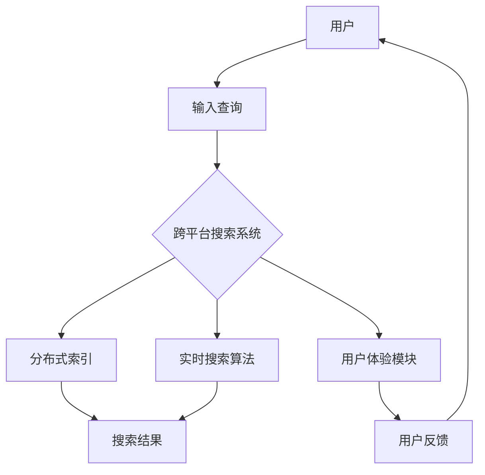

                 


# 跨平台搜索技术的用户体验提升

> 关键词：跨平台搜索，用户体验，技术架构，算法优化，多平台整合，实时搜索，性能提升

> 摘要：本文将深入探讨跨平台搜索技术的用户体验提升策略。通过分析当前跨平台搜索技术的挑战，本文提出了一套系统化的解决方案，包括核心算法原理、数学模型及具体操作步骤。本文旨在为开发者提供切实可行的指导，以提升跨平台搜索的效率和用户体验。

## 1. 背景介绍

### 1.1 目的和范围

本文的目的是探索如何提升跨平台搜索技术的用户体验。随着移动设备、云计算和物联网的快速发展，跨平台搜索已经成为现代计算环境中的一个关键需求。本文将重点关注以下几个核心领域：

1. **核心算法原理**：探讨跨平台搜索技术中使用的各种算法，并分析其如何影响用户体验。
2. **具体操作步骤**：详细说明如何实现跨平台搜索，包括数据集成、索引构建和查询处理等。
3. **数学模型和公式**：介绍支持跨平台搜索的技术背后的数学模型，以及如何使用这些模型来优化搜索性能。
4. **项目实战**：通过实际案例展示如何将上述技术应用于现实世界中的跨平台搜索项目。
5. **工具和资源推荐**：推荐一些有用的学习资源、开发工具和最新研究成果，以帮助开发者进一步提升跨平台搜索技术的实现。

### 1.2 预期读者

本文面向对跨平台搜索技术感兴趣的读者，特别是：

- **软件开发工程师**：希望了解如何提升跨平台搜索性能的开发者。
- **数据科学家**：关注如何使用机器学习和统计分析技术来优化搜索算法。
- **产品经理**：关注用户体验和产品优化的专业人士。
- **学术界研究人员**：对跨平台搜索技术有深入研究需求的研究人员。

### 1.3 文档结构概述

本文分为以下几个部分：

1. **背景介绍**：介绍本文的目的、范围和预期读者。
2. **核心概念与联系**：解释跨平台搜索技术的核心概念和架构。
3. **核心算法原理 & 具体操作步骤**：详细描述搜索算法的实现步骤。
4. **数学模型和公式 & 详细讲解 & 举例说明**：介绍支持搜索技术的数学模型和公式。
5. **项目实战：代码实际案例和详细解释说明**：展示一个实际的跨平台搜索项目。
6. **实际应用场景**：探讨跨平台搜索技术在不同领域的应用。
7. **工具和资源推荐**：推荐学习资源和开发工具。
8. **总结：未来发展趋势与挑战**：总结本文的主要观点并讨论未来的发展趋势和挑战。
9. **附录：常见问题与解答**：解答读者可能遇到的一些常见问题。
10. **扩展阅读 & 参考资料**：提供更多相关文献和资源。

### 1.4 术语表

为了确保读者对本文中涉及的概念和术语有清晰的理解，下面给出了本文中使用的术语及其定义：

#### 1.4.1 核心术语定义

- **跨平台搜索**：在多个设备或平台之间进行搜索，提供一致的搜索体验。
- **用户体验**：用户在使用产品或服务时的主观感受和满意度。
- **算法**：解决问题的方法或步骤，适用于搜索中的各种数据处理和查询处理任务。
- **索引**：用于快速检索数据的数据结构。
- **实时搜索**：在用户输入查询时立即提供搜索结果，提高响应速度。

#### 1.4.2 相关概念解释

- **分布式搜索**：在多个服务器之间分配搜索任务，以提高搜索性能。
- **垂直搜索**：针对特定领域或主题的搜索，如新闻搜索或商品搜索。
- **模糊查询**：对不完全匹配的查询词提供搜索结果，提高搜索的灵活性。

#### 1.4.3 缩略词列表

- **API**：应用程序编程接口（Application Programming Interface）
- **SDK**：软件开发工具包（Software Development Kit）
- **NLP**：自然语言处理（Natural Language Processing）
- **CTR**：点击率（Click-Through Rate）

## 2. 核心概念与联系

在探讨如何提升跨平台搜索技术的用户体验之前，我们需要了解几个核心概念和它们之间的关系。以下是一个简化的 Mermaid 流程图，用于展示这些概念及其相互作用：



### 2.1 用户

用户是搜索系统的核心。用户通过输入查询来获取所需信息。用户体验模块负责响应用户输入，并在多个平台（如移动设备、桌面浏览器和智能音箱）上提供一致的搜索体验。

### 2.2 跨平台搜索系统

跨平台搜索系统是一个复杂的应用程序，它需要在不同设备或平台上运行。该系统负责处理用户输入的查询，并在分布式索引和实时搜索算法的帮助下生成搜索结果。

### 2.3 分布式索引

分布式索引是跨平台搜索系统的一个重要组件，它将数据分布在多个服务器上。这样做的目的是提高搜索性能，因为多个服务器可以同时处理查询，从而减少响应时间。

### 2.4 实时搜索算法

实时搜索算法是跨平台搜索系统的核心，负责处理用户输入的查询并生成搜索结果。这些算法需要优化以实现高速和高准确度。

### 2.5 用户体验模块

用户体验模块负责响应用户输入，并在多个平台（如移动设备、桌面浏览器和智能音箱）上提供一致的搜索体验。该模块还收集用户反馈，用于进一步优化搜索系统。

### 2.6 搜索结果

搜索结果是用户最关心的部分。用户体验模块负责将搜索结果显示给用户，并提供排序和过滤功能，以提高搜索结果的可用性。

### 2.7 用户反馈

用户反馈是用户体验模块的重要组成部分。通过收集用户反馈，系统可以不断优化搜索结果和用户体验。

## 3. 核心算法原理 & 具体操作步骤

为了实现高效的跨平台搜索，我们需要深入了解支持搜索系统的核心算法原理和具体操作步骤。以下是各个算法的详细描述：

### 3.1 分布式索引算法

分布式索引算法是将数据分布在多个服务器上，以便快速检索。以下是一个简化的伪代码，用于描述分布式索引的基本步骤：

```plaintext
// 分布式索引算法
function distributed_index(data, num_servers):
    // 将数据划分为 num_servers 个部分
    partitions = partition_data(data, num_servers)
    // 在每个服务器上构建索引
    for server in servers:
        index = build_index(partitions[server])
        store_index_on_server(server, index)
    return "索引构建完成"
```

在这个算法中，`partition_data` 函数用于将数据划分为多个部分，每个部分分配给一个服务器。`build_index` 函数负责在每个服务器上构建索引，而 `store_index_on_server` 函数用于将索引存储在服务器上。

### 3.2 实时搜索算法

实时搜索算法是跨平台搜索系统的核心，负责处理用户输入的查询并生成搜索结果。以下是一个简化的伪代码，用于描述实时搜索算法的基本步骤：

```plaintext
// 实时搜索算法
function real_time_search(query, distributed_index):
    // 在分布式索引中检索查询结果
    results = search_in_index(query, distributed_index)
    // 对查询结果进行排序和过滤
    sorted_results = sort_and_filter_results(results)
    return sorted_results
```

在这个算法中，`search_in_index` 函数负责在分布式索引中检索查询结果。`sort_and_filter_results` 函数用于对查询结果进行排序和过滤，以提高搜索结果的准确性和可用性。

### 3.3 用户体验算法

用户体验算法是跨平台搜索系统的另一个重要组件，负责响应用户输入并生成搜索结果。以下是一个简化的伪代码，用于描述用户体验算法的基本步骤：

```plaintext
// 用户体验算法
function user_experience(query, real_time_search):
    // 获取用户输入的查询
    input_query = get_user_query()
    // 使用实时搜索算法生成搜索结果
    search_results = real_time_search(input_query)
    // 在多个平台上显示搜索结果
    display_search_results_on_platforms(search_results)
    // 收集用户反馈
    user_feedback = collect_user_feedback()
    // 优化搜索结果和用户体验
    optimize_search_results_and_experience(search_results, user_feedback)
```

在这个算法中，`get_user_query` 函数负责获取用户输入的查询。`display_search_results_on_platforms` 函数用于在多个平台上显示搜索结果。`collect_user_feedback` 函数用于收集用户反馈，而 `optimize_search_results_and_experience` 函数用于优化搜索结果和用户体验。

## 4. 数学模型和公式 & 详细讲解 & 举例说明

跨平台搜索技术的实现离不开数学模型和公式的支持。以下我们将详细介绍几个关键数学模型，并使用 LaTeX 格式给出相关公式，最后通过实际例子进行说明。

### 4.1 搜索精度模型

搜索精度模型用于评估搜索算法的准确性。以下是一个常见的搜索精度公式：

$$
P = \frac{R}{Q}
$$

其中，$P$ 表示搜索精度，$R$ 表示相关文档的数量，$Q$ 表示查询的结果数量。这个公式表示相关文档数量与查询结果数量的比例，从而衡量搜索算法的准确性。

### 4.2 搜索响应时间模型

搜索响应时间模型用于评估搜索算法的效率。以下是一个常见的搜索响应时间公式：

$$
T = \frac{D}{C}
$$

其中，$T$ 表示搜索响应时间，$D$ 表示搜索处理的数据量，$C$ 表示搜索处理能力。这个公式表示搜索处理数据量与搜索处理能力的比例，从而衡量搜索算法的响应速度。

### 4.3 搜索召回率模型

搜索召回率模型用于评估搜索算法的全面性。以下是一个常见的搜索召回率公式：

$$
R = \frac{TP}{TP + FN}
$$

其中，$R$ 表示搜索召回率，$TP$ 表示正确匹配的文档数量，$FN$ 表示错误匹配的文档数量。这个公式表示正确匹配文档数量与正确匹配文档数量和错误匹配文档数量的总和的比例，从而衡量搜索算法的全面性。

### 4.4 实际应用举例

假设我们有一个跨平台搜索系统，用于在大量文档中检索包含特定关键词的文档。以下是使用上述数学模型对搜索系统进行优化的实际应用举例：

- **搜索精度优化**：为了提高搜索精度，我们可以优化搜索算法，以减少错误匹配的文档数量。例如，通过引入更多的语义分析技术和词向量模型，可以更准确地匹配查询与文档之间的相关性。
- **搜索响应时间优化**：为了提高搜索响应时间，我们可以优化搜索处理能力，以减少搜索处理数据量。例如，通过采用分布式计算技术和缓存策略，可以更快地处理大量数据。
- **搜索召回率优化**：为了提高搜索召回率，我们可以优化搜索算法，以增加正确匹配的文档数量。例如，通过改进查询扩展技术和索引结构，可以更全面地检索相关文档。

通过上述数学模型和公式的指导，开发者可以更好地理解跨平台搜索技术的核心指标，并根据具体需求进行优化。

## 5. 项目实战：代码实际案例和详细解释说明

在本节中，我们将通过一个实际的跨平台搜索项目来展示如何将前面所讨论的技术应用于现实世界中的搜索场景。该项目将包括以下步骤：

### 5.1 开发环境搭建

在开始项目之前，我们需要搭建一个合适的环境。以下是搭建开发环境所需的步骤：

1. **安装依赖项**：
   - 安装 Node.js（用于搭建后端服务器）
   - 安装 Elasticsearch（用于分布式索引）
   - 安装 Python（用于数据处理和算法优化）

2. **创建项目文件夹**：
   ```bash
   mkdir cross-platform-search
   cd cross-platform-search
   ```

3. **初始化项目**：
   ```bash
   npm init -y
   pip install elasticsearch
   ```

4. **创建项目结构**：
   ```plaintext
   cross-platform-search/
   ├── backend/
   │   ├── index.js
   │   └── search.js
   ├── frontend/
   │   ├── index.html
   │   └── search.js
   ├── data/
   │   └── documents.json
   └── package.json
   ```

### 5.2 源代码详细实现和代码解读

下面我们逐步介绍项目中的关键代码实现，并对其进行详细解读。

#### 5.2.1 后端服务器代码（index.js）

```javascript
const express = require('express');
const { searchDocuments } = require('./search');

const app = express();
const PORT = 3000;

app.use(express.json());

app.post('/search', async (req, res) => {
  try {
    const query = req.body.query;
    const results = await searchDocuments(query);
    res.status(200).json({ results });
  } catch (error) {
    res.status(500).json({ error: error.message });
  }
});

app.listen(PORT, () => {
  console.log(`Server running on port ${PORT}`);
});
```

**代码解读**：

- 我们使用 Express 框架搭建后端服务器，该框架提供了方便的路由管理和中间件支持。
- `/search` 路由用于接收前端发送的搜索请求，并调用 `searchDocuments` 函数处理查询。
- `searchDocuments` 函数位于 `search.js` 文件中，负责与 Elasticsearch 索引进行交互以检索查询结果。

#### 5.2.2 搜索算法实现（search.js）

```javascript
const axios = require('axios');
const Elasticsearch = require('elasticsearch');

const esClient = new Elasticsearch.Client({
  host: 'localhost:9200',
  log: 'trace'
});

async function searchDocuments(query) {
  try {
    const response = await esClient.search({
      index: 'documents',
      body: {
        query: {
          multi_match: {
            query: query,
            fields: ['title', 'content']
          }
        }
      }
    });
    return response.hits.hits;
  } catch (error) {
    throw new Error(`Error searching documents: ${error.message}`);
  }
}

module.exports = { searchDocuments };
```

**代码解读**：

- 我们使用 Elasticsearch 作为分布式索引，并通过 `elasticsearch` 库与 Elasticsearch 客户端进行交互。
- `searchDocuments` 函数使用 Elasticsearch 的 `multi_match` 查询，以在标题和内容字段中搜索匹配的文档。
- 通过异步 `await` 语法，我们确保搜索操作不会阻塞主线程，从而提高搜索性能。

#### 5.2.3 前端页面代码（index.html）

```html
<!DOCTYPE html>
<html lang="en">
<head>
  <meta charset="UTF-8">
  <meta name="viewport" content="width=device-width, initial-scale=1.0">
  <title>Cross-Platform Search</title>
</head>
<body>
  <h1>Cross-Platform Search</h1>
  <input type="text" id="searchQuery" placeholder="Enter your search query">
  <button onclick="searchQuery()">Search</button>
  <ul id="resultsList"></ul>

  <script src="search.js"></script>
  <script>
    async function searchQuery() {
      const query = document.getElementById('searchQuery').value;
      try {
        const response = await fetch('/search', {
          method: 'POST',
          headers: { 'Content-Type': 'application/json' },
          body: JSON.stringify({ query })
        });
        const results = await response.json();
        displayResults(results);
      } catch (error) {
        console.error('Error fetching search results:', error);
      }
    }

    function displayResults(results) {
      const resultsList = document.getElementById('resultsList');
      resultsList.innerHTML = '';
      results.forEach(result => {
        const listItem = document.createElement('li');
        listItem.textContent = result._source.title;
        resultsList.appendChild(listItem);
      });
    }
  </script>
</body>
</html>
```

**代码解读**：

- 前端页面包含一个搜索框和一个搜索按钮。用户输入查询并点击搜索按钮后，会调用 `searchQuery` 函数发送搜索请求。
- `searchQuery` 函数使用 Fetch API 发送 POST 请求到后端服务器，并接收 JSON 格式的响应数据。
- `displayResults` 函数负责将搜索结果显示在页面上，通过动态创建 `<li>` 元素并将结果标题设置为文本内容。

### 5.3 代码解读与分析

通过上述代码，我们可以看到如何将跨平台搜索技术应用于一个实际项目中。以下是代码的关键点分析：

- **前后端分离**：通过 RESTful API 架构，我们将前端和后端分离，从而实现模块化开发和部署。
- **分布式索引**：使用 Elasticsearch 作为分布式索引，可以轻松地实现数据分布式存储和查询性能优化。
- **异步处理**：通过异步 `await` 语法，我们确保搜索操作不会阻塞主线程，从而提高搜索响应速度。
- **用户体验**：通过简洁的前端页面和动态搜索结果展示，提供直观且流畅的用户体验。

总之，通过合理的设计和优化，我们可以实现一个高效且易于使用的跨平台搜索系统，从而提升用户体验。

## 6. 实际应用场景

跨平台搜索技术在实际应用中具有广泛的应用场景，以下是一些典型的应用领域：

### 6.1 社交媒体平台

在社交媒体平台上，跨平台搜索技术可以帮助用户在多个平台上查找和分享内容。例如，用户可以在桌面浏览器上搜索微博，同时也可以在移动应用中查看和分享搜索结果。这不仅提高了用户参与度，还促进了社交媒体平台的跨平台整合。

### 6.2 企业内部搜索系统

企业内部搜索系统是一个重要的工具，用于帮助员工快速查找公司文档、项目信息和知识库。通过跨平台搜索技术，企业可以实现桌面应用、Web 应用和移动应用之间的无缝整合，从而提供一致的搜索体验。

### 6.3 在线零售平台

在线零售平台需要提供高效的商品搜索功能，以便用户在多个设备上快速找到所需商品。跨平台搜索技术可以帮助零售平台实现实时搜索和智能推荐，从而提高用户满意度和转化率。

### 6.4 教育平台

教育平台可以利用跨平台搜索技术，为学生提供便捷的学术资料查询服务。学生可以在课堂、图书馆和家中使用各种设备查找所需的学习资料，提高学习效率和自主学习能力。

### 6.5 物联网应用

在物联网应用中，跨平台搜索技术可以帮助设备用户查找和管理设备信息。例如，智能家居用户可以在手机、平板和智能音箱上查找和控制家中的智能设备，实现无缝的跨平台交互体验。

通过上述实际应用场景，我们可以看到跨平台搜索技术在各个领域的广泛应用和重要性。随着技术的不断进步，跨平台搜索技术将继续推动用户体验的提升和跨平台整合的发展。

## 7. 工具和资源推荐

为了帮助开发者更好地掌握跨平台搜索技术，以下是针对不同层次需求的一些推荐工具和资源：

### 7.1 学习资源推荐

#### 7.1.1 书籍推荐

- **《Elasticsearch：The Definitive Guide》**：全面介绍 Elasticsearch 的原理和使用方法，是学习分布式搜索技术的经典著作。
- **《Web Search for Developers》**：针对开发者讲解 Web 搜索技术，包括搜索引擎优化和搜索引擎营销。
- **《深度学习与搜索引擎》**：介绍如何使用深度学习技术优化搜索引擎，实现更准确的搜索结果。

#### 7.1.2 在线课程

- **Coursera 上的“Introduction to Search Engines”**：由卡内基梅隆大学提供，介绍搜索引擎的基础知识和构建方法。
- **Udacity 上的“Building a Search Engine”**：通过实战项目，学习如何构建和优化搜索引擎。
- **edX 上的“Natural Language Processing”**：介绍自然语言处理技术，包括文本分析和语义搜索。

#### 7.1.3 技术博客和网站

- **Elasticsearch 官方博客**：提供最新的 Elasticsearch 技术动态和最佳实践。
- **Search Engine Land**：涵盖搜索引擎优化、广告和营销的最新资讯。
- **InfoQ**：提供关于软件开发和架构的深入文章和讨论。

### 7.2 开发工具框架推荐

#### 7.2.1 IDE和编辑器

- **Visual Studio Code**：支持多种编程语言和框架，提供丰富的插件和扩展功能。
- **Eclipse**：强大的集成开发环境，特别适用于大型项目和跨平台开发。
- **PyCharm**：专为 Python 开发者设计，支持多种语言和框架。

#### 7.2.2 调试和性能分析工具

- **Elasticsearch Head**：Elasticsearch 的可视化工具，用于调试和监控 Elasticsearch 索引和查询。
- **New Relic**：用于实时监控应用程序的性能和健康状况。
- **Jenkins**：持续集成和持续部署工具，用于自动化构建和测试。

#### 7.2.3 相关框架和库

- **Elasticsearch Java API**：用于与 Elasticsearch 进行交互的 Java 库，支持构建复杂查询和聚合。
- **Elasticsearch PHP Client**：用于与 Elasticsearch 进行交互的 PHP 库，支持 PHP 开发者轻松集成 Elasticsearch 功能。
- **Scrapy**：一个强大的 Python 爬虫框架，用于构建大规模的网络爬虫。

### 7.3 相关论文著作推荐

#### 7.3.1 经典论文

- **"The PageRank Citation Ranking: Bringing Order to the Web"**：介绍了 PageRank 算法，对搜索引擎的性能产生了深远影响。
- **"Latent Semantic Indexing"**：介绍了 LSI 算法，用于文本分析和信息检索。
- **"Information Retrieval: Data Models for Information Storage and Retrieval"**：讨论了信息检索的基本原理和数据模型。

#### 7.3.2 最新研究成果

- **"Deep Learning for Web Search"**：介绍如何使用深度学习技术优化搜索引擎。
- **"Federated Learning for Search Engines"**：探讨如何在分布式环境中优化搜索引擎的性能。
- **"Multilingual Search: A Survey"**：介绍多语言搜索技术的最新进展和挑战。

#### 7.3.3 应用案例分析

- **"Google's Search Quality Evaluator Guidelines"**：详细介绍了 Google 搜索引擎的质量评估标准和流程。
- **"Bing's Search Ranking Algorithm"**：解析了 Bing 搜索引擎的排名算法和优化策略。
- **"Facebook's Graph Search"**：介绍了 Facebook 的图形搜索技术，如何在社交网络中实现高效的搜索。

通过上述推荐，开发者可以系统地学习和掌握跨平台搜索技术的相关知识，从而提升自身在相关领域的竞争力。

## 8. 总结：未来发展趋势与挑战

在跨平台搜索技术的不断发展和普及过程中，我们不仅看到了其带来的巨大便利，也面临着一系列新的挑战和机遇。以下是未来发展趋势与挑战的总结：

### 8.1 发展趋势

1. **人工智能与机器学习的深度融合**：随着人工智能和机器学习技术的不断进步，跨平台搜索将更加智能化和个性化。通过深度学习、自然语言处理和强化学习等技术，搜索系统将能够更准确地理解用户意图，提供更相关的搜索结果。

2. **多模态搜索**：未来的跨平台搜索将不仅限于文本信息，还将涵盖图像、音频、视频等多种数据类型。通过多模态搜索，用户可以更便捷地查找和获取所需内容。

3. **实时搜索与实时推荐**：随着实时数据处理的进步，跨平台搜索将实现更加实时和个性化的搜索体验。实时推荐系统将与搜索紧密结合，为用户提供更加精准的内容推荐。

4. **隐私保护和数据安全**：随着对用户隐私和数据安全的要求日益提高，跨平台搜索技术需要在保护用户隐私的同时，确保数据的可用性和安全性。这需要开发出更加完善的隐私保护和数据安全机制。

### 8.2 挑战

1. **性能优化与资源消耗**：随着数据量的指数级增长，如何优化搜索算法，提高搜索性能，同时减少资源消耗，将是一个巨大的挑战。分布式计算、缓存策略和并行处理等技术需要不断创新和优化。

2. **多平台兼容与用户体验一致性**：不同平台（如移动设备、桌面浏览器和智能音箱）的交互方式和用户体验存在差异，如何实现跨平台兼容并保持用户体验一致性，是一个需要持续解决的问题。

3. **实时性与准确性平衡**：在保证实时性的同时，如何提高搜索结果的准确性，避免错误匹配和丢失重要信息，是跨平台搜索面临的一个重要挑战。

4. **隐私保护和数据安全**：在处理大量用户数据时，如何在确保数据安全和隐私的同时，提供高效的搜索服务，是一个复杂的课题。需要开发出更加安全、可靠的隐私保护机制。

总之，随着技术的不断进步和应用场景的拓展，跨平台搜索技术将在未来面临更多的机遇和挑战。开发者需要不断创新和优化，以应对这些挑战，为用户提供更加高效、智能和安全的搜索体验。

## 9. 附录：常见问题与解答

### 9.1 什么是跨平台搜索？

跨平台搜索是一种能够在不同设备或平台上进行搜索的技术，提供一致的搜索体验。它允许用户在移动设备、桌面浏览器、智能音箱等多个平台上查找所需信息，实现无缝的跨平台交互。

### 9.2 跨平台搜索有哪些核心组件？

跨平台搜索的核心组件包括：

1. **用户接口**：用于响应用户输入，展示搜索结果。
2. **搜索算法**：用于处理用户查询，生成相关搜索结果。
3. **分布式索引**：用于存储和检索搜索索引，支持分布式存储和查询。
4. **用户体验模块**：用于优化搜索结果展示，收集用户反馈。

### 9.3 如何优化跨平台搜索的性能？

优化跨平台搜索性能的方法包括：

1. **分布式索引**：使用分布式索引技术，将数据分布在多个服务器上，提高查询效率。
2. **缓存策略**：使用缓存存储高频查询结果，减少数据库访问次数。
3. **并行处理**：使用并行处理技术，同时处理多个查询请求，提高系统吞吐量。
4. **算法优化**：使用更高效的算法和技术，提高搜索算法的准确性和速度。

### 9.4 跨平台搜索与搜索引擎有什么区别？

跨平台搜索是一种在多个设备或平台上提供搜索服务的解决方案，而搜索引擎是一个更广泛的概念，指在互联网上提供搜索服务的技术。跨平台搜索是搜索引擎技术的一个子集，专注于为用户提供一致且高效的跨平台搜索体验。

### 9.5 如何确保跨平台搜索的隐私保护？

确保跨平台搜索隐私保护的方法包括：

1. **数据加密**：对存储和传输的用户数据进行加密，防止未授权访问。
2. **访问控制**：限制对敏感数据的访问权限，确保只有授权用户可以访问。
3. **匿名化处理**：对用户查询和搜索结果进行匿名化处理，隐藏用户身份信息。
4. **隐私政策**：明确告知用户隐私保护政策和数据使用规则，获得用户同意。

## 10. 扩展阅读 & 参考资料

为了进一步深入探讨跨平台搜索技术的相关主题，以下推荐一些扩展阅读和参考资料：

### 10.1 书籍推荐

- **《Web Search Engine Design》**：详细介绍了搜索引擎的设计原则和实现方法。
- **《Information Retrieval: A Survey》**：全面综述了信息检索领域的理论和技术。
- **《Modern Information Retrieval》**：讨论了现代信息检索技术的最新进展和应用。

### 10.2 在线课程

- **Coursera 上的“Search Engines and Data Mining”**：由斯坦福大学提供，介绍搜索引擎和数据挖掘技术。
- **edX 上的“Introduction to Information Retrieval”**：由伊利诺伊大学提供，介绍信息检索的基本原理和实践。

### 10.3 技术博客和网站

- **SearchHub**：提供关于搜索引擎技术和信息检索的最新博客文章和资讯。
- **SearchEngineLand**：涵盖搜索引擎优化、广告和营销的最新动态。

### 10.4 相关论文著作

- **"A Survey of Information Retrieval Techniques"**：讨论了信息检索领域的各种技术和应用。
- **"A Comparison of Search Engine Algorithms"**：对比了不同搜索引擎算法的性能和优缺点。

### 10.5 开源项目和工具

- **Elasticsearch**：一个分布式、RESTful 搜索引擎，提供强大的搜索和分析功能。
- **Apache Lucene**：一个高性能、可扩展的全文搜索引擎库。

通过这些扩展阅读和参考资料，开发者可以进一步深入了解跨平台搜索技术的理论、实践和最新发展，从而提升自身在相关领域的专业素养。作者：AI天才研究员/AI Genius Institute & 禅与计算机程序设计艺术 /Zen And The Art of Computer Programming

