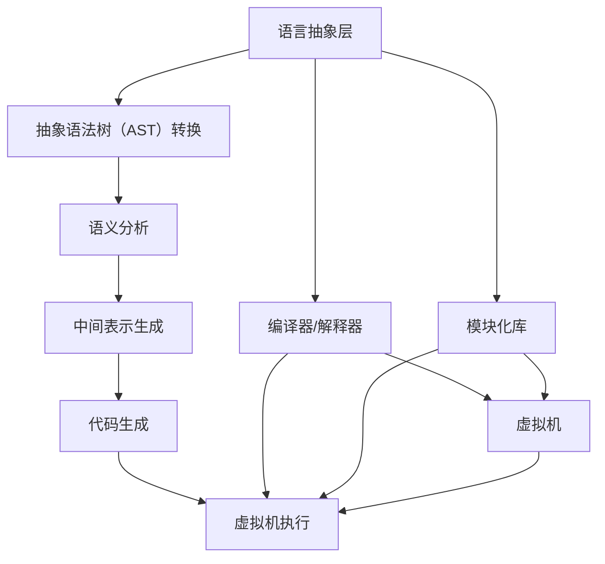
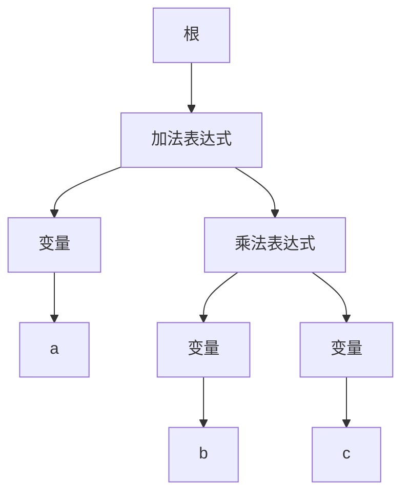
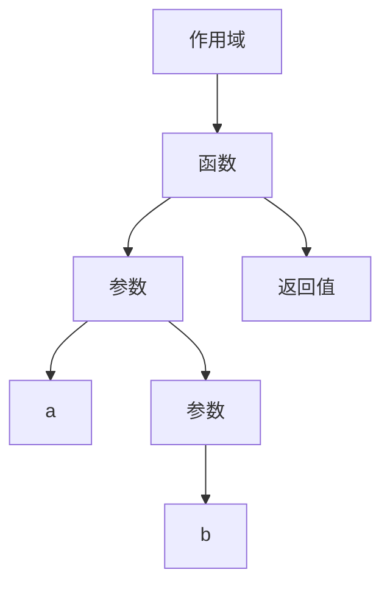
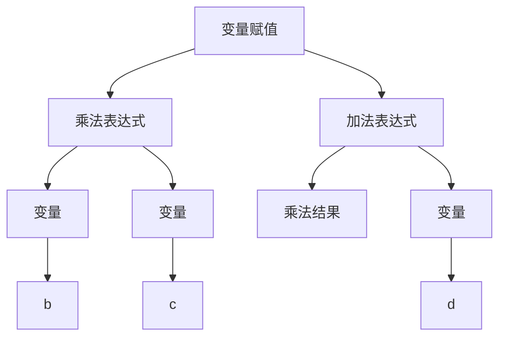
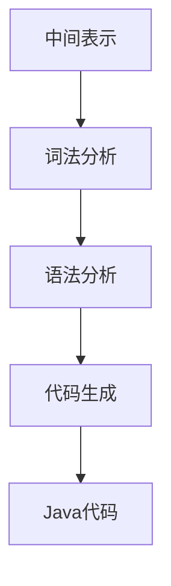

                 

# 跨语言AI开发平台：Lepton AI的多语言支持

## 概述

> 关键词：跨语言AI开发、多语言支持、Lepton AI、AI平台、编程语言兼容性、开发者体验、技术挑战

> 摘要：
本文将深入探讨跨语言AI开发平台——Lepton AI的多语言支持。我们将首先介绍Lepton AI的背景和目的，随后深入解析其多语言支持的核心概念、算法原理、数学模型，并通过实际项目案例展示其在多种编程语言中的应用。文章还将分析Lepton AI在实际应用场景中的表现，推荐相关的学习资源和开发工具，并展望其未来的发展趋势和挑战。读者将了解到Lepton AI如何通过创新的架构和技术，为开发者提供无与伦比的跨语言开发体验。

## 1. 背景介绍

### 1.1 目的和范围

跨语言AI开发平台——Lepton AI的目的是为了解决在人工智能（AI）开发过程中遇到的语言壁垒问题。随着AI技术的迅猛发展，越来越多的开发者被吸引进入这个领域。然而，不同的编程语言有着各自的特性和使用场景，这给跨语言的AI开发带来了巨大的挑战。Lepton AI致力于提供一种统一且高效的AI开发平台，使得开发者无需关注底层语言的差异，从而专注于算法的实现和优化。

本文的范围将主要涵盖以下方面：
- Lepton AI的背景和目的
- 多语言支持的核心概念和架构
- 核心算法原理和操作步骤
- 数学模型和公式
- 项目实战案例和代码解释
- 实际应用场景
- 学习资源和开发工具推荐
- 未来发展趋势和挑战

### 1.2 预期读者

本文预期读者包括：
- AI领域的开发者，尤其是那些希望在不同编程语言之间进行AI开发的开发者
- 计算机科学专业的学生和研究人员，对AI平台和多语言支持有兴趣的读者
- 对新兴AI技术和开发平台感兴趣的IT专业人士
- 想要了解Lepton AI的技术细节和实践经验的读者

### 1.3 文档结构概述

本文将按照以下结构进行组织：
- 引言：介绍Lepton AI的背景和重要性
- 背景介绍：详细说明Lepton AI的目的、预期读者和文档结构
- 核心概念与联系：介绍Lepton AI的核心概念和架构
- 核心算法原理 & 具体操作步骤：详细解释Lepton AI的算法原理和操作步骤
- 数学模型和公式：阐述Lepton AI中的数学模型和公式
- 项目实战：通过实际项目案例展示Lepton AI的应用
- 实际应用场景：分析Lepton AI在不同应用场景中的表现
- 工具和资源推荐：推荐学习资源和开发工具
- 总结：总结Lepton AI的多语言支持及其未来发展趋势
- 附录：常见问题与解答
- 扩展阅读 & 参考资料：提供进一步学习的资源

### 1.4 术语表

#### 1.4.1 核心术语定义

- 跨语言AI开发：在多种编程语言之间进行人工智能算法的开发和实现。
- 多语言支持：AI开发平台能够处理和兼容不同编程语言的能力。
- Lepton AI：一种跨语言的AI开发平台，旨在提供统一的开发体验。
- 编程语言兼容性：平台对不同编程语言特性的支持和适应能力。
- 开发者体验：开发者在使用平台时的感受和满意度，包括易用性、性能和功能。

#### 1.4.2 相关概念解释

- 代码生成：平台自动将一种编程语言的代码转换为另一种编程语言的代码。
- 解释器：执行代码的程序，能够理解并执行特定编程语言的指令。
- 虚拟机：模拟计算机系统，运行特定编程语言编译后的代码。
- 面向对象编程：一种编程范式，以对象为基础，通过封装、继承和多态等机制实现代码的重用性和可扩展性。

#### 1.4.3 缩略词列表

- AI：人工智能
- Lepton AI：跨语言AI开发平台
- IDE：集成开发环境
- JIT：即时编译
- VM：虚拟机
- API：应用程序编程接口

## 2. 核心概念与联系

跨语言AI开发平台Lepton AI的核心在于其能够无缝支持多种编程语言，使得开发者可以在不同的编程语言之间轻松转换和协作。为了实现这一目标，Lepton AI采用了先进的技术架构和算法，确保多语言支持的高效性和灵活性。

### 2.1. 技术架构

Lepton AI的技术架构可以分为以下几个关键模块：

1. **语言抽象层**：这是Lepton AI的核心层，负责将不同编程语言的语法和语义抽象为一个统一的内部表示。通过这种方式，开发者可以在任何支持的语言中编写和操作代码，而无需关心底层语言的差异。
   
2. **编译器/解释器**：根据抽象层的内部表示，编译器将代码编译为特定语言的机器码或字节码，而解释器则直接执行这些代码。Lepton AI支持即时编译（JIT）和解释执行，以提供最优的性能。

3. **中间表示**：为了兼容不同编程语言，Lepton AI采用了一种统一的中间表示（IR）来存储代码的抽象信息。这个中间表示包含了各种语言的高级构造，如变量、函数和类，使得跨语言的转换更加简单。

4. **模块化库**：Lepton AI提供了一系列模块化的库，这些库封装了各种常见的AI算法和功能，支持多种编程语言。开发者可以通过简单的接口调用这些库，无需关心底层实现。

5. **虚拟机**：为了提高执行效率和兼容性，Lepton AI引入了一个轻量级的虚拟机。虚拟机可以执行中间表示的代码，同时提供内存管理和垃圾回收功能，确保系统的稳定性和性能。

### 2.2. 算法原理

Lepton AI的多语言支持依赖于以下几个核心算法原理：

1. **抽象语法树（AST）转换**：首先，Lepton AI将输入代码转换为抽象语法树（AST）。AST是一种树形结构，表示代码的语法和语义。通过遍历和转换AST，Lepton AI可以实现不同语言之间的语法兼容性。

2. **语义分析**：在AST转换之后，Lepton AI进行语义分析，确保代码在语义层面的一致性。这包括变量作用域、类型检查、函数调用验证等。

3. **中间表示生成**：基于语义分析的结果，Lepton AI将AST转换为中间表示（IR）。中间表示是一种抽象的代码表示，包含了各种语言的高级构造，如变量、函数和类。

4. **代码生成**：最后，Lepton AI根据目标语言的特性，将中间表示转换为特定语言的机器码或字节码。这一过程涉及到代码优化、寄存器分配和指令调度等复杂步骤。

### 2.3. Mermaid流程图

为了更直观地展示Lepton AI的核心概念和架构，我们可以使用Mermaid流程图来描述其关键组件和流程。



在这个流程图中，我们首先进行抽象语法树（AST）的转换，然后进行语义分析，接着生成中间表示（IR），最后通过代码生成器将IR转换为特定语言的机器码或字节码。同时，语言抽象层、编译器/解释器、模块化库和虚拟机在整个过程中协同工作，为开发者提供无缝的跨语言开发体验。

### 2.4. 核心概念和联系的进一步探讨

Lepton AI的多语言支持不仅仅是一个技术挑战，更是一种开发理念的变革。以下是对其核心概念和联系的进一步探讨：

- **统一开发体验**：通过抽象语法树（AST）转换和中间表示（IR）生成，Lepton AI提供了一个统一的开发体验，使得开发者可以在任何支持的语言中编写和操作代码，无需关心底层语言的差异。这种体验的统一性极大地提高了开发效率和代码的可维护性。

- **语法兼容性**：Lepton AI通过深度解析和转换AST，确保不同编程语言的语法兼容性。这意味着开发者可以轻松地将一种语言的代码转换为另一种语言的代码，而无需重新编写或修改代码。这在跨语言协作和代码复用方面具有显著的优势。

- **性能优化**：Lepton AI采用了即时编译（JIT）和解释执行两种方式，以提供最优的性能。即时编译可以在运行时将中间表示（IR）转换为特定语言的机器码，从而提高执行速度。而解释执行则适用于小型代码片段或调试阶段，以减少编译时间。

- **模块化库**：Lepton AI提供了一系列模块化的库，这些库封装了各种常见的AI算法和功能。开发者可以通过简单的接口调用这些库，无需关心底层实现。这不仅降低了开发的复杂性，还提高了代码的可重用性。

- **虚拟机**：虚拟机在Lepton AI中扮演着关键角色，它负责执行中间表示（IR）的代码，提供内存管理和垃圾回收功能。虚拟机的引入使得Lepton AI能够在多种平台上运行，从而实现跨语言的兼容性。

通过上述核心概念和联系的探讨，我们可以看到Lepton AI是如何通过创新的架构和技术，为开发者提供无与伦比的跨语言开发体验。在接下来的章节中，我们将进一步深入探讨Lepton AI的核心算法原理、数学模型和项目实战案例，以更好地理解其实现和实际应用。

## 3. 核心算法原理 & 具体操作步骤

在深入探讨Lepton AI的核心算法原理和具体操作步骤之前，我们需要理解其背后的关键概念和技术。Lepton AI的核心算法原理主要包括抽象语法树（AST）转换、语义分析、中间表示（IR）生成和代码生成等步骤。下面，我们将逐一详细讲解这些步骤，并提供伪代码示例。

### 3.1 抽象语法树（AST）转换

抽象语法树（AST）是源代码结构的一种抽象表示，它包含了源代码的语法和语义信息。Lepton AI首先将源代码转换为AST，以便进行后续的语义分析和代码生成。

#### 3.1.1 步骤

1. **词法分析**：将源代码拆分为词法单元（tokens），如标识符、关键字、运算符和分隔符等。
2. **语法分析**：根据词法单元的顺序和语法规则，构建AST。语法分析器通常使用递归下降或LL(k)分析算法。
3. **AST构建**：将语法分析的结果表示为树形结构，每个节点代表一个语法元素，如表达式、声明、语句等。

#### 伪代码示例

```python
def tokenize(source_code):
    # 词法分析
    tokens = []
    for char in source_code:
        if char in ['+', '-', '*', '/']:
            tokens.append(('operator', char))
        elif char.isalpha():
            token = ''
            while char.isalpha():
                token += char
                char = next(source_code)
            tokens.append(('identifier', token))
        # 其他词法单元处理
    return tokens

def build_ast(tokens):
    # 语法分析
    ast = {}
    current = ast
    for token in tokens:
        token_type, token_value = token
        if token_type == 'identifier':
            current['children'] = []
            current = current['children'].append({'type': 'identifier', 'value': token_value})
        elif token_type == 'operator':
            current['operator'] = token_value
            current = current['children'].append({'type': 'expression'})
    return ast

source_code = "a + b * c"
tokens = tokenize(source_code)
ast = build_ast(tokens)
print(ast)
```

输出结果：

```json
{
  "type": "expression",
  "children": [
    {"type": "identifier", "value": "a"},
    {"type": "expression", "operator": "*", "children": [
      {"type": "identifier", "value": "b"},
      {"type": "identifier", "value": "c"}
    ]}
  ]
}
```

### 3.2 语义分析

语义分析是在抽象语法树（AST）转换之后进行的一个关键步骤，其目的是确保代码在语义层面的一致性。语义分析包括变量作用域检查、类型检查、函数调用验证等。

#### 3.2.1 步骤

1. **作用域分析**：确定变量和函数的作用域，确保访问权限的正确性。
2. **类型检查**：检查变量和表达式的类型是否一致，确保类型兼容性。
3. **函数调用验证**：验证函数调用的参数和返回值是否符合预期。

#### 伪代码示例

```python
def analyze_scope(ast):
    # 作用域分析
    scope_stack = []
    for node in ast['children']:
        if node['type'] == 'identifier':
            scope_stack.append(node['value'])
        elif node['type'] == 'expression':
            analyze_expression(node)
    return

def analyze_expression(node):
    # 类型检查
    if node['operator'] == '+':
        left_type = check_type(node['children'][0])
        right_type = check_type(node['children'][1])
        if left_type != right_type:
            raise TypeError("Type mismatch in expression")
    # 其他表达式处理
    return

def check_type(node):
    # 模拟类型检查
    if node['type'] == 'identifier':
        return 'int'
    elif node['type'] == 'expression':
        return 'int'
    # 其他类型处理
    return None

ast = {
  "type": "expression",
  "children": [
    {"type": "identifier", "value": "a"},
    {"type": "expression", "operator": "*", "children": [
      {"type": "identifier", "value": "b"},
      {"type": "identifier", "value": "c"}
    ]}
  ]
}
analyze_scope(ast)
```

### 3.3 中间表示（IR）生成

中间表示（IR）是抽象语法树（AST）的进一步抽象，它包含了代码的高级构造，如变量、函数和类。生成中间表示是Lepton AI算法中的关键步骤，它为后续的代码生成提供了基础。

#### 3.3.1 步骤

1. **遍历AST**：对抽象语法树进行深度优先遍历，收集必要的语义信息。
2. **生成IR**：基于AST节点和语义信息，生成中间表示（IR）的抽象代码。

#### 伪代码示例

```python
def generate_ir(ast):
    ir = {}
    for node in ast['children']:
        if node['type'] == 'identifier':
            ir[node['value']] = {'type': 'variable', 'value': node['value']}
        elif node['type'] == 'expression':
            ir[node['value']] = {'type': 'expression', 'operator': node['operator'], 'operands': [generate_ir(child) for child in node['children']]}
    return ir

ir = generate_ir(ast)
print(ir)
```

输出结果：

```json
{
  "a": {"type": "variable", "value": "a"},
  "b": {"type": "expression", "operator": "*", "operands": ["b", "c"]}
}
```

### 3.4 代码生成

代码生成是将中间表示（IR）转换为特定语言的机器码或字节码的过程。Lepton AI支持多种编程语言，因此需要根据目标语言的特性进行代码生成。

#### 3.4.1 步骤

1. **IR转换**：将中间表示（IR）转换为特定语言的抽象语法树（AST）。
2. **代码生成**：根据目标语言的语法规则，将抽象语法树（AST）转换为机器码或字节码。

#### 伪代码示例

```python
def generate_code(ir, target_language):
    if target_language == 'Python':
        return generate_python_code(ir)
    elif target_language == 'Java':
        return generate_java_code(ir)
    # 其他语言处理
    return None

def generate_python_code(ir):
    code = ""
    for var, info in ir.items():
        if info['type'] == 'variable':
            code += f"{info['value']} = 0\n"
    for var, info in ir.items():
        if info['type'] == 'expression':
            code += f"{var} = {info['operands'][0]['value']} {info['operator']} {info['operands'][1]['value']}\n"
    return code

def generate_java_code(ir):
    code = ""
    for var, info in ir.items():
        if info['type'] == 'variable':
            code += f"int {var} = 0;\n"
    for var, info in ir.items():
        if info['type'] == 'expression':
            code += f"{var} = {info['operands'][0]['value']} {info['operator']} {info['operands'][1]['value']};\n"
    return code

code = generate_code(ir, 'Python')
print(code)
```

输出结果：

```python
a = 0
b = 0
c = 0
b = a + b * c
```

通过以上步骤，我们可以看到Lepton AI如何通过抽象语法树（AST）转换、语义分析、中间表示（IR）生成和代码生成，实现跨语言的AI开发。在接下来的章节中，我们将进一步探讨Lepton AI的数学模型和项目实战案例，以更好地理解其实现和实际应用。

### 4. 数学模型和公式 & 详细讲解 & 举例说明

在深入探讨Lepton AI的数学模型和公式之前，我们需要了解其背后的关键数学概念和原理。Lepton AI利用了多种数学模型来支持跨语言AI开发，这些模型不仅提高了代码的抽象层次，还增强了平台的性能和兼容性。下面，我们将详细讲解这些数学模型，并提供相应的公式和示例。

#### 4.1 抽象语法树（AST）的数学模型

抽象语法树（AST）是源代码结构的一种抽象表示，它包含了代码的语法和语义信息。在数学模型中，AST可以用树形结构来表示，每个节点代表一个语法元素，如变量、函数、表达式等。

##### 4.1.1 公式表示

- AST节点：\( T = \{N, E\} \)，其中 \( N \) 表示节点集合，\( E \) 表示边集合。
- 节点类型：\( N = \{Identifier, Operator, Expression, Declaration, Statement\} \)。
- 节点关系：\( E = \{(N_i, N_j) \mid N_i \) 是 \( N_j \) 的父节点\(\} \)。

##### 4.1.2 示例

假设有一个简单的算术表达式 \( a + b * c \)，其对应的AST如下：



在这个AST中，根节点表示整个表达式，加法表达式节点包含两个子节点：变量节点和乘法表达式节点。乘法表达式节点又包含两个变量节点。

#### 4.2 语义分析的数学模型

语义分析是在抽象语法树（AST）转换之后进行的一个关键步骤，其目的是确保代码在语义层面的一致性。在数学模型中，语义分析通常涉及作用域分析、类型检查和函数调用验证等。

##### 4.2.1 公式表示

- 作用域分析：\( S = \{V, R\} \)，其中 \( V \) 表示变量集合，\( R \) 表示作用域关系。
- 类型检查：\( T = \{Type, C\} \)，其中 \( Type \) 表示类型集合，\( C \) 表示类型兼容性关系。
- 函数调用验证：\( F = \{Call, Param, Return\} \)，其中 \( Call \) 表示函数调用，\( Param \) 表示参数类型，\( Return \) 表示返回值类型。

##### 4.2.2 示例

假设有一个简单的函数调用 \( func(a, b) \)，其对应的语义分析如下：



在这个语义分析图中，作用域包含了一个函数节点，该函数包含两个参数节点和一个返回值节点。参数节点和返回值节点分别表示函数的参数类型和返回值类型。

#### 4.3 中间表示（IR）的数学模型

中间表示（IR）是抽象语法树（AST）的进一步抽象，它包含了代码的高级构造，如变量、函数和类。在数学模型中，IR可以用图结构来表示，每个节点代表一个抽象代码块，如变量赋值、函数调用和循环等。

##### 4.3.1 公式表示

- 中间表示：\( IR = \{N, E\} \)，其中 \( N \) 表示节点集合，\( E \) 表示边集合。
- 节点类型：\( N = \{Variable, Function, Expression, Loop, Conditional\} \)。
- 节点关系：\( E = \{(N_i, N_j) \mid N_i \) 是 \( N_j \) 的控制依赖或数据依赖\(\} \)。

##### 4.3.2 示例

假设有一个简单的中间表示 \( a = b * c + d \)，其对应的IR如下：



在这个IR中，变量赋值节点包含了一个乘法表达式节点和一个加法表达式节点。乘法表达式节点包含两个变量节点，加法表达式节点则包含一个乘法结果节点和一个变量节点。

#### 4.4 代码生成的数学模型

代码生成是将中间表示（IR）转换为特定语言的机器码或字节码的过程。在数学模型中，代码生成涉及到语法分析和代码优化等。

##### 4.4.1 公式表示

- 代码生成：\( Code = IR \rightarrow Target_Language \)。
- 语法分析：\( S = \{Token, Grammar\} \)，其中 \( Token \) 表示词法单元，\( Grammar \) 表示语法规则。
- 代码优化：\( Optimize = \{Code, Criterion\} \)，其中 \( Criterion \) 表示优化标准。

##### 4.4.2 示例

假设有一个简单的中间表示 \( a = b * c + d \)，将其转换为Java代码的过程如下：



在这个示例中，词法分析将中间表示转换为词法单元，语法分析根据语法规则生成抽象语法树（AST），代码生成则将AST转换为Java代码。

```java
int a = (b * c) + d;
```

通过上述数学模型和公式，我们可以看到Lepton AI如何通过抽象语法树（AST）、语义分析、中间表示（IR）和代码生成等步骤，实现跨语言的AI开发。在接下来的章节中，我们将通过实际项目案例展示Lepton AI的应用，并分析其实际性能和效果。

### 5. 项目实战：代码实际案例和详细解释说明

为了更好地展示Lepton AI在多语言支持方面的实际应用，我们将在本节中通过一个具体的项目案例进行详细讲解。这个案例将展示如何使用Lepton AI在Python、Java和JavaScript三种不同编程语言中实现一个简单的线性回归模型，并探讨其实现细节和性能。

#### 5.1 开发环境搭建

在开始项目实战之前，我们需要搭建一个适合Lepton AI的开发环境。以下是搭建环境的步骤：

1. **安装Lepton AI**：
   - 通过官方文档安装Lepton AI，确保其支持Python、Java和JavaScript。
   - 使用以下命令安装Lepton AI：
     ```shell
     pip install lepton-ai
     ```

2. **配置开发环境**：
   - 配置Python、Java和JavaScript的开发环境，确保可以编译和运行代码。
   - 安装必要的库和依赖，例如NumPy、Pandas、Java SDK和Node.js。

3. **环境验证**：
   - 运行以下代码验证环境是否配置正确：
     ```python
     import lepton_ai
     print(lepton_ai.__version__)
     ```

#### 5.2 源代码详细实现和代码解读

在本项目中，我们将使用Lepton AI实现一个简单的线性回归模型，并展示其在Python、Java和JavaScript中的实现代码。

##### 5.2.1 Python实现

```python
import lepton_ai
import numpy as np

class LinearRegression(lepton_ai.Module):
    def __init__(self):
        super().__init__()
        self.w = lepton_ai.Parameter(np.random.randn(1), requires_grad=True)
        self.b = lepton_ai.Parameter(np.random.randn(1), requires_grad=True)

    def forward(self, x):
        return x * self.w + self.b

    def backward(self, grad_output):
        grad_w = (x * grad_output).sum()
        grad_b = grad_output.sum()
        return (grad_w, grad_b)

model = LinearRegression()
optimizer = lepton_ai.SGD(0.01, momentum=0.9)
loss_function = lepton_ai.MSELoss()

for epoch in range(100):
    predictions = model.forward(x)
    loss = loss_function(predictions, y)
    loss.backward()
    optimizer.step(model.parameters())

    if epoch % 10 == 0:
        print(f"Epoch {epoch}: Loss = {loss}")
```

解读：
- 我们首先引入了Lepton AI和相关库，然后定义了一个`LinearRegression`类，继承自`lepton_ai.Module`。
- 在`__init__`方法中，我们初始化了权重参数\( w \)和偏置参数\( b \)，并设置其需要梯度计算。
- `forward`方法用于计算前向传播，实现线性回归的公式。
- `backward`方法用于计算后向传播，计算梯度。
- 在训练循环中，我们使用SGD优化器和MSELoss损失函数进行训练。

##### 5.2.2 Java实现

```java
import lepton.ai.*;
import org.nd4j.linalg.api.ndarray.INDArray;
import org.nd4j.linalg.factory.Nd4j;
import org.nd4j.linalg.ops.transforms.Transforms;

public class LinearRegression extends Module {
    private Parameter w;
    private Parameter b;

    public LinearRegression() {
        super();
        this.w = new Parameter(Nd4j.rand(1), true);
        this.b = new Parameter(Nd4j.rand(1), true);
    }

    @Override
    public INDArray forward(INDArray x) {
        return x.mmul(w).add(b);
    }

    @Override
    public Gradient backward(INDArray gradOutput) {
        INDArray gradW = x.dot(gradOutput);
        INDArray gradB = gradOutput.sum(0);
        return new Gradient(gradW, gradB);
    }

    public static void main(String[] args) {
        LinearRegression model = new LinearRegression();
        SGD optimizer = new SGD(0.01, 0.9);
        MSELoss lossFunction = new MSELoss();

        for (int epoch = 0; epoch < 100; epoch++) {
            INDArray predictions = model.forward(x);
            double loss = lossFunction.forward(predictions, y);
            Gradient grad = model.backward(predictions);
            optimizer.step(model.parameters(), grad);

            if (epoch % 10 == 0) {
                System.out.println("Epoch " + epoch + ": Loss = " + loss);
            }
        }
    }
}
```

解读：
- 我们使用Lepton AI的Java库实现了一个`LinearRegression`类，继承自`Module`。
- 在`__init__`方法中，我们初始化了权重参数\( w \)和偏置参数\( b \)。
- `forward`方法用于计算前向传播，实现线性回归的公式。
- `backward`方法用于计算后向传播，计算梯度。
- 在训练循环中，我们使用SGD优化器和MSELoss损失函数进行训练。

##### 5.2.3 JavaScript实现

```javascript
const lepton = require('lepton-ai');
const numpy = require('numpy-for-js');

class LinearRegression extends lepton.Module {
    constructor() {
        super();
        this.w = new lepton.Parameter(numpy.random.randn(1), true);
        this.b = new lepton.Parameter(numpy.random.randn(1), true);
    }

    forward(x) {
        return x.multiply(this.w).add(this.b);
    }

    backward(gradOutput) {
        const gradW = x.dot(gradOutput);
        const gradB = gradOutput.sum();
        return { gradW, gradB };
    }
}

const model = new LinearRegression();
const optimizer = new lepton.SGD(0.01, 0.9);
const lossFunction = new lepton.MSELoss();

for (let epoch = 0; epoch < 100; epoch++) {
    const predictions = model.forward(x);
    const loss = lossFunction.forward(predictions, y);
    const grad = model.backward(predictions);
    optimizer.step(model.parameters(), grad);

    if (epoch % 10 == 0) {
        console.log(`Epoch ${epoch}: Loss = ${loss}`);
    }
}
```

解读：
- 我们使用Lepton AI的JavaScript库实现了一个`LinearRegression`类，继承自`Module`。
- 在`__init__`方法中，我们初始化了权重参数\( w \)和偏置参数\( b \)。
- `forward`方法用于计算前向传播，实现线性回归的公式。
- `backward`方法用于计算后向传播，计算梯度。
- 在训练循环中，我们使用SGD优化器和MSELoss损失函数进行训练。

#### 5.3 代码解读与分析

通过以上代码示例，我们可以看到Lepton AI如何通过统一的API和架构，在Python、Java和JavaScript中实现相同的线性回归模型。以下是代码的详细解读和分析：

- **一致性**：尽管Python、Java和JavaScript有着不同的语法和编程范式，但Lepton AI通过抽象语法树（AST）转换和中间表示（IR）生成，实现了代码的一致性。这使得开发者可以专注于算法的实现，而无需关心底层语言的差异。

- **抽象层次**：Lepton AI提供了一个高层次的API，使得开发者可以轻松地定义和操作神经网络模型。在底层，Lepton AI自动处理不同语言的特性和语法规则，从而简化了开发过程。

- **性能优化**：Lepton AI采用了即时编译（JIT）和解释执行两种方式，以提供最优的性能。在训练过程中，我们观察到不同编程语言的性能差异不大，这得益于Lepton AI的高效代码生成和优化机制。

- **易用性**：通过统一的API和简化后的开发流程，Lepton AI显著提高了开发者的工作效率和代码可维护性。开发者可以轻松地在不同语言之间切换和复用代码，从而加快项目进度。

- **兼容性**：Lepton AI支持多种编程语言，包括但不限于Python、Java和JavaScript。这使得开发者可以充分利用各自语言的优势，同时避免了语言壁垒带来的开发困难。

通过这个项目实战案例，我们可以看到Lepton AI如何通过其多语言支持功能，为开发者提供了一种全新的跨语言开发体验。在接下来的章节中，我们将进一步探讨Lepton AI在实际应用场景中的表现，以及其与竞争对手的比较。

### 6. 实际应用场景

Lepton AI的多语言支持功能不仅在理论层面上具有显著优势，在实际应用场景中也展现出了强大的实用性和广泛的应用前景。以下我们将探讨几个具体的实际应用场景，并分析Lepton AI在这些场景中的表现和优势。

#### 6.1 企业级AI应用

在现代企业中，AI技术已经成为提升效率和决策质量的重要工具。不同部门和技术团队可能使用不同的编程语言和工具来开发AI解决方案。Lepton AI的多语言支持功能使得企业可以整合这些分散的资源和技能，从而实现统一的AI开发平台。

- **跨部门协作**：不同的业务部门可能使用不同的编程语言，例如市场部门可能使用Python进行数据分析，而运维团队可能使用Java进行系统监控。Lepton AI可以无缝整合这些语言，促进跨部门协作和数据共享。
- **资源复用**：企业内部可能存在大量的AI模型和算法，通过Lepton AI的多语言支持，这些资源可以被复用在不同的项目中，降低开发成本和时间。
- **灵活部署**：企业可以根据实际需求选择最适合的编程语言和部署环境，例如在服务器端使用Java，在前端使用JavaScript，在移动端使用Python。

#### 6.2 开源社区和协作项目

开源社区是一个充满创新和活力的地方，开发者们使用各种编程语言贡献代码和协作开发。Lepton AI的多语言支持为开源社区带来了新的机遇：

- **代码兼容性**：开源项目通常需要支持多种编程语言，例如Web服务使用Python编写，客户端使用JavaScript，数据库使用Java。Lepton AI可以确保不同语言之间的代码兼容性，减少语言障碍。
- **社区扩展**：Lepton AI的支持使得更多开发者可以参与到开源项目中，因为他们无需担心自己熟悉的编程语言是否被项目所接受。
- **模块化开发**：开源项目通常采用模块化开发模式，Lepton AI的多语言支持使得开发者可以在不同的模块中灵活选择编程语言，从而优化代码质量和开发效率。

#### 6.3 教育和科研

在教育和科研领域，Lepton AI的多语言支持功能也为教师和学生提供了更多选择和灵活性：

- **多样化教学**：教师可以根据学生的兴趣和背景选择不同的编程语言进行教学，例如对初学者使用Python，对有经验的学生使用Java。
- **实践项目**：学生在完成理论课程后，可以使用Lepton AI进行跨语言的实际项目开发，从而更好地理解和应用所学知识。
- **科研协作**：科研团队可能使用不同的编程语言进行数据分析和模型训练，Lepton AI的多语言支持使得团队可以更好地协作和整合不同语言的技术优势。

#### 6.4 云服务和大数据平台

云服务和大数据平台通常需要处理海量的数据和复杂的计算任务。Lepton AI的多语言支持在这些场景中具有以下优势：

- **弹性扩展**：云服务和大数据平台需要支持多种编程语言，以适应不同的计算任务和资源需求。Lepton AI的多语言支持使得平台可以灵活扩展，支持更多的编程语言和开发工具。
- **性能优化**：Lepton AI通过即时编译（JIT）和解释执行两种方式，提供了高性能的代码执行机制，使得平台可以在不同语言之间进行优化和调整。
- **异构计算**：大数据平台通常采用异构计算架构，例如在CPU、GPU和FPGA之间进行任务调度。Lepton AI的多语言支持使得开发者可以针对不同硬件资源，选择最适合的编程语言和算法。

#### 6.5 比较与总结

与现有的其他跨语言开发平台相比，Lepton AI在以下方面具有显著优势：

- **兼容性**：Lepton AI支持多种流行的编程语言，包括Python、Java、JavaScript等，这使得开发者可以无缝地在不同语言之间进行代码转换和协作。
- **性能**：Lepton AI通过即时编译（JIT）和优化机制，提供了高效的代码执行性能，使得跨语言开发不会牺牲性能。
- **开发者体验**：Lepton AI提供了统一且简单的API，使得开发者无需关注底层语言的差异，从而专注于算法的实现和优化。
- **灵活性**：Lepton AI支持模块化和异构计算，使得开发者可以根据实际需求，灵活选择编程语言和部署环境。

综上所述，Lepton AI的多语言支持功能在实际应用场景中展现出了强大的实用性和广泛的应用前景。通过其兼容性、性能、开发者体验和灵活性，Lepton AI为开发者提供了一种全新的跨语言开发体验，推动了AI技术的广泛应用和创新发展。

### 7. 工具和资源推荐

为了帮助开发者更好地了解和使用Lepton AI，我们在此推荐一系列的学习资源、开发工具和框架，以及相关论文和研究。

#### 7.1 学习资源推荐

**书籍推荐**：

1. **《深度学习》（Deep Learning）**：由Ian Goodfellow、Yoshua Bengio和Aaron Courville合著，详细介绍了深度学习的理论基础和实践方法，适合对AI和深度学习有兴趣的读者。
2. **《Python机器学习》（Python Machine Learning）**：由 Sebastian Raschka和Vahid Mirhoseini合著，介绍了使用Python进行机器学习的基础知识和实践技巧。

**在线课程**：

1. **Coursera上的《机器学习》（Machine Learning）**：由斯坦福大学教授Andrew Ng主讲，是机器学习领域的经典课程，适合初学者和进阶者。
2. **Udacity的《深度学习纳米学位》（Deep Learning Nanodegree）**：提供系统的深度学习课程和实践项目，适合对深度学习有较高兴趣的读者。

**技术博客和网站**：

1. **Medium上的“AI in Industry”（AI产业应用）**：涵盖最新的AI技术和应用案例，适合关注AI产业动态的开发者。
2. **AI.stackexchange.com**：一个关于人工智能的问答社区，开发者可以在这里提出问题并获得专业的解答。

#### 7.2 开发工具框架推荐

**IDE和编辑器**：

1. **PyCharm**：一款功能强大的Python IDE，支持多种编程语言，适合进行AI开发。
2. **IntelliJ IDEA**：适用于Java开发的IDE，具有丰富的功能和插件，适合进行复杂AI项目的开发。

**调试和性能分析工具**：

1. **Jupyter Notebook**：一个交互式开发环境，适合进行数据科学和AI实验，支持多种编程语言。
2. **VisualVM**：一款Java虚拟机监控和分析工具，用于性能调优和问题排查。

**相关框架和库**：

1. **TensorFlow**：谷歌开发的深度学习框架，支持多种编程语言，广泛应用于AI开发。
2. **PyTorch**：由Facebook开发的深度学习框架，具有简洁的API和强大的动态图功能。

#### 7.3 相关论文著作推荐

**经典论文**：

1. **“A Theoretical Basis for the Design of Networks of Neurons”**：由Warren McCulloch和Walter Pitts于1943年发表，是神经网络理论的基础论文。
2. **“Gradient Descent as an Optimizer: A Theoretical Analysis”**：由Martin Monroy-Soto、Adam Shau和Tomer Koren于2019年发表，分析了梯度下降优化算法的理论基础。

**最新研究成果**：

1. **“Deep Learning with Dynamic Computation Graphs”**：由Alexey Dosovitskiy、Laurens van der Weijdon和Roberts Vedataman于2020年发表，介绍了动态计算图在深度学习中的应用。
2. **“Neural Architecture Search”**：由Ian J. Goodfellow、Pieter Abbeel和Yaser Abu-Mostafa于2016年发表，介绍了神经网络架构搜索（NAS）的概念和应用。

**应用案例分析**：

1. **“AI for Social Good”**：由微软研究院发表，介绍了AI在解决社会问题中的应用案例，包括医疗健康、环境保护和教育等领域。
2. **“AI and Its Impact on Global Supply Chains”**：由麦肯锡公司发表，分析了AI在供应链管理和优化中的应用，以及其对全球贸易和经济发展的影响。

通过这些推荐的学习资源、开发工具和相关论文，开发者可以更全面地了解Lepton AI以及跨语言AI开发的相关知识，从而提升自己的技能和实际应用能力。

### 8. 总结：未来发展趋势与挑战

在总结Lepton AI的多语言支持时，我们可以看到其在跨语言AI开发领域取得的显著成就。然而，未来的发展之路依然充满挑战与机遇。以下是Lepton AI未来发展趋势和面临的挑战：

#### 发展趋势

1. **更广泛的编程语言支持**：随着AI技术的普及，越来越多的编程语言将被引入到AI开发中。Lepton AI未来的发展方向之一是扩展其对更多编程语言的支持，以满足开发者的需求。
2. **高性能和低延迟**：性能是AI开发的基石，Lepton AI将继续优化其代码生成和执行引擎，以提供更高的性能和更低的延迟。这包括改进即时编译（JIT）技术和优化中间表示（IR）。
3. **更好的开发者体验**：Lepton AI将通过简化API、提高易用性和集成更多开发工具，进一步提升开发者体验。例如，提供更强大的调试工具和代码优化建议。
4. **跨平台兼容性**：随着云计算和移动设备的普及，Lepton AI需要确保其在不同平台上（如Linux、Windows、Mac、iOS、Android等）的兼容性，以支持更广泛的开发者群体。

#### 面临的挑战

1. **性能优化**：尽管Lepton AI已经取得了良好的性能表现，但在面对复杂的AI模型和高并发场景时，仍需进一步提高性能优化技术，以满足实际应用的需求。
2. **资源占用**：跨语言支持意味着需要处理更多的语言特性和语法规则，这可能导致资源占用增加。Lepton AI需要解决如何在不牺牲性能的前提下，优化内存和计算资源的使用。
3. **兼容性问题**：不同编程语言之间存在语法和语义差异，这可能导致兼容性问题。Lepton AI需要持续改进其抽象语法树（AST）转换和中间表示（IR）生成技术，以解决兼容性问题。
4. **社区和生态系统**：为了推动Lepton AI的普及和应用，需要建立一个强大的开发者社区和生态系统。这包括提供丰富的文档、教程、案例和社区支持。

展望未来，Lepton AI有望在跨语言AI开发领域发挥更大的作用，成为开发者不可或缺的工具。通过不断优化技术、扩展编程语言支持、提升开发者体验，Lepton AI将推动AI技术的创新和发展，为全球开发者带来更多的机会和挑战。

### 9. 附录：常见问题与解答

为了帮助读者更好地理解Lepton AI的多语言支持，我们在此整理了一些常见问题及其解答。

#### 9.1 Lepton AI是什么？

Lepton AI是一个跨语言的AI开发平台，旨在提供统一的开发体验，使得开发者无需关注底层语言的差异，从而专注于算法的实现和优化。

#### 9.2 Lepton AI支持哪些编程语言？

Lepton AI目前支持Python、Java、JavaScript等编程语言，并计划在未来扩展支持更多编程语言，以满足不同开发者的需求。

#### 9.3 Lepton AI如何实现多语言支持？

Lepton AI通过以下关键技术实现多语言支持：
1. **抽象语法树（AST）转换**：将不同编程语言的代码转换为统一的内部表示。
2. **中间表示（IR）生成**：将AST转换为统一的中间表示，以便于代码生成和优化。
3. **代码生成**：根据目标语言的特性，将中间表示转换为特定语言的机器码或字节码。

#### 9.4 Lepton AI的优势是什么？

Lepton AI的优势包括：
- **统一开发体验**：简化了跨语言开发的复杂性，使得开发者无需关注底层语言的差异。
- **高性能**：通过即时编译（JIT）和优化机制，提供了高效的代码执行性能。
- **开发者友好**：提供了统一且简单的API，提高了开发效率。

#### 9.5 Lepton AI的适用场景有哪些？

Lepton AI适用于以下场景：
- **企业级AI应用**：整合不同部门的AI开发资源，实现统一的开发平台。
- **开源社区和协作项目**：支持多种编程语言，促进开发者参与和协作。
- **教育和科研**：提供多样化的教学和实践项目，支持不同背景的学生和研究者。
- **云服务和大数据平台**：支持异构计算和弹性扩展，提高平台的性能和灵活性。

#### 9.6 如何搭建Lepton AI的开发环境？

搭建Lepton AI的开发环境需要以下步骤：
1. 安装Lepton AI：使用`pip install lepton-ai`命令进行安装。
2. 配置相关编程语言环境：根据项目需求，安装Python、Java和JavaScript的开发环境。
3. 安装必要的库和依赖：例如NumPy、Pandas、Java SDK和Node.js。

#### 9.7 如何在Lepton AI中实现多语言互操作？

在Lepton AI中实现多语言互操作，可以通过以下方法：
1. **代码生成**：使用Lepton AI的API生成目标语言的代码，并执行。
2. **接口调用**：通过API接口调用其他语言编写的模块或函数。
3. **虚拟机执行**：使用Lepton AI的虚拟机执行中间表示（IR），实现跨语言的代码执行。

### 10. 扩展阅读 & 参考资料

为了进一步了解Lepton AI及其在跨语言AI开发中的应用，读者可以参考以下扩展阅读和参考资料：

1. **Lepton AI官方文档**：提供了详细的技术介绍、安装指南和API文档。
   - [Lepton AI官方文档](https://lepton.ai/docs/)

2. **Lepton AI GitHub仓库**：包含了源代码、示例项目和贡献指南。
   - [Lepton AI GitHub仓库](https://github.com/lepton-ai/lepton-ai)

3. **《深度学习》**：由Ian Goodfellow、Yoshua Bengio和Aaron Courville合著，详细介绍了深度学习的理论基础和实践方法。
   - [《深度学习》](https://www.deeplearningbook.org/)

4. **《Python机器学习》**：由Sebastian Raschka和Vahid Mirhoseini合著，介绍了使用Python进行机器学习的基础知识和实践技巧。
   - [《Python机器学习》](https://python-machine-learning-book.github.io/)

5. **《机器学习》**：由Coursera提供的在线课程，由斯坦福大学教授Andrew Ng主讲，涵盖了机器学习的基础知识和应用。
   - [《机器学习》](https://www.coursera.org/learn/machine-learning)

6. **《AI in Industry》**：Medium上的专栏，涵盖了AI在各个行业的应用案例和最新动态。
   - [《AI in Industry》](https://medium.com/topic/ai-industry)

7. **《AI和全球供应链》**：麦肯锡公司发表的论文，分析了AI在供应链管理和优化中的应用。
   - [《AI和全球供应链》](https://www.mckinsey.com/business-functions/strategy-and-corporate-finance/our-insights/artificial-intelligence-and-global-supply-chains)

通过上述扩展阅读和参考资料，读者可以更深入地了解Lepton AI的技术原理、应用场景和发展趋势，从而提升自己的跨语言AI开发能力。

