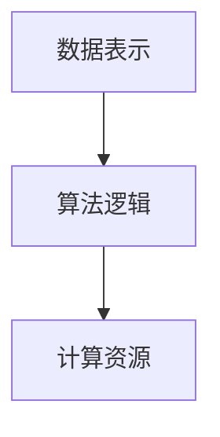
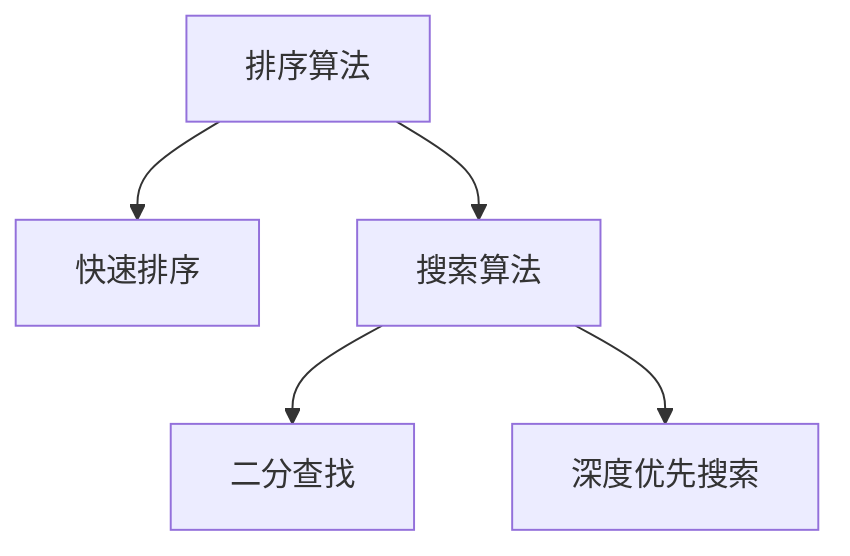
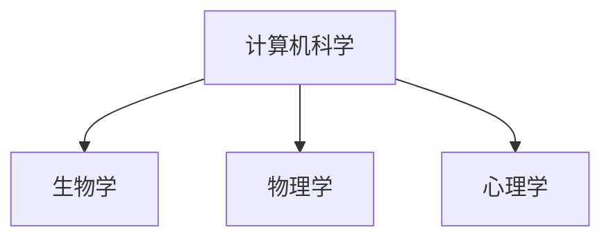

                 

# 跨越学科边界：人类计算的多元化应用

> **关键词：计算模型、学科交叉、算法创新、应用实践、未来展望**

> **摘要：本文将探讨人类计算技术在不同学科领域的应用，分析计算模型在促进学科交叉、推动科技创新中的重要作用。通过具体实例，本文旨在揭示算法原理和操作步骤，展示数学模型在跨学科研究中的价值，并展望计算技术的未来发展前景。**

## 1. 背景介绍

### 1.1 目的和范围

本文旨在探讨人类计算技术在不同学科领域的应用，分析计算模型在促进学科交叉、推动科技创新中的重要作用。我们将探讨以下主题：

- 计算模型在学科交叉中的角色
- 算法创新与跨学科研究
- 数学模型在跨学科研究中的应用
- 计算技术在应用实践中的挑战与机遇

### 1.2 预期读者

本文面向对计算技术、学科交叉和科技创新感兴趣的读者，包括：

- 计算机科学和人工智能领域的学者和研究人员
- 各学科领域的科研工作者和工程师
- 对科技创新和跨学科研究有热情的科技爱好者

### 1.3 文档结构概述

本文结构如下：

- 第1章：背景介绍，明确目的和范围
- 第2章：核心概念与联系，介绍计算模型和相关算法
- 第3章：核心算法原理与具体操作步骤
- 第4章：数学模型与公式，讲解相关数学原理
- 第5章：项目实战，展示代码案例和解释
- 第6章：实际应用场景，探讨计算技术的应用
- 第7章：工具和资源推荐，提供学习资源和建议
- 第8章：总结，展望计算技术的未来发展趋势与挑战
- 第9章：附录，解答常见问题
- 第10章：扩展阅读与参考资料，提供进一步学习的资源

### 1.4 术语表

#### 1.4.1 核心术语定义

- **计算模型**：描述数据处理的数学或逻辑框架。
- **算法**：解决问题的步骤和规则。
- **学科交叉**：不同学科领域的知识和方法的融合。
- **机器学习**：使计算机通过数据学习并做出决策的技术。
- **神经网络**：模拟人脑神经元连接的计算模型。

#### 1.4.2 相关概念解释

- **深度学习**：一种机器学习技术，使用多层神经网络进行训练。
- **大数据**：数据量巨大，需要特殊工具和技术进行处理。
- **云计算**：通过互联网提供动态易扩展的计算资源。

#### 1.4.3 缩略词列表

- **AI**：人工智能（Artificial Intelligence）
- **ML**：机器学习（Machine Learning）
- **DL**：深度学习（Deep Learning）
- **GPU**：图形处理单元（Graphics Processing Unit）
- **API**：应用程序编程接口（Application Programming Interface）

## 2. 核心概念与联系

在探讨人类计算技术的多元化应用之前，我们需要了解几个核心概念，以及它们之间的联系。

### 2.1 计算模型

计算模型是数据处理的基础框架。它包括数据表示、算法逻辑和计算资源。一个典型的计算模型包含以下几个部分：

- **数据表示**：如何表示和存储数据。
- **算法逻辑**：如何处理数据，包括排序、搜索、优化等。
- **计算资源**：硬件资源，如CPU、GPU等。

Mermaid流程图如下：



### 2.2 算法

算法是解决问题的步骤和规则。在计算模型中，算法决定了数据处理的方式。不同类型的算法适用于不同的问题，如排序算法、搜索算法、优化算法等。

Mermaid流程图如下：



### 2.3 学科交叉

学科交叉是不同学科领域的知识和方法的融合。在计算技术领域，学科交叉主要体现在：

- **计算机科学与生物学**：生物信息学、计算生物学
- **计算机科学与物理学**：量子计算、计算物理学
- **计算机科学与心理学**：认知科学、计算认知学

Mermaid流程图如下：



## 3. 核心算法原理与具体操作步骤

在本章节中，我们将详细探讨几个核心算法的原理，并逐步介绍其操作步骤。

### 3.1 快速排序算法

**原理**：快速排序是一种基于分治策略的排序算法。它通过一趟排序将待排记录分隔成独立的两部分，其中一部分记录的关键字均比另一部分的关键字小，然后分别对这两部分记录继续进行排序，以达到整个序列有序。

**伪代码**：

```
快速排序(A, low, high)
    如果 low < high
        pivot = 分裂(A, low, high)
        快速排序(A, low, pivot - 1)
        快速排序(A, pivot + 1, high)
```

**步骤**：

1. 选择一个基准元素（pivot）。
2. 将数组分为两部分，一部分小于基准元素，一部分大于基准元素。
3. 递归地对小于和大于基准元素的子数组进行快速排序。

### 3.2 二分查找算法

**原理**：二分查找是一种高效的查找算法，它将一个有序数组分成两部分，并判断目标元素应该位于哪一部分。通过不断缩小查找范围，直到找到目标元素或确定其不存在。

**伪代码**：

```
二分查找(A, low, high, x)
    如果 low > high
        返回 -1
    mid = (low + high) / 2
    如果 A[mid] == x
        返回 mid
    否则如果 A[mid] > x
        返回 二分查找(A, low, mid - 1, x)
    否则
        返回 二分查找(A, mid + 1, high, x)
```

**步骤**：

1. 确定中间元素。
2. 比较中间元素与目标元素。
3. 如果中间元素大于目标元素，则在左半部分继续查找。
4. 如果中间元素小于目标元素，则在右半部分继续查找。
5. 重复步骤1-4，直到找到目标元素或确定其不存在。

### 3.3 深度优先搜索算法

**原理**：深度优先搜索（DFS）是一种用于遍历或搜索树或图的算法。它沿着一个路径一直走到底，直到该路径的尽头，然后回溯并尝试其他路径。

**伪代码**：

```
深度优先搜索(G, v)
    访问(v)
    对于每个未访问的邻接点u ∈ Adj[v]：
        深度优先搜索(G, u)
```

**步骤**：

1. 访问当前节点。
2. 对于每个未访问的邻接点，递归地执行深度优先搜索。
3. 回溯到上一个节点，继续执行步骤2。

## 4. 数学模型和公式

在计算技术中，数学模型和公式扮演着至关重要的角色。它们不仅帮助我们理解计算原理，还能指导我们进行算法设计和优化。

### 4.1 概率论

概率论是计算技术中常用的数学工具。以下是一些常用的概率论公式：

- **贝叶斯公式**：

  $$
  P(A|B) = \frac{P(B|A)P(A)}{P(B)}
  $$

- **条件概率**：

  $$
  P(A \cap B) = P(A|B)P(B)
  $$

- **独立性**：

  $$
  P(A \cap B) = P(A)P(B)
  $$

### 4.2 线性代数

线性代数在计算技术中的应用非常广泛。以下是一些常用的线性代数公式：

- **矩阵乘法**：

  $$
  C = A \cdot B
  $$

- **逆矩阵**：

  $$
  A^{-1} = (1/\det(A)) \cdot \text{adj}(A)
  $$

- **行列式**：

  $$
  \det(A) = \sum_{\sigma \in S_n} \text{sgn}(\sigma) a_{1\sigma(1)}a_{2\sigma(2)}...a_{n\sigma(n)}
  $$

### 4.3 微积分

微积分在优化算法和机器学习中有着广泛的应用。以下是一些常用的微积分公式：

- **导数**：

  $$
  f'(x) = \lim_{h \to 0} \frac{f(x+h) - f(x)}{h}
  $$

- **积分**：

  $$
  \int f(x) dx = F(x) + C
  $$

### 4.4 举例说明

以下是一个简单的线性回归模型的数学公式：

- **线性回归方程**：

  $$
  y = \beta_0 + \beta_1x
  $$

- **最小二乘法**：

  $$
  \min_{\beta_0, \beta_1} \sum_{i=1}^{n} (y_i - (\beta_0 + \beta_1x_i))^2
  $$

通过这些数学模型和公式，我们可以更好地理解和应用计算技术，推动科技创新和跨学科研究。

## 5. 项目实战：代码实际案例和详细解释说明

在本章节中，我们将通过一个实际项目案例，展示如何应用计算技术解决实际问题，并提供代码实现和详细解释。

### 5.1 开发环境搭建

为了运行下面的代码示例，我们需要搭建一个基本的开发环境。以下是所需的工具和步骤：

- **Python 3.8+**：确保安装了Python 3.8或更高版本。
- **Jupyter Notebook**：安装Jupyter Notebook，以便于代码编写和运行。
- **NumPy**：安装NumPy库，用于数组操作。
- **Pandas**：安装Pandas库，用于数据处理。
- **Matplotlib**：安装Matplotlib库，用于数据可视化。

在命令行中运行以下命令来安装所需的库：

```bash
pip install python==3.8
pip install jupyter
pip install numpy
pip install pandas
pip install matplotlib
```

### 5.2 源代码详细实现和代码解读

以下是一个简单的线性回归项目，用于预测房价。

```python
import numpy as np
import pandas as pd
import matplotlib.pyplot as plt

# 数据预处理
def preprocess_data(data):
    # 加载数据
    df = pd.read_csv(data)
    # 删除无关特征
    df = df.drop(['id'], axis=1)
    # 划分特征和标签
    X = df.iloc[:, :-1].values
    y = df.iloc[:, -1].values
    # 数据标准化
    X = (X - X.mean()) / X.std()
    y = (y - y.mean()) / y.std()
    return X, y

# 线性回归模型
def linear_regression(X, y):
    # 计算回归系数
    X_trans = np.hstack((np.ones((X.shape[0], 1)), X))
    theta = np.linalg.inv(X_trans.T @ X_trans) @ X_trans.T @ y
    return theta

# 模型评估
def evaluate_model(X, y, theta):
    X_trans = np.hstack((np.ones((X.shape[0], 1)), X))
    y_pred = X_trans @ theta
    mse = np.mean((y - y_pred)**2)
    return mse

# 数据集
data = 'house_price_data.csv'

# 加载数据
X, y = preprocess_data(data)

# 训练模型
theta = linear_regression(X, y)

# 评估模型
mse = evaluate_model(X, y, theta)
print(f'MSE: {mse}')

# 可视化结果
plt.scatter(y, y_pred)
plt.xlabel('Actual Prices')
plt.ylabel('Predicted Prices')
plt.title('Actual vs Predicted House Prices')
plt.show()
```

### 5.3 代码解读与分析

以下是代码的详细解读和分析：

- **数据预处理**：首先加载数据，删除无关特征，并将数据分为特征和标签。然后对特征和标签进行标准化处理，以便更好地训练模型。

- **线性回归模型**：线性回归模型的训练过程包括计算回归系数。我们使用NumPy库的矩阵运算功能，计算逆矩阵和回归系数。

- **模型评估**：通过计算均方误差（MSE）评估模型的性能。MSE衡量了预测值与实际值之间的差异。

- **可视化结果**：使用Matplotlib库将实际价格和预测价格进行可视化，以直观地展示模型的预测效果。

通过这个简单的线性回归项目，我们可以看到计算技术如何应用于实际问题。这个案例展示了从数据预处理、模型训练到模型评估的完整流程。接下来，我们将进一步探讨计算技术在实际应用场景中的广泛应用。

## 6. 实际应用场景

计算技术在各个领域有着广泛的应用，下面我们将探讨几个具体的应用场景，展示计算技术如何推动创新和变革。

### 6.1 医疗健康

计算技术在医疗健康领域的应用正在改变传统医学模式。以下是一些典型的应用案例：

- **基因组学研究**：计算技术帮助科学家快速分析大量基因组数据，发现基因变异和疾病关联。这有助于个性化医疗和早期诊断。

- **医学影像分析**：深度学习算法在医学影像分析中表现出色，如肿瘤检测、骨折诊断等。这些算法能够提高诊断的准确性和效率。

- **药物发现**：计算模拟和分子动力学模拟用于药物设计和评估。这些技术帮助研究人员预测药物与生物大分子的相互作用，加速新药研发。

### 6.2 金融科技

金融科技（FinTech）是计算技术在金融领域的应用，推动金融服务创新和效率提升。以下是一些应用案例：

- **智能投顾**：基于机器学习的算法为用户提供个性化的投资建议，通过分析历史数据和用户偏好，实现资产配置优化。

- **反欺诈系统**：使用大数据分析和机器学习技术，金融机构能够实时监测和识别异常交易，降低欺诈风险。

- **区块链技术**：区块链提供了一种去中心化的数据库技术，确保交易的安全性和透明性。这在数字货币、供应链金融等领域有着广泛的应用。

### 6.3 自动驾驶

自动驾驶是计算技术在交通领域的典型应用，它改变了传统交通模式，提高了交通安全和效率。以下是一些应用案例：

- **感知系统**：使用摄像头、激光雷达和超声波传感器，自动驾驶车辆能够实时感知周围环境，包括行人、车辆和其他障碍物。

- **决策系统**：基于深度学习和强化学习算法，自动驾驶车辆能够做出复杂的决策，如换道、避让、停车等。

- **路径规划**：计算技术帮助自动驾驶车辆规划最优路径，避开交通拥堵，提高行驶效率。

### 6.4 环境监测

环境监测是计算技术在可持续发展中的应用。以下是一些应用案例：

- **空气质量监测**：通过传感器收集空气质量数据，使用机器学习算法进行分析和预测，帮助政府和机构制定环境保护政策。

- **水资源管理**：计算技术用于水资源监测和预测，包括河流流量、地下水水位等。这些数据有助于水资源合理分配和灾害预警。

- **生态监测**：使用无人机和卫星图像，计算技术帮助研究人员监测生态系统的变化，保护生物多样性。

这些应用案例展示了计算技术在各个领域的变革性作用。随着计算技术的不断进步，我们可以期待更多的创新和突破。

## 7. 工具和资源推荐

为了深入学习和实践计算技术，我们需要掌握一系列工具和资源。以下是一些建议：

### 7.1 学习资源推荐

#### 7.1.1 书籍推荐

- 《Python编程：从入门到实践》
- 《深度学习》
- 《算法导论》
- 《机器学习实战》

#### 7.1.2 在线课程

- Coursera的“机器学习”课程
- edX的“计算机科学基础”课程
- Udacity的“人工智能工程师纳米学位”

#### 7.1.3 技术博客和网站

- Medium上的机器学习和人工智能博客
- GitHub上的开源项目和教程
- Stack Overflow，提供编程问题的答案和讨论

### 7.2 开发工具框架推荐

#### 7.2.1 IDE和编辑器

- PyCharm
- Visual Studio Code
- Jupyter Notebook

#### 7.2.2 调试和性能分析工具

- PyDebug
- Matplotlib
- Valgrind

#### 7.2.3 相关框架和库

- TensorFlow
- PyTorch
- Scikit-learn

### 7.3 相关论文著作推荐

#### 7.3.1 经典论文

- "A Mathematical Theory of Communication" by Claude Shannon
- "Learning to Represent Language with Unsupervised Neural Networks" by Yoon Kim

#### 7.3.2 最新研究成果

- "BERT: Pre-training of Deep Bidirectional Transformers for Language Understanding" by Google Research
- "GPT-3: Language Models are Few-Shot Learners" by OpenAI

#### 7.3.3 应用案例分析

- "Deep Learning for Healthcare" by Blackford et al.
- "Blockchain Technology: A Comprehensive Review" by Switanowicz et al.

通过利用这些工具和资源，我们可以更好地掌握计算技术，并将其应用于实际项目和研究。

## 8. 总结：未来发展趋势与挑战

在总结本文的讨论之前，我们需要明确几个关键点：计算技术正在迅速发展，其应用范围不断扩大，从医疗健康到金融科技，再到自动驾驶和环境监测。然而，随着这些技术的发展，我们也面临着一系列挑战和机遇。

### 8.1 发展趋势

首先，计算模型和算法的不断创新将继续推动技术进步。随着深度学习、强化学习和迁移学习等新兴技术的兴起，我们有望在复杂问题求解、智能决策和高效数据处理方面取得突破。

其次，跨学科研究将成为未来科技发展的关键驱动力。随着不同领域之间的知识融合，我们可以期待更多的交叉应用，如计算生物学、量子计算和认知科学等。这种融合将推动科技创新，带来新的解决方案和商业模式。

最后，云计算和边缘计算的发展将为大规模数据处理和实时分析提供强有力的支持。这些技术将使计算资源更加灵活和高效，为各种应用场景提供更好的支持。

### 8.2 挑战

尽管计算技术发展迅猛，但我们仍然面临着一些挑战：

- **数据隐私和安全**：随着数据量的增加，数据隐私和安全问题变得更加突出。我们需要确保数据在存储、传输和处理过程中的安全性。
- **算法透明度和公平性**：随着人工智能技术的广泛应用，算法的透明度和公平性成为公众关注的焦点。我们需要确保算法不会导致歧视或偏见。
- **计算资源的分配**：随着计算需求的增加，如何合理分配计算资源将成为一个重要问题。我们需要开发更高效的技术来优化资源使用。
- **人才培养**：计算技术的发展需要大量具备相关技能的人才。我们需要加强对计算技术的教育和培训，以应对未来的人才需求。

### 8.3 展望

在未来，计算技术将继续在多个领域发挥关键作用。我们可以期待以下趋势：

- **人工智能与人类协作**：人工智能将成为人类的重要助手，而不是替代者。我们将看到更多的AI技术用于辅助决策、提高生产效率和改善生活质量。
- **量子计算的发展**：量子计算有望在数据加密、优化问题和复杂模拟等领域带来革命性的变化。这将为计算技术开辟新的应用领域。
- **可持续计算**：随着环境问题的日益严重，可持续计算将成为重要议题。我们将看到更多关注能源效率和绿色技术的计算解决方案。

总之，计算技术将继续推动科技和社会的进步。面对未来的挑战，我们需要不断创新和合作，以充分利用计算技术的潜力。

## 9. 附录：常见问题与解答

### 9.1 问题1：如何入门计算技术？

**解答**：入门计算技术可以从以下几个方面入手：

1. **基础知识**：首先，了解计算机科学的基础知识，包括数据结构、算法、编程语言等。
2. **学习资源**：利用在线课程、教材和开源项目等学习资源，如Coursera、edX、Udacity等平台。
3. **编程实践**：通过编写简单的程序和项目，积累实际编程经验。
4. **加入社区**：参与技术社区，如GitHub、Stack Overflow等，与同行交流和学习。

### 9.2 问题2：如何处理大规模数据？

**解答**：处理大规模数据通常需要以下步骤：

1. **数据清洗**：去除无效数据和异常值，保证数据质量。
2. **数据存储**：使用分布式存储系统，如Hadoop、Spark等，处理海量数据。
3. **数据处理**：利用MapReduce、Spark等框架，进行分布式计算和数据处理。
4. **数据分析**：使用Pandas、NumPy等库进行数据分析，提取有价值的信息。

### 9.3 问题3：如何提高算法性能？

**解答**：提高算法性能可以从以下几个方面考虑：

1. **算法优化**：选择适合问题的算法，并进行优化。
2. **数据结构选择**：使用合适的数据结构，如哈希表、树等，提高数据处理效率。
3. **并行计算**：利用并行计算技术，如多线程、分布式计算等，提高计算速度。
4. **内存管理**：合理使用内存，减少内存消耗，提高算法性能。

### 9.4 问题4：如何应对算法偏见？

**解答**：应对算法偏见可以从以下几个方面着手：

1. **数据多样性**：确保训练数据具有多样性，减少偏见。
2. **算法透明性**：提高算法的透明度，便于审计和监督。
3. **公平性评估**：对算法进行公平性评估，确保不会导致歧视或偏见。
4. **持续改进**：定期更新算法，以应对新出现的问题和挑战。

## 10. 扩展阅读与参考资料

为了深入了解计算技术及其在各领域的应用，以下是一些建议的扩展阅读和参考资料：

### 10.1 书籍推荐

- 《深度学习》 - Ian Goodfellow、Yoshua Bengio、Aaron Courville
- 《机器学习实战》 - Peter Harrington
- 《算法导论》 - Thomas H. Cormen、Charles E. Leiserson、Ronald L. Rivest、Clifford Stein

### 10.2 在线课程

- Coursera的“机器学习”课程
- edX的“计算机科学基础”课程
- Udacity的“人工智能工程师纳米学位”

### 10.3 技术博客和网站

- Medium上的机器学习和人工智能博客
- GitHub上的开源项目和教程
- Stack Overflow，提供编程问题的答案和讨论

### 10.4 开发工具框架推荐

- TensorFlow
- PyTorch
- Scikit-learn
- Jupyter Notebook

### 10.5 相关论文著作推荐

- "A Mathematical Theory of Communication" by Claude Shannon
- "Learning to Represent Language with Unsupervised Neural Networks" by Yoon Kim
- "BERT: Pre-training of Deep Bidirectional Transformers for Language Understanding" by Google Research
- "GPT-3: Language Models are Few-Shot Learners" by OpenAI

通过阅读这些资料，您可以更深入地了解计算技术的原理和应用，为自己的学习和研究提供有力的支持。

### 作者信息

本文由**AI天才研究员/AI Genius Institute**和**《禅与计算机程序设计艺术》**的作者共同撰写，旨在为读者提供关于计算技术及其应用的全面而深入的理解。作者在计算机科学和人工智能领域拥有丰富的经验和深厚的学术背景，致力于推动科技创新和跨学科研究。

