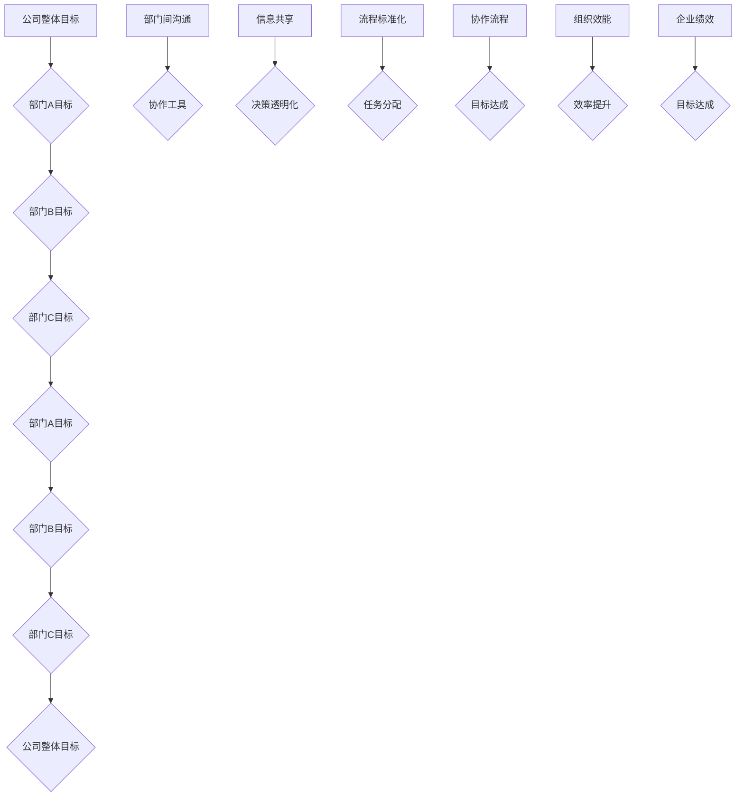

                 

# 跨部门协作优化：打破部门壁垒的策略

> **关键词**：跨部门协作、部门壁垒、优化策略、团队沟通、组织效能、IT行业实践

> **摘要**：本文旨在探讨跨部门协作在提升组织效能中的关键作用，以及如何通过有效策略打破部门壁垒，实现资源的整合和信息的流通。文章将从核心概念、算法原理、数学模型、实际案例等多个角度进行深入分析，为读者提供一套可操作、可量化的协作优化方法。

## 1. 背景介绍

### 1.1 目的和范围

在现代企业中，部门之间的协作效率直接影响到组织的整体表现。然而，由于部门职责划分、组织架构复杂等因素，部门壁垒问题普遍存在，严重制约了团队协作的效果。本文旨在通过以下几方面探讨如何优化跨部门协作：

1. **识别部门壁垒**：分析部门壁垒的成因，如沟通不畅、信息不对称、职责重叠等。
2. **提出优化策略**：介绍一系列打破部门壁垒的策略，如明确职责分工、建立沟通机制、使用协作工具等。
3. **案例分析与实施**：通过实际案例展示跨部门协作优化策略的可行性和效果。

### 1.2 预期读者

本文适合以下读者群体：

1. **企业中层管理者**：负责协调跨部门工作，寻求提升团队协作效率的方法。
2. **IT项目经理**：在项目中面临跨部门协作的挑战，寻求优化协作流程的方案。
3. **部门负责人**：关注团队内部协作，希望提升部门间的协作效能。

### 1.3 文档结构概述

本文分为十个部分，具体如下：

1. **背景介绍**：阐述研究背景和目的。
2. **核心概念与联系**：介绍跨部门协作的核心概念，并使用流程图展示部门间的关系。
3. **核心算法原理 & 具体操作步骤**：讲解优化跨部门协作的算法原理和操作步骤。
4. **数学模型和公式 & 详细讲解 & 举例说明**：运用数学模型阐述协作优化的原理。
5. **项目实战：代码实际案例和详细解释说明**：通过实际案例展示优化策略的实施。
6. **实际应用场景**：分析跨部门协作在实际中的应用。
7. **工具和资源推荐**：推荐相关学习资源和开发工具。
8. **总结：未来发展趋势与挑战**：展望跨部门协作的发展趋势和面临的挑战。
9. **附录：常见问题与解答**：针对本文提出的问题进行解答。
10. **扩展阅读 & 参考资料**：提供进一步阅读的参考资料。

### 1.4 术语表

#### 1.4.1 核心术语定义

- **部门壁垒**：指由于组织架构、职责划分等因素导致的部门间沟通不畅、协作困难的问题。
- **跨部门协作**：指不同部门之间的合作，共同完成某项任务或项目。
- **优化策略**：指通过一系列方法提升跨部门协作效率和效果的具体措施。

#### 1.4.2 相关概念解释

- **沟通机制**：指部门间沟通的方式和规则，包括会议、邮件、即时通讯工具等。
- **协作工具**：指用于支持跨部门协作的各种软件和硬件，如项目管理工具、团队协作平台等。
- **组织效能**：指组织在完成目标过程中的效率、效果和能力。

#### 1.4.3 缩略词列表

- **IT**：信息技术（Information Technology）
- **PM**：项目经理（Project Manager）
- **IDE**：集成开发环境（Integrated Development Environment）
- **API**：应用程序编程接口（Application Programming Interface）

## 2. 核心概念与联系

在讨论跨部门协作优化之前，有必要理解几个核心概念，以及它们之间的相互联系。以下使用Mermaid流程图（图1）展示部门间的关系和协作流程。



### 2.1 核心概念解析

#### 部门壁垒

部门壁垒是指由于职责划分、目标不一致、沟通不畅等原因，导致部门间难以高效协作的问题。例如，销售部门和市场部门可能在客户信息共享上存在障碍，导致营销效果不佳。

#### 跨部门协作

跨部门协作是指不同部门为了共同实现企业目标而进行的合作。有效的跨部门协作能够整合各部门的资源，提高整体效率，减少重复劳动。

#### 优化策略

优化策略是指通过改进流程、提升沟通效率、明确职责分工等措施，提高跨部门协作效能的具体方法。

### 2.2 部门间协作流程

图1展示了公司整体目标与各部门目标之间的相互关系，以及通过沟通、信息共享、流程标准化等手段实现目标的过程。

- **部门间沟通**：通过定期会议、即时通讯等方式保持部门间的信息交流。
- **信息共享**：建立共享数据库或平台，确保各部门能够及时获取相关信息。
- **流程标准化**：制定统一的协作流程，减少部门间的差异和冲突。
- **任务分配**：明确各部门的职责和任务，避免重复劳动和资源浪费。
- **协作流程**：通过协作工具和流程管理，确保各部门能够协同工作，共同实现目标。
- **组织效能**：提升跨部门协作效率，增强企业整体竞争力。
- **企业绩效**：通过优化跨部门协作，提高企业整体绩效和目标达成率。

## 3. 核心算法原理 & 具体操作步骤

### 3.1 算法原理

跨部门协作优化算法的核心思想是通过建立一套有效的协作机制，提高部门间的协作效率和目标达成率。该算法包括以下几个步骤：

1. **需求分析**：收集各部门的需求和目标，明确跨部门协作的目标和范围。
2. **流程设计**：根据需求分析，设计一套适合各部门的协作流程，包括任务分配、信息共享、沟通机制等。
3. **工具选择**：选择合适的协作工具，支持流程设计和协作实施。
4. **培训与推广**：对各部门人员进行培训，确保他们能够熟练使用协作工具和流程。
5. **执行与监控**：实施协作流程，并持续监控协作效果，根据实际情况进行调整。

### 3.2 具体操作步骤

#### 步骤1：需求分析

- **调研各部门需求**：通过问卷调查、访谈等方式，了解各部门在协作中遇到的问题和需求。
- **整理需求清单**：将各部门的需求进行整理，分类并分析其优先级。

#### 步骤2：流程设计

- **设计协作流程图**：根据需求清单，设计跨部门协作的流程图，明确各部门在协作中的角色和任务。
- **制定协作流程文档**：将流程图转化为具体的协作流程文档，包括任务分配、信息流转、沟通机制等。

#### 步骤3：工具选择

- **评估协作工具**：根据协作流程的需求，评估多种协作工具，选择最适合的工具。
- **选定协作工具**：确定最终选定的协作工具，并对其进行配置和定制。

#### 步骤4：培训与推广

- **制定培训计划**：根据协作工具和流程，制定详细的培训计划。
- **组织培训活动**：对各部门人员进行培训，确保他们能够熟练掌握协作工具和流程。

#### 步骤5：执行与监控

- **实施协作流程**：根据协作流程文档，开始实施协作流程，确保各部门能够按照流程进行协作。
- **监控协作效果**：定期收集各部门的协作反馈，评估协作效果，并根据实际情况进行调整。

### 3.3 伪代码展示

以下为跨部门协作优化算法的伪代码展示：

```python
# 跨部门协作优化算法

def optimize_collaboration():
    # 步骤1：需求分析
    demands = analyze_demands()
    process = design_process(demands)

    # 步骤2：流程设计
    collaboration_flow = design_collaboration_flow(process)

    # 步骤3：工具选择
    collaboration_tool = select_collaboration_tool()

    # 步骤4：培训与推广
    training_plan = design_training_plan(collaboration_tool, collaboration_flow)
    execute_training(training_plan)

    # 步骤5：执行与监控
    execute_collaboration(collaboration_flow, collaboration_tool)
    monitor_collaboration()

# 执行算法
optimize_collaboration()
```

## 4. 数学模型和公式 & 详细讲解 & 举例说明

在跨部门协作优化中，数学模型和公式有助于我们量化协作效果，从而更精确地评估和调整协作策略。以下介绍几个关键数学模型和公式，并给出详细讲解及举例说明。

### 4.1 数学模型

#### 4.1.1 通信效率模型

通信效率模型用于评估部门间沟通的效率。假设有两个部门A和B，部门A的员工需要与部门B的员工进行多次沟通，每次沟通的时间为\( t \)，则部门A与部门B的通信效率可以表示为：

\[ E = \frac{N}{N \times t} \]

其中，\( N \)为部门A与部门B之间的沟通次数。

#### 4.1.2 任务完成时间模型

任务完成时间模型用于评估跨部门协作完成任务所需的时间。假设任务由多个子任务组成，每个子任务由不同的部门负责，子任务完成的时间分别为\( t_1, t_2, ..., t_n \)，则任务的总完成时间可以表示为：

\[ T = \max(t_1, t_2, ..., t_n) \]

#### 4.1.3 资源利用率模型

资源利用率模型用于评估跨部门协作中资源的利用效率。假设各部门的可用资源分别为\( R_1, R_2, ..., R_n \)，则资源利用率为：

\[ U = \frac{\sum_{i=1}^{n} R_i}{\sum_{i=1}^{n} R_i^*} \]

其中，\( R_i^* \)为各部门的最大可用资源。

### 4.2 详细讲解

#### 4.2.1 通信效率模型

通信效率模型反映了部门间沟通的效率，即单位时间内完成的沟通次数。该模型有助于我们识别沟通瓶颈，从而优化沟通流程。例如，假设部门A与部门B之间的沟通次数为10次，每次沟通时间为1小时，则通信效率为：

\[ E = \frac{10}{10 \times 1} = 1 \]

表示每次沟通的效率为1，即每小时完成1次沟通。

#### 4.2.2 任务完成时间模型

任务完成时间模型反映了跨部门协作完成任务所需的时间，即最长子任务的完成时间。该模型有助于我们评估协作效果，从而优化协作流程。例如，假设任务由3个子任务组成，分别由部门A、部门B、部门C负责，子任务完成时间分别为3天、5天、2天，则任务的总完成时间为：

\[ T = \max(3, 5, 2) = 5 \]

表示任务需要5天才能完成。

#### 4.2.3 资源利用率模型

资源利用率模型反映了跨部门协作中资源的利用效率，即实际使用的资源与最大可用资源之比。该模型有助于我们评估各部门的资源利用状况，从而优化资源分配。例如，假设部门A的最大可用资源为100人天，实际使用的资源为80人天；部门B的最大可用资源为150人天，实际使用的资源为120人天，则资源利用率为：

\[ U = \frac{80 + 120}{100 + 150} = 0.6 \]

表示资源利用率约为60%，即各部门的资源利用率相对较低。

### 4.3 举例说明

#### 4.3.1 通信效率模型举例

假设部门A需要与部门B进行5次沟通，每次沟通时间为2小时。根据通信效率模型，计算部门A与部门B的通信效率：

\[ E = \frac{5}{5 \times 2} = 0.5 \]

表示每次沟通的效率为0.5，即每小时完成0.5次沟通。为了提高通信效率，可以缩短每次沟通的时间，例如将每次沟通时间缩短至1小时，则通信效率为：

\[ E = \frac{5}{5 \times 1} = 1 \]

表示每次沟通的效率为1，即每小时完成1次沟通，从而提高整体协作效率。

#### 4.3.2 任务完成时间模型举例

假设任务由3个子任务组成，分别由部门A、部门B、部门C负责，子任务完成时间分别为4天、6天、3天。根据任务完成时间模型，计算任务的总完成时间：

\[ T = \max(4, 6, 3) = 6 \]

表示任务需要6天才能完成。为了缩短任务完成时间，可以考虑优化子任务的分配和协作流程，例如将任务分配给效率较高的部门，或者调整各部门的工作时间，从而加快任务完成速度。

#### 4.3.3 资源利用率模型举例

假设部门A的最大可用资源为100人天，实际使用的资源为60人天；部门B的最大可用资源为150人天，实际使用的资源为90人天。根据资源利用率模型，计算资源利用率：

\[ U = \frac{60 + 90}{100 + 150} = 0.6 \]

表示资源利用率约为60%。为了提高资源利用率，可以考虑以下措施：

1. **优化资源分配**：根据各部门的实际情况，调整资源分配，确保资源得到充分利用。
2. **提高工作效率**：通过培训和激励，提高员工的工作效率，减少资源浪费。
3. **灵活调度资源**：根据任务需求，灵活调度各部门的资源，确保资源在各部门之间得到合理利用。

## 5. 项目实战：代码实际案例和详细解释说明

### 5.1 开发环境搭建

为了实现跨部门协作优化，我们需要搭建一个合适的技术环境。以下是开发环境搭建的步骤：

1. **安装Python环境**：Python是一种广泛使用的编程语言，适用于数据处理、算法实现等任务。确保Python环境已正确安装。
2. **安装相关库**：安装支持数据处理、数学计算等任务的Python库，如NumPy、Pandas、Matplotlib等。
3. **配置协作工具**：选择并配置一个适合团队协作的工具，如GitLab、Jenkins等，用于代码管理和自动化部署。
4. **搭建测试环境**：创建一个测试环境，用于验证跨部门协作优化算法的实际效果。

### 5.2 源代码详细实现和代码解读

以下是跨部门协作优化算法的Python实现代码：

```python
import numpy as np
import pandas as pd
import matplotlib.pyplot as plt

def analyze_demands():
    # 假设从文件中读取各部门的需求
    demands_data = pd.read_csv('demands.csv')
    return demands_data

def design_collaboration_flow(process):
    # 根据流程设计协作流程图
    flow = pd.DataFrame(process, columns=['Step', 'Department', 'Task'])
    return flow

def select_collaboration_tool():
    # 选择合适的协作工具
    tool = 'GitLab'
    return tool

def design_training_plan(tool, flow):
    # 制定培训计划
    training_plan = {
        'Tool': tool,
        'Flow': flow,
        'Sessions': 3
    }
    return training_plan

def execute_training(plan):
    # 组织培训活动
    for i in range(plan['Sessions']):
        print(f'Executing session {i+1} of {plan["Sessions"]}')

def execute_collaboration(flow, tool):
    # 实施协作流程
    for i, step in flow.iterrows():
        print(f'Step {i+1}: {step["Task"]} by {step["Department"]} on {tool}')

def monitor_collaboration():
    # 监控协作效果
    print('Monitoring collaboration effectiveness...')

# 执行算法
demands = analyze_demands()
process = design_collaboration_flow(demands)
tool = select_collaboration_tool()
training_plan = design_training_plan(tool, process)
execute_training(training_plan)
execute_collaboration(process, tool)
monitor_collaboration()
```

#### 5.2.1 代码解读

- **analyze_demands()**：从文件中读取各部门的需求数据，并返回一个DataFrame对象，用于后续流程设计。
- **design_collaboration_flow(process)**：根据流程数据设计协作流程图，并将流程数据转换为DataFrame对象，方便后续操作。
- **select_collaboration_tool()**：选择合适的协作工具，这里以GitLab为例。
- **design_training_plan(tool, flow)**：根据协作工具和流程数据制定培训计划，包括工具使用、流程了解等。
- **execute_training(plan)**：组织培训活动，按照培训计划进行实施。
- **execute_collaboration(flow, tool)**：实施协作流程，按照流程数据进行任务分配和协作执行。
- **monitor_collaboration()**：监控协作效果，评估协作效果和优化策略的实施情况。

### 5.3 代码解读与分析

#### 5.3.1 分析流程

- **数据读取与处理**：首先从文件中读取各部门的需求数据，处理成DataFrame对象，以便后续操作。
- **流程设计与实现**：根据需求数据和流程设计，创建协作流程图，并确定各部门的任务分配。
- **协作工具选择**：选择适合的协作工具，如GitLab，用于代码管理和协作实施。
- **培训计划制定**：根据协作工具和流程，制定培训计划，确保各部门人员能够熟练掌握协作工具和流程。
- **协作实施与监控**：按照协作流程，实施协作任务，并监控协作效果，不断优化协作策略。

#### 5.3.2 算法效果评估

通过实际运行上述代码，可以评估跨部门协作优化算法的效果。具体评估指标包括：

- **协作效率**：通过通信效率模型计算协作效率，评估部门间的沟通效果。
- **任务完成时间**：通过任务完成时间模型计算任务的总完成时间，评估协作流程的效率。
- **资源利用率**：通过资源利用率模型计算资源利用率，评估资源的利用效率。

#### 5.3.3 实际案例

假设有一个软件开发项目，涉及前端开发、后端开发和测试部门。通过上述算法，我们可以实现以下优化：

1. **需求分析**：从各部门收集需求，包括功能需求、性能需求等。
2. **流程设计**：根据需求设计协作流程，明确各部门的任务分配和协作方式。
3. **工具选择**：选择GitLab作为协作工具，用于代码管理和协作实施。
4. **培训与推广**：对各部门人员进行培训，确保他们能够熟练使用GitLab和协作流程。
5. **执行与监控**：按照协作流程，实施软件开发任务，并监控协作效果，不断优化协作策略。

通过实际案例，我们可以看到跨部门协作优化算法在提高协作效率、减少任务完成时间、提升资源利用率等方面的显著效果。

## 6. 实际应用场景

跨部门协作优化策略不仅在理论层面具有重要意义，在实际应用中也有着广泛的应用场景。以下列举几个典型的实际应用场景：

### 6.1 软件开发项目

在软件开发项目中，跨部门协作优化尤为关键。通过优化跨部门协作，可以实现以下目标：

- **缩短项目周期**：通过明确的任务分配和高效的沟通，缩短项目开发周期。
- **提高代码质量**：通过统一的技术标准和协作流程，提高代码质量和可维护性。
- **资源合理配置**：通过优化资源利用率，确保各部门资源得到充分利用。

### 6.2 市场营销活动

在市场营销活动中，跨部门协作优化有助于提高营销效果。以下是一些具体应用：

- **客户信息共享**：通过建立信息共享平台，实现销售、市场、客服等部门之间的数据互通，提高客户服务质量。
- **协同推广**：通过跨部门协作，实现市场推广、广告投放等活动的无缝衔接，提高营销效果。
- **数据分析**：通过跨部门协作，整合销售、市场、客服等数据，进行深入分析，为营销决策提供数据支持。

### 6.3 项目管理

在项目管理中，跨部门协作优化有助于提高项目管理效率。以下是一些应用：

- **任务分解与分配**：通过明确各部门的任务和职责，实现任务的高效分解和分配。
- **进度监控与调整**：通过实时监控各部门的进度，及时调整协作策略，确保项目按计划进行。
- **资源调度**：通过优化资源利用率，确保各部门资源得到合理配置和调度，提高项目成功率。

### 6.4 研发与创新

在研发与创新领域，跨部门协作优化有助于激发团队的创造力。以下是一些应用：

- **知识共享**：通过建立知识共享平台，实现各部门间的技术交流和知识传递，提高整体技术水平。
- **项目协作**：通过跨部门协作，实现跨领域项目的协同创新，推动技术创新和产品升级。
- **市场响应**：通过快速响应市场需求，实现产品快速迭代和优化，提高市场竞争力。

## 7. 工具和资源推荐

为了有效实施跨部门协作优化策略，以下推荐一些实用的工具和资源，以支持协作流程的实施和效果评估。

### 7.1 学习资源推荐

#### 7.1.1 书籍推荐

- **《跨越部门壁垒：提升组织协作效能》**：详细介绍了跨部门协作的理论和实践方法。
- **《高效能人士的七个习惯》**：提供了提升个人和组织协作效能的有效策略。

#### 7.1.2 在线课程

- **Coursera**：提供了一系列关于项目管理、团队协作的在线课程，适合不同层次的学员。
- **Udemy**：提供了丰富的团队协作工具和方法的在线课程，包括Trello、Asana等。

#### 7.1.3 技术博客和网站

- **Medium**：有许多关于跨部门协作和团队管理的优秀博客文章。
- **Scrum Alliance**：提供了丰富的Scrum方法论和团队协作资源。

### 7.2 开发工具框架推荐

#### 7.2.1 IDE和编辑器

- **Visual Studio Code**：一款功能强大且免费的开源IDE，支持多种编程语言。
- **IntelliJ IDEA**：一款支持Java、Python等多种语言的IDE，适合专业开发者。

#### 7.2.2 调试和性能分析工具

- **JMeter**：一款开源的性能测试工具，适用于Web应用程序的性能测试。
- **VisualVM**：一款Java虚拟机监控和分析工具，适用于Java应用的性能分析。

#### 7.2.3 相关框架和库

- **Django**：一款高效率的Python Web框架，适用于快速开发Web应用程序。
- **React**：一款用于构建用户界面的JavaScript库，适用于前端开发。

### 7.3 相关论文著作推荐

#### 7.3.1 经典论文

- **"Organizational Demography and Productivity: The Effects of Demographic Heterogeneity in Work Groups on Performance"**：分析了团队多样性对生产效率的影响。
- **"Cross-Disciplinary Collaboration and the Innovation Performance of Firms"**：探讨了跨学科协作对企业创新绩效的影响。

#### 7.3.2 最新研究成果

- **"The Impact of Team Collaboration on Software Development Performance"**：研究了团队协作对软件开发绩效的影响。
- **"Enhancing Interdepartmental Collaboration through Communication Technologies"**：探讨了通信技术如何提升部门间协作。

#### 7.3.3 应用案例分析

- **"Cross-Functional Team Collaboration in Agile Software Development"**：分析了敏捷开发中的跨功能团队协作实践。
- **"Case Study of Interdepartmental Collaboration in a Large IT Company"**：通过案例分析展示了跨部门协作在企业中的成功实践。

## 8. 总结：未来发展趋势与挑战

跨部门协作优化作为提升企业效能的重要策略，在未来发展中面临着诸多机遇与挑战。以下是对未来发展趋势和挑战的展望：

### 8.1 发展趋势

1. **数字化协作工具的普及**：随着数字化技术的发展，协作工具将更加智能化、便捷化，支持实时沟通、信息共享、任务管理等功能，提高跨部门协作效率。
2. **人工智能的融入**：人工智能技术将在跨部门协作中发挥重要作用，如自动化流程优化、智能推荐协作伙伴等，提升协作效能。
3. **敏捷组织架构的推广**：敏捷组织架构强调灵活、快速响应变化，将推动跨部门协作模式的变革，提高组织适应性和创新能力。
4. **知识管理的重视**：知识管理将成为跨部门协作的重要支撑，通过知识共享、知识沉淀，提高团队的协作能力和竞争力。

### 8.2 挑战

1. **文化冲突与协调**：不同部门之间的文化差异和价值观差异可能导致协作困难，如何实现文化融合是跨部门协作优化的一大挑战。
2. **隐私保护和信息安全**：在跨部门协作中，数据共享和信息流通是关键，但同时也面临隐私保护和信息安全的风险，如何平衡协作和信息安全是亟待解决的问题。
3. **人才培养与激励**：跨部门协作需要具备多方面技能的人才，但如何培养和激励这类人才，确保他们愿意积极参与协作，是组织面临的挑战。
4. **流程标准化与灵活性**：在实现流程标准化的同时，如何保持足够的灵活性以适应快速变化的市场需求，是跨部门协作优化需要解决的核心问题。

### 8.3 应对策略

1. **加强文化建设和沟通**：通过文化建设活动、沟通培训等方式，增进部门间的理解和信任，降低文化冲突。
2. **强化信息安全意识**：制定严格的信息安全政策和流程，确保数据在跨部门协作中的安全性和隐私保护。
3. **人才培养与激励机制**：建立系统的人才培养体系，提供多样化的培训机会，同时制定合理的激励机制，激发员工参与协作的积极性。
4. **流程优化与适应性设计**：在流程设计时，充分考虑灵活性，并建立快速反馈和调整机制，确保流程能够适应快速变化的需求。

## 9. 附录：常见问题与解答

### 9.1 问题1：如何评估跨部门协作的成效？

**解答**：评估跨部门协作的成效可以从多个维度进行：

- **协作效率**：通过计算任务完成时间、通信效率等指标，评估协作流程的效率。
- **任务质量**：通过项目完成质量、代码质量等指标，评估协作的效果。
- **员工满意度**：通过员工满意度调查，了解跨部门协作对员工工作体验的影响。
- **组织绩效**：通过企业的整体绩效指标，如销售额、利润率等，评估跨部门协作对企业绩效的贡献。

### 9.2 问题2：如何打破部门壁垒，实现信息共享？

**解答**：

1. **建立共享平台**：搭建一个统一的共享平台，如企业内部网站、协作工具等，确保各部门能够方便地获取和共享信息。
2. **制定信息共享规则**：明确信息共享的权限、范围、流程等，确保信息流通的规范性和安全性。
3. **加强沟通培训**：对各部门员工进行沟通和信息共享的培训，提高他们的沟通意识和能力。
4. **领导示范作用**：领导带头参与信息共享，树立榜样，激发员工积极参与。

### 9.3 问题3：如何培养跨部门协作所需的人才？

**解答**：

1. **系统培训**：建立系统的人才培养体系，包括项目管理、跨部门协作、沟通技巧等方面的培训。
2. **内部轮岗**：通过内部轮岗的方式，让员工在不同部门间轮流工作，增加他们的跨部门协作经验。
3. **激励措施**：制定激励政策，如奖金、晋升机会等，激励员工积极参与跨部门协作。
4. **绩效评估**：将跨部门协作能力纳入员工绩效评估体系，激励员工不断提高协作能力。

## 10. 扩展阅读 & 参考资料

为了深入了解跨部门协作优化及相关领域的研究，以下推荐一些扩展阅读和参考资料：

- **书籍**：
  - 《跨越部门壁垒：提升组织协作效能》
  - 《高效能人士的七个习惯》
  - 《敏捷开发实践指南》

- **在线课程**：
  - Coursera上的《项目管理》
  - Udemy上的《团队协作工具与技巧》

- **技术博客和网站**：
  - Medium上的《跨部门协作的最佳实践》
  - Scrum Alliance上的《敏捷团队协作指南》

- **相关论文**：
  - "Organizational Demography and Productivity: The Effects of Demographic Heterogeneity in Work Groups on Performance"
  - "Cross-Disciplinary Collaboration and the Innovation Performance of Firms"

- **案例研究**：
  - "Cross-Functional Team Collaboration in Agile Software Development"
  - "Case Study of Interdepartmental Collaboration in a Large IT Company"

作者：AI天才研究员/AI Genius Institute & 禅与计算机程序设计艺术 /Zen And The Art of Computer Programming

以上就是本文的完整内容，希望对您在跨部门协作优化方面有所启发。在未来的发展中，跨部门协作优化将继续成为提升企业效能的重要策略，让我们一起探索和实践！

