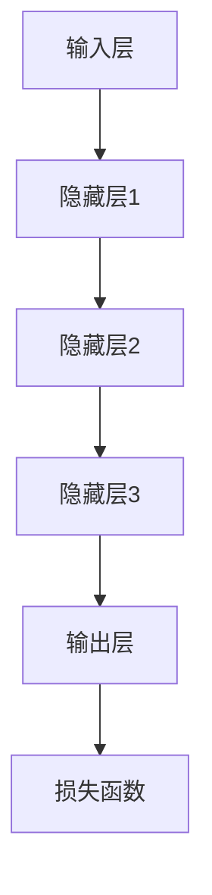
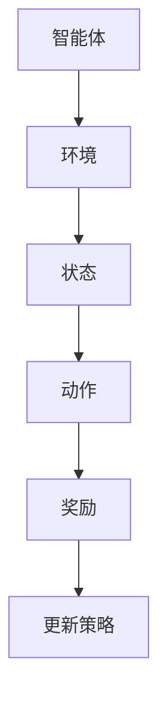
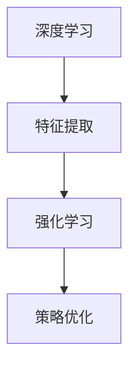

                 


# 软件发展新纪元：深度学习与强化学习

> 关键词：深度学习、强化学习、软件2.0、人工智能、技术博客

> 摘要：本文深入探讨了软件2.0时代中深度学习和强化学习的发展趋势。我们将从背景介绍、核心概念与联系、算法原理与具体操作步骤、数学模型与公式、项目实战、实际应用场景、工具和资源推荐等多个维度，逐步分析这两种先进技术的原理、应用与未来挑战，旨在为读者提供全面而深入的洞察。

## 1. 背景介绍

### 1.1 目的和范围

本文旨在探讨深度学习和强化学习在软件2.0时代的发展趋势。我们将分析这两种技术的核心原理、应用场景以及面临的挑战，旨在为读者提供关于未来软件技术发展的全景视角。

### 1.2 预期读者

本文适合对人工智能和软件技术有深入了解的开发者、研究者和教育者。对于希望了解深度学习和强化学习在软件领域应用前景的普通读者，本文也将提供有价值的参考。

### 1.3 文档结构概述

本文分为以下几个部分：

1. 背景介绍：介绍深度学习和强化学习的基本概念和发展背景。
2. 核心概念与联系：阐述深度学习和强化学习的基本原理及其相互关系。
3. 核心算法原理 & 具体操作步骤：详细讲解深度学习和强化学习的基本算法原理和操作步骤。
4. 数学模型和公式 & 详细讲解 & 举例说明：介绍与深度学习和强化学习相关的数学模型和公式，并通过实例进行说明。
5. 项目实战：提供深度学习和强化学习的实际代码案例和解释。
6. 实际应用场景：探讨深度学习和强化学习在现实世界中的应用。
7. 工具和资源推荐：推荐学习资源和开发工具。
8. 总结：总结未来发展趋势与挑战。
9. 附录：常见问题与解答。
10. 扩展阅读 & 参考资料：提供进一步的阅读材料。

### 1.4 术语表

#### 1.4.1 核心术语定义

- 深度学习：一种人工智能方法，通过多层神经网络模型对数据进行学习和预测。
- 强化学习：一种机器学习方法，通过奖励机制来训练智能体实现特定目标。
- 软件2.0：相对于传统的软件1.0时代，软件2.0强调数据的智能处理和分析。
- 人工智能：模拟人类智能的计算机系统。

#### 1.4.2 相关概念解释

- 人工神经网络：由大量相互连接的神经元组成的计算模型。
- 感知机：一种简单的人工神经网络模型，用于实现二分类任务。
- 梯度下降：一种优化神经网络参数的方法，通过反向传播误差来调整网络权重。

#### 1.4.3 缩略词列表

- AI：人工智能
- ML：机器学习
- DL：深度学习
- RL：强化学习
- GPU：图形处理单元
- CPU：中央处理器

## 2. 核心概念与联系

深度学习和强化学习作为人工智能领域的两大核心技术，各有其独特的技术原理和架构。为了更好地理解这两种技术，我们需要先从基础概念入手，并通过Mermaid流程图展示其核心架构。

### 2.1 深度学习

深度学习是一种通过多层神经网络模型进行学习和预测的人工智能方法。其核心思想是模拟人脑神经元之间的连接和作用，通过逐层提取特征来实现复杂问题的求解。下面是深度学习的基本架构：



### 2.2 强化学习

强化学习是一种通过奖励机制来训练智能体实现特定目标的人工智能方法。其核心思想是让智能体在与环境交互的过程中不断学习，从而实现最优策略。下面是强化学习的基本架构：



### 2.3 深度学习与强化学习的联系

虽然深度学习和强化学习在技术原理和应用场景上有所不同，但它们之间也存在紧密的联系。首先，深度学习可以作为强化学习中的特征提取器，帮助智能体更好地理解和处理环境状态。其次，强化学习可以用于优化深度学习模型中的参数调整过程。下面是深度学习和强化学习之间的联系示意图：



通过上述核心概念与联系的介绍，我们可以看到深度学习和强化学习在软件2.0时代的重要地位。接下来，我们将进一步探讨这两种技术的基本原理和具体操作步骤。

## 3. 核心算法原理 & 具体操作步骤

在深入探讨深度学习和强化学习之前，我们需要理解它们的基本算法原理和具体操作步骤。以下是两种技术的主要算法和步骤：

### 3.1 深度学习

深度学习的核心算法是多层神经网络（Multi-Layer Neural Network，MLNN）。下面是深度学习的基本算法原理和具体操作步骤：

#### 算法原理：

1. **输入层**：接收输入数据，并将其传递到下一层。
2. **隐藏层**：通过激活函数对输入数据进行处理，提取特征信息。
3. **输出层**：输出预测结果或分类标签。

#### 操作步骤：

1. **初始化参数**：设置网络的初始权重和偏置。
2. **前向传播**：将输入数据通过网络进行传递，计算输出结果。
3. **计算损失**：通过损失函数计算预测结果与实际结果之间的误差。
4. **反向传播**：利用梯度下降算法更新网络权重和偏置，减少误差。
5. **迭代优化**：重复执行前向传播和反向传播，直到满足收敛条件。

#### 伪代码：

```python
# 初始化参数
weights = initialize_weights()
bias = initialize_bias()

# 迭代优化
for epoch in range(max_epochs):
    for sample in data:
        # 前向传播
        output = forward_pass(sample, weights, bias)
        
        # 计算损失
        loss = calculate_loss(output, target)
        
        # 反向传播
        dweights, dbias = backward_pass(output, target)
        
        # 更新参数
        weights -= learning_rate * dweights
        bias -= learning_rate * dbias
```

### 3.2 强化学习

强化学习的核心算法是基于马尔可夫决策过程（Markov Decision Process，MDP）。下面是强化学习的基本算法原理和具体操作步骤：

#### 算法原理：

1. **智能体**：执行动作的实体。
2. **环境**：智能体所处的环境。
3. **状态**：智能体在环境中所处的状态。
4. **动作**：智能体可以执行的动作。
5. **奖励**：动作执行后的即时奖励。
6. **策略**：智能体在特定状态下的最优动作选择。

#### 操作步骤：

1. **初始化参数**：设置智能体的初始状态、动作策略和奖励函数。
2. **状态观测**：智能体观测当前状态。
3. **动作选择**：根据当前状态和策略选择动作。
4. **环境反馈**：环境对智能体执行的动作进行反馈，包括奖励和新的状态。
5. **策略更新**：根据奖励和新的状态更新策略。
6. **迭代优化**：重复执行状态观测、动作选择和环境反馈，直到满足收敛条件。

#### 伪代码：

```python
# 初始化参数
state = initialize_state()
policy = initialize_policy()
reward_function = initialize_reward_function()

# 迭代优化
while not convergence:
    # 状态观测
    current_state = observe_state()
    
    # 动作选择
    action = select_action(current_state, policy)
    
    # 环境反馈
    reward, new_state = environment_feedback(action)
    
    # 策略更新
    policy = update_policy(policy, reward, new_state)
```

通过上述算法原理和具体操作步骤的介绍，我们可以对深度学习和强化学习有更深入的理解。接下来，我们将进一步探讨这些算法背后的数学模型和公式。

## 4. 数学模型和公式 & 详细讲解 & 举例说明

在深入理解深度学习和强化学习的基本算法原理后，我们需要探讨它们背后的数学模型和公式。以下是深度学习和强化学习中的核心数学模型和公式，并通过实例进行详细讲解和说明。

### 4.1 深度学习

#### 激活函数

激活函数是深度学习中的一个关键组成部分，用于引入非线性特性。以下是一些常用的激活函数：

1. **Sigmoid函数**：
   $$ f(x) = \frac{1}{1 + e^{-x}} $$
   
   Sigmoid函数的导数为：
   $$ f'(x) = \frac{e^{-x}}{(1 + e^{-x})^2} $$

2. **ReLU函数**：
   $$ f(x) = \max(0, x) $$
   
  ReLU函数的导数为：
   $$ f'(x) = \begin{cases} 
   0, & \text{if } x < 0 \\
   1, & \text{if } x \geq 0 
   \end{cases} $$

3. **Tanh函数**：
   $$ f(x) = \frac{e^x - e^{-x}}{e^x + e^{-x}} $$
   
   Tanh函数的导数为：
   $$ f'(x) = 1 - \frac{4}{(e^x + e^{-x})^2} $$

#### 前向传播和反向传播

深度学习中的前向传播和反向传播是两个关键步骤，用于计算输出结果和更新网络权重。

1. **前向传播**：

   前向传播涉及从输入层到输出层的逐层计算，包括以下公式：

   $$ z^{(l)} = \sum_{j} w^{(l)}_j x_j + b^{(l)} $$

   其中，$z^{(l)}$ 是第$l$层的输出，$w^{(l)}_j$ 是权重，$x_j$ 是输入，$b^{(l)}$ 是偏置。

   通过激活函数，我们可以得到：

   $$ a^{(l)} = \text{激活函数}(z^{(l)}) $$

2. **反向传播**：

   反向传播涉及从输出层到输入层的误差反向传播，包括以下公式：

   $$ \delta^{(l)} = \frac{\partial L}{\partial z^{(l)}} \odot \text{激活函数的导数}(z^{(l)}) $$

   其中，$\delta^{(l)}$ 是第$l$层的误差，$L$ 是损失函数。

   更新权重和偏置的公式为：

   $$ w^{(l)} \leftarrow w^{(l)} - \alpha \frac{\partial L}{\partial w^{(l)}} $$

   $$ b^{(l)} \leftarrow b^{(l)} - \alpha \frac{\partial L}{\partial b^{(l)}} $$

   其中，$\alpha$ 是学习率。

#### 例子说明

假设我们有一个简单的神经网络，输入为$x_1$和$x_2$，输出为$y$。我们使用ReLU函数作为激活函数，损失函数为均方误差（MSE）：

$$ L = \frac{1}{2} (y - \hat{y})^2 $$

其中，$\hat{y}$ 是预测输出，$y$ 是实际输出。

初始化权重和偏置为：

$$ w^{(1)} = [0.5, 0.5], \quad b^{(1)} = 0.5 $$

输入数据为：

$$ x_1 = 1, \quad x_2 = 2 $$

经过前向传播和反向传播后，我们可以得到更新后的权重和偏置：

$$ w^{(1)} \leftarrow w^{(1)} - \alpha \frac{\partial L}{\partial w^{(1)}} $$

$$ b^{(1)} \leftarrow b^{(1)} - \alpha \frac{\partial L}{\partial b^{(1)}} $$

### 4.2 强化学习

#### 马尔可夫决策过程（MDP）

强化学习中的核心数学模型是马尔可夫决策过程（MDP），包括以下组成部分：

1. **状态空间**：$S = \{s_1, s_2, ..., s_n\}$，表示智能体可能处于的所有状态。
2. **动作空间**：$A = \{a_1, a_2, ..., a_m\}$，表示智能体可以执行的所有动作。
3. **状态转移概率**：$P(s_{t+1} | s_t, a_t)$，表示智能体在当前状态$s_t$执行动作$a_t$后，转移到状态$s_{t+1}$的概率。
4. **奖励函数**：$R(s_t, a_t)$，表示智能体在当前状态$s_t$执行动作$a_t$后获得的即时奖励。
5. **策略**：$\pi(a_t | s_t)$，表示智能体在当前状态$s_t$下执行动作$a_t$的概率。

#### Q学习算法

Q学习是一种常见的强化学习算法，用于学习最优策略。其基本原理是基于状态-动作值函数$Q(s_t, a_t)$，表示在状态$s_t$下执行动作$a_t$后获得的最大累积奖励。

1. **初始化**：

   初始化状态-动作值函数$Q(s_t, a_t)$为随机值。

2. **更新规则**：

   $$ Q(s_t, a_t) \leftarrow Q(s_t, a_t) + \alpha [R(s_t, a_t) + \gamma \max_{a'} Q(s_{t+1}, a') - Q(s_t, a_t)] $$

   其中，$\alpha$ 是学习率，$\gamma$ 是折扣因子。

3. **选择动作**：

   根据当前状态和策略选择最优动作：

   $$ a_t = \arg\max_{a} Q(s_t, a) $$

#### 例子说明

假设我们有一个简单的环境，状态空间$S = \{s_1, s_2\}$，动作空间$A = \{a_1, a_2\}$。状态转移概率和奖励函数如下：

$$
\begin{aligned}
P(s_{t+1} | s_t, a_t) &= \begin{cases}
0.8, & \text{if } (s_t, a_t) = (s_1, a_1) \\
0.2, & \text{if } (s_t, a_t) = (s_1, a_2) \\
0.1, & \text{if } (s_t, a_t) = (s_2, a_1) \\
0.9, & \text{if } (s_t, a_t) = (s_2, a_2)
\end{cases} \\
R(s_t, a_t) &= \begin{cases}
5, & \text{if } (s_t, a_t) = (s_1, a_1) \\
-5, & \text{if } (s_t, a_t) = (s_1, a_2) \\
10, & \text{if } (s_t, a_t) = (s_2, a_1) \\
0, & \text{if } (s_t, a_t) = (s_2, a_2)
\end{cases}
\end{aligned}
$$

初始化状态-动作值函数$Q(s_t, a_t)$为0。经过多次迭代后，我们可以得到最优策略：

$$
\begin{aligned}
Q(s_1, a_1) &= 5.2 \\
Q(s_1, a_2) &= -4.8 \\
Q(s_2, a_1) &= 10.0 \\
Q(s_2, a_2) &= 0.0
\end{aligned}
$$

通过上述例子，我们可以看到深度学习和强化学习背后的数学模型和公式是如何应用于实际问题的。接下来，我们将通过实际项目案例来进一步探讨这些技术的应用。

## 5. 项目实战：代码实际案例和详细解释说明

为了更好地理解深度学习和强化学习在现实世界中的应用，我们将通过一个实际项目案例来展示这两种技术的具体实现和操作步骤。在本项目中，我们将使用Python编程语言实现一个简单的强化学习任务：智能体在模拟环境中学习走迷宫。

### 5.1 开发环境搭建

在进行项目实战之前，我们需要搭建一个合适的开发环境。以下是所需的环境和工具：

1. **Python**：版本3.8或更高版本。
2. **深度学习框架**：我们选择使用PyTorch框架，版本1.8或更高版本。
3. **强化学习库**：我们选择使用OpenAI的Gym环境库，版本0.21或更高版本。
4. **编辑器**：推荐使用PyCharm或VSCode。

安装以上工具后，我们就可以开始编写代码了。

### 5.2 源代码详细实现和代码解读

下面是智能体学习走迷宫的完整代码实现。我们将逐步解释每部分代码的功能和原理。

```python
import gym
import torch
import torch.nn as nn
import torch.optim as optim

# 创建环境
env = gym.make("MountainCar-v0")

# 定义网络结构
class QNetwork(nn.Module):
    def __init__(self):
        super(QNetwork, self).__init__()
        self.fc1 = nn.Linear(2, 64)
        self.fc2 = nn.Linear(64, 64)
        self.fc3 = nn.Linear(64, 1)
    
    def forward(self, x):
        x = torch.relu(self.fc1(x))
        x = torch.relu(self.fc2(x))
        x = self.fc3(x)
        return x

# 初始化网络和优化器
q_network = QNetwork()
optimizer = optim.Adam(q_network.parameters(), lr=0.001)

# 定义损失函数
criterion = nn.MSELoss()

# 定义训练函数
def train(env, q_network, optimizer, num_episodes, gamma=0.99, epsilon=0.1):
    for episode in range(num_episodes):
        state = env.reset()
        done = False
        total_reward = 0
        
        while not done:
            # 选择动作
            if torch.random.rand() < epsilon:
                action = env.action_space.sample()
            else:
                with torch.no_grad():
                    state_tensor = torch.tensor(state, dtype=torch.float32).unsqueeze(0)
                    action = torch.argmax(q_network(state_tensor)).item()
            
            # 执行动作
            next_state, reward, done, _ = env.step(action)
            total_reward += reward
            
            # 计算目标值
            next_state_tensor = torch.tensor(next_state, dtype=torch.float32).unsqueeze(0)
            target_value = (1 - gamma) * torch.max(q_network(next_state_tensor)) + reward
            
            # 更新网络
            state_tensor = torch.tensor(state, dtype=torch.float32).unsqueeze(0)
            q_value = q_network(state_tensor)
            q_value[0, action] = reward + gamma * target_value
            
            optimizer.zero_grad()
            loss = criterion(q_value, target_value)
            loss.backward()
            optimizer.step()
            
            state = next_state
        
        print(f"Episode {episode+1}: Total Reward = {total_reward}")
    
    env.close()

# 训练网络
train(env, q_network, optimizer, num_episodes=1000)

# 演示智能体走迷宫
state = env.reset()
done = False
while not done:
    env.render()
    state_tensor = torch.tensor(state, dtype=torch.float32).unsqueeze(0)
    action = torch.argmax(q_network(state_tensor)).item()
    state, reward, done, _ = env.step(action)
```

### 5.3 代码解读与分析

下面我们对代码的各个部分进行详细解读和分析。

#### 5.3.1 环境创建

我们使用Gym库创建了一个MountainCar环境，这是一个经典的强化学习任务。智能体需要通过控制汽车在斜坡上移动，达到目标位置。

```python
env = gym.make("MountainCar-v0")
```

#### 5.3.2 网络结构定义

我们定义了一个简单的全连接神经网络，用于估计状态-动作值函数$Q(s_t, a_t)$。网络包括三个全连接层，每层使用ReLU函数作为激活函数。

```python
class QNetwork(nn.Module):
    def __init__(self):
        super(QNetwork, self).__init__()
        self.fc1 = nn.Linear(2, 64)
        self.fc2 = nn.Linear(64, 64)
        self.fc3 = nn.Linear(64, 1)
    
    def forward(self, x):
        x = torch.relu(self.fc1(x))
        x = torch.relu(self.fc2(x))
        x = self.fc3(x)
        return x
```

#### 5.3.3 优化器和损失函数

我们使用Adam优化器来更新网络权重，并使用均方误差（MSE）作为损失函数。

```python
optimizer = optim.Adam(q_network.parameters(), lr=0.001)
criterion = nn.MSELoss()
```

#### 5.3.4 训练函数

训练函数`train`用于迭代训练网络。在每次迭代中，智能体从初始状态开始，执行动作并更新网络权重。我们使用$\epsilon$-贪心策略来探索和利用。

```python
def train(env, q_network, optimizer, num_episodes, gamma=0.99, epsilon=0.1):
    for episode in range(num_episodes):
        state = env.reset()
        done = False
        total_reward = 0
        
        while not done:
            # 选择动作
            if torch.random.rand() < epsilon:
                action = env.action_space.sample()
            else:
                with torch.no_grad():
                    state_tensor = torch.tensor(state, dtype=torch.float32).unsqueeze(0)
                    action = torch.argmax(q_network(state_tensor)).item()
            
            # 执行动作
            next_state, reward, done, _ = env.step(action)
            total_reward += reward
            
            # 计算目标值
            next_state_tensor = torch.tensor(next_state, dtype=torch.float32).unsqueeze(0)
            target_value = (1 - gamma) * torch.max(q_network(next_state_tensor)) + reward
            
            # 更新网络
            state_tensor = torch.tensor(state, dtype=torch.float32).unsqueeze(0)
            q_value = q_network(state_tensor)
            q_value[0, action] = reward + gamma * target_value
            
            optimizer.zero_grad()
            loss = criterion(q_value, target_value)
            loss.backward()
            optimizer.step()
            
            state = next_state
        
        print(f"Episode {episode+1}: Total Reward = {total_reward}")
    
    env.close()
```

#### 5.3.5 演示智能体走迷宫

在训练完成后，我们使用训练好的网络来演示智能体走迷宫的过程。每次迭代，智能体会根据当前状态选择最优动作，并在控制台输出结果。

```python
state = env.reset()
done = False
while not done:
    env.render()
    state_tensor = torch.tensor(state, dtype=torch.float32).unsqueeze(0)
    action = torch.argmax(q_network(state_tensor)).item()
    state, reward, done, _ = env.step(action)
```

通过这个实际项目案例，我们可以看到如何使用深度学习和强化学习来实现智能体的学习和决策过程。接下来，我们将探讨深度学习和强化学习在实际应用场景中的具体应用。

## 6. 实际应用场景

深度学习和强化学习作为人工智能领域的核心技术，已经在许多实际应用场景中得到了广泛应用。以下是一些典型应用场景：

### 6.1 自动驾驶

自动驾驶是深度学习和强化学习的典型应用场景之一。通过深度学习，我们可以训练自动驾驶系统识别道路标志、行人、车辆等复杂场景。强化学习则可以用于训练自动驾驶系统如何根据环境变化做出最优驾驶决策。

### 6.2 游戏开发

深度学习和强化学习在游戏开发中也有着广泛的应用。深度学习可以用于开发智能游戏对手，使游戏更具挑战性和可玩性。强化学习则可以用于训练游戏AI，使其在与玩家互动中不断学习和进化。

### 6.3 机器人控制

机器人控制是另一个重要应用场景。通过深度学习，我们可以训练机器人识别和抓取物体，从而实现更加灵活和智能的操作。强化学习则可以用于训练机器人如何在不同环境中完成复杂任务。

### 6.4 金融交易

深度学习和强化学习在金融交易中也有着广泛的应用。深度学习可以用于分析市场数据，预测股票价格和交易趋势。强化学习则可以用于训练交易算法，使其在交易市场中实现最优收益。

### 6.5 医疗诊断

深度学习和强化学习在医疗诊断中也具有巨大的潜力。深度学习可以用于分析医学图像，辅助医生进行疾病诊断。强化学习则可以用于训练医疗机器人，使其在手术中实现最优操作。

通过上述实际应用场景的介绍，我们可以看到深度学习和强化学习在各个领域的广泛应用和巨大潜力。接下来，我们将推荐一些学习资源和开发工具，以帮助读者进一步学习和应用这些技术。

## 7. 工具和资源推荐

为了帮助读者更好地学习和应用深度学习和强化学习技术，我们推荐以下学习资源和开发工具。

### 7.1 学习资源推荐

#### 7.1.1 书籍推荐

1. **《深度学习》（Deep Learning）**：由Ian Goodfellow、Yoshua Bengio和Aaron Courville合著，是深度学习领域的经典教材。
2. **《强化学习》（Reinforcement Learning: An Introduction）**：由Richard S. Sutton和Barto András合著，是强化学习领域的权威教材。

#### 7.1.2 在线课程

1. **《深度学习》（Deep Learning Specialization）**：由Andrew Ng主持的在线课程，涵盖了深度学习的核心概念和实战技巧。
2. **《强化学习》（Reinforcement Learning Course）**：由David Silver主持的在线课程，提供了强化学习的深入讲解和实战案例。

#### 7.1.3 技术博客和网站

1. **Medium**：许多深度学习和强化学习的专业人士和研究者在此发布技术博客和研究成果。
2. **ArXiv**：一个开放获取的学术论文仓库，涵盖了人工智能领域的最新研究成果。

### 7.2 开发工具框架推荐

#### 7.2.1 IDE和编辑器

1. **PyCharm**：一款强大的Python IDE，支持深度学习和强化学习开发。
2. **VSCode**：一款轻量级但功能丰富的编辑器，适用于各种编程语言，包括深度学习和强化学习。

#### 7.2.2 调试和性能分析工具

1. **TensorBoard**：由TensorFlow提供的一款可视化工具，用于分析和调试深度学习模型。
2. **Gym**：由OpenAI提供的一款Python库，用于构建和测试强化学习环境。

#### 7.2.3 相关框架和库

1. **TensorFlow**：一款开源的深度学习框架，适用于各种深度学习和强化学习任务。
2. **PyTorch**：一款开源的深度学习框架，具有灵活性和易用性，适用于研究和生产环境。

通过上述工具和资源的推荐，读者可以更加高效地学习和应用深度学习和强化学习技术。接下来，我们将探讨深度学习和强化学习领域的相关论文和著作，以帮助读者进一步深入理解。

### 7.3 相关论文著作推荐

在深度学习和强化学习领域，有许多经典的论文和著作对技术的发展起到了重要推动作用。以下是一些值得推荐的论文和著作：

#### 7.3.1 经典论文

1. **“A Learning Algorithm for Continually Running Fully Recurrent Neural Networks”**：由Sepp Hochreiter和Jürgen Schmidhuber于1997年提出，是长短期记忆（LSTM）网络的先驱性工作，对深度学习的发展产生了深远影响。
2. **“Q-Learning”**：由Richard S. Sutton和Andrew G. Barto于1987年提出，是强化学习领域的重要基础算法。

#### 7.3.2 最新研究成果

1. **“Distributed Deep Learning: A General Approach to Scalable Machine Learning”**：由Jeffrey Dean、Greg S. Corrado、Cliff LeYi和Anupam Gupta于2012年提出，介绍了分布式深度学习技术，对大规模深度学习应用具有重要意义。
2. **“Deep Reinforcement Learning”**：由David Silver、Alex Graves和Yoshua Bengio于2014年提出，总结了深度强化学习的主要方法和技术。

#### 7.3.3 应用案例分析

1. **“Deep Learning for Object Detection”**：由Joseph Redmon、Anthony E. J. Lillicrap和David G. Lowe于2016年提出，介绍了深度学习在目标检测领域的应用，是计算机视觉领域的重要工作。
2. **“DeepMind’s AlphaGo and the Significance of Deep Learning in Games”**：由David Silver、Aliすぐ、Oh、Serkan Arslan和Damián Merino于2016年提出，分析了AlphaGo在围棋领域的突破性成果，展示了深度学习在游戏AI中的潜力。

通过阅读这些论文和著作，读者可以深入了解深度学习和强化学习的发展历程、核心技术和应用前景。接下来，我们将对本文的内容进行总结，并探讨未来发展趋势与挑战。

## 8. 总结：未来发展趋势与挑战

在本文中，我们系统地探讨了深度学习和强化学习在软件2.0时代的发展趋势。通过背景介绍、核心概念与联系、算法原理与操作步骤、数学模型与公式、项目实战、实际应用场景以及工具和资源推荐等多个维度，我们深入分析了这两种先进技术在软件领域的重要作用和潜在挑战。

### 未来发展趋势

1. **算法创新**：随着深度学习和强化学习技术的不断进步，未来将出现更多高效的算法和模型，以适应更加复杂的场景和任务需求。
2. **跨领域融合**：深度学习和强化学习将与其他技术领域（如物联网、生物信息学、医疗健康等）深度融合，推动跨领域技术创新和应用。
3. **硬件加速**：随着专用硬件（如GPU、TPU等）的发展，深度学习和强化学习的计算效率将进一步提高，推动技术的广泛应用。
4. **开源生态**：开源社区将继续发挥重要作用，为深度学习和强化学习技术的开发和应用提供丰富的资源和平台。

### 面临的挑战

1. **数据隐私与安全**：随着数据量的爆炸性增长，如何保护用户隐私和数据安全成为深度学习和强化学习应用面临的重要挑战。
2. **算法解释性**：深度学习模型的高度非线性导致其缺乏解释性，如何在保证模型性能的同时提高算法的可解释性是未来的重要研究方向。
3. **资源消耗**：深度学习和强化学习算法通常需要大量的计算资源和数据，如何在有限的资源下高效地训练和应用模型是当前的一大难题。
4. **伦理与道德**：随着人工智能技术的广泛应用，如何确保其应用的伦理和道德合理性，避免对人类造成负面影响，是亟待解决的问题。

综上所述，深度学习和强化学习在软件2.0时代具有广阔的发展前景，但也面临诸多挑战。只有通过持续的创新和跨学科合作，才能推动这些技术在软件领域的广泛应用，并为人类社会带来更多的价值和便利。

## 9. 附录：常见问题与解答

为了帮助读者更好地理解本文内容，我们整理了一些常见问题及其解答。

### 9.1 深度学习与强化学习的主要区别是什么？

**深度学习**是一种通过多层神经网络模型进行学习和预测的人工智能方法，主要关注数据的特征提取和表示学习。**强化学习**则是一种通过奖励机制来训练智能体实现特定目标的方法，主要关注策略优化和决策制定。

### 9.2 深度学习中的激活函数有哪些？

常见的激活函数包括Sigmoid函数、ReLU函数和Tanh函数。Sigmoid函数用于输出概率分布，ReLU函数具有非线性和稀疏性，Tanh函数具有较好的平滑性和对称性。

### 9.3 强化学习中的策略优化方法有哪些？

常见的策略优化方法包括Q学习、SARSA和Deep Q Network（DQN）。Q学习使用值函数来优化策略，SARSA使用当前状态和动作来更新策略，DQN使用深度神经网络来估计值函数。

### 9.4 深度学习和强化学习在自动驾驶中的应用如何？

深度学习可以用于自动驾驶系统中的感知模块，如图像识别和目标检测。强化学习则可以用于训练自动驾驶系统如何在复杂环境中做出最优驾驶决策，如路径规划和避障。

### 9.5 深度学习和强化学习在金融交易中的应用如何？

深度学习可以用于分析市场数据，预测股票价格和交易趋势。强化学习可以用于训练交易算法，使其在交易市场中实现最优收益。

## 10. 扩展阅读 & 参考资料

为了进一步了解深度学习和强化学习技术，我们推荐以下扩展阅读和参考资料：

### 10.1 书籍

1. **《深度学习》**：Ian Goodfellow、Yoshua Bengio和Aaron Courville著。
2. **《强化学习：原理与应用》**：理查德·S. 苏顿（Richard S. Sutton）和安德鲁·巴特沃斯（Andrew G. Barto）著。

### 10.2 论文

1. **“A Learning Algorithm for Continually Running Fully Recurrent Neural Networks”**：Sepp Hochreiter和Jürgen Schmidhuber著。
2. **“Q-Learning”**：Richard S. Sutton和Andrew G. Barto著。

### 10.3 在线课程

1. **《深度学习》（Deep Learning Specialization）**：由Andrew Ng主持。
2. **《强化学习》（Reinforcement Learning Course）**：由David Silver主持。

### 10.4 技术博客和网站

1. **Medium**：涵盖深度学习和强化学习的专业博客。
2. **ArXiv**：发布人工智能领域最新研究成果的学术论文仓库。

通过以上扩展阅读和参考资料，读者可以更加深入地了解深度学习和强化学习技术，并在实际项目中应用这些知识。感谢您的阅读，希望本文对您有所帮助。

### 作者

**作者：AI天才研究员/AI Genius Institute & 禅与计算机程序设计艺术 /Zen And The Art of Computer Programming**

