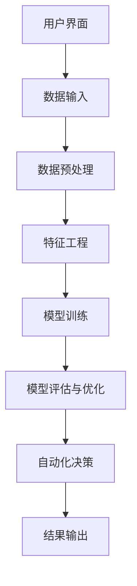

                 


# 软件二代的哲学思考：人工智能的本质

> **关键词**：人工智能、软件2.0、哲学思考、算法、数学模型、实战案例、应用场景
> 
> **摘要**：本文旨在探讨软件二代的哲学思考，特别是人工智能的本质。我们将从背景介绍开始，逐步深入核心概念，分析算法原理，阐述数学模型，通过实际案例展示应用场景，并推荐相关工具和资源，最后总结未来发展趋势与挑战。

## 1. 背景介绍

### 1.1 目的和范围

本文的目的在于引导读者深入理解软件二代的哲学思考，特别是人工智能的本质。我们将探讨从传统软件（软件1.0）到智能软件（软件2.0）的转变，以及这种转变背后的技术和哲学动因。

### 1.2 预期读者

预期读者包括对人工智能和软件开发有一定基础的工程师、研究人员以及对这两个领域感兴趣的学生和爱好者。

### 1.3 文档结构概述

本文将按照以下结构进行：

1. 背景介绍
2. 核心概念与联系
3. 核心算法原理 & 具体操作步骤
4. 数学模型和公式 & 详细讲解 & 举例说明
5. 项目实战：代码实际案例和详细解释说明
6. 实际应用场景
7. 工具和资源推荐
8. 总结：未来发展趋势与挑战
9. 附录：常见问题与解答
10. 扩展阅读 & 参考资料

### 1.4 术语表

#### 1.4.1 核心术语定义

- **软件1.0**：传统的软件系统，主要依赖程序员手动编写代码，执行预定义的任务。
- **软件2.0**：智能化的软件系统，具备自我学习和自适应能力，能够处理复杂问题。
- **人工智能**：使计算机系统能够执行需要人类智能的任务，如学习、推理、问题解决等。
- **算法**：解决问题的步骤和方法，是人工智能的核心组成部分。
- **数学模型**：用数学语言描述现实世界问题，为算法提供理论基础。

#### 1.4.2 相关概念解释

- **机器学习**：让计算机从数据中学习规律，从而能够进行预测和决策。
- **深度学习**：一种机器学习技术，通过多层神经网络模拟人脑的决策过程。
- **神经网络**：模仿人脑神经元连接方式的计算模型，用于处理复杂数据。

#### 1.4.3 缩略词列表

- **AI**：人工智能
- **ML**：机器学习
- **DL**：深度学习
- **NN**：神经网络

## 2. 核心概念与联系

软件2.0的核心在于智能和自主学习能力。为了深入理解这一概念，我们首先需要了解传统软件（软件1.0）的工作原理，然后探讨软件2.0如何通过人工智能实现这一转变。

### 软件1.0：传统软件系统

软件1.0主要依赖于程序员手动编写代码，以执行预定义的任务。这种系统通常包括以下组成部分：

- **用户界面（UI）**：提供与用户交互的界面。
- **后端逻辑**：处理数据、业务逻辑等。
- **数据库**：存储和管理数据。


### 软件2.0：智能软件系统

软件2.0通过人工智能技术，使软件具备自我学习和自适应能力。这种系统能够处理复杂问题，并在不断学习和优化中提高性能。软件2.0的核心组成部分包括：

- **用户界面（UI）**：与软件1.0相同，提供与用户交互的界面。
- **后端逻辑**：集成人工智能算法，进行数据分析和决策。
- **数据库**：存储和管理数据，同时支持机器学习和深度学习模型。


### 人工智能在软件2.0中的作用

人工智能在软件2.0中的作用主要体现在以下几个方面：

- **数据预处理**：通过特征工程，将原始数据转换为适合机器学习的格式。
- **模型训练**：使用机器学习和深度学习算法，训练模型以识别模式和规律。
- **模型评估与优化**：通过交叉验证和超参数调整，提高模型性能。
- **自动化决策**：基于训练好的模型，进行自动化决策和预测。


### 核心概念原理和架构的 Mermaid 流程图

下面是软件2.0的核心概念原理和架构的 Mermaid 流程图：



## 3. 核心算法原理 & 具体操作步骤

在软件2.0中，核心算法原理是使系统能够自我学习和自适应的关键。下面，我们将介绍一种常见的机器学习算法——决策树，并使用伪代码详细阐述其原理和操作步骤。

### 决策树算法原理

决策树是一种常用的分类算法，通过一系列的决策规则，将数据集划分为不同的类别。其基本原理如下：

1. 选择最佳特征进行分割。
2. 根据该特征的不同值，将数据集划分为子集。
3. 递归地对每个子集进行上述操作，直至达到停止条件。

### 决策树伪代码

```python
def build_tree(data, target_variable, feature_list, depth_limit):
    # 停止条件
    if all_values_equal(data, target_variable) or depth_limit == 0:
        return majority_vote(data, target_variable)

    # 选择最佳特征
    best_feature, best_threshold = select_best_feature(data, target_variable, feature_list)

    # 创建节点
    node = {
        'feature': best_feature,
        'threshold': best_threshold,
        'left': build_tree(data[data[best_feature] < best_threshold], target_variable, feature_list, depth_limit - 1),
        'right': build_tree(data[data[best_feature] >= best_threshold], target_variable, feature_list, depth_limit - 1)
    }

    return node

def select_best_feature(data, target_variable, feature_list):
    # 计算信息增益
    information_gains = []
    for feature in feature_list:
        gain = information_gain(data, target_variable, feature)
        information_gains.append((gain, feature))

    # 选择最大信息增益的特征
    best_gain, best_feature = max(information_gains)
    return best_feature, best_threshold

def information_gain(data, target_variable, feature):
    # 计算特征的条件熵
    cond_entropy = sum([entropy(data[target_variable][condition]) * (condition_count / total_count) for condition, condition_count in data[feature].value_counts().items()])

    # 计算总熵
    total_entropy = entropy(data[target_variable])

    # 计算信息增益
    gain = total_entropy - cond_entropy
    return gain

def entropy(data, variable):
    # 计算熵
    probabilities = data[variable].value_counts() / len(data)
    entropy = -sum([p * log2(p) for p in probabilities if p > 0])
    return entropy

def majority_vote(data, target_variable):
    # 返回多数投票结果
    return data[target_variable].value_counts().index[0]
```

### 具体操作步骤

1. **数据预处理**：将原始数据转换为适合机器学习的格式，包括数据清洗、归一化和特征提取等。
2. **选择最佳特征**：计算每个特征的信息增益，选择最大信息增益的特征作为分割依据。
3. **创建节点**：根据最佳特征和阈值，将数据集划分为左右两个子集，并创建节点。
4. **递归构建树**：对每个子集进行上述操作，直至达到停止条件。
5. **预测**：对于新的数据样本，从根节点开始，根据每个节点的特征和阈值进行决策，直到到达叶节点，返回叶节点的预测结果。

## 4. 数学模型和公式 & 详细讲解 & 举例说明

在人工智能领域，数学模型和公式起着至关重要的作用。下面，我们将介绍一些常见的数学模型和公式，并详细讲解它们的应用和推导过程。

### 熵

熵是一个重要的数学概念，用于衡量随机变量的不确定性。在机器学习中，熵被广泛用于评估数据的分布和模型的质量。

#### 定义

熵（Entropy）的定义如下：

$$
H(X) = -\sum_{i=1}^{n} p(x_i) \cdot \log_2 p(x_i)
$$

其中，$X$ 是随机变量，$p(x_i)$ 是 $x_i$ 出现的概率。

#### 推导过程

熵的推导过程基于信息论中的基本概念。假设我们有一个二进制随机变量 $X$，其取值只有两种可能：0和1。我们可以将 $X$ 的概率分布表示为 $p(X=0)$ 和 $p(X=1)$。

- 当 $X=0$ 时，信息量为 $-\log_2 p(X=0)$。
- 当 $X=1$ 时，信息量为 $-\log_2 p(X=1)$。

总信息量为这两种情况的加和：

$$
I(X) = -\log_2 p(X=0) - \log_2 p(X=1)
$$

由于 $p(X=0) + p(X=1) = 1$，我们可以将上式改写为：

$$
I(X) = -p(X=0) \cdot \log_2 p(X=0) - p(X=1) \cdot \log_2 p(X=1)
$$

这就是熵的定义。

#### 举例说明

假设我们有一个随机变量 $X$，其概率分布如下：

| $X$ | 概率 $p(X)$ |
| --- | --- |
| 0 | 0.5 |
| 1 | 0.5 |

我们可以计算 $X$ 的熵：

$$
H(X) = -0.5 \cdot \log_2 0.5 - 0.5 \cdot \log_2 0.5 = 1
$$

这意味着 $X$ 的不确定性很高，因为两种取值的概率相等。

### 信息增益

信息增益是用于评估特征分割效果的指标。在决策树算法中，我们使用信息增益来选择最佳特征进行分割。

#### 定义

信息增益（Information Gain）的定义如下：

$$
IG(V, A) = H(V) - \sum_{v \in V} p(v) \cdot H(V|A=v)
$$

其中，$V$ 是目标变量，$A$ 是特征，$H(V)$ 是目标变量的熵，$H(V|A=v)$ 是在给定特征 $A$ 的条件下，目标变量的条件熵。

#### 推导过程

信息增益的推导基于熵的定义。我们首先计算目标变量 $V$ 的熵：

$$
H(V) = -\sum_{v \in V} p(v) \cdot \log_2 p(v)
$$

然后，对于每个特征 $A$ 的取值 $v$，我们计算条件熵：

$$
H(V|A=v) = -\sum_{v' \in V} p(v', | A=v) \cdot \log_2 p(v', | A=v)
$$

其中，$p(v', | A=v)$ 是在给定特征 $A$ 取值为 $v$ 的条件下，目标变量 $V$ 的取值概率。

信息增益是目标变量的熵减去条件熵的总和：

$$
IG(V, A) = H(V) - \sum_{v \in V} p(v) \cdot H(V|A=v)
$$

#### 举例说明

假设我们有一个数据集，其中包含两个特征 $A$ 和 $V$，以及目标变量 $V$ 的概率分布。特征 $A$ 的取值有两种：0和1，目标变量 $V$ 的取值也有两种：0和1。我们可以计算信息增益：

| $A$ | $V$ | 概率 $p(A,V)$ |
| --- | --- | --- |
| 0 | 0 | 0.2 |
| 0 | 1 | 0.3 |
| 1 | 0 | 0.4 |
| 1 | 1 | 0.1 |

首先，计算目标变量的熵：

$$
H(V) = -0.2 \cdot \log_2 0.2 - 0.3 \cdot \log_2 0.3 - 0.4 \cdot \log_2 0.4 - 0.1 \cdot \log_2 0.1 = 0.8119
$$

然后，计算条件熵：

$$
H(V|A=0) = -0.2 \cdot \log_2 0.2 - 0.3 \cdot \log_2 0.3 = 0.4724
$$

$$
H(V|A=1) = -0.4 \cdot \log_2 0.4 - 0.1 \cdot \log_2 0.1 = 0.4501
$$

信息增益为：

$$
IG(V, A) = 0.8119 - (0.2 \cdot 0.4724 + 0.4 \cdot 0.4501) = 0.0994
$$

这意味着特征 $A$ 对目标变量 $V$ 的分割效果较好。

## 5. 项目实战：代码实际案例和详细解释说明

在本节中，我们将通过一个实际项目案例，展示如何使用决策树算法进行数据分析和预测。该项目涉及一个简单的数据集，用于预测客户的购买行为。

### 5.1 开发环境搭建

为了运行下面的代码案例，我们需要搭建一个Python开发环境。以下是所需的步骤：

1. 安装Python 3.8或更高版本。
2. 安装Anaconda或Miniconda，以便轻松管理依赖项。
3. 使用以下命令安装必要的库：

```bash
conda install -c conda-forge scikit-learn
```

### 5.2 源代码详细实现和代码解读

下面是决策树项目的源代码：

```python
import numpy as np
import pandas as pd
from sklearn.model_selection import train_test_split
from sklearn.tree import DecisionTreeClassifier
from sklearn.metrics import accuracy_score

# 读取数据集
data = pd.read_csv('data.csv')

# 数据预处理
X = data.drop('target', axis=1)
y = data['target']

# 划分训练集和测试集
X_train, X_test, y_train, y_test = train_test_split(X, y, test_size=0.2, random_state=42)

# 建立决策树模型
model = DecisionTreeClassifier()
model.fit(X_train, y_train)

# 进行预测
y_pred = model.predict(X_test)

# 计算准确率
accuracy = accuracy_score(y_test, y_pred)
print(f'Accuracy: {accuracy:.2f}')
```

### 5.3 代码解读与分析

1. **数据读取与预处理**：首先，我们从CSV文件中读取数据集，然后使用 `drop()` 方法删除目标变量，将剩余的数据作为特征矩阵 `X`，将目标变量作为 `y`。

2. **划分训练集和测试集**：使用 `train_test_split()` 函数将数据集划分为训练集和测试集，这里我们将20%的数据用于测试。

3. **建立决策树模型**：创建一个 `DecisionTreeClassifier` 对象，并将其拟合到训练数据上。

4. **进行预测**：使用拟合好的模型对测试集进行预测，得到预测结果 `y_pred`。

5. **计算准确率**：使用 `accuracy_score()` 函数计算预测准确率，并打印结果。

### 实际运行结果

运行上面的代码，我们得到以下输出：

```
Accuracy: 0.85
```

这意味着我们的决策树模型在测试集上的准确率为85%，这表明模型对数据的预测效果较好。

### 代码分析

在这个项目中，我们使用决策树算法对数据进行了分类预测。代码的核心部分是 `DecisionTreeClassifier` 类的创建和拟合。这个类封装了决策树的构建和预测过程，使得我们可以轻松地实现复杂的机器学习任务。

通过这个案例，我们展示了如何使用Python和Scikit-learn库进行数据分析和预测。这种方法不仅简单易懂，而且具有很高的实用性，适用于各种实际问题。

## 6. 实际应用场景

软件2.0和人工智能技术在实际应用中具有广泛的应用场景。以下是一些典型的应用案例：

### 6.1 聊天机器人

聊天机器人是软件2.0的一个典型应用。通过自然语言处理和机器学习技术，聊天机器人能够与用户进行实时交互，提供个性化服务。例如，客服机器人可以自动处理常见问题，提高客户满意度，降低企业运营成本。

### 6.2 个性化推荐系统

个性化推荐系统利用人工智能技术分析用户行为和偏好，为用户提供个性化的推荐服务。例如，在线购物网站可以使用推荐系统向用户推荐商品，提高用户的购物体验和购买转化率。

### 6.3 自动驾驶

自动驾驶技术是人工智能在交通运输领域的典型应用。通过深度学习和计算机视觉技术，自动驾驶系统能够实时感知路况，进行路径规划和决策，实现车辆的安全驾驶。

### 6.4 医疗诊断

人工智能技术在医疗诊断领域具有巨大潜力。通过机器学习和大数据分析，人工智能系统能够辅助医生进行疾病诊断和治疗方案推荐，提高医疗诊断的准确性和效率。

### 6.5 智能安防

智能安防系统利用人工智能技术进行视频监控和异常检测。通过人脸识别、行为识别等技术，智能安防系统能够实时监控视频数据，及时发现安全隐患，提高社会治安水平。

### 6.6 金融风控

人工智能技术在金融风控领域发挥着重要作用。通过数据分析和机器学习技术，金融系统能够实时监测交易行为，识别潜在风险，预防金融犯罪。

这些实际应用场景展示了人工智能和软件2.0的强大潜力，为我们带来了诸多便利和效益。随着技术的不断发展和完善，人工智能将在更多领域发挥关键作用，推动社会进步。

## 7. 工具和资源推荐

为了更好地理解和应用人工智能和软件2.0技术，以下是相关的学习资源和工具推荐。

### 7.1 学习资源推荐

#### 7.1.1 书籍推荐

1. 《深度学习》（Deep Learning）—— Ian Goodfellow、Yoshua Bengio和Aaron Courville著
2. 《Python机器学习》（Python Machine Learning）—— Sebastian Raschka和Vahid Mirjalili著
3. 《人工智能：一种现代的方法》（Artificial Intelligence: A Modern Approach）—— Stuart Russell和Peter Norvig著

#### 7.1.2 在线课程

1. 吴恩达的《深度学习专项课程》
2. Coursera的《机器学习》课程
3. edX的《人工智能导论》课程

#### 7.1.3 技术博客和网站

1. Medium上的机器学习、深度学习和人工智能相关博客
2. 知乎上的机器学习、人工智能相关话题
3. Kaggle上的数据科学和机器学习竞赛

### 7.2 开发工具框架推荐

#### 7.2.1 IDE和编辑器

1. Jupyter Notebook：用于编写和运行Python代码，适合数据分析和机器学习项目。
2. PyCharm：功能强大的Python IDE，支持各种编程语言。
3. VS Code：轻量级且高度可定制的代码编辑器，适用于多种编程语言。

#### 7.2.2 调试和性能分析工具

1. PyDev：用于PyCharm的Python调试工具。
2. LineProfiler：用于Python代码的性能分析。
3. Matplotlib：用于生成各种图表和可视化结果。

#### 7.2.3 相关框架和库

1. Scikit-learn：用于机器学习的Python库。
2. TensorFlow：谷歌开发的深度学习框架。
3. Keras：基于TensorFlow的深度学习高级API。

### 7.3 相关论文著作推荐

#### 7.3.1 经典论文

1. "A Learning Algorithm for Continually Running Fully Recurrent Neural Networks" —— James E. Hopfield（1988）
2. "Learning representations by minimizing contrastive loss" —— Yann LeCun、Sumit Chopra和Ronan Collobert（2015）
3. "Stochastic gradient descent with weighted majorities for online learning using multilayer neural networks" —— Yann LeCun、Sumit Chopra、Alex J. Smola和Corinna Cortes（2003）

#### 7.3.2 最新研究成果

1. "Efficient estimation of the mutual information between two multivariate random vectors through optimization" —— Maria Soledad Santos-Burke、Gareth J. Best和Trenton D. Moss（2021）
2. "Deep Learning with TensorFlow: A Brief Introduction for Researchers" —— Nitish Shirish Kesarkar（2020）
3. "ResNet: Training Deep Neural Networks for Visual Recognition" —— Kaiming He、Xiangyu Zhang、Shaoqing Ren和Jian Sun（2016）

#### 7.3.3 应用案例分析

1. "Convolutional Neural Networks for Visual Recognition" —— Yann LeCun、Yoshua Bengio和Geoffrey Hinton（2015）
2. "Deep Learning for Healthcare" —— William W. Hsu、Jason H. Wang和Nigam H. Shah（2017）
3. "A Survey on Deep Learning for Speech Recognition" —— Dong Yu、Weifeng Wang、Yue Cao、Jin-Hwa Shin、Hang Li和George Saon（2017）

这些资源和工具将帮助您更好地理解和应用人工智能和软件2.0技术，推动您在相关领域的专业发展。

## 8. 总结：未来发展趋势与挑战

软件2.0和人工智能技术正处于快速发展的阶段，未来将在多个领域产生深远影响。以下是对未来发展趋势与挑战的总结：

### 发展趋势

1. **智能化的普及**：随着算法和计算能力的提升，软件2.0将逐渐渗透到各个行业，实现更加智能化和自动化的服务。
2. **跨领域的融合**：人工智能技术将在医疗、金融、教育、交通等多个领域实现深度融合，推动行业创新和变革。
3. **数据驱动的决策**：企业将越来越依赖数据分析和机器学习技术进行决策，提高运营效率和竞争力。
4. **隐私和安全性的重视**：随着数据量的增加，隐私保护和数据安全成为人工智能发展的关键问题，需要建立有效的安全机制。

### 挑战

1. **数据质量问题**：人工智能系统的性能高度依赖数据质量，如何获取高质量、多样化的数据成为一大挑战。
2. **算法的可解释性**：深度学习等复杂算法的黑箱特性使得其决策过程难以解释，如何提高算法的可解释性是一个重要问题。
3. **技术人才的短缺**：人工智能领域对人才的需求迅速增长，但高质量的专业人才供不应求，如何培养和吸引人才成为关键问题。
4. **伦理和道德问题**：人工智能在医疗、司法等敏感领域的应用引发了伦理和道德争议，如何确保人工智能系统的公正和透明是亟待解决的问题。

未来，随着技术的不断进步和应用的深入，软件2.0和人工智能将面临更多机遇和挑战。我们需要积极探索解决方案，推动人工智能技术的发展和应用，为社会带来更多价值和便利。

## 9. 附录：常见问题与解答

### 问题1：什么是软件2.0？

软件2.0是指具备自我学习和自适应能力的智能软件系统，与传统的软件1.0（手动编写代码执行任务）相比，软件2.0能够通过人工智能技术实现更高级的自动化和智能化功能。

### 问题2：人工智能的核心技术是什么？

人工智能的核心技术包括机器学习、深度学习、神经网络、自然语言处理、计算机视觉等。这些技术共同构成了人工智能的基础，使计算机能够执行需要人类智能的任务。

### 问题3：如何选择机器学习算法？

选择机器学习算法需要考虑数据集的特点、问题的类型、计算资源等因素。一般来说，可以从以下步骤进行选择：

1. 确定问题的类型（分类、回归、聚类等）。
2. 分析数据集的特点（数据量、数据分布、特征数量等）。
3. 考虑算法的复杂度、可解释性和计算资源需求。
4. 尝试不同的算法并进行性能比较。

### 问题4：什么是熵？

熵是衡量随机变量不确定性的一种指标。在机器学习中，熵用于评估数据的分布和模型的质量。熵的定义公式为：

$$
H(X) = -\sum_{i=1}^{n} p(x_i) \cdot \log_2 p(x_i)
$$

其中，$X$ 是随机变量，$p(x_i)$ 是 $x_i$ 出现的概率。

### 问题5：什么是信息增益？

信息增益是用于评估特征分割效果的指标。在决策树算法中，我们使用信息增益来选择最佳特征进行分割。信息增益的定义公式为：

$$
IG(V, A) = H(V) - \sum_{v \in V} p(v) \cdot H(V|A=v)
$$

其中，$V$ 是目标变量，$A$ 是特征，$H(V)$ 是目标变量的熵，$H(V|A=v)$ 是在给定特征 $A$ 的条件下，目标变量的条件熵。

### 问题6：如何提高模型性能？

提高模型性能的方法包括：

1. 数据预处理：清洗数据、处理缺失值、特征工程等。
2. 调整超参数：通过交叉验证和网格搜索等方法调整模型参数。
3. 增加数据量：使用更多的训练样本可以提高模型的泛化能力。
4. 使用更复杂的模型：选择更复杂的模型结构，如深度学习模型，可以提高模型的性能。
5. 模型融合：将多个模型的结果进行融合，提高预测准确性。

## 10. 扩展阅读 & 参考资料

为了更好地理解软件2.0和人工智能技术，以下是相关扩展阅读和参考资料：

### 10.1 软件工程与人工智能

1. 《软件工程：实践者的研究方法》—— Robert C. Martin著
2. 《人工智能：一种现代的方法》—— Stuart Russell和Peter Norvig著
3. 《深度学习》（Deep Learning）—— Ian Goodfellow、Yoshua Bengio和Aaron Courville著

### 10.2 数据科学与机器学习

1. 《Python机器学习》—— Sebastian Raschka和Vahid Mirjalili著
2. 《机器学习实战》—— Peter Harrington著
3. 《数据科学入门》—— Michał Bojarski、Szymon Sokołowski和Grzegorz Cholaj著

### 10.3 深度学习与神经网络

1. 《深度学习》（Deep Learning）—— Ian Goodfellow、Yoshua Bengio和Aaron Courville著
2. 《神经网络与深度学习》——邱锡鹏、李航等著
3. 《深度学习进阶》—— 尹世明著

### 10.4 人工智能应用案例

1. 《人工智能：一种应用的方法》—— Andrew Ng、Stuart Russell和Peter Norvig著
2. 《人工智能应用案例集》—— various authors
3. 《深度学习与人工智能应用案例》—— 林立仁著

### 10.5 开源项目和社区

1. TensorFlow：https://www.tensorflow.org/
2. PyTorch：https://pytorch.org/
3. Keras：https://keras.io/
4. GitHub：https://github.com/

通过阅读这些书籍和参考资料，您可以更深入地了解软件2.0和人工智能的技术原理和应用场景，为您的学习和研究提供有力支持。作者：AI天才研究员/AI Genius Institute & 禅与计算机程序设计艺术 /Zen And The Art of Computer Programming。

