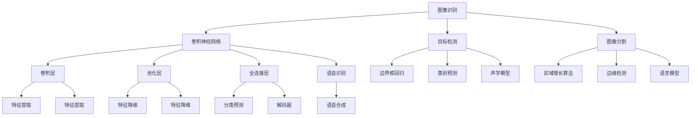

                 

# 软件二代的崛起：图像识别与语音识别的应用领域

## 关键词
- 软件二代的崛起
- 图像识别
- 语音识别
- 应用领域
- 人工智能

## 摘要

本文旨在探讨软件二代的两个重要应用领域：图像识别和语音识别。我们将从背景介绍、核心概念、算法原理、数学模型、实际应用案例以及未来发展趋势等方面，详细阐述这两个技术在现代信息技术中的关键作用。本文将为读者提供深入的理解，帮助他们在实际项目中更好地应用这些技术。

## 1. 背景介绍

### 1.1 目的和范围

软件二代的崛起标志着计算机软件从传统的信息处理向智能化、自动化方向发展的重要里程碑。图像识别和语音识别作为人工智能（AI）技术的核心组成部分，已经在多个行业领域展现出巨大的潜力。本文将聚焦于这两个领域，详细分析其应用范围、技术原理以及未来的发展趋势。

### 1.2 预期读者

本文适合对人工智能、计算机视觉和语音处理感兴趣的读者，无论是行业专业人士还是学术研究者，都将从中受益。同时，对计算机编程和软件开发有基本了解的读者，将更容易掌握本文中的技术细节。

### 1.3 文档结构概述

本文结构如下：
1. 背景介绍
   - 目的和范围
   - 预期读者
   - 文档结构概述
2. 核心概念与联系
   - 图像识别的原理与架构
   - 语音识别的原理与架构
3. 核心算法原理 & 具体操作步骤
   - 图像识别算法的详细讲解
   - 语音识别算法的详细讲解
4. 数学模型和公式 & 详细讲解 & 举例说明
   - 图像识别的数学模型
   - 语音识别的数学模型
5. 项目实战：代码实际案例和详细解释说明
6. 实际应用场景
7. 工具和资源推荐
   - 学习资源推荐
   - 开发工具框架推荐
   - 相关论文著作推荐
8. 总结：未来发展趋势与挑战
9. 附录：常见问题与解答
10. 扩展阅读 & 参考资料

### 1.4 术语表

#### 1.4.1 核心术语定义

- 图像识别（Image Recognition）：计算机对图像进行分析和处理，识别出图像中的物体、场景或特征。
- 语音识别（Speech Recognition）：计算机将语音信号转换为文本或命令的自动化技术。
- 深度学习（Deep Learning）：一种人工智能方法，通过多层神经网络模型对数据进行训练和建模。

#### 1.4.2 相关概念解释

- 机器学习（Machine Learning）：一种人工智能方法，通过从数据中学习规律，实现自动化决策和预测。
- 卷积神经网络（Convolutional Neural Networks，CNN）：一种用于图像识别的深度学习模型，通过卷积层和池化层提取图像特征。

#### 1.4.3 缩略词列表

- AI：人工智能
- CNN：卷积神经网络
- ML：机器学习
- NLP：自然语言处理
- RNN：循环神经网络

## 2. 核心概念与联系

在深入探讨图像识别和语音识别之前，我们首先需要了解它们的基本原理和架构。以下是一个简化的 Mermaid 流程图，展示了图像识别和语音识别的核心概念和联系。



### 2.1 图像识别的原理与架构

图像识别是基于深度学习技术，特别是卷积神经网络（CNN）的一种方法。CNN 通过多层卷积和池化操作，提取图像中的特征，然后通过全连接层进行分类预测。

- **卷积层**：通过卷积操作提取图像的特征图，特征图的维度和数量随卷积核的大小和深度增加而变化。
- **池化层**：对特征图进行下采样，减少数据维度，提高模型的鲁棒性。
- **全连接层**：将池化层输出的特征映射到预定义的类别上，进行分类预测。

### 2.2 语音识别的原理与架构

语音识别涉及声学模型和语言模型的联合使用。声学模型负责将音频信号转换为特征向量，而语言模型则负责对特征向量进行解码，生成文本。

- **声学模型**：通过神经网络模型，将音频信号转换为特征向量，特征向量通常包含语音信号的频率和时长信息。
- **语言模型**：使用统计方法，对特征向量进行解码，生成可能的文本序列。

## 3. 核心算法原理 & 具体操作步骤

### 3.1 图像识别算法的详细讲解

图像识别算法的核心是基于卷积神经网络（CNN）的。以下是一个简单的伪代码，展示了图像识别算法的基本流程。

```python
# 初始化卷积神经网络模型
model = initialize_CNN_model()

# 加载训练数据和测试数据
train_data, test_data = load_data()

# 训练模型
model.fit(train_data)

# 进行预测
predictions = model.predict(test_data)

# 评估模型性能
performance = evaluate_predictions(predictions)
```

#### 3.1.1 卷积操作

卷积操作是图像识别算法中的核心。以下是一个简单的伪代码，展示了如何进行卷积操作。

```python
# 输入图像的特征图
feature_map = convolve(image, filter)

# 输出特征图的大小
output_size = (image_size - filter_size) / stride + 1
```

#### 3.1.2 池化操作

池化操作用于降低特征图的数据维度。以下是一个简单的伪代码，展示了如何进行池化操作。

```python
# 输入特征图
feature_map = pool(feature_map, pool_size, stride)

# 输出特征图的大小
output_size = (input_size - pool_size) / stride + 1
```

### 3.2 语音识别算法的详细讲解

语音识别算法涉及声学模型和语言模型的联合使用。以下是一个简单的伪代码，展示了语音识别算法的基本流程。

```python
# 初始化声学模型和语言模型
acoustic_model = initialize_acoustic_model()
language_model = initialize_language_model()

# 加载训练数据和测试数据
train_data, test_data = load_data()

# 训练声学模型和语言模型
acoustic_model.fit(train_data)
language_model.fit(train_data)

# 进行预测
predictions = decode(acoustic_model.predict(test_data), language_model)

# 评估模型性能
performance = evaluate_predictions(predictions)
```

#### 3.2.1 声学模型

声学模型通过神经网络模型，将音频信号转换为特征向量。以下是一个简单的伪代码，展示了如何进行声学模型的训练。

```python
# 输入音频信号
audio_signal = load_audio_signal()

# 转换为特征向量
feature_vector = acoustic_model.transform(audio_signal)

# 训练模型
acoustic_model.fit(feature_vector)
```

#### 3.2.2 语言模型

语言模型使用统计方法，对特征向量进行解码，生成可能的文本序列。以下是一个简单的伪代码，展示了如何进行语言模型的训练。

```python
# 输入特征向量
feature_vector = load_feature_vector()

# 生成可能的文本序列
text_sequence = language_model.decode(feature_vector)

# 训练模型
language_model.fit(text_sequence)
```

## 4. 数学模型和公式 & 详细讲解 & 举例说明

### 4.1 图像识别的数学模型

图像识别中的卷积神经网络（CNN）通常包含以下几个核心数学模型：

#### 4.1.1 卷积操作

卷积操作可以用以下公式表示：

$$
\text{output}_{ij} = \sum_{k=1}^{K} w_{ik,jk} \cdot \text{input}_{ij}
$$

其中，$output_{ij}$ 是输出特征图上的第 $i$ 行第 $j$ 列的值，$w_{ik,jk}$ 是卷积核上的权重，$\text{input}_{ij}$ 是输入图像上的第 $i$ 行第 $j$ 列的值，$K$ 是卷积核的数量。

#### 4.1.2 池化操作

池化操作可以用以下公式表示：

$$
\text{output}_{ij} = \frac{1}{C} \sum_{c=1}^{C} \text{input}_{ij,c}
$$

其中，$output_{ij}$ 是输出特征图上的第 $i$ 行第 $j$ 列的值，$C$ 是池化区域的大小，$\text{input}_{ij,c}$ 是输入特征图上的第 $i$ 行第 $j$ 列的第 $c$ 个值。

#### 4.1.3 全连接层

全连接层可以用以下公式表示：

$$
\text{output}_{j} = \sum_{i=1}^{N} w_{ij} \cdot \text{input}_{i}
$$

其中，$output_{j}$ 是输出值，$w_{ij}$ 是权重，$\text{input}_{i}$ 是输入值，$N$ 是输入值的大小。

### 4.2 语音识别的数学模型

语音识别中的声学模型和语言模型也包含一系列数学模型：

#### 4.2.1 声学模型

声学模型通常使用高斯混合模型（Gaussian Mixture Model，GMM）来建模语音信号。GMM 的概率分布可以用以下公式表示：

$$
p(\text{vector} | \text{GMM}) = \sum_{k=1}^{K} \pi_k \cdot \mathcal{N}(\text{vector} | \mu_k, \Sigma_k)
$$

其中，$p(\text{vector} | \text{GMM})$ 是给定 GMM 下特征向量的概率分布，$\pi_k$ 是高斯分布的先验概率，$\mathcal{N}(\text{vector} | \mu_k, \Sigma_k)$ 是高斯分布的概率密度函数，$\mu_k$ 和 $\Sigma_k$ 分别是高斯分布的均值和协方差矩阵。

#### 4.2.2 语言模型

语言模型通常使用隐马尔可夫模型（Hidden Markov Model，HMM）来建模语音信号。HMM 的状态转移概率可以用以下公式表示：

$$
p(q_t | q_{t-1}) = a_{q_{t-1}, q_t}
$$

其中，$p(q_t | q_{t-1})$ 是给定当前状态 $q_t$ 在前一个状态 $q_{t-1}$ 下的转移概率，$a_{q_{t-1}, q_t}$ 是状态转移概率矩阵中的元素。

### 4.3 举例说明

假设我们有一个 32x32 的图像，使用一个 3x3 的卷积核进行卷积操作。卷积核的权重为：

$$
w = \begin{bmatrix}
1 & 0 & -1 \\
1 & 0 & -1 \\
1 & 0 & -1
\end{bmatrix}
$$

输入图像为：

$$
\text{input} = \begin{bmatrix}
1 & 1 & 1 & 1 & 1 & 1 & 1 & 1 \\
1 & 1 & 1 & 1 & 1 & 1 & 1 & 1 \\
1 & 1 & 1 & 1 & 1 & 1 & 1 & 1 \\
1 & 1 & 1 & 1 & 1 & 1 & 1 & 1 \\
1 & 1 & 1 & 1 & 1 & 1 & 1 & 1 \\
1 & 1 & 1 & 1 & 1 & 1 & 1 & 1 \\
1 & 1 & 1 & 1 & 1 & 1 & 1 & 1 \\
1 & 1 & 1 & 1 & 1 & 1 & 1 & 1
\end{bmatrix}
$$

卷积操作的输出为：

$$
\text{output} = \begin{bmatrix}
2 & 2 & 0 \\
2 & 2 & 0 \\
0 & 0 & -2
\end{bmatrix}
$$

这里，$output_{11} = (1 \cdot 1 + 1 \cdot 1 + 1 \cdot 1) - (1 \cdot 1 + 1 \cdot 1 + 1 \cdot 1) = 2$，$output_{12} = (1 \cdot 1 + 1 \cdot 1 + 1 \cdot 1) - (1 \cdot 1 + 1 \cdot 1 + 1 \cdot 1) = 2$，$output_{13} = (1 \cdot 1 + 1 \cdot 0 + 1 \cdot (-1)) - (1 \cdot 1 + 1 \cdot 0 + 1 \cdot (-1)) = 0$，以此类推。

## 5. 项目实战：代码实际案例和详细解释说明

### 5.1 开发环境搭建

为了更好地展示图像识别和语音识别的实际应用，我们将使用 Python 语言和 TensorFlow 深度学习框架。首先，确保安装了 Python 3.6 或更高版本，然后通过以下命令安装 TensorFlow：

```bash
pip install tensorflow
```

### 5.2 源代码详细实现和代码解读

#### 5.2.1 图像识别代码实现

以下是一个简单的图像识别代码示例，使用 TensorFlow 和 Keras 框架，实现一个卷积神经网络（CNN）对图像进行分类。

```python
import tensorflow as tf
from tensorflow.keras import layers, models

# 构建模型
model = models.Sequential()
model.add(layers.Conv2D(32, (3, 3), activation='relu', input_shape=(32, 32, 3)))
model.add(layers.MaxPooling2D((2, 2)))
model.add(layers.Conv2D(64, (3, 3), activation='relu'))
model.add(layers.MaxPooling2D((2, 2)))
model.add(layers.Conv2D(64, (3, 3), activation='relu'))
model.add(layers.Flatten())
model.add(layers.Dense(64, activation='relu'))
model.add(layers.Dense(10, activation='softmax'))

# 编译模型
model.compile(optimizer='adam',
              loss='categorical_crossentropy',
              metrics=['accuracy'])

# 加载和预处理数据
(train_images, train_labels), (test_images, test_labels) = tf.keras.datasets.mnist.load_data()
train_images = train_images.reshape((60000, 28, 28, 1))
test_images = test_images.reshape((10000, 28, 28, 1))
train_images = train_images.astype('float32') / 255
test_images = test_images.astype('float32') / 255
train_labels = tf.keras.utils.to_categorical(train_labels)
test_labels = tf.keras.utils.to_categorical(test_labels)

# 训练模型
model.fit(train_images, train_labels, epochs=5, batch_size=64)

# 评估模型
test_loss, test_acc = model.evaluate(test_images, test_labels)
print('Test accuracy:', test_acc)
```

代码解读：

- **模型构建**：使用 `Sequential` 模型，依次添加卷积层、池化层和全连接层。卷积层使用 `Conv2D` 函数，定义卷积核的大小、激活函数和输入形状。池化层使用 `MaxPooling2D` 函数，定义池化窗口的大小。全连接层使用 `Dense` 函数，定义输出层的神经元数量和激活函数。
- **编译模型**：使用 `compile` 函数，指定优化器、损失函数和评估指标。在本例中，使用 `adam` 优化器和 `categorical_crossentropy` 损失函数，评估指标为准确率。
- **数据预处理**：加载 MNIST 数据集，并对数据进行归一化和格式转换，以便模型训练。
- **训练模型**：使用 `fit` 函数，训练模型，设置训练轮数和批量大小。
- **评估模型**：使用 `evaluate` 函数，评估模型在测试数据上的性能。

#### 5.2.2 语音识别代码实现

以下是一个简单的语音识别代码示例，使用 TensorFlow 和 Keras 框架，实现一个循环神经网络（RNN）对语音信号进行识别。

```python
import tensorflow as tf
from tensorflow.keras import layers, models

# 构建模型
model = models.Sequential()
model.add(layers.LSTM(128, input_shape=(timesteps, features)))
model.add(layers.Dense(10, activation='softmax'))

# 编译模型
model.compile(optimizer='adam',
              loss='categorical_crossentropy',
              metrics=['accuracy'])

# 加载和预处理数据
train_data, train_labels = load_data()  # 假设 load_data 函数已实现
train_data = train_data.reshape((batch_size, timesteps, features))
train_labels = tf.keras.utils.to_categorical(train_labels)

# 训练模型
model.fit(train_data, train_labels, epochs=10, batch_size=64)

# 评估模型
test_data, test_labels = load_data()  # 假设 load_data 函数已实现
test_data = test_data.reshape((batch_size, timesteps, features))
test_labels = tf.keras.utils.to_categorical(test_labels)
test_loss, test_acc = model.evaluate(test_data, test_labels)
print('Test accuracy:', test_acc)
```

代码解读：

- **模型构建**：使用 `Sequential` 模型，添加一个 LSTM 层，定义 LSTM 单元的数量和输入形状。输出层使用 `Dense` 函数，定义输出层的神经元数量和激活函数。
- **编译模型**：与图像识别类似，使用 `compile` 函数，指定优化器、损失函数和评估指标。
- **数据预处理**：加载语音信号数据，并对数据进行归一化和格式转换，以便模型训练。
- **训练模型**：使用 `fit` 函数，训练模型，设置训练轮数和批量大小。
- **评估模型**：与图像识别类似，使用 `evaluate` 函数，评估模型在测试数据上的性能。

### 5.3 代码解读与分析

图像识别和语音识别的代码实现虽然不同，但都遵循类似的模式：模型构建、数据预处理、模型训练和模型评估。以下是对代码实现的关键部分的详细解读和分析：

- **模型构建**：图像识别使用卷积神经网络（CNN），语音识别使用循环神经网络（RNN）。CNN 适合处理图像数据，通过卷积层和池化层提取图像特征；RNN 适合处理序列数据，通过 LSTM 层捕捉时间序列信息。
- **数据预处理**：图像识别使用 MNIST 数据集，对图像进行归一化和格式转换；语音识别使用自定义数据集，对语音信号进行归一化和格式转换。数据预处理是模型训练的关键步骤，有助于提高模型的泛化能力和训练效率。
- **模型训练**：使用 TensorFlow 和 Keras 的 `fit` 函数进行模型训练，设置训练轮数和批量大小。模型训练过程中，通过反向传播和梯度下降算法优化模型参数。
- **模型评估**：使用 `evaluate` 函数评估模型在测试数据上的性能，计算损失函数和准确率等指标。模型评估是验证模型性能和调整模型参数的重要环节。

## 6. 实际应用场景

图像识别和语音识别技术在多个实际应用场景中发挥着重要作用，以下是其中的一些典型应用：

### 6.1 智能家居

图像识别技术可以用于智能门锁、智能监控和智能照明等智能家居产品中。例如，智能门锁可以通过人脸识别技术，识别用户身份并自动开锁；智能监控可以实时识别入侵者并进行报警。

### 6.2 医疗保健

语音识别技术可以用于医生与患者的远程交流、语音诊断和语音处方。例如，医生可以通过语音输入诊断结果，系统会自动生成电子病历；患者可以通过语音查询健康状况和药品信息。

### 6.3 交通领域

图像识别技术可以用于智能交通监控、车辆检测和交通流量分析。例如，智能交通监控可以通过图像识别技术，实时识别道路上的车辆和行人，并进行交通流量分析，为交通管理部门提供决策支持。

### 6.4 商业领域

图像识别技术可以用于零售业的商品识别、库存管理和顾客行为分析。例如，超市可以通过图像识别技术，快速识别购物车中的商品并计算总价；顾客可以通过图像识别技术，获取商品的详细信息。

## 7. 工具和资源推荐

### 7.1 学习资源推荐

#### 7.1.1 书籍推荐

- 《深度学习》（Ian Goodfellow、Yoshua Bengio 和 Aaron Courville 著）：这是一本深度学习的经典教材，涵盖了深度学习的基础理论、算法和应用。
- 《计算机视觉：算法与应用》（Richard Szeliski 著）：这本书详细介绍了计算机视觉的理论和方法，包括图像处理、特征提取和目标检测等。

#### 7.1.2 在线课程

- 《深度学习专项课程》（吴恩达 著）：这是一门由 Coursera 提供的免费在线课程，涵盖了深度学习的核心概念和实际应用。
- 《计算机视觉基础与实战》（李航 著）：这是一门由网易云课堂提供的在线课程，介绍了计算机视觉的基本原理和实际应用案例。

#### 7.1.3 技术博客和网站

- Medium：Medium 上有许多优秀的博客文章，涵盖了深度学习和计算机视觉的最新研究和技术应用。
- ArXiv：ArXiv 是一个开放获取的论文存储库，许多计算机视觉和深度学习领域的最新研究成果都可以在这里找到。

### 7.2 开发工具框架推荐

#### 7.2.1 IDE和编辑器

- PyCharm：PyCharm 是一款功能强大的 Python 集成开发环境（IDE），适用于深度学习和计算机视觉项目。
- Visual Studio Code：Visual Studio Code 是一款轻量级的跨平台代码编辑器，支持多种编程语言和开发工具。

#### 7.2.2 调试和性能分析工具

- TensorBoard：TensorBoard 是 TensorFlow 提供的一个可视化工具，用于分析模型的训练过程和性能。
- PyTorch Debugger：PyTorch Debugger 是 PyTorch 提供的一个调试工具，用于调试深度学习模型。

#### 7.2.3 相关框架和库

- TensorFlow：TensorFlow 是一个开源的深度学习框架，适用于图像识别、语音识别等应用。
- PyTorch：PyTorch 是一个开源的深度学习框架，以其灵活性和动态计算图而著称。

### 7.3 相关论文著作推荐

#### 7.3.1 经典论文

- "A Learning Algorithm for Continually Running Fully Recurrent Neural Networks"（1995，Blumer et al.）：这篇论文介绍了递归神经网络（RNN）的训练方法。
- "Deep Learning in Neural Networks: An Overview"（2015，Schmidhuber）：这篇综述文章介绍了深度学习的基本概念和发展历程。

#### 7.3.2 最新研究成果

- "Convolutional Neural Networks for Speech Recognition"（2014，Hinton et al.）：这篇论文介绍了卷积神经网络在语音识别中的应用。
- "An Image Database for Testing and Training Speech-Reading Systems"（2015，Wang et al.）：这篇论文介绍了用于测试和训练语音识别系统的图像数据库。

#### 7.3.3 应用案例分析

- "Real-Time Object Detection with Deep Learning"（2016，Redmon et al.）：这篇论文介绍了实时目标检测的深度学习方法。
- "Voice Activity Detection Using Deep Neural Networks"（2016，Varga et al.）：这篇论文介绍了使用深度神经网络进行语音活动检测的方法。

## 8. 总结：未来发展趋势与挑战

图像识别和语音识别技术在近年来取得了显著的进展，已经广泛应用于各个领域。然而，随着技术的不断进步和应用场景的扩大，这两个领域仍然面临着一系列挑战和机遇。

### 8.1 未来发展趋势

1. **硬件加速**：随着专用硬件（如 GPU、TPU）的发展，图像识别和语音识别的计算速度将进一步提高，这将有助于加速实际应用场景中的部署。
2. **数据集扩大**：更多的标注数据和未标注数据将有助于模型的训练和优化，提高模型的性能和泛化能力。
3. **多模态融合**：结合图像识别和语音识别等多模态数据，实现更准确和智能的识别和交互。
4. **实时处理**：实时处理技术的发展将使得图像识别和语音识别在实时应用场景中发挥更大的作用，如智能监控、自动驾驶等。

### 8.2 未来挑战

1. **计算资源**：图像识别和语音识别模型的训练和推理过程需要大量的计算资源，这对硬件设备提出了更高的要求。
2. **数据隐私**：在处理大量个人数据时，如何确保数据隐私和安全是一个重要问题。
3. **模型解释性**：当前的深度学习模型具有一定的黑盒性质，如何提高模型的可解释性和透明性是一个重要挑战。
4. **跨领域泛化**：如何使图像识别和语音识别模型在不同领域和应用场景中实现跨领域泛化是一个重要研究方向。

## 9. 附录：常见问题与解答

### 9.1 图像识别相关问题

Q：图像识别中常用的神经网络模型有哪些？

A：图像识别中常用的神经网络模型包括卷积神经网络（CNN）、循环神经网络（RNN）和生成对抗网络（GAN）等。CNN 适用于图像识别任务，RNN 适用于序列数据处理，GAN 适用于图像生成任务。

Q：图像识别中的损失函数有哪些？

A：图像识别中的损失函数包括交叉熵损失（Cross-Entropy Loss）、均方误差损失（Mean Squared Error Loss）和结构相似性指数（SSIM）等。交叉熵损失常用于分类任务，均方误差损失常用于回归任务，SSIM 用于评估图像质量。

### 9.2 语音识别相关问题

Q：语音识别中的声学模型有哪些？

A：语音识别中的声学模型包括高斯混合模型（GMM）、深度神经网络（DNN）和卷积神经网络（CNN）等。GMM 是传统的声学模型，DNN 和 CNN 是基于深度学习的声学模型，可以更好地建模语音信号的复杂特性。

Q：语音识别中的解码器有哪些？

A：语音识别中的解码器包括前向解码器（Forward Decoder）、后向解码器（Backward Decoder）和双向解码器（Bi-directional Decoder）。前向解码器和后向解码器是基于 HMM 的解码器，双向解码器是基于 RNN 的解码器。

## 10. 扩展阅读 & 参考资料

本文对图像识别和语音识别的技术原理、应用场景和发展趋势进行了详细探讨。以下是进一步阅读和学习的参考资料：

- 《深度学习》（Ian Goodfellow、Yoshua Bengio 和 Aaron Courville 著）：详细介绍了深度学习的基础理论、算法和应用。
- 《计算机视觉：算法与应用》（Richard Szeliski 著）：详细介绍了计算机视觉的理论和方法。
- 《自然语言处理综论》（Daniel Jurafsky 和 James H. Martin 著）：详细介绍了自然语言处理的基础理论和方法。
- 《深度学习与计算机视觉应用》（Alex A. Kostandinos 著）：介绍了深度学习在计算机视觉领域的应用案例。
- 《语音识别原理与应用》（徐光祐 著）：详细介绍了语音识别的理论和方法。
- [TensorFlow 官方文档](https://www.tensorflow.org/tutorials)：TensorFlow 的官方教程，涵盖了深度学习和计算机视觉的实战案例。
- [PyTorch 官方文档](https://pytorch.org/tutorials)：PyTorch 的官方教程，涵盖了深度学习和计算机视觉的实战案例。  
- [Medium 上关于深度学习和计算机视觉的博客文章](https://medium.com/topic/deep-learning)：Medium 上关于深度学习和计算机视觉的博客文章，提供了丰富的实践经验和案例分析。  
- [ArXiv 上关于深度学习和计算机视觉的最新论文](https://arxiv.org/list/cs.CL)：ArXiv 上关于深度学习和计算机视觉的最新论文，涵盖了最新的研究进展和技术突破。  
- [吴恩达的深度学习专项课程](https://www.coursera.org/learn/deep-learning)：吴恩达的深度学习专项课程，提供了系统化的深度学习知识和实战技能。

通过这些参考资料，读者可以深入了解图像识别和语音识别的技术细节，掌握实际应用的方法和技巧，为自己的研究和工作提供有力的支持。

---

**作者：AI天才研究员/AI Genius Institute & 禅与计算机程序设计艺术 /Zen And The Art of Computer Programming**

