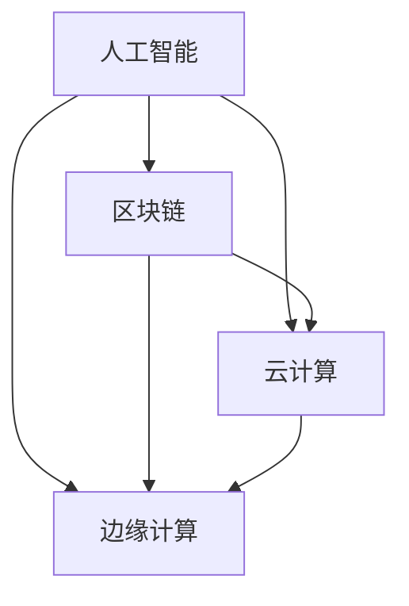
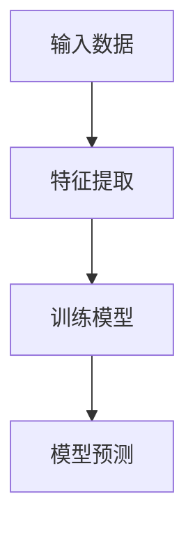
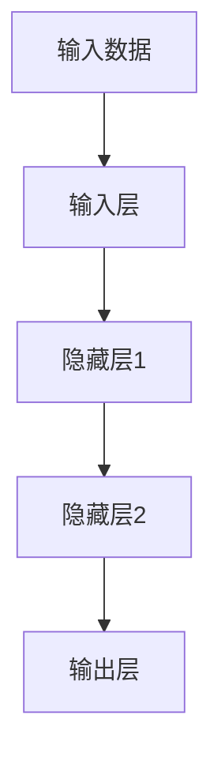
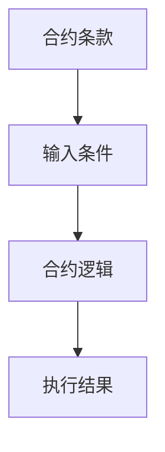
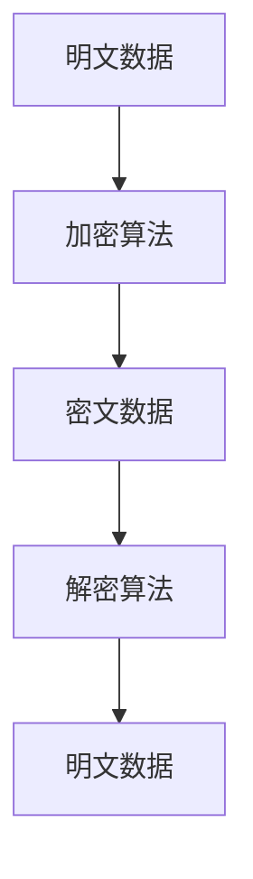
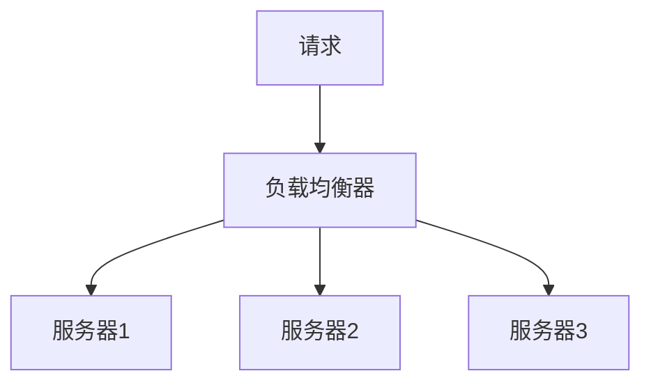
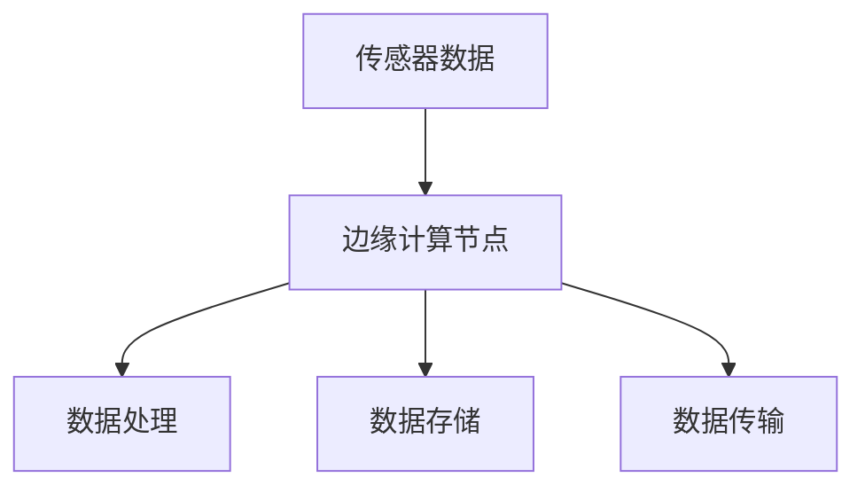

                 

# 软件二代的崛起：从实验室走向现实

> **关键词：软件 2.0，人工智能，区块链，云计算，边缘计算，数字化转型**
>
> **摘要：本文将深入探讨软件 2.0 的概念、核心技术、发展趋势以及其在实际应用场景中的影响。通过逐步分析，我们希望为读者提供一幅清晰的软件 2.0 生态全景图，揭示其从实验室走向现实的路径。**

## 1. 背景介绍

### 1.1 目的和范围

本文旨在探讨软件 2.0 的概念、核心技术和应用场景，分析其从实验室走向现实的过程，并展望其未来发展。我们将重点关注以下几个方面：

- **软件 2.0 的定义和特点**：介绍软件 2.0 的概念，对比软件 1.0 的差异，阐述其核心技术。
- **软件 2.0 的核心技术和架构**：分析区块链、云计算、边缘计算等核心技术，并给出相应的 Mermaid 流程图。
- **软件 2.0 的应用案例**：探讨软件 2.0 在金融、医疗、教育等领域的实际应用。
- **软件 2.0 的发展趋势和挑战**：分析软件 2.0 在未来面临的技术挑战和机遇。

### 1.2 预期读者

本文适合以下读者群体：

- 对软件技术有基本了解的程序员和软件工程师。
- 对人工智能、区块链等前沿技术感兴趣的技术爱好者。
- 想了解数字化转型和企业应用场景的企业家和管理者。

### 1.3 文档结构概述

本文分为十个部分：

1. 背景介绍：介绍本文的目的、预期读者和文档结构。
2. 核心概念与联系：给出软件 2.0 的核心概念和架构的 Mermaid 流程图。
3. 核心算法原理与具体操作步骤：详细讲解软件 2.0 的核心算法原理和操作步骤。
4. 数学模型和公式：阐述软件 2.0 的数学模型和公式。
5. 项目实战：提供软件 2.0 的实际案例和代码实现。
6. 实际应用场景：分析软件 2.0 在不同领域的应用。
7. 工具和资源推荐：推荐学习资源、开发工具和框架。
8. 总结：总结软件 2.0 的发展趋势与挑战。
9. 附录：常见问题与解答。
10. 扩展阅读与参考资料：提供相关的扩展阅读和参考资料。

### 1.4 术语表

#### 1.4.1 核心术语定义

- **软件 2.0**：相对于传统的软件 1.0，软件 2.0 更注重人工智能、区块链、云计算等前沿技术的融合，实现智能化、去中心化、分布式等特性。
- **区块链**：一种分布式数据库技术，通过加密算法和共识机制确保数据的安全性和不可篡改性。
- **云计算**：一种通过互联网提供计算资源的服务模式，包括基础设施即服务（IaaS）、平台即服务（PaaS）和软件即服务（SaaS）。
- **边缘计算**：一种分布式计算架构，将计算能力下沉到网络边缘，降低网络延迟，提高数据处理效率。

#### 1.4.2 相关概念解释

- **去中心化**：指网络中的节点不依赖于中心服务器，实现数据的分布式存储和处理。
- **智能合约**：一种自动执行合约条款的计算机协议，基于区块链技术实现。
- **数字化转型**：指利用数字技术改造传统业务模式，实现企业的信息化、智能化和高效化。

#### 1.4.3 缩略词列表

- **AI**：人工智能
- **Blockchain**：区块链
- **Cloud Computing**：云计算
- **Edge Computing**：边缘计算

## 2. 核心概念与联系

在深入探讨软件 2.0 之前，我们需要先了解其核心概念和联系。软件 2.0 是一种融合了多种前沿技术的软件体系，其核心概念包括人工智能、区块链、云计算、边缘计算等。

### 2.1 核心概念

#### 人工智能（AI）

人工智能是指计算机系统模拟人类智能行为的能力，包括学习、推理、规划、感知、自然语言处理等。人工智能的核心技术包括机器学习、深度学习、自然语言处理等。

#### 区块链（Blockchain）

区块链是一种分布式数据库技术，通过加密算法和共识机制确保数据的安全性和不可篡改性。区块链的核心技术包括智能合约、去中心化、加密算法等。

#### 云计算（Cloud Computing）

云计算是一种通过互联网提供计算资源的服务模式，包括基础设施即服务（IaaS）、平台即服务（PaaS）和软件即服务（SaaS）。云计算的核心技术包括虚拟化技术、分布式计算、存储技术等。

#### 边缘计算（Edge Computing）

边缘计算是一种分布式计算架构，将计算能力下沉到网络边缘，降低网络延迟，提高数据处理效率。边缘计算的核心技术包括物联网（IoT）、边缘服务器、边缘数据库等。

### 2.2 核心概念与联系

软件 2.0 的核心概念和联系可以用以下 Mermaid 流程图表示：



在这个流程图中，人工智能、区块链、云计算和边缘计算相互联系，共同构成软件 2.0 的核心技术体系。这些技术的融合使得软件 2.0 具有智能化、去中心化、分布式等特性，为实现数字化转型提供了强大的技术支撑。

## 3. 核心算法原理 & 具体操作步骤

在了解了软件 2.0 的核心概念和联系后，我们需要进一步探讨其核心算法原理和具体操作步骤。以下是软件 2.0 中的几种核心技术及其算法原理：

### 3.1 人工智能算法原理

#### 机器学习算法原理

机器学习是一种通过数据训练模型，使模型具有预测和决策能力的技术。其基本原理如下：



- **输入数据**：将实际数据输入到模型中，作为训练数据。
- **特征提取**：将输入数据转化为模型可处理的特征向量。
- **训练模型**：通过训练算法（如梯度下降、反向传播等），调整模型参数，使模型能够拟合训练数据。
- **模型预测**：将训练好的模型应用于新的数据，进行预测。

#### 深度学习算法原理

深度学习是一种基于多层神经网络的学习方法，其基本原理如下：



- **输入层**：接收输入数据，将其传递给隐藏层。
- **隐藏层**：通过非线性激活函数（如ReLU、Sigmoid、Tanh等），将输入数据转换为更复杂的特征。
- **输出层**：生成预测结果，与真实值进行比较，计算损失函数。
- **反向传播**：根据损失函数，反向传播误差，调整网络参数，优化模型。

### 3.2 区块链算法原理

#### 智能合约算法原理

智能合约是一种自动执行合约条款的计算机协议，其基本原理如下：



- **合约条款**：定义智能合约的规则和条件。
- **输入条件**：智能合约的输入数据，如交易金额、参与方等。
- **合约逻辑**：根据输入条件和合约条款，执行相应的操作。
- **执行结果**：智能合约执行后，返回的结果，如交易完成、失败等。

#### 加密算法原理

区块链中的加密算法用于确保数据的安全性和隐私性，其基本原理如下：



- **明文数据**：原始数据，如交易记录、个人信息等。
- **加密算法**：将明文数据转化为密文数据，确保数据在传输和存储过程中不被窃取。
- **密文数据**：加密后的数据，如区块链中的交易记录。
- **解密算法**：将密文数据还原为明文数据，确保数据的合法性和可用性。

### 3.3 云计算算法原理

#### 负载均衡算法原理

负载均衡是一种将请求分配到多个服务器，以优化系统性能和可用性的技术，其基本原理如下：



- **请求**：用户发起的请求，如HTTP请求、数据库查询等。
- **负载均衡器**：根据负载均衡策略（如轮询、最少连接、源IP哈希等），将请求分配到不同的服务器。
- **服务器**：处理请求，返回结果。

### 3.4 边缘计算算法原理

#### 物联网数据处理算法原理

物联网数据处理是一种将传感器数据采集、处理、存储和传输的技术，其基本原理如下：



- **传感器数据**：来自物联网设备的原始数据，如温度、湿度、压力等。
- **边缘计算节点**：对传感器数据进行采集、预处理、存储和处理。
- **数据处理**：根据应用需求，对传感器数据进行计算、分析和预测。
- **数据存储**：将处理后的数据存储在边缘数据库中，供后续使用。
- **数据传输**：将处理后的数据传输到云平台或中心服务器，进行进一步分析和处理。

通过以上核心算法原理的讲解，我们可以看到软件 2.0 的技术体系是如何协同工作的。在实际应用中，这些算法原理会被集成到具体的软件系统中，为用户提供智能、高效、安全的解决方案。

## 4. 数学模型和公式 & 详细讲解 & 举例说明

在软件 2.0 的技术体系中，数学模型和公式起着至关重要的作用。它们不仅能够描述系统的工作原理，还能够指导我们的具体操作。以下是几个核心数学模型和公式的详细讲解及举例说明。

### 4.1 机器学习模型

#### 4.1.1 回归模型

回归模型是一种用于预测数值型变量的机器学习模型。其基本公式为：

\[ y = \beta_0 + \beta_1 \cdot x \]

其中，\( y \) 是预测目标，\( x \) 是输入特征，\( \beta_0 \) 和 \( \beta_1 \) 是模型参数。

**举例说明**：

假设我们要预测房价，已知输入特征为房屋面积（\( x \)），预测目标为房价（\( y \)）。根据历史数据，我们得到以下回归模型：

\[ y = 1000 + 0.1 \cdot x \]

当房屋面积为 100 平方米时，预测房价为：

\[ y = 1000 + 0.1 \cdot 100 = 1100 \]

### 4.2 深度学习模型

#### 4.2.1 卷积神经网络（CNN）

卷积神经网络是一种用于图像识别的深度学习模型。其基本公式为：

\[ h_{l}(x) = \sigma(\mathbf{W}_{l} \cdot \mathbf{a}_{l-1} + b_{l}) \]

其中，\( h_{l} \) 是第 \( l \) 层的激活函数输出，\( \sigma \) 是激活函数（如ReLU、Sigmoid等），\( \mathbf{W}_{l} \) 和 \( b_{l} \) 是第 \( l \) 层的权重和偏置。

**举例说明**：

假设我们要识别一张图片，输入为 \( \mathbf{a}_{0} \)，输出为 \( h_{3} \)。根据历史数据，我们得到以下卷积神经网络：

\[ h_{1} = ReLU(\mathbf{W}_{1} \cdot \mathbf{a}_{0} + b_{1}) \]
\[ h_{2} = ReLU(\mathbf{W}_{2} \cdot h_{1} + b_{2}) \]
\[ h_{3} = ReLU(\mathbf{W}_{3} \cdot h_{2} + b_{3}) \]

当输入图片为 \( \mathbf{a}_{0} \) 时，输出为 \( h_{3} \)：

\[ h_{3} = ReLU(\mathbf{W}_{3} \cdot ReLU(\mathbf{W}_{2} \cdot ReLU(\mathbf{W}_{1} \cdot \mathbf{a}_{0} + b_{1}) + b_{2}) + b_{3}) \]

### 4.3 区块链模型

#### 4.3.1 拜占庭将军问题

拜占庭将军问题是区块链网络中一个重要的问题，其解决方案是共识算法。其基本公式为：

\[ \text{共识} = \text{max}(\text{多数派}) \]

其中，多数派是指超过一半的节点达成一致的意见。

**举例说明**：

假设有 5 个拜占庭将军，每个将军都有两个状态（诚实或背叛）。为了确保整个军队行动一致，需要实现共识算法。当超过 2 个将军达成一致时，共识达成。

### 4.4 云计算模型

#### 4.4.1 负载均衡模型

负载均衡模型用于优化系统性能和可用性，其基本公式为：

\[ P_{i} = \frac{1}{N} \sum_{j=1}^{N} w_{ij} \]

其中，\( P_{i} \) 是请求分配到第 \( i \) 个服务器的概率，\( N \) 是服务器的数量，\( w_{ij} \) 是第 \( i \) 个服务器和第 \( j \) 个请求的权重。

**举例说明**：

假设有 3 个服务器，权重分别为 1、2、3。当有 5 个请求需要分配时，每个请求分配到每个服务器的概率为：

\[ P_{1} = \frac{1}{3+2+3} = \frac{1}{8} \]
\[ P_{2} = \frac{2}{3+2+3} = \frac{2}{8} \]
\[ P_{3} = \frac{3}{3+2+3} = \frac{3}{8} \]

当有请求到达时，根据权重分配到服务器。

### 4.5 边缘计算模型

#### 4.5.1 物联网数据处理模型

物联网数据处理模型用于优化传感器数据的处理和传输，其基本公式为：

\[ \text{处理能力} = \text{数据传输速率} \cdot \text{处理延迟} \]

其中，处理能力是传感器数据在边缘节点处理的能力，数据传输速率是传感器数据传输的速度，处理延迟是传感器数据处理的时间。

**举例说明**：

假设边缘节点的数据传输速率为 100 Mbps，处理延迟为 1 ms。当传感器数据传输速率为 1 Mbps 时，边缘节点的处理能力为：

\[ \text{处理能力} = 100 \cdot 1 = 100 \text{ Mbps} \]

通过以上数学模型和公式的讲解，我们可以看到软件 2.0 技术体系的复杂性和实用性。在实际应用中，这些数学模型和公式会被用于优化系统的性能、可靠性和安全性，为用户提供更好的服务。

## 5. 项目实战：代码实际案例和详细解释说明

为了更好地理解软件 2.0 的实际应用，我们将通过一个具体的项目实战来展示其代码实现和详细解释。这个项目是一个基于区块链的智能合约，用于实现一个简单的投票系统。

### 5.1 开发环境搭建

在开始编写代码之前，我们需要搭建一个适合开发区块链智能合约的开发环境。以下是搭建步骤：

1. 安装 Node.js：从官方网站下载并安装 Node.js。
2. 安装 Truffle：在命令行中运行以下命令安装 Truffle：

   ```shell
   npm install -g truffle
   ```

3. 安装 Ganache：Ganache 是一个用于本地测试以太坊区块链的桌面应用程序。从官方网站下载并安装 Ganache。
4. 初始化 Truffle 项目：在命令行中运行以下命令，创建一个新的 Truffle 项目：

   ```shell
   truffle init
   ```

### 5.2 源代码详细实现和代码解读

以下是投票系统的智能合约代码：

```solidity
// SPDX-License-Identifier: MIT
pragma solidity ^0.8.0;

contract Voting {
    mapping(address => bool) public voted;
    mapping(bytes32 => uint256) public candidates;

    function addCandidate(string memory name) public {
        require(bytes(name).length > 0, "Invalid candidate name");
        bytes32 candidateId = keccak256(abi.encodePacked(name));
        require(candidates[candidateId] == 0, "Candidate already exists");
        candidates[candidateId] = 1;
    }

    function vote(bytes32 candidateId) public {
        require(!voted[msg.sender], "Already voted");
        require(candidates[candidateId] > 0, "Invalid candidate");
        voted[msg.sender] = true;
        candidates[candidateId]++;
    }

    function getTotalVotes(bytes32 candidateId) public view returns (uint256) {
        require(candidates[candidateId] > 0, "Invalid candidate");
        return candidates[candidateId];
    }
}
```

#### 5.2.1 代码解读

- **pragma solidity ^0.8.0**：指定智能合约的 Solidity 编译器版本。
- **mapping(address => bool) public voted**：定义一个映射，用于记录已投票的用户地址。
- **mapping(bytes32 => uint256) public candidates**：定义一个映射，用于存储候选人的 ID 和得票数。
- **function addCandidate(string memory name)**：添加候选人。首先，检查候选人名称的有效性，然后使用 keccak256 函数生成候选人的唯一 ID，并将得票数初始化为 0。
- **function vote(bytes32 candidateId)**：投票。首先，检查用户是否已经投票，然后检查候选人的有效性，最后更新用户的投票状态和候选人的得票数。
- **function getTotalVotes(bytes32 candidateId)**：获取某个候选人的总票数。首先，检查候选人的有效性，然后返回得票数。

### 5.3 代码解读与分析

#### 5.3.1 智能合约的关键部分

1. **候选人的添加**：

   ```solidity
   function addCandidate(string memory name) public {
       require(bytes(name).length > 0, "Invalid candidate name");
       bytes32 candidateId = keccak256(abi.encodePacked(name));
       require(candidates[candidateId] == 0, "Candidate already exists");
       candidates[candidateId] = 1;
   }
   ```

   这部分代码用于添加候选人。首先，检查候选人的名称是否为空。然后，使用 keccak256 函数生成候选人的唯一 ID。最后，检查候选人是否已经存在，如果不存在，则将其添加到映射中。

2. **投票**：

   ```solidity
   function vote(bytes32 candidateId) public {
       require(!voted[msg.sender], "Already voted");
       require(candidates[candidateId] > 0, "Invalid candidate");
       voted[msg.sender] = true;
       candidates[candidateId]++;
   }
   ```

   这部分代码用于处理投票。首先，检查用户是否已经投票。然后，检查候选人的有效性。最后，更新用户的投票状态和候选人的得票数。

3. **获取总票数**：

   ```solidity
   function getTotalVotes(bytes32 candidateId) public view returns (uint256) {
       require(candidates[candidateId] > 0, "Invalid candidate");
       return candidates[candidateId];
   }
   ```

   这部分代码用于获取某个候选人的总票数。首先，检查候选人的有效性。最后，返回候选人的得票数。

#### 5.3.2 代码分析

1. **安全性**：

   - 智能合约使用了 require 函数来检查输入参数的有效性，避免了无效输入和重复投票。
   - 智能合约使用了 keccak256 函数来生成候选人的唯一 ID，确保了 ID 的唯一性。

2. **简洁性**：

   - 智能合约的代码结构简洁，易于理解和维护。
   - 智能合约没有使用复杂的逻辑和循环，确保了代码的执行效率。

3. **可扩展性**：

   - 智能合约使用了映射数据结构来存储候选人和投票信息，支持任意数量的候选人和投票。

通过以上分析，我们可以看到这个投票系统的智能合约代码实现简洁、安全、可扩展，为软件 2.0 的实际应用提供了一个良好的示例。

## 6. 实际应用场景

软件 2.0 的核心技术已经在多个领域取得了显著的成果，以下将分析软件 2.0 在金融、医疗、教育等领域的实际应用场景。

### 6.1 金融

#### 6.1.1 数字货币与区块链

数字货币是基于区块链技术的加密货币，如比特币、以太坊等。区块链技术的去中心化和安全性使其成为金融领域的重要应用。例如，比特币可以用于跨境支付，避免了传统支付系统中的中介环节，提高了交易速度和降低了成本。

#### 6.1.2 智能合约

智能合约在金融领域的应用十分广泛，如众筹、保险、贷款等。通过智能合约，可以实现自动化、透明化的金融服务，减少了人为干预和操作风险。例如，众筹项目可以通过智能合约自动执行资金筹集和分配过程，确保项目的顺利实施。

### 6.2 医疗

#### 6.2.1 医疗数据管理

区块链技术可以用于医疗数据的管理和共享。通过区块链，可以实现医疗数据的去中心化存储，确保数据的安全性和隐私性。例如，患者可以在自己的手机应用中存储和管理自己的医疗记录，医生可以方便地获取患者的病历信息，提高了医疗服务的效率和质量。

#### 6.2.2 医疗智能诊断

人工智能技术可以用于医疗智能诊断，通过深度学习算法分析医学影像和患者数据，提供精准的诊断结果。例如，人工智能可以在肺癌筛查中识别早期病变，提高诊断的准确率。

### 6.3 教育

#### 6.3.1 在线教育平台

云计算和区块链技术可以用于构建在线教育平台，实现课程的去中心化存储和点对点传输。例如，学生可以在线购买课程，平台根据学生的完成情况进行积分奖励，提高了学习效果和用户满意度。

#### 6.3.2 智能学习分析

人工智能技术可以用于智能学习分析，通过分析学生的学习行为和成绩，提供个性化的学习建议。例如，学生可以在学习平台上获取针对自己学习风格和需求的学习资源，提高学习效果。

通过以上实际应用场景的分析，我们可以看到软件 2.0 的核心技术如何在不同领域实现创新和突破，为企业和个人提供了更高效、更安全的解决方案。

## 7. 工具和资源推荐

### 7.1 学习资源推荐

#### 7.1.1 书籍推荐

1. **《区块链技术指南》**：由李笑来著，详细介绍了区块链的基本原理和应用场景。
2. **《深度学习》**：由 Ian Goodfellow、Yoshua Bengio 和 Aaron Courville 著，全面讲解了深度学习的基础知识和最新进展。
3. **《云计算：概念、技术和应用》**：由张英潮著，系统地介绍了云计算的概念、技术和应用。

#### 7.1.2 在线课程

1. **《区块链入门教程》**：Coursera 上的一个免费课程，适合初学者了解区块链的基本概念。
2. **《深度学习 Specialization》**：由 Andrew Ng 开设的在线课程，涵盖了深度学习的各个方面。
3. **《云计算基础》**：Udemy 上的一个免费课程，介绍了云计算的基本概念和应用。

#### 7.1.3 技术博客和网站

1. **medium.com**：提供大量关于区块链、人工智能和云计算的原创文章。
2. **arxiv.org**：计算机科学领域的前沿论文发布平台，可以了解最新研究成果。
3. **hackernoon.com**：提供关于技术、创业和创新的博客文章。

### 7.2 开发工具框架推荐

#### 7.2.1 IDE和编辑器

1. **Visual Studio Code**：一款功能强大的开源编辑器，支持多种编程语言。
2. **IntelliJ IDEA**：一款适用于 Java 和其他语言的集成开发环境，具有强大的代码分析功能和智能提示。

#### 7.2.2 调试和性能分析工具

1. **GDB**：一款常用的 Unix/Linux 调试器，用于调试 C/C++ 程序。
2. **Eclipse Memory Analyzer Tool (MAT)**：用于分析 Java 应用程序的内存使用情况。

#### 7.2.3 相关框架和库

1. **Web3.js**：一个用于与以太坊区块链交互的 JavaScript 库。
2. **TensorFlow**：一个用于机器学习和深度学习的开源库。
3. **Docker**：一个用于容器化和云计算的开源工具，可以方便地部署和管理应用程序。

通过以上工具和资源的推荐，读者可以更好地学习和应用软件 2.0 的核心技术。

## 8. 总结：未来发展趋势与挑战

随着技术的不断进步和市场的需求变化，软件 2.0 正在成为新时代信息技术的重要趋势。从人工智能、区块链、云计算到边缘计算，软件 2.0 不仅仅是对传统软件的升级，更是一种全新的技术生态体系的构建。

### 8.1 未来发展趋势

1. **智能化的进一步提升**：随着人工智能技术的不断发展，软件 2.0 将更加智能化，能够更好地理解和满足用户需求。
2. **去中心化的广泛应用**：区块链技术的成熟和普及将推动更多领域的去中心化变革，提高系统的透明性和安全性。
3. **边缘计算的深化**：随着物联网设备的增加和数据量的爆炸式增长，边缘计算将在数据处理、实时分析和智能决策中发挥重要作用。
4. **融合与协同**：软件 2.0 各项核心技术将更加融合，协同工作，提供更全面、更高效的解决方案。
5. **生态体系的完善**：围绕软件 2.0 的技术和服务生态将不断丰富，为开发者、企业和用户提供更多便利和选择。

### 8.2 面临的挑战

1. **技术标准的不统一**：软件 2.0 各项技术的标准尚未完全统一，导致不同系统之间的互操作性存在困难。
2. **隐私和安全问题**：随着技术的普及，隐私和安全问题将更加突出，如何保护用户数据和隐私成为亟待解决的问题。
3. **法律和监管的滞后**：新技术的应用往往领先于法律法规的制定，如何平衡创新与法律监管将是未来的一大挑战。
4. **人才培养和知识普及**：软件 2.0 需要大量的专业人才，但现有的人才培养和知识普及速度难以跟上技术发展的步伐。

### 8.3 发展建议

1. **加强技术标准制定**：推动软件 2.0 各项技术的标准化，提高系统的互操作性和兼容性。
2. **完善法律法规**：加快法律法规的制定和更新，为技术创新提供良好的法律环境。
3. **提升人才培养**：加强高等教育和职业培训，培养更多具备软件 2.0 技术能力的专业人才。
4. **加强国际合作**：推动全球范围内的技术合作和知识共享，共同应对技术挑战。

通过以上分析和建议，我们可以看到软件 2.0 的发展前景广阔，但也面临诸多挑战。只有通过持续的技术创新、法律法规的完善和人才培养的加强，才能推动软件 2.0 在实际应用中的广泛应用和发展。

## 9. 附录：常见问题与解答

### 9.1 软件二代的定义是什么？

软件二代，即软件 2.0，是指基于人工智能、区块链、云计算、边缘计算等前沿技术的新型软件体系。与传统软件（软件 1.0）相比，软件 2.0 更加智能化、去中心化、分布式，能够提供更高效、更安全的解决方案。

### 9.2 软件二代的核心技术有哪些？

软件二代的核心技术包括人工智能、区块链、云计算、边缘计算等。人工智能使得软件具有智能决策和自主学习能力；区块链提供去中心化、安全的数据存储和传输；云计算提供灵活的弹性计算资源；边缘计算将计算能力下沉到网络边缘，提高数据处理效率。

### 9.3 软件二代在金融领域的应用有哪些？

软件二代在金融领域有广泛的应用，包括数字货币、智能合约、区块链支付、智能风控等。例如，比特币和以太坊等数字货币利用区块链技术实现去中心化的支付和资产交易；智能合约自动化执行金融交易和合同条款，提高了透明度和安全性。

### 9.4 软件二代在医疗领域的应用有哪些？

软件二代在医疗领域有重要的应用，包括医疗数据管理、智能诊断、健康监测等。例如，区块链技术用于医疗数据的管理和共享，确保数据的安全性和隐私性；人工智能技术用于医学影像分析和疾病预测，提高了诊断准确率和治疗效果。

### 9.5 软件二代在教育领域的应用有哪些？

软件二代在教育领域有广泛的应用，包括在线教育平台、智能学习分析、虚拟现实教学等。例如，在线教育平台利用云计算和区块链技术实现课程的点对点传输和去中心化存储；智能学习分析通过人工智能技术提供个性化的学习建议和资源推荐，提高了学习效果和用户满意度。

### 9.6 如何学习软件二代技术？

学习软件二代技术可以从以下几个方面入手：

- **阅读书籍和资料**：阅读相关的专业书籍和在线资料，了解各个技术的原理和应用。
- **参加在线课程和培训**：参加在线课程和培训班，系统学习软件二代技术的知识和技能。
- **实践项目**：通过实际项目实践，将所学知识应用到实际场景中，提高解决问题的能力。
- **参与社区和讨论**：加入技术社区和讨论组，与其他开发者交流和学习，拓展视野。

## 10. 扩展阅读与参考资料

### 10.1 书籍推荐

1. **《区块链技术指南》**：李笑来 著，电子工业出版社，2017年。
2. **《深度学习》**：Ian Goodfellow、Yoshua Bengio 和 Aaron Courville 著，电子工业出版社，2017年。
3. **《云计算：概念、技术和应用》**：张英潮 著，机械工业出版社，2016年。

### 10.2 在线课程

1. **《区块链入门教程》**：Coursera 上免费课程。
2. **《深度学习 Specialization》**：由 Andrew Ng 开设的在线课程。
3. **《云计算基础》**：Udemy 上的免费课程。

### 10.3 技术博客和网站

1. **medium.com**：提供大量关于区块链、人工智能和云计算的原创文章。
2. **arxiv.org**：计算机科学领域的前沿论文发布平台。
3. **hackernoon.com**：提供关于技术、创业和创新的博客文章。

### 10.4 论文和研究成果

1. **Nakamoto, S. (2008). Bitcoin: A peer-to-peer electronic cash system.**：比特币的创世论文，详细介绍了区块链技术的基本原理。
2. **LeCun, Y., Bengio, Y., & Hinton, G. (2015). Deep learning.**：深度学习的综述，总结了深度学习的发展历程和最新进展。
3. **Armbrust, M., Fox, A., Griffith, R., Konwinski, A., Lee, G., Patterson, D., ... & Zaharia, M. (2010). Above the clouds: A Berkeley view of cloud computing.**：云计算的综述，介绍了云计算的基本概念和技术架构。

### 10.5 应用案例分析

1. **Uber**：利用区块链技术实现司机和乘客的身份验证和数据安全。
2. **SAP**：利用人工智能技术提供智能化的企业解决方案。
3. **AWS**：提供全面的云计算服务，支持企业的数字化转型。

通过以上扩展阅读和参考资料，读者可以进一步深入了解软件 2.0 的相关技术和应用，为自身的学习和研究提供有力支持。

