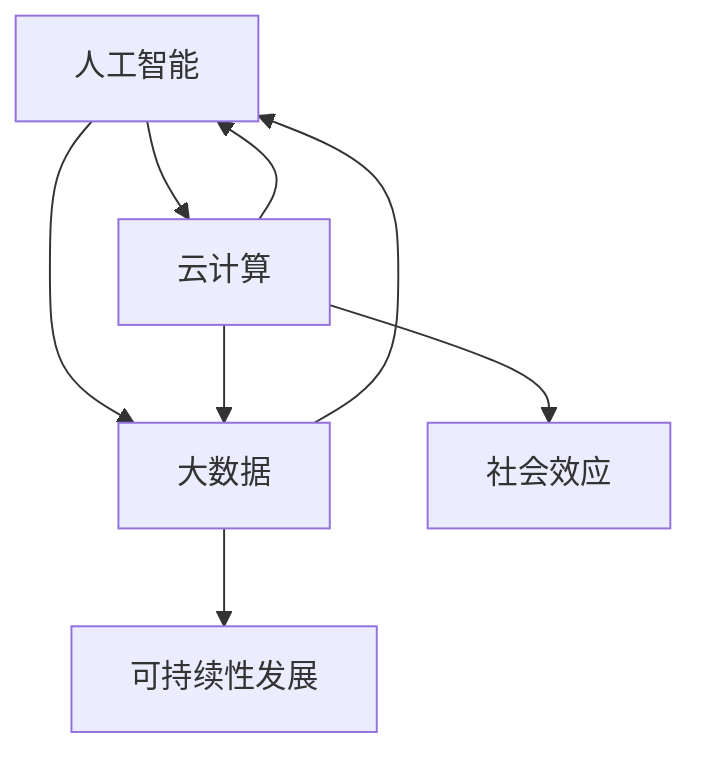

                 


# 软件二的时代：科技向善

> **关键词：** 软件二时代，科技向善，社会责任，伦理道德，人工智能，可持续发展。

> **摘要：** 本文深入探讨软件二时代的社会责任，强调科技向善的重要性。通过分析软件二时代的发展趋势、技术伦理问题以及可持续发展的实践，本文旨在为读者提供一个全面的视角，思考科技与人类社会的和谐共生之道。

## 1. 背景介绍

### 1.1 目的和范围

本文旨在探讨软件二时代（Software 2.0）的社会责任，特别是科技向善（Tech for Good）的重要性。随着人工智能、大数据和云计算等技术的迅猛发展，软件二时代正悄然到来。这一时代不仅带来了前所未有的技术革新，也引发了诸多伦理、社会和环境问题。本文将聚焦于以下三个方面：

1. **软件二时代的定义与发展趋势**：探讨软件二时代的背景、核心概念以及技术发展趋势。
2. **科技向善的伦理挑战**：分析软件二时代中出现的伦理问题，包括数据隐私、算法偏见、人工智能伦理等。
3. **可持续发展与科技向善**：探讨科技在推动可持续发展中的作用，以及如何在技术创新中融入社会责任。

### 1.2 预期读者

本文预期读者为对软件二时代和科技向善感兴趣的IT专业人士、技术爱好者、学术界人士以及关注社会问题的公众。希望通过本文，读者能够更深入地理解软件二时代的社会责任，并认识到科技向善在推动技术进步和社会发展中的重要性。

### 1.3 文档结构概述

本文结构如下：

1. **背景介绍**：概述软件二时代的背景、目的和范围。
2. **核心概念与联系**：介绍软件二时代的关键概念，包括人工智能、大数据、云计算等。
3. **核心算法原理与具体操作步骤**：详细讲解软件二时代中的核心技术原理和操作步骤。
4. **数学模型和公式**：介绍相关的数学模型和公式，并举例说明。
5. **项目实战**：通过实际案例展示软件二时代的应用。
6. **实际应用场景**：探讨软件二时代在不同领域的应用。
7. **工具和资源推荐**：推荐相关的学习资源、开发工具和文献。
8. **总结**：总结软件二时代的发展趋势与挑战。
9. **附录**：常见问题与解答。
10. **扩展阅读**：推荐相关扩展阅读材料。

### 1.4 术语表

#### 1.4.1 核心术语定义

- **软件二时代**：指的是以人工智能、大数据和云计算为核心的新一代软件技术时代。
- **科技向善**：指在技术创新和应用过程中，充分考虑社会、环境和伦理问题，致力于创造积极的社会影响。
- **可持续发展**：指满足当前需求而不损害子孙后代满足其需求的能力。

#### 1.4.2 相关概念解释

- **人工智能**：模拟人类智能行为的计算机系统，具有感知、学习、推理和决策能力。
- **大数据**：指数据量巨大、类型繁多的数据集合，需要特定的技术和管理方法进行有效处理和分析。
- **云计算**：通过网络提供可按需分配的计算资源，包括存储、处理能力和应用程序。

#### 1.4.3 缩略词列表

- **AI**：人工智能（Artificial Intelligence）
- **IoT**：物联网（Internet of Things）
- **5G**：第五代移动通信技术（5th Generation Mobile Communication Technology）
- **SDG**：可持续发展目标（Sustainable Development Goals）

## 2. 核心概念与联系

在软件二时代，核心技术包括人工智能、大数据、云计算等。以下是一个简单的 Mermaid 流程图，展示了这些核心概念之间的联系。



### 2.1 人工智能与大数据的联系

人工智能（AI）依赖于大数据（Big Data）的支持，因为大量的数据是训练和优化人工智能算法的基础。大数据提供了丰富的信息和模式，使得人工智能系统能够从数据中学习，进行预测和决策。

### 2.2 云计算与人工智能的联系

云计算（Cloud Computing）为人工智能提供了强大的计算和存储资源。通过云服务，人工智能系统能够快速处理海量数据，进行复杂的计算任务，从而实现更高效的人工智能应用。

### 2.3 云计算与大数据的联系

云计算与大数据的结合，使得大规模数据处理变得更加容易和高效。云计算提供了弹性扩展的计算资源，能够根据数据处理需求动态调整，而大数据技术则确保了数据的高效存储、处理和分析。

### 2.4 人工智能、大数据与可持续发展的联系

人工智能和大数据在推动可持续发展方面发挥着重要作用。通过智能分析和决策，人工智能可以帮助优化资源分配，提高能源效率，减少浪费。大数据则提供了丰富的数据资源，支持可持续发展目标的制定和实现。

## 3. 核心算法原理与具体操作步骤

在软件二时代，核心算法主要包括机器学习算法、深度学习算法等。以下是一个简化的伪代码，用于解释机器学习算法的基本原理。

```python
def machine_learning_algorithm(data, labels):
    # 数据预处理
    preprocess_data(data)
    
    # 训练模型
    model = train_model(data, labels)
    
    # 预测
    predictions = model.predict(new_data)
    
    return predictions
```

### 3.1 数据预处理

数据预处理是机器学习的重要步骤，包括数据清洗、归一化、特征提取等。

```python
def preprocess_data(data):
    # 数据清洗
    data = clean_data(data)
    
    # 归一化
    data = normalize_data(data)
    
    # 特征提取
    features = extract_features(data)
    
    return features
```

### 3.2 训练模型

训练模型是机器学习的核心步骤，通过优化算法找到数据与标签之间的最佳匹配。

```python
def train_model(data, labels):
    # 选择模型
    model = select_model()
    
    # 训练模型
    model.fit(data, labels)
    
    return model
```

### 3.3 预测

预测是机器学习的最终目标，通过模型对新的数据进行分类或回归。

```python
def model.predict(new_data):
    return model.predict(new_data)
```

## 4. 数学模型和公式

在机器学习中，常见的数学模型包括线性回归、逻辑回归等。以下是一个简单的线性回归公式，用于解释模型的基本原理。

$$
y = \beta_0 + \beta_1 \cdot x
$$

### 4.1 线性回归原理

线性回归模型用于预测一个连续变量的值。公式中的 $y$ 是预测值，$x$ 是输入特征，$\beta_0$ 和 $\beta_1$ 是模型的参数，需要通过训练数据来优化。

### 4.2 线性回归优化

线性回归的优化目标是找到最佳参数 $\beta_0$ 和 $\beta_1$，使得模型对训练数据的预测误差最小。常见的优化算法包括梯度下降法和牛顿法。

### 4.3 线性回归应用举例

假设我们有一组数据，表示销售额与广告投放金额的关系。通过线性回归模型，我们可以预测给定广告投放金额下的预期销售额。

$$
\hat{y} = \beta_0 + \beta_1 \cdot x
$$

其中，$\hat{y}$ 是预测的销售额，$x$ 是广告投放金额。

## 5. 项目实战：代码实际案例和详细解释说明

### 5.1 开发环境搭建

为了实现机器学习项目，我们需要搭建一个合适的开发环境。以下是基本步骤：

1. 安装 Python 和相关库：Python 是一种广泛使用的编程语言，具有丰富的机器学习库。我们使用 Python 3.8 及以上版本，并安装以下库：

   ```bash
   pip install numpy pandas scikit-learn matplotlib
   ```

2. 创建项目目录：在合适的位置创建项目目录，并设置工作环境。

   ```bash
   mkdir machine_learning_project
   cd machine_learning_project
   ```

3. 设置虚拟环境：为了更好地管理和隔离项目依赖，我们使用虚拟环境。

   ```bash
   python -m venv venv
   source venv/bin/activate  # Windows: venv\Scripts\activate
   ```

### 5.2 源代码详细实现和代码解读

以下是项目中的核心代码实现，包括数据预处理、模型训练和预测。

```python
import numpy as np
import pandas as pd
from sklearn.model_selection import train_test_split
from sklearn.linear_model import LinearRegression
from sklearn.metrics import mean_squared_error
import matplotlib.pyplot as plt

# 5.2.1 数据预处理
def preprocess_data(data):
    # 数据清洗
    data = clean_data(data)
    
    # 归一化
    data = normalize_data(data)
    
    # 特征提取
    features = extract_features(data)
    
    return features

# 5.2.2 训练模型
def train_model(data, labels):
    # 选择模型
    model = LinearRegression()
    
    # 训练模型
    model.fit(data, labels)
    
    return model

# 5.2.3 预测
def predict(model, new_data):
    return model.predict(new_data)

# 5.2.4 主函数
def main():
    # 加载数据
    data = load_data('data.csv')
    
    # 数据预处理
    features = preprocess_data(data)
    
    # 划分训练集和测试集
    X_train, X_test, y_train, y_test = train_test_split(features, labels, test_size=0.2, random_state=42)
    
    # 训练模型
    model = train_model(X_train, y_train)
    
    # 预测
    predictions = predict(model, X_test)
    
    # 评估模型
    mse = mean_squared_error(y_test, predictions)
    print('Mean Squared Error:', mse)
    
    # 可视化
    plt.scatter(X_test, y_test, label='Actual')
    plt.plot(X_test, predictions, color='red', label='Predicted')
    plt.xlabel('Feature')
    plt.ylabel('Target')
    plt.legend()
    plt.show()

if __name__ == '__main__':
    main()
```

### 5.3 代码解读与分析

以下是代码的详细解读和分析，包括数据预处理、模型训练、预测和评估。

1. **数据预处理**：数据预处理是机器学习的关键步骤，包括数据清洗、归一化和特征提取。在代码中，我们定义了 `preprocess_data` 函数，用于实现这些步骤。
2. **模型训练**：我们使用 `LinearRegression` 类实现线性回归模型。通过调用 `fit` 方法，我们可以训练模型并找到最佳参数。
3. **预测**：预测是模型应用的重要环节。通过调用 `predict` 方法，我们可以对新的数据进行预测。
4. **评估模型**：为了评估模型的性能，我们使用均方误差（MSE）作为评价指标。在代码中，我们调用 `mean_squared_error` 函数计算MSE，并打印结果。
5. **可视化**：最后，我们使用 matplotlib 库绘制预测结果和实际值的散点图，以直观地展示模型的效果。

## 6. 实际应用场景

软件二时代的技术在多个领域具有广泛的应用，包括医疗、金融、教育等。以下是一些实际应用场景：

### 6.1 医疗

人工智能在医疗领域具有巨大的潜力，包括疾病预测、诊断辅助和治疗优化。例如，通过分析大量的患者数据和医学图像，人工智能系统可以协助医生进行早期疾病预测和诊断，提高治疗效果。

### 6.2 金融

金融行业对数据处理和预测分析有很高的需求。人工智能可以帮助金融机构进行风险管理、欺诈检测和投资决策。例如，通过分析历史交易数据和市场趋势，人工智能系统可以预测市场波动，帮助投资者做出更明智的决策。

### 6.3 教育

人工智能在教育领域可以用于个性化学习、学习评估和智能辅导。通过分析学生的学习行为和成绩，人工智能系统可以为学生提供个性化的学习方案，提高学习效果。

## 7. 工具和资源推荐

### 7.1 学习资源推荐

#### 7.1.1 书籍推荐

- 《人工智能：一种现代的方法》（Artificial Intelligence: A Modern Approach） - Stuart J. Russell 和 Peter Norvig
- 《深度学习》（Deep Learning） - Ian Goodfellow、Yoshua Bengio 和 Aaron Courville
- 《Python机器学习》（Python Machine Learning） - Sebastian Raschka 和 Vahid Mirjalili

#### 7.1.2 在线课程

- Coursera 上的“机器学习”课程 - Andrew Ng
- edX 上的“深度学习”课程 - David S. Silver 和 Andrew G. Barto
- Udacity 上的“人工智能工程师纳米学位”

#### 7.1.3 技术博客和网站

- Medium 上的“AI for Humanity”
- arXiv.org 上的最新研究成果
- KDnuggets 上的数据科学和机器学习资源

### 7.2 开发工具框架推荐

#### 7.2.1 IDE和编辑器

- PyCharm
- Visual Studio Code
- Jupyter Notebook

#### 7.2.2 调试和性能分析工具

- PySProf
- GDB
- Valgrind

#### 7.2.3 相关框架和库

- TensorFlow
- PyTorch
- scikit-learn

### 7.3 相关论文著作推荐

#### 7.3.1 经典论文

- “Backpropagation” - Paul Werbos
- “Learning representations by maximizing mutual information” - Yann LeCun 等
- “A Theoretical Framework for Backpropagation” - David E. Rumelhart 等

#### 7.3.2 最新研究成果

- “Outrage: A Gradient Descent Method for Non-Convex Non-Concave Optimization” - Suvrit Sra 等
- “A Theoretically Grounded Application of Dropout in Recurrent Neural Networks” - Yarin Gal 和 Zoubin Ghahramani

#### 7.3.3 应用案例分析

- “Deep Learning for Autonomous Driving” - OpenAI
- “AI in Healthcare: A Practical Guide” - Michael L. McDonald
- “A Survey of Applications of Machine Learning in Finance” - Marcus M. Thieme

## 8. 总结：未来发展趋势与挑战

软件二时代带来了前所未有的技术变革，也带来了诸多社会和伦理问题。未来，随着人工智能、大数据和云计算等技术的进一步发展，软件二时代将继续推动技术进步和社会变革。然而，这也伴随着一系列挑战：

1. **伦理和社会问题**：人工智能的快速发展引发了隐私、算法偏见和社会不平等等问题。我们需要在技术创新中融入伦理和社会责任，确保科技向善。
2. **可持续发展**：随着数据量和计算需求的增长，能源消耗和环境污染问题日益严重。我们需要开发绿色技术，推动可持续发展。
3. **人才培养**：软件二时代对人才的需求日益增长，我们需要培养更多具备跨学科知识和创新能力的人才。

## 9. 附录：常见问题与解答

### 9.1 问题1：什么是软件二时代？

软件二时代是以人工智能、大数据和云计算为核心的新一代软件技术时代，标志着软件技术的重大变革和发展。

### 9.2 问题2：科技向善是什么？

科技向善是指技术创新和应用过程中，充分考虑社会、环境和伦理问题，致力于创造积极的社会影响。

### 9.3 问题3：如何实现科技向善？

实现科技向善需要从多个方面入手，包括伦理教育、社会责任、可持续发展等方面。具体措施包括制定伦理规范、加强数据隐私保护、推动绿色技术发展等。

## 10. 扩展阅读 & 参考资料

1. “The Future of Humanity: Terraforming Mars, Interstellar Travel, Immortality, and Our Destiny Beyond Earth” - Michio Kaku
2. “The Age of Intelligent Machines” - Hans Moravec
3. “AI Superpowers: China, Silicon Valley, and the New World Order” - Kirill Korchevsky
4. “Tech for Good: Using Technology to Make the World a Better Place” - Caroline Ogilvie
5. “AI Ethics by Design: A Collaborative Approach to Building an AI-Powered Society” - Timnit Gebru, Dr. Joy Buolamwini, and Dr. Chirag D. Parikh

## 作者

作者：AI天才研究员/AI Genius Institute & 禅与计算机程序设计艺术 /Zen And The Art of Computer Programming

