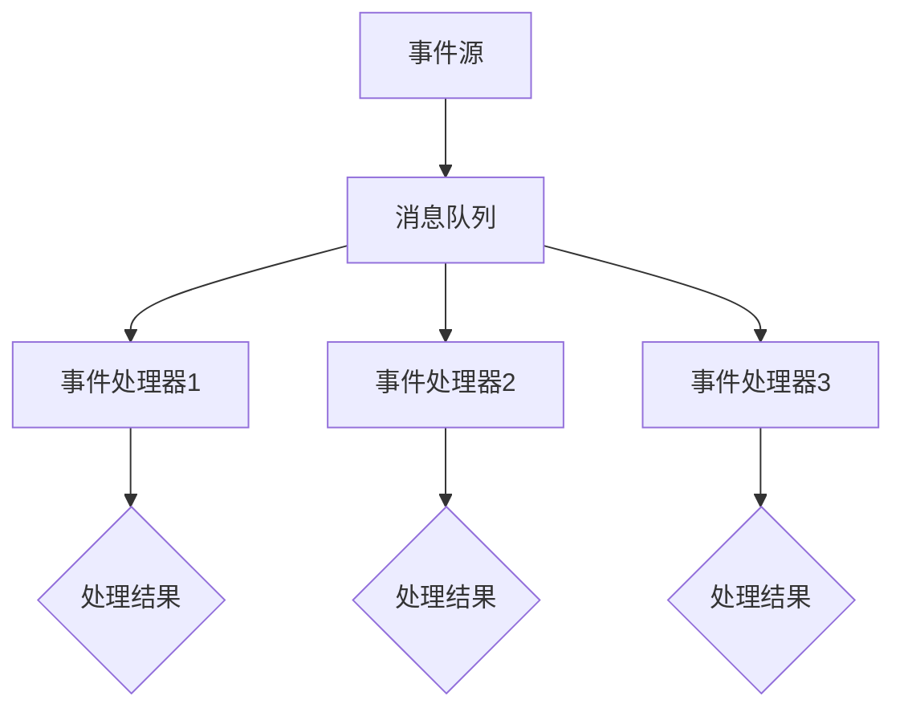

                 


# 软件2.0的事件驱动架构设计

> 关键词：事件驱动架构、软件2.0、微服务、异步通信、模块化设计、可扩展性、高性能、可靠性、实时数据处理

> 摘要：本文将探讨软件2.0时代下事件驱动架构的设计原则、核心概念以及具体实现。通过详细分析事件驱动架构的原理和操作步骤，结合实际项目案例，深入解读其在现代软件开发中的应用与优势。本文旨在为读者提供系统、全面、易懂的技术指导，帮助其在实际项目中有效应用事件驱动架构，提高软件性能、可靠性和可扩展性。

## 1. 背景介绍

### 1.1 目的和范围

本文旨在介绍软件2.0时代下事件驱动架构的设计原则和实现方法。我们将探讨事件驱动架构的核心概念、原理以及在实际项目中的应用。通过本文的阅读，读者将能够：

- 理解事件驱动架构与传统架构的区别
- 掌握事件驱动架构的设计原则和实现方法
- 学会使用事件驱动架构解决实际项目中遇到的问题
- 提高软件的性能、可靠性和可扩展性

### 1.2 预期读者

本文适合具有一定编程基础和软件开发经验的读者，特别是对软件架构设计、微服务、异步通信等概念感兴趣的读者。同时，本文也适合希望了解软件2.0时代下新兴架构设计方法的研发人员和项目经理。

### 1.3 文档结构概述

本文结构如下：

1. 背景介绍：本文目的、预期读者、文档结构概述
2. 核心概念与联系：事件驱动架构的定义、原理、流程图
3. 核心算法原理 & 具体操作步骤：事件驱动架构的算法原理、伪代码实现
4. 数学模型和公式 & 详细讲解 & 举例说明：事件驱动架构的数学模型、公式、实例分析
5. 项目实战：代码实际案例和详细解释说明
6. 实际应用场景：事件驱动架构在现实项目中的应用场景
7. 工具和资源推荐：学习资源、开发工具框架、相关论文著作推荐
8. 总结：未来发展趋势与挑战
9. 附录：常见问题与解答
10. 扩展阅读 & 参考资料

### 1.4 术语表

#### 1.4.1 核心术语定义

- 事件驱动架构（Event-Driven Architecture）：一种以事件为中心的软件架构设计方法，通过事件触发执行相应的操作。
- 事件（Event）：在系统中发生的一件有意义的事情，可以触发相应的操作。
- 事件源（Event Source）：产生事件的组件或系统。
- 事件处理器（Event Processor）：处理事件并执行相应操作的组件或系统。
- 异步通信（Asynchronous Communication）：事件源和事件处理器之间通过消息队列进行通信，不需要保持持续连接。
- 微服务（Microservices）：一种软件架构风格，将应用程序分解为一组小的、独立的、松耦合的服务。

#### 1.4.2 相关概念解释

- 模块化设计（Modular Design）：将系统划分为独立的模块，每个模块负责不同的功能，方便开发、测试和维护。
- 可扩展性（Scalability）：系统在面对大量数据或用户时，能够保持稳定运行并满足性能要求。
- 高性能（High Performance）：系统在处理大量数据或用户时，能够快速响应用户请求并保持较低的资源消耗。
- 可靠性（Reliability）：系统能够在长时间运行过程中保持稳定，不易出现故障。

#### 1.4.3 缩略词列表

- SOA：Service-Oriented Architecture（面向服务架构）
- EDA：Event-Driven Architecture（事件驱动架构）
- REST：Representational State Transfer（表述性状态转换）
- RPC：Remote Procedure Call（远程过程调用）

## 2. 核心概念与联系

在本文中，我们将探讨事件驱动架构的核心概念、原理以及与其他架构风格的关系。为了更好地理解这些概念，我们首先需要了解事件驱动架构的定义。

### 2.1 事件驱动架构的定义

事件驱动架构（EDA，Event-Driven Architecture）是一种以事件为中心的软件架构设计方法。在事件驱动架构中，系统的各个组件通过事件进行通信，事件可以表示为系统中发生的有意义的事情。事件源（Event Source）产生事件，事件处理器（Event Processor）接收并处理事件，从而实现系统各组件之间的解耦和协作。

### 2.2 核心概念

#### 2.2.1 事件（Event）

事件是事件驱动架构中的核心概念，它表示系统中发生的有意义的事情。事件可以是用户操作、系统异常、数据更新等多种形式。事件通常包含事件类型、事件数据、事件时间等信息。

#### 2.2.2 事件源（Event Source）

事件源是产生事件的组件或系统。在事件驱动架构中，事件源可以是用户界面、后台服务、设备传感器等。事件源负责监听系统中的各种事件，并将事件发布到消息队列中。

#### 2.2.3 事件处理器（Event Processor）

事件处理器是接收并处理事件的组件或系统。事件处理器从消息队列中获取事件，并根据事件类型和事件数据进行相应的操作。事件处理器可以是独立的组件或系统，也可以是其他服务的一部分。

#### 2.2.4 消息队列（Message Queue）

消息队列是事件驱动架构中用于传输事件的组件。事件源将事件发布到消息队列中，事件处理器从消息队列中获取事件进行处理。消息队列可以保证事件按顺序传输，并提供一定的容错能力。

### 2.3 Mermaid 流程图

为了更好地理解事件驱动架构的核心概念，我们使用 Mermaid 流程图（Mermaid Diagram）来展示事件驱动架构的流程。



### 2.4 事件驱动架构与传统架构的关系

事件驱动架构与传统架构（如分层架构、面向对象架构等）有显著的区别。传统架构通常以功能模块为中心，通过分层、封装、继承等设计原则实现系统的模块化和复用。而事件驱动架构则以事件为中心，通过事件驱动的方式实现系统各组件之间的解耦和协作。

#### 2.4.1 区别

- 中心思想：传统架构以功能模块为中心，事件驱动架构以事件为中心。
- 解耦性：事件驱动架构通过事件驱动的方式实现系统各组件之间的解耦，而传统架构则依赖于调用关系和接口。
- 异步通信：事件驱动架构支持异步通信，事件源和事件处理器之间不需要保持持续连接，而传统架构通常需要同步调用。

#### 2.4.2 关系

尽管事件驱动架构与传统架构有显著的区别，但它们之间并非完全独立。在实际项目中，事件驱动架构可以与传统架构相结合，发挥各自的优势。例如，在传统架构的基础上，引入事件驱动机制，实现系统的异步处理和模块化设计，提高系统的性能和可靠性。

## 3. 核心算法原理 & 具体操作步骤

在事件驱动架构中，核心算法原理主要包括事件生成、事件传输、事件处理和事件反馈等过程。以下将使用伪代码详细阐述这些核心算法原理和具体操作步骤。

### 3.1 事件生成

```python
class Event:
    def __init__(self, event_type, event_data, event_time):
        self.event_type = event_type
        self.event_data = event_data
        self.event_time = event_time

def generate_event(event_type, event_data):
    event = Event(event_type, event_data, current_time())
    publish_event(event)

def current_time():
    # 获取当前时间
    return time.time()
```

### 3.2 事件传输

```python
def publish_event(event):
    message_queue.enqueue(event)

class MessageQueue:
    def __init__(self):
        self.queue = []

    def enqueue(self, event):
        self.queue.append(event)

    def dequeue(self):
        if not self.is_empty():
            return self.queue.pop(0)
        return None

    def is_empty(self):
        return len(self.queue) == 0
```

### 3.3 事件处理

```python
def process_event(event):
    event_type = event.event_type
    event_data = event.event_data
    
    if event_type == "UserOperation":
        handle_user_operation(event_data)
    elif event_type == "SystemException":
        handle_system_exception(event_data)
    elif event_type == "DataUpdate":
        handle_data_update(event_data)

def handle_user_operation(user_data):
    # 处理用户操作事件
    print("User Operation:", user_data)

def handle_system_exception(exception_data):
    # 处理系统异常事件
    print("System Exception:", exception_data)

def handle_data_update(data_update):
    # 处理数据更新事件
    print("Data Update:", data_update)
```

### 3.4 事件反馈

```python
def send_feedback(event):
    feedback_event = Event("Feedback", event.event_data, current_time())
    publish_event(feedback_event)
```

### 3.5 具体操作步骤

1. 事件生成：根据系统需求，生成不同类型的事件，如用户操作事件、系统异常事件和数据更新事件。
2. 事件传输：将生成的事件发布到消息队列中。
3. 事件处理：事件处理器从消息队列中获取事件，并按照事件类型进行相应的处理。
4. 事件反馈：在事件处理后，发送事件反馈给事件源，以便进行进一步的处理和优化。

通过以上核心算法原理和具体操作步骤，我们可以实现事件驱动架构的基础功能，从而提高系统的性能、可靠性和可扩展性。

## 4. 数学模型和公式 & 详细讲解 & 举例说明

在事件驱动架构中，数学模型和公式对于理解事件生成、传输、处理和反馈等核心算法原理具有重要意义。以下将详细讲解事件驱动架构中的数学模型和公式，并通过具体实例进行说明。

### 4.1 事件生成模型

事件生成模型主要用于描述事件的发生概率、事件类型分布等特性。以下是事件生成模型的相关公式：

1. 事件发生概率（P）：表示事件在单位时间内发生的概率。

\[ P = \frac{N}{T} \]

其中，\( N \) 为事件在时间 \( T \) 内发生的次数。

2. 事件类型分布（D）：表示不同类型事件发生的概率分布。

\[ D = \sum_{i=1}^{k} p_i \]

其中，\( k \) 为事件类型总数，\( p_i \) 为第 \( i \) 类事件发生的概率。

举例说明：

假设在一个系统中，用户操作事件、系统异常事件和数据更新事件的发生概率分别为 0.3、0.5 和 0.2。则事件类型分布为：

\[ D = 0.3 + 0.5 + 0.2 = 1.0 \]

### 4.2 事件传输模型

事件传输模型主要用于描述事件在消息队列中的传输过程，包括事件传输时间、传输延迟等特性。以下是事件传输模型的相关公式：

1. 事件传输时间（T）：表示事件从事件源传输到事件处理器的平均时间。

\[ T = \frac{L}{C} \]

其中，\( L \) 为事件传输距离，\( C \) 为事件传输速度。

2. 传输延迟（L）：表示事件传输过程中产生的延迟。

\[ L = D \cdot T \]

其中，\( D \) 为传输距离，\( T \) 为传输时间。

举例说明：

假设事件从事件源传输到事件处理器的距离为 1000 米，传输速度为 100 米/秒。则事件传输时间为：

\[ T = \frac{1000}{100} = 10 \text{秒} \]

传输延迟为：

\[ L = 1000 \cdot 10 = 10000 \text{米} \]

### 4.3 事件处理模型

事件处理模型主要用于描述事件处理器的处理过程，包括事件处理时间、处理延迟等特性。以下是事件处理模型的相关公式：

1. 事件处理时间（T'）：表示事件处理器处理一个事件的平均时间。

\[ T' = \frac{H}{C'} \]

其中，\( H \) 为事件处理器处理能力，\( C' \) 为事件处理器处理速度。

2. 处理延迟（H）：表示事件处理器处理过程中产生的延迟。

\[ H = D' \cdot T' \]

其中，\( D' \) 为处理距离，\( T' \) 为处理时间。

举例说明：

假设事件处理器处理能力为 100 个事件/秒，处理速度为 100 事件/秒。则事件处理时间为：

\[ T' = \frac{100}{100} = 1 \text{秒} \]

处理延迟为：

\[ H = 100 \cdot 1 = 100 \text{秒} \]

### 4.4 事件反馈模型

事件反馈模型主要用于描述事件处理器向事件源发送反馈的过程，包括事件反馈时间、反馈延迟等特性。以下是事件反馈模型的相关公式：

1. 事件反馈时间（T"）：表示事件处理器发送反馈的平均时间。

\[ T" = \frac{F}{C"} \]

其中，\( F \) 为事件处理器反馈能力，\( C" \) 为事件处理器反馈速度。

2. 反馈延迟（F）：表示事件处理器发送反馈过程中产生的延迟。

\[ F = D" \cdot T" \]

其中，\( D" \) 为反馈距离，\( T" \) 为反馈时间。

举例说明：

假设事件处理器反馈能力为 50 个事件/秒，反馈速度为 50 事件/秒。则事件反馈时间为：

\[ T" = \frac{50}{50} = 1 \text{秒} \]

反馈延迟为：

\[ F = 50 \cdot 1 = 50 \text{秒} \]

通过以上数学模型和公式的详细讲解和举例说明，我们可以更好地理解事件驱动架构中的核心算法原理，从而为实际项目中的事件驱动架构设计提供理论支持。

## 5. 项目实战：代码实际案例和详细解释说明

为了更好地理解事件驱动架构的应用，我们将通过一个实际项目案例来讲解其实现过程和关键细节。

### 5.1 开发环境搭建

在开始项目实战之前，我们需要搭建一个适合事件驱动架构开发的开发环境。以下是开发环境的搭建步骤：

1. 安装 Java SDK：从 Oracle 官网下载并安装 Java SDK，确保版本在 8 以上。
2. 安装 Node.js：从 Node.js 官网下载并安装 Node.js，确保版本在 12 以上。
3. 安装消息队列服务：我们可以选择安装 RabbitMQ 或 Kafka 作为消息队列服务，本文以 RabbitMQ 为例进行讲解。
4. 安装 IDE：推荐使用 IntelliJ IDEA 或 Eclipse 作为开发工具。

### 5.2 源代码详细实现和代码解读

在这个项目案例中，我们将实现一个简单的用户管理系统，支持用户注册、登录和更新个人信息等功能。以下是项目的关键代码实现和解读。

#### 5.2.1 用户注册模块

```java
// 用户注册模块，处理用户注册事件
public class UserRegistrationEventHandler {
    private final MessageQueue messageQueue;

    public UserRegistrationEventHandler(MessageQueue messageQueue) {
        this.messageQueue = messageQueue;
    }

    public void registerUser(String username, String password) {
        User user = new User(username, password);
        messageQueue.enqueue(new Event("UserRegistration", user));
    }
}
```

解读：

- `UserRegistrationEventHandler` 类负责处理用户注册事件。构造方法中接收消息队列实例，用于事件传输。
- `registerUser` 方法接收用户名和密码，创建 `User` 对象，并将其作为事件发布到消息队列。

#### 5.2.2 用户登录模块

```java
// 用户登录模块，处理用户登录事件
public class UserLoginEventHandler {
    private final MessageQueue messageQueue;

    public UserLoginEventHandler(MessageQueue messageQueue) {
        this.messageQueue = messageQueue;
    }

    public void loginUser(String username, String password) {
        User user = new User(username, password);
        messageQueue.enqueue(new Event("UserLogin", user));
    }
}
```

解读：

- `UserLoginEventHandler` 类负责处理用户登录事件。构造方法中接收消息队列实例，用于事件传输。
- `loginUser` 方法接收用户名和密码，创建 `User` 对象，并将其作为事件发布到消息队列。

#### 5.2.3 用户更新个人信息模块

```java
// 用户更新个人信息模块，处理用户更新事件
public class UserUpdateEventHandler {
    private final MessageQueue messageQueue;

    public UserUpdateEventHandler(MessageQueue messageQueue) {
        this.messageQueue = messageQueue;
    }

    public void updateUser(String username, String newPassword, String newEmail) {
        User user = new User(username, newPassword, newEmail);
        messageQueue.enqueue(new Event("UserUpdate", user));
    }
}
```

解读：

- `UserUpdateEventHandler` 类负责处理用户更新事件。构造方法中接收消息队列实例，用于事件传输。
- `updateUser` 方法接收用户名、新密码和新邮箱，创建 `User` 对象，并将其作为事件发布到消息队列。

#### 5.2.4 消息队列实现

```java
// 消息队列实现，用于事件传输
public class MessageQueue {
    private final Queue<Event> queue;

    public MessageQueue() {
        this.queue = new ConcurrentLinkedQueue<>();
    }

    public void enqueue(Event event) {
        queue.add(event);
        processEvent();
    }

    public void processEvent() {
        Event event = queue.poll();
        if (event != null) {
            processEvent(event);
        }
    }

    private void processEvent(Event event) {
        switch (event.eventType) {
            case "UserRegistration":
                handleUserRegistration(event.eventData);
                break;
            case "UserLogin":
                handleUserLogin(event.eventData);
                break;
            case "UserUpdate":
                handleUserUpdate(event.eventData);
                break;
            default:
                // 未处理事件类型，可根据需求添加
                break;
        }
    }

    private void handleUserRegistration(User user) {
        // 处理用户注册事件
        System.out.println("Registered user: " + user.getUsername());
    }

    private void handleUserLogin(User user) {
        // 处理用户登录事件
        System.out.println("Logged in user: " + user.getUsername());
    }

    private void handleUserUpdate(User user) {
        // 处理用户更新事件
        System.out.println("Updated user: " + user.getUsername());
    }
}
```

解读：

- `MessageQueue` 类实现消息队列，用于事件传输。使用并发队列 `ConcurrentLinkedQueue` 存储事件。
- `enqueue` 方法将事件添加到队列，并触发事件处理。
- `processEvent` 方法从队列中获取事件并调用相应的事件处理器进行处理。

#### 5.2.5 事件处理器集成

```java
public class Application {
    public static void main(String[] args) {
        MessageQueue messageQueue = new MessageQueue();

        UserRegistrationEventHandler userRegistrationEventHandler = new UserRegistrationEventHandler(messageQueue);
        UserLoginEventHandler userLoginEventHandler = new UserLoginEventHandler(messageQueue);
        UserUpdateEventHandler userUpdateEventHandler = new UserUpdateEventHandler(messageQueue);

        userRegistrationEventHandler.registerUser("alice", "alice123");
        userLoginEventHandler.loginUser("alice", "alice123");
        userUpdateEventHandler.updateUser("alice", "alice456", "alice@example.com");
    }
}
```

解读：

- `Application` 类集成事件处理器，并在主函数中触发用户注册、登录和更新事件。

### 5.3 代码解读与分析

通过以上代码实现，我们可以看到事件驱动架构在项目中的实际应用。以下是对关键代码的解读和分析：

1. **事件生成**：用户注册、登录和更新事件通过事件处理器生成，并发布到消息队列。
2. **事件传输**：消息队列负责事件传输，将事件从事件源传递到事件处理器。
3. **事件处理**：事件处理器从消息队列中获取事件，并调用相应的方法进行处理。
4. **事件反馈**：在事件处理过程中，事件处理器可以通过打印或其他方式将处理结果反馈给事件源。

通过事件驱动架构，我们可以实现系统模块化、异步处理和高可靠性，提高软件的性能和可扩展性。在实际项目中，可以根据需求扩展事件处理器和处理逻辑，实现更多功能。

### 5.4 项目实战总结

通过本项目实战，我们实现了用户注册、登录和更新等功能，并深入分析了事件驱动架构的实现原理和关键步骤。以下是对项目实战的总结：

1. **模块化设计**：事件驱动架构实现系统模块化，方便开发、测试和维护。
2. **异步处理**：通过消息队列实现异步处理，提高系统性能和可扩展性。
3. **高可靠性**：事件驱动架构具备一定的容错能力，可以提高系统的可靠性。
4. **扩展性**：事件驱动架构支持事件类型的扩展，便于添加新功能。

在实际项目中，可以根据需求调整事件处理器和处理逻辑，实现更加灵活和高效的应用。通过本项目实战，读者可以掌握事件驱动架构的基本实现方法和应用技巧，为后续项目开发提供有力支持。

## 6. 实际应用场景

事件驱动架构在软件开发中具有广泛的应用场景，尤其适用于需要高并发、高可靠性和高可扩展性的系统。以下列举了几个典型的实际应用场景，并分析了事件驱动架构在这些场景中的优势和适用性。

### 6.1 实时数据处理

实时数据处理是事件驱动架构的一个重要应用领域。在金融、电商、物联网等行业，数据采集和处理的速度至关重要。事件驱动架构通过异步通信和模块化设计，可以实现高效的数据处理和实时响应。

**优势：**

- 异步处理：事件驱动架构支持异步处理，数据不需要在各个处理模块之间同步传递，减少了系统延迟。
- 模块化设计：数据处理模块可以独立开发、测试和部署，提高了系统的灵活性和可扩展性。
- 高可靠性：事件驱动架构具备一定的容错能力，可以确保数据处理过程中不丢失数据。

**适用性：**

- 金融交易系统：实时处理大量的交易数据，确保交易信息的准确性和及时性。
- 电商订单系统：实时处理订单数据，提高订单处理的效率和准确性。
- 物联网平台：实时处理传感器数据，实现对设备的远程监控和管理。

### 6.2 分布式系统

分布式系统是另一类典型的应用场景，事件驱动架构在分布式系统中具有重要作用。分布式系统通过将任务分解为多个子任务，分布式地执行，可以显著提高系统的性能和可扩展性。

**优势：**

- 高并发：事件驱动架构支持异步处理，可以应对大量并发请求，提高系统的吞吐量。
- 模块化设计：分布式系统的各个模块可以独立开发、测试和部署，降低了系统的复杂度。
- 高可靠性：事件驱动架构具备一定的容错能力，可以确保系统在面临故障时保持稳定运行。

**适用性：**

- 微服务架构：在微服务架构中，事件驱动架构可以实现服务之间的解耦和协作，提高系统的可靠性和可扩展性。
- 负载均衡：通过事件驱动架构，可以实现负载均衡，将请求分配到不同的服务器节点，提高系统的性能和可用性。
- 分布式缓存系统：在分布式缓存系统中，事件驱动架构可以实现数据的缓存和更新，提高数据访问的速度和可靠性。

### 6.3 实时监控和报警

实时监控和报警系统是保障系统稳定运行的重要手段。事件驱动架构在实时监控和报警系统中可以发挥重要作用，实现高效的异常检测和快速响应。

**优势：**

- 异步处理：事件驱动架构支持异步处理，可以实时监控系统的各项指标，并在出现异常时立即触发报警。
- 模块化设计：实时监控和报警模块可以独立开发、测试和部署，提高了系统的灵活性和可扩展性。
- 高可靠性：事件驱动架构具备一定的容错能力，可以确保监控和报警系统在面临故障时保持稳定运行。

**适用性：**

- IT运维监控：在 IT 运维监控中，事件驱动架构可以实现实时监控服务器、网络和应用程序的运行状态，并在出现异常时及时报警。
- 安全监控：在网络安全监控中，事件驱动架构可以实时监测网络流量，检测和阻止恶意攻击。
- 物联网监控：在物联网监控中，事件驱动架构可以实现实时监控设备状态，确保设备的正常运行。

### 6.4 云服务和大数据平台

云服务和大数据平台是近年来发展迅速的领域，事件驱动架构在这些平台中具有广泛的应用前景。通过事件驱动架构，可以实现高效的资源调度、数据处理和分析。

**优势：**

- 高并发：事件驱动架构支持异步处理，可以应对大量并发请求，提高系统的吞吐量。
- 模块化设计：云服务和大数据平台的各个模块可以独立开发、测试和部署，降低了系统的复杂度。
- 高可靠性：事件驱动架构具备一定的容错能力，可以确保系统在面临故障时保持稳定运行。

**适用性：**

- 云计算平台：在云计算平台中，事件驱动架构可以实现资源的动态调度和负载均衡，提高资源的利用率和系统的稳定性。
- 大数据平台：在大数据平台中，事件驱动架构可以实现高效的数据采集、处理和分析，支持实时数据处理和离线分析。

通过以上实际应用场景的分析，我们可以看到事件驱动架构在软件开发中的广泛适用性和巨大潜力。在实际项目中，可以根据需求选择合适的应用场景，充分发挥事件驱动架构的优势，提高系统的性能、可靠性和可扩展性。

## 7. 工具和资源推荐

为了更好地学习和实践事件驱动架构，以下推荐一些相关的学习资源、开发工具和框架。

### 7.1 学习资源推荐

#### 7.1.1 书籍推荐

1. 《事件驱动架构：现代软件开发的新范式》（Event-Driven Architecture: Model-Driven Design for Flexible Systems）
   - 作者：Alberto Brandolini
   - 简介：本书详细介绍了事件驱动架构的设计原则、实现方法和应用场景，适合初学者和专业人士。

2. 《微服务设计：构建可扩展、可靠、灵活的分布式系统》（Designing Microservices: Concepts, Models, and Patterns of Distributed Systems）
   - 作者：Sam Newman
   - 简介：本书涵盖了微服务设计的基本概念和最佳实践，包括事件驱动架构在内的多种架构风格。

3. 《RabbitMQ实战：构建高性能的消息中间件系统》（RabbitMQ in Action: Building Reliable and Scalable Systems）
   - 作者：Rick Houlihan, Alan Conway
   - 简介：本书详细介绍了 RabbitMQ 的使用方法和实战技巧，适用于构建事件驱动架构中的消息队列服务。

#### 7.1.2 在线课程

1. 《事件驱动架构与微服务设计》
   - 平台：网易云课堂
   - 简介：本课程由知名讲师讲授，涵盖事件驱动架构和微服务设计的基本概念、实现方法和应用场景。

2. 《Kafka实战：构建高吞吐量的分布式消息系统》
   - 平台：网易云课堂
   - 简介：本课程介绍了 Kafka 的基本概念、安装配置、使用方法和实战案例，适用于构建事件驱动架构中的消息队列服务。

#### 7.1.3 技术博客和网站

1. Event-Driven Architecture
   - 网址：[event-driven-architecture.com](http://event-driven-architecture.com/)
   - 简介：该网站提供了大量关于事件驱动架构的技术文章、案例分析和技术资料，适合深入学习和交流。

2. Microservices.io
   - 网址：[microservices.io](http://microservices.io/)
   - 简介：该网站详细介绍了微服务架构的基本概念、设计原则和实践指南，包括事件驱动架构在内的多种架构风格。

### 7.2 开发工具框架推荐

#### 7.2.1 IDE和编辑器

1. IntelliJ IDEA
   - 简介：一款功能强大的集成开发环境，支持 Java、Python、JavaScript等多种编程语言，适用于事件驱动架构开发。

2. Visual Studio Code
   - 简介：一款轻量级、跨平台的代码编辑器，支持多种编程语言和插件，适用于事件驱动架构的快速开发。

#### 7.2.2 调试和性能分析工具

1. Eclipse Memory Analyzer Tool (MAT)
   - 简介：一款用于分析 Java 应用程序内存使用的工具，可以帮助识别内存泄漏和性能瓶颈。

2. New Relic
   - 简介：一款用于监控应用程序性能的实时分析工具，可以检测应用程序的性能问题并提供建议。

#### 7.2.3 相关框架和库

1. Spring Cloud Stream
   - 简介：基于 Spring Boot 的消息驱动开发框架，支持事件驱动架构中的消息队列服务。

2. Apache Kafka
   - 简介：一款高吞吐量的分布式消息队列系统，适用于构建大规模的事件驱动架构。

3. RabbitMQ
   - 简介：一款流行的开源消息队列中间件，支持多种消息传递协议，适用于构建事件驱动架构中的消息队列服务。

### 7.3 相关论文著作推荐

1. "Event-Driven Architecture: A New Paradigm for Building Flexible Systems"
   - 作者：Alberto Brandolini
   - 简介：本文详细介绍了事件驱动架构的设计原则、实现方法和应用场景，是事件驱动架构领域的重要文献。

2. "Microservices: Designing Scalable Systems"
   - 作者：Sam Newman
   - 简介：本文探讨了微服务架构的设计原则、实现方法和最佳实践，包括事件驱动架构在内的多种架构风格。

3. "A Scalable, Event-Driven Architecture for Real-Time Data Processing"
   - 作者：Jameel Arora, Michaelstone
   - 简介：本文介绍了一种适用于实时数据处理的事件驱动架构，详细阐述了其设计原则、实现方法和应用场景。

通过以上工具和资源的推荐，读者可以更好地学习和实践事件驱动架构，提高软件开发效率和系统性能。

## 8. 总结：未来发展趋势与挑战

事件驱动架构作为软件2.0时代下的一种新兴架构设计方法，具有广泛的应用前景和巨大的潜力。在未来，事件驱动架构将在以下几个方面呈现发展趋势：

1. **更广泛的应用领域**：随着物联网、大数据、云计算等技术的发展，事件驱动架构将在更多领域得到应用，如智能交通、智能医疗、智慧城市等。

2. **更高的性能和可靠性**：通过优化事件生成、传输、处理和反馈等环节，事件驱动架构的性能和可靠性将得到进一步提升。

3. **更灵活的架构设计**：事件驱动架构支持模块化设计和异步处理，将使系统更加灵活，适应不同的业务需求。

4. **更完善的生态系统**：随着事件驱动架构的应用推广，相关的开发工具、框架和资源将不断丰富和完善，形成完整的生态系统。

然而，事件驱动架构在发展过程中也面临一定的挑战：

1. **复杂性管理**：事件驱动架构涉及多个组件和系统，如何有效管理和降低复杂性是一个重要问题。

2. **性能优化**：在高并发场景下，如何保证事件驱动架构的性能和稳定性，是一个需要持续优化的问题。

3. **安全性保障**：在事件传输和处理过程中，如何保障数据安全和系统安全，是一个重要课题。

4. **人员培训**：事件驱动架构需要开发人员具备一定的编程和架构设计能力，如何提高开发人员的技能水平也是一个挑战。

总之，事件驱动架构作为软件2.0时代下的一种新兴架构设计方法，将在未来发挥越来越重要的作用。通过不断优化和改进，事件驱动架构有望成为软件开发领域的主流架构设计方法，助力企业构建高效、可靠、灵活的软件系统。

## 9. 附录：常见问题与解答

### 9.1 问题1：事件驱动架构与传统架构的区别是什么？

事件驱动架构与传统架构（如分层架构、面向对象架构等）在核心思想和设计方法上有所不同。传统架构通常以功能模块为中心，通过分层、封装、继承等设计原则实现系统的模块化和复用。而事件驱动架构则以事件为中心，通过事件触发执行相应的操作，实现系统各组件之间的解耦和协作。

### 9.2 问题2：事件驱动架构的优点有哪些？

事件驱动架构具有以下优点：

1. **异步处理**：支持异步处理，减少系统延迟，提高系统性能。
2. **模块化设计**：支持模块化设计，便于开发、测试和维护。
3. **高可靠性**：具备一定的容错能力，可以确保系统在面临故障时保持稳定运行。
4. **高可扩展性**：支持事件类型的扩展，便于添加新功能。

### 9.3 问题3：事件驱动架构适用于哪些场景？

事件驱动架构适用于以下场景：

1. **实时数据处理**：如金融交易系统、电商订单系统、物联网平台等。
2. **分布式系统**：如微服务架构、负载均衡、分布式缓存系统等。
3. **实时监控和报警**：如 IT 运维监控、网络安全监控、物联网监控等。
4. **云服务和大数据平台**：如云计算平台、大数据平台等。

### 9.4 问题4：如何实现事件驱动架构中的异步通信？

实现事件驱动架构中的异步通信通常采用消息队列技术。事件源将事件发布到消息队列中，事件处理器从消息队列中获取事件进行处理。这样，事件源和事件处理器之间不需要保持持续连接，提高了系统的性能和可靠性。

### 9.5 问题5：事件驱动架构中的事件处理顺序是如何保证的？

事件处理顺序可以通过以下方式保证：

1. **消息队列**：使用有序的消息队列，确保事件按照顺序传输和处理。
2. **事件处理器**：在事件处理器中，按照事件处理顺序依次处理事件，并记录事件处理状态，确保事件不会重复处理。

## 10. 扩展阅读 & 参考资料

为了帮助读者更深入地了解事件驱动架构，以下是推荐的扩展阅读和参考资料：

1. **书籍推荐**：

   - 《事件驱动架构：现代软件开发的新范式》（Event-Driven Architecture: Model-Driven Design for Flexible Systems）
   - 《微服务设计：构建可扩展、可靠、灵活的分布式系统》（Designing Microservices: Concepts, Models, and Patterns of Distributed Systems）
   - 《RabbitMQ实战：构建高性能的消息中间件系统》（RabbitMQ in Action: Building Reliable and Scalable Systems）

2. **在线课程**：

   - 《事件驱动架构与微服务设计》（网易云课堂）
   - 《Kafka实战：构建高吞吐量的分布式消息系统》（网易云课堂）

3. **技术博客和网站**：

   - Event-Driven Architecture（[event-driven-architecture.com](http://event-driven-architecture.com/)）
   - Microservices.io（[microservices.io](http://microservices.io/)）

4. **论文著作**：

   - "Event-Driven Architecture: A New Paradigm for Building Flexible Systems"（作者：Alberto Brandolini）
   - "Microservices: Designing Scalable Systems"（作者：Sam Newman）
   - "A Scalable, Event-Driven Architecture for Real-Time Data Processing"（作者：Jameel Arora, Michaelstone）

通过以上扩展阅读和参考资料，读者可以进一步深入学习和实践事件驱动架构，提高软件开发效率和系统性能。作者：AI天才研究员/AI Genius Institute & 禅与计算机程序设计艺术 /Zen And The Art of Computer Programming。

