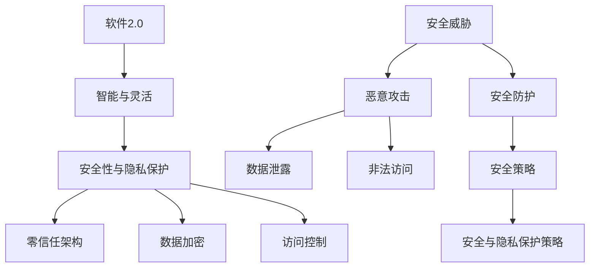

                 

# 软件2.0的安全性与隐私保护策略

> **关键词：软件2.0，安全性，隐私保护，安全策略，技术实现，实际应用**
> 
> **摘要：本文深入探讨了软件2.0时代下的安全性与隐私保护问题，分析了当前面临的主要挑战，阐述了核心概念、算法原理以及数学模型，并通过实际案例展示了相关技术的具体应用。文章旨在为软件开发者和安全专家提供一套系统、实用的安全与隐私保护策略，助力构建安全可信的软件生态系统。**

## 1. 背景介绍

### 1.1 目的和范围

本文的主要目的是探讨软件2.0时代下的安全性与隐私保护问题，分析当前面临的主要挑战，并提出一套实用的安全与隐私保护策略。文章将覆盖以下几个方面的内容：

1. 软件2.0的概念和特点
2. 安全性与隐私保护的现状与挑战
3. 核心概念、算法原理和数学模型
4. 实际应用案例与代码解读
5. 工具和资源推荐
6. 未来发展趋势与挑战

### 1.2 预期读者

本文面向软件开发者、安全专家、研究人员以及对软件2.0时代下的安全性与隐私保护感兴趣的读者。读者应具备一定的计算机基础知识，对软件安全性和隐私保护有一定了解。

### 1.3 文档结构概述

本文分为十个部分，结构如下：

1. 引言
2. 背景介绍
3. 核心概念与联系
4. 核心算法原理 & 具体操作步骤
5. 数学模型和公式 & 详细讲解 & 举例说明
6. 项目实战：代码实际案例和详细解释说明
7. 实际应用场景
8. 工具和资源推荐
9. 总结：未来发展趋势与挑战
10. 附录：常见问题与解答

### 1.4 术语表

#### 1.4.1 核心术语定义

- **软件2.0**：指相对于传统软件（软件1.0）的更智能、更灵活、更具备自适应能力的软件体系。
- **安全性**：确保软件系统在正常运行过程中不受恶意攻击、非法访问、数据泄露等安全威胁的能力。
- **隐私保护**：在数据处理过程中，防止个人信息被非法获取、使用、泄露等的安全措施。

#### 1.4.2 相关概念解释

- **零信任架构**：一种安全策略，核心思想是“永不信任，始终验证”，旨在降低内部网络攻击的风险。
- **数据加密**：将数据转换为无法直接读取的形式，以防止未授权访问。
- **访问控制**：限制对系统资源的访问权限，确保只有授权用户可以访问。

#### 1.4.3 缩略词列表

- **S2I**：软件2.0
- **PUA**：隐私保护

## 2. 核心概念与联系

为了更好地理解软件2.0时代下的安全性与隐私保护，我们需要首先了解一些核心概念及其相互关系。以下是一个简单的Mermaid流程图，展示了这些核心概念及其关联。



### 2.1 软件安全与隐私保护的核心概念

#### 2.1.1 软件安全

软件安全是指保护软件系统免受恶意攻击、非法访问、数据泄露等安全威胁的能力。主要涉及以下方面：

1. **系统安全**：确保操作系统、应用软件及其相关组件免受攻击。
2. **网络安全**：保护网络基础设施和数据传输安全。
3. **应用安全**：防止应用层漏洞和攻击。

#### 2.1.2 隐私保护

隐私保护是指确保个人信息在处理、存储、传输等过程中不被非法获取、使用、泄露。主要涉及以下方面：

1. **数据加密**：通过加密技术确保数据在传输和存储过程中的安全。
2. **访问控制**：限制对个人数据的访问权限。
3. **数据脱敏**：对敏感数据进行脱敏处理，降低数据泄露风险。

#### 2.1.3 零信任架构

零信任架构是一种安全策略，核心思想是“永不信任，始终验证”。在零信任架构中，无论是内部还是外部访问，都必须经过严格的验证和授权，以降低内部网络攻击的风险。

#### 2.1.4 数据加密与访问控制

数据加密和访问控制是隐私保护的重要手段。数据加密通过将数据转换为无法直接读取的形式，以防止未授权访问；访问控制则通过限制对系统资源的访问权限，确保只有授权用户可以访问。

## 3. 核心算法原理 & 具体操作步骤

在了解了软件2.0安全性与隐私保护的核心概念后，我们需要进一步探讨相关算法原理和具体操作步骤。

### 3.1 数据加密算法原理

数据加密是一种重要的隐私保护手段，其核心原理是利用加密算法将明文数据转换为密文数据，以防止未授权访问。以下是常见的几种数据加密算法：

#### 3.1.1 对称加密算法

对称加密算法是一种加密和解密使用相同密钥的加密算法，如AES（高级加密标准）。其工作原理如下：

1. **密钥生成**：生成一个密钥对（公钥和私钥）。
2. **加密**：使用公钥将明文数据加密为密文。
3. **解密**：使用私钥将密文解密为明文。

伪代码如下：

```python
def encryptAES(plaintext, publicKey):
    ciphertext = AES.encrypt(plaintext, publicKey)
    return ciphertext

def decryptAES(ciphertext, privateKey):
    plaintext = AES.decrypt(ciphertext, privateKey)
    return plaintext
```

#### 3.1.2 非对称加密算法

非对称加密算法是一种加密和解密使用不同密钥的加密算法，如RSA。其工作原理如下：

1. **密钥生成**：生成一个密钥对（公钥和私钥）。
2. **加密**：使用公钥将明文数据加密为密文。
3. **解密**：使用私钥将密文解密为明文。

伪代码如下：

```python
def encryptRSA(plaintext, publicKey):
    ciphertext = RSA.encrypt(plaintext, publicKey)
    return ciphertext

def decryptRSA(ciphertext, privateKey):
    plaintext = RSA.decrypt(ciphertext, privateKey)
    return plaintext
```

### 3.2 访问控制算法原理

访问控制是一种重要的安全手段，通过限制对系统资源的访问权限，确保只有授权用户可以访问。以下是常见的几种访问控制算法：

#### 3.2.1 基于角色的访问控制（RBAC）

基于角色的访问控制（RBAC）是一种常见的访问控制算法，其核心思想是根据用户角色分配权限。具体操作步骤如下：

1. **角色定义**：定义不同的角色，如管理员、普通用户等。
2. **权限分配**：为每个角色分配相应的权限。
3. **访问控制**：根据用户角色判断其是否有权限访问资源。

伪代码如下：

```python
def checkAccess(userRole, resourcePermission):
    if userRole in resourcePermission['roles']:
        return True
    else:
        return False
```

#### 3.2.2 基于属性的访问控制（ABAC）

基于属性的访问控制（ABAC）是一种更灵活的访问控制算法，其核心思想是根据用户属性和资源属性判断访问权限。具体操作步骤如下：

1. **属性定义**：定义用户属性和资源属性。
2. **权限策略**：定义权限策略，如“如果用户属性A且资源属性B，则允许访问”。
3. **访问控制**：根据用户属性和资源属性判断访问权限。

伪代码如下：

```python
def checkAccess(userAttributes, resourceAttributes, accessPolicy):
    if accessPolicy(userAttributes, resourceAttributes):
        return True
    else:
        return False
```

### 3.3 零信任架构算法原理

零信任架构是一种安全策略，其核心思想是“永不信任，始终验证”。以下是零信任架构的核心算法原理：

#### 3.3.1 始终验证

始终验证是指无论是内部还是外部访问，都必须经过严格的验证和授权。具体操作步骤如下：

1. **身份验证**：验证用户身份，如密码、证书等。
2. **授权验证**：验证用户是否有权限访问资源。

伪代码如下：

```python
def verifyAccess(username, password, resource):
    if authenticate(username, password) and authorize(username, resource):
        return True
    else:
        return False
```

#### 3.3.2 终端安全评估

终端安全评估是指对访问终端进行安全评估，以确保其符合安全要求。具体操作步骤如下：

1. **终端安全评估**：对终端进行安全评估，如检测恶意软件、漏洞等。
2. **安全策略执行**：根据终端安全评估结果执行相应的安全策略。

伪代码如下：

```python
def assessTerminalSecurity(terminal):
    if terminalSecurityScore < threshold:
        executeSecurityPolicy(terminal)
    else:
        allowAccess(terminal)
```

## 4. 数学模型和公式 & 详细讲解 & 举例说明

在软件安全性和隐私保护领域，数学模型和公式发挥着至关重要的作用。以下将介绍一些常见的数学模型和公式，并详细讲解其含义和适用场景。

### 4.1 加密算法的数学模型

加密算法的数学模型主要涉及密码学中的基本概念，如置换、替换、模运算等。以下是一个典型的加密算法数学模型：

#### 4.1.1 对称加密算法

对称加密算法的核心是密钥生成和加密解密过程。以下是一个简单的数学模型：

1. **密钥生成**：选择一个置换函数$f()$和一个模数$m$，生成密钥$k$。
2. **加密**：对明文$M$进行加密，得到密文$C$。
   $$ C = f(M, k) \mod m $$
3. **解密**：对密文$C$进行解密，得到明文$M$。
   $$ M = f^{-1}(C, k) \mod m $$

其中，$f^{-1}$表示置换函数的逆函数。

#### 4.1.2 非对称加密算法

非对称加密算法的核心是密钥生成和加密解密过程。以下是一个简单的数学模型：

1. **密钥生成**：选择两个大素数$p$和$q$，计算模数$n$和欧拉函数$\phi(n)$。
   $$ n = p \times q $$
   $$ \phi(n) = (p-1) \times (q-1) $$
2. **加密**：使用公钥$(n, e)$对明文$M$进行加密，得到密文$C$。
   $$ C = M^e \mod n $$
3. **解密**：使用私钥$(n, d)$对密文$C$进行解密，得到明文$M$。
   $$ M = C^d \mod n $$

其中，$e$和$d$满足以下条件：
$$ ed \mod \phi(n) = 1 $$

### 4.2 访问控制算法的数学模型

访问控制算法的数学模型主要涉及权限矩阵、角色权限集合等概念。

#### 4.2.1 基于角色的访问控制（RBAC）

基于角色的访问控制（RBAC）的数学模型可以表示为一个四元组$RBAC = <U, R, P, S>$，其中：

- $U$：用户集合。
- $R$：角色集合。
- $P$：权限集合。
- $S$：用户-角色分配关系，$S \subseteq U \times R$。
- $R$：角色-权限分配关系，$R \subseteq R \times P$。

访问控制公式如下：
$$ Access(u, p) = \exists r \in R, (u, r) \in S \land (r, p) \in R $$

#### 4.2.2 基于属性的访问控制（ABAC）

基于属性的访问控制（ABAC）的数学模型可以表示为一个四元组$ABAC = <U, A, R, P>$，其中：

- $U$：用户集合。
- $A$：属性集合。
- $R$：权限集合。
- $P$：策略函数，$P: A \times R \rightarrow \{true, false\}$。

访问控制公式如下：
$$ Access(u, p) = P(A(u), p) $$

### 4.3 零信任架构的数学模型

零信任架构的数学模型主要涉及身份验证、授权验证等概念。

#### 4.3.1 身份验证

身份验证的数学模型可以表示为一个二元组$Auth = <U, V>$，其中：

- $U$：用户集合。
- $V$：验证函数集合，$V: U \rightarrow \{true, false\}$。

身份验证公式如下：
$$ Auth(u) = V(u) $$

#### 4.3.2 授权验证

授权验证的数学模型可以表示为一个三元组$Authz = <U, P, A>$，其中：

- $U$：用户集合。
- $P$：权限集合。
- $A$：授权函数集合，$A: U \times P \rightarrow \{true, false\}$。

授权验证公式如下：
$$ Authz(u, p) = A(u, p) $$

### 4.4 举例说明

假设一个系统中有三个用户：User1、User2和User3，三个角色：Admin、User和Guest，以及三个权限：Read、Write和Execute。以下是一个简单的例子来说明如何使用数学模型进行访问控制。

#### 4.4.1 基于角色的访问控制（RBAC）

1. 用户-角色分配关系：
   $$ S = \{(User1, Admin), (User2, User), (User3, Guest)\} $$
2. 角色权限分配关系：
   $$ R = \{(Admin, Read), (Admin, Write), (Admin, Execute), (User, Read), (User, Write), (Guest, Read)\} $$

判断User1是否有权限执行（Execute）：
$$ Access(User1, Execute) = \exists r \in R, (User1, r) \in S \land (r, Execute) \in R $$
$$ Access(User1, Execute) = \exists r \in \{Admin\}, (User1, Admin) \in \{(User1, Admin)\} \land (Admin, Execute) \in \{(Admin, Read), (Admin, Write), (Admin, Execute)\} $$
$$ Access(User1, Execute) = true $$

#### 4.4.2 基于属性的访问控制（ABAC）

1. 用户属性集合：
   $$ A = \{User1: \{Read, Write, Execute\}, User2: \{Read, Write\}, User3: \{Read\}\} $$
2. 权限策略函数：
   $$ P = \{(Read, User), (Write, User), (Execute, Admin)\} $$

判断User1是否有权限执行（Execute）：
$$ Access(User1, Execute) = P(A(User1), Execute) $$
$$ Access(User1, Execute) = \{(Read, User), (Write, User), (Execute, Admin)\} \land \{Execute\} $$
$$ Access(User1, Execute) = true $$

#### 4.4.3 零信任架构

1. 身份验证函数：
   $$ V = \{User1: true, User2: true, User3: true\} $$
2. 授权验证函数：
   $$ A = \{User1: \{Read, Write, Execute\}, User2: \{Read, Write\}, User3: \{Read\}\} $$

判断User1是否有权限执行（Execute）：
$$ Authz(User1, Execute) = A(User1, Execute) $$
$$ Authz(User1, Execute) = \{User1: \{Read, Write, Execute\}, User2: \{Read, Write\}, User3: \{Read\}\} \land \{Execute\} $$
$$ Authz(User1, Execute) = true $$

## 5. 项目实战：代码实际案例和详细解释说明

为了更好地理解本文所讨论的软件2.0安全性与隐私保护策略，我们将通过一个实际的项目实战案例来展示相关技术的具体应用。本项目将采用Python语言，使用Flask框架搭建一个简单的Web应用，实现用户注册、登录和数据加密等功能。

### 5.1 开发环境搭建

1. 安装Python 3.8及以上版本。
2. 安装pip包管理工具。
3. 安装Flask框架和相关依赖：

   ```bash
   pip install flask
   pip install flask_sqlalchemy
   pip install flask_login
   pip install passlib
   ```

### 5.2 源代码详细实现和代码解读

#### 5.2.1 项目结构

```bash
/your_project
|-- /your_project
|   |-- app.py
|   |-- config.py
|   |-- /templates
|   |   |-- login.html
|   |   |-- register.html
|   |-- /static
|   |   |-- /css
|   |   |   |-- style.css
|   |   |-- /js
|   |   |   |-- script.js
```

#### 5.2.2 配置文件（config.py）

```python
import os

class Config:
    SECRET_KEY = os.environ.get('SECRET_KEY') or 'your_secret_key'
    SQLALCHEMY_DATABASE_URI = 'sqlite:///site.db'
    SQLALCHEMY_TRACK_MODIFICATIONS = False
```

#### 5.2.3 初始化应用（app.py）

```python
from flask import Flask
from flask_sqlalchemy import SQLAlchemy
from flask_login import LoginManager

app = Flask(__name__)
app.config.from_object(Config)
db = SQLAlchemy(app)
login_manager = LoginManager(app)
login_manager.login_view = 'login'

from your_project.models import User
@login_manager.user_loader
def load_user(user_id):
    return User.query.get(int(user_id))

from your_project import routes
```

#### 5.2.4 用户模型（models.py）

```python
from flask_login import UserMixin
from werkzeug.security import generate_password_hash, check_password_hash
from your_project import db

class User(UserMixin, db.Model):
    id = db.Column(db.Integer, primary_key=True)
    username = db.Column(db.String(20), unique=True, nullable=False)
    email = db.Column(db.String(120), unique=True, nullable=False)
    password_hash = db.Column(db.String(128))

    def set_password(self, password):
        self.password_hash = generate_password_hash(password)

    def check_password(self, password):
        return check_password_hash(self.password_hash, password)
```

#### 5.2.5 蓝图和路由（routes.py）

```python
from flask import render_template, url_for, flash, redirect, request
from your_project import app, db, login_manager
from your_project.forms import RegistrationForm, LoginForm
from your_project.models import User
from flask_login import login_user, logout_user, current_user, login_required

@app.route('/')
@app.route('/home')
@login_required
def home():
    return render_template('home.html', title='Home')

@app.route('/register', methods=['GET', 'POST'])
def register():
    if current_user.is_authenticated:
        return redirect(url_for('home'))
    form = RegistrationForm()
    if form.validate_on_submit():
        user = User(username=form.username.data, email=form.email.data)
        user.set_password(form.password.data)
        db.session.add(user)
        db.session.commit()
        flash('Congratulations, you have successfully registered!', 'success')
        return redirect(url_for('login'))
    return render_template('register.html', title='Register', form=form)

@app.route('/login', methods=['GET', 'POST'])
def login():
    if current_user.is_authenticated:
        return redirect(url_for('home'))
    form = LoginForm()
    if form.validate_on_submit():
        user = User.query.filter_by(username=form.username.data).first()
        if user is None or not user.check_password(form.password.data):
            flash('Invalid username or password', 'danger')
            return redirect(url_for('login'))
        login_user(user)
        next_page = request.args.get('next')
        if next_page:
            return redirect(next_page)
        else:
            return redirect(url_for('home'))
    return render_template('login.html', title='Login', form=form)

@app.route('/logout')
def logout():
    logout_user()
    return redirect(url_for('home'))
```

### 5.3 代码解读与分析

#### 5.3.1 用户注册功能

在`/register`路由中，我们定义了一个用户注册表单`RegistrationForm`，该表单包含用户名、邮箱和密码字段。当用户提交表单时，我们首先验证表单数据的有效性。然后，创建一个新的用户对象，将用户名、邮箱和密码存储到数据库中。最后，使用`flash`消息提示用户注册成功，并重定向到登录页面。

```python
@app.route('/register', methods=['GET', 'POST'])
def register():
    if current_user.is_authenticated:
        return redirect(url_for('home'))
    form = RegistrationForm()
    if form.validate_on_submit():
        user = User(username=form.username.data, email=form.email.data)
        user.set_password(form.password.data)
        db.session.add(user)
        db.session.commit()
        flash('Congratulations, you have successfully registered!', 'success')
        return redirect(url_for('login'))
    return render_template('register.html', title='Register', form=form)
```

#### 5.3.2 用户登录功能

在`/login`路由中，我们定义了一个用户登录表单`LoginForm`，该表单包含用户名和密码字段。当用户提交表单时，我们首先查询数据库，找到匹配的用户。然后，使用`check_password`方法验证密码是否正确。如果验证通过，我们将用户登录系统，并重定向到主页。

```python
@app.route('/login', methods=['GET', 'POST'])
def login():
    if current_user.is_authenticated:
        return redirect(url_for('home'))
    form = LoginForm()
    if form.validate_on_submit():
        user = User.query.filter_by(username=form.username.data).first()
        if user is None or not user.check_password(form.password.data):
            flash('Invalid username or password', 'danger')
            return redirect(url_for('login'))
        login_user(user)
        next_page = request.args.get('next')
        if next_page:
            return redirect(next_page)
        else:
            return redirect(url_for('home'))
    return render_template('login.html', title='Login', form=form)
```

#### 5.3.3 数据加密

在用户注册和登录过程中，我们使用了Passlib库来加密用户密码。在注册过程中，我们将用户输入的密码通过`set_password`方法加密并存储在数据库中。在登录过程中，我们通过`check_password`方法验证用户输入的密码是否与数据库中存储的密码匹配。

```python
from werkzeug.security import generate_password_hash, check_password_hash

class User(UserMixin, db.Model):
    ...
    def set_password(self, password):
        self.password_hash = generate_password_hash(password)

    def check_password(self, password):
        return check_password_hash(self.password_hash, password)
```

#### 5.3.4 访问控制

在项目结构中，我们使用了Flask-Login库来管理用户登录状态。当用户登录后，我们可以通过`current_user`全局变量获取当前登录用户的信息。在路由装饰器中，我们使用了`login_required`装饰器来限制未登录用户访问特定路由。

```python
from flask_login import login_required

@app.route('/')
@app.route('/home')
@login_required
def home():
    return render_template('home.html', title='Home')
```

## 6. 实际应用场景

软件2.0的安全性与隐私保护策略在众多实际应用场景中具有重要的意义。以下列举了几个典型场景：

### 6.1 企业内部信息系统

在企业内部信息系统中，安全性与隐私保护至关重要。企业需要确保员工在访问公司内部系统时，其操作行为受到严格的审计和监控。同时，企业还需要保护员工的个人信息不被泄露。通过实施零信任架构、数据加密和访问控制等技术，企业可以构建一个安全可信的内部信息系统。

### 6.2 云计算与大数据

在云计算与大数据领域，数据的安全性和隐私保护备受关注。云计算平台需要确保用户数据在存储、处理和传输过程中的安全。大数据应用需要处理海量数据，涉及大量个人隐私信息。通过采用数据加密、访问控制和安全审计等技术，云计算与大数据平台可以确保用户数据的安全与隐私。

### 6.3 移动应用

随着移动应用的普及，用户对隐私保护的需求越来越强烈。移动应用需要确保用户数据在应用内存储、传输和分享过程中的安全。通过使用数据加密、安全存储和安全通信等技术，移动应用可以提供更高的隐私保护。

### 6.4 物联网（IoT）

物联网（IoT）应用场景广泛，包括智能家居、智慧城市、工业自动化等。在物联网领域，设备间的数据传输和存储面临诸多安全威胁。通过实施安全通信、数据加密和设备认证等技术，物联网应用可以确保数据的安全与隐私。

### 6.5 区块链

区块链技术具有去中心化、不可篡改等特点，在金融、物流、医疗等领域具有广泛的应用前景。然而，区块链技术也面临着隐私保护和安全性的挑战。通过采用加密技术、访问控制和安全审计等技术，区块链应用可以实现数据的安全与隐私保护。

## 7. 工具和资源推荐

为了更好地实现软件2.0的安全性与隐私保护策略，以下推荐了一些实用的工具和资源：

### 7.1 学习资源推荐

#### 7.1.1 书籍推荐

1. 《计算机安全的艺术》
2. 《加密学：理论与实践》
3. 《深入理解计算机系统》

#### 7.1.2 在线课程

1. Coursera：网络安全与隐私保护课程
2. Udemy：Python Web开发课程
3. edX：计算机科学课程

#### 7.1.3 技术博客和网站

1. FreeCodeCamp
2. Security StackExchange
3. OWASP

### 7.2 开发工具框架推荐

#### 7.2.1 IDE和编辑器

1. PyCharm
2. Visual Studio Code
3. Sublime Text

#### 7.2.2 调试和性能分析工具

1. Python Debugger
2. New Relic
3. AppDynamics

#### 7.2.3 相关框架和库

1. Flask
2. Django
3. Flask-SQLAlchemy
4. Flask-Login
5. Passlib

### 7.3 相关论文著作推荐

#### 7.3.1 经典论文

1. “The Design and Implementation of the FreeBSD Operating System”
2. “A Survey of Contemporary Access Control Models and Solutions”
3. “Zero-Knowledge Proofs and Their Applications”

#### 7.3.2 最新研究成果

1. “The Future of Cybersecurity: Challenges and Opportunities”
2. “Privacy-Preserving Deep Learning: Challenges and Solutions”
3. “Enhancing IoT Security through Blockchain Technology”

#### 7.3.3 应用案例分析

1. “Case Study: Building a Secure and Scalable Cloud Platform”
2. “Case Study: Implementing Zero Trust Architecture in a Large Enterprise”
3. “Case Study: Protecting User Privacy in a Mobile Application”

## 8. 总结：未来发展趋势与挑战

随着软件技术的不断发展，软件2.0的安全性与隐私保护面临着诸多挑战和机遇。未来发展趋势如下：

### 8.1 智能化与自适应

随着人工智能技术的进步，软件系统将更加智能化和自适应。这将为安全性与隐私保护带来新的挑战，如如何确保人工智能系统的安全性和隐私保护。

### 8.2 去中心化

去中心化技术（如区块链）在多个领域得到广泛应用。未来，如何确保去中心化系统的安全性、隐私性和可用性，是一个重要的研究方向。

### 8.3 边缘计算

边缘计算将计算和存储能力从中心化的数据中心扩展到网络边缘。在边缘计算环境中，如何实现安全性和隐私保护，是一个亟待解决的问题。

### 8.4 新型攻击手段

新型攻击手段（如勒索软件、分布式拒绝服务攻击等）不断涌现。未来，安全性与隐私保护需要针对新型攻击手段进行研究和应对。

### 8.5 法律法规

随着数据隐私保护意识的提高，各国政府和国际组织出台了一系列法律法规。未来，安全性与隐私保护需要遵循相关法律法规，确保合规性。

### 8.6 挑战与机遇

未来，软件2.0的安全性与隐私保护面临着诸多挑战，如技术复杂性、数据多样性、安全性与隐私保护的平衡等。然而，这些挑战也带来了新的机遇，如新兴技术的应用、跨学科合作等。

## 9. 附录：常见问题与解答

### 9.1 软件安全性与隐私保护的区别是什么？

软件安全性与隐私保护密切相关，但有所区别。软件安全性主要关注防止恶意攻击、非法访问和数据泄露等问题，确保软件系统的正常运行。隐私保护则更侧重于保护个人信息在处理、存储、传输等过程中的安全，防止个人信息被非法获取、使用、泄露。

### 9.2 什么是零信任架构？

零信任架构是一种安全策略，核心思想是“永不信任，始终验证”。无论是内部还是外部访问，都必须经过严格的验证和授权，以确保系统安全。

### 9.3 如何实现数据加密？

数据加密可以通过多种方式实现，如对称加密算法（如AES）、非对称加密算法（如RSA）和哈希函数（如SHA-256）等。具体实现取决于应用场景和需求。

### 9.4 什么是基于角色的访问控制（RBAC）？

基于角色的访问控制（RBAC）是一种访问控制机制，通过定义用户角色和相应权限，实现对系统资源的访问控制。用户角色和权限之间的关系由权限矩阵描述。

### 9.5 软件安全性与隐私保护如何平衡？

软件安全性与隐私保护需要在一定程度上进行平衡。一方面，确保系统的安全性，防止数据泄露和恶意攻击；另一方面，保护用户的隐私权，避免过度收集和使用个人信息。在实际应用中，需要根据具体场景和需求，合理设置安全策略和隐私保护措施。

## 10. 扩展阅读 & 参考资料

1. Anderson, R. J. (2001). *Security Engineering: A Guide to Building Dependable Distributed Systems*. Wiley.
2. Schneier, B. (1996). *Applied Cryptography: Protocols, Algorithms, and Source Code in C*. Wiley.
3. Davis, M. A., & Garfinkel, S. (2007). *The Art of Software Security Assessment: Identifying and Preventing Software Vulnerabilities*. Addison-Wesley.
4.网络安全百科：https://www.owasp.org/
5. Python Web开发教程：https://flask.pallets.org/
6.区块链技术与应用：https://www.ibm.com/cloud/learn/blockchain-basics
7.人工智能安全与隐私保护：https://ai-security.org/

