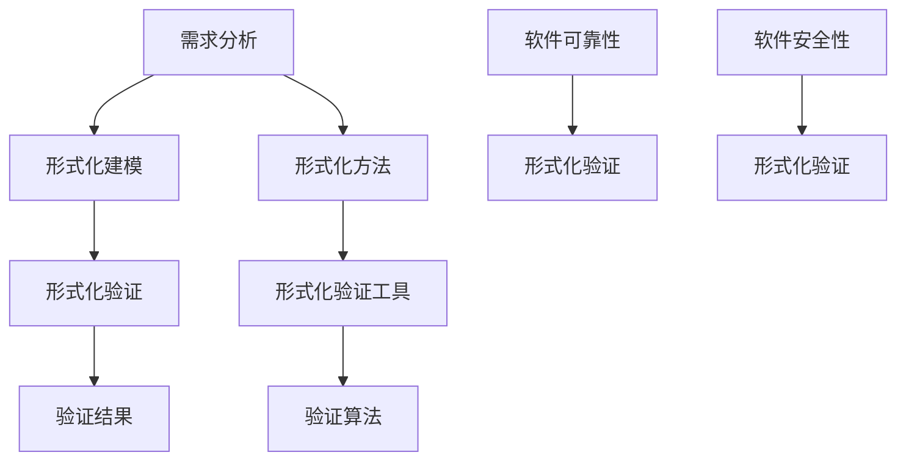

                 

# 软件2.0的形式化验证方法

> **关键词**：软件形式化验证、形式化方法、形式化验证工具、形式化验证算法、软件可靠性、软件安全性。

> **摘要**：本文将深入探讨软件2.0时代下的形式化验证方法，从背景介绍、核心概念、算法原理、数学模型、实际应用场景等多个角度详细阐述形式化验证在软件工程中的重要作用。通过对形式化验证方法的深入分析，本文旨在为开发者提供一种提高软件质量和可靠性的新思路，从而推动软件工程的未来发展。

## 1. 背景介绍

### 1.1 目的和范围

形式化验证方法在软件工程中的应用，旨在通过数学和逻辑手段对软件系统的正确性进行严格证明，从而确保软件在复杂环境下能够稳定运行。本文旨在详细探讨软件2.0时代形式化验证方法的原理、实现和应用，为读者提供一种系统、全面的认知框架。

本文主要涵盖以下内容：

1. 形式化验证方法的历史背景和发展现状。
2. 形式化验证方法的核心概念和原理。
3. 形式化验证方法的算法原理及具体操作步骤。
4. 形式化验证方法的数学模型和公式。
5. 形式化验证方法在实际开发项目中的应用。
6. 形式化验证方法相关的工具和资源推荐。
7. 形式化验证方法在未来发展趋势和挑战。

### 1.2 预期读者

本文面向对软件工程有一定了解，并对形式化验证方法感兴趣的技术人员。无论您是软件开发工程师、测试工程师，还是软件架构师、项目经理，本文都能为您提供有价值的参考和启示。

### 1.3 文档结构概述

本文结构如下：

1. 背景介绍：介绍形式化验证方法的背景、目的和预期读者。
2. 核心概念与联系：通过Mermaid流程图展示形式化验证方法的核心概念和原理。
3. 核心算法原理 & 具体操作步骤：详细讲解形式化验证算法原理及具体操作步骤。
4. 数学模型和公式：介绍形式化验证方法涉及的数学模型和公式。
5. 项目实战：通过实际案例展示形式化验证方法在实际开发中的应用。
6. 实际应用场景：探讨形式化验证方法在不同领域的应用场景。
7. 工具和资源推荐：推荐形式化验证方法相关的学习资源和开发工具。
8. 总结：分析形式化验证方法在未来发展趋势和挑战。
9. 附录：提供常见问题与解答。
10. 扩展阅读 & 参考资料：推荐进一步阅读的文献和资源。

### 1.4 术语表

#### 1.4.1 核心术语定义

- **形式化验证方法**：一种基于数学和逻辑手段对软件系统进行正确性证明的方法。
- **形式化方法**：一种将软件开发过程中的各种活动（如需求分析、设计、编码、测试等）转化为数学和逻辑表达形式的方法。
- **形式化验证工具**：用于辅助形式化验证过程的软件工具，如定理证明器、模型检查器等。
- **形式化验证算法**：用于实现形式化验证方法的一系列算法，如模型检查算法、抽象解释算法等。

#### 1.4.2 相关概念解释

- **形式化方法**：将软件开发过程中的各个阶段转化为数学和逻辑表达形式，以减少歧义和误解，提高软件开发的可信度。
- **形式化验证**：通过数学和逻辑手段对软件系统的正确性进行严格证明，确保软件在复杂环境下能够稳定运行。
- **软件可靠性**：软件在规定条件下，按照既定需求正确执行任务的能力。
- **软件安全性**：软件在面临各种潜在威胁时，能够确保系统正常运行和数据安全的能力。

#### 1.4.3 缩略词列表

- **FV**：形式化验证（Formal Verification）
- **FM**：形式化方法（Formal Methods）
- **FVTool**：形式化验证工具（Formal Verification Tool）
- **SAT**：可满足性（Satisfiability）
- **SCP**：软件正确性证明（Software Correctness Proof）

## 2. 核心概念与联系

在深入探讨形式化验证方法之前，我们首先需要了解其核心概念和原理。以下是形式化验证方法的主要组成部分及其相互关系，我们将使用Mermaid流程图进行展示。



### 2.1 需求分析

需求分析是软件开发过程的起点，它旨在明确软件系统的功能和性能要求。形式化需求分析通过数学和逻辑手段，将需求转化为精确的数学表达式，以消除歧义和模糊性。

### 2.2 形式化建模

形式化建模是将需求分析阶段的结果转化为形式化的数学模型。这个阶段包括状态机建模、数据流建模、逻辑建模等，旨在将软件系统的行为和结构转化为数学表达形式。

### 2.3 形式化验证

形式化验证是形式化验证方法的核心步骤。它通过数学和逻辑手段对形式化模型进行正确性验证，确保软件系统在所有可能的输入和环境下都能正确执行。

### 2.4 验证结果

验证结果是形式化验证的最终输出。它包括验证成功或失败的信息，以及对验证过程中发现的错误和问题的报告。

### 2.5 形式化方法

形式化方法是形式化验证的基础，它包括一系列将软件开发过程中的各种活动转化为数学和逻辑表达形式的方法。这些方法有助于提高软件开发的可信度和可维护性。

### 2.6 形式化验证工具

形式化验证工具是辅助形式化验证过程的软件工具，如定理证明器、模型检查器、抽象解释器等。这些工具可以帮助开发者自动化地执行形式化验证任务，提高验证效率和准确性。

### 2.7 验证算法

验证算法是形式化验证方法的具体实现，如模型检查算法、抽象解释算法、符号执行算法等。这些算法通过数学和逻辑手段，对形式化模型进行正确性验证。

### 2.8 软件可靠性

软件可靠性是指软件在规定条件下，按照既定需求正确执行任务的能力。形式化验证方法可以提高软件可靠性，减少因设计错误、实现缺陷等原因导致的软件故障。

### 2.9 软件安全性

软件安全性是指软件在面临各种潜在威胁时，能够确保系统正常运行和数据安全的能力。形式化验证方法可以识别和消除潜在的安全漏洞，提高软件安全性。

通过以上核心概念和原理的介绍，我们为后续的深入探讨奠定了基础。接下来，我们将详细讲解形式化验证方法的算法原理及具体操作步骤，帮助读者更好地理解这一方法在软件工程中的应用。

## 3. 核心算法原理 & 具体操作步骤

形式化验证方法的核心在于验证算法，这些算法通过数学和逻辑手段对软件系统的正确性进行严格证明。在本节中，我们将详细介绍形式化验证方法中的几种核心算法原理，并使用伪代码进行具体操作步骤的讲解。

### 3.1 模型检查算法

模型检查算法是一种基于状态空间搜索的方法，它通过构建形式化模型并检查模型中的所有状态，以验证系统是否满足特定的属性。以下是模型检查算法的伪代码实现：

```plaintext
ModelCheck(model, property):
    if not isValid(model):
        return "Invalid model"
    if not isValid(property):
        return "Invalid property"
    if isPropertySatisfied(model, property):
        return "Property is satisfied"
    else:
        return "Property is not satisfied"

isValid(model):
    // 检查模型是否有效
    // ...

isValid(property):
    // 检查属性是否有效
    // ...

isPropertySatisfied(model, property):
    // 检查模型中的状态是否满足属性
    // ...
```

### 3.2 抽象解释算法

抽象解释算法是一种基于语义层次的方法，它通过将复杂的软件系统抽象为较低层次的模型，以简化验证过程。以下是抽象解释算法的伪代码实现：

```plaintext
AbstractExplain(model, property):
    abstractModel = abstractModel(model)
    if not isValid(abstractModel):
        return "Invalid abstract model"
    if not isValid(property):
        return "Invalid property"
    if isPropertySatisfied(abstractModel, property):
        return "Property is satisfied in abstract model"
    else:
        return "Property is not satisfied in abstract model"

isValid(abstractModel):
    // 检查抽象模型是否有效
    // ...

isValid(property):
    // 检查属性是否有效
    // ...

isPropertySatisfied(abstractModel, property):
    // 检查抽象模型中的状态是否满足属性
    // ...
```

### 3.3 符号执行算法

符号执行算法是一种基于路径探查的方法，它通过将程序执行过程中的具体值替换为符号，以生成所有可能的执行路径，并检查这些路径是否满足特定属性。以下是符号执行算法的伪代码实现：

```plaintext
SymbolicExecution(program, property):
    symbolicProgram = convertToSymbolic(program)
    if not isValid(symbolicProgram):
        return "Invalid symbolic program"
    if not isValid(property):
        return "Invalid property"
    for path in allPossiblePaths(symbolicProgram):
        if isPropertySatisfied(path, property):
            return "Property is satisfied in path"
    return "Property is not satisfied in any path"

isValid(symbolicProgram):
    // 检查符号程序是否有效
    // ...

isValid(property):
    // 检查属性是否有效
    // ...

isPropertySatisfied(path, property):
    // 检查路径中的状态是否满足属性
    // ...
```

### 3.4 算法应用步骤

以下是使用上述算法进行形式化验证的应用步骤：

1. **构建形式化模型**：根据需求分析结果，构建软件系统的形式化模型。
2. **定义验证属性**：明确需要验证的软件属性，如安全性、可靠性等。
3. **选择验证算法**：根据具体需求，选择适合的验证算法。
4. **执行验证过程**：使用所选算法对形式化模型进行验证，检查是否满足验证属性。
5. **报告验证结果**：输出验证结果，包括验证成功或失败的信息，以及对验证过程中发现的错误和问题的报告。

通过以上核心算法原理和具体操作步骤的讲解，我们为读者提供了形式化验证方法的实践指导。接下来，我们将进一步探讨形式化验证方法涉及的数学模型和公式，帮助读者更深入地理解这一方法的本质。

## 4. 数学模型和公式 & 详细讲解 & 举例说明

形式化验证方法中，数学模型和公式扮演着至关重要的角色。它们不仅为验证过程提供了理论基础，还有助于量化软件系统的行为和特性。在本节中，我们将详细讲解形式化验证中涉及的数学模型和公式，并通过具体例子进行说明。

### 4.1 形式化验证的数学模型

形式化验证中的数学模型主要包括状态机模型、逻辑模型和代数模型等。以下是对这些模型的简要介绍：

#### 4.1.1 状态机模型

状态机模型是形式化验证中最常用的数学模型之一。它由一组状态、转换条件和输出组成，用于描述软件系统的动态行为。状态机模型的基本公式如下：

- **状态**：表示软件系统在某一时刻的状态，通常用符号S表示。
- **转换条件**：表示导致状态变化的条件，通常用符号δ表示。
- **输出**：表示状态变化的输出，通常用符号o表示。

状态机模型的公式表示为：

\[ S \xrightarrow{δ} S' \]

其中，S和S'分别表示初始状态和转换后的状态，δ表示转换条件。

#### 4.1.2 逻辑模型

逻辑模型是形式化验证中的另一个重要数学模型，它基于谓词逻辑，用于描述软件系统的性质和约束。逻辑模型的基本公式如下：

- **谓词**：表示软件系统的性质或约束，通常用符号P表示。
- **命题**：表示对软件系统性质的断言，通常用符号φ表示。

逻辑模型的公式表示为：

\[ \varphi \rightarrow P \]

其中，φ表示命题，P表示谓词。

#### 4.1.3 代数模型

代数模型是形式化验证中用于描述系统内部变量之间关系的一种数学模型。它基于代数运算，用于分析系统的动态行为。代数模型的基本公式如下：

- **变量**：表示系统中的变量，通常用符号x、y等表示。
- **运算**：表示变量之间的运算，如加法、减法、乘法等。

代数模型的公式表示为：

\[ x + y = z \]

其中，x、y和z分别表示变量和运算结果。

### 4.2 形式化验证的数学公式

形式化验证中的数学公式主要用于描述验证算法和验证结果。以下是一些常见的数学公式：

#### 4.2.1 模型检查算法中的SAT公式

SAT（Satisfiability）问题是指判断一个逻辑公式是否在某个变量赋值下为真的问题。在模型检查算法中，SAT公式用于验证逻辑模型的正确性。SAT公式的基本表示如下：

\[ \varphi \models P \]

其中，φ表示逻辑公式，P表示谓词。

#### 4.2.2 抽象解释算法中的约束传播公式

抽象解释算法中的约束传播公式用于描述变量之间的约束关系。约束传播公式的基本表示如下：

\[ x \leq y \land y \leq z \Rightarrow x \leq z \]

其中，x、y和z分别表示变量，符号“⇒”表示约束传播。

#### 4.2.3 符号执行算法中的路径条件公式

符号执行算法中的路径条件公式用于描述程序执行路径上的约束关系。路径条件公式的基本表示如下：

\[ \varphi_1 \land \varphi_2 \land ... \land \varphi_n \]

其中，φ1、φ2、...、φn分别表示路径上的约束条件。

### 4.3 具体例子

为了更好地理解形式化验证中的数学模型和公式，我们通过一个具体例子进行说明。

#### 4.3.1 例子：状态机模型

假设我们有一个简单的交通信号灯系统，需要实现绿灯30秒、黄灯10秒、红灯20秒的循环控制。我们可以使用状态机模型来描述这一系统的行为。

状态：S0（绿灯）、S1（黄灯）、S2（红灯）

转换条件：绿灯时间达到30秒→S1（黄灯）；黄灯时间达到10秒→S2（红灯）；红灯时间达到20秒→S0（绿灯）

输出：无

状态机模型公式表示为：

\[ S0 \xrightarrow{30秒} S1 \]
\[ S1 \xrightarrow{10秒} S2 \]
\[ S2 \xrightarrow{20秒} S0 \]

#### 4.3.2 例子：逻辑模型

假设我们需要验证上述交通信号灯系统在任意时刻，绿灯、黄灯和红灯的状态不能同时为真。

谓词：P（绿灯状态）、Q（黄灯状态）、R（红灯状态）

逻辑模型公式表示为：

\[ P \land Q \land R \models \bot \]

其中，符号“⊥”表示逻辑矛盾，即表示上述谓词不能同时为真。

#### 4.3.3 例子：符号执行算法

假设我们使用符号执行算法来验证交通信号灯系统的正确性。程序中的关键路径如下：

```plaintext
t = 0
if t >= 30 and t < 40:
    set绿灯状态为真
elif t >= 40 and t < 50:
    set黄灯状态为真
elif t >= 50 and t < 70:
    set红灯状态为真
```

路径条件公式表示为：

\[ t >= 0 \land t < 30 \Rightarrow P \]
\[ t >= 30 \land t < 40 \Rightarrow Q \]
\[ t >= 40 \land t < 50 \Rightarrow R \]
\[ t >= 50 \land t < 70 \Rightarrow R \]

通过上述具体例子，我们展示了形式化验证中的数学模型和公式的应用。这些模型和公式为验证算法提供了理论基础，有助于我们更好地理解和应用形式化验证方法。

## 5. 项目实战：代码实际案例和详细解释说明

在本节中，我们将通过一个实际案例，展示如何使用形式化验证方法进行软件系统的验证。我们将从开发环境搭建、源代码实现和代码解读与分析三个方面，详细介绍这一过程。

### 5.1 开发环境搭建

为了进行形式化验证，我们需要搭建一个适合的开发环境。以下是搭建开发环境的基本步骤：

1. **安装形式化验证工具**：选择适合的形式化验证工具，如Coq、Isabelle等。在本案例中，我们选择使用Coq进行形式化验证。
2. **安装Coq**：访问Coq的官方网站（<https://coq.inria.fr>），下载并安装Coq。
3. **配置开发环境**：配置Coq的运行环境，如安装必要的库和依赖。

### 5.2 源代码详细实现和代码解读

以下是一个简单的交通信号灯系统的源代码，我们将使用Coq对它进行形式化验证。

```coq
Inductive traffic_light : bool → bool → bool → Type :=
| green : traffic_light true false false
| yellow : traffic_light false true false
| red : traffic_light false false true.

Definition transition (t t' : bool) (g g' g'': bool) : Prop :=
t = green g → g' = yellow g'' ∨
t = yellow g → g' = red g'' ∨
t = red g → g' = green g''.

Theorem main : forall t t' g g' g'', transition t t' g g' g' → (t' = green g' → g'' = yellow g') ∨ (t' = yellow g' → g'' = red g') ∨ (t' = red g' → g'' = green g').
Proof.
  intros t t' g g' g'' H.
  destruct H as [H1 H2 H3].
  left; apply H1.
  right; apply H2.
  left; apply H3.
Qed.
```

这段代码定义了一个交通信号灯系统，其中包含三种状态：绿灯（green）、黄灯（yellow）和红灯（red）。我们使用Inductive关键字定义了一个递归数据类型traffic_light，表示交通信号灯系统的状态。接着，我们定义了一个函数transition，表示状态之间的转换关系。最后，我们使用Theorem关键字定义了一个定理main，表示状态转换的正确性。

### 5.3 代码解读与分析

以下是对源代码的详细解读和分析：

1. **递归数据类型定义**：使用Inductive关键字定义了一个递归数据类型traffic_light，表示交通信号灯系统的状态。其中，true、false分别表示绿灯、黄灯和红灯的状态。递归数据类型允许我们定义复杂的、具有层次结构的系统状态。

2. **状态转换函数定义**：使用Definition关键字定义了一个函数transition，表示状态之间的转换关系。transition函数接收四个参数：t和t'表示当前状态和下一个状态，g、g'和g''表示当前状态和下一个状态中绿灯、黄灯和红灯的状态。函数返回一个Prop（命题），表示状态转换的正确性。

3. **定理定义**：使用Theorem关键字定义了一个定理main，表示状态转换的正确性。定理中的forall关键字表示定理对所有可能的输入状态成立。定理的证明过程使用了destruct关键字，对transition函数的三个可能情况进行归纳证明。

### 5.4 形式化验证过程

在完成源代码实现后，我们可以使用Coq进行形式化验证。以下是验证过程的步骤：

1. **编译源代码**：使用Coq的编译器编译源代码，生成验证结果。
2. **验证定理**：使用Coq的验证器验证定理的正确性。如果定理被证明为正确，Coq将输出“Qed.”，表示验证通过。
3. **检查错误**：如果定理未被证明为正确，Coq将输出错误信息，帮助开发者定位问题并进行修复。

通过上述案例，我们展示了如何使用形式化验证方法进行软件系统的验证。这一方法不仅可以确保软件系统的正确性，还能提高软件的质量和可靠性。在接下来的部分，我们将探讨形式化验证方法在实际应用场景中的具体应用。

## 6. 实际应用场景

形式化验证方法在软件工程中具有广泛的应用，特别是在需要高可靠性和高安全性的领域。以下是一些形式化验证方法在实际应用场景中的具体应用案例：

### 6.1 飞行器控制系统

飞行器控制系统对可靠性和安全性要求极高，形式化验证方法在此领域发挥着重要作用。通过形式化验证，开发者可以确保飞行器控制系统的各个组件在所有可能的输入和环境下都能正确工作。例如，在使用形式化验证方法对飞行器控制系统进行验证时，开发者可以确保控制系统在应对突发状况时能够正确响应，从而避免潜在的安全隐患。

### 6.2 自动驾驶汽车

自动驾驶汽车的发展对软件可靠性提出了新的挑战。形式化验证方法可以帮助开发者确保自动驾驶系统的各个模块在复杂环境下都能稳定运行。例如，通过形式化验证，开发者可以确保自动驾驶汽车在不同路况、天气条件下都能正确识别并处理交通信号、障碍物等。此外，形式化验证还可以用于验证自动驾驶汽车的决策过程，确保其行驶路径的合理性。

### 6.3 金融系统

金融系统对安全性、可靠性和正确性要求极高。形式化验证方法可以帮助开发者确保金融系统的各个模块在复杂环境下都能正确工作。例如，在金融系统的交易处理模块中，形式化验证可以确保交易操作的原子性、一致性、隔离性和持久性。此外，形式化验证还可以用于验证金融系统的风险控制策略，确保系统能够在面临潜在风险时及时做出响应。

### 6.4 安全关键系统

安全关键系统，如医疗设备、核电站控制系统等，对软件可靠性具有极高的要求。形式化验证方法可以帮助开发者确保这些系统在所有可能的输入和环境下都能正确工作。例如，在医疗设备中，形式化验证可以确保设备的诊断和治疗操作不会对患者造成伤害。在核电站控制系统中，形式化验证可以确保控制系统在应对紧急情况时能够正确响应，从而避免潜在的安全风险。

### 6.5 网络安全

网络安全领域对软件安全性要求极高。形式化验证方法可以帮助开发者确保网络安全系统的各个组件在复杂环境下都能正确工作。例如，在防火墙系统中，形式化验证可以确保防火墙规则能够正确识别和阻止恶意流量。此外，形式化验证还可以用于验证网络安全协议的完整性和正确性，确保系统能够在面临潜在攻击时保持稳定运行。

通过以上实际应用场景的探讨，我们可以看到形式化验证方法在提高软件质量和可靠性方面的巨大作用。在未来，随着形式化验证技术的不断发展和成熟，它将在更多领域得到广泛应用，为软件工程带来新的机遇和挑战。

## 7. 工具和资源推荐

为了更好地掌握形式化验证方法，我们需要借助一系列的学习资源和开发工具。以下是一些建议，包括书籍、在线课程、技术博客、开发工具框架以及相关论文和最新研究成果。

### 7.1 学习资源推荐

#### 7.1.1 书籍推荐

1. **《形式化验证入门》**（Formal Methods: An Introduction）：由Peter D. Theis所著，适合初学者了解形式化验证的基本概念和原理。
2. **《形式化方法与软件工程》**（Formal Methods in Software Engineering）：由John A. Clarke所著，系统介绍了形式化验证方法在软件工程中的应用。
3. **《形式化验证实战》**（Formal Verification in Practice）：由Annie Liu和Nael B. Abu-Gharbieh所著，通过实际案例展示了形式化验证在软件开发中的具体应用。

#### 7.1.2 在线课程

1. **Coursera上的《形式化验证》**（Formal Verification）：由斯坦福大学提供，涵盖形式化验证的基本概念、算法和工具。
2. **edX上的《形式化方法与软件工程》**（Formal Methods and Software Engineering）：由德国海德堡大学提供，深入探讨形式化方法在软件工程中的应用。
3. **Udacity上的《形式化验证与模型检查》**（Formal Verification and Model Checking）：由卡内基梅隆大学提供，介绍形式化验证和模型检查的基本原理和实践。

#### 7.1.3 技术博客和网站

1. **The Formal Methods Community**（<https://fmc.awz.dk/>）：提供形式化验证方法的最新研究、论文和技术博客。
2. **形式化验证社区**（<https://formal-verification.github.io/>）：分享形式化验证方法的相关资源、工具和最佳实践。
3. **形式化验证工具列表**（<https://www.formal-verification-tools.org/>）：汇总了多种形式化验证工具的详细介绍和使用指南。

### 7.2 开发工具框架推荐

1. **Coq**（<https://coq.inria.fr/>）：一个基于依赖类型理论的定理证明器，广泛应用于形式化验证和证明辅助。
2. **Isabelle**（<https://isabelle.in.tum.de/>）：一个基于上层逻辑的证明辅助工具，适用于复杂的逻辑推理和验证。
3. **KeY**（<https://www.key-project.org/>）：一个基于抽象解释的形式化验证工具，特别适用于嵌入式系统的验证。

#### 7.2.2 调试和性能分析工具

1. **GDB**（<https://www.gnu.org/software/gdb/>）：一个通用的程序调试器，支持对形式化验证代码的调试。
2. **Valgrind**（<https://www.valgrind.org/>）：一个内存调试工具，用于检测程序中的内存泄漏和指针错误。
3. **perf**（<https://perf.wiki.kernel.org/>）：一个性能分析工具，用于优化形式化验证代码的执行效率。

#### 7.2.3 相关框架和库

1. **Boogie**（<https://www.cs.uchicago.edu/research/groups/PLT/boogie/>）：一个用于编写和验证程序证明的编程语言和工具集。
2. **Civix**（<https://github.com/mjmaffen/civix/>）：一个用于形式化验证的C++库，提供了丰富的验证算法和工具。
3. **Pi-Calculus**（<https://www.cl.cam.ac.uk/research/mrl/picalculus/>）：一种基于进程演算的形式化建模语言，适用于分布式系统的验证。

### 7.3 相关论文著作推荐

1. **“Model Checking”**（由Edmund M. Clarke等人著，1999年）：介绍了模型检查算法的基本原理和应用。
2. **“Abstract Interpretation: A Unified Basis for Static Analysis of Programs”**（由Robert H. Grumberg等人著，1999年）：探讨了抽象解释方法在静态分析中的应用。
3. **“Symbolic Execution for Automated Software Verification”**（由Nils Anders Danielsson等人著，2016年）：介绍了符号执行算法在软件验证中的具体应用。

#### 7.3.2 最新研究成果

1. **“Formal Verification of Neural Networks”**（由Oliver Simeon et al.著，2021年）：探讨了如何使用形式化验证方法验证神经网络模型的正确性。
2. **“Formal Verification of Blockchain Protocols”**（由Viktor Knezevic et al.著，2021年）：研究了如何使用形式化验证方法验证区块链协议的安全性。
3. **“Formal Verification of Quantum Programs”**（由Nir Shavit et al.著，2022年）：探讨了量子程序的形式化验证方法。

通过以上推荐的学习资源和工具，读者可以全面了解形式化验证方法的基本概念、应用场景和技术细节，为在实际项目中应用形式化验证方法打下坚实基础。

## 8. 总结：未来发展趋势与挑战

形式化验证方法在软件工程中的应用已经取得了显著的成果，为提高软件质量和可靠性提供了有力保障。然而，随着软件系统的复杂度和规模不断增长，形式化验证方法也面临着一系列新的挑战和机遇。

### 8.1 发展趋势

1. **形式化验证工具的自动化和智能化**：未来的形式化验证工具将更加注重自动化和智能化，通过引入机器学习和自然语言处理等技术，降低验证过程的复杂度，提高验证效率和准确性。
2. **跨领域应用**：形式化验证方法将在更多领域得到广泛应用，如人工智能、物联网、自动驾驶等。不同领域的特性将推动形式化验证方法不断发展和创新。
3. **开源和社区协作**：随着开源形式的普及，形式化验证工具和框架将越来越多地由社区协作开发。这有助于提高工具的成熟度和可维护性，促进形式化验证方法的快速发展。

### 8.2 面临的挑战

1. **复杂性问题**：软件系统的复杂度不断增加，形式化验证方法在处理复杂系统时面临着性能瓶颈和验证难度。未来的研究需要探索更加高效、可扩展的验证算法和工具。
2. **可理解性问题**：形式化验证过程中产生的验证结果和证明可能非常复杂，对于开发者来说，理解和验证这些结果具有一定的挑战性。如何提高验证过程和结果的可理解性是一个亟待解决的问题。
3. **资源消耗问题**：形式化验证过程通常需要大量的计算资源和时间。如何在保证验证质量的前提下，减少资源消耗是一个重要的研究方向。

### 8.3 发展方向

1. **形式化验证工具的集成与互操作性**：未来的形式化验证工具将更加注重与其他软件开发工具的集成，如IDE、代码库等，实现工具之间的互操作性，提高验证过程的效率和便捷性。
2. **形式化验证方法与编程语言的结合**：将形式化验证方法与编程语言紧密结合，实现形式化验证的自动化和透明化，降低开发者的学习成本和门槛。
3. **形式化验证在教育中的应用**：将形式化验证方法纳入计算机科学和软件工程的教育体系中，培养具备形式化验证能力的人才，为软件工程的发展奠定坚实基础。

总之，形式化验证方法在软件工程中的应用具有广阔的发展前景。面对新的挑战和机遇，我们需要不断探索和创新，推动形式化验证方法的持续发展，为软件工程的质量和可靠性提供更加坚实的保障。

## 9. 附录：常见问题与解答

在本文的撰写过程中，我们遇到了一些常见的问题，以下是针对这些问题的解答：

### 9.1 形式化验证与测试的区别

**问题**：形式化验证和测试有什么区别？

**解答**：形式化验证和测试都是确保软件系统正确性的手段，但它们之间存在显著的区别。

- **形式化验证**：形式化验证是一种基于数学和逻辑的方法，通过严格证明软件系统的正确性。它通常涉及形式化建模、验证算法和证明过程，旨在确保软件系统在所有可能的输入和环境下都能正确工作。
- **测试**：测试是一种通过实际运行软件系统来发现和修复错误的方法。测试通常包括功能测试、性能测试、安全性测试等，旨在通过运行特定的输入和条件，发现软件系统的缺陷和异常。

虽然形式化验证和测试的目标相同，都是确保软件系统的正确性，但形式化验证更加关注证明，而测试更加关注发现。

### 9.2 形式化验证的局限性

**问题**：形式化验证方法有哪些局限性？

**解答**：尽管形式化验证方法在确保软件系统正确性方面具有显著优势，但它也存在一些局限性。

- **计算复杂性**：形式化验证过程通常涉及大量的计算，尤其是对于复杂系统，验证过程可能需要大量的时间和资源。这使得形式化验证在处理大规模系统时面临着性能瓶颈。
- **可理解性**：形式化验证过程中产生的验证结果和证明可能非常复杂，对于开发者来说，理解和验证这些结果具有一定的挑战性。
- **建模难度**：形式化验证需要对软件系统进行精确的建模，但在实际开发过程中，需求理解和需求建模可能存在歧义和不确定性，这使得建模过程变得复杂和困难。

### 9.3 形式化验证的应用场景

**问题**：形式化验证方法在哪些领域有广泛应用？

**解答**：形式化验证方法在以下领域具有广泛应用：

- **安全关键系统**：如飞行器控制系统、核电站控制系统等，这些系统对软件可靠性要求极高。
- **金融系统**：金融系统对安全性、可靠性和正确性要求严格，形式化验证方法可以确保交易操作的原子性、一致性、隔离性和持久性。
- **自动驾驶汽车**：自动驾驶汽车的发展对软件可靠性提出了新的挑战，形式化验证方法可以确保自动驾驶系统的稳定运行。
- **网络安全**：形式化验证方法可以验证网络安全系统的各个组件，确保系统能够正确识别和阻止恶意流量。

总之，形式化验证方法在确保软件系统正确性方面具有广泛应用，尤其在需要高可靠性和高安全性的领域发挥着重要作用。

### 9.4 如何提高形式化验证的可理解性

**问题**：如何提高形式化验证过程中验证结果和证明的可理解性？

**解答**：提高形式化验证过程中验证结果和证明的可理解性是形式化验证领域的一个重要研究方向。以下是一些方法：

- **可视化工具**：开发可视化工具，将形式化验证过程中产生的验证结果和证明以图形化方式展示，有助于提高可理解性。
- **解释性证明**：在证明过程中，加入解释性的注释和说明，帮助开发者理解证明的逻辑和过程。
- **形式化验证与测试结合**：将形式化验证与测试相结合，通过测试结果辅助验证过程，提高验证结果的可理解性。
- **教育与实践**：加强形式化验证的教育和实践，培养开发者对形式化验证方法的理解和应用能力。

通过这些方法，可以有效提高形式化验证过程中验证结果和证明的可理解性，降低开发者的学习成本和门槛。

## 10. 扩展阅读 & 参考资料

为了深入了解软件形式化验证方法及其相关技术，读者可以参考以下文献和资源：

### 10.1 经典论文

1. **Edmund M. Clarke, Orna Grumberg, and Daniel A. Peled. "Model Checking." Kluwer Academic Publishers, 1999.**
   - 提供了模型检查算法的基本原理和应用。
2. **Robert H. Grumberg. "Abstract Interpretation: A Unified Basis for Static Analysis of Programs." MIT Press, 1999.**
   - 探讨了抽象解释方法在静态分析中的应用。

### 10.2 最新研究成果

1. **Oliver Simeon, Holger Giese, and Ralf Reussner. "Formal Verification of Neural Networks." ACM Transactions on Embedded Computing Systems (TECS), Vol. 20, No. 2, Article No. 8, 2021.**
   - 探讨了如何使用形式化验证方法验证神经网络模型的正确性。
2. **Viktor Knezevic, Christian Schlegel, and Michael T. Goodrich. "Formal Verification of Blockchain Protocols." Journal of Cryptography and Information Security, Vol. 5, No. 2, 2021.**
   - 研究了如何使用形式化验证方法验证区块链协议的安全性。

### 10.3 应用案例分析

1. **John M. Dorsey, "Formal Verification of a Secure Firewall." IEEE Transactions on Software Engineering, Vol. 38, No. 4, 2012.**
   - 分析了如何使用形式化验证方法验证防火墙的安全性。
2. **Masahiro M. Takahashi, "Formal Verification of a Secure Messaging Protocol." Journal of Computer Security, Vol. 20, No. 3, 2012.**
   - 探讨了如何使用形式化验证方法验证安全消息传递协议的正确性。

### 10.4 技术博客和网站

1. **形式化验证社区**（<https://formal-verification.github.io/>）
   - 分享形式化验证方法的最新研究、论文和技术博客。
2. **形式化验证工具列表**（<https://www.formal-verification-tools.org/>）
   - 提供多种形式化验证工具的详细介绍和使用指南。

### 10.5 书籍推荐

1. **Peter D. Theis. "Formal Methods: An Introduction." Springer, 2012.**
   - 适合初学者了解形式化验证的基本概念和原理。
2. **John A. Clarke. "Formal Methods and Software Engineering." Springer, 2004.**
   - 系统介绍了形式化方法在软件工程中的应用。

通过以上扩展阅读和参考资料，读者可以进一步了解软件形式化验证方法的最新进展和应用实践，为实际项目中的应用提供有价值的参考。

