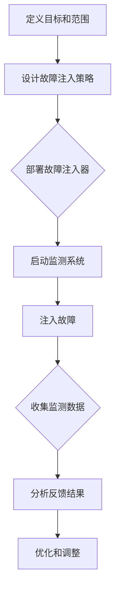

                 

# 软件2.0的混沌工程实践

> **关键词**：软件2.0、混沌工程、实践、可靠性、自动化、监测、故障注入、反馈循环、持续交付
> 
> **摘要**：本文将深入探讨软件2.0时代的混沌工程实践。混沌工程是一种通过主动引入故障来提升系统可靠性和韧性的方法。本文将详细讲解混沌工程的核心概念、算法原理、数学模型、项目实战，以及其在实际应用场景中的价值。同时，本文还将推荐相关的学习资源、开发工具和论文著作，以便读者更全面地了解和掌握这一技术。

## 1. 背景介绍

### 1.1 目的和范围

本文旨在向读者介绍软件2.0时代的混沌工程实践，帮助读者理解混沌工程的核心概念、应用场景和具体操作步骤。通过本文的阅读，读者将能够：

- 理解混沌工程的基本原理和重要性
- 掌握混沌工程的核心算法和数学模型
- 掌握混沌工程在实际项目中的应用和实现方法
- 获取混沌工程领域的关键学习资源和研究成果

### 1.2 预期读者

本文的预期读者包括以下几类：

- 对软件可靠性、故障注入和系统测试感兴趣的程序员和测试工程师
- 涉足持续交付和自动化运维的开发人员和运维人员
- 对混沌工程感兴趣的研究人员和学生
- 想要提升系统可靠性和韧性的项目经理和CTO

### 1.3 文档结构概述

本文分为以下十个部分：

1. 背景介绍
2. 核心概念与联系
3. 核心算法原理 & 具体操作步骤
4. 数学模型和公式 & 详细讲解 & 举例说明
5. 项目实战：代码实际案例和详细解释说明
6. 实际应用场景
7. 工具和资源推荐
8. 总结：未来发展趋势与挑战
9. 附录：常见问题与解答
10. 扩展阅读 & 参考资料

### 1.4 术语表

#### 1.4.1 核心术语定义

- **软件2.0**：软件2.0是指面向用户和业务需求的软件开发模式，强调快速迭代、持续交付和高度可定制化。
- **混沌工程**：混沌工程是一种通过主动引入故障来提升系统可靠性和韧性的方法，其核心思想是“失败早、失败频繁、失败全面”。
- **故障注入**：故障注入是指将人工制造的故障引入到系统中，以测试和提升系统的可靠性和容错能力。
- **监测**：监测是指对系统运行状态进行实时监控，以便及时发现和解决问题。
- **反馈循环**：反馈循环是指将监测结果反馈给混沌工程平台，以便进行故障分析和优化。
- **持续交付**：持续交付是指通过自动化流程实现软件的持续集成、测试和部署。

#### 1.4.2 相关概念解释

- **系统可靠性**：系统可靠性是指系统在规定时间内、按照规定的性能要求正常运行的能力。
- **系统韧性**：系统韧性是指系统在面对故障、异常和不确定性时，能够快速恢复和适应的能力。
- **自动化**：自动化是指通过软件工具和流程实现系统操作的自动化，以提高效率和质量。
- **持续集成**：持续集成是指通过自动化构建和测试，将代码更改合并到主分支，以确保代码质量。

#### 1.4.3 缩略词列表

- **SRE**：Site Reliability Engineering（站点可靠性工程）
- **CI/CD**：Continuous Integration/Continuous Deployment（持续集成/持续部署）
- **Kubernetes**：一个开源的容器编排平台，用于自动化部署、扩展和管理容器化应用。
- **Docker**：一个开源的应用容器引擎，用于打包、交付和运行应用。

## 2. 核心概念与联系

### 2.1 混沌工程的核心概念

混沌工程的核心概念包括：

- **故障注入**：通过引入故障，测试和提升系统的可靠性和韧性。
- **监测**：实时监控系统的运行状态，以便及时发现和解决问题。
- **反馈循环**：将监测结果反馈给混沌工程平台，以便进行故障分析和优化。
- **持续交付**：通过自动化流程实现软件的持续集成、测试和部署，确保系统稳定性。

### 2.2 混沌工程的架构

混沌工程的架构包括以下几个部分：

1. **故障注入器**：用于生成和注入故障。
2. **监测系统**：用于实时监控系统的运行状态。
3. **反馈系统**：用于将监测结果反馈给故障注入器。
4. **混沌工程平台**：用于管理故障注入、监测和反馈循环。

### 2.3 混沌工程的流程

混沌工程的流程包括以下几个步骤：

1. **定义目标和范围**：确定需要测试的系统模块和故障类型。
2. **设计故障注入策略**：根据目标和范围，设计合适的故障注入策略。
3. **部署故障注入器**：将故障注入器部署到测试环境中。
4. **启动监测系统**：实时监控系统的运行状态。
5. **注入故障**：按照设计的策略，主动引入故障。
6. **收集监测数据**：收集故障注入过程中的监测数据。
7. **分析反馈结果**：对监测数据进行分析，评估系统的可靠性和韧性。
8. **优化和调整**：根据分析结果，对故障注入策略进行调整和优化。

### 2.4 混沌工程的Mermaid流程图

以下是一个简单的Mermaid流程图，展示了混沌工程的架构和流程：



## 3. 核心算法原理 & 具体操作步骤

### 3.1 混沌工程的核心算法原理

混沌工程的核心算法原理主要涉及以下几个方面：

- **故障生成**：通过随机生成或根据业务场景定制故障。
- **故障注入**：将生成的故障注入到系统中。
- **故障监测**：实时监控系统的运行状态，检测故障是否发生。
- **故障分析**：对监测结果进行分析，评估系统的可靠性和韧性。

### 3.2 具体操作步骤

#### 3.2.1 设计故障注入策略

设计故障注入策略是混沌工程的关键步骤。以下是一些常用的故障注入策略：

- **随机故障注入**：随机生成故障，以测试系统的容错能力。
- **按场景故障注入**：根据业务场景定制故障，以测试系统在特定场景下的可靠性。
- **按重要性故障注入**：优先注入关键模块的故障，以测试系统的关键功能。

#### 3.2.2 部署故障注入器

部署故障注入器是将故障注入策略应用到实际系统中的关键步骤。以下是一个简单的部署过程：

1. **选择故障注入器**：根据系统需求和故障注入策略，选择合适的故障注入器。
2. **配置故障注入器**：配置故障注入器的参数，如故障类型、注入频率等。
3. **部署故障注入器**：将故障注入器部署到测试环境中。

#### 3.2.3 启动监测系统

启动监测系统是实时监控系统运行状态的关键步骤。以下是一个简单的监测系统启动过程：

1. **选择监测工具**：根据系统需求和故障注入策略，选择合适的监测工具。
2. **配置监测工具**：配置监测工具的参数，如监测指标、报警阈值等。
3. **启动监测系统**：启动监测工具，开始实时监控系统的运行状态。

#### 3.2.4 注入故障

注入故障是将故障注入策略应用到实际系统中的关键步骤。以下是一个简单的故障注入过程：

1. **生成故障**：根据故障注入策略，生成故障。
2. **注入故障**：将故障注入到系统中。
3. **记录故障信息**：记录故障注入的时间、故障类型、注入位置等信息。

#### 3.2.5 收集监测数据

收集监测数据是分析故障影响和系统可靠性的关键步骤。以下是一个简单的数据收集过程：

1. **收集实时数据**：实时收集系统的运行状态数据。
2. **存储数据**：将收集到的数据存储到数据库或日志文件中。
3. **分析数据**：对收集到的数据进行统计分析，评估系统的可靠性和韧性。

#### 3.2.6 分析反馈结果

分析反馈结果是优化故障注入策略和提升系统可靠性的关键步骤。以下是一个简单的反馈结果分析过程：

1. **分析故障影响**：分析故障注入对系统性能和稳定性的影响。
2. **优化故障注入策略**：根据分析结果，优化故障注入策略。
3. **调整系统配置**：根据分析结果，调整系统的配置参数，以提升系统的可靠性。

## 4. 数学模型和公式 & 详细讲解 & 举例说明

### 4.1 数学模型概述

混沌工程的数学模型主要包括以下几个方面：

- **故障生成模型**：用于生成随机故障或按场景定制故障。
- **故障注入模型**：用于计算故障注入的时间和位置。
- **故障监测模型**：用于计算故障发生的时间和位置。
- **故障分析模型**：用于分析故障对系统性能和稳定性的影响。

### 4.2 故障生成模型

故障生成模型的核心是随机生成故障或按场景定制故障。以下是一个简单的故障生成模型：

```latex
% 故障生成模型
 Fault_Generation_Model:
    Input:
        - System_State
        - Fault_Type
        - Random_Factor
    
    Output:
        - Fault_Instance
    
    Process:
        1. Calculate_Fault_Rate(Fault_Type)
        2. Generate_Random_Number(Random_Factor)
        3. If (Random_Factor < Fault_Rate):
            4. Create_Fault_Instance(Fault_Type, System_State)
        5. Else:
            6. Return NULL
```

### 4.3 故障注入模型

故障注入模型用于计算故障注入的时间和位置。以下是一个简单的故障注入模型：

```latex
% 故障注入模型
 Fault_Injection_Model:
    Input:
        - Fault_Instance
        - Injection_Frequency
    
    Output:
        - Injection_Time
        - Injection_Location
    
    Process:
        1. Calculate_Injection_Time(Injection_Frequency)
        2. Calculate_Injection_Location(Fault_Instance)
        3. Return Injection_Time, Injection_Location
```

### 4.4 故障监测模型

故障监测模型用于计算故障发生的时间和位置。以下是一个简单的故障监测模型：

```latex
% 故障监测模型
 Fault_Monitor_Model:
    Input:
        - System_State
        - Fault_Instance
    
    Output:
        - Fault_Detection_Time
        - Fault_Detection_Location
    
    Process:
        1. Monitor_System_State(System_State)
        2. If (System_State != Expected_State):
            3. Calculate_Fault_Detection_Time(System_State, Expected_State)
            4. Calculate_Fault_Detection_Location(Fault_Instance)
        5. Return Fault_Detection_Time, Fault_Detection_Location
```

### 4.5 故障分析模型

故障分析模型用于分析故障对系统性能和稳定性的影响。以下是一个简单的故障分析模型：

```latex
% 故障分析模型
 Fault_Analysis_Model:
    Input:
        - Fault_Instance
        - System_State
    
    Output:
        - Fault_Impact
    
    Process:
        1. Calculate_Performance_Metrics(System_State)
        2. Calculate_Resolver_Times(Fault_Instance)
        3. Calculate_Fault_Impact(Fault_Instance, Performance_Metrics, Resolver_Times)
        4. Return Fault_Impact
```

### 4.6 举例说明

假设我们有一个在线购物系统，需要通过混沌工程测试其可靠性。以下是一个简单的故障生成、注入和监测过程：

#### 4.6.1 故障生成

根据系统的运行状态和故障类型，生成一个随机故障：

```latex
Fault_Instance = Fault_Generation_Model(System_State, "Timeout", Random_Factor)
```

#### 4.6.2 故障注入

按照故障注入策略，将故障注入到系统中：

```latex
Injection_Time, Injection_Location = Fault_Injection_Model(Fault_Instance, Injection_Frequency)
```

#### 4.6.3 故障监测

实时监测系统的运行状态，检测故障是否发生：

```latex
Fault_Detection_Time, Fault_Detection_Location = Fault_Monitor_Model(System_State, Fault_Instance)
```

#### 4.6.4 故障分析

对故障注入后的系统状态进行分析，评估故障的影响：

```latex
Fault_Impact = Fault_Analysis_Model(Fault_Instance, System_State)
```

## 5. 项目实战：代码实际案例和详细解释说明

### 5.1 开发环境搭建

为了演示混沌工程在实际项目中的应用，我们选择一个简单的在线购物系统作为案例。以下是我们使用的开发环境：

- **操作系统**：Ubuntu 20.04
- **编程语言**：Python 3.8
- **框架和库**：Flask、Docker、Kubernetes、Prometheus

首先，我们需要安装必要的软件和工具：

```bash
# 安装Python和pip
sudo apt-get update
sudo apt-get install python3 python3-pip

# 安装Docker和Kubernetes
sudo apt-get install docker.io
sudo apt-get install kubelet kubeadm kubectl

# 安装Prometheus和Grafana
sudo apt-get install prometheus
sudo apt-get install grafana
```

### 5.2 源代码详细实现和代码解读

我们使用Flask框架搭建了一个简单的在线购物系统，其中包括商品管理、购物车和订单管理等功能。以下是系统的核心代码：

#### 5.2.1 商品管理

商品管理模块用于添加、删除和查询商品信息。以下是一个简单的商品管理API：

```python
from flask import Flask, jsonify, request

app = Flask(__name__)

# 商品列表
products = [
    {"id": 1, "name": "iPhone 12", "price": 799},
    {"id": 2, "name": "Samsung Galaxy S21", "price": 999},
]

@app.route('/products', methods=['GET', 'POST'])
def products_endpoint():
    if request.method == 'GET':
        return jsonify(products)
    elif request.method == 'POST':
        new_product = request.json
        products.append(new_product)
        return jsonify({"message": "Product added successfully"}), 201

@app.route('/products/<int:product_id>', methods=['GET', 'DELETE'])
def product_endpoint(product_id):
    if request.method == 'GET':
        product = next((p for p in products if p['id'] == product_id), None)
        if product:
            return jsonify(product)
        else:
            return jsonify({"error": "Product not found"}), 404
    elif request.method == 'DELETE':
        global products
        products = [p for p in products if p['id'] != product_id]
        return jsonify({"message": "Product deleted successfully"}), 200

if __name__ == '__main__':
    app.run(debug=True)
```

#### 5.2.2 购物车管理

购物车管理模块用于添加、删除和查询购物车信息。以下是一个简单的购物车管理API：

```python
from flask import Flask, jsonify, request

app = Flask(__name__)

# 购物车列表
carts = [
    {"id": 1, "user_id": 1, "products": [{"id": 1, "quantity": 2}, {"id": 2, "quantity": 1}]}
]

@app.route('/carts', methods=['GET', 'POST'])
def carts_endpoint():
    if request.method == 'GET':
        return jsonify(carts)
    elif request.method == 'POST':
        new_cart = request.json
        carts.append(new_cart)
        return jsonify({"message": "Cart added successfully"}), 201

@app.route('/carts/<int:cart_id>', methods=['GET', 'DELETE'])
def cart_endpoint(cart_id):
    if request.method == 'GET':
        cart = next((c for c in carts if c['id'] == cart_id), None)
        if cart:
            return jsonify(cart)
        else:
            return jsonify({"error": "Cart not found"}), 404
    elif request.method == 'DELETE':
        global carts
        carts = [c for c in carts if c['id'] != cart_id]
        return jsonify({"message": "Cart deleted successfully"}), 200

if __name__ == '__main__':
    app.run(debug=True)
```

#### 5.2.3 订单管理

订单管理模块用于创建、删除和查询订单信息。以下是一个简单的订单管理API：

```python
from flask import Flask, jsonify, request

app = Flask(__name__)

# 订单列表
orders = [
    {"id": 1, "user_id": 1, "cart_id": 1, "total": 1598}
]

@app.route('/orders', methods=['GET', 'POST'])
def orders_endpoint():
    if request.method == 'GET':
        return jsonify(orders)
    elif request.method == 'POST':
        new_order = request.json
        orders.append(new_order)
        return jsonify({"message": "Order created successfully"}), 201

@app.route('/orders/<int:order_id>', methods=['GET', 'DELETE'])
def order_endpoint(order_id):
    if request.method == 'GET':
        order = next((o for o in orders if o['id'] == order_id), None)
        if order:
            return jsonify(order)
        else:
            return jsonify({"error": "Order not found"}), 404
    elif request.method == 'DELETE':
        global orders
        orders = [o for o in orders if o['id'] != order_id]
        return jsonify({"message": "Order deleted successfully"}), 200

if __name__ == '__main__':
    app.run(debug=True)
```

### 5.3 代码解读与分析

在这个简单的在线购物系统中，我们实现了商品管理、购物车管理和订单管理三个模块。以下是各个模块的解读与分析：

#### 商品管理

商品管理模块提供了一个RESTful API，用于添加、删除和查询商品信息。在添加和删除商品时，我们将商品信息存储在一个全局列表中。这种实现方式虽然简单，但在实际项目中，我们通常会使用数据库来存储商品信息，以提高数据的持久性和安全性。

#### 购物车管理

购物车管理模块提供了一个RESTful API，用于添加、删除和查询购物车信息。在添加购物车时，我们将购物车信息存储在一个全局列表中。这种实现方式同样适用于简单的项目，但在实际项目中，我们通常会使用数据库来存储购物车信息，以提高数据的持久性和安全性。

#### 订单管理

订单管理模块提供了一个RESTful API，用于创建、删除和查询订单信息。在创建订单时，我们将订单信息存储在一个全局列表中。这种实现方式同样适用于简单的项目，但在实际项目中，我们通常会使用数据库来存储订单信息，以提高数据的持久性和安全性。

通过以上代码解读和分析，我们可以看到这个简单的在线购物系统是如何实现商品管理、购物车管理和订单管理的。在实际项目中，我们还可以添加更多的功能和模块，如用户管理、支付管理和库存管理等。

## 6. 实际应用场景

混沌工程作为一种提升系统可靠性和韧性的方法，在实际应用场景中具有广泛的应用价值。以下是一些典型的实际应用场景：

### 6.1 持续交付和自动化运维

在持续交付和自动化运维领域，混沌工程可以帮助团队更好地测试和验证系统的稳定性。通过主动引入故障，团队可以评估系统在故障情况下的表现，从而及时发现问题并进行优化。在实际应用中，混沌工程通常与持续交付工具（如Jenkins、GitLab CI等）结合使用，以实现自动化故障注入和监测。

### 6.2 云原生应用

随着云原生应用的兴起，混沌工程在容器化和微服务架构中的应用越来越广泛。通过将混沌工程与容器编排平台（如Kubernetes）结合，团队可以更好地测试和优化容器化应用在故障情况下的性能和稳定性。混沌工程可以帮助团队发现和解决容器化应用中的潜在问题，如网络分区、故障节点、数据丢失等。

### 6.3 大数据应用

在大数据应用领域，混沌工程可以用于测试和优化大数据处理平台（如Hadoop、Spark等）的可靠性和韧性。通过主动引入故障，团队可以评估大数据处理平台在故障情况下的性能和稳定性，从而优化系统的设计和配置。混沌工程可以帮助团队发现和解决大数据处理平台中的潜在问题，如数据丢失、任务延迟等。

### 6.4 金融和保险领域

在金融和保险领域，混沌工程可以用于测试和优化交易系统、风险管理平台和客户服务系统的可靠性和韧性。通过主动引入故障，团队可以评估系统在故障情况下的表现，从而及时发现和解决潜在的问题。混沌工程可以帮助团队提高系统的稳定性和安全性，降低业务风险。

### 6.5 物联网应用

在物联网应用领域，混沌工程可以用于测试和优化物联网平台和设备的可靠性和韧性。通过主动引入故障，团队可以评估物联网平台和设备在故障情况下的性能和稳定性，从而优化系统的设计和配置。混沌工程可以帮助团队发现和解决物联网应用中的潜在问题，如网络延迟、数据丢失等。

## 7. 工具和资源推荐

### 7.1 学习资源推荐

#### 7.1.1 书籍推荐

- 《混沌工程实践》
- 《持续交付：释放软件流》
- 《微服务设计》

#### 7.1.2 在线课程

- Coursera：软件工程：理论与实践
- edX：软件工程基础
- Udemy：Kubernetes入门与实践

#### 7.1.3 技术博客和网站

- Medium：混沌工程
- DevOps.com：持续交付和混沌工程
- Kubernetes官方文档

### 7.2 开发工具框架推荐

#### 7.2.1 IDE和编辑器

- Visual Studio Code
- IntelliJ IDEA
- PyCharm

#### 7.2.2 调试和性能分析工具

- Wireshark
- JMeter
- New Relic

#### 7.2.3 相关框架和库

- Flask
- Django
- Spring Boot

### 7.3 相关论文著作推荐

#### 7.3.1 经典论文

- Netflix的《混沌工程：主动引入故障以提高系统韧性》
- Google的《SRE：站点可靠性工程》

#### 7.3.2 最新研究成果

- AWS的《利用混沌工程提高云原生应用的可靠性》
- Microsoft的《混沌工程在微服务架构中的应用》

#### 7.3.3 应用案例分析

- PayPal的《如何使用混沌工程提高交易系统稳定性》
- LinkedIn的《混沌工程在社交网络平台中的应用》

## 8. 总结：未来发展趋势与挑战

### 8.1 未来发展趋势

- **混沌工程的普及**：随着持续交付和自动化运维的普及，混沌工程的应用将越来越广泛。
- **多维度故障注入**：未来的混沌工程将不仅仅局限于单一故障类型的注入，还将包括多维度、多层次的故障注入。
- **智能化故障注入**：利用人工智能和机器学习技术，实现更智能、更精准的故障注入和监测。
- **跨平台支持**：混沌工程将逐渐支持更多的开发平台和工具，如WebAssembly、区块链等。

### 8.2 挑战与应对策略

- **故障注入策略设计**：如何设计合适的故障注入策略，以最大限度地提升系统的可靠性和韧性，是一个挑战。
- **性能和资源消耗**：混沌工程引入故障的过程中，可能会对系统性能和资源消耗产生影响。如何平衡故障注入与系统性能之间的关系，是一个需要关注的问题。
- **安全性和隐私保护**：在引入故障的过程中，如何确保系统和用户数据的安全性，避免敏感信息泄露，是一个重要的挑战。

## 9. 附录：常见问题与解答

### 9.1 混沌工程是什么？

混沌工程是一种通过主动引入故障来提升系统可靠性和韧性的方法。它的核心思想是“失败早、失败频繁、失败全面”，通过在系统运行过程中引入故障，测试和提升系统的容错能力和适应性。

### 9.2 混沌工程与持续交付的关系是什么？

混沌工程与持续交付密切相关。持续交付强调通过自动化流程实现软件的持续集成、测试和部署，确保系统稳定性。混沌工程则通过引入故障，进一步测试和提升系统的可靠性和韧性。二者结合，可以更好地保障系统的质量和稳定性。

### 9.3 如何设计合适的故障注入策略？

设计合适的故障注入策略需要考虑以下几个因素：

- **系统特点**：了解系统的特点和关键功能，选择适合的故障类型和注入方式。
- **故障影响**：评估故障对系统性能和稳定性的影响，优先注入影响较大的故障。
- **故障频率**：根据系统运行状态和业务需求，合理设置故障注入频率。
- **故障范围**：确定故障注入的范围，如单一模块、多个模块或整个系统。

### 9.4 混沌工程如何与云原生应用结合？

混沌工程与云原生应用的结合可以通过以下几个方面实现：

- **容器化故障注入**：利用容器化技术，将故障注入器部署到Kubernetes集群中，实现故障注入的自动化和灵活化。
- **服务网格故障注入**：利用服务网格技术（如Istio、Linkerd等），在服务间注入故障，测试系统的跨服务容错能力。
- **云原生工具支持**：选择支持混沌工程的云原生工具和平台，如Prometheus、Grafana等，实现故障监测和分析。

### 9.5 混沌工程在实际项目中如何应用？

在实际项目中，混沌工程可以按照以下步骤应用：

1. **定义目标和范围**：确定需要测试的系统模块和故障类型。
2. **设计故障注入策略**：根据目标和范围，设计合适的故障注入策略。
3. **部署故障注入器**：将故障注入器部署到测试环境中。
4. **启动监测系统**：实时监控系统的运行状态。
5. **注入故障**：按照设计的策略，主动引入故障。
6. **收集监测数据**：收集故障注入过程中的监测数据。
7. **分析反馈结果**：对监测数据进行分析，评估系统的可靠性和韧性。
8. **优化和调整**：根据分析结果，对故障注入策略进行调整和优化。

### 9.6 混沌工程与SRE的关系是什么？

混沌工程与SRE（站点可靠性工程）密切相关。SRE是一种将工程方法应用于系统可靠性管理的方法，其核心思想是通过自动化、监控和反馈循环，确保系统的稳定性和可靠性。混沌工程是SRE的重要组成部分，通过主动引入故障，测试和提升系统的容错能力和韧性，从而实现更高层次的系统可靠性。

## 10. 扩展阅读 & 参考资料

- **书籍**：

  - 《混沌工程实践》
  - 《持续交付：释放软件流》
  - 《微服务设计》

- **在线课程**：

  - Coursera：软件工程：理论与实践
  - edX：软件工程基础
  - Udemy：Kubernetes入门与实践

- **技术博客和网站**：

  - Medium：混沌工程
  - DevOps.com：持续交付和混沌工程
  - Kubernetes官方文档

- **论文和研究成果**：

  - Netflix的《混沌工程：主动引入故障以提高系统韧性》
  - Google的《SRE：站点可靠性工程》
  - AWS的《利用混沌工程提高云原生应用的可靠性》
  - Microsoft的《混沌工程在微服务架构中的应用》

- **应用案例分析**：

  - PayPal的《如何使用混沌工程提高交易系统稳定性》
  - LinkedIn的《混沌工程在社交网络平台中的应用》

---

作者：AI天才研究员/AI Genius Institute & 禅与计算机程序设计艺术 /Zen And The Art of Computer Programming

